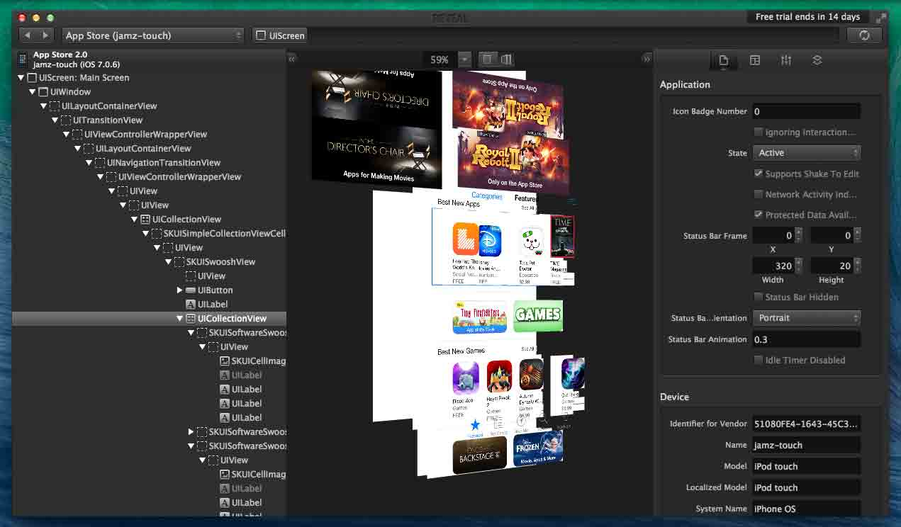
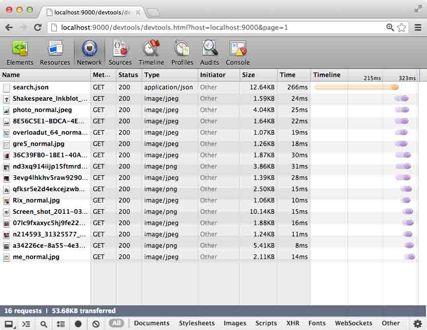
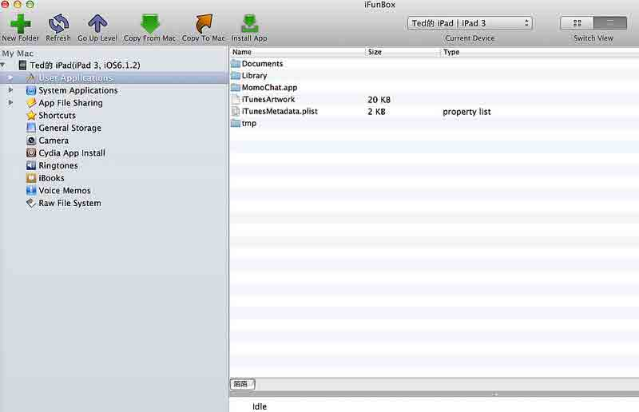
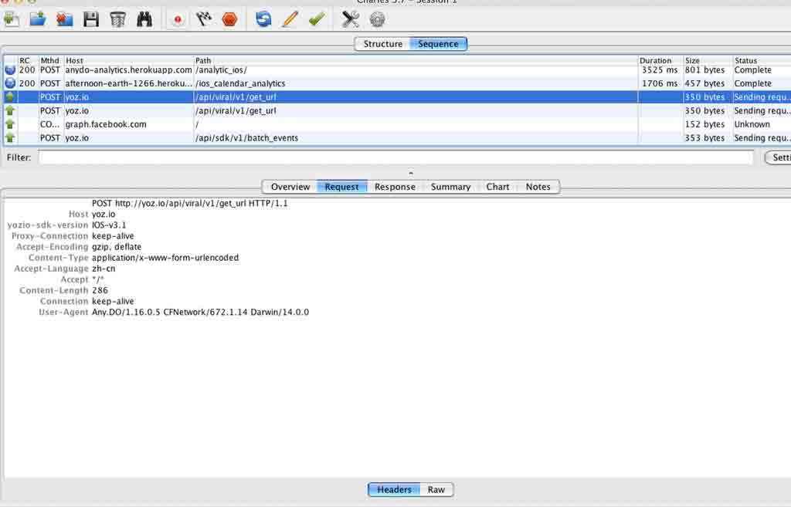
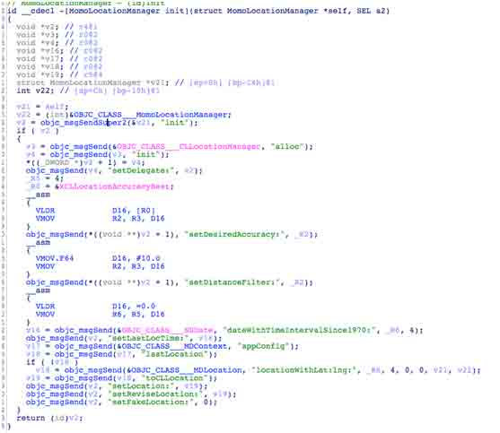
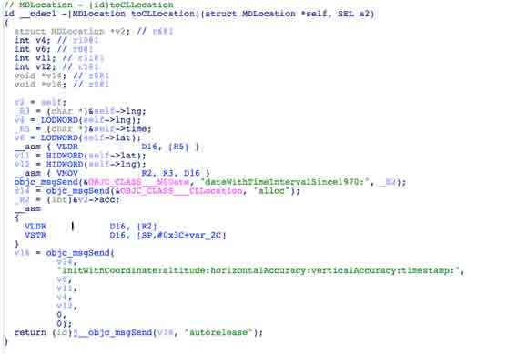

# 一、iOS 逆向工程简介

# iOS 逆向工程简介

# 1.1 介绍

本系列文章将对 iOS 逆向工程的基本流程，以及涉及到的工具进行简要的介绍。

维基百科对逆向工程的定义如下：

> 逆向工程（又称反向工程），是一种技术过程，即对一项目标产品进行逆向分析及研究，从而演绎并得出该产品的处理流程、组织结构、功能性能规格等设计要素，以制作出功能相近，但又不完全一样的产品。逆向工程源于商业及军事领域中的硬件分析。

需要逆向工程的原因如下：

> *   接口设计。由于互操作性，逆向工程被用来找出系统之间的协作协议。
> *   军事或商业机密。窃取敌人或竞争对手的最新研究或产品原型。
> *   学术／学习目的。
> *   去除复制保护和伪装的登录权限。
> *   产品分析：用于调查产品的运作方式，识别潜在的侵权行为。

写本系列文章是让开发者了解攻击者能够做的事情，“未知攻，焉知防”。目的是让开发者能够针对这些攻击、破解行为，更好的设计和编码，提供 iOS 应用的安全性。

* * *

[#1 iOS 逆向工程简介下的更多文章](http://security.ios-wiki.com/issue-1/)

# 1.2 iOS 逆向工程的作用

对于 iOS App 开发者来说，只是完成产品的需求是远远不够的，需要考虑安全方面的问题。

对于微信、陌陌、来往、QQ、WhatsApp 等 IM 工具，我们需要关注其在本地是否保存聊天信息、联系人; 对于电商类 App，我们需要关注交易环节是否安全，网络请求是否安全；对这些关键环节的安全上的评估，就需要用到 iOS 逆向工程。

对于需要用户注册和登录的应用来说，用户的密码是如何在网络上传输的、在本地是否保存明文密码、聊天信息、联系人，这些都可以通过逆向工程的手段来进行分析。

iOS 逆向工程，就是拿到应用的关键信息，基于这些信息的用途，可以有如下的分类；

> *   安全审计
> *   分析恶意软件
> *   借鉴别人的软件
> *   破解使用限制

## 安全审计

一般大公司都会有相应的安全团队，会负责各个业务的安全问题，也会对 iOS App 的安全性进行内部的审计和分析，及早发现和反馈，以便开发团队的同学能够及早修正问题。

## 分析恶意软件

这种一般是对安全特别感兴趣或者是杀毒软件公司，会对恶意软件进行分析，以便发出预警，避免用户中招。

## 借鉴别人的软件

有时候想了解下别人用的第 3 方库有哪些，甚至关键地方是如何实现的，特别是对于越狱后的某些应用，想了解其实现原理，就需要用到逆向工程。

## 破解使用限制

通过逆向工程，可以分析出软件使用限制所利用的机制，能够对关键的地方打补丁，破解相应的使用限制。这种在 Windows 平台上存在很久。比如最近有些文章，介绍如何破解 Reveal 的使用限制、去掉过期的弹框等文章，就用到了 iOS 逆向工程的相关知识。

* * *

[#1 iOS 逆向工程简介下的更多文章](http://security.ios-wiki.com/issue-1/)

# 1.3 iOS 逆向工程的 2 种分析方法

对 iOS 应用进行逆向分析的方法可以大致分为两类：

*   静态分析（static analyze）
*   动态分析（dynamic analyze）

### 静态分析

顾名思义，静态分析法是在不执行 iOS 应用的情形下，对应用进行静态分析的一种方法。比如获取应用的文件系统结构，本地文件的分析、使用反汇编工具（Disassembler，比如 IDA）查看内部代码，分析代码结构也是静态分析。

### 动态分析

动态分析法是在 iOS 应用的执行过程中进行动态分析的一种方法，通过调试来分析代码，获得内存的状态等等。通过动态分析法，可以在观察应用的文件、网络等。动态分析中还常使用调试器（Debugger，比如 gdb）分析应用的内部结构与原理。甚至可以使用工具（比如 Cycript，后面会详细介绍该工具）动态修改内存，给内存打补丁。

在进行 iOS 逆向工程的时候，建议两种方法都采用，通常是先静态分析下收集应用的相关信息，然后使用动态分析获得进一步的信息。灵活的使用这两种方法，可以大大提供分析效率。

* * *

[#1 iOS 逆向工程简介下的更多文章](http://security.ios-wiki.com/issue-1/)

# 1.4 iOS 逆向工程用到的工具简介

要进行 iOS 逆向工程，建议掌握 iOS 应用的开发相关知识，相信看本文的读者应该都具备。 进行 iOS 逆向工程的一个关键就是工具的使用，工欲善其事，必先利其器。用好工具可以事半功倍。甚至可以做之前可能根本没想到能够做的事情。

这里介绍的工具可以分为如下几类：

*   UI 分析工具
*   文件系统查看工具
*   数据库查看工具
*   网络分析工具
*   逆向程序开发工具
*   反汇编工具
*   调试器

### UI 分析工具

UI 分析工具是对 iOS 应用的 UI 进行分析的工具，有[Reveal](http://revealapp.com/)和[PonyDebugger](https://github.com/square/PonyDebugger)等。

> Reveal 能够在运行时调试和修改 iOS 应用程序。它能连接到应用程序，并允许开发者编辑各种用户界面参数，这反过来会立即反应在程序的 UI 上。就像用 FireBug 调试 HTML 页面一样，在不需要重写代码、重新构建和重新部署应用程序的情况下就能够调试和修改 iOS 用户界面。 --[InfoQ](http://www.infoq.com/cn/news/2013/07/debug_ios_apps_with_reveal)

使用 Reveal 的效果如图：

使用 PonyDebugger 的效果如图：

### 文件系统查看工具

在 iOS 设备上可以安装[iExplorer](http://www.macroplant.com/iexplorer/), [iFunbox](http://www.i-funbox.com/cn/ifunboxmac/), [iTool](http://www.itools.cn/itoolsmacjiantibanxiazai)等工具，可以查看 iOS 应用的文件系统结构。

使用 iFunbox 打开陌陌的文件目录，如下图所示：

### 网络分析工具

使用 Tcpdump, WireShark, Charles 等工具可以对应用的网络数据进行分析。

使用 Charles 对网络数据包进行分析的示意图：

### 逆向程序开发工具

开发越狱程序和日常开发的 iOS 程序很相似，不过，越狱程序能做更强大的事情。你的设备越狱之后，你就能够 hook 进 Apple 提供的几乎所有的 class，来控制 iPhone/iPad 的功能。

[Theos](http://iphonedevwiki.net/index.php/Theos/Getting_Started)大幅简化了编写越狱程序的流程，后面会对该工具进行详细的介绍。

### 反汇编工具

[IDA Pro](https://www.hex-rays.com/products/ida/)是一款非常强大的反汇编工具，甚至能够将汇编代码转换成近似于源码的伪代码。

如下图所示[[1]](http://bbs.pediy.com/showthread.php?t=185218)：

可以看到，基本上相当于源码。

### 调试器

在 iOS 逆向工程中，可以使用 gdb 来对 iOS 应用进行动态分析，进行单步调试，也可以使用[Cycript](http://www.cycript.org/)来对 iOS 进行动态分析。
本文简要介绍了 iOS 逆向工程要用到的工具，后面的文章会对用到的工具做进一步的介绍。

* * *

[#1 iOS 逆向工程简介下的更多文章](http://security.ios-wiki.com/issue-1/)

# 1.5 小结

这一章节对 iOS 逆向工程的概念、动机、以及涉及到的工具进行简要的介绍。后面的章节会进行详细的介绍。

* * *

[#1 iOS 逆向工程简介下的更多文章](http://security.ios-wiki.com/issue-1/)