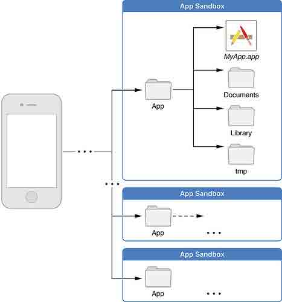

# 二、iOS 文件目录及程序类型

# iOS 文件目录及程序类型

# 2.1 iOS 文件目录结构

出于安全考虑，iOS 系统把每个应用以及数据都放到一个沙盒（sandbox）里面，应用只能访问自己沙盒目录里面的文件、网络资源等（也有例外，比如系统通讯录、照相机、照片等能在用户授权的情况下被第三方应用访问）[[1]](https://developer.apple.com/library/ios/documentation/iphone/conceptual/iphoneosprogrammingguide/TheiOSEnvironment/TheiOSEnvironment.html)。

请注意，使用沙盒的目的是为了防止被攻击的应用危害到系统或者其他应用，它并不能阻止应用本身被攻击，因此，开发者需要防御式的编程来避免应用被攻击。苹果官方是这样说的：

> Important: The purpose of a sandbox is to limit the damage that a compromised app can cause to the system. Sandboxes do not prevent attacks from happening to a particular app and it is still your responsibility to code defensively to prevent attacks. For example, if your app does not validate user input and there is an exploitable buffer overflow in your input-handling code, an attacker could still hijack your app or cause it to crash. The sandbox only prevents the hijacked app from affecting other apps and other parts of the system.

为了便于应用组织数据，每个沙盒内都有几个名字固定的子目录用来保存文件，下图是沙盒的目录结构：



主要有 4 个目录[[2]](https://developer.apple.com/library/mac/documentation/FileManagement/Conceptual/FileSystemProgrammingGuide/FileSystemOverview/FileSystemOverview.html)：

> *   MyApp.app
>     该目录包含了应用程序本身的数据，程序打包的时候的资源文件和一些本地文件就是存放在这个目录下的。 程序的可执行程序、plist 文件也在这个目录下。
>     这个目录不会被 iTunes 同步
>     
>     
> *   Documents 使用这个目录来保存关键数据。关键数据指那些应用不可再生的数据。
>     这个目录会被 iTunes 同步
>     
>     
> *   Library 用来保存一些配置文件和其他一些文件。其中使用 NSUserDefaults 写的设置数据都会保存到 Library/Preferences 目录下的一个 plist 文件中。Library/Caches 可以用来保存可再生的数据，比如网络请求，用户需要负责删除对应文件。
>     这个目录（除了 Library/Caches 外）会被 iTunes 同步
>     
>     
> *   tmp
>     使用这个目录来保存各种应用下次启动不再需要的临时文件。当应用不再需要这些文件的时候，需要主动将其删除。（当应用不再运行的时候，系统可能会将此目录清空。）
>     这个目录不会被 iTunes 同步

### 获取主要目录路径的方式

#### 沙盒目录

```
NSLog(@"%@",NSHomeDirectory()); 
```

#### MyApp.app

```
NSLog(@"%@",[[NSBundle mainBundle] bundlePath]); 
```

#### tmp

```
NSLog(@"%@",NSTemporaryDirectory()); 
```

#### Documents

```
NSArray *paths = NSSearchPathForDirectoriesInDomains(NSDocumentDirectory, NSUserDomainMask, YES);
NSString *docPath = [paths objectAtIndex:0];
NSLog(@"%@",docPath); 
```

#### Library

```
NSArray *paths = NSSearchPathForDirectoriesInDomains(NSLibraryDirectory, NSUserDomainMask, YES);
NSString *libPath = [paths objectAtIndex:0];
NSLog(@"%@",libPath); 
```

* * *

[#2 iOS 文件系统及程序类型下的更多文章](http://security.ios-wiki.com/issue-2/)

# 2.2 iOS 程序类型

iOS 程序类型分为 3 类：Application, Dynamic Library，后台 Daemon。

在越狱的设备上才会遇到需要开发后面两种类型程序的情况。

### Application

平时我们开发提交到 App Store 的应用即是 Application，设备没有越狱的情况下，应用只能访问沙盒内存文件和数据。

### Dynamic Library

Dynamic Library(动态链接库)，在其他平台很常见，比如 Windows 平台的 DLL。苹果官方做了限制，所以在非越狱的情况下，需要提交到 App Store 的应用是不能包含动态链接库的，否则无法通过审核（Review）

后面要介绍的越狱程序（Tweak）开发，就是动态链接库。我们开发的大部分越狱程序，都是编译成动态链接库，然后通过越狱平台的[MobileSubstrate](http://iphonedevwiki.net/index.php/MobileSubstrate)（iOS7 上叫[CydiaSubstrate](http://www.cydiasubstrate.com/)）来加载进入目标程序（Target），通过对目标程序的挂钩（Hook），来实现相应的功能。

后面会详细介绍越狱程序开发的原理，会对这个细节做进一步的介绍。

### 后台 Daemon

后台 Daemon 类似于 Windows 的 Service。对于 Application 来说，切换到 Home 就会暂停运行，而 Daemon 会在后台运行。在越狱设备上，之前用来拦截垃圾短信和电话的工具都是运行在后台的 Daemon。

* * *

[#2 iOS 文件系统及程序类型下的更多文章](http://security.ios-wiki.com/issue-2/)

# 2.3 小结

本章简要介绍了 iOS 应用的文件系统结构和 iOS 程序类型，了解这些基础知识能够有利于后续进行文件系统相关的分析，以及编写越狱程序（Tweak）。

* * *

[#2 iOS 文件系统及程序类型下的更多文章](http://security.ios-wiki.com/issue-2/)