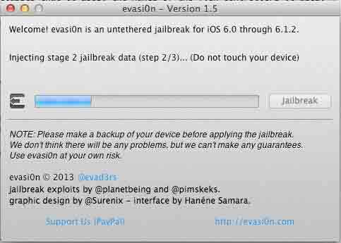
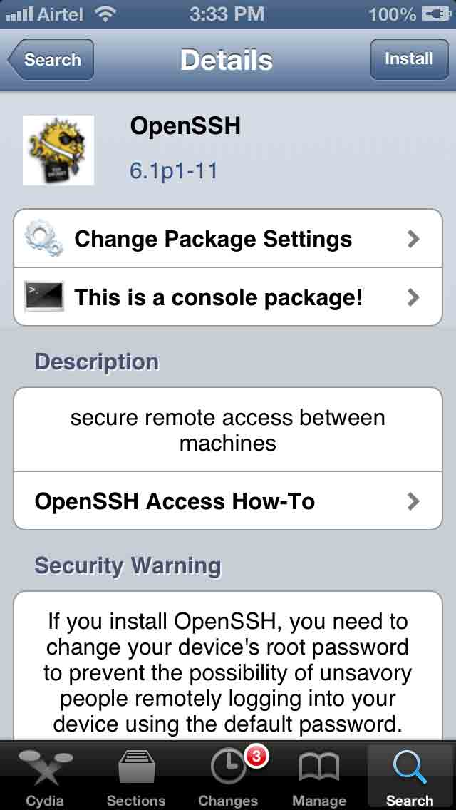

# 四、iOS 设备上的工具

# iOS 设备上的工具

# 4.1 iOS 设备越狱

### 引言

本节将简要介绍 iOS 设备越狱的步骤。

### 越狱你的设备

如果你真的对 iOS 安全很感兴趣，有一个越狱设备是非常有必要的。在本节，我们将介绍如何越狱 iOS 设备。越狱之后有很多好处，你可以安装很多工具，例如 nmap, metasploit，甚至在设备上运行自己写的 python 代码。

越狱非常简单，下载一个越狱软件，然后点击越狱就可以了。如果你的设备运行的是 iOS 6.x 到 iOS 7.0.6 的系统，推荐你使用[evasi0n](http://evasi0n.com/)，如果你的设备运行的是 iOS 5.x，那推荐用[redsn0w](http://www.redsn0w.us/)。

目前 iOS 7.1 到 iOS 7.1.1 已经能越狱，但是越狱方法还没有公布出来，应该要 iOS 8 发布之后，才会公布。

请注意，在越狱之前，一定要先用 iTunes 或者 iCloud 备份一下，这样即使出错，你也能够恢复你的数据。

请注意：以下越狱部分的介绍来自[这里](http://wufawei.com/2013/11/ios-application-security-1/)

本文将对我的 new iPad （3 代，运行 iOS 6.0.1）越狱。一旦你下载 evasi0n 并运行，它就会自动检测设备并且告诉你这个设备是否可以越狱。 如图：


你需要做的仅仅是点击 jailbeak(越狱)，然后让 evasi0n 做剩下的事情。


你可以看到，越狱已经开始了。过一段时间之后，evasi0n 将会重启设备，然后运行 exploit（利用程序）。 

一旦利用程序（exploit）运行完毕，它就会安装 Cydia 和 Cydia 的包列表到设备上。Cydia 是一个图形界面，使得你能在越狱设备上下载和安装软件包和应用，这些应用通常你在 App store 是找不到的。基本上所有的越狱程序都会默认安装 Cydia。你可以认为 Cydia 就是越狱设备上的 App Store。


等待一段时间，直到你得到下面的提示。


解锁你的设备，你可以看到桌面上有个新的 app 图标，叫做 Jailbreak。点击它以完成越狱过程。


你可以看到你的设备将会重启。请耐心等待这个过程的完成。一旦设备完成重启，你可以看到一个叫做 Cydia 的新 app 在桌面上。这个就表明你已经成功越狱。

祝贺你，你已经在 iOS hacking 领域跨出了第一步。

### 小结

本文简要介绍了如何对 iOS 设备越狱，并且以 iOS 6 为例，我手头没有可以越狱的 iOS 7 设备，因此，这里没有介绍，步骤其实也类似。后续 iOS7.1.1 可以越狱了，这里再更新下教程。

越狱需谨慎，请一定备份数据。

对于普通用户，从安全的角度考虑，**建议不要越狱**。

* * *

[#4 iOS 设备上的工具下的更多文章](http://security.ios-wiki.com/issue-4/)

# 4.2 搭建移动渗透测试平台

上一节我们介绍了如何对 iOS 设备越狱。 现在你已经完成了设备的越狱，那么下一步就是安装一些重要的命令行工具，例如 wget, ps, apt-get 等用来审计 iOS 应用的工具。第一个要安装的就是 OpenSSH。安装这个工具可以让你从 mac 登录进越狱设备。

**（请注意，以下文字来自我之前翻译的[文章](http://wufawei.com/2013/11/ios-application-security-1/)，原作者是：Prateek Gianchandani）**

进入 Cydia，点击底部的搜索 tab，然后搜索：OpenSSH.


点击 OpenSSH，然后点击安装，



然后 OpenSSH 就会安装在你的设备上。 在我们用 ssh 登录进设备之前，我们 还需要安装其他一些命令行工具。几乎所有流行的黑客工具都可以在 BigBoss Recommendation tools 这个包中找到。安装 BigBoss Recommendation tools，在 Cydia 中搜索，然后点击安装。


有些重要的命令行工具例如: APT 0.6 Transitional, Git, GNU Debugger, less, make, unzip, wget 和 SQLite 3.x 会被安装好。

还有一个工具需要被安装: MobileTerminal，它能够让你在设备上直接运行命令行，而不是需要通过 ssh 登录设备运行命令。

在 Cydia 上搜索 MobileTerminal,然后安装。


一旦安装好 MobileTerminal,你就可以在桌面上看到一个新的 app 图标，名字叫做 Terminal.


点击它，你可以得到一个终端，试试运行几个 Unix 命令。在这里，我们简单的用 ps 列举下正在运行的进程。


你可以看到，ps 这个命令成功执行。

让我们看看我们是否能够通过 ssh 登录进这个越狱设备。确保你的电脑和越狱设备连接在同一个网络，找到越狱设备的 IP 地址。为了找到设备的 IP 地址，到设置（settings）- WiFi 中选择设备现在连接的网络。


可以看到，IP 地址是 192.168.2.3。让我们试试以 root 用户登录进去。在命令行中运行如下命令。root 的默认密码是：alpine。推荐的做法是：一旦你安装好了 OpenSSH, 马上改掉 root 的默认密码。这是因为有些恶意软件利用默认的用户名和密码登录进入设备[注 1]。为了改密码，在 ssh 登录上之后，在命令行输入 passwd 这个命令，然后输入 2 次新密码。然后你的 root 秘密就已修改了。这一系列命令可以参见下图：


备注：确保在运行时，Cydia 在后台运行而不是在前台。这是因为 Cydia 以 root 运行，因此，如果 Cydia 在前台，而此时我们需要 lock 一个进程，而恰好此时该进程被 Cydia lock，命令就不会运行成功。

运行一下 apt-get update, 获得最新的包列表


### 小结

本文我们学习了如何越狱设备上搭建移动渗透测试平台，介绍了如何安装需要用到的工具。

[注 1]，在 iPhone 上的第一个蠕虫，ikee 利用了默认的密码，具体参见对 ikee 的详细分析报告：[An Analysis of the iKeeB (duh) iPhone botnet (Worm)](http://mtc.sri.com/iPhone/)

* * *

[#4 iOS 设备上的工具下的更多文章](http://security.ios-wiki.com/issue-4/)

# 4.3 Clutch：iOS 应用破解工具

如果你直接从 iOS 设备上导出从 App Store 下载的应用的 IPA 包，你会发现其内容是加密过的。

App Store 上的应用都使用了[FairPlay DRM](http://en.wikipedia.org/wiki/FairPlay)数字版权加密保护技术。

我们要对文件进行反汇编，而 IPA 都是加密的，哪怎么办呢？

可以使用 Clutch 工具。

不管应用如何加密，在其运行的时候，它总要解密，所以，Clutch 等破解工具，就是把应用运行时的内存数据按照一定格式导出。

Clutch 开源，代码在[这里](https://github.com/KJCracks/Clutch)，你也可以直接下载它的[Release 程序](https://github.com/KJCracks/Clutch/releases)。

下载 Clutch 之后，利用前面介绍的 iFunbox 等工具把这个文件拷贝到越狱之后的 iOS 设备上的/usr/bin 目录下。

然后，在 Mac 上打开命令行，输入命令：

```
ssh root@192.168.0.101 
```

然后输入秘密，就可以连上你的 iOS 设备了。越狱之后，默认秘密是**alpine**。

请在登录进去之后，输入命令**passwd**更改。

入图： 

请注意，上面的 ip 应该替换成你的 iOS 设备的 IP。

在命令行中输入 Clutch 看看，如下图：


选择你要破解的应用的名称，这里的名称是上图中输入 Clutch 之后显示那些名称。

比如：

```
Clutch Airbnb 
```

如下图所示：


可以看到，成功破解应用，你可以把这个破解后的文件从 iOS 设备上拷贝到你的 Mac 上做后续的分析了。

### 小结

本文简要介绍了 Clutch 的作用和用法，利用 Clutch 可以很方便的破解应用。

* * *

[#4 iOS 设备上的工具下的更多文章](http://security.ios-wiki.com/issue-4/)

# 4.4 GDB 简介

所有发布的 iOS 设备都是基于 ARM 架构的。我们开发 iOS 应用的时候编写的 Objective-C 代码会首先转换成 ARM 汇编，然后转换成机器指令。对 ARM 汇编语言和使用 GDB 调试有很好掌握的话，攻击者是能够在运行时解密 Objective-C 代码甚至修改代码的。

#### 下载

你可以到这里[`code.google.com/p/apiexplorer/downloads/detail?name=gdb-1821.deb`](https://code.google.com/p/apiexplorer/downloads/detail?name=gdb-1821.deb) 下载到你的 Mac 上，然后使用 iFunbox 拷贝到你越狱之后的 iOS 设备上。

然后 SSH 进 iOS 设备：


转到 gdb-1821.deb 所在的文件夹，然后执行：

```
dpkg -i gdb-1821.deb 
```

如图：


#### 用法简介

请注意，请先点击要分析的 App，使得 App 处于运行状态。然后在命令行输入命令：

```
ps aux 
```

可以得到正在运行的 App 的 pid 等信息。你也可以过滤出你想要的信息，比如：

```
ps aux | grep 'Momo' 
```

可以得到你要分析的应用（如 Momo）的 pid。如下图所示： 

然后输入：

```
gdb --pid 5413 (你的 pid 可能跟这不同，请注意替换) 
```

这样你就挂钩进 App 了。一旦 GDB 挂钩进了这个应用，你会注意到这个应用目前是在暂停状态。你可以用 c 命令让这个应用继续执行, 如图：


不过在继续执行之前，让我们先做些调查。和任何其它架构一样，ARM 中的内存也被分为寄存器（register）。所有的寄存器都是 32 位的（iOS 7 中是 64 位的），并且它们的目的就是保存数据。你可以使用 info registers 命令来查看关于这些寄存器的信息。


请注意这个命令并没有把 ARM 中的所有寄存器都打印出来。要打印所有的寄存器，使用 info all-registers 命令。

有如下 info 命令：


执行下 info stack 试试：


要导出汇编信息，使用 disassemble 或者 disas 命令。这会给出后续几条指令的一些汇编信息。我们通过在 disas 命令后面提供函数名称来导出某个特定函数的汇编。例如要导出 main 函数的汇编，使用命令

```
disas 
```

或者

```
disassemble 
```

如下图：


#### 小结

本节我们简要介绍了如何安装和加载 GDB，后面会在关于对 iOS 应用进行动态分析的章节会详细介绍其用法。

* * *

[#4 iOS 设备上的工具下的更多文章](http://security.ios-wiki.com/issue-4/)

# 4.5 Cycript 简介以及绕过屏幕解锁密码

### 简介

Cycript 是一个理解 Objective-C 语法的 javascript 解释器，这意味着我们能够在一个命令中用 Objective-C 或者 javascript，甚至 2 者兼用。它能够挂钩正在运行的进程，能够在运行时修改应用的很多东西。

使用 Cycript 有如下好处：

*   1.我们能够挂钩正在运行的进程，并且找出正被使用的类信息，例如 view controllers，内部和第 3 方库，甚至程序的 delegate 的名称。
*   2.对于一个特定的类，例如 View Controller, App delegate 或者任何其他的类，我们能够得到所有被使用的方法名称。
*   3.我们能够得到所有实例变量的名称和在程序运行的任意时刻实例变量的值。
*   4.我们能够在运行时修改实例变量的值。
*   5.我们能够执行 Method Swizzling，例如替换一个特定方法的实现。
*   6.我们可以在运行时调用任意方法，即使这个方法目前并不在应用的实际代码当中。

### 安装 Cycript

Cycript 的官网在[`www.cycript.org/`](http://www.cycript.org/)，最新版本是 0.9.501。 在 iOS 越狱设备上，默认就有这个工具(参见[这里](http://0oneo.me/blog/2014/03/02/how-to-install-cycript/) 和 [这里](http://www.cycript.org/manual/))，在 iOS 的命令行输入

```
cycript 
```

即可。如果你遇到问题，可以在 Cydia 中把模式切换成开发者，然后搜索 Cycript，从 Cydia 中安装一下。

当然，你直接从网站上下载到 Mac 上，然后在上传到 iOS 设备上也行。

### 用法举例

下面我们介绍 Cycript 的用法： 首先用命令

```
ps aux 
```

找到要分析的应用的 pid，然后用命令：

```
cycript -pid xxx 
```

如下图所示：


然后你可以输入 ObjectiveC 的语法，比如：

```
 [UIApplication sharedApplication] 
```

在 Cycrit 下：

```
UIApp  和 [UIApplication sharedApplication] 等效 
```

你甚至可以改提示数字了。此时按 Home，让应用切到后台，然后输入如下的命令：

```
UIApp.applicationIconBadgeNumber=100 
```

效果如图：


```
UIApp.applicationIconBadgeNumber=200 
```

效果如图：


### 使用 Cycript 绕过屏幕解锁密码

首先，请确保你的 iOS 设备设置了锁屏密码，然后请锁屏待机。

然后在你的 Mac 上 ssh 进你的 iOS 设备，

```
ssh root@your_ios_device_ip 
```

然后执行如下命令：

```
cycript -p SpringBoard 
```

然后输入：

```
SBAwayController.sharedAwayController 
```

如下所示：

```
Tedteki-iPad:~ root# cycript -p SpringBoard
cy# SBAwayController.sharedAwayController
#"<SBAwayController: 0x1d99aaa0> <SBActivationContext: 0x1d99adf0> activate:  deactivate: " 
```

我们向要打印一个类的所有方法，可以使用[Cycript Tricks](http://iphonedevwiki.net/index.php/Cycript_Tricks)中的 printMethods。

继续输入：

```
function printMethods(className) {
  var count = new new Type("I");
  var methods = class_copyMethodList(objc_getClass(className), count);
  var methodsArray = [];
  for(var i = 0; i < *count; i++) {
    var method = methods[i];
    methodsArray.push({selector:method_getName(method), implementation:method_getImplementation(method)});
  }
  free(methods);
  free(count);
  return methodsArray;
} 
```

然后在命令行中执行：

```
printMethods(SBAwayController) 
```

可以得到如下图所示的信息：


从图中可以发现这个方法：

```
{selector:@selector(unlockWithSound:bypassPinLock:),implementation:0x10d6e9} 
```

即方法：

```
-(void)unlockWithSound:(BOOL)arg1 bypassPinLock:(BOOL)arg2; 
```

如下图：


在 cycript 中的输入：

```
[SBAwayController.sharedAwayController unlockWithSound:1 bypassPinLock:1] 
```

你的 iOS 设备就实现了无密码解锁。

### 小结

Cycript 功能非常强大，能够在运行时对 iOS 应用做修改，我们会在后面的章节详细介绍更多用法。

* * *

[#4 iOS 设备上的工具下的更多文章](http://security.ios-wiki.com/issue-4/)

# 4.6 Snoop-it 简介

## 引言

在前面的文章中我们介绍了如何用 class-dump-z 来导出 iOS 应用的类信息，如何利用 Cycript 挂钩进程、执行运行时操纵和 method swizzling，用 gdb 分析 app 的流程。 然而，可能有更好的方式能够做这些事。如果能够有一个工具能够做所有这些事情并且能够更好的展示这些信息就太好了。

Snoop-it 就是这样一个 tool。它允许我们进行运行时分析和对 iOS 应用进行黑盒安全评估。它提供一个非常简洁的 web 界面。在写本文的时候，Snoop-it 还没正式发布，我给作者写了邮件， 他们非常友好的提供给我一个 beta 版本做测试。你可以到它的[官网](https://code.google.com/p/snoop-it/)查看或者你可以在[Twitter](http://twitter.com/aykay/)上关注作者。

Snoop-it 提供的功能可以从对其[官方地址](https://code.google.com/p/snoop-it/)的截图看到。


## 安装

（备注：目前已经可以通过在 Cydia 上添加源、然后直接下载安装了。） 要安装 Snoop-it 到你的设备上。你不得不下载 deb 包，然后用 sftp 上传到你的设备上。在命令行下用命令 dpkg -i [packageName]来安装 Snoop-it 到你的设备上。 一旦安装完成，重启你的设备。


一旦安装完成，你会看到 Snoop-it 的图标，点击它，你可以看到如下的界面。


到设置中按你所需配置。在这里，我们选择端口为 12345，并且关闭验证。如果你所在的网络有许多其他用户，或者比较调皮的用户，建议你还是开启验证。


现在，用 Snoop-it 提供的地址打开 Snoop-it 的 Web 界面。在我这，地址是：[`10.0.1.79:12345`](http://10.0.1.79:12345)


你将看到这个 Web 界面。如果你读一下，会发现它让你在 Snoop-it 中选择你要分析的应用，在应用中打开要分析的应用，然后刷新这个 Web 界面。现在回到 Snoop-it，选择我们要分析的应用，在我这，我将要选择 MethodSwizzlingDemo 应用，和上一篇文章用的应用一样。


请确保要分析的应用已经打开并保持在前台，现在刷新 Snoop-it 的 Web 界面。


正如你看到的，现在你有一个很漂亮的界面，现在你可以对这个应用进行详尽的安全评估了。

## 分析

在左边，在 Analysis 下面，点击 Objective-C Classes。在右边你就看到所有的类信息，比如属性和方法名称。


橘子色的代表有实例的类。例如，当你把鼠标从 ViewController 的类上面移动的时候，你会看到一个类实例的信息。


类似的，那可以看到 AppDelegate 的方法和属性。


回到 View Controller 上面来，我们可以通过 Snoop-it 调用方法。点击右上角的 Setup and Invoke。正如我们在上一篇文章中提到的那样，使用这个方法，我们能够绕过这个应用 的验证。


选择对应的实例（这里只有 1 个实例，但是如果 view controller 被复用，那么就可能会有多个实例），点击 Invoke Method.


这样我们就调用了对应的方法，并且绕过了程序的验证。


Snoop-it 的另一个牛逼功能是我们可以切换到任意的 view controller。例如，在左边的 Analysis 下面，选择 View Controller，选择右边的 view controller，然后点击 Display Controller. 你就能够切换到那个 view controller。你也可以根据这个 View Controller 是否在另一个 View controller 上面来决定点击 Close/Hide View Controller。


你能够通过点击 Reset display 返回。这个功能能够让我们把 view controller 与对应的 view 关联起来。我太喜欢 Snoop-it 的这个功能了。

## 运行时修改

Snoop-it 支持多种运行时修改，包括修改你的硬件标识符比如 Mac 地址，UDID，设备模型号等等。


你还可以弄个假地址。这个对于那些利用 GeoEncrytion 来保护它们数据的应用来说 非常有用。


而且，你还可以跟踪方法和系统调用的流程。请注意，你需要每隔几秒在方法调用后点击最上面的 Refresh 刷新一下。请注意，因为我们在 beta 版本上测试，可能作者会改变这个行为使得我们不必每隔几秒就点击刷新按钮。对有些用户来说，这些信息可能太多，但是对于像我一样已经开发过多年 iOS 程序的人来说这些信息是相当简单直接的。


## 监控

Snoop-it 允许你查看哪些文件和目录目前正被应用访问。为了达到这个目的，请点击 Monitoring 下面的 Filesystem.这个功能特别有用，尤其是当应用正在往 db 写数据的时候，这个功能能够让你找出 db 文件的名字。你也可以双击它们，然后下载到你的机器上再分析。


你也可以看到应用调用的敏感 API。比如在地址簿查找信息，访问 camera，或者访问设备的 UDID。下面是预装的 App Store 应用访问的敏感 API


我们也可以看到这个应用存在 keychain 的所有信息。它也会列出所有通过 NSURLConnection 访问的 HTTP 请求。这两个功能都可以在 monitoring 下面看到。我把这些功能留给读者你去尝试。 我们将在另一篇文章中介绍如何从 keychain 中 dump 出数据。

你会很高兴的知道 Snoop-it 有公共的 API，所以我们能够利用它来编写自动化测试或者编写我们自己的用户界面。关于 XML-RPC web service API 的文档可以在[官网](http://code.google.com/p/snoop-it/wiki/)找到。

## 总结

本文我们学习了如何使用 Snoop-it 来进行运行时分析和对 iOS apps 进行黑盒安全评估。 Snoop-it 离发布还有几个星期的时间，尽管你可以像我一样向作者发邮件索要 beta 版本。 有一个我特别想要 Snoop-it 添加的功能就是执行 Method Swizzling。我确信 Snoop-it 对于任何对 iOS 应用的安全分析感兴趣的人都是一个好工具，并且它会变得越来越好。

（注：已经发布了，可以在 Cydia 上下载，需要先添加源，具体参见其官方网站）

本文原文是 `wufawei.com/2013/11/ios-application-security-9/`

* * *

[#4 iOS 设备上的工具下的更多文章](http://security.ios-wiki.com/issue-4/)

# 4.7 小结

本章我们介绍了 iOS 设备如何越狱和搭建渗透移动测试环境，并简要介绍了如何安装 GDG 和 Cycript 等工具，后面会对其用法进行更详细的介绍。

* * *

[#4 iOS 设备上的工具下的更多文章](http://security.ios-wiki.com/issue-4/)