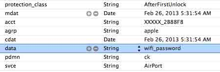
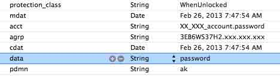
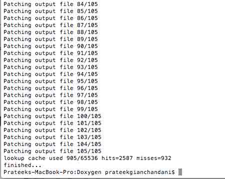

# 五、iOS 应用静态分析

# iOS 应用静态分析

# 5.1 本地文件系统取证

## 引言

我们将在本文分析 iOS 的文件系统，了解其目录是如何组织的，查看一些重要的文件，然后看看如何才能够从数据库文件和 plist 文件导出数据。我们将学习应用是如何在特定目录（沙盒）内存放数据的，以及怎样才能提取这些数据。

有一个很重要的事情需要注意，在前面的文章中，我们都是以 root 身份登录进设备的。设备上有另一个用户名叫 mobile, 一个 mobile 用户拥有的权限是少于 root 用户的。除了 Cydia 和少数的应用以 root 权限应用之外，其他应用都是以 mobile 的身份应用的。有些苹果内部的 daemon 服务也以 root 权限运行。执行 ps aux 就可以查看清楚。在最左边，我们可以看到用户列。可以看到 Cydia 以 root 身份运行，所有其他应用都以 mobile 身份运行， 例如/Applications/AppStore.app/AppStore，有些 demon 也以 root 身份运行，如/usr/sbin/wifid。一些你通过 Cydia 安装的应用也可能会以 root 身份运行。 一旦你的设备一越狱，默认 root 和 mobile 的密码都是 alpine.


可以配置一个应用以 root 权限运行。你可以看看 Stack Overflow 上的[这篇文章](http://stackoverflow.com/questions/7841344/gaining-root-permissions-on-ios-for-nsfilemanager-jailbreak/8796556#8796556)来了解更多细节。

我们 ssh 进设备。到/Applications 目录。你可以在该文件夹下看到一些应用。它们中的大多是都是 iOS 预装的，有些应用是通过 Cydia 安装的，比如 Ternimal 应用。请注意，所有运行在/Applications 的应用并不运行在沙盒环境，而所有在/var/mobile/Applications 目录下的应用都运行在一个沙盒环境下。文章后面会讨论沙盒。不过，它们默认依然以 mobile 用户运行，除非专门做了配置。


所有从 App Store 下载的应用都位于/var/mobile/Applications 目录。这个目录也包含用 installipa 或者其他外部源如 Cydia 安装的应用。所有这些应用都运行在沙盒环境下。


请注意，从 iOS4 及以后，每个应用都驻留的环境叫做沙盒(Sandbox)。这样做的主要目的是不允许应用访问它自己沙盒外的任何数据。这样做会更安全。不过，应用用合适的权限是可以访问用户某些特定的用户数据的。例如要用户允许去访问联系人，照片等等。不过，对这些也有不少争论。 例如从 iOS6 开始，应用在得到用户允许之后才能访问用户的联系人。在这之前，应用不需要获得任何权限就能访问用户的联系人，这导致了较大的[争议](http://arstechnica.com/gadgets/2012/02/path-addresses-privacy-controversy-but-social-apps-remain-a-risk-to-users/)，例如 Path 应用。

通过使用 Entitlements，你可以访问沙盒外的好些东西。你可以读读这里的[文档](http://developer.apple.com/library/ios/)。例如，要获得一个用户的 calender 的读权限，.entitlements 文件中的 entitlement key com.apple.security.personal-information.calendars 必须标志为 YES。

让我们看看某个特定应用的目录结构。首先到 Snapchat 的目录看看。对于所有应用都是类似的结构。


*   Snapchat.app(应用名称.app)文件夹包含所有的资源文件(images)，plist 文件和应用的二进制文件。
*   Documents 目录用于存放任意文件。相对于应用文件来说，这提供了一个只能在应用内访问的单独目录。下面是从[苹果文档](https://developer.apple.com/library/mac/navigation/)中摘录的一句话。

"把用户数据放到/Documents/。用户数据是你的应用不能再创建的任意数据，比如用户的文档或者任何其它用户产生的内容“。

*   tmp 文件夹用于存放用户的临时数据。应用的开发者有责任释放被改文件夹占有的内存.
*   Library 文件夹可以用来保存那些不是用户数据的文件。

你可以从下面的[苹果文档](http://developer.apple.com/library/mac/)的截图知道更多信息。


## 从数据库中收集信息

苹果用 sqlite 数据库存了很多信息。这些数据库数据库通常以.db 或者.sqlitedb 结尾。对于开发者来说，许多功能比如 Core Data， NSUserDefaults 都从一个较低的层次操作这些 sqlite 数据库。可以从这些数据库抽取出特定应用，甚至操作系统级别的许多信息。可能包括电话历史或者应用内保存的邮件等等。要找到所有的.db 文件， 可以用命令 find . -name *.db


你可以得到在设备上保存的所有数据库文件。让我们先看下其中的一些重要数据库文件。

我在设备上安装了 gmail 应用。下面这个文件对我来说看起来很有趣。


看起来这个文件包含了一些重要的信息。让我们先用 sqlite 客户端分析一下这个文件。请注意，你需要在你的设备上安装 sqlite 客户端，比如 sqlite3。 我们先打开设备，然后用命令 sqlite3 file_name 打开数据库文件。


请注意，你会得到一个 sqlite 解释器。让我们打开 headers，这样我们就可以看到所有的列表名称。你可以用.tables 命令看看数据库存放的所有表。


有些表看起来很有趣，比如 cached_contacts, cached_queries 和 cached_messages。让我们从 cached_messages 导出所有信息。


正如我们看到的那样，导出了所有缓存了的邮件。

类似的，我们也可以导出所有的短信（SMS）数据库，位于/private/var/mobile/Library/SMS.你可以从导出文件中看到一条消息， 其文本是 Test message for ios security tutorial


另一个例子是联系人数据库，其位置是 /var/mobile/Library/AddressBook


你也可以查看电话历史记录，位于 /private/var/wireless/Library/CallHistory


有时候用命令行做这些事情确实很费时间。一个更好的分析方法就是导出这些信息到你电脑上，（然后用工具打开）。例如， 下载 Address Book Sqlite database


我们可以用 GUI Sqlite 客户端工具来分析这个文件。我这里用的是 MesaSQLite。免费且易用。 在 MesaSQLite 中，先到 File，然后点击 Open Database，选择 db 文件，然后在 Content tab，选择一个表然后点击查看所有（Show All）


如你所见，许多信息都可以从这些数据库文件中获取。我推荐你自己去探索下，找找其他应用甚至操作系统的数据库文件看看。

## 从 plist 文件中获取信息

plist 是用户存放许多不同设置和配置的结构化文本文件。因为这些信息都是以 key-value 这种键值对来存放信息的，所以要改变这些信息非常容易。因此，许多开发者有时会在这些文件中存放许多不该存放在这的信息。

即使在一个没有越狱的设备上，plist 文件也可以通过工具 iExplorer 获取。你可以用 iExlorer 看看 plist 文件。例如如下图是一个 Defcon iOS 应用的 plist 中存放的信息。


下图是 Snapchat 应用的 Documents 目录中保存的 plist 文件截图。第一个高亮的区块实际上是特定用户的认证标识(authentication token)，第二个高亮的区块是 Snapchat 的用户名称。


Plist 文件也可能包含机密信息，比如用户名和密码。**有一个事情需要特别注意的就是，任何人都可以从设备中导出 plist 文件，即使这个设备没有越狱。 你也可以从用户的 iTunes 备份中导出这些 plist 文件。过去数年，有开发者把机密数据存放在 plist 文件中，这是不正确的做法。** Linkedin iOS 应用被发现的一个漏洞就是它把用户的认证信息存放在 plist 文件中，你可以到[这](http://blog.scoopz.com/2012/04/07/linkedin-ios-app-also-vulnerable-to-plist-identity-theft/)找到更多信息。

如果你想在 terminal 看这些 plist 文件，你可以先用工具 plutil 把它转化为 xml 格式，命令是 plutil -covert xml1 [filename]。首先用下面的 2 个命令找到设备上所有的 plist 文件。


然后把它转成 xml 格式


现在文件是结构化的格式了，我们可以用 vim 打开它。


如你所见，我们现在能够分析 plist 文件的内容。

## 总结

在本文中，我们查看了 iOS 的文件系统，学习到其目录结果是如何组织的，查看了一些重要文件，并且学习了如何从数据库和 plist 文件中导出重要数据。

本文原文是 [IOS Application Security Part 10 – IOS Filesystem and Forensics](http://resources.infosecinstitute.com/ios-application-security-part-10-ios-filesystem-and-forensics/)

* * *

[#5 iOS 应用静态分析下的更多文章](http://security.ios-wiki.com/issue-5/)

# 5.2 本地数据存储及安全性

本文我们将看看应用在本地存储数据有哪些方法以及这些不同方法的安全性。

我们将会在一个 demo 上这些这些测试，你可以从[github](https://github.com/prateek147/localDataStorageDemo)上下载这个例子程序。对于 CoreData 的例子，你可以从[这](https://github.com/ChrisDrit/Core-Data-Example-Code)下载例子程序。本例有一个不同点就是我们将会在模拟器上运行这些应用，而不是在设备上运行。这样做的目的是为了证明在前面文章中的操作都可以通过 Xcode 来把这些应用运行在模拟器上。当然，你也可以把这应用安装到设备上。

## NSUserDefaults

保存用户信息和属性的一个非常普通的方法就是使用 NSUserDefaults。保存在 NSUserDefaults 中的信息在你的应用关闭后再次打开之后依然存在。保存信息到 NSUserDefaults 的一个例子就是保存用户是否已登录的状态。我们把用户的登录状态保存到 NSUserDefaults 以便用户关闭应用再次打开应用的时候，应用能够从 NSUserDefaults 获取数据，根据用户是否登录展示不同的界面。有些应用也用这个功能来保存机密数据，比如用户的访问令牌，以便下次应用登录的时候，它们能够使用这个令牌来再次认证用户。

从[github](https://github.com/prateek147/localDataStorageDemo)可以下载例子应用，运行起来。你可以得到下面的界面，现在输入一些信息到与 NSUserDefaults 相关的文本框，然后点击下面的“Save in NSUserDefaults”。这样数据就保存到 NSUserDefaults 了。


许多人不知道的是保存到 NSUserDefaults 的数据并没有加密，因此可以很容易的从应用的包中看到。NSUserDefaults 被存在一个以应用的 bundle id 为名称的 plist 文件中。 首先，我们需要找到我们应用的 bundle id。因为我们在模拟器上运行，我们可以在/Users/$username/Library/Application Support/iPhone Simulator/$ios version of simulator/Applications/找到应用。我这的路径是：“Users/prateekgianchandani/Library/Application Support/iPhone Simulator/6.1/Applications”。

一旦我们找到那个目录，我们可以看到一堆应用。我们可以用最近修改的日期找到我们的应用，因为它是最近修改的。


进入到应用的 bundle 里面。通过 NSUserDefaults 保存的数据都可以在如下图所示的 Library -> Preferences -> $AppBundleId.plist 文件中找到。


打开这个 plist 文件，我们可以清楚的看到这个文件的内容。


有时候，plist 文件会以二进制格式保存，因此可能第一下看到会觉得不可读。你可以用 plutil 工具把它转成 xml 格式，或者直接用 iExplorer 在设备上查看。

## Plist 文件

另一种保存数据普遍用的方法就是 plist 文件。**Plist 文件应该始终被用来保存那些非机密的文件，因为它们没有加密，因此即使在非越狱的设备上也非常容易被获取**。已经有[漏洞](http://garethwright.com/facebook-mobile-ecurity-hole-allows-identity-theft/)被爆出来，大公司把机密数据比如访问令牌，用户名和密码保存到 plist 文件中。在下面的 demo 中，我们输入一些信息并保存到 plist 文件。


下面是把数据保存到 plist 文件的代码。

```
[plain]
NSArray *paths = NSSearchPathForDirectoriesInDomains(NSDocumentDirectory,NSUserDomainMask,YES);
NSString *documentsDirectory = [paths objectAtIndex:0];
NSString *filePath = [documentsDirectory stringByAppendingString:@"/userInfo.plist"];
NSMutableDictionary* plist = [[NSMutableDictionary alloc] init];
[plist setValue:self.usernameTextField.text forKey:@"username"];
[plist setValue:self.passwordTextField.text forKey:@"passwprd"];
[plist writeToFile:filePath atomically:YES];
[/plain] 
```

如你所见，我们能够给 plist 文件指定路径。我们可以搜索整个应用的所有 plist 文件。在这里，我们找到一个叫做 userinfo.plist 的文件。


可以看到，它包含了我们刚刚输入的用户名/密码的组合。


## CoreData 和 Sqlite 文件

因为 CoreData 内部使用 Sqlite 来保存信息，因此我们这里将只会介绍下 CoreData。如果你不知道什么是 CoreData，下面是从苹果文档介绍 CoreData 截的图。


因此，基本上，CoreData 可以用来创建一个 model，管理不同对象的关系，把数据保存到本地，然后当你查询的时候从本地缓存中获取它们。本例中，我们将使用一个 demo，位于[github](https://github.com/ChrisDrit/Core-Data-Example-Code)。运行起来，你会发现它只是一个简单的 RSS feed。


这个应用用 CoreData 保存数据。一个非常重要的一点就是 CoreData 内部使用 sql，因此所有文件都以.db 文件保存。我们到这个 app 的 bundle 中去看看。 在这个 app 的 bundle 中，你可以看到那里有一个 MyCoreData.sqlite 的文件。


我们可以用 sqlite3 分析。我这 slite 文件的地址是：~/Library/Application Support/iPhone Simulator/6.1/Applications/51038055-3CEC-4D90-98B8-A70BF12C7E9D/Documents.


我们可以看到，这里有个叫做 ZSTORIES 的表。在 Core Data 中，每个表名开头都会被追加一个 Z。这意味着真正的实体名称是 STORIES，如我们在工程的源码文件看到的那样。


我们可以非常容易的导出这个表的所有值。请却表 headers 的状态是 on。


正如我们看到的那样，默认的，保存在 CoreData 的数据都是没有加密的，因此可以轻易的被取出。因此，我们不应该用 CoreData 保存机密数据。 有些库包装了一下 CoreData, 声称能够保存加密数据。也有些库能够把数据加密保存到设备上，不过不使用 CoreData。例如，Salesforce Mobile SDK 就使用了一个被称为[SmartStore](http://www.modelmetrics.com/tomgersic/storing-data-offline-with-salesforce-mobile-sdk-smartstore/)的功能来把加密数据以"Soups"的形式保存到设备上。

## Keychain

有些开发者不太喜欢把数据保存到 Keychain 中，因为实现起来不那么直观。**不过，把信息保存到 Keychain 中可能是非越狱设备上最安全的一种保存数据的方式了**。**而在越狱设备上，[没有任何事情](http://wufawei.com/2013/11/ios-application-security-12/)是安全的。**[这篇文章](http://highaltitudehacks.com/2013/09/17/ios-dev-storing-info-in-keychain-with-nsuserdefaults-like-syntax)展示了使用一个简单的 wrapper 类，把数据保存到 keychain 是多么的简单。使用这个 wrapper 来保存数据到 keychain 就像把数据保存到 NSUserDefaults 那么简单。下面就是一段把字符串保存到 keychain 的代码。请注意和使用 NSUserDefaults 的语法非常类似。

```
[plain]
PDKeychainBindings *bindings = [PDKeychainBindings sharedKeychainBindings];
[bindings setObject:@"XYZ" forKey:@"authToken"];
[/plain]
下面是一段从 keychain 中取数据的代码。

[plain]
PDKeychainBindings *bindings = [PDKeychainBindings sharedKeychainBindings];
NSLog(@"Auth token is %@",[bindings objectForKey:@"authToken"]]);
[/plain] 
```

## 一些小技巧

正如之前讨论过的那样，没有任何信息在越狱设备上是安全的。攻击者能够拿到 Plist 文件，导出整个 keychain，[替换](http://wufawei.com/2013/11/ios-application-security-8/)方法实现，并且攻击者能做他想做的任何事情。**不过开发者能够使用一些小技巧来使得脚本小子从应用获得信息变得更难。**比如把**文件加密**放到本地设备上。[这里](http://highaltitudehacks.com/2013/09/26/ios-dev-encrypted-images-and-saving-them-in-app-sandbox)这篇文章详细的讨论了这一点。或者你可以**使得攻击者更难理解你的信息**。比如考虑要把某个用户的认证令牌（authentication token）保存到 keychain 当中，脚本小子可能就会导出 keychain 中的这个数据，然后试图劫持用户的会话。我们只需再把这个认证令牌字符串**反转**一下（reverse），然后再保存到 keychain 中，那么攻击者就不太可能会知道认证令牌是反转保存的。当然，攻击者可以追踪你的应用的每一个调用，然后理解到这一点，但是，**一个如此简单的技术就能够让脚本小子猜足够的时间，以至于他们会开始寻找其它应用的漏洞**。另一个**简单技巧**就是在每个真正的值保存之前**都追加一个常量字符串**。

本文原文 [IOS Application Security Part 20 – Local Data Storage (NSUserDefaults, CoreData, Sqlite, Plist files)](http://resources.infosecinstitute.com/ios-application-security-part-20-local-data-storage-nsuserdefaults-coredata-sqlite-plist-files/)

* * *

[#5 iOS 应用静态分析下的更多文章](http://security.ios-wiki.com/issue-5/)

# 5.3 Keychain 数据导出

### Keychain 基础

根据苹果的介绍，iOS 设备中的 Keychain 是一个安全的存储容器，可以用来为不同应用保存敏感信息比如用户名，密码，网络密码，认证令牌。苹果自己用 keychain 来保存 Wi-Fi 网络密码，VPN 凭证等等。它是一个 sqlite 数据库，位于/private/var/Keychains/keychain-2.db，其保存的所有数据都是加密过的。

开发者通常会希望能够利用操作系统提供的功能来保存凭证（credentials）而不是把它们（凭证）保存到 NSUserDefaults,plist 文件等地方。保存这些数据的原因是开发者不想用户每次都要登录，因此会把认证信息保存到设备上的某个地方并且在用户再次打开应用的时候用这些数据自动登录。Keychain 的信息是存在于每个应用（app）的沙盒之外的。

通过 keychain access groups 可以在应用之间共享 keychain 中的数据。要求在保存数据到 keychain 的时候指定 group。把数据保存到 keychain 的最好方法就是用苹果提供的 KeychainItemWrapper。可以到[这](http://developer.apple.com/library/ios/)下载例子工程。第一步就是创建这个类的实例。

KeychainItemWrapper *wrapper = [[KeychainItemWrapper alloc] initWithIdentifier:@”Password” accessGroup:nil];

标识符（Identifier）在后面我们要从 keychain 中取数据的时候会用到。如果你想要在应用之间共享信息，那么你需要指定访问组（access group）。有同样的访问组 的应用能够访问同样的 keychain 信息。

KeychainItemWrapper *wrapper = [[KeychainItemWrapper alloc] initWithIdentifier:@”Account Number” accessGroup:@”YOUR_APP_ID_HERE.com.yourcompany.GenericKeychainSuite”];

要把信息保存到 keychain 中，使用 setObject:forKey: 方法。在这里， (id)kSecAttrAccount 是一个预先定义好的键（key），我们可以用它来保存账号名称。 kSecClass 指定了我们要保存的某类信息，在这里是一个通用的密码。kSecValueData 可以被用来保存任意的数据，在这里是一个密码。

[keychainItemWrapper setObject:kSecClassGenericPassword forKey:(id)kSecClass];

[wrapper setObject:@"username" forKey:(id)kSecAttrAccount];

[keychainItemWrapper setObject:@"password"forKey:(id)kSecValueData];

[wrapper setObject:(id)kSecAttrAccessibleAlwaysThisDeviceOnly forKey:(id)kSecAttrAccessible];

kSecAttrAccessiblein 变量用来指定这个应用合适需要访问这个数据。我们需要对这个选项特别注意，并且使用最严格的选项。这个键（key）可以设置 6 种值。

你可以从如下对苹果的[文档](http://developer.apple.com/library/mac/)的截图看到。


当然，我们应该绝对不要使用 kSecAttrAccessibleAlways。一个安全点的选项是 kSecAttrAccessibleWhenUnlocked。这也有些选项是以 ThisDeviceOnly 结尾的。如果选中了这个选项，那么数据就会被以硬件相关的密钥（key）加密，因此不能被传输到或者被其他设备看到。即使它们提供了进一步的安全性，使用它们可能不是一个好主意，除非你有 一个更好的理由不允许数据在备份之间迁移。

要从 keychain 中获取数据，可以用 NSString *accountName = [wrapper objectForKey:(id)kSecAttrAccount];

### 使用 Keychain Dumper 导出 Keychain 中的数据

从 Keychain 中导出数据的最流行工具是 ptoomey3 的 Keychain dumper。其 github 地址位于[此](https://github.com/ptoomey3/Keychain-Dumper)。现在到这个地址把它下载下来。然后解压 zip 文件。在解压的文件夹内，我们感兴趣的文件是 keychain_dumper 这个二进制文件。一个应用能够访问的 keychain 数据是通过其 entitlements 文件指定的。keychain_dumper 使用一个自签名文件，带有一个*通配符的 entitlments，因此它能够访问 keychain 中的所有条目。 当然，也有其他方法来使得所有 keychain 信息都被授权，比如用一个包含所有访问组(access group)的 entitlements 文件，或者使用一个特定的访问组（access group）使得能够访问所有的 keychain 数据。 例如，工具[Keychain-viewer](https://code.google.com/p/iphone-dataprotection/wiki/KeychainViewer)就使用如下的 entitlements.

com.apple.keystore.access-keychain-keys

com.apple.keystore.device

现在把这个二进制文件上传到你的设备的/tmp 文件夹，确保它可执行。


现在请确保保存在/private/var/Keychains/keychain-2.db 的 keychain 文件可以被读取。


现在，运行这个可执行文件


如你所见，它可以导出所有的 keychain 信息。你可以看到许多保存在这里的用户名和密码。例如，你可以看到 Mail 应用把你账号的用户名和密码保存在 keychain 中。 类似的，你也可以找到你之前连接过的无线网络的密码和其他更多的信息。上述命令默认只会导出通用和网络密码。你可以通过－h 命令查看它的用法。


你可以通过 “-a” 命令导出所有数据


使得 keychain 中的数据更安全的一个做法就是使用一个更强的口令。这是因为对某些特定的保护属性（protection attributes）来说，口令会被用作加密 keychain 中的数据。 iOS 默认允许 4 位数字口令（从 0-9999），因此很容易被人在几分钟之内暴力破解。本系列的后续文章中我们会看看暴力破解口令。设置字母加数字的密码会让破解花更多的时间。 一个合适的保护属性（protection attributes）和口令的组合会让 keychain 的数据更难被获取。

### 小结

在本文中，我们看到了从 iOS 设备的 Keychain 中导出数据是多么的容易。虽然在 keychain 中保存凭证（credentials）和敏感信息比 NSUserDefaults 和 plist 文件更安全，但是， 想要破解它也不难。

References

Keychain-Dumper [`github.com/ptoomey3/Keychain-Dumper`](https://github.com/ptoomey3/Keychain-Dumper)

本文原文是 [IOS Application Security Part 12 – Dumping Keychain Data](http://resources.infosecinstitute.com/ios-application-security-part-12-dumping-keychain-data/)

注：之前我写过一篇文章，[Keychain is not safe](http://wufawei.com/2013/06/Keychain-is-not-safe/),大家可以对照着看看，有的应用还是在 keychain 中保存密码。虽然本文说 keychain 也容易被破解，不过比 NSUserDefaults 和 plist 安全得多，只要我们注意不要在 keychain 中保存明密码就会在很大程度上提升安全性。

### Keychain is not safe

#### 1 Keychain

一般来说 mobile app 都需要在本地保存一些较为敏感的数据。如何安全的保存这些数据就是一个值得深入探讨的问题。

Mac OS 可以利用 Keychain 保存各应用中用户的账号密码，让用户不用重复输入，在 iOS 中也有 Keychain，也可以在应用之间共享数据，只是有些限制，用户无法通过手动控制。 要在社保上 KeyChain 中的所有数据都以 key－value 的形式进行存储，可以对其进行 add、update、get、delete 操作。

如果需要在应用里使用 keyChain，需要导入 Security.framework，keychain 的操作接口声明在头文件 SecItem.h 里。直接使用 SecItem.h 里方法操作 keychain，需要写的代码较为复杂，可以使用已经封装好了的工具类 SFHFKeychainUtils，见：[`github.com/ldandersen/scifihifi-iphone/tree/master/security`](https://github.com/ldandersen/scifihifi-iphone/tree/master/security)

对每个应用来说，Keychain 都有两个访问区，私有区和公共区。私有区是一个 sandbox，本程序存储的任何数据都对其他程序不可见。Keychain 中保存的信息是用 app unique 签名了的，默认只有自己能够访问。

keychain 的 access group 的概念。

**a)app 保持的信息是用一个 app unique 签名了的，默认只有自己能够访问**。

" Each application on an iOS device has a unique “application-identifier” that is cryptographically signed into the application before being submitted to the Apple App store. The keychain service restricts which data an application can access based on this identifier. By default, applications can only access data associated with their own application-identifier。By default, when no access group is specified, the application will use the unique application-identifier as the access group (thus limiting access to the application itself)"

**b）不同 app 之间可以通过 access_group 共享**

app1 的 group 是 app1.accessgroup.item1,

app2 在 entitlements 中加入这个 item 就可以访问了。

**c） 在不同 app 之间共享，只能在同一个公司内部的 app 共享**。
因为 keychain access group 所在的文件 entitlements.plist，需要添加到 code_sign_entitlements.

这个文件的路径要配置在 Project->build setting->Code Signing Entitlements 里，否则公共区无效，配置好后，须用你正式的证书签名编译才可通过，否则 xcode 会弹框告诉你 code signing 有问题。所以，苹果限制了你只能同公司的产品共享 KeyChain 数据，别的公司访问不了你公司产品的 KeyChain。

很多 app 都这样保存用户密码，可是，**这样就安全了吗？**

#### 2 Keychain is not safe

对于没有越狱的设备，上述做法确实很安全。但是，**对于 jail break 之后的设备，风险就很大了**。

通过上面的分析，我们知道要访问 keychain 里面的数据，需要

1）和 app 同样的证书

jail break 相当于对苹果做签名检查的地方打了个补丁，使得不是苹果颁发的证书签名的文件，甚至伪造的签名文件签名的 app 也能正常使用。所以这个可以轻松绕过。
2）获得 access group 的名称
[Keychain Dumper Updated for iOS 5](http://labs.neohapsis.com/2012/01/25/keychain-dumper-updated-for-ios-5/) 介绍了如何获得 acess group。

其实也可以不必获得 access group，因为 access 的匹配是可以用正则表达式的，也就是用*就可以匹配所有 group 了。 例子如下：

```
 <dict> <key>keychain-access-groups</key>
 <array> <string>*</string>  </array> </dict></plist> 
```

3）在设备上执行 2)中介绍的 keychain dumper，就可以得到所有的相关信息。 但是，要在设备上执行 keychain dumper，就需要用 chmod 777 设置其权限，需要 root 权限，而 jail break 之后的默认密码是：alpine。

最后可以获得好几个文件，下面是里面的 2 个例子。（**密码都被我用 password 字串替换**）

a) 是家里的**WIFI**信息


b）是**某知名微博**



**我在越狱之后的 iOS 5.1 的 iPhone，iPad, iOS 6.1.2 的 iPad 上都测试过，都可以获得如上信息。** 实际中的例子远不止这 2 个。很多应用都是直接存用户的明文密码的。

#### 3 个人如何防止信息泄露

a）修改 root 的默认密码。
b) 安装能信任的 jail break app。

#### 4 对开发者和公司

**不要保存用户的明文密码。**
**Encryption is a must for sensitive data。**

* * *

[#5 iOS 应用静态分析下的更多文章](http://security.ios-wiki.com/issue-5/)

# 5.4 使用 iNalyzer 进行静态分析

iNalyzer 允许我们查看类信息，执行运行时分析和其他一些事情。基本上它把解密应用、导出类信息这些事情自动化了，并且更好的展示了出来。我们也可以像 Cycript 那样挂钩运行的进程。iNalyzer 由[AppSec Labs](https://appsec-labs.com/)开发和维护，它的官方地址在[这](https://appsec-labs.com/iNalyzer)。iNalyzer 同时也已经开源了，gitub 地址在[这](https://github.com/appsec-labs/iNalyzer)。

在用 iNalyzer 之前，有些依赖的软件需要先安装。请确保[Graphviz](http://www.graphviz.org/download..php) 和[Doxygen](http://www.stack.nl/~dimitri/doxygen/download.html)已经安装了，因为没有这 2 个工具，iNalyzer 不会正常工作。并且，请注意， 我在 Mac OS X Mountain Lion 10.8.4 上做的测试，但是我们用最新版本的 Graphviz 的时候它经常会挂起（hang）。因此，我下载了 Graphviz 的一个较老的版本（v 2.30.1） ，并且这个老版本工作正常。你可以在[这](http://www.graphviz.org/pub/graphviz/stable/macos/)找到 Graphviz for Mac 的老版本。

第一步就是在你的 iOS 设备上安装 iNalyzer。先到 Cydia->管理, 确保源[`appsec-labs.com/cydia/被成功添加，如下图。`](http://appsec-labs.com/cydia/被成功添加，如下图。)


然后到 Cydia 的搜索，搜索 iNalyzer。根据你现在设备上正在运行的 iOS 版本，选择对应版本的 iNalyzer。


如你所见，我已经把 iNalyzer 安装好了。


现在 ssh 进入设备，，然后转到 iNalyzer 应用所在的目录。iNalyzer 安装在/Applications 目录，因为它需要以 root 用户权限运行。如果你不了解这个概念，请确保你读过本系列 前面的文章。


输入./iNalyzer 启动 iNalyzer。


现在如果你到主屏幕，然后看看 iNalyzer 应用图标，你会看到有个提醒数字。这表明这个应用 可以通过 web 接口访问，然后这个提醒数字就代表的是端口号。 如果你再次运行 ./iNalyzer，那么 iNalyzer 就会停止。因此，请确保记得./iNalyer 是开启还是关闭这个应用。


现在你可以找到你的设备的 IP 地址，然后用 ip:port 的方式在浏览器上打开。这里端口是 5544,IP 地址是 10.0.1.23.因此 url 地址是[`10.0.1.23:5544/。一旦你打开这个页面，`](http://10.0.1.23:5544/。一旦你打开这个页面，) 你会看到如下图的界面。你可以选择一个应用，然后 iNalyzer 就会准备一个 zip 文件，然后下载到你的系统上以便分析。


不过，我在这行这一步的时候却遇到一些问题。因此，我们将使用一个替代方法来完成这一步。首先确保 iNalyer 正在运行。然后转到 iNalyer 的目录下，然后不带任何参数的运行 iNalyer5。


现在你可以看到一系列可以用来分析的应用。这里我们选择 Defcon 应用来分析。


你可以看到 iNalyer 已经开始工作。它首先解密应用，找出对应的类信息和其它一些信息。如下图所示，一旦 iNalyzer 完成它的工作，它就会创建一个 ipa 文件，然后把它 保存到下图高亮的地址。


现在我们需要得到这个 ipa 文件，然后把它下载到我们的系统上（电脑上）。我们可以用 sftp。


一旦我们得到 ipa 文件，把它后缀名改为 zip，然后解压这个文件。


在终端（Terminal, 命令行）下，转到其内部的 Payload－> Doxygen 目录下。如下图。


你会看到有一个叫做 doxMe.sh 的 shell 脚本。如果你看看它的内容，你会看到它把运行 Doxygen 的工作自动化了。 Doxygen 也会运行 Graphviz 来产生图表，结果会保存在内部一个叫做 html 的文件夹下。基本上，iNalyzer 已经把所有的类信息替我们保存在 内部一个叫做 Reversing Files 的目录下了，而且它用 Doxygen 和 Graphviz 来把信息更友好的展示出来了。这个脚本同时也会把新创建的 html 文件夹内部的 index.html 文件打开。


现在，我们来运行这个脚本，让 iNalyzer 为我们做所有的事情。




一旦这个命令完成，iNalyer 会把新创建的 html 文件夹内部的 index.html 文件打开。 下面就是打开的样子。在这里，我用的是 chrome。不过，这个工具的开发者 推荐我再进行运行时分析的时候使用 firefox 浏览器，因为其它浏览器用起来可能会有问题。如下图所示，第一页给出了对整个应用的字符串分析。它把字符串分成了 SQL 和 URL 字符串。


你也可以看看应用中使用的所有的 view controller。


点击任意的 View controller，你可以看到它的方法和属性。


你也可以看看 Info.plist 文件的内容。


如果你选择 Classes 这个 Tab，在 Class Index 下面你回看到所有应用中使用的类的列表。有些是苹果自己的类，有些是这个应用的开发者创建的。


如果你到 Class Hierarchy Tab（类层次标签）下，你可以看到以图像方式展示的类信息和它们之间的关系。这会给你大量关于应用如何工作的知识。 这些图使用 Graphviz 这个工具产生的。


如果你选择文件标签（files tab), 你可以看到 iNalyer 生成的所有接口文件。

## 总结

本文我们学习了如何使用 iNalyer 对 iOS 应用程序进行静态分析，可以看到它使我们的工作变得非常容易。

本文原文是 [IOS Application Security Part 15 – Static Analysis of IOS Applications using iNalyzer](http://resources.infosecinstitute.com/part-15-static-analysis-of-ios-apps-using-inalyzer/)

* * *

[#5 iOS 应用静态分析下的更多文章](http://security.ios-wiki.com/issue-5/)

# 5.5 小结

本章介绍了对 iOS 应用进行静态分析的各个方面，包括本地文件系统取证、本地数据存储及安全性、Keychain 并不安全，可以导出数据、以及使用 iNalyzer 进行静态分析的方法。

下一章，我们将要介绍如何对 iOS 应用进行动态分析。

* * *

[#5 iOS 应用静态分析下的更多文章](http://security.ios-wiki.com/issue-5/)