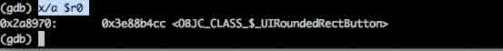
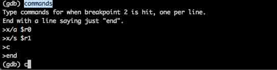

# 六、iOS 应用动态分析

# iOS 应用动态分析

# 6.1 分析 HTTP/HTTPS 网络流量

本文我们将看看如何分析 iOS 设备上的网络流量。分析应用的网络流量会带来几个方面的好处。它可以帮助我们推断应用是如何管理用户会话的，我们应用调用的另一方是谁，以及应用程序内部是如何工作的等等。我们也会看看如何分析使用 SSL 的网络流量。

监听网络流量有主动和被动两种方式。如果你对远程分析一个网络中的特定设备的流量感兴趣，那你需要 wireshark 这个工具。打开 Wireshark,开始嗅探网络，添加一个过滤器（fliter，例如 ip.addr == 192.168.1.2）以便它只显示你的设备发出或者接收的网络流量。如果你的无线网卡不够好，那么有些数据包可能会丢失。

如果你想要分析使用 SSL 的设备的网络流量，有许多方法可以达到目的，比如使用 Arpspoof(ARP 嗅探) 和 SSLStrip 的组合。不过，因为我们只对分析某个特定应用的网络流量感兴趣，我们将使用另一个不同的方法。先申明下，本文关注的是分析网络流量而不是劫持网络流量。并且，我们既能够分析通过 Wi-Fi 的流量，也能分析通过蜂窝网络(cellular)的流量。因为我们只是对分析某个特定应用的网络流量感兴趣，那选择哪种媒介（medium，这里指 Wifi 或者 celluar)事实上并不重要。

## 使用 TCPDump

抓取设备上的网络流量的一个最基本技巧是使用 tcpdump。首先，请确保你的设备上安装了 tcpdump。


现在，开始在某个特定的接口上抓取数据并且输出到一个文件。


为了在使用蜂窝数据的时候抓取数据，仅仅需要把上述命令中的接口换成你的蜂窝链接对应的 IP 地址即可。

为了分析这个文件（抓包保存的文件），你可以把它传输到你的电脑上，然后用 Wireshark 分析。不过，正如你可能注意到的那样，这个过程确实很繁琐，通过 Pipes 可以更好的完成这个过程。更多的信息请看[这](http://wiki.wireshark.org/CaptureSetup/Pipes)。用 tcpdump 给了我们太多底层的信息，很多信息对我们从分析应用的数据的角度来说并不感兴趣。更好的方法是使用 Burpsuite 和 Snoop-it。

## 使用 Snoop-it

我们来看看如何通过 Snoop-it 来分析网络流量。顺便说一下，如果你还不知道 Snoop-it 是啥，请查看[这里](http://security.ios-wiki.com/issue-4-6/)。为了查看调用的 api 和网络请求， 打开在 Snoop-it 的任意应用然后查看最左边的网络部分。例如，下图展示了 Snapchat 应用的网络调用情况。


如果我们点击某个特殊请求，我们能够看到请求串的内容 ，比如 body 等等。


## 使用 Burpsuite 监听 HTTP

再说一下，有许多方法能够查看网络的请求/相应，这其中 Burpsuite 是一个非常棒工具。可以从它的[官方网站](http://portswigger.net/burp/)下载。下载它的免费版本就足够完成我们本文的任务了。 顺便说一下，如果你从来没有用过 Burpsuite，请查看关于 Burpsuite 的[另一篇文章](http://resources.infosecinstitute.com/burp-suite-walkthrough/)。这里最主要的任务就是把 Burpsuite 当作一个代理，然后路由所有经过它的网络流量。

打开 Burpsuite,到 Proxy，选择 Options


点击已经设置的代理，点击编辑（edit），然后选择在 Bind to Addrees 这个选项的 All Interfaces 这个选项。


现在我们能够编辑代理监听的端口，甚至增加一个新的监听代理。Burp 有个选项，能够把证书传递给使用 SSL 的网站。在安装的时候，Burp 就默认的创建了一个自签名的 CA 证书。 现在选中的选项（如下图），“generate CA-signed per-host certificates” 就会用安装 Burp 的时候创建的 CA 证书给我们正在连接的 host 生成一个证书。


你会被提示一个警告。点击 YES。我们选择绑定到所有接口的原因就是我们希望我们的 iPhone 能够用我们的电脑作为代理，因此选择绑定到本地接口是不够的。


现在，到 Proxy－Intercept，然后确保 Intercept 设置成了 off。这是因为你可能不想被每个通过这个代理的数据包打扰。


现在，你可以让你的设备把所有网络流量通过你的代理。在你的 iOS 设备上，到设置（Settinigs）app，选择 Wifi，选择你目前正在连接的网络的设置，滚动到下面， 那里会有一个选项来设置代理。把代理地址设置成正在运行 Burpsuite 的电脑的 IP 地址，端口设置为代理运行的端口。


现在代理已经建立起来了，我们已经配置好我们的设备来使用这个代理，打开任意一个不是用 SSL 的应用（我们将会在本文的后面一点讨论 SSL），然后随便用用让应用发出些网络请求。你可以在 Burpsuite 看到这些请求。下面就是 NASA TV app 的网络流量。


使用 Burpsuite 的好处就是我们能以原生的格式（raw）和十六进制（hex）的格式查看数据包，我们也可以查看参数（Params）和头（Headers）


而且，我们也能够看到某个特定请求的对应返回包。


这给了我们详尽的细节来了解一个应用是如何与后台通信的，我们在调用谁，以及请求的格式是什么样的。

## 使用 Burpsuite 监听 HTTPS

不过，上述的技巧对于那些使用 HTTPS 与后台通信的应用是不起作用的。有些应用只调用 SSL 连接。例如，如果你试图通过这个代理运行 Snapchat 就不会成功。不过，有些应用会跳出一个警告，然后让你确认或者取消这个连接。例如，如下图所示就是当通过代理运行 Safari 的时候的情况。


如果你点击继续，那么你就能够看到应用的网络流量。请注意，这个警告仅仅针对目前的 host，如果你浏览到另一个使用 HTTPS 的网站，那另一个警告又会弹出来， 因为 Burpsuite 为每个 host 生成一个假的 SSL 证书。


每当我们通过 Burpsuite 连接一个 HTTPS 网站的时候，Burp 会为每一个 host 生成 SSL 证书，这个证书是用我们自己的 CA（Certificate Authority）证书签名的。为了确保不让这些警告每次都跳出，我们要在设备上把这个 Burp 的 CA 证书设置为受信任的根证书。因此，需要采取下述步骤。首先是得到这个根证书，然后把它安装到设备上。一旦它安装到设备上，它就是一个受信任的根证书它可以签名所有的证书，并且它签名的所有证书都是合法的。请注意这个证书的私钥(private key)保存在你的电脑上，因此当网络流量通过你电脑上的代理的时候，Burp 就能够用这个私钥解密这些数据。这个根证书在你把 Burp 安装到系统的时候就已经被创建好了。

为了把这个根证书安装到你的系统上，首先配置你的浏览器使用 Burpsuite 代理。


然后浏览使用 SSL 的网站，你会看到如下的一个警告


现在我们的任务就是导出这个用来签名所有这些证书的根证书。对于 gmail.com 域名，我们不可能导出这个根证书，因为我们不能对 gmail 的域名添加例外。每个域名都可以实施这样的措施。不过，facebook 允许我们添加一个例外。用 Firefox 访问 facebook.com。你会看到一个警告，点击“了解这个风险”（Understanding the Risks） 然后点击添加例外（Add an Exception）


然后，点击查看（view）


点击 Details 标签，然后选择证书层次最上面的证书。这就是根证书。然后点击导出并保存后缀名为.crt 的文件。


你也可以到 Burp 的文档找到这些步骤。下面就是[这个链接]的屏幕截图。


现在你就可以把这个文件发送到你的设备上。使用恰当的社会工程学技巧，攻击者就能够把这个证书安装到设备上，用户不会知道会有什么后果。 下面就是你打开这个证书的时候会得到的警告。


点击安装。你可以看到更详细的警告信息 。


点击完成（done）


现在，既然这个根证书被认为是合法的，每个被这个根证书签名的证书都会被视为合法的，应用就会允许数据被传输。现在，之前不让我们用假的 SSL 证书传递数据的 Snapchat 应用允许我们成功的把数据传输出去。这个网络流量会被 Burpsuite 拦截。如下图所见，在登录调用的时候，我们可以看到用户名和密码和其他一些这个应用正在调用的 API 请求。


## 总结

本文我们学习了查看通过 iOS 设备的网络流量的不同方法。能够知道我们调用的对方是哪里，有哪些请求和响应，请求的头和参数是什么等等会帮助我们了解应用内部是如何工作的。

本文原文是 [IOS Application Security Part 11 – Analyzing Network Traffic over HTTP/HTTPS](http://resources.infosecinstitute.com/ios-application-security-part-11-analyzing-network-traffic-over-httphttps/)

* * *

[#6 iOS 应用动态分析下的更多文章](http://security.ios-wiki.com/issue-6/)

# 6.2 用 Cycript 进行运行时分析(Yahoo 天气应用)

## 用 Cycript 进行实时修改

本文，我们将使用 Yahoo Weather 应用来执行所有的测试。它有一个清爽和优雅的 UI 来提供不同地区的天气信息。

一旦 Yahoo Weather 应用被安装好，请确保它运行在前台。这是因为如果应用在后台，那它就会被暂停，你也不能对它做啥。一旦应用跑起来，你可以先找到其进程 id，然后用 cycript -p 挂钩其进程。


如果挂钩成功，你可以得到一个 Cycript 解释器。你可以通过 Objective-C 的语法 [UIApplication sharedApplication].来得到实例。


如下图所示，你也可以通过 Cycript 解释器定义变量。在这里，我定义了一个变量 a 来代表 [UIApplication sharedApplication]。 请注意，命令的 L.H.S(Right Hande Side)是 Javascript，而 R.H.S(Right Hand Side)是 Objective-C 语法。这就是 Cycript 美的地方。


Cycript 默认就有这个变量，用它可以很容易的得到应用的实例。


为了找到这个应用的 delegate，我们可以用 [UIApplication sharedApplication].delegate. 不过既然我们已经定义了一个 a 代表应用的实例，我们可以用下图的方式来得到 delegate。


因此，我们现在知道这个 delegate 类的名称是 YWAppDelegate。因此 delegate 文件就是 YWAppDelegate.h 和 YWAppDelegate.m。让我们在它运行的时候试着让它调用几个方法。看这个应用给出如下的图片。


正如你所看到的那样，这个应用的状态栏被隐藏了。我们可以调用方法让状态栏显示。同时，请确保我们在进行运行时分析这个应用的时候，这个应用运行在前台。


这是这个应用现在的样子。


正如你看到的，现在状态栏是可见的了。让我们看看我们能否修改这个应用的提醒数字。提醒数字是在应用程序右上角显示的数字。通常它是指一个应用收到的 push 通知数目。在邮件应用中，它也可以指未读邮件的数量。在 Yahoo Weather 这个应用中，这里没有 push 通知的概念，因此，这里没有在应用程序图标的右上角显示数字。这个提醒数字在本地可以很方便的设置。让我们试试给它设置提醒数字为 999。


现在我们按 Home 键，可以在应用的桌面图标上看到提醒数字。


完美！

现在我们看看还能找出些什么有趣的东西。为了找出当前的 view controller，我们首先需要找出 keyWindow。 keyWindow 是一个用来接受用户交互（例如点击事件）的 window。如果你想要找出应用所有的 window，可以执行下面的命令。


为了找出在特定时刻的 keyWindow。可以这么做。


root view controller 可以用如下的方法找出来。


如你所见，rootViewController 的名字是 YahooSlidingController。从它的名字可以推断，它是如下图的 slider 所使用的类


因此，这个类基本上是其他所有的 view controller 的一个外观（facade）类。这意味着当某个菜单被选中的时候，YahooSlidingController 负责调用对应的 view controller 来显示。

## 总结

本文我们介绍了如何在越狱设备上安装 Cycript，如何挂钩运行的进程和找出应用的属性信息。我们也展示了如何在应用程序的沙盒内（由我们自己）调用我们自己的函数。在下一篇文章，我们将找出特定类的所有方法并修改其实现。我们也会看看如何去修改特定类的实例变量。

### References:

Cycript

[`www.cycript.org/`](http://www.cycript.org/)

Cycript tricks

[`iphonedevwiki.net/index.php/Cycript_Tricks`](http://iphonedevwiki.net/index.php/Cycript_Tricks)

本文原文是 [iOS 应用程序安全(4)-用 Cycript 进行运行时分析(Yahoo 天气应用)](http://wufawei.com/2013/11/ios-application-security-4/)

* * *

[#6 iOS 应用动态分析下的更多文章](http://security.ios-wiki.com/issue-6/)

# 6.3 用 Cycript 做运行时分析的高级技巧(Yahoo 天气应用)

## 引言

在前一篇文章中，我们学习了如何在设备上安装使用 Cycript。本文我们将使用一些运行时分析的高级技巧。我们将看看如何获得特定类（方法，实例变量）的值并且在运行时修改它们。

## 找出特定类的方法

现在假定我们正在一个程序运行的时候分析它的流程，那么，知道特定类或者特定 view controller 正在调用哪些方法将会给我们极大的帮助。因为 Cycript 能够混合使用 Objective-C 和 javascript，我们能够写一个即有 Objective-C 又有 Javascript 语法的函数。我们那个能够在解释器中定义函数，然后在任意时候使用它们以帮助我们找到有用信息。一个能够找到这些有用代码块的地方位于[这里](http://iphonedevwiki.net/index.php/Cycript_Tricks)。本文我们将使用这里的代码块。

首先，确保我们挂钩进了正在运行的进程。


我们先定义一个能够打印出一个指定类的方法的函数。你可以在[这](http://iphonedevwiki.net/index.php/Cycript_Tricks)找到这些 Cycript tricks。


既然我们已经定义好了方法，那么我们可以输入任何类，然后得到对应的方法列表。从上一片文章中，我们知道 Yahoo Weather 的 delegate 是 YWAppDelegate. 因此，这里试试这个类包含的所有方法。


上面打印出了 YWAppDelegate 定义的方法。 在@selector 后面的就是方法名称。请注意，这里会给出关于私有方法的名称，也会给出定义在类中的属性的 setter 和 getter 函数。

类似的，我们可以打印出 YahooSlidingViewController 的方法。


我们知道 YahooSlidingViewController 管理着 slide 菜单，并且充当着外观者（facade）的作用。为了找出真正负责显示天气的 view controller，我们可以使用下面的命令。


因此，YWMainViewController 就是当前负责显示天气的 view controller。因此，下面的 view 实际上来自 YWMainViewController。


让我们打印出 YWMainViewController 的方法。


你可以看到，这里有个方法叫做 userDidrequestUpdate.


从方法名称可以看出，一旦用户下拉刷新，这个方法就会被调用。有 Cycript，我们可以随时调用这个方法。我们要先引用这个 view controller，然后在其上调用这个方法。如下图所示。


可以看到，即使我们并没有下拉刷新，应用也完成了更新。


如上面所说，这些方法也包含属性的 setter 和 getter。

从安全的角度来说，能够在运行时操纵应用程序给了我们巨大的优势。我们能够在我们想要的时候调用任何方法。想像一下当用户第一次登陆的时候输入其用户名和密码，一旦登陆成功，一个叫做 didLogin 的方法会被调用。我们可以直接调用这个方法而不用输入任何用户名/密码的组合。

如果我们能够把特定 view controller 的变量都打印出来的话，那会很有用处的。因此，我们定义一个能够打印出所有实例变量的函数，你可以从[这](http://iphonedevwiki.net/index.php/Cycript_Tricks)找到代码块。


现在，我们打印出 YWMainViewController 的实例变量。


你可以看到，这里有一个 location view controller 的实例变量，你可以向左和向右 swipe 滑动来查看不同的地方。从名字来看，locationViewControllers 更像是一个 viewcontroller 数组。使用 Cycript，我们能够打印出该变量的值。


现在我们向右滑到 New York


现在我们打印出这个变量


可以看到，这个数组始终包含 3 个 location view，其他的都是 nil。它并不把所有的 location view controller 都包含进来，以便更好的管理内存。所以在任何时刻，我们能够拥有当前正在看的，左边和右边的 view controller。当我们想要去另一个不同地方的时候，它会自动的使得当前可见的位于中间并且实例化其左边和右边的 view controller，因此当我们滑动的时候，不会感觉到任何的时延。这是个编写不占用过多内存的代码的好方法。

## 总结

在前两篇文章中，我们对 Yahoo weather 应用进行了运行时分析。在接下来的文章中，我们将看到更多 Cycript 的技术，并且我们将关注 method swizzling。

### References:

Cycript

[`www.cycript.org/`](http://www.cycript.org/)

Cycript tricks

[`iphonedevwiki.net/index.php/Cycript_Tricks`](http://iphonedevwiki.net/index.php/Cycript_Tricks)

本文原文是 [iOS 应用程序安全(5)-用 Cycript 做运行时分析的高级技巧(Yahoo 天气应用)](http://wufawei.com/2013/11/ios-application-security-5/)

* * *

[#6 iOS 应用动态分析下的更多文章](http://security.ios-wiki.com/issue-6/)

# 6.4 用 Cycript 进行 Method Swizzling

## 引言

本文我们将在一个例子程序上看如何用 Cycript 做 method Swizzling。

第一件事情就是下载 Xcode 例子工程。你可以从[这](https://dl.dropboxusercontent.com/u/34557464/MethodSwizzlingDemo.zip)下载。或者你也可以从[这](https://dl.dropboxusercontent.com/u/34557464/MethodSwizzlingDemo.ipa)下载二进制文件。推荐你下载 Xcode 例子工程，看看源代码。

请确保使用你自己的证书来签名。


一旦你让这个 app 在设备上运行起来，ssh 进设备，然后用 Cycript 挂钩这个进程。 你可以通过命令 cycript -p [app_id] 来挂钩进入任意进程。


如你所见，这个 app 有一个登录框。请注意在本文中，我们只会在点击 Login Method 1 这个按钮的时候绕过登录。


用户名和密码是 admin:password。登录后可以进入管理页面。


如果输入的用户名和密码有误，那会得到一个错误提示。


我们的目标就是绕过这个登录 view。

首先，我们先找到这个应用对用的 root view controller.在 cycript 中用下面的命令 UIApp.keyWindow.rootViewController


既然我们在应用中看到的第一个视图就是这个登录页面，我们可以确定负责显示这个视图的 view controller 是我们用前一个命令找到的 navigation controller 的一部分。我们可以用 navigation controller 的 visibleViewController 属性来找到当前的视图。


完美。现在让我们写个函数打印出该 view controller 的所有方法吧。这个方法是从 Cycript 技巧页面拿过来用的。我建议你仔细看看这个页面，能发现很多不错的代码。

下面就是我用的代码。

```
1\. function printMethods(className) {
2\. var count = new new Type("I");
3\. var methods = class_copyMethodList(objc_getClass(className), count);
4\. var methodsArray = [];
5\. for(var i = 0; i < *count; i++) {
6\. var method = methods[i];
7\. methodsArray.push({selector:method_getName(method), implementation:method_getImplementation(method)});
8\. }
9\. free(methods);
10\. free(count);
11\. return methodsArray;
12\. } 
```


现在让我们打印出当前 view controller 的所有方法。请注意这个函数取的是类名，在这里是 ViewController


获取方法名称的另一个方法就是使用 isa.messages 属性。根据苹果的[官方文档](http://developer.apple.com/library/ios/)，isa 是一个指向类结构的指针。

下面是从同一页摘取的文字。

> “当一个新对象创建的时候，其内存会被分配，实例变量会被初始化。在对象的变量里面第一个就是一个指向它的类对象的指针。这个指针，叫做 isa, 使得 这个对象能够访问它的类，通过这个类，能够找到所以它继承自的类。”

下面这个来自[苹果文档](http://developer.apple.com/library/ios/)的图解释得很清晰。


所以，什么是 messages 属性呢？首先我们必须要知道什么是分发表（dispatch table）。分发表包含了很多条目，这些条目关联方法的 selector 和方法在类的地址。 让我们看一下从苹果官方的截图。


> “给一个对象发送消息的时候，消息函数会根据对象的 isa 指针到类结构中的分发表查找对方的方法选择器（method selector）。如果没有找到，那 objc_msgSend 用这个指针找到其 superclass，然后查找 superclass 的分发表。连续的查找失败会让 objc_msgSend 一直依次查找类层次直到 NSObject。一旦它定位到选择器（selector），objc_msgSend 就调用表中的这个方法并且把它接收的对象数据结构传递给它。 这就是在运行时选择方法实现的方法。或者用面向对象编程的术语，这些方法和消息是动态绑定的。”
> 
> 现在，很容易就能猜到 messages 属性是能发给类实例或者类本身的方法的消息列表。这将是一个非常大的列表，因为 isa 指针会选择从它父类一直到 NSObject 的消息。上面有一行值得特别注意。 “这就是在运行时选择方法实现的方法。或者用面向对象编程的术语，这些方法和消息是动态绑定的。”

因为方法和消息是在运行时绑定的，所以我们能够更改某个特定消息的方法实现。

在这里，让我们打印出 App Delegate 类的所有消息。


直接使用 messages 属性也一样可以。


在这里，我们关心的时候用来显示登录页的 view controller，我们之前就发现它的名称为 ViewController.所以打印出这个 VC 的所有消息。


在输出的顶部，你可以看到这个 VC 的一些方法。


方法 validateLogin 看起来很有趣。让我们看看 class-dump-z 输出的关于这个方法的信息。如果你对 class-dump-z 不熟悉，请参看本系列的[这篇文章](http://security.ios-wiki.com/issue-3-5/)。

下面就是我们从 class-dump-z 的输出中找到的关于 ViewController 的相关信息。


正如我们看到的，方法 validateLogin 返回一个 BOOL 类型值。从这我们可以推断这个方法验证用户的用户名和密码是否正确，正确返回 YES，否则返回 NO。 有 Cycript 在手，我们可以改变某个特定消息的实现。让我们来实现一个方法让它总是返回 TRUE。


因此，R.H.S （Right Hand Side）是一个 javascript 函数，总是返回 true。让我们现在点击应用的登录页面的 Login Method 1。


可以看到，认证成功，应用让我们进入管理页面了。我们使用 Cycript 执行了 method swizzling，绕过了登录框。

## 一些其他有趣的事情。

现在我们看到 method swizzling 是如何工作的，去了解下绕过这个验证的其他方法也会非常有趣。从 class-dump-z 的输出结果，我们可以看到一旦 validateLogin 返回 TRUE。方法 pushLoginPage 就会被调用。其他一些页面可能叫做 pushUserPage, 或者 pushLoginSuccessfulPage 等等。我们不必需要验证一定要是 TRUE。我们可以自己调用这个方法。


因为这是个实例方法，我们通过 UIApp.keyWindow.rootViewController.visibleViewController 得到实例。请注意这样做可能导致 crash，因为后续被 push 进的 view controller 可能对输入的用户名和密码有依赖。如果你想挑战一下，不妨试试绕过 Login Method 2。

## 总结

本文我们学习了如何利用 Cycript 来进行 method swizzling。

本文原文是 [iOS 应用程序安全(8)-用 Cycript 进行 Method Swizzling](http://wufawei.com/2013/11/ios-application-security-8/)

* * *

[#6 iOS 应用动态分析下的更多文章](http://security.ios-wiki.com/issue-6/)

# 6.5 ARM 和 GDB 基础

本文将使用的[GDB-Demo](https://github.com/prateek147/gdb-demo)例子程序可以从我的 github 账户上下载。请确保在你的设备上安装和运行。

现在让我们 SSH 进入设备。


现在我们开启 GDB，然后让 GDB 在应用开启之后就挂钩这个应用。可以通过命令 attach -waitfor Appname 来完成。你也可以 在设备上运行这个应用，然后用 attach 命令挂钩这个运行的进程，如下图所示。


一旦 GDB 挂钩进了这个应用，你会注意到这个应用目前是在暂停状态。你可以用 c 命令让这个应用继续执行。不过在继续执行之前， 让我们先做些调查。和任何其它架构一样，ARM 中的内存也被分为寄存器（register）。所有的寄存器都是 32 位的（iOS 7 中是 64 位的），并且它们的目的 就是保存和相互之间移动数据。你可以使用 info registers 命令来查看关于这些寄存器的信息。


请注意这个命令并没有把 ARM 中的所有寄存器都打印出来。要打印所有的寄存器，使用 info all-registers 命令。


要导出汇编信息，使用 disassemble 或者 disas 命令。这会给出后续几条指令的一些汇编信息。我们通过在 disas 命令后面提供函数名称来导出某个特定函数的汇编。例如要导出 main 函数的汇编，使用命令 disas main。如下图。


我们看看刚刚在设备上安装的应用，可以看到只是一个要求（输入）用户名和密码的简单应用。


我们也可以从用 class-dump-z 对这个应用导出的信息中找到有个类叫 ViewController 和一个方法叫做-(void)loginButtonTapped:(id)tapped;


使用 GDB，我们可以在应用中设置断点。只需要输入要断下来的方法名称。使用命令 b functionName。你也可以提供不带类信息的方法签名， 如果你不确定的话，GDB 会咨询你想要在那个类上设置断点。


请注意，实例方法前缀都带有一个"-"，而类方法前缀带有"+"，如下图所示。例如，sharedInstance 是一个类方法，方法一个单例类的共享实例。


可以通过命令 info breakpoints 看到所有的断点。


通过命令 delete 和 断点的 ID 就可以删除任何断点。


不管怎样，先给方法 loginButtonTapped: 设置一个断点。


现在我们可以用命令 continue 或者 c 让应用重新 run 起来。


现在点击应用的登录按钮。这样就会触发我们的断点。


我们可以用 disassemble 命令查看随后的一些汇编信息。


要在任意的指令前面下断点，请在那个指令的地址前面加上"*"


Objective-C 是基于消息的，任何时候一有消息被发送，objc_msgSend 就会被调用。

在我们打印出的 loginButtonTapped: 的汇编代码当中，这里有许多的 objc_msgSend 调用。要找出这个调用的一个好方法就是查找 blx 指令。 在你看到 blx 指令的地方，你可以确认有一个 objc_msgSend 正在被调用。


当有新方法被调用，或者有属性（property）被访问的时候，objc_msgSend 就会被调用。所以，如果我们在 objc_msgSend 下一个断点，我们可以 打印出正被调用的方法和调用这个方法的对象，这将帮助我们理解 app 的整个流程。我们已经在本系列的[这篇](http://security.ios-wiki.com/issue-4-6/)文章中学习过 Snoop-it 能够找到所有被追踪的调用。 要找出正在被调用的方法，我们首先需要查看 ARM 的调用约定（call convention）。下面是从[Wikipedia](http://en.wikipedia.org/wiki/Calling_convention)截取的关于 ARM 调用约定的图。


其中有一行很重要。


因此，我们可以给每一个 objc_msgSend 设置断点，然后使用 r0-r3 寄存器的值找到传递给这个函数的参数。 我们先看看 objc_msgSend 的签名。下面是 Apple [官方文档](https://developer.apple.com/library/mac/documentation/cocoa/reference/objcruntimeref/Reference/reference.html)的截图。


因此这个函数的前 2 个参数是 self 和 op，self 是一个用来接收这个消息的某个类的实例，op 是要处理这个消息的方法的选择器(selector)。 选择器（selector）是关于这个消息的签名。例如，如果一个方法的原型为 -(void)addOjectsToArray:(NSArray *)array，那么它的签名就是 addOjectsToArray:。我们也知道 r0-r3 用来保存传递给子程序的参数值，因此我们可以推断 r0 会包含 self，而 r1 会包含 op。

我们通过例子来理解。先给 objc_msgSend 下一个断点，然后继续执行知道断点被触发。


我们已经知道，r0 会包含一个用来接收这个消息的某个类的实例，r1 会包内选择器，从 r2 开始会是传递给方法的参数。不过，我们要先 学下命令 x。x 代表检查（examine），会以多种格式帮助我们查看内存。我们能够制定我们想要查看的内存的格式。要找出这个命令的所有 选项，使用命令 help x。


我们先检查 r0。我们知道 r0 会包含一个用来接收这个消息的某个类的实例，因此我们要使用的格式是 x/a。我们在 r0 签名使用了$，因为我们想要查看内存，因此 使用$。



我们可以看到接收者是 UIRoundedRectButton 类的一个实例。现在我们再检查下 r1 寄存器的值。我们知道它包含一个选择器，例如，方法的签名。 这是一个字符串，因此我们使用 x/s。


现在，我们需要找出传递给这个方法的参数。这个可能会有些棘手，因为我们并不知道 r2 的格式。但是注意到选择器是 respondsToSelector: 用常识我们可以推断参数可能是一个选择器，因此我们再次使用 x/s 来检查内存。


所有参数就是 debugDescription。从方法的选择器我们可以看到，这个函数只有一个参数，因此我们不必进一步检查其他寄存器。所以， 现在我们可以说正在被调用的方式像下面这样。

-[UIRoundedRectButton respondsToSelector:@selector(debugDescription)];

这里会有太多的 objc_msgSend 会被调用，一个一个简单会非常痛苦。因此，让我们把这个过程自动化。在本系列的[第 3 篇][3]文章中，我们学到了如何 用 gdb 在断点触发的时候打印信息。我们这样也用用。



现在输入命令 c 继续，你可以看到所有被调用的方法。这可以告诉我们很多这个应用的内部信息。


让我们试试以 Objective-C 类似的语法打印出这些东西。我们将要使用苹果[文档](https://developer.apple.com/library/mac/documentation/cocoa/reference/objcruntimeref/Reference/reference.html)中的 class_getName。如你所见，它需要提供类对象作为参数， 因此我们传递 r0 给它。


现在像下面这样重写调用命令。


输入命令 c 继续，现在你可以看到，信息是更可读的方式了。


这会告诉我们很多关于应用内部发生什么的信息。在接下来的文章中，我们将使用本文学到的东西来学习如何使用 GDB 执行运行时操作。

本文原文 [iOS 应用程序安全(21)-ARM 和 GDB 基础](http://wufawei.com/2013/11/ios-application-security-21/)

* * *

[#6 iOS 应用动态分析下的更多文章](http://security.ios-wiki.com/issue-6/)

# 6.6 使用 GDB 进行运行时分析和操作

本文我们将看看如何使用 GDB 来对 iOS 应用进行运行时分析。 在前面的文章中，我们已经查看了如何使用 Cycript 来分析和操作 iOS 应用的运行时行为。我们学习了如何执行 method swizzling，并且调用我们自己的方法而不是原来的实现。因此，为什么我们还需要 GDB 呢？Cycript 并不运行我们设置断点，不允许在某个特定指令后修改变量和寄存器的值。用 GDB，我们可以更深入应用，观察底层的汇编指令，操作寄存器的值，因此可以完全改变程序的运行流程。

你可以从 github 下载[GDB-Demo](https://github.com/prateek147/gdb-demo)。然后确保安装和运行它到你的设备上。这个例子应用是一个简单的单视图应用，要求你输入用户名和 密码的组合来登入。然后它在本地验证你输入的凭证，如果用户名/密码输入正确，它会让你登录进去。


一旦应用安装到了设备上，ssh 进入设备。

 然后在你的设备上开启 GDB-Demo 这个应用。在 GDB 中，使用命令 attach GDB-Demo.PiD 附加到这个运行进程，这里的 PID 是 GDB-Demo 应用的进程 ID。你那里的 PID 可能不一样。输入 attach GDB-Demo 然后点击 TAB。就会给出你要追加的正确的进程 ID。一旦你按了 enter，GDB 会挂钩进这个运行的进程。


从上一篇文章我们已经知道这个应用的类信息。我们知道它有一个方法叫做 loginButtonTapped:。因此我们给它设置一个断点，然后输入命令 c 来继续运行这个应用。 

现在输入任意的用户名和密码组合，然后点击登录。断点就会被触发。


使用 disas 来打印出这个函数的汇编信息。现在我们知道验证就会发生在这个函数内部，因为我们从这个应用的类信息里找不到其他感兴趣的其他相关信息。


每当一个外部方法或者属性被访问的时候，objc_msgSend 就会被调用。不过，在任何程序中 msgSend 都会被调用成千上万次。 我们只关心和这个函数（loginButtonTapped:）相关的 objc_msgSend 调用。因此，我们可以找出所有调用 objc_msgSend 的指令的地址，然后给它设置断点。 一个非常简单的方法就是寻找 blx 指令，注意它(blx)的地址，然后为它设置一个断点。


现在我已经为这个函数调用 objc_msgSend 的入口设置了断点。现在我们一个一个的来看 objc_msgSend 指令，打印出寄存器的值，看看是否有感兴趣的。 我们将要打印出每个 objc_msgSend 调用的 r1 的值。如果没有什么感兴趣的，输入命令 c 继续直到下一个断点触发。


这里有些有意思的东西。如果我们看看上图的底部，我们会看到方法 isEqualToString:被调用了。因此这是一个和特定字符串的比较。利用从上一篇文章获得的知识 我们可以知道寄存器 r2 会包含传递给这个函数的参数。并且，如果你有编写 Objective-C 代码的经验，你会知道每个 Objective-C 的对象都是一个指针。isEqualToString:这个函数也同样接收一个字符串指针作为参数，保存在 r2 寄存器中。要找出这个对象的值，GDB 有一个特定的命令 po，能够打印出这个寄存器中的指针的值。


因此，这个正被比较的字符串是“Admin”。这看起来像是用户名。看起来工作已经完成了一半。你也可以用如下图的方式打印出 r2 的值。


现在更明智的做法就是重新在应用中把用户名输入为 Admin。这是因为执行流程可能还走不到检查密码的地方（因为用户名不对）。因此，让我们输入 Admin 作为 用户名，输入任意的东西作为密码。让我们再次设置断点，然后看看我们是否能够找出密码。在经过一段做同样事情的时间之后，断点将会在 isEqualToString:被调用的时候被触发。打印出 r2 的值，可以看到，密码是 HELLOIOSAPPLICATIONEXPERTS。


现在我们输入找到的用户名和密码的组合，我们将看到。


另一个做到同样事情的方法就是操作寄存器的值。在汇编代码中，我们可以看到有 2 个调用 cmp 指令的地方。


在这两个地方，r0 寄存器的值都与 0 做比较，然后根据比较结果做决定。让我们为这两个地方都设置一个断点然后继续运行应用。


一旦断点触发，设置 r0 寄存器的值为 1.你可以通过命令 set $r0 =1 做到。在另一个地方做同样的事情然后继续运行应用。 你会看到你成功登陆，即使你没有输入任何用户名/密码组合。


顺便说一下，下面是我们破解的 loginButtonTapped:的代码。

```
1\. - (IBAction)loginButtonTapped:(id)sender {
2\. if([_usernameTextField.text isEqualToString:@"Admin"] && [_passwordTextField.text isEqualToString:@"HELLOIOSAPPLICATIONEXPERTS"]){
3\. [self performSegueWithIdentifier:@"adminPage" sender:self];
4\. }else{
5\. [[[UIAlertView alloc] initWithTitle:@"Error" message:@"Incorrect Username or password" delegate:nil cancelButtonTitle:@"Ok" otherButtonTitles:nil] show];
6\. }
7\. } 
```

本文我们查看了如何通过 GDB 在运行时操作应用的执行流程。在整个逻辑都在一个函数内部的情况下，关于 GDB 的知识特别有用，因为我们不能够使用 Cycript 的 method swizzling 技术。掌握好 GDB 和 ARM 汇编的知识，修改和操作应用的执行流程的能力只受你的想象力限制。

本文原文 [iOS 应用程序安全(22)-使用 GDB 进行运行时分析和操作](http://wufawei.com/2013/11/ios-application-security-22/)

* * *

[#6 iOS 应用动态分析下的更多文章](http://security.ios-wiki.com/issue-6/)

# 6.7 使用 Introspy 进行黑盒测试

本文我们将看看如何使用 Introspy 对 iOS 应用进行黑盒测试。Introspy 由[ISEC partners](https://www.isecpartners.com/)开发，其 github 地址在[这](https://github.com/iSECPartners/introspy)。Introspy 由两个单独的模块组成，一个追踪器，一个分析器。它是分析 iOS 应用程序安全毫无疑问的最强大工具之一。

第一步就是在你的设备上安装 Introspy 追踪器。你可以在[这](https://www.dropbox.com/s/z5cwqk5wti3zsvd/com.isecpartners.introspy-v0.3-iOS_6.1.deb?dl=1)下载到其 deb 包。下载成功之后，上传并安装到你的设备上。下图展示了上面提到的步骤需要执行的操作。


一旦追踪器安装好了，重启你的设备。到设置应用，你会看到一个关于 Introspy 的不同区块。 现在 

Introspy App 区块允许你选择想要分析的应用。因此，点击它，然后选择你想要分析的应用。我这里选择了 Path 应用来做分析。


现在到 Introspy 的 Settings，确保每个选项都已选中，特别是选项 Log to The Console（把日志输出到控制台）。如果我们选中 这个选项，Introspy 分析器将会把它找到的关于这个应用（app）所有信息都输出到控制台，这样我们就能在运行时看到这些信息。


一旦选中了 Path 应用，请确保它没有在运行。如果它正在运行，请退出并重启 Path。另外，请确保你的设备和你的电脑连接好了，因为我们想要看 Introspy 分析器记录的日志。同时，请大家你机器上的 Xcode（如果你在 Mac 上），到 Window-> Organizer->Devices。在左边的菜单选择你的设备，然后选择控制台。 现在你就可以看到你的设备的日志。


现在开启 Path 应用，然后尽可能多的使用这个应用。同时，Introspy 分将会在后台运行，并且会尽可能多的收集关于这个应用的信息。你也可以看到设备的日志。 这里，我们可以看到有一个向 server 发起的请求，我们可以看到这个请求的所有内容，包括路径和请求参数。


并且现在，你可以看到这个应用正在使用 NSUserDefaults 来验证 userId 这个键。这个信息其实应该保存在 keychain 的。


但是最有趣的的信息可以从下面的图中看到。正如你所见，这个应用使用 NSUserDefaults 来验证 HangTracerEnabled 这个布尔值。这个可能是 用来看这个应用是否在运行时被分析，如果是的话，就退出。不过，这技巧看起来失败了，因为它没有能够检测到 Introspy 分析器。 不过当我用 Snoop-it 分析 Path 应用的时候，它 crash 了。所以，这个布尔值确定无疑的是用来看应用是否正追踪（被分析）。我们将会在随后的 文章中介绍这些概念。


除了在控制台展示这个应用的运行时信息，Introspy 也能够把它保存到你设备上的一个 sqlite 数据库中。从你的电脑上，你可以获取这个数据库文件 并且 Introspy 会把它转换成可展示的格式。要从你的 iOS 设备上获取这个数据库，首先你需要 github 页面下载[Introspy](https://github.com/iSECPartners/introspy/archive/master.zip)。到这个分析器的目录， 然后使用如下图的命令。你需要指定在你本地机器上要把报告保存的位置，同时也要指定你的 iOS 设备的 IP 地址。


如你所见，Introspy 会要求你选择一个数据库文件。这些数据库文件是为每个我们在 Settings 中选择的应用创建的。在这里，我们选择为 Path 应用创建的 数据库。


你可以看到，这个数据库被保存在当前目录下面，同时，当前目录下有一个叫做 Path-Report 的文件夹被创建。如果我们进入那个文件夹，并且 打开 report.html，下图就是我们将会看到的内容。如你所见，Introspy 已经用一个很不错的方法把全部信息都展示出来了。我们可以看到被追踪的调用 和其参数。。


我们也可以看到其中有一列叫做"Potential Findings"。这些都是 Introspy 认为存在漏洞的地方。在这里，我们将看看存储数据不安全的问题。 这可能不算是一个漏洞，因为保存的信息不一定非常重要。


你也可以像下图那样，选择某些选项来定制你看到的信息。


例如，我已经把它配置成只显示关于 UserPreferences 的方法。这个信息可能会非常有用，因为它可以帮我们找出那些可能被写入 NSUserDefaults 的一些重要信息。 即使没有在下图中显示，我也能够容易的知道 Path 把我的用户 id（userId）保存到 NSUserDefaults，并且在很多地方都会用到（这个用户 id）。这个信息理应保存在 更安全的地方，比如，keychain。


我们也可以直接从命令行对保存的数据库文件进行分析。下面是使用信息。


让我们给这个命令传递参数 http'。如你所见，它导出了一列通信方的列表。


Introspy 也可以被其他 Python 脚本导入。我们也可以增加签名来标志漏洞或者不安全的配置。我们将在随后的文章中作介绍。

## 总结

本文我们查看了如何使用 Introspy 对 iOS 应用进行黑盒测试。Introspy 由两个模块组成， 一个追踪器，一个分析器。我们可以用追踪器来对应用执行运行时分析。追踪器会把信息保存到 sqlite 文件中以便后续用分析器分析，追踪器也可以把所有信息都输出到设备的控制台上。分析器可以用这个数据库文件生成一个详尽的 HTML 报告。

References

Introspy

[`github.com/iSECPartners/introspy`](https://github.com/iSECPartners/introspy)

本文原文是 [iOS 应用程序安全(17)-使用 Introspy 对 iOS 应用进行黑盒测试](http://wufawei.com/2013/11/ios-application-security-17/)

* * *

[#6 iOS 应用动态分析下的更多文章](http://security.ios-wiki.com/issue-6/)

# 6.8 使用 iNalyzer 进行动态分析

[在这篇文章](http://security.ios-wiki.com/issue-5-4/)我们看到了如何使用 iNalyzer 对 iOS 应用进行静态分析。本文我们将看看如何用 iNalyer 对 iOS 应用进行运行时分析。我们能够在运行时调用方法，能够在应用的某个特殊时间找出特定实例变量的值，基本上能做我们用 Cycript 做的所有事情。

在[这篇文章](http://security.ios-wiki.com/issue-5-4/)当中，我们成功的用 Doxygen 生成了 html 文件，并且打开它看到了关于这个应用的类信息和其他信息。我们将使用 Firefox 浏览器进行运行时分析。这个工具的开发者推荐我再进行运行时分析的时候使用 Firefox 浏览器，因为其它浏览器用起来可能会有问题。 不过，对我来说，在 chrome 上好像也工作正常。

要打开运行时解释器，首先需要打开 Doxygen 为你想要分析的应用生成的 index.html 文件，然后双击左剪头键。


如上图所示，你可以看到有一个可以输入命令的控制台在顶部出现。第一件事情就是告诉 iNalyer 你设备的 IP 地址，在这里是 10.0.1.23。输入 IP 地址后然后确定（按 Enter）。


一旦 IP 地址设置好之后，请确保我们要分析的应用在设备上是打开的（例如，在前台），并且你的设备没有休眠。这非常重要， 因为如果你的应用在后台或者你的设备在休眠，那你的应用是会被操作系统给暂停的，因此就不可能对这个应用进行任何运行时分析。

一旦应用打开，在控制台输入任意命令，如你使用 Cycript 会输入的一样。


正如我们看到的那样，我们会得到一个响应。我们现在可以输入我们想要输入的任何 cycript 命令。

让我们隐藏应用的状态栏。我们可以用这个命令， [[UIApplication sharedApplication] setStatusBarHidden:YES animated:YES];


可以看到，我们并没有得到任何响应，那是因为这个方法返回空（void）。


不过，应用的状态栏已经隐藏起来了。我们在最上面已经看不到时间了。


类似的，我们可以找到这个应用的 delegate 类。


我们也可以设置应用的提醒数字。这里我们设置为 9000。


可以看到，提醒数字成功设置。


因为这和有一个 cycript 控制台类似，我们也可以输入 javascript 代码和任何其他 Cycript 文档中的命令。 下面就是我输入的从[Cycript tricks](http://iphonedevwiki.net/index.php/Cycript_Tricks)页面引用的一个命令。


类似的，我可以同时用 javascript 和 Objective-C 的语法来创建函数。如果你对这里说的 Cycript 不太理解，请 参考本系列前面介绍 Cycript 和它的详细用法的文章。


我可以在想要使用这个函数的任何时刻用它。


在本系列的[第 9 部分](http://wufawei.com/2013/11/ios-application-security-9/)，我们介绍了 Snoop-it。iNalyer 和 Snoop-it 非常类似。不过二者都有优点和不足。 在本文写关于 Snoop-it 的时候，它并不支持 method swizzling 而 iNalyer 支持。蕾丝的，iNalyer 不允许我们 监控 API 调用而 Snoop-it 可以。因此，这两个应用都有它们的优点和不足。

## 总结

本文我们学习了如何利用 iNalyer 来对 iOS 应用进行运行时分析。对于任何对 iOS 应用程序安全感兴趣的人来说，iNalyer 都是武器库中非常棒的工具，它使得我们的工作更容易、更有效率。

References

iNalyzer [`appsec-labs.com/iNalyzer`](https://appsec-labs.com/iNalyzer)

本文原文是 [iOS 应用程序安全(16)-使用 iNalyzer 对 iOS 应用进行动态分析](http://wufawei.com/2013/11/ios-application-security-16/)

* * *

[#6 iOS 应用动态分析下的更多文章](http://security.ios-wiki.com/issue-6/)

# 6.9 小结

本章介绍了使用 GDB、Cycript 等工具对 iOS 应用进行动态分析的各种方法，欢迎大家实践。

* * *

[#6 iOS 应用动态分析下的更多文章](http://security.ios-wiki.com/issue-6/)