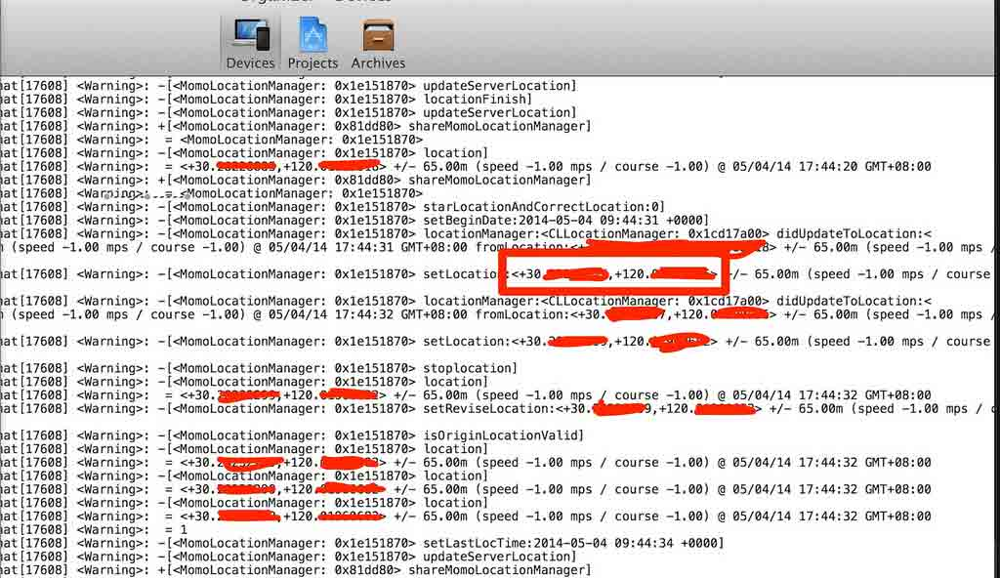
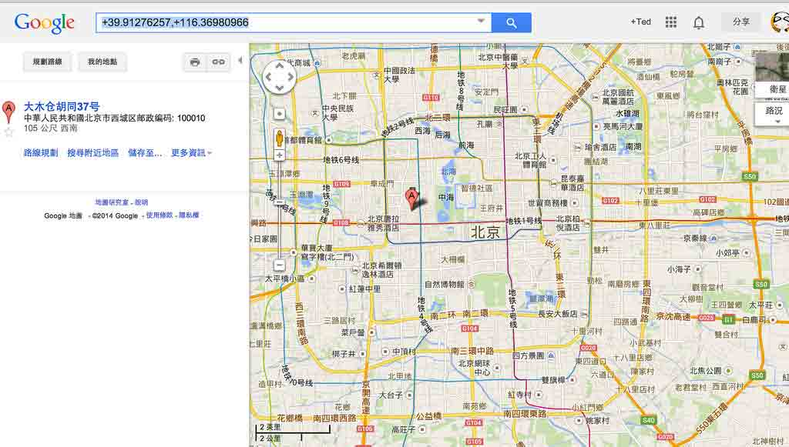

# 八、修改某陌生人交友软件的位置信息

# 修改某陌生人交友软件的位置信息

# 8.1 简介

本章我们将简要介绍如何分析 App 并编写 Tweak。比如，使用某陌生人交友软件的时候，在其第 2 个 tab，发现这个 tab，会使用当前用户所在的地理位置，推荐周边的用户和群组。

那么，有方法做到伪装自己的地理位置么，即做到如下的效果：


如上图，我们能随意更改自己的位置么，比如改成北京？

我们将分析看看是否能做到，请继续阅读后面的章节。

* * *

[#8 修改某陌生人交友软件的位置信息下的更多文章](http://security.ios-wiki.com/issue-8/)

# 8.2 导出并分析头文件

#### 导出头文件

使用前面文章介绍的 Clutch([4.3 Clutch：iOS 应用破解工具](http://security.ios-wiki.com/issue-4-3/))破解 IPA，然后把 IPA 拷贝到 Mac 上。

然后使用 Mac 上安装的 class-dump-z([使用 class-dump-z 获得 iOS 应用程序的类信息](http://security.ios-wiki.com/issue-3-5/))就可以导出头文件。具体使用方法请参阅上述两篇文章。

#### 分析头文件

这里我们的需求和地理位置有关系，我们首先搜索下关于 Location 的文件。

我们找到这个文件：MomoLocationManager.h。

其内容如下：

```
/**
 * This header is generated by class-dump-z 0.2a.
 * class-dump-z is Copyright (C) 2009 by KennyTM~, licensed under GPLv3.
 *
 * Source: (null)
 */

#import <XXUnknownSuperclass.h> // Unknown library
#import "CLLocationManagerDelegate.h"

@class CLLocation, CLLocationManager, NSDate, NSTimer;

__attribute__((visibility("hidden")))
@interface MomoLocationManager : XXUnknownSuperclass <CLLocationManagerDelegate> {
    CLLocationManager* locManager;
    CLLocation* location;
    CLLocation* reviseLocation;
    CLLocation* fakeLocation;
    BOOL correctLocation;
    NSTimer* timer;
    BOOL isLocationing;
    NSDate* beginDate;
    NSDate* lastLocTime;
}
@property(retain, nonatomic) CLLocation* fakeLocation;
@property(retain, nonatomic) CLLocation* reviseLocation;
@property(retain, nonatomic) CLLocation* location;
@property(copy, nonatomic) NSDate* lastLocTime;
@property(retain, nonatomic) CLLocationManager* locManager;
@property(retain, nonatomic) NSDate* beginDate;
+(id)shareMomoLocationManager;
-(id)distanceBetweenLocationDictionary:(id)dictionary;
-(BOOL)isOriginLocationValid;
-(BOOL)isReviseLocationValid;
-(void)locationManager:(id)manager didFailWithError:(id)error;
-(void)locationManager:(id)manager didUpdateToLocation:(id)location fromLocation:(id)location3;
-(void)refreshLocationIfExceedLimit;
-(void)HandleTimer;
-(void)updateServerLocation;
-(void)locationFail;
-(void)locationFinish;
-(void)updateSelfLocation:(id)location;
-(void)cancelLocation;
-(void)reviseLocationToError:(id)error;
-(void)reviseLocationToFail:(id)fail;
-(void)reviseLocationToSuccess:(id)success;
-(void)reviseLocationTo;
-(void)stoplocation;
-(void)locationTimeOut;
-(void)starLocationAndCorrectLocation:(BOOL)location;
-(id)getLatestLocationWithInterval:(double)interval;
-(void)dealloc;
-(id)init;
@end 
```

这个文件很有意思，很可能就是我们要找的。

那怎么确定这个类确实是我们想要的呢？

我们可以对这个文件的所有方法挂钩(编写 Tweak)，先打印下调用记录，并分析其参数值，最终确定是不是这个类。

编写 Tweak 的方法参见：[Theos：iOS 越狱程序开发框架](http://security.ios-wiki.com/issue-3-6/)

我们知道，如果要挂钩某个方法，类似如下代码：

```
#import <SpringBoard/SpringBoard.h>

%hook SpringBoard

-(void)applicationDidFinishLaunching:(id)application {
%orig;

UIAlertView *alert = [[UIAlertView alloc] initWithTitle:@"Welcome" 
message:@"Welcome to your iOS Device Ted!" 
delegate:nil 
cancelButtonTitle:@"security.ios-wiki.com" otherButtonTitles:nil];

[alert show];
[alert release];

}

%end 
```

如果我们要对一个类的所有方法，包括 property 的挂钩（Hook)，手动一个个写当然可以，但是那样就太繁琐了。下一节我们介绍一个工具，可以一下就对整个类的所有方法挂钩。

请继续阅读下一节。

* * *

[#8 修改某陌生人交友软件的位置信息下的更多文章](http://security.ios-wiki.com/issue-8/)

# 8.3 使用 Logify 跟踪函数调用

#### 简介

[Logify](http://iphonedevwiki.net/index.php/Logify)能够接受一个.h 头文件作为输入，然后输出.xm 文件（MobileSubstrate 扩展），这个.xm 文件 hook 这个类的所有方法，当这些方法被调用的时候打印 log。这有助于你发现哪些方法被调用了。Logify 在安装了 Theos 之后就有。

#### 用法

在命令行下输入类似的命令：

```
/opt/theos/bin/logify.pl MomoLocationManager.h > tweak.xm 
```

其中 MomoLocationManager.h 是头文件，后面的 tweak.xm 是自动生成的 tweak 文件。

在我的 mac 上我是这样输入的：

```
ZPs-MBP:momoLocation admin$ /opt/theos/bin/logify.pl MomoLocationManager.h > tweak.xm 
```

这个 tweak.xm 的内容如下：

```
%hook MomoLocationManager
- (void)setFakeLocation:(CLLocation* )fakeLocation { %log; %orig; }
- (CLLocation* )fakeLocation { %log; CLLocation*  r = %orig; NSLog(@" = %@", r); return r; }
- (void)setReviseLocation:(CLLocation* )reviseLocation { %log; %orig; }
- (CLLocation* )reviseLocation { %log; CLLocation*  r = %orig; NSLog(@" = %@", r); return r; }
- (void)setLocation:(CLLocation* )location { %log; %orig; }
- (CLLocation* )location { %log; CLLocation*  r = %orig; NSLog(@" = %@", r); return r; }
- (void)setLastLocTime:(NSDate* )lastLocTime { %log; %orig; }
- (NSDate* )lastLocTime { %log; NSDate*  r = %orig; NSLog(@" = %@", r); return r; }
- (void)setLocManager:(CLLocationManager* )locManager { %log; %orig; }
- (CLLocationManager* )locManager { %log; CLLocationManager*  r = %orig; NSLog(@" = %@", r); return r; }
- (void)setBeginDate:(NSDate* )beginDate { %log; %orig; }
- (NSDate* )beginDate { %log; NSDate*  r = %orig; NSLog(@" = %@", r); return r; }
+(id)shareMomoLocationManager { %log; id r = %orig; NSLog(@" = %@", r); return r; }
-(id)distanceBetweenLocationDictionary:(id)dictionary { %log; id r = %orig; NSLog(@" = %@", r); return r; }
-(BOOL)isOriginLocationValid { %log; BOOL r = %orig; NSLog(@" = %d", r); return r; }
-(BOOL)isReviseLocationValid { %log; BOOL r = %orig; NSLog(@" = %d", r); return r; }
-(void)locationManager:(id)manager didFailWithError:(id)error { %log; %orig; }
-(void)locationManager:(id)manager didUpdateToLocation:(id)location fromLocation:(id)location3 { %log; %orig; }
-(void)refreshLocationIfExceedLimit { %log; %orig; }
-(void)HandleTimer { %log; %orig; }
-(void)updateServerLocation { %log; %orig; }
-(void)locationFail { %log; %orig; }
-(void)locationFinish { %log; %orig; }
-(void)updateSelfLocation:(id)location { %log; %orig; }
-(void)cancelLocation { %log; %orig; }
-(void)reviseLocationToError:(id)error { %log; %orig; }
-(void)reviseLocationToFail:(id)fail { %log; %orig; }
-(void)reviseLocationToSuccess:(id)success { %log; %orig; }
-(void)reviseLocationTo { %log; %orig; }
-(void)stoplocation { %log; %orig; }
-(void)locationTimeOut { %log; %orig; }
-(void)starLocationAndCorrectLocation:(BOOL)location { %log; %orig; }
-(id)getLatestLocationWithInterval:(double)interval { %log; id r = %orig; NSLog(@" = %@", r); return r; }
-(void)dealloc { %log; %orig; }
-(id)init { %log; id r = %orig; NSLog(@" = %@", r); return r; }
%end 
```

使用[Theos：iOS 越狱程序开发框架](http://security.ios-wiki.com/issue-3-6/)介绍的方法编写 Tweak，然后用上述生成的 tweak.xm 覆盖自动生成的 tweak.xm 文件，然后安装到设备上。

打开 Xcode 的 Organizer 看设备的 log。可以得到如下的 log 信息：



我们可以发现有哪些方法被调用了，其中红色划线的地方，就是我们的当前位置的经纬度。

我的经纬度被上报了。

从这个图中，可以发现最终是调用了：

*   (void)setLocation:(CLLocation* )location

在下一节，我们将拦截这个方法，给这个方法传递一个假地址，看看是否能达到目的。

* * *

[#8 修改某陌生人交友软件的位置信息下的更多文章](http://security.ios-wiki.com/issue-8/)

# 8.4 编写 Tweak 并安装到设备上

根据上一节的分析：我们最终编写的 Tweak 程序如下：

```
#import <CoreLocation/CoreLocation.h>

%hook MomoLocationManager

- (void)setLocation:(CLLocation* )location { %log; CLLocation *location1 = [[CLLocation alloc] initWithLatitude:39.91276257 longitude:116.36980966];%orig(location1); }

%end 
```

其中的经纬度(39.91276257, 116.36980966)，如下图所示，是我随意填写的。



使用[Theos：iOS 越狱程序开发框架](http://security.ios-wiki.com/issue-3-6/)介绍的方法编写 Tweak，然后安装到设备上。

最终的效果如下图所示：


成功把当前位置替换。

利用本系列文章介绍的工具可以做很多有意思的事情，欢迎读者自己去找寻目标并体验这些技术。

* * *

[#8 修改某陌生人交友软件的位置信息下的更多文章](http://security.ios-wiki.com/issue-8/)

# 8.5 小结

本章介绍了编写 Tweak 的实际例子。从头文件导出、使用 Logify 跟踪函数调用、到最终编写 Tweak，介绍了如何伪装自己的地理位置信息。

* * *

[#8 修改某陌生人交友软件的位置信息下的更多文章](http://security.ios-wiki.com/issue-8/)