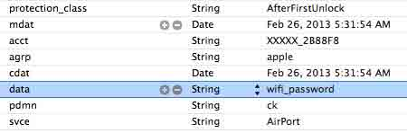
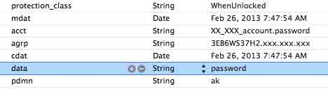

# 九、本地数据和网络通信

# 本地数据和网络通信

# 9.1 本地数据分析

在[5.2 本地数据存储及安全性](http://security.ios-wiki.com/issue-5-2/)这一节，我们对本地数据存储对安全性做了详尽的分析。

NSUserDefaults，plist,sqlite3 等等，即使设备不越狱，攻击也能够提取出数据。在设备越狱之后，keychain 中的数据也不安全。

因此，要对敏感数据加密，且尽量保存到 keychain 中（比如 token 信息）。

下面是 2 个例子。（**密码都被我用 password 字串替换**）

a) 家里的**WIFI**信息

b）**某知名微博**

**我在越狱之后的 iOS 5.1 的 iPhone，iPad, iOS 6.1.2 的 iPad 上都测试过，都可以获得如上信息。**

实际中的例子远不止这 2 个。很多应用都是直接存用户的明文密码的。

#### 个人如何防止信息泄露

a）修改 root 的默认密码。
b) 安装能信任的 jail break app。

#### 对开发者和公司

**不要保存用户的明文密码。**
**Encryption is a must for sensitive data。**

考虑到用户的安全，这里并没有点名某个具体的应用，做移动 App，一定要考虑本地数据存储的安全问题。

大家可以拿感兴趣的 App，用本系列文章介绍的方法具体分析一下。

* * *

[#9 本地数据和网络通信下的更多文章](http://security.ios-wiki.com/issue-9/)

# 9.2 网络通信分析

在[网络流量工具 Charles 的安装和用法](http://security.ios-wiki.com/issue-3-2/)和[6.1 分析 HTTP/HTTPS 网络流量](http://security.ios-wiki.com/issue-6-1/) 这两节，我们介绍了对 iOS 的网络通信进行分析的方法。

利用文章介绍的方法，可以发现有以下几类：

#### 发送明文密码

有的应用一点也不注意用户数据的安全，竟然发送明文密码。读者可以拿自己常用的 App 试试，应该能发现这种 App，我发现我常用的一个电影相关 App 竟然用 HTTP 直接发送用户的明文密码。

#### 发送密码的 md5

有的应用做得好一点，不发送明文的密码，发送密码的 md5，md5 对于攻击者来说，大部分其实都相当于明文了。现在甚至有公开的可以查询 md5 对应的明文的网站。

其技术原理是这样的：先把常用的各种明文算一个 md5，然后把这些数据存起来，最后更具 md5 来倒查明文。

#### 用 HTTPS

有的应用以为用 HTTPS 就安全了，所以就直接传输明文的密码，但是这种很容易遇到中间人攻击，一旦通信链路上有一个环节出了问题，密码一样泄漏。

所以，如果用 HTTPS，一定要注意对通信双方的一个身份的认证，比如在客户端保存 server 证书的相关信息，每次传输之前，验证证书信息，避免中间人攻击。

用 HTTPS 传输 md5 都比传输明文好太多。

#### 自定义协议

可以直接建立 TCP 链接，然后利用自定义协议，传输关键内容，比如用户名密码和其他关键信息。

QQ 就是自定义协议，登录和聊天信息都是加密之后再传输。

#### XMPP

从上个月开始, 很多 XMPP 服务器开始升级强制加密。我们知道，以前 XMPP 协议是明文传输的，比如 GTalk，比如 MSN，以后逐渐 XMPP 的传输也会加密。

#### 小结

在处理用户登录的时候，请不要传输明文的密码，而且请注意防止重放攻击（replay attack，防止重放攻击的方法就是使用 nonce）。

这里并没有拿某个 App 来分析，希望读者能够利用本系列文章的介绍的工具和方法，拿自己感兴趣的 App 来动手分析下。

* * *

[#9 本地数据和网络通信下的更多文章](http://security.ios-wiki.com/issue-9/)

# 9.3 小结

本章我们对某些知名应用的本地存储和网络通信的安全进行了简单的分析，可以发现，在移动互联网，安全这一块还需要大家更有安全的意识，特别是了解攻击者的手段和方法，能够让我们尽量避免出现安全上的问题。

* * *

[#9 本地数据和网络通信下的更多文章](http://security.ios-wiki.com/issue-9/)