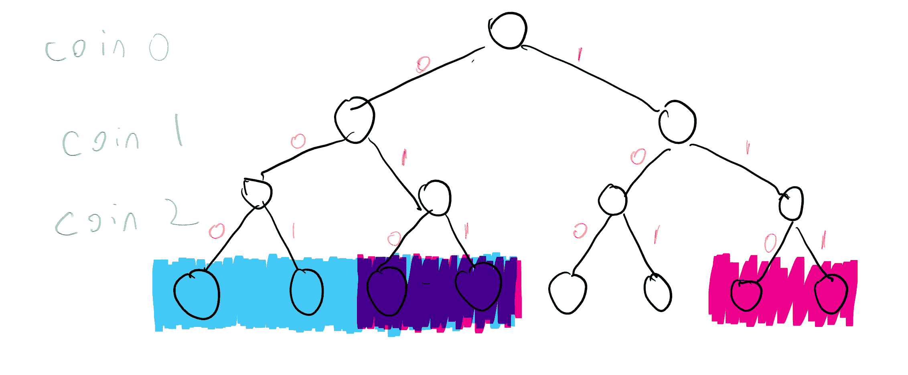
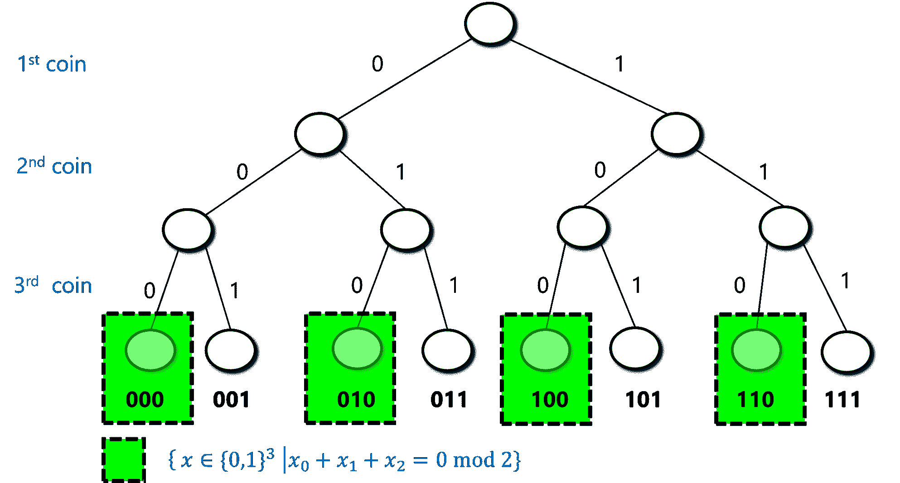
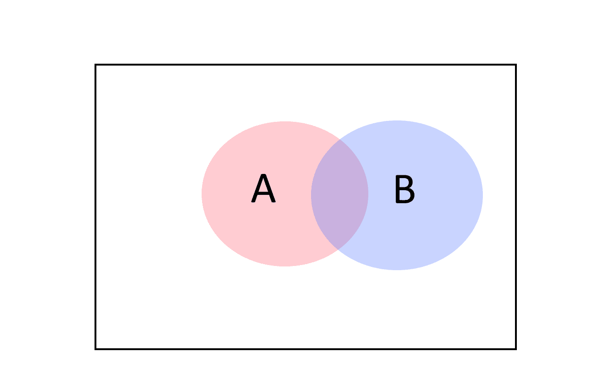
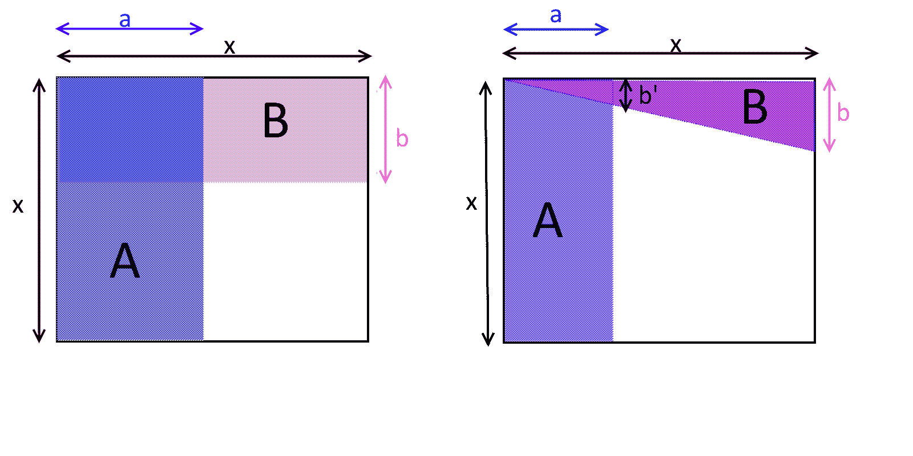
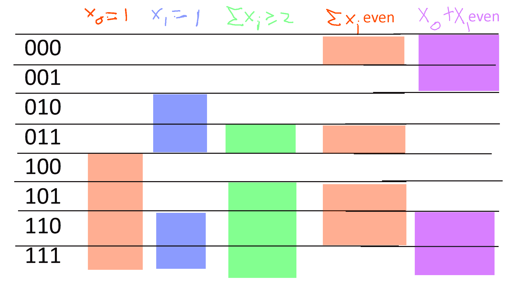
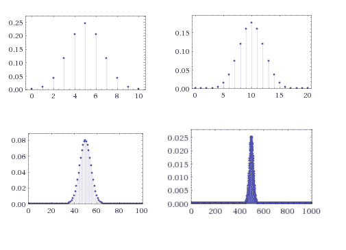
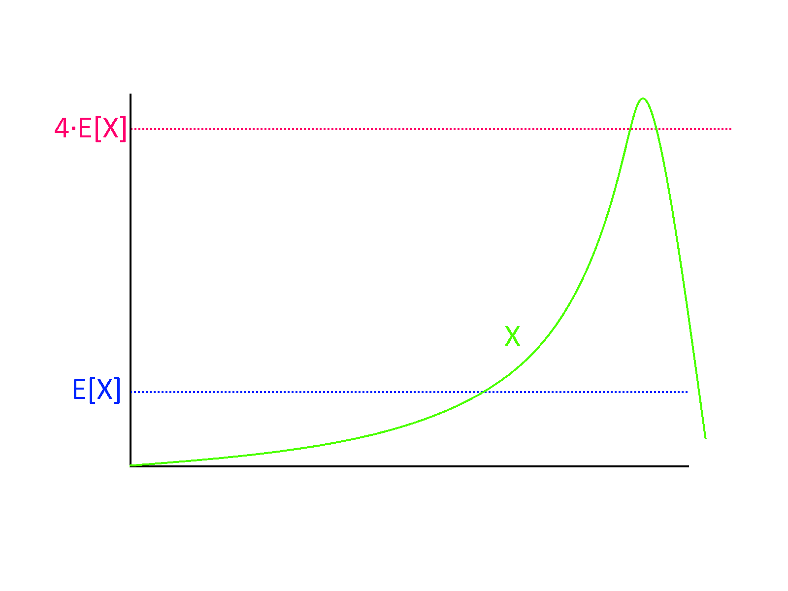
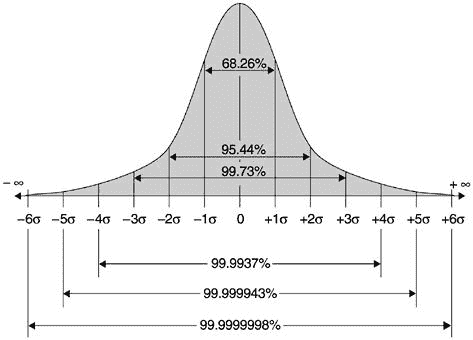

# 数学背景

> 原文：[`intensecrypto.org/public/lec_00_1_mathematical-background.html`](https://intensecrypto.org/public/lec_00_1_mathematical-background.html)

*如有错误/打字错误/令人困惑的解释，请[在 GitHub 上提交问题](https://github.com/boazbk/crypto/issues/new)。您也可以在下面评论。*

**★ 另请参阅本章的[PDF 版本](https://files.boazbarak.org/crypto/lec_00_1_mathematical-background.pdf)（更好的格式/参考文献）★**

这是对我们将在这门课程中使用的某些数学工具（尤其是概率论）的简要回顾。另请参阅我的《理论计算机科学导论》笔记中的[数学背景](http://www.introtcs.org/public/lec_00_1_math_background.html)和[概率](http://www.introtcs.org/public/lec_15_probability.html)讲座，其中包含以下文本的大部分内容。

在哈佛，这些材料（以及更多）在 Stat 110“概率论导论”、CS20“离散数学”和 AM107“图论与组合数学”中都有所教授。这些材料的良好来源包括 Papadimitriou 和 Vazirani 的讲义（参见 Umesh Vazirani 的主页）、MIT 课程 6.042“计算机科学数学”中的 Lehman, Leighton 和 Meyer（第 1-2 章和第 14-19 章特别相关），以及伯克利大学的 CS 70 课程。我们最常用的数学工具是离散概率。Alon 和 Spencer 的《概率方法》是这一领域的宝贵资源。此外，Mitzenmacher 和 Upfal 以及 Prabhakar 和 Raghavan 的书籍从更算法的角度涵盖了概率论。关于我们将讨论的一些数学概念的精彩通俗讨论，请参阅 Jordan Ellenberg 的《如何不犯错》一书。

虽然对算法的了解并非绝对必要，但了解一些会有很大帮助。没有上过如 CS 124 这样的算法课程的学生可能想看看以下书籍：(1) Corman, Leiserson, Rivest 和 Smith，(2) Dasgupte, Papadimitriou 和 Vaziarni，或(3) Kleinberg 和 Tardos。我们不需要学生有复杂度或可计算性的先验知识，但一些基本了解可能会有所帮助。没有上过如 CS 121 这样的计算理论课程的学生可能想看看我的讲义或与我合著的书中前两章。

## 数学先决条件的简要概述

我们在这门课程中将使用的主要概念如下：

+   **证明：** 首先，这门课程将涉及大量的形式化数学推理，这包括数学**定义**、**陈述**和**证明**。

+   **集合和函数：** 我们将假设读者熟悉集合的基本概念以及集合运算，如并集（表示为 $\cup$）、交集（表示为 $\cap$）和集合差（表示为 $\setminus$）。我们用 $|A|$ 表示集合 $A$ 的大小。我们还假设读者熟悉函数，以及诸如一一对应（单射）函数和满射（满射）函数等概念。如果 $f$ 是从集合 $A$ 到集合 $B$ 的函数，我们用 $f:A\rightarrow B$ 表示。如果 $f$ 是一一对应的，则这表示 $|A| \leq |B|$。如果 $f$ 是满射的，则 $|A| \geq |B|$。如果 $f$ 是排列/双射（例如，既是单射又是满射），则这表示 $|A|=|B|$。

+   **大 O 符号：** 如果 $f,g$ 是从 ${\mathbb{N}}$ 到 ${\mathbb{N}}$ 的两个函数，那么（1）如果存在一个常数 $c$，使得对于每个足够大的 $n$，$f(n) \leq c\cdot g(n)$，则 $f = O(g)$；（2）如果 $g=O(f)$，则 $f = \Omega(g)$；（3）$f = \Theta(g)$ 表示 $f=O(g)$ 和 $g=O(f)$；（4）如果对于每个 $\epsilon>0$，对于每个足够大的 $n$，$f(n) \leq \epsilon \cdot g(n)$，则 $f = o(g)$；（5）如果 $g = o(f)$，则 $f = \omega(g)$。为了强调输入参数，我们经常写成 $f(n) = O(g(n))$ 而不是 $f = O(g)$，并且对 $o,\Omega,\omega,\Theta$ 使用类似的符号。虽然这只是一个粗略的经验法则，当你看到形式为 $f(n)=O(g(n))$ 的陈述时，你通常可以在心中将其替换为 $f(n) \leq 1000g(n)$ 的陈述，而 $f(n) = \Omega(g(n))$ 的陈述通常可以被视为 $f(n)\geq 0.001g(n)$。

+   **逻辑运算：** AND、OR 和 NOT（表示为 $\wedge,\vee,\neg$）运算符以及量词“存在”和“全称”（表示为 $\exists,\forall$）。

+   **元组和字符串：** 符号 $\Sigma^k$ 和 $\Sigma^*$，其中 $\Sigma$ 是某个有限集合，称为**字母表**（通常 $\Sigma = \{0,1\}$）。

+   **图论：** 无向图和有向图，连通性，路径和环。

+   **组合数学基础：** 如 $\binom{n}{k}$（从大小为 $n$ 的集合中选取 $k$ 大小子集的数量）等概念。

+   **离散概率：** 我们将广泛使用**概率论**，特别是对**有限**样本空间（如掷 $n$ 枚硬币）的概率，包括**随机变量**、**期望**和**集中**等概念。

+   **模运算**：我们将使用[模运算](https://en.wikipedia.org/wiki/Modular_arithmetic)（即，对某个数$m$取模的加法和乘法），特别是讨论元素取模$m$的向量和矩阵的运算。如果$n$是一个整数，那么我们用$a \pmod{n}$表示$a$除以$n$的余数。$a\pmod{n}$是满足$a = kn+r$的整数$k$的数$r$，其中$r$属于\{0,\ldots,n-1\}。$a\pmod{n} + b \pmod{n} = (a+b) \pmod{n}$和$a\pmod{n} \cdot b \pmod{n} = (a\cdot b) \pmod{n}$将会非常有用，因为模运算继承了整数运算的所有规则（结合律、交换律等）。如果$a,b$是正整数，那么$gcd(a,b)$是同时整除$a$和$b$的最大整数。已知对于每一个$a,b$，存在（不一定为正的）整数$x,y$，使得$ax + by = gcd(a,b)$（这是一个很好的练习，可以自己证明）。特别是，如果$gcd(a,n)=1$，那么存在$a$的**模逆元**，这是一个数$b$，使得$ab = 1 \pmod{n}$。我们有时将$b$写成$a^{-1} \pmod{n}$。

+   **群论，线性代数**：在课程的后期部分，我们将需要矩阵、向量、矩阵乘法和逆、行列式、特征值和特征向量的概念。这些可以在任何线性代数的基本教材中找到。在某些部分，我们也可能使用一些群论的基本事实（仅限于有限群，并且主要是交换群）。这些也可以在过程中学习，而且不需要先修的群论课程。

+   **离散概率**：*概率论*，特别是对*有限*样本空间（如掷$n$枚硬币）的概率，是密码学的一个关键部分，因为（正如我们将看到的）没有随机性就没有秘密。

## 数学证明

毫无疑问，**这门课程所需的数学先决条件**是对数学证明的某种程度的舒适度。许多学生倾向于将数学证明视为一个非常正式的对象，就像在学校几何学中学习的证明一样，由一系列公理和通过非常具体的规则从中推导出的陈述组成。事实上，

> *证明是一篇旨在说服人类读者某个特定陈述为真的写作。*

（在这个课程中，你试图说服的特定人类是我和助教。）

要写出某个陈述 X 的证明，你需要遵循三个步骤：

1.  确保你完全理解陈述 X。

1.  一直思考 X，直到你能够**说服自己**X 是正确的。

1.  思考如何以最清晰的方式呈现论点，以便你也能说服读者。

就像任何优秀的写作一样，一个证明应该是简洁的，不应该过于正式或笨拙。事实上，过度使用形式主义往往会对论点产生负面影响，因为它可能会掩盖作者和读者在论点中的弱点。有时，学生们试图“把厨房里的所有东西都扔进答案里”，试图列出所有可能相关的事实，希望得到部分分数。但证明是一种写作，一个写得不好的证明即使包含一些正确元素也不会得到分数。写一个部分陈述的清晰证明更好。特别是，如果你还没有说服自己这个陈述是真实的，你应该对此诚实，并解释你验证了陈述的哪些部分以及哪些部分你没有验证。

### 示例：无穷多个素数的存在。

在“说一套做一套”的精神下，我现在将通过详细阐述这个观点，并花几个段落来详细说明一个简单的证明，这个证明是欧几里得在大约公元前 300 年写的。回想一下，**素数**是一个大于 1 的整数 $p$，它唯一的因数是 $p$ 和 $1$。欧几里得定理如下：

存在无限多个素数。

我们不直接写下这个证明，而是尝试理解我们如何得出这个证明。（如果你以前没有见过这个证明，或者你不记得它，你可能想在这一点上停下来，自己尝试想出它，然后再继续阅读。）第一步（通常是也是最重要的一步）是理解这个陈述的含义。说素数的数量是无限的，意味着它不是有限的。更确切地说，这意味着对于每一个自然数 $k$，都存在超过 $k$ 个素数。

现在我们已经理解了我们需要证明什么，让我们尝试说服自己这个事实。一开始，这可能会显得很明显——因为自然数是无限的，每一个自然数都可以分解成素数，所以一定有无限多个素数，对吧？

错误。因为我们可以用一个素数多次相乘，有限数量的素数可以生成无限多个数。确实，单个素数 $3$ 生成了一组无限的所有形式为 $3^n$ 的数。所以，我们真正需要证明的是，对于每一个有限素数集合 $\{ p_1,\ldots,p_k\}$，存在一个数 $n$，它有一个在这个集合之外的素数因子。

现在我们需要开始尝试。假设我们只有两个质数 $p$ 和 $q$。我们如何找到一个既不是由 $p$ 也不是由 $q$ 生成的数 $n$？如果你在数轴上尝试画图，你会看到 $p$ 和 $q$ 的倍数之间总是存在一些*间隙*，即它们永远不会连续。这是可以证明的（事实上，这并不是一个糟糕的练习），但这个观察已经暗示了一个猜测，即一个既不能被 $p$ 也不能被 $q$ 整除的数，即 $pq+1$。确实，$n=pq+1$ 除以 $p$ 或 $q$ 的余数将是 $1$（这特别不是零）。这个观察可以推广，我们可以设 $n=pqr+1$ 为一个既不能被 $p$、$q$ 也不能被 $r$ 整除的数，更一般地，$n=p_1\cdots, p_k +1$ 也不能被 $p_1,\ldots,p_k$ 整除。

现在我们已经说服了自己这个命题，是时候考虑如何以最清晰的方式将其写下来。出现的一个问题是，我们想要真正从质数的定义和第一原理出发来证明事物，而不假设除法和余数的性质，甚至不假设质因数分解的存在，除非已经证明。下面是一个证明可能的样子。我们将证明以下两个引理：

对于每一个整数 $n>1$，都存在一个质数 $p>1$ 能整除 $n$。

对于每一个整数集合 $p_1,\ldots,p_k>1$，存在一个数 $n$，使得 $p_1,\ldots,p_k$ 中没有一个能整除 $n$。

从这两个引理可以得出，存在无穷多个质数，因为否则如果我们让 $p_1,\ldots,p_k$ 是所有质数的集合，那么我们会得到一个矛盾，因为通过结合引理 0.2 和引理 0.3，我们会得到一个包含该集合外质因数的数 $n$。我们现在证明这两个引理：

设 $n>1$ 为一个数，设 $p$ 为大于 $1$ 的 $n$ 的最小除数（由于 $n$ 可以整除自身，所以存在这样的数 $p$）。我们断言 $p$ 是一个质数。确实，假设否则存在某个 $1< q < p$ 能整除 $p$。那么由于 $n = pc$ 对于某个整数 $c$ 和 $p=qc'$ 对于某个整数 $c'$，我们将得到 $n=qcc'$，因此 $q$ 与 $n$ 的选择矛盾，因为 $p$ 是 $n$ 的最小除数。

设 $n=p_1 \cdots p_k + 1$，并假设为了矛盾的目的，存在某个 $i$ 使得 $n = p_i\cdot c$ 对于某个整数 $c$。那么如果我们把方程 $n - p_1 \cdots p_k = 1$ 除以 $p_i$，那么我们在左边得到 $c$ 减去一个整数，而在右边得到 $1/p_i$ 的分数。

这完成了对引理 0.1 的证明。

## 概率和样本空间

在密码学中，可能需要的最主要数学背景是概率论，因为，正如我们将看到的，没有随机性就没有秘密。幸运的是，我们只需要相当基本的概率论概念，特别是只有有限样本空间上的概率。如果你对抛掷 $k$ 枚随机硬币时发生的情况有很好的理解，那么你就知道你需要的大部分概率知识。

下面的讨论并不旨在取代概率论课程，如果你之前没有接触过这些材料，我强烈建议你查阅额外的资源以跟上进度。1

随机性和概率的本质是一个具有深刻哲学、科学和数学意义的主题。世界上是否存在真正的随机性，或者它是否从时间开始时设定的某些初始条件以确定性的时钟方式运行？概率是指我们信念的不确定性，还是指重复实验中发生频率的次数？我们如何定义无限集合上的概率？

这些都是科学家、数学家、统计学家和哲学家研究并争论的重要问题。幸运的是，我们在这里不需要直接处理这些问题。我们将主要关注抛掷 $n$ 枚随机、无偏和独立的硬币的设置。以下我们将定义在这个设置中限制的基本概率对象——事件和随机变量。这些可以定义在更一般的概率实验或样本空间中，稍后我们将简要讨论如何做到这一点。然而，$n$ 枚硬币的情况对于本课程中我们需要的几乎所有内容都是足够的。

如果我们用“正面”和“反面”来编码每枚硬币的两面，用“零”和“一”来表示，那么我们可以将抛掷 $n$ 枚硬币的结果编码为 $\{0,1\}^n$ 中的字符串。每个特定的结果 $x\in \{0,1\}^n$ 以概率 $2^{-n}$ 获得出现。例如，如果我们抛掷三枚硬币，那么我们以概率 $2^{-3}=1/8$ 获得每种结果 $000,001,010,011,100,101,110,111$（参见图 1）。我们可以将抛掷 $n$ 枚硬币的实验描述为从 $\{0,1\}^n$ 中随机均匀选择一个字符串 $x$，因此我们将 $x\sim \{0,1\}^n$ 作为按照此实验选择的 $x$ 的简写。

1: 抛掷三个硬币的概率实验对应于进行 $2\times 2 \times 2 = 8$ 种选择，每种选择的概率相等。在这个例子中，蓝色集合对应于事件 $A = \{ x\in \{0,1\}³ \;|\; x_0 = 0 \}$，其中第一次抛硬币的结果为 $0$，而粉色集合对应于事件 $B = \{ x\in \{0,1\}³ \;|\; x_1 = 1 \}$，其中第二次抛硬币的结果为 $1$（它们的交集呈现紫色）。正如我们所见，这些事件中的每一个都包含 $4$ 个元素（总共 $8$ 个），因此概率为 $1/2$。$A$ 和 $B$ 的交集包含两个元素，因此这两个事件同时发生的概率是 $2/8 = 1/4$。

一个 *事件* 简单地是 $\{0,1\}^n$ 的子集 $A$。事件 $A$ 的 *概率*，表示为 $\Pr_{x\sim \{0,1\}^n}[A]$（或简写为 $\Pr[A]$，当样本空间从上下文中理解时），是随机选择一个 $x$ 被包含在 $A$ 中的概率。请注意，这与 $|A|/2^n$ 相同（其中 $|A|$ 通常表示集合 $A$ 中的元素数量）。例如，$x$ 有偶数个 1 的概率是 $\Pr[A]$，其中 $A=\{ x : \sum_{i=0}^{n-1} x_i \;= 0 \mod 2 \}$。在 $n=3$ 的情况下，$A=\{ 000,011,101,110 \}$，因此 $\Pr[A]=\tfrac{4}{8}=\tfrac{1}{2}$（参见图 2）。实际上，对于每个 $n$ 都成立：

2: 如果我们抛掷三个硬币 $x_0,x_1,x_2 \in \{0,1\}$，那么 $x_i$ 的和为偶数的概率为 $1/2$，因为它对应于长度为 $3$ 的 $8$ 个可能字符串中的 $4$ 个。

对于每个 $n>0$，

$$\Pr_{x\sim \{0,1\}^n}[ \text{$\sum_{i=0}^{n-1} x_i$ is even }] = 1/2$$

为了测试你对概率的直觉，请在这里停下来，自己证明这个引理。

我们通过归纳 $n$ 来证明这个引理。对于 $n=1$ 的情况是显然的，因为 $x=0$ 是偶数，$x=1$ 是奇数，因此 $x$ 属于 $\{0,1\}$ 的概率是偶数，即 $1/2$。设 $n>1$。我们通过归纳假设认为引理对 $n-1$ 是成立的，我们将证明它对 $n$ 也是成立的。我们将集合 $\{0,1\}^n$ 分成四个不相交的集合 $E_0,E_1,O_0,O_1$，其中对于 $b\in \{0,1\}$，$E_b$ 被定义为 $\{x\in \{0,1\}^n$，使得 $x_0\cdots x_{n-2}$ 中 1 的个数为偶数且 $x_{n-1}=b$ 的集合，同样 $O_b$ 是 $\{x\in \{0,1\}^n$，使得 $x_0 \cdots x_{n-2}$ 中 1 的个数为奇数且 $x_{n-1}=b$ 的集合\)。由于 $E_0$ 是通过将 1 的个数为偶数的 $n-1$ 长度字符串通过数字 $0$ 扩展得到的，因此 $E_0$ 的大小仅仅是这样的 $n-1$ 长度字符串的数量，根据归纳假设，这个数量是 $2^{n-1}/2 = 2^{n-2}$。同样的推理适用于 $E_1$、$O_0$ 和 $O_1$。因此，这四个集合 $E_0,E_1,O_0,O_1$ 的大小都是 $2^{n-2}$。由于 $x\in \{0,1\}^n$ 有偶数个 1 当且仅当 $x \in E_0 \cup O_1$（即，要么前 $n-1$ 个坐标的和为偶数且最后一个坐标为 $0$，要么前 $n-1$ 个坐标的和为奇数且最后一个坐标为 $1$），因此我们得到 $x$ 满足这个属性的概率是

$$ \tfrac{|E_0\cup O_1|}{2^n} = \frac{2^{n-2}+2^{n-2}}{2^n} = \frac{1}{2} \;, $$利用 $E_0$ 和 $O_1$ 是不相交的，因此 $|E_0 \cup O_1| = |E_0|+|O_1|$ 的这一事实。

我们也可以使用交集 ($\cap$) 和并集 ($\cup$) 运算符来讨论事件 $A$ 和事件 $B$ 同时发生的概率，或者事件 $A$ 或事件 $B$ 发生的概率。例如，$x$ 有偶数个 1 且 $x_0=1$ 的概率 $p$ 与 $\Pr[A\cap B]$ 相同，其中 $A=\{ x\in \{0,1\}^n : \sum_{i=0}^{n-1} x_i =0 \mod 2 \}$ 和 $B=\{ x\in \{0,1\}^n : x_0 = 1 \}$。这个概率对于 $n > 1$ 是 $1/4$。（这是一个很好的练习，你可以在这里停下来验证你是否理解为什么是这样。）

因为交集对应于考虑两个事件同时发生的逻辑与，而并集对应于考虑逻辑或，所以我们有时会使用 $\wedge$ 和 $\vee$ 运算符而不是 $\cap$ 和 $\cup$，并将上面定义的这个概率 $p=\Pr[A \cap B]$ 也写成

$$ \Pr_{x\sim \{0,1\}^n} \left[ \sum_i x_i =0 \mod 2 \; \wedge \; x_0 = 1 \right] \;. $$

如果 $A \subseteq \{0,1\}^n$ 是一个事件，那么 $\overline{A} = \{0,1\}^n \setminus A$ 对应于事件 $A$ 不发生的情况。由于 $|\overline{A}|=2^n-|A|$，我们得到

$$\Pr[\overline{A}] = \tfrac{|\overline{A}|}{2^n} = \tfrac{2^n-|A|}{2^n}=1-\tfrac{|A|}{2^n} = 1- \Pr[A] $$这很有道理：因为 $A$ 发生当且仅当 $\overline{A}$ 不发生，所以 $\overline{A}$ 的概率应该是 $A$ 的概率减去一。

虽然上述定义可能看起来非常简单，几乎可以说是显而易见的，但人类的思维似乎并没有进化出进行概率推理的能力，而且人们经常连最简单的概率设置都会出错，这一点令人惊讶。确保你在尝试计算概率陈述时不会感到困惑的一种方法是一直问自己以下两个问题：**（1）我是否理解这个概率是在哪个**样本空间**上取的？**（2）我是否理解我们正在分析的事件的**定义**？

例如，假设我打算对我的课程进行随机座位安排，结果发现坐在第 7 排的学生在期末考试中表现更好：我们应该对此感到多么惊讶？如果我们一开始就假设数字 7 有特殊之处，并提前选择它，那么我们正在讨论的事件是事件 $A$，即坐在第 7 号的学生在期末考试中有更好的表现，我们可能会觉得这很令人惊讶。然而，如果我们首先查看结果，然后选择平均表现最好的那一排，那么我们正在讨论的事件是事件 $B$，即存在**某些**排的表现高于整体平均水平。$B$ 是 $A$ 的超集，其概率（即使座位与表现之间没有相关性）可能相当显著。

### 随机变量

**事件**对应于是/否问题，但通常我们想要分析更细致的问题。例如，如果我们要在轮盘赌上投注，我们不仅想要分析我们是否赢了或输了，还想要分析我们**赚了**多少。一个（实值）**随机变量**只是将一个数字与概率实验的结果相关联的一种方式。形式上，一个随机变量是一个函数 $X:\{0,1\}^n \rightarrow \R$，它将每个结果 $x\in \{0,1\}^n$ 映射到 $\R$ 中的一个元素 $X(x) $。例如，函数 $sum:\{0,1\}^n \rightarrow \R$，它将 $x$ 映射到其坐标之和（即，到 $\sum_{i=0}^{n-1} x_i$），是一个随机变量。

随机变量 $X$ 的**期望**，用 $\E[X]$ 表示，是在概率实验的所有抽取中这个数值的平均值。换句话说，$X$ 的期望定义为以下内容：

$$ \E[X] = \sum_{x\in \{0,1\}^n} 2^{-n}X(x) \;. $$

如果 $X$ 和 $Y$ 是随机变量，那么我们可以定义 $X+Y$ 为将点 $x\in \{0,1\}^n$ 映射到 $X(x)+Y(x)$ 的随机变量。期望的一个基本且非常有用的性质是它是**线性**的：

$$ \E[ X+Y ] = \E[X] + \E[Y] $$$$ \begin{gathered} \E [X+Y] = \sum_{x\in \{0,1\}^n}2^{-n}\left(X(x)+Y(x)\right) = \\ \sum_{x\in \{0,1\}^b} 2^{-n}X(x) + \sum_{x\in \{0,1\}^b} 2^{-n}Y(x) = \\ \E[X] + \E[Y] \end{gathered} $$

同样地，对于每个 $k \in \R$，有 $\E[kX] = k\E[X]$。例如，使用期望的线性性质，很容易证明 $x \sim \{0,1\}^n$ 的 $x_i$ 的和的期望等于 $n/2$。实际上，如果我们写 $X= \sum_{i=0}^{n-1} x_i$，那么 $X= X_0 + \cdots + X_{n-1}$，其中 $X_i$ 是随机变量 $x_i$。由于对于每个 $i$，$\Pr[X_i=0] = 1/2$ 和 $\Pr[X_i=1]=1/2$，我们得到 $\E[X_i] = (1/2)\cdot 0 + (1/2)\cdot 1 = 1/2$，因此 $\E[X] = \sum_{i=0}^{n-1}\E[X_i] = n\cdot(1/2) = n/2$。

如果你之前没有见过离散概率，请再次阅读这个论点，直到你确信你理解了它；这是我们在本课程中反复使用的一种推理类型的典型简单例子。

如果 $A$ 是一个事件，那么 $1_A$ 是这样一个随机变量，使得 $1_A(x)$ 等于 $1$ 当 $x\in A$ 时，否则 $1_A(x)=0$。注意 $\Pr[A] = \E[1_A]$（你能看出为什么吗？）。使用这一点和期望的线性性质，我们可以证明概率论中最有用的界限之一：

对于任意两个事件 $A,B$，$\Pr[ A \cup B] \leq \Pr[A]+\Pr[B]$

在查看证明之前，试着看看为什么并集约束直观上有意义。我们也可以直接从概率的定义和集合的基数，以及方程 $|A \cup B| \leq |A|+|B|$ 出发来证明它。你能看出为什么后者方程是正确的吗？（参见图 3。）

对于每个 $x$，变量 $1_{A\cup B}(x) \leq 1_A(x)+1_B(x)$。因此，$\Pr[A\cup B] = \E[ 1_{A \cup B} ] \leq \E[1_A+1_B] = \E[1_A]+\E[1_B] = \Pr[A]+\Pr[B]$。

我们在理论计算机科学中经常使用这种方法来论证，例如，如果有 100 个可能发生的不良事件，每个事件发生的概率最多为 $1/10000$，那么至少有 $1-100/10000 = 0.99$ 的概率，没有不良事件发生。

3: *并集约束*告诉我们事件 $A$ 或 $B$ 发生的概率最多是各个概率之和。我们可以通过注意到对于任意两个集合 $|A\cup B| \leq |A|+|B|$（只有当 $A$ 和 $B$ 没有交集时才相等）来看到这一点。

### 字符串上的分布

虽然我们大多数时候认为随机变量的输出是 **实数**，但我们有时会考虑输出是 **字符串** 的随机变量。也就是说，我们可以考虑一个映射 $Y:\{0,1\}^n \rightarrow \{0,1\}^*$，并考虑“随机变量” $Y$，对于每个 $y\in \{0,1\}^*$，$Y$ 输出 $y$ 的概率等于 $\tfrac{1}{2^n}\left| \{ x \in \{0,1\}^n \;|\; Y(x)=y \}\right|$。为了避免混淆，我们通常将此类字符串值随机变量称为字符串上的 **分布**。因此，字符串上的 **分布** $Y$ 可以被视为字符串集合 $y_0,\ldots,y_{M-1} \in \{0,1\}^*$ 和概率 $p_0,\ldots,p_{M-1}$（这些是非负数，总和为 1）的有限集合，使得 $\Pr[ Y = y_i ] = p_i$。

两个分布 $Y$ 和 $Y'$ 如果对每个字符串分配相同的概率，则被认为是 **相同的**。例如，考虑以下两个函数 $Y,Y':\{0,1\}² \rightarrow \{0,1\}²$。对于每个 $x \in \{0,1\}²$，我们定义 $Y(x)=x$ 和 $Y'(x)=x_0(x_0\oplus x_1)$，其中 $\oplus$ 是异或运算。尽管这两个函数是不同的，但当在均匀输入上调用时，它们在 $\{0,1\}²$ 上诱导的分布是相同的。对于 $x\sim \{0,1\}²$ 的分布 $Y(x)$ 当然是 $\{0,1\}²$ 上的均匀分布。另一方面，$Y'$ 简单地是将 $00 \mapsto 00$、$01 \mapsto 01$、$10 \mapsto 11$、$11 \mapsto 10$ 映射到 $F:\{0,1\}² \rightarrow \{0,1\}²$，其中 $F(x_0x_1)=x_0x_1$，以及映射 $G:\{0,1\}² \rightarrow \{0,1\}²$，其中 $G(x_0x_1)=x_0(x_0 \oplus x_1)$。

### 更一般的样本空间。

在本章中，我们假设基本概率实验对应于抛掷 $n$ 个独立的硬币，但我们所说的内容很容易推广到从更一般的有限或可数集合 $S$ 中采样 $x$（以及不太容易推广到不可数集合 $S$）。有限集合 $S$ 上的 **概率分布** 简单地是一个函数 $\mu : S \rightarrow [0,1]$，使得 $\sum_{x\in S}\mu(s)=1$。我们将此视为一个实验，其中我们以概率 $\mu(s)$ 获得集合 $S$ 中的每个 $x$，有时我们将其表示为 $x\sim \mu$。**事件** $A$ 是 $S$ 的一个子集，事件 $A$ 的概率，我们用 $\Pr_\mu[A]$ 表示，是 $\sum_{x\in A} \mu(x)$。**随机变量** 是一个函数 $X:S \rightarrow \R$，其中 $X=y$ 的概率等于 $\sum_{x\in S \text{ s.t. } X(x)=y} \mu(x)$。

## 相关性和独立性

概率论中最精致但重要的概念之一是*独立性*（以及对立的*相关性*）。微妙的关联往往隐藏在概率和统计分析中的意外和错误背后，一些错误的预测被归咎于未能正确计算佛罗里达州和亚利桑那州的房价，或者俄亥俄州和密歇根州的选民偏好的相关性。参见乔·布利茨斯坦的精彩演讲[“条件是统计学的灵魂”](https://youtu.be/dzFf3r1yph8)。（另一个棘手的问题当然是*相关性*和*因果关系*之间的区别。幸运的是，在抛掷$n$枚硬币的干净环境中，我们不需要担心这一点。）

两个事件$A$和$B$是*独立的*，如果事件$A$发生的事实不会使事件$B$更有可能发生，也不会使事件$B$更不可能发生。例如，如果我们考虑抛掷$3$枚随机硬币的实验$x\in \{0,1\}³$，我们让$A$是事件$x_0=1$，$B$是事件$x_0 + x_1 + x_2 \geq 2$，那么如果$A$发生，$B$发生的可能性更大，因此这些事件*不是*独立的。另一方面，如果我们让$C$是事件$x_1=1$，那么由于第二次抛掷不受第一次抛掷结果的影响，事件$A$和$C$是独立的。

正式定义是，如果事件$A$和$B$是*独立的*，则$\Pr[A \cap B]=\Pr[A] \cdot \Pr[B]$。如果$\Pr[A \cap B] > \Pr[A]\cdot \Pr[B]$，则我们说$A$和$B$是*正相关*的，而如果$\Pr[ A \cap B] < \Pr[A] \cdot \Pr[B]$，则我们说$A$和$B$是*负相关*的（参见图 1）。

4: 两个事件$A$和$B$是*独立的*，如果$\Pr[A \cap B]=\Pr[A]\cdot \Pr[B]$。在上面的两个图中，空白的$x\times x$正方形是样本空间，$A$和$B$是这个样本空间中的两个事件。在左图中，$A$和$B$是独立的，而在右图中，它们是负相关的，因为如果我们根据$A$来条件化（反之亦然），$B$发生的可能性会更小。从数学上讲，可以通过注意到在左图中$A$和$B$的面积分别是$a\cdot x$和$b\cdot x$，因此它们的概率分别是$\tfrac{a\cdot x}{x²}=\tfrac{a}{x}$和$\tfrac{b\cdot x}{x²}=\tfrac{b}{x}$，而$A \cap B$的面积是$a\cdot b$，对应于概率$\tfrac{a\cdot b}{x²}$。在右图中，三角形$B$的面积是$\tfrac{b\cdot x}{2}$，对应于概率$\tfrac{b}{2x}$，但$A \cap B$的面积是$\tfrac{b' \cdot a}{2}$（对于某个$b'<b$）。这意味着$A \cap B$的概率是$\tfrac{b'\cdot a}{2x²} < \tfrac{b}{2x} \cdot \tfrac{a}{x}$，换句话说，$\Pr[A \cap B ] < \Pr[A] \cdot \Pr[B]$。

如果我们考虑选择 $x\in \{0,1\}³$ 的实验中的上述例子，那么我们可以看到：

$$ \begin{aligned} \Pr[x_0=1] &= \tfrac{1}{2} \\ \Pr[x_0+x_1+x_2 \geq 2] = \Pr[\{ 011,101,110,111 \}] &= \tfrac{4}{8} = \tfrac{1}{2} \end{aligned} $$

但是

$$ \Pr[x_0 =1 \; \wedge \; x_0+x_1+x_2 \geq 2 ] = \Pr[ \{101,110,111 \} ] = \tfrac{3}{8} > \tfrac{1}{2} \cdot \tfrac{1}{2} $$

因此，正如我们已经观察到的，事件 $\{ x_0 = 1 \}$ 和 $\{ x_0+x_1+x_2 \geq 2 \}$ 不是相互独立的，实际上它们是正相关。另一方面，$\Pr[ x_0 = 1 \wedge x_1 = 1 ] = \Pr[ \{110,111 \}] = \tfrac{2}{8} = \tfrac{1}{2} \cdot \tfrac{1}{2}$，因此事件 $\{x_0 = 1 \}$ 和 $\{ x_1 = 1 \}$ 确实是相互独立的。

人们有时会混淆**互斥**和**独立**的概念，但实际上它们是相当不同的。两个事件 $A$ 和 $B$ 是**互斥**的，如果 $A \cap B = \emptyset$，这意味着如果 $A$ 发生了，那么 $B$ 一定没有发生。它们是**独立**的，如果 $\Pr[A \cap B]=\Pr[A]\Pr[B]$，这意味着知道 $A$ 发生不会给我们关于 $B$ 是否发生的信息。如果 $A$ 和 $B$ 有非零概率，那么互斥意味着它们**不是**独立的，因为特别是这意味着它们是负相关的。

**条件概率**：如果 $A$ 和 $B$ 是事件，并且 $A$ 发生的概率不为零，那么我们定义 $B$ 在 $A$ 条件下发生的概率为 $\Pr[B|A] = \Pr[A \cap B]/\Pr[A]$。这相当于在已知 $A$ 已经发生的情况下计算 $B$ 发生的概率。注意，$A$ 和 $B$ 相互独立当且仅当 $\Pr[B|A]=\Pr[B]$。

**多于两个事件**：我们可以将这个定义推广到多于两个事件。我们说事件 $A_1,\ldots,A_k$ 是**相互独立**的，如果知道它们中的任何一组发生了或没有发生，都不会改变集合外事件发生的概率。形式上，条件是对于每个子集 $I \subseteq [k]$，

$$ \Pr[ \wedge_{i\in I} A_i] =\prod_{i\in I} \Pr[A_i]. $$

例如，如果 $x\sim \{0,1\}³$，那么事件 $\{ x_0=1 \}$，$\{ x_1 = 1\}$ 和 $\{x_2 = 1 \}$ 是相互独立的。另一方面，事件 $\{x_0 = 1 \}$，$\{x_1 = 1\}$ 和 $\{ x_0 + x_1 = 0 \mod 2 \}$ **不是**相互独立的，尽管这些事件中的每一对都是独立的（你能看到为什么吗？参见图 5)。

5: 考虑样本空间 $\{0,1\}^n$ 和对应的事件 $A,B,C,D,E$，其中 $A$: $x_0=1$，$B$: $x_1=1$，$C$: $x_0+x_1+x_2 \geq 2$，$D$: $x_0+x_1+x_2 = 0 mod 2$ 和 $D$: $x_0+x_1 = 0 mod 2$。我们可以看到 $A$ 和 $B$ 是独立的，$C$ 与 $A$ 和 $B$ 正相关，三个事件 $A,B,D$ 是相互独立的，而 $A,B,E$ 的每一对都是独立的，但三个事件 $A,B,E$ 并不是相互独立的，因为它们的交集的概率是 $\tfrac{2}{8}=\tfrac{1}{4}$，而不是 $\tfrac{1}{2}\cdot \tfrac{1}{2} \cdot \tfrac{1}{2} = \tfrac{1}{8}$。

### 独立随机变量

我们说两个随机变量 $X:\{0,1\}^n \rightarrow \R$ 和 $Y:\{0,1\}^n \rightarrow \R$ 是独立的，如果对于每一个 $u,v \in \R$，事件 $\{ X=u \}$ 和 $\{ Y=v \}$ 是独立的。（我们用 $\{ X=u \}$ 作为 $\{ x \;|\; X(x)=u \}$ 的简写。）换句话说，如果对于每一个 $u,v \in \R$，$\Pr[ X=u \wedge Y=v]=\Pr[X=u]\Pr[Y=v]$，那么 $X$ 和 $Y$ 是独立的。例如，如果两个随机变量依赖于抛不同硬币的结果，那么它们是独立的：

假设 $S=\{ s_0,\ldots, s_{k-1} \}$ 和 $T=\{ t_0 ,\ldots, t_{m-1} \}$ 是 $\{0,\ldots,n-1\}$ 的不相交子集，并且让 $X,Y:\{0,1\}^n \rightarrow \R$ 是随机变量，使得 $X=F(x_{s_0},\ldots,x_{s_{k-1}})$ 和 $Y=G(x_{t_0},\ldots,x_{t_{m-1}})$ 对于某些函数 $F: \{0,1\}^k \rightarrow \R$ 和 $G: \{0,1\}^m \rightarrow \R$。那么 $X$ 和 $Y$ 是独立的。

命题中的符号有点繁琐，但最终它只是说，如果 $X$ 和 $Y$ 是依赖于两个不相交的硬币集合 $S$ 和 $T$ 的随机变量（例如，$X$ 可能是前 $n/2$ 个硬币的总和，而 $Y$ 可能是第二个 $n/2$ 个硬币中最大的连续零序列），那么它们是独立的。

令 $a,b\in \R$，并令 $A = \{ x \in \{0,1\}^k : F(x)=a \}$ 和 $B=\{ x\in \{0,1\}^m : G(x)=b \}$。由于 $S$ 和 $T$ 是不相交的，我们可以重新排列索引，使得 $S = \{0,\ldots,k-1\}$ 和 $T=\{k,\ldots,k+m-1\}$，而不影响任何概率。因此，我们可以写出 $\Pr[X=a \wedge Y=b] = |C|/2^n$，其中 $C= \{ x_0,\ldots,x_{n-1} : (x_0,\ldots,x_{k-1}) \in A \wedge (x_k,\ldots,x_{k+m-1}) \in B \}$。另一种用字符串连接来写这个的方法是 $C = \{ xyz : x\in A, y\in B, z\in \{0,1\}^{n-k-m} \}$，因此 $|C|=|A||B|2^{n-k-m}$，这意味着

$$ \tfrac{|C|}{2^n} = \tfrac{|A|}{2^k}\tfrac{|B|}{2^m}\tfrac{2^{n-k-m}}{2^{n-k-m}}=\Pr[X=a]\Pr[Y=b] . $$

注意，如果 $X$ 和 $Y$ 是独立的随机变量（如果我们让 $S_X,S_Y$ 表示 $X$ 和 $Y$ 的输出具有正概率的所有数字），那么它成立：

$$ \begin{gathered} \E[ \ensuremath{\mathit{XY}} ] = \sum_{a \in S_X,b \in S_Y} {\textstyle\Pr[X=a \wedge Y=b]}\cdot ab \; =^{(1)} \; \sum_{a \in S_X,b \in S_Y} {\textstyle \Pr[X=a]\Pr[Y=b]}\cdot ab =^{(2)} \\ \left(\sum_{a \in S_X} {\textstyle \Pr[X=a]}\cdot a\right)\left(\sum_{b \in S_Y} {\textstyle \Pr[Y=b]}b\right) =^{(3)} \\ \E[X] \E[Y] \end{gathered} $$其中第一个等式($=^{(1)}$)是由$X$和$Y$的独立性得出的，第二个等式($=^{(2)}$)是通过“展开”右侧的括号得出的，第三个等式($=^{(3)}$)是由期望的定义得出的。（这不是“当且仅当”；参见练习 0.8）。

另一个有用的性质是，如果$X$和$Y$是独立的随机变量，那么对于所有函数$F,G:\R \rightarrow R$，$F(X)$和$G(Y)$也是独立的。这从直观上看是正确的，因为学习$F(X)$只能提供比学习$X$本身更少的信息。因此，如果学习$X$不能让我们了解$Y$（以及$F(Y)$），那么学习$F(X)$也不会。实际上，为了证明这一点，我们可以为每个$a,b \in \R$写出：

$$ \begin{gathered} \Pr[ F(X)=a \wedge G(Y)=b ] = \sum_{x \text{ s.t.} F(x)=a, y \text{ s.t. } G(y)=b} \Pr[ X=x \wedge Y=y ] = \\ \sum_{x \text{ s.t.} F(x)=a, y \text{ s.t. } G(y)=b} \Pr[ X=x ] \Pr[ Y=y ] = \\ \left( \sum_{x \text{ s.t.} F(x)=a } \Pr[X=x ] \right) \cdot \left( \sum_{y \text{ s.t.} G(y)=b } \Pr[Y=y ] \right) = \\ \Pr[ F(X)=a] \Pr[G(Y)=b] . \end{gathered} $$

### 独立随机变量的集合。

我们可以将独立性的概念扩展到超过两个随机变量：我们说随机变量$X_0,\ldots,X_{n-1}$是**相互独立**的，如果对于每个$a_0,\ldots,a_{n-1} \in \R$，

$$ \Pr\left[X_0=a_0 \wedge \cdots \wedge X_{n-1}=a_{n-1}\right]=\Pr[X_0=a_0]\cdots \Pr[X_{n-1}=a_{n-1}] . $$并且类似地，我们有

如果$X_0,\ldots,X_{n-1}$是相互独立的，那么

$$ \E[ \prod_{i=0}^{n-1} X_i ] = \prod_{i=0}^{n-1} \E[X_i] . $$

如果$X_0,\ldots,X_{n-1}$是相互独立的，并且$Y_0,\ldots,Y_{n-1}$定义为$Y_i = F_i(X_i)$，其中$F_0,\ldots,F_{n-1}:\R \rightarrow \R$是某些函数，那么$Y_0,\ldots,Y_{n-1}$也是相互独立的。

我们将证明引理 0.10 和引理 0.11 作为练习 0.9 练习 0.10。现在停下来做这些练习是个好主意，以确保你对独立性的概念感到舒适，因为我们在本课程后面的内容中会大量使用它。

## 浓度与尾部界限

“期望”这个名字有些误导。例如，假设你和我在 10 次抛硬币的结果上打赌，如果它们都出现$1$，那么我给你 100,000 美元，否则你给我 10 美元。如果我们让$X:\{0,1\}^{10} \rightarrow \R$表示你的收益的随机变量，那么我们可以看到

$$ \E[X] = 2^{-10}\cdot 100000 - (1-2^{-10})10 \sim 90 . $$

但我们并不真正“期望”这个实验的结果是你能赚得 90 美元。相反，99.9% 的时间你会付给我 10 美元，而你会赢得头奖的 0.01% 的时间。

然而，如果我们反复进行这个实验（使用新鲜且因此 *独立* 的硬币），那么从长远来看，我们确实期望你的平均收入接近 90 美元，这也是为什么即使每个单独的赌注是随机的，赌场也能以可预测的方式赚钱的原因。例如，如果我们掷 $n$ 个独立且无偏的硬币，那么随着 $n$ 的增长，出现正面的硬币数量将越来越多地 *集中* 在 $n/2$ 附近，根据著名的“钟形曲线”（见 图 6）。

6: 当我们掷 $n=10,20,100,1000$ 个硬币时，获得特定总和的概率会迅速收敛到高斯/正态分布。

概率论的大部分内容都涉及所谓的 *集中* 或 *尾部* 界限，这是对随机变量 $X$ 过度偏离其期望值的概率的上界。其中第一个也是最简单的一个是马尔可夫不等式：

如果 $X$ 是一个非负随机变量，那么 $\Pr[ X \geq k \E[X] ] \leq 1/k$。

马尔可夫不等式实际上是一个非常自然的陈述（参见 图 7）。例如，如果你知道美国平均（而不是中位数！）家庭收入是 70,000 美元，那么特别地，你可以推断最多 25% 的家庭收入超过 280,000 美元，否则，即使剩余的 75% 家庭收入为零，仅前 25% 的家庭收入就会使平均收入超过 70,000 美元。从这个例子中，你就可以看出，在许多情况下，马尔可夫不等式可能不会很 *紧*，偏离期望的概率会小得多：参见下面的切比雪夫不等式和切诺夫不等式。

令 $\mu = \E[X]$ 并定义 $Y=1_{X \geq k \mu}$。也就是说，如果 $X(x) \geq k \mu$，则 $Y(x)=1$，否则 $Y(x)=0$。注意，根据定义，对于每个 $x$，$Y(x) \leq X/(k\mu)$。我们需要证明 $\E[Y] \leq 1/k$。但这很容易证明，因为 $\E[Y] \leq \E[X/k(\mu)] = \E[X]/(k\mu) = \mu/(k\mu)=1/k$。

7: 马尔可夫不等式告诉我们，一个非负随机变量 $X$ 不太可能比其期望值大得多，概率很高。例如，如果 $X$ 的期望值是 $\mu$，那么 $X>4\mu$ 的概率最多是 $1/4$，否则这个样本空间部分的贡献将太大。

**超越马尔可夫不等式：** 马尔可夫不等式表明（非负）随机变量 $X$ 不太可能变得过于疯狂，比如说，是其期望值的百万倍，并且有显著的概率。但理想情况下，我们希望说，以高概率，$X$ 应该非常接近其期望值，例如在 $[0.99 \mu, 1.01 \mu]$ 的范围内，其中 $\mu = \E[X]$。这通常是不正确的，但当 $X$ 是通过组合（例如，相加）许多独立的随机变量获得时，这确实成立。这种现象，其变体被称为“大数定律”、“中心极限定理”、“不变性原理”和“切诺夫界”，是概率论和统计学中最基本的原理之一，也是我们在计算机科学中广泛使用的原理之一。

### 切比雪夫不等式

测量随机变量与其期望值偏差的一个标准方法是使用其 *标准差*。对于一个随机变量 $X$，我们定义 $X$ 的 *方差* 为 $\mathrm{Var}[X] = \E[(X-\mu)²]$，其中 $\mu = \E[X]$；即方差是 $X$ 与其期望值的平均平方距离。$X$ 的 *标准差* 定义为 $\sigma[X] = \sqrt{\mathrm{Var}[X]}$。（这是有定义的，因为方差作为一个平方的平均，总是非负数。）

使用切比雪夫不等式，我们可以控制随机变量偏离其期望值的概率。

假设 $\mu=\E[X]$ 和 $\sigma² = \mathrm{Var}[X]$。那么对于每一个 $k>0$，$\Pr[ |X-\mu | \geq k \sigma ] \leq 1/k²$。

证明来源于马尔可夫不等式。我们定义随机变量 $Y = (X-\mu)²$。然后 $\E[Y] = \mathrm{Var}[X] = \sigma²$，因此根据马尔可夫不等式，$Y > k²\sigma²$ 的概率至多为 $1/k²$。但显然，当且仅当 $|X-\mu| \geq k\sigma$ 时，$(X-\mu)² \geq k²\sigma²$。

使用切比雪夫不等式的一个例子是当 $X = X_1 + \cdots + X_n$ 时的情况，其中 $X_i$ 是 *独立同分布*（简称为 i.i.d）的变量，其值在 $[0,1]$ 范围内，每个变量的期望值为 $1/2$。由于 $\E[X] = \sum_i \E[X_i] = n/2$，我们想要说 $X$ 很可能位于，比如说，区间 $[0.499n,0.501n]$ 内。直接使用马尔可夫不等式并不能帮助我们，因为它只会告诉我们 $X$ 很可能最多是 $100n$（这我们已经知道了，因为它总是介于 $0$ 和 $n$ 之间）。然而，由于 $X_1,\ldots,X_n$ 是独立的，

$$ \mathrm{Var}[X_1+\cdots +X_n] = \mathrm{Var}[X_1]+\cdots + \mathrm{Var}[X_n] \;\;(1)\;. $$(我们将证明这一点留给读者作为练习 0.11。)

对于每一个在 $[0,1]$ 区间内的随机变量 $X_i$，$\mathrm{Var}[X_i] \leq 1$（如果变量始终在 $[0,1]$ 区间内，它不能与其期望值相差超过 $1$），因此 方程 1 意味着 $\mathrm{Var}[X] \leq n$，从而 $\sigma[X] \leq \sqrt{n}$。对于大的 $n$，$\sqrt{n} \ll 0.001n$，特别是如果 $\sqrt{n} \leq 0.001n/k$，我们可以使用切比雪夫不等式来将 $X$ 不在 $[0.499n,0.501n]$ 区间内的概率限制在 $1/k²$。

### 切比雪夫界

切比雪夫不等式已经显示了独立性和集中性之间的联系，但在许多情况下，我们可以期望一个量化的结果更强。如果，如上面的例子所示，$X= X_1+\ldots+X_n$，其中 $X_i$ 是有界且同分布的随机变量，其期望值为 $1/2$，那么随着 $n$ 的增长，$X$ 的分布将大致是 *正态* 或 *高斯* 分布——也就是说，根据 *钟形曲线* 分布（参见 图 6 和 图 8）。这种分布具有 *非常集中* 的特性，即偏离平均值的 $k$ 个标准差的可能性不仅仅是切比雪夫保证的 $1/k²$，而是大约是 $e^{-k²}$。具体来说，对于一个期望值为 $\mu$ 和标准差为 $\sigma$ 的正态随机变量 $X$，$ |X-\mu| \geq k\sigma $ 的概率最多是 $2e^{-k²/2}$。也就是说，我们有一个偏差概率的 *指数衰减*。

8: 在 *正态分布* 或钟形曲线中，偏离期望值的 $k$ 个标准差的概率在 $k²$ 中指数衰减，并且具体来说，以至少 $1-2e^{-k²/2}$ 的概率，一个期望值为 $\mu$ 和标准差为 $\sigma$ 的随机变量 $X$ 满足 $\mu -k\sigma \leq X \leq \mu+k\sigma$。此图给出了 $k=1,2,3,4,5,6$ 的更精确界限。（图片来源：Imran Baghirov）

以下极其有用的定理表明，每次当我们有一个独立且有界的变量的和时，都会发生这种指数衰减。这个定理在不同的社区中有着许多不同的名称，尽管在计算机科学文献中它通常被称为 [切比雪夫界](https://en.wikipedia.org/wiki/Chernoff_bound)：

如果 $X_1,\ldots,X_n$ 是独立同分布的随机变量，且 $X_i \in [0,1]$ 且对于每个 $i$，$\E[X_i]=p$，那么对于每个 $\epsilon >0$

$$ \Pr[ \left| \sum_{i=0}^{n-1} X_i - pn \right| > \epsilon n ] \leq 2\cdot e^{-2\epsilon² n} . $$

我们省略了证明，该证明出现在许多文本中，并使用了马尔可夫不等式在形式为 $Y_i = e^{\lambda X_i}$ 的独立同分布随机变量 $Y_0,\ldots,Y_n$ 上，其中 $\lambda$ 是一个仔细选择的参数。参见 练习 0.14 以获取一个证明简单（但非常有用且具有代表性）的案例，其中每个 $X_i$ 的值是 $\{0,1\}$，且 $p=1/2$。 (参见 练习 0.15 以获取一个推广。) 

## 练习题

证明对于每一个有限的 $S,T$，存在 $(|T|+1)^{|S|}$ 个从 $S$ 到 $T$ 的部分函数。

对于以下每一对函数 $F,G$，确定以下哪个关系成立：$F=O(G)$，$F=\Omega(G)$，$F=o(G)$ 或 $F=\omega(G)$。

1.  $F(n)=n$, $G(n)=100n$。

1.  $F(n)=n$, $G(n)=\sqrt{n}$。

1.  $F(n)=n\log n$, $G(n)=2^{(\log (n))²}$。

1.  $F(n)=\sqrt{n}$, $G(n)=2^{\sqrt{\log n}}$。

1.  $F(n) = \binom{n}{\ceil{0.2 n}}$ , $G(n) = 2^{0.1 n}$ (其中 $\binom{n}{k}$ 是大小为 $n$ 的集合中 $k$ 大小子集的数量) 和 $g(n) = 2^{0.1 n}$。参见脚注以获取提示.^(2)

给出一个函数对 $F,G:\N \rightarrow \N$ 的例子，使得既不 $F=O(G)$ 也不 $G=O(F)$ 成立。

在以下练习中，$X,Y$ 表示某个样本空间 $S$ 上的随机变量。你可以假设 $S$ 上的概率是均匀分布——每个点 $s$ 以概率 $1/|S|$ 输出。因此 ${\mathbb{E}}[X]= (1/|S|)\sum_{s\in S}X(s)$。我们定义 $X$ 和 $Y$ 的方差和标准差如上所述（例如，$Var[X] = {\mathbb{E}}[(X-{\mathbb{E}}[X])² ]$，标准差是方差的平方根）。你可以在后面的练习中重用之前的答案。

1.  证明 $Var[X]$ 总是非负的。

1.  证明 $Var[X] = {\mathbb{E}}[X²] - {\mathbb{E}}[X]²$。

1.  证明总是有 ${\mathbb{E}}[X²] \geq {\mathbb{E}}[X]²$。

1.  给出一个例子，其中随机变量 $X$ 满足 ${\mathbb{E}}[X²] > {\mathbb{E}}[X]²$。

1.  给出一个例子，其中随机变量 $X$ 的标准差不等于 ${\mathbb{E}}[ | X - {\mathbb{E}}[X] | ]$。

1.  给出一个例子，其中随机变量 $X$ 的标准差等于 ${\mathbb{E}}[ | X - {\mathbb{E}}[X] | ]$。

1.  给出一个例子，其中两个随机变量 $X,Y$ 满足 ${\mathbb{E}}[\ensuremath{\mathit{XY}}] = {\mathbb{E}}[X]{\mathbb{E}}[Y]$。

1.  给出一个例子，其中两个随机变量 $X,Y$ 满足 ${\mathbb{E}}[\ensuremath{\mathit{XY}}] \neq {\mathbb{E}}[X]{\mathbb{E}}[Y]$。

1.  证明如果 $X$ 和 $Y$ 是独立的随机变量（即对于每一个 $x,y$，$\Pr[X=x \wedge Y=y]=\Pr[X=x]\Pr[Y=y]$），那么 ${\mathbb{E}}[\ensuremath{\mathit{XY}}]={\mathbb{E}}[X]{\mathbb{E}}[Y]$ 且 $Var[X+Y]=Var[X]+Var[Y]$。

假设 $H$ 被选为一个将数字 $\{1,\ldots,n\}$ 映射到数字 $\{1,..,m \}$ 的随机函数。也就是说，对于每一个 $i\in \{1,\ldots,n\}$，$H(i)$ 被选为 $\{ 1,\ldots, m\}$ 中的一个随机数，并且这个选择对于每一个 $i$ 是独立进行的。对于每一个 $i<j \in \{1,\ldots,n\}$，定义随机变量 $X_{i,j}$ 等于 $1$ 如果 $H(i)$ 和 $H(j)$ 之间发生了 *冲突*，即 $H(i)=H(j)$，否则等于 $0$。

1.  对于每一个 $i<j$，计算 ${\mathbb{E}}[ X_{i,j} ]$。

1.  定义 $Y = \sum_{i<j} X_{i,j}$ 为冲突的总数。计算 ${\mathbb{E}}[ Y ]$ 作为 $n$ 和 $m$ 的函数。特别是，你的答案应该意味着如果 $m < n²/1000$，那么 ${\mathbb{E}}[Y]>1$，因此期望中至少有一个冲突，所以函数 $H$ 不会是一对一。

1.  证明如果 $m > 1000\cdot n²$，那么 $H$ 是一对一的概率至少为 $0.9$。

1.  给出一个随机变量 $Z$（与函数 $H$ 无关）的例子，该变量始终等于一个非负整数，并且满足 ${\mathbb{E}}[Z] \geq 1000$ 但 $\Pr[ Z > 0] < 0.001$。

1.  证明如果 $m < n²/1000$，那么 $H$ 是一对一的概率至多为 $0.1$。

## 练习题

假设我们掷三个独立的公平硬币 $a,b,c \in \{0,1\}$。$a$、$b$、$c$ 的异或值等于 $1$ 的概率是多少？这三个值的与值等于 $1$ 的概率是多少？这两个事件是独立的吗？

给出一个随机变量 $X,Y: \{0,1\}³ \rightarrow \R$ 的例子，使得 $\E[\ensuremath{\mathit{XY}}] \neq \E[X]\E[Y]$。

给出一个随机变量 $X,Y: \{0,1\}³ \rightarrow \R$ 的例子，使得 $X$ 和 $Y$ 不独立，但 $\E[\ensuremath{\mathit{XY}}] =\E[X]\E[Y]$。

证明 引理 0.10。

证明 引理 0.11。

证明如果 $X_0,\ldots,X_{n-1}$ 是独立的随机变量，那么 $\mathrm{Var}[X_0+\cdots+X_{n-1}]=\sum_{i=0}^{n-1} \mathrm{Var}[X_i]$。

回忆一下在某个有限集合 $S$ 上分布 $\mu$ 的定义。香农定义了分布 $\mu$ 的 *熵*，记为 $H(\mu)$，为 $\sum_{x\in S} \mu(x)\log(1/\mu(x))$。其思想是，如果 $\mu$ 是熵为 $k$ 的分布，那么编码 $\mu$ 的成员将需要 $k$ 比特，从平均意义上来说。在这个练习中，我们将证明这个定义。设 $\mu$ 满足 $H(\mu)=k$。

1. 证明对于每一个一对一函数 $F:S \rightarrow \{0,1\}^*$，$\E_{x \sim \mu} |F(x)| \geq k$。

2. 证明对于每一个 $\epsilon$，存在某个 $n$ 和一个一对一函数 $F:S^n \rightarrow \{0,1\}^*$，使得 $\E_{x\sim \mu^n} |F(x)| \leq n(k+\epsilon)$，其中 $x \sim \mu$ 表示从分布 $\mu$ 中独立选择 $x_0,\ldots,x_{n-1}$ 的实验。

定义 $H(p) = p \log(1/p)+(1-p)\log(1/(1-p))$。^(3)

证明对于每一个 $p \in (0,1)$ 和 $\epsilon>0$，如果 $n$ 足够大，那么^(4)

$$ 2^{(H(p)-\epsilon)n }\binom{n}{pn} \leq 2^{(H(p)+\epsilon)n} $$其中 $\binom{n}{k}$ 是二项式系数 $\tfrac{n!}{k!(n-k)!}$，它等于 $\{0,\ldots,n-1\}$ 中 $k$-大小子集的数量。

1.  证明 $\Pr_{x\sim \{0,1\}^n}[ \sum x_i = k ] = \binom{n}{k}2^{-n}$.

1.  使用这个结果和 练习 0.13 来证明（陈氏界的近似版本）当 $X_0,\ldots,X_{n-1}$ 是 $\{0,1\}$ 上每个等于 $0$ 和 $1$ 的概率为 $1/2$ 的独立同分布随机变量时的情形。也就是说，对于每一个 $\epsilon>0$，以及上述 $X_0,\ldots,X_{n-1}$，$\Pr[ |\sum_{i=0}^{n-1} - \tfrac{n/2}| > \epsilon n] < 2^{0.1 \cdot \epsilon² n}$。

练习 0.14 建立了当 $X_0,\ldots,X_{n-1}$ 是期望为 $1/2$ 的 $\{0,1\}$ 上的独立同分布变量时陈氏界的情形。在这个练习中，我们使用一种稍微不同的方法（对随机变量的矩进行界定）来建立一种陈氏界，其中随机变量在 $[0,1]$ 范围内，其期望是某个 $p \in [0,1]$ 的数，这个数可能不同于 $1/2$。设 $X_0,\ldots,X_{n-1}$ 是期望为 $p$ 的独立同分布随机变量，且 $\Pr [ 0 \leq X_i \leq 1 ]=1$。定义 $Y_i = X_i - p$。

1.  证明对于每一个 $j_0,\ldots,j_{n-1} \in \N$，如果存在一个 $i$ 使得 $j_i$ 是奇数，那么 $\E [\prod_{i=0}^{n-1} Y_i^{j_i}] = 0$.

1.  证明对于每一个 $k$，$\E[ (\sum_{i=0}^{n-1} Y_i)^k ] \leq (10kn)^{k/2}$.^(5)

1.  证明对于每一个 $\epsilon>0$，$\Pr[ |\sum_i Y_i| \geq \epsilon n ] \geq 2^{-\epsilon² n / (10000\log 1/\epsilon)}$.^(6)

陈氏界可以用来证明，如果你被给出一个至少有 $\epsilon$ 偏差的硬币，你只需要 $O(1/\epsilon²)$ 个样本就能以极高的置信度拒绝“零假设”，即硬币是完全无偏的。在以下稍微更具挑战性的问题中，我们试图证明这个命题的逆命题，即证明区分一个公平的硬币和一个以概率 $1/2 + \epsilon$ 输出“正面”的硬币至少需要 $\Omega(1/\epsilon²)$ 个样本。

设 $P$ 是 ${\{0,1\}}^n$ 上的均匀分布，$Q$ 是对应于抛掷 $n$ 个硬币的 $1/2+\epsilon$ 偏差分布，其中每个硬币有 $1/2+\epsilon$ 的概率等于 $1$，有 $1/2-\epsilon$ 的概率等于 $0$。也就是说，$x\in{\{0,1\}}^n$ 按照分布 $Q$ 的概率等于 $\prod_{i=1}^n (1/2 - \epsilon + 2\epsilon x_i)$。

1.  证明对于介于$0$和$n$之间的每个阈值$\theta$，如果$n < 1/(100\epsilon)²$，那么在$P$和$Q$下$\sum x_i \leq \theta$的概率分别相差最多$0.1$。因此，除非硬币样本的数量$n$至少是某个常数的$1/\epsilon²$倍，否则无法可靠地通过测试硬币正面数是否高于或低于某个阈值来区分这两种可能性。

1.  证明对于映射${\{0,1\}}^n$到${\{0,1\}}$的每个函数$F$，如果$n < 1/(100\epsilon)²$，那么在$P$和$Q$下$F(x)=1$的概率分别相差最多$0.1$。因此，如果样本数量小于某个常数的$1/\epsilon²$倍，那么根本不存在可以可靠地区分这两种可能性的**测试**。

我们的概率模型涉及抛掷$n$枚硬币，但有时算法需要从其他分布中进行抽样，例如从$\{0,\ldots,M-1\}$中选择一个均匀数（对于某个$M$）。幸运的是，我们可以以指数级小的错误概率来模拟这一点：证明对于每个$M$，如果$n>k\lceil \log M \rceil$，则存在一个函数$F:\{0,1\}^n \rightarrow \{0,\ldots,M-1\} \cup \{ \bot \}$，使得**（1）$F(x)=\bot$的概率最多为$2^{-k}$，**（2）$F(x)$在$F(x) \neq \bot$条件下的分布等于$\{0,\ldots,M-1\}$上的均匀分布。^(7)

假设一个国家有 3 亿人口，其中 52%的人喜欢颜色“绿色”，48%的人喜欢颜色“橙色”。假设我们随机抽取$n$个公民并询问他们最喜欢的颜色（假设他们会如实回答）。以下选项中，最小的$n$值是多少，使得样本中大多数回答“绿色”的概率最多为$0.05$？

1.  1,000

1.  10,000

1.  100,000

1.  1,000,000

如果国家有 3 亿人口，练习 0.18 的答案会改变吗？

在与练习 0.18 相同的假设下，以下选项中，最小的$n$值是多少，使得样本中大多数回答“绿色”的概率最多为$2^{-100}$？

1.  1,000

1.  10,000

1.  100,000

1.  1,000,000

1.  由于公民人数少于$2^{100}$，因此不可能得到如此低的概率。

1.  哈佛的[STAT 110](http://projects.iq.harvard.edu/stat110/home)课程（其讲座可在[youtube](http://projects.iq.harvard.edu/stat110/youtube)上找到）是概率论的一个高度推荐入门课程。还可以参考麻省理工学院“计算机科学数学”课程的这些[讲义](http://www.boazbarak.org/cs121/LLM_probability.pdf)，以及加州大学伯克利分校[CS 70](https://www.eecs70.org/)课程的 12-17 讲笔记。

    ↩

1.  做这件事的一种方法是用[斯特林公式对阶乘函数进行近似](https://goo.gl/cqEmS2)。

    ↩

1.  虽然您不需要这个来解决这个练习，但这是将 $p$ 映射到 $\{0,1\}$ 上 $p$-偏置硬币分布的熵（如 练习 0.12 中定义）的函数，即函数 $\mu:\{0,1\}\rightarrow [0,1]$，其中 $\mu(0)=1-p$ 和 $\mu(1)=p$。

    ↩

1.  **提示**：使用斯特林公式来近似阶乘函数。

    ↩

1.  **提示**：使用二项式系数以及在任何这样的元组中最多有 $k/2$ 个不同索引的事实，将元组 $j_0,\ldots,j_{n-1}$ 的数量限制在使得每个 $j_i$ 都是偶数且 $\sum j_i = k$ 的范围内。

    ↩

1.  **提示**：将 $k$ 设置为 $2\lceil \epsilon² n /1000 \rceil$，然后证明如果事件 $|\sum Y_i | \geq \epsilon n$ 发生，那么随机变量 $(\sum Y_i)^k$ 是比其期望大 $\epsilon^{-k}$ 的因子。

    ↩

1.  **提示**：将 $x\in \{0,1\}^n$ 视为选择 $k$ 个数字 $y_1,\ldots,y_k \in \{0,\ldots, 2^{\lceil \log M \rceil}-1 \}$。输出第一个在 $\{0,\ldots,M-1\}$ 中的这样的数字。

    ↩

## 评论

评论通过 [GitHub 仓库](https://github.com/boazbk/crypto/issues) 使用 [utteranc.es](https://utteranc.es) 应用发布。发表评论需要 GitHub 登录。如果您不想授权应用代表您发布，您也可以直接在 [本页面的 GitHub 问题](https://github.com/boazbk/crypto/issues?q=Mathematical+Background+in%3Atitle) 上发表评论。

编译于 2021 年 11 月 17 日 22:36:05

版权所有 2021，Boaz Barak。

本作品受 [Creative Commons Attribution-NonCommercial-NoDerivatives 4.0 国际许可协议](https://creativecommons.org/licenses/by-nc-nd/4.0/) 的许可。

使用 [pandoc](https://pandoc.org/) 和 [panflute](http://scorreia.com/software/panflute/) 以及从 [gitbook](https://www.gitbook.com/) 和 [bookdown](https://bookdown.org/) 衍生的模板制作。
