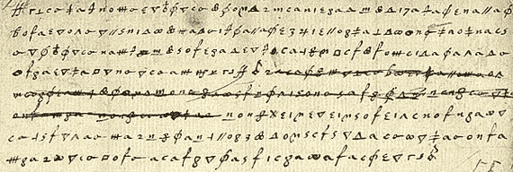
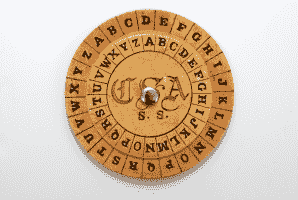
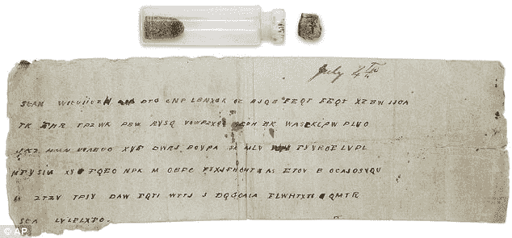
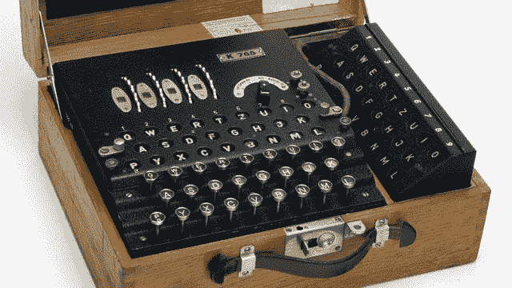
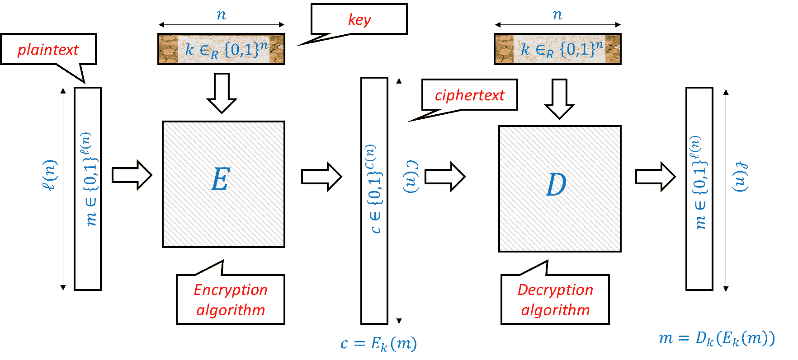
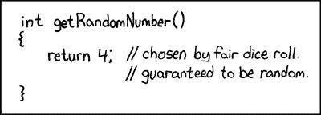
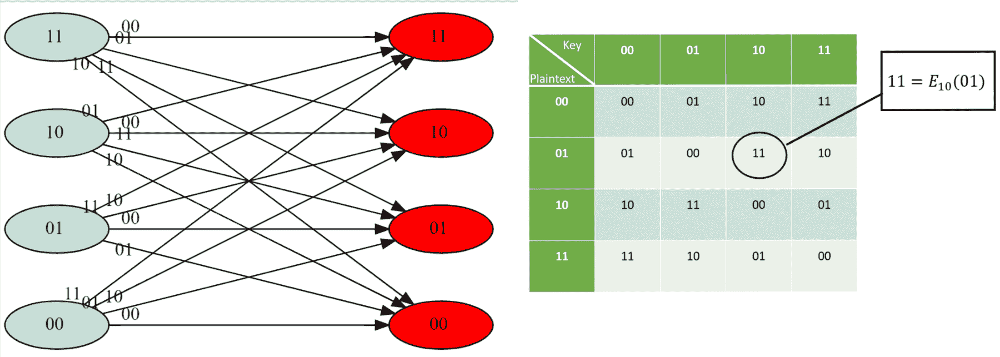
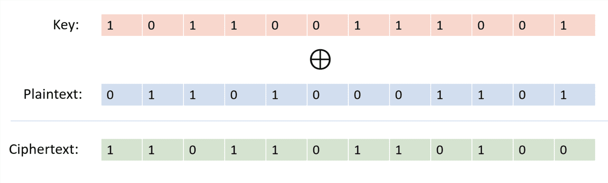
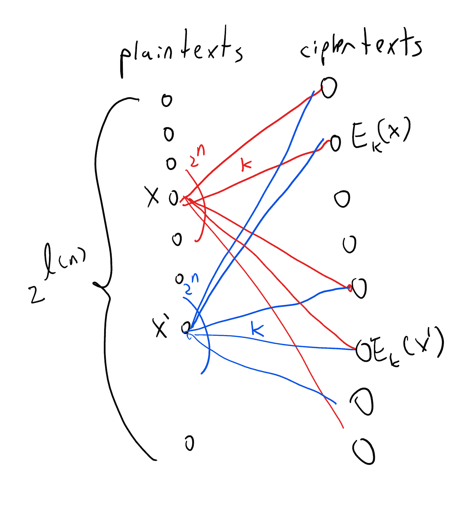
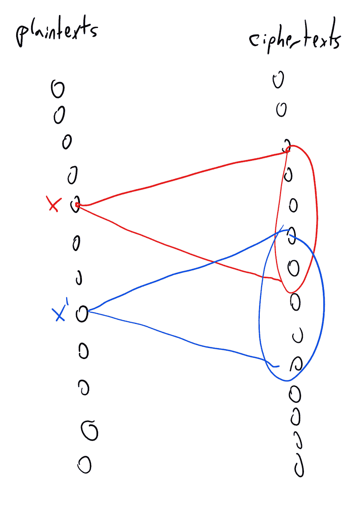

# 引言

> 原文：[`intensecrypto.org/public/lec_01_introduction.html`](https://intensecrypto.org/public/lec_01_introduction.html)

*发现任何错误/打字错误/令人困惑的解释？[在 GitHub 上打开一个问题](https://github.com/boazbk/crypto/issues/new)。您也可以在下面评论*

**★ 另请参阅本章的 [**PDF 版本**](https://files.boazbarak.org/crypto/lec_01_introduction.pdf)（更好的格式/参考文献）★

**附加阅读：** Katz-Lindell 书籍的第一章和第二章。Boneh Shoup 书籍的第 2.1 节（引言）和第 2.2 节（香农密码和完美安全）^(1)

自从人们开始交流以来，就有一些他们希望保密的信息。因此，密码学有一个古老的历史，尽管可能并不显赫。长期以来，密码学与炼金术在许多其他方面聪明的人会被吸引进入这个领域，犯下致命错误的特点上相似。确实，密码学的历史充满了被认为是安全的加密系统被破解的象征性尸体，有时甚至有那些错误地相信这些加密系统的人的实际尸体。关于密码学历史的权威文本是 David Kahn 的《破译者》，其标题已经暗示了大多数加密系统的最终命运.^(2)（另见 Simon Singh 的《密码书》）

我们下面将讲述一些故事，以了解这个领域的氛围。但在这样做之前，我们应该介绍**角色阵容**。加密或秘密写作的基本设置如下：一个人，我们将她称为**爱丽丝**，希望向另一个人，我们将他称为**鲍勃**，发送一条**秘密**信息。由于爱丽丝和鲍勃不在同一个房间（也许因为爱丽丝被她的表亲，英格兰的女王监禁在城堡里），他们不能直接交流，需要通过书面形式发送信息。唉，还有一个第三个人，我们将她称为**伊芙**，可以看到他们的信息。因此，爱丽丝需要找到一种方法来*编码*或*加密*信息，以便只有鲍勃（而不是伊芙）能够理解它。

## 一些历史

在 1587 年，苏格兰女王玛丽，英格兰王位的继承人，想要安排她表亲，英格兰女王伊丽莎白一世的暗杀，以便她能够登上王位，并最终逃离她过去 18 年一直被软禁的房子。作为这个复杂阴谋的一部分，她向安东尼·巴宾顿爵士发送了一封编码信件。

1.1：玛丽女王和巴宾顿爵士之间加密通信的片段

玛丽使用了一种被称为**替换密码**的方法，其中每个字母都被转换成不同的神秘符号（见图 1.1）。乍一看，这样的信件可能显得相当难以辨认——一串无意义的奇怪符号。然而，经过一番思考，人们可能会意识到这些符号*重复*了几次，而且不同的符号以不同的频率重复。现在，我们不需要太大的跳跃就能假设每个符号可能对应一个不同的字母，而频率较高的符号可能对应字母表中频率较高的字母。从这个观察结果来看，要完全破解这个密码，只需要很短的时间，实际上是由伊丽莎白女王的间谍完成的，他们使用解码后的字母了解所有共谋者，并指控玛丽女王犯有叛国罪，她因此被处决。相信表面上的安全措施（例如使用“难以辨认”的符号）是密码用户多年来一直在陷入的陷阱。（正如许多事情一样，这也是 XKCD 漫画的主题，见图 1.2。）

1.2: XKCD 对使用不常见符号增加安全性的看法

[维吉尼亚密码](https://en.wikipedia.org/wiki/Vigen%C3%A8re_cipher)是以 Blaise de Vigenère 的名字命名的，他在 1586 年的一本书中描述了它（尽管它是由 Bellaso 更早发明的）。这个想法是使用一系列替换密码——如果有$n$种不同的密码，那么明文的第一封信用第一个密码编码，第二封信用第二个密码编码，第$n$封信用第$n$个密码编码，然后第$n+1$封信再次用第一个密码编码。密钥通常是一个$n$个字母的单词或短语，第$i$个替换密码是通过将每个字母在字母表中移动$k_i$个位置来获得的。这“平坦”了频率，使得频率分析变得非常困难，这就是为什么这个密码被认为“不可破解”了 300 多年，并得到了“le chiffre indéchiffrable”（“不可破解的密码”）的昵称。尽管如此，查尔斯·巴贝奇在 1854 年破解了维吉尼亚密码（尽管他没有发表它）。在 1863 年，弗里德里希·卡西斯基破解了这个密码并发表了结果。这个想法是，一旦你猜出密码的长度，你就可以将任务简化为破解一个简单的替换密码，这可以通过频率分析来完成（你能看到为什么吗？）。联盟将军在南北战争中经常使用维吉尼亚密码，他们的信息通常被联邦军官进行密码分析。

12.1: 用于实现维吉尼亚密码的联盟密码盘

12.1: 美国南部联盟对信息“Gen’l Pemberton: 你可以期待从河的这一边得不到任何帮助。如果可能的话，让 Gen’l Johnston 知道，你何时可以攻击敌人防线上的同一地点。也请通知我，我将尽力制造一个干扰。我已经发送了一些帽子。附上 Johnston 将军的急件。”进行加密。

*Enigma* 密码机是一种机械密码机（看起来像一台打字机，见图 1.5），每个输入的字母都会根据（相当复杂的）密钥和机器的当前状态映射到不同的字母。另一端的相同线路的机器可以用来解密。就像历史上的许多密码一样，德国人也认为这是“不可能被破解的”，甚至在战争相当晚的时候，他们仍然不相信它被破解了，尽管有越来越多的证据表明这一点。（事实上，一些德国将军甚至在战争结束后仍然不相信它被破解了。）破解 Enigma 是一个英雄般的努力，这项努力由波兰人发起，然后在布莱切利公园由英国人完成，其中艾伦·图灵（图灵机的发明者）扮演了关键角色。作为这项努力的一部分，英国人建造了世界上第一个大规模的机械计算设备（尽管它们看起来更像是洗衣机而不是 iPhone）。他们还得到了一些德国操作员的古怪和错误的有力帮助。例如，他们的信息以“Heil Hitler”结束，结果证明非常有用。

1.5: 在 *Enigma* 机械密码机中，密钥将是转子和内部线的设置。当操作员输入信息时，加密后的版本会显示在上方的显示区域，并且密码机的内部状态会更新（因此连续输入相同的字母通常会输出两个不同的字母）。解密过程遵循相同的步骤：如果发送者和接收者使用相同的密钥，那么输入密文将会在显示区域显示出明文。

这里有一个有趣的故事：恩尼格玛机永远不会将一个字母映射到它自己。1941 年 3 月，布莱切利公园的密码分析师梅维斯·贝蒂收到一条非常长的消息，她试图解密。她注意到一个奇怪的性质——消息中*没有*包含字母“L”。^(3) 她意识到，消息中没有“L”出现的概率太小，不可能偶然发生。因此，她推测原始消息必须只由“L”组成。也就是说，操作员，可能是为了测试机器，简单地发送了一条重复按字母“L”的消息。这个观察帮助她解密了下一条消息，这有助于告知计划中的意大利攻击，并在被称为“马塔潘角战役”的战斗中确保英国获得压倒性的胜利。梅维斯还帮助破解了另一台恩尼格玛机。利用她提供的信息，英国人能够向德国人提供虚假信息，称主要盟军入侵将在加莱而不是诺曼底发生。

用艾森豪威尔将军的话说，布莱切利公园的情报具有“无价的价值”。它对盟军战争努力产生了巨大的影响，从而缩短了第二次世界大战，并挽救了数百万人的生命。参见[与哈利·欣斯利爵士的这次访谈](http://www.cix.co.uk/~klockstone/hinsley.htm)。

## 定义加密

历史上（以及现在）密码系统设计者面临的大多数麻烦（以及仍然面临的！）可以归因于没有正确定义或理解他们最初想要实现的目标。我们现在转向实际定义什么是加密方案。显然，我们可以将每条消息编码为比特串，即 $\{0,1\}^\ell$ 的一个元素，其中 $\ell$ 是某个值。同样，我们也可以将密钥编码为比特串，即 $\{0,1\}^n$ 的一个元素，其中 $n$ 是某个值。因此，我们可以将加密方案视为由两个函数组成。*加密函数* $E$ 将一个秘密密钥 $k \in \{0,1\}^n$ 和一个消息（也称为*明文*）$m\in \{0,1\}^\ell$ 映射到一个*密文* $c \in \{0,1\}^L$，其中 $L$ 是某个值。我们将其写作 $c = E_k(m)$。*解密函数* $D$ 执行相反的操作，将秘密密钥 $k$ 和密文 $c$ 映射回明文消息 $m$，我们将其写作 $m = D_k(c)$。基本方程是，如果我们使用相同的密钥进行加密和解密，那么我们应该得到相同的信息。也就是说，对于每个 $k \in \{0,1\}^n$ 和 $m\in \{0,1\}^\ell$，

$$ m = D_k(E_k(m)) \;.$$

这促使我们提出以下定义，试图捕捉到一个加密方案为何是“有效”或“有意义”的含义，无论其是否是“安全”的：

设 $\ell:\N \rightarrow \N$ 和 $C:\N \rightarrow \N$ 是两个将自然数映射到自然数的函数。一个将字符串映射到字符串的多项式时间可计算函数对 $(E,D)$ 是一个有效的私钥加密方案（或简称为加密方案），具有明文长度函数 $\ell(\cdot)$ 和密文长度函数 $C(\cdot)$，如果对于每一个 $n\in \N$，$k\in \{0,1\}^n$ 和 $m \in \{0,1\}^{\ell(n)}$，有 $|E_k(m)|= C(n)$ 并且

$$ D(k,E(k,m))=m \;.\; (1.1) $$

我们经常将加密和解密算法的第一个输入（即密钥）写成下标，因此也可以将 方程 1.1 写成 $D_k(E_k(m))=m$。

1.6：私钥加密方案是一对算法 $E,D$，对于每一个密钥 $k\in \{0,1\}^n$ 和明文 $x\in \{0,1\}^{\ell(n)}$，$c=E_k(m)$ 是长度为 $C(n)$ 的密文。如果对于每一个这样的 $y$，$D_k(y)=x$，则加密方案是 *有效的*。也就是说，加密 $x$ 的解密是 $x$，只要加密和解密都使用相同的密钥。

有效性条件意味着对于任何固定的 $k$，映射 $m \mapsto E_k(m)$ 是一对一的（你能看出为什么吗？）因此，密文长度总是至少与明文长度相同。因此，我们通常关注明文长度作为加密方案中要优化的数量。$\ell(n)$ 越大，方案越好，因为这意味着我们需要更短的密钥来保护相同长度的消息。

*关于符号的说明:* 我们将始终使用 $i,j,\ell,n$ 来表示自然数。

数字 $n$ 通常表示我们密钥的长度。密钥的长度（或另一个与之密切相关的人数）在文献中通常被称为 *安全参数*。Katz-Lindell 也用 $n$ 来表示这个参数，而 Boneh-Shoup 和 Rosulek 则用 $\lambda$ 表示。（一些文本也用希腊字母 $\kappa$ 表示相同的参数。）我们选择用 $n$ 表示安全参数，以与标准算法符号表示法（如 $O(n)$ 或 $O(n²)$ 时间算法）中的输入长度相对应。

我们经常用 $\ell$ 表示消息的长度，有时也称为“块长度”，因为较长的消息只是简单地被切割成长度为 $\ell$ 的“块”，并且也适当地填充。

我们将用 $k$ 表示密钥，用 $m$ 表示秘密明文消息，用 $c$ 表示加密密文。请注意，$k,m,c$ 不是数字，而是长度分别为 $n,\ell(n),C(n)$ 的位字符串。我们有时也会使用 $x$ 和 $y$ 来表示字符串，因此有时将 $x$ 作为明文，将 $y$ 作为密文。一般来说，尽管我们试图为特定目的保留变量名，但密码学使用了许多概念，有时需要“重复使用”相同的字母来表示不同的目的。

为了简单起见，我们用 $\{0,1\}^n$ 表示可能密钥的空间，用 $\{0,1\}^\ell$ 表示可能消息的空间，其中 $\ell=\ell(n)$。Boneh-Shoup 使用更一般的符号 $\mathcal{K}$ 表示所有可能密钥的空间，$\mathcal{M}$ 表示所有可能消息的空间。这并没有太大区别，因为我们可以将每个离散对象，如密钥或消息，表示为二进制字符串。一个不同之处在于，原则上所有可能消息的空间可能包括无界长度的消息，尽管在这种情况下，理论和实践中通常会将这些消息分成有限大小的块，并一次加密一个块。

## 定义加密的安全性

定义 1.1 没有提及安全性，也没有排除简单的“加密”方案，例如方案 $E_k(m) = m$，它只是简单地输出明文。定义安全性是棘手的，我们将一步一步地进行，但让我们首先思考什么是秘密，什么不是。先验地，我们考虑一个攻击者伊芙，她只是看到了密文 $c=E_k(m)$，并且不知道它是如何生成的。因此，她不知道 $E$ 和 $D$ 的细节，当然也不知道秘密密钥 $k$。然而，许多过去的密码系统所遇到的麻烦都是由于它们依赖于“通过隐蔽性获得安全性”——相信他们的*方法*没有为敌人所知将保护他们免受破解。这是一个错误的假设——如果你反复使用一种方法（即使每次都使用不同的密钥），那么最终你的对手将会发现你在做什么。而且，如果爱丽丝和鲍勃经常在安全地点会面来决定新的方法，他们不妨趁机交换他们的秘密消息…

这些考虑导致 Auguste Kerckhoffs 在 1883 年提出了以下原则：

> *一个密码系统即使在除了密钥之外的所有系统信息都是公开知识的情况下也应该是安全的。*^(4)

为什么可以假设密钥是秘密的而不是算法呢？因为我们可以始终选择一个新的密钥。但当然，如果我们的密钥是“1234”或“passw0rd!”，那么这并不会给我们带来太多帮助。实际上，如果你使用任何确定的算法来选择密钥，那么最终你的对手将会发现这一点。因此，为了安全起见，我们必须随机选择密钥，并且可以将凯克霍夫斯原理重新表述如下：

> *没有随机性就没有秘密*

这是一个至关重要的观点，值得重复：

> *没有随机性就没有秘密*

每个加密方案的核心都有一个秘密密钥，而这个密钥总是随机选择的。由此产生的推论是，为了理解密码学，你需要了解一些概率论。幸运的是，我们不需要太多的概率——只需要有限空间的概率，以及期望、方差、集中和并集等基本概念就足够了。事实上，理解以下两个陈述就已经为你提供了密码学所需的大部分内容：

+   对于每一个固定的字符串 $x\in\{0,1\}^n$，如果你抛掷硬币 $n$ 次，正反面模式恰好为 $x$ 的概率是 $2^{-n}$。

+   $2^{-128}$ 的概率非常非常小。

### 在实际的加密系统中生成随机数

我们如何在实际系统中获取随机位？主要思路是采用两阶段方法。首先，我们需要从攻击者的角度来看，获取一些不可预测的数据。这些数据来源可能包括测量网络或硬盘的延迟（随着固态硬盘的出现而变得越来越困难），用户键盘和鼠标的移动模式（在启动时需要新鲜随机数时会有问题），时钟漂移等等，还有一些其他来源，包括音频、视频和网络。所有这些都可能存在问题，尤其是对于服务器或虚拟机，因此基于现象如热噪声或核衰变的硬件随机数生成器变得越来越受欢迎。一旦我们有了某些不可预测的数据 $X$，我们需要估计其中的 *熵*。你可以大致想象，如果攻击者猜测 $X$ 的概率最多是 $2^{-k}$，那么 $X$ 就有 $k$ 比特的熵。然后，人们使用 *散列函数*（我们稍后会详细讨论）将 $X$ 映射到长度为 $k$ 的字符串，然后希望这个字符串是（接近）均匀随机分布的。整个过程，尤其是理解攻击者可能拥有的熵源信息量，都是一门相当深奥的艺术，而且实际上，许多对加密系统的攻击都是由随机数生成不足所导致的。以下是一些例子。

最早的攻击之一是针对 Netscape 的 SSL 实现（*当时*的浏览器）。Netscape 使用了以下“不可预测”的信息——一天中的时间和进程 ID，这两者最终都被证明是可以预测的（谁知道攻击者也有时钟呢？）。Netscape 通过不发布其伪随机生成器的源代码来通过“隐蔽性安全”保护其安全性，但这一做法被当时的博士研究生 [Ian Goldberg 和 David Wagner](https://www.cs.berkeley.edu/~daw/papers/ddj-netscape.html)（当时是博士生）逆向工程了，他们展示了这一攻击。

在 2006 年，一名程序员从 Debian 分发的 OpenSSL 软件包中生成熵的流程中删除了一行代码，因为它在某些自动验证代码中引起了警告。结果，在两年时间里（直到被发现），这个程序生成的所有随机性都只使用了进程 ID 作为“不可预测”的来源。这意味着在那个时期用户进行的所有通信都相对容易破解（特别是，如果某些实体记录了那次通信，他们也可以事后破解）。这导致了巨大的麻烦，以及全球范围内的密钥再生，尽管人们认为许多弱密钥仍在使用。有关那次事件的更多信息，请参阅[XKCD 的看法](http://www.xkcd.com/424/)。

12.1：XKCD 漫画：随机数生成器

在 2012 年，两个独立的研究团队在互联网上扫描了大量 RSA 密钥，并发现其中大约 4%很容易破解。主要问题是像路由器、互联网连接的打印机等设备。这些设备有时运行 Linux 的变体——一个桌面操作系统——但没有硬盘、鼠标或键盘，它们无法访问桌面系统拥有的许多熵源。加上一些传统的对密码学和软件错误的忽视，这导致了许多密钥实际上很容易破解，更多详情请参阅[这篇博客文章](https://freedom-to-tinker.com/blog/nadiah/new-research-theres-no-need-panic-over-factorable-keys-just-mind-your-ps-and-qs/)和[这个网页](https://factorable.net/)。

在收集熵并将其“净化”或“提取”为长度均匀的随机字符串（例如，几百位长）之后，我们通常需要将其“扩展”为更长的字符串，该字符串也是均匀的（或者至少在所有实际目的上看起来是这样）。我们将在下一讲中讨论如何进行这一步骤。这一步也有其弱点，特别是斯诺登文件，以及舒莫和弗格森的观察，强烈表明国家安全局（NSA）故意在国家标准与技术研究院（NIST）发布的伪随机生成器之一中插入了一个*陷阱门*。幸运的是，这个生成器并没有被广泛采用，但显然 NSA 支付了 1000 万美元给 RSA 安全公司，以便后者将其作为其产品中的默认选项。

## 定义保密需求。

定义加密的保密需求并不简单。在历史上，许多聪明的人犯了错误，并说服自己密码是不易破解的。第一个真正以严谨方式提出这个问题的人是克劳德·香农，他在 1945 年提出了这个问题（尽管他的手稿的部分版本直到 1949 年才解密）。仅仅通过提出这个问题，他就对密码学和实际安全科学做出了巨大的贡献。我们现在将尝试探讨如何回答这个问题。

让我先提醒你，我们将坚持对安全性的**数学精确定义**。这意味着定义必须涵盖所有情况下的安全性，任何单个反例，无论多么“愚蠢”，都会使我们排除一个候选定义。提出“愚蠢”的反例这种练习可能看起来，嗯，有点愚蠢。但实际上，正是这种方法引导香农提出了他的保密理论，该理论（经过大量后续工作）最终彻底改变了密码学，并将这门科学带入了一个新的时代，在这个时代，埃德加·爱伦·坡的格言不再适用，我们能够设计出人类（甚至非人类）的智慧都无法破解的密码。

攻击加密最自然的方式是 Eve 猜测所有可能的关键。在许多加密方案中，这个数字是巨大的，这种攻击是完全不可行的。例如，恩尼格玛密码的理论可能性数量约为 $10^{113}$，这大致意味着即使我们用光速运行的计算机填满银河系，太阳在检查完所有可能性之前还是会熄灭。5 可以理解为什么德国人认为这是不可能的。（注意，尽管可能性数量如此巨大，这样的密钥仍然可以很容易地通过在一张纸上写下 $113$ 位数字来指定和共享。）国家安全局（NSA）的 Ray Miller 计算过，按照德国人使用机器的方式，可能性数量“只有” $10^{23}$，但即使在今天，这仍然是非常困难的，比二战时期的计算能力高许多数量级。因此，很明显，有时可以在不尝试所有可能性的情况下破解加密。一个推论是，拥有大量的密钥组合并不能保证安全，因为攻击者可能会找到一条捷径（就像盟军对恩尼格玛所做的那样）并恢复密钥，而不必尝试所有选项。

由于有可能以极小的概率恢复密钥（例如，通过随机猜测），也许定义加密方案安全性的一个方法是一个攻击者永远不能以显著高于该概率的概率恢复密钥。这里是一个这样的定义尝试：

如果无论 Eve 采用什么方法，她从密文 $c$ 中恢复真实密钥 $k$ 的概率最多为 $2^{-n}$，则加密方案 $(E,D)$ 是**$n$-安全的**。

当你看到试图模拟某些现实生活现象（如安全性）的数学定义时，你应该停下来问问自己：

1.  我是否理解了定义所陈述的数学意义？

1.  这是否是捕捉我们讨论的真实生活现象的合理方式？

回答问题 2 的一个方法是想出满足定义的对象的例子以及违反定义的对象的例子，并看看这是否符合你对这些对象是否表现出我们试图捕捉的现象的直觉。尝试为 定义 1.3 做这件事。

你可能会想知道 定义 1.3 是否“太强”。毕竟，我们如何证明无论 Eve 如何操作，她都无法恢复密钥呢？爱伦·坡会说他总会有我们忽视的方法。然而，事实上，这个定义是太 *弱* 了！考虑以下加密：秘密密钥 $k$ 在 $\{0,1\}^n$ 中随机选择，但我们的加密方案简单地忽略它，并让 $E_k(m)=m$ 和 $D_k(c)=c$。这是一个有效的加密，因为 $D_k(E_k(m))=m$，但当然是不安全的，因为我们只是明文输出。然而，无论 Eve 做什么，如果她只看到 $c$ 而不是 $k$，她就没有办法以比 $2^{-n}$ 更好的概率猜出 $k$ 的真实值，因为它是完全随机选择的，她没有关于它的任何信息。形式上，可以证明以下结果：

设 $(E,D)$ 为上述加密方案。对于每一个函数 $Eve:\{0,1\}^\ell\rightarrow \{0,1\}^n$ 和每一个 $m\in \{0,1\}^\ell$，$Eve(E_k(m))=k$ 的概率恰好是 $2^{-n}$。

这是因为 $E_k(m)=m$，因此 $Eve(E_k(m))=Eve(m)$，这是一个与 $k$ 无关的固定值 $k'\in\{0,1\}^n$。因此，$k=k'$ 的概率是 $2^{-n}$。QED

上述论证背后的数学非常简单，但我敦促你阅读并反复阅读最后两段，直到你确信你完全理解为什么根据上述定义，这种加密实际上是安全的。这是我们将在整个课程中不断使用的推理类型的一个“玩具示例”，你想要确保你能够理解它。

因此，引理 1.4 是正确的，但人们可能会质疑其意义。显然，这个愚蠢的例子并不是我们在陈述这个定义时所意味着的。然而，如上所述，我们不愿意忽略任何愚蠢的例子，并且必须修改定义以排除它们。一个明显的反对意见是，我们并不关心隐藏密钥——我们试图保密的是 *消息*。这表明下一个尝试：

如果对于每一个消息 $m$，无论 Eve 使用什么方法，她从密文 $c=E_k(m)$ 中恢复 $m$ 的概率最多是 $2^{-n}$，则加密方案 $(E,D)$ 是 *$n$-安全的*。

现在这似乎捕捉到了我们想要表达的意思。但记住，我们正在吹毛求疵，真正坚持定义的表述，即对于每个明文消息 $m$ 和每个函数 $Eve:\{0,1\}^C\rightarrow\{0,1\}^\ell$，选择 $k$ 的概率使得 $Eve(E_k(m))=m$ 至多为 $2^{-n}$。但现在我们看出这是不可能的。毕竟，这是要适用于 *每个* 消息 $m$ 和 *每个* 函数 $Eve$ 的，但如果 $m$ 是全零消息 $0^\ell$，而 $Eve$ 是忽略其输入并简单地输出 $0^\ell$ 的函数，那么它将以概率一满足 $Eve(E_k(m))=m$。

因此，如果之前的定义太弱，新的定义则太强，且无法实现。问题是，当然我们可以以概率一猜测一个固定的消息，所以也许我们可以尝试考虑一个带有 *随机* 消息的定义。即：

加密方案 $(E,D)$ 是 *$n$-安全的*，如果无论爱娃采用什么方法，如果 $m$ 是从 $\{0,1\}^\ell$ 中随机选择的，那么她从密文 $c=E_k(m)$ 中恢复 $m$ 的概率至多为 $2^{-n}$。

这种弱化的定义实际上是可以实现的，但我们又把它削弱得太厉害了。考虑一种加密方式，它隐藏消息的最后 $\ell/2$ 位，但完全揭示前 $\ell/2$ 位。猜测随机消息的概率是 $2^{-\ell/2}$，因此这样的方案将按照 定义 1.6 被称为“$\ell/2$ 安全”，但这仍然是一个你不想使用的方案。关键在于，在实践中，我们不会加密随机消息——我们的消息可能是英文的，可能有常见的标题，甚至可能基于上下文有更多的结构。实际上，可能消息只能是“是”或“否”（或者可能是“今天攻击”或“明天攻击”），但我们想确保爱娃（Eve）不知道它是哪一个。因此，使用一种揭示消息前半部分的加密方案（或者坦白地说，甚至只揭示第一位）是不可接受的。

## 完美保密

到目前为止，我们所有尝试的定义都在过于强大（因此不可能）和过于弱（因此不能保证实际安全性）之间摇摆。香农的关键洞察是，在安全的加密方案中，密文不应该揭示关于明文的 *任何额外信息*。因此，例如，如果事先爱娃可以以某个概率 $1/k$ 猜测明文（例如，因为只有 $k$ 种可能性），那么在看到密文后，她不应该能够以更高的概率猜测它。这可以形式化为以下内容：

如果一个加密方案 $(E,D)$ 对于每个明文集合 $M\subseteq\{0,1\}^\ell$ 和伊芙使用的每个策略，当我们随机选择 $m\in M$ 和一个随机密钥 $k\in\{0,1\}^n$ 时，伊芙在看到 $E_k(m)$ 后猜出 $m$ 的概率至多为 $1/|M|$，则该加密方案是**完美保密**的。

尤其是如果我们以 $1/2$ 的概率加密“是”或“否”，那么伊芙（Eve）无法以超过一半的概率猜出是哪一个。事实上，这正是问题的关键所在：

如果一个加密方案 $(E,D)$ 对于任意两个不同的明文 $\{m_0,m_1\} \subseteq \{0,1\}^\ell$ 和伊芙使用的任何策略，当我们随机选择 $b\in\{0,1\}$ 和一个随机密钥 $k\in\{0,1\}^n$ 时，伊芙在看到 $E_k(m_b)$ 后猜出 $m_b$ 的概率至多为 $1/2$，则该加密方案是完美保密的。

“只有如果”方向是显然的——这个条件是大小为 $2$ 的集合 $M$ 的完美保密条件的特例。

“如果”方向较为复杂。我们将使用反证法。我们需要证明，如果存在某个集合 $M$（其大小可能远大于 $2$）和伊芙猜测（基于密文）从 $M$ 中选择的明文的策略，其概率大于 $1/|M|$，那么也存在一个大小为二的集合 $M'$ 和伊芙猜测从 $M'$ 中选择的明文的策略 $Eve'$，其概率大于 $1/2$。

让我们固定消息 $m_0$ 为全零消息，并在 $M$ 中随机选择 $m_1$。根据我们的假设，对于随机密钥 $k$ 和消息 $m_1\in M$，

$$\Pr_{k \leftarrow_R \{0,1\}^n, m_1 \leftarrow_R M}[Eve(E_k(m_1))=m_1] > 1/|M|\;\; (1.2)$$另一方面，对于每个 $k$ 的选择，$m'= Eve(E_k(m_0))$ 是一个与 $m_1$ 的选择无关的固定字符串，因此如果我们从 $M$ 中随机选择 $m_1$，那么 $m_1=m'$ 的概率至多为 $1/|M|$，换句话说$$\Pr_{k \leftarrow_R \{0,1\}^n, m_1 \leftarrow_R M}[Eve(E_k(m_0))=m_1] \leq 1/|M|\;\; (1.3)$$

我们还可以将方程 1.2 和方程 1.3 写成

$$ \E_{m_1 \leftarrow_R M} \Pr[ Eve(E_k(m_1))=m_1] > 1/|M| $$和$$ \E_{m_1 \leftarrow_R M} \Pr[ Eve(E_k(m_0))=m_1] \leq 1/|M| $$其中这些期望是针对 $m_1$ 的选择取的。因此，根据期望的线性$$ \E_{m_1 \leftarrow_R M} \left( \Pr[ Eve(E_k(m_1))=m_1] - \Pr[ Eve(E_k(m_0))=m_1] \right) > 0 \;\; (1.4) $$（换句话说，对于随机的 $m_1$，伊芙在给定 $m_1$ 的加密的情况下输出 $m_1$ 的概率高于伊芙在给定 $m_0$ 的加密的情况下输出 $m_1$ 的概率。）

特别是，根据平均论证（即如果数字的平均值大于 $\alpha$，则至少有一个数字大于 $\alpha$）必须有 $m_1 \in M$ 满足

$$ \Pr[Eve(E_k(m_1))=m_1] > \Pr[Eve(E_k(m_0))=m_1] \;.$$(你能看出为什么吗？这值得停下来再次阅读。)

但是，这可以被转化为一个攻击者 $Eve'$，使得对于 $b \leftarrow_R \{0,1\}$，$Eve'(E_k(m_b))=m_b$ 的概率大于 $1/2$。实际上，我们可以定义 $Eve'(c)$ 为当 $Eve(c)=m_1$ 时输出 $m_1$，否则在 $\{ m_0 , m_1 \}$ 中输出一个随机消息。当 $c=E_k(m_1)$ 时，$Eve'(y)$ 等于 $m_1$ 的概率高于 $c=E_k(m_0)$ 时，因为 $Eve'$ 输出 $m_0$ 或 $m_1$，这意味着 $Eve'(E_k(m_b))=m_b$ 的概率大于 $1/2$。（你能看出为什么吗？）

定理 1.8 的证明并不简单，值得再次阅读并确保你理解了它。一个很好的练习，我强烈建议你现在停下来做一下，就是证明以下内容：如果对于每一个明文 $m,m' \in \{0,1\}^\ell$，两个随机变量 $\{ E_k(m) \}$ 和 $\{ E_{k'}(m') \}$（对于随机选择的密钥 $k$ 和 $k'$）具有完全相同的分布，那么 $(E,D)$ 是完美保密的。

证明一个具有明文长度 $\ell(\cdot)$ 的有效加密方案 $(E,D)$ 是完美保密的，当且仅当对于每一个 $n\in \N$ 和明文 $m,m' \in \{0,1\}^{\ell(n)}$，以下两个分布 $Y$ 和 $Y'$ 在 $\{0,1\}^*$ 上是相同的：

+   $Y$ 是通过采样 $k\leftarrow_R \{0,1\}^n$ 并输出 $E_k(m)$ 得到的。

+   $Y'$ 是通过采样 $k\leftarrow_R \{0,1\}^n$ 并输出 $E_k(m')$ 得到的。

我们只概述证明。练习中的条件与 $|M|=2$ 的完美保密性等价。对于每一个 $M = \{ m,m' \}$，如果 $Y$ 和 $Y'$ 是相同的，那么显然对于每一个攻击者 $Eve$ 和可能的输出 $y$，$\Pr[ Eve(E_k(m))=y] = \Pr[ Eve(E_k(m'))=y]$，因为这些对应于在相同的分布 $Y=Y'$ 上应用 $Eve$。另一方面，如果 $Y$ 和 $Y'$ 不相同，那么必须存在某个密文 $c^*$，使得 $\Pr[ Y=c^*] > \Pr[ Y'=c^*]$（或者反之）。输入 $c$ 的攻击者如果 $c=c^*$ 就猜测 $c$ 是 $m$ 的加密，否则抛硬币，将在这两个加密 $m$ 和 $m'$ 之间区分上获得一些优势，超过 $1/2$。

我们在以下定理中总结了完美保密的等价定义，其（省略的）证明来源于 定理 1.8 和 已解练习 1.1 以及类似的证明思想。

设 $(E,D)$ 是一个具有消息长度 $\ell(n)$ 的有效加密方案。那么以下条件是等价的：

1.  $(E,D)$ 按照 定义 1.7 是完美保密的。

1.  对于每对消息 $m_0,m_1 \in \{0,1\}^{\ell(n)}$，分布 $\{ E_k(m_0) \}_{k \leftarrow_R \{0,1\}^n}$ 和 $\{ E_k(m_1) \}_{k \leftarrow_R \{0,1\}^n}$ 是相同的。

1.  （两消息安全性：伊芙无法比一半更好地猜测两个消息中哪一个被成功加密。）对于每个函数 $Eve:\{0,1\}^{C(n)} \rightarrow \{0,1\}^{\ell(n)}$ 和消息对 $m_0,m_1 \in \{0,1\}^{\ell(n)}$，

$$\Pr_{b \leftarrow_R \{0,1\}, k \leftarrow_R \{0,1\}^n} [ Eve(E_k(m_b))=m_b ] \leq 1/2$$

1.  （任意先验安全性：伊芙无法比她的先验信息更好地猜测哪个消息被成功加密。）对于每个 $\{0,1\}^{\ell(n)}$ 上的分布 $\mathcal{D}$ 和 $Eve:\{0,1\}^{C(n)} \rightarrow \{0,1\}^{\ell(n)}$，

$$\Pr_{m \leftarrow_R \mathcal{D}, k \leftarrow_R \{0,1\}^n}[ Eve(E_k(m))=m ] \leq \max(\mathcal{D})$$

其中我们定义 $\max(\mathcal{D}) = \max_{m^*\in \{0,1\}^{\ell(n)}} \Pr_{m \leftarrow_R \mathcal{D}}[m=m^*]$ 为 $\mathcal{D}$ 下任何元素的最大概率。

### 实现完美保密

因此，完美保密是一个自然条件，并且对于应用来说似乎并不太弱，但实际上能否实现呢？毕竟，两个不同的明文映射到相同分布的条件似乎与鲍勃成功解密密文并找出明文实际上是 $m$ 还是 $m'$ 的条件有些矛盾。但结果却是肯定的！例如，图 1.8 详细描述了两个比特的完美保密加密。

1.8: 一个针对两比特密钥和消息的完美保密加密方案。蓝色顶点代表明文，红色顶点代表密文，每条边将一个明文 $m$ 映射到一个密文 $c=E_k(m)$，并标注了相应的密钥 $k$。由于有四种可能的密钥，图的度数为四，实际上是一个完全二分图。这个加密方案是有效的，因为对于每个 $k\in \{0,1\}²$，映射 $m \mapsto E_k(m)$ 是一对一的，换句话说，就是标注了 $k$ 的边集是一个 *匹配*。

实际上，这可以推广到任意数量的比特：^(6)

存在一个有效且完美保密的加密方案 $(E,D)$，其中 $\ell(n)=n$。

我们的方案是 [一次性密码](https://en.wikipedia.org/wiki/One-time_pad)，也称为“沃纳姆密码”，见 图 1.9。加密非常简单：要加密消息 $m\in \{0,1\}^n$ 并使用密钥 $k \in \{0,1\}^n$，我们只需输出 $m \oplus k$，其中 $\oplus$ 是位运算的异或操作，该操作输出对应于将 $m$ 和 $k$ 的每个坐标进行异或的字符串。

1.9: 在 *一次性密码* 加密方案中，我们使用密钥 $k\in \{0,1\}^n$ 通过密文 $m \oplus k$ 加密明文 $m\in \{0,1\}^n$，其中 $\oplus$ 表示位运算的异或操作。

对于两个相同长度 $n$ 的二进制字符串 $a$ 和 $b$，我们定义 $a \oplus b$ 为字符串 $c \in \{0,1\}^n$，使得对于每一个 $i\in [n]$，$c_i = a_i + b_i \mod 2$。加密方案 $(E,D)$ 定义如下：$E_k(m) = m\oplus k$ 和 $D_k(c)= c \oplus k$。根据加法的结合律（这在模二下也成立），$D_k(E_k(m))=(m\oplus k) \oplus k = m \oplus (k \oplus k) = m \oplus 0^n = m$，利用对于每一个比特 $\sigma \in \{0,1\}$，$\sigma + \sigma \mod 2 = 0$ 和 $\sigma + 0 = \sigma \mod 2$ 的性质。因此 $(E,D)$ 形成一个有效的加密方案。

为了分析完美保密属性，我们声称对于每一个 $m\in \{0,1\}^n$，分布 $Y_m=E_k(m)$ 其中 $k \leftarrow_R \{0,1\}^n$ 简单地是 $\{0,1\}^n$ 上的均匀分布，因此特别是对于每一个 $m,m' \in \{0,1\}^n$，分布 $Y_{m}$ 和 $Y_{m'}$ 是相同的。实际上，对于每一个特定的 $y\in \{0,1\}^n$，值 $y$ 如果且仅当 $y = m \oplus k$ 时由 $Y_m$ 输出，这只有在 $k= m \oplus y$ 时才成立。由于 $k$ 在 $\{0,1\}^n$ 中均匀随机选择，$k$ 等于 $m \oplus y$ 的概率正好是 $2^{-n}$，这意味着每个字符串 $y$ 以 $2^{-n}$ 的概率由 $Y_m$ 输出。

1.10：对于任何密钥长度 $n$，我们可以将加密方案 $(E,D)$ 视为一个图，图中每个顶点对应于 $2^{\ell(n)}$ 个可能的明文之一和 $\{0,1\}^*$ 中形式为 $E_k(x)$ 的每个密文，其中 $k\in \{0,1\}^n$ 和 $x\in \{0,1\}^{\ell(n)}$。对于每一个明文 $x$ 和密钥 $k$，我们在 $x$ 和 $E_k(x)$ 之间添加一个标记为 $k$ 的边。根据有效性条件，如果我们选择任何固定的密钥 $k$，映射 $x \mapsto E_k(x)$ 必须是一对一的。完美保密的条件简单对应于要求每个明文 $x$ 和 $x'$ 有完全相同的邻居集（或多重集，如果有平行边的话）。

上述论点相当简单，但值得再次阅读。为了理解一次性密码为何如此完美保密，我们可以将其想象成一个二分图，就像我们在图 1.8 中所做的那样。（实际上，图 1.8 的加密方案正是$n=2$时的一次性密码。）对于每一个$n$，一次性密码加密方案对应一个具有$2^n$个顶点的二分图，这些顶点位于“左侧”，对应于$\{0,1\}^n$中的明文，同时在“右侧”也有$2^n$个顶点，对应于$\{0,1\}^n$中的密文。对于每一个$x\in \{0,1\}^n$和$k\in \{0,1\}^n$，我们通过一个标记为$k$的边将$x$连接到顶点$y=E_k(x)$。可以看到，这是一个完全二分图，其中左侧的每个顶点都与右侧的*所有*顶点相连。特别是，这意味着对于每一个左侧顶点$x$，通过随机选择$k\in \{0,1\}^n$并前往标记为$k$的边上的$x$的邻居，得到的密文分布是$\{0,1\}^n$上的均匀分布。这确保了完美的保密条件。

## 长密钥的必要性

那么，定理 1.10 是否给出了密码学的最终结论，意味着我们可以所有人都能以完美保密的方式通信，并且永远幸福地生活下去？不，它并没有。虽然一次性密码是高效的，并且提供了完美保密，但它有一个明显的缺点：要通信$n$位，你需要存储一个长度为$n$的密钥。相比之下，实际使用的加密系统，如 AES-128，有一个短密钥，长度为$128$位（即$16$字节），可以用来保护数太字节或更多的通信！想象一下，如果我们所有人都需要使用一次性密码。如果是这样的话，那么如果你需要与$m$个人通信，你就必须维护（安全地！）$m$个巨大的文件，每个文件长度都等于你预期与该人通信的最大总长度。想象一下，每次你打开亚马逊、谷歌或其他任何服务的账户时，他们都需要通过邮件（理想情况下通过安全快递）给你发送一个装满随机数的 DVD，每次你怀疑有病毒时，你都需要向所有这些服务请求一个新的 DVD。这听起来并不那么吸引人。

这不仅仅是一个理论问题。苏联人在 1940 年代之前就已经开始使用一次性密码进行他们的机密通信。事实上，甚至在香农的工作之前，美国情报机构在 1941 年就已经知道一次性密码在原则上“不可破译”（参见《维诺纳文件》第 32 页[Venona document](http://nsarchive.gwu.edu/NSAEBB/NSAEBB278/01.PDF)）。然而，结果表明，为所有通信制造这么多密钥的麻烦对苏联人产生了影响，他们最终重复使用了同一个密钥发送多个消息。他们试图将这些密钥用于完全不同的接收者，在（虚假的）希望中认为这不会被检测到。[美国陆军维诺纳项目](https://en.wikipedia.org/wiki/Venona_project)由 Gene Grabeel（参见图 1.11）于 1943 年 2 月创立，他是弗吉尼亚州马迪逊希尔斯的前家庭经济学教师，以及莱昂纳德·祖布科上尉。1943 年 10 月，他们取得了突破，发现俄罗斯人在重复使用他们的密钥。在其存在的 37 年里，该项目产生了一笔宝贵的情报财富，揭露了数百名在美国和其他国家的克格勃特工和俄罗斯间谍，包括朱利叶斯·罗森堡、哈里·戈尔德、克劳斯·富克斯、阿尔杰·希斯、哈里·德克斯特·怀特和其他许多人。

1.11：Gene Grabeel，他在 1943 年 2 月 1 日创立了美国俄罗斯信号情报项目。照片拍摄于 1942 年，参见《维诺纳历史研究》第 7 页。

1.12：当密钥的数量小于明文数量时，这种加密方案对应于一个度数小于左侧顶点数量的二分图。结合有效性条件，这意味着将会有两个左侧顶点 $x,x'$ 具有不同的邻域，因此该方案**不**满足完美的保密性。

不幸的是，结果表明，为了实现完美的保密性，这样的长密钥是**必要的**：

对于每一个完美的加密方案 $(E,D)$，长度函数 $\ell$ 满足 $\ell(n) \leq n$。

证明背后的思想在图 1.12 中得到了说明。我们定义了一个在明文和密文之间的图，如果我们有一个密钥 $k$ 使得 $y=E_k(x)$，那么我们在明文 $x$ 和密文 $y$ 之间放置一条边。这个图的**度**最多是潜在密钥的数量。度数小于明文数量（因此也是密文数量）的事实意味着将会有两个明文 $x$ 和 $x'$ 具有不同的邻域集合，因此与 $x$（使用随机密钥）对应的密文分布将不会与与 $x'$ 对应的密文分布相同。

设 $E,D$ 为一个有效加密方案，消息长度为 $\ell$，密钥长度为 $n<\ell$。我们将通过提供两个明文 $x_0,x_1 \in \{0,1\}^\ell$ 来证明 $(E,D)$ 不是完美保密的，使得 $Y_{x_0}$ 和 $Y_{x_1}$ 的分布不相同，其中 $Y_x$ 是通过从 $\{0,1\}^n$ 中选择 $k$ 并输出 $E_k(x)$ 得到的分布。

我们选择 $x_0 = 0^\ell$。令 $S_0 \subseteq \{0,1\}^*$ 为所有在 $Y_{x_0}$ 中有非零输出概率的密文集合。即，$S_0=\{ y \;|\; \exists_{k\in \{0,1\}^n} y=E_k(x_0) \}$。由于只有 $2^n$ 个密钥，我们知道 $|S_0| \leq 2^n$。

我们将证明以下断言：

**断言 I：** 存在某个 $x_1 \in \{0,1\}^\ell$ 和 $k\in \{0,1\}^n$，使得 $E_k(x_1) \not\in S_0$。

断言 I 意味着字符串 $E_k(x_1)$ 有正概率被 $Y_{x_1}$ 输出，而零概率被 $Y_{x_0}$ 输出，因此特别地，$Y_{x_0}$ 和 $Y_{x_1}$ 不相同。为了证明断言 I，只需选择一个固定的 $k\in \{0,1\}^n$。根据有效性条件，映射 $x \mapsto E_k(x)$ 是 $\{0,1\}^\ell$ 到 $\{0,1\}^*$ 的单射，因此特别地，这个映射的 *像*，即集合 $I_k = \{ y \;|\; \exists_{x\in \{0,1\}^\ell} y=E_k(x) \}$ 的大小至少是（实际上是正好是）$2^\ell$。由于 $|S_0| \leq 2^n < 2^\ell$，这意味着 $|I_k|>|S_0|$，因此特别地，存在某个字符串 $y$ 在 $I_k \setminus S_0$ 中。但根据 $I_k$ 的定义，这意味着存在某个 $x\in \{0,1\}^\ell$，使得 $E_k(x) \not\in S_0$，这完成了断言 I 的证明，从而完成了 定理 1.11 的证明。

在某种意义上，我们的保密性和不可行性结果可能并不完全令人信服，那就是我们没有明确考虑使用 *随机性* 的算法。例如，如果伊娃（Eve）不是一个将 $\{0,1\}^o$ 映射到 $\{0,1\}^\ell$ 的确定性函数 $Eve:\{0,1\}^o\rightarrow\{0,1\}^\ell$，而是一个 *概率性* 过程，那么她可能能够破解一个完美保密的加密。同样，加密和解密函数也可能是概率性过程。但事实是，这些都不重要。

对于前者，注意可以将概率性过程视为函数的 *分布*，在这种意义上，我们有一系列函数 $f_1,...,f_N$ 将 $\{0,1\}^o$ 映射到 $\{0,1\}^\ell$，以及一些概率 $p_1,\ldots,p_N$（非负数之和为 1），因此我们现在将伊娃视为以概率 $p_i$ 选择函数 $f_i$。但如果这些函数中没有哪一个能给出比 $1/2$ 更好的优势，那么这个集合也不能（这与概率中的 *平均原理* 有关）。

类似的（尽管更复杂的）论证表明，即使加密和解密算法也被允许是概率过程，该不可能结果（即密钥长度必须至少与消息长度相同）仍然成立（解决这个问题是一个很好的练习）。

### 放大成功概率

定理 1.11 表明，对于每个 $\ell(n)>n$ 的加密方案 $(E,D)$，存在一对消息 $x_0,x_1$ 和攻击者 $Eve$，可以以比 $1/2$ 更好的成功率区分 $x_0$ 的加密和 $x_1$ 的加密。但也许 Eve 的成功率仅略好于一半，比如说 $0.50001$？实际上并非如此。如果消息甚至略大于密钥，Eve 的成功率可以非常接近 $1$：

设 $(E,D)$ 是一个具有 $\ell(n)=n+t$ 的加密方案。那么存在一个函数 $Eve$ 和一对消息 $x_0,x_1$，使得

$$\Pr_{k \leftarrow_R \{0,1\}^n, b \leftarrow_R \{0,1\}}[ Eve(E_k(x_b)) = x_b] \geq 1- 2^{-t-1}\;.$$

如同 定理 1.11 的证明，设 $\ell=\ell(n)$ 并设 $x_0 = 0^\ell$ 和 $S_0 = \{ E_k(x_0) : k\in \{0,1\}^n \}$ 是对应于 $x_0$ 的所有密文的大小最多为 $2^n$ 的集合。我们声称

$$\Pr_{k \leftarrow_R \{0,1\}^n , x \in \{0,1\}^\ell}[ E_k(x) \in S_0 ] \leq 2^{-t}\;. \;\;(1.5)$$

我们通过论证这个界限对于固定的每个 $k$ 都成立，当我们对 $x$ 取概率时，因此特别地，它也适用于随机的 $k$。确实，对于每个固定的 $k$，映射 $x \mapsto E_k(x)$ 是一个一一映射，因此对于随机的 $x \in \{0,1\}^\ell$，$E_k(x)$ 的分布是均匀的，覆盖某个大小为 $2^{n+t}$ 的集合 $T_k$。对于每个 $k$，$E_k(x) \in S_0$ 的概率等于

$$\tfrac{|T_k \cap S_0|}{|T_k|} \leq \tfrac{|S_0|}{|T_k|} \leq \tfrac{2^n}{2^{n+t}}=2^{-t}$$从而证明了 方程 1.5。

现在，对于每个 $x$，定义 $p_x$ 为 $\Pr_{k \leftarrow_R \{0,1\}^n}[ E_k(x) \in S_0]$。根据 方程 1.5，$p_x$ 在随机 $x \leftarrow_R \{0,1\}^n$ 上的期望最多为 $2^{-t}$，因此特别地，通过平均论证，*存在*某个 $x_1$ 使得 $p_{x_1} \leq 2^{-t}$。然而，这意味着以下对手 $Eve$ 将能够以至少 $1-2^{-t-1}$ 的概率区分 $x_0$ 的加密和 $x_1$ 的加密：

+   **输入:** 一个密文 $y\in \{0,1\}^*$

+   **操作:** 如果 $y\in S_0$，输出 $x_0$，否则输出 $x_1$。

$Eve(E_k(x_0))=x_0$ 的概率等于 $1$，而 $Eve(E_k(x_1))=x_1$ 的概率等于 $1-p_{x_1} \geq 1- 2^{-t}$。因此，Eve 正确猜测的整体概率是

$$ \tfrac{1}{2} \cdot 1 + \tfrac{1}{2} \cdot \left( 1-2^{-t} \right) = 1 - 2^{-t-1} \;. $$

## 参考文献注释

这段文本与[我的理论计算机科学导论教科书](https://introtcs.org)有部分共享。

沙诺的稿件是在 1945 年写的，但被分类，直到 1949 年才发表了部分版本。尽管如此，它已经彻底改变了密码学，并为随后的大部分内容奠定了基础。

文件夹纳瓦纳项目的历史在[这份文档](http://nsarchive.gwu.edu/NSAEBB/NSAEBB278/01.PDF)中有描述。除了 Grabeel 和 Zubko，苏联人重复使用密钥的发现归功于理查德·哈洛克中尉、凯丽·贝瑞、弗兰克·刘易斯和卡尔·埃尔奎斯特中尉，还有其他人对此项目做出了重要贡献。请参阅文档的第 27 页和第 28 页。

在最近才公之于众的 1955 年致国家安全局的[一封信](https://www.nsa.gov/news-features/declassified-documents/nash-letters/assets/files/nash_letters1.pdf)中，约翰·纳什提出了一种“不可破译”的加密方案。他写道：“我希望我的书法等不会给人留下我只是个怪人或圆周平方者的印象……这个猜想[某些加密方案对密钥恢复攻击具有指数级安全性]的重要性在于，设计出实际上不可破译的密码是完全可行的。”约翰·纳什在数学和博弈论方面做出了开创性的贡献，并获得了数学阿贝尔奖和诺贝尔经济学奖。然而，他一生都在与精神疾病作斗争。他的传记《美丽心灵》（[A Beautiful Mind](https://en.wikipedia.org/wiki/A_Beautiful_Mind_(book)))被改编成了一部流行的电影。将纳什的 1955 年致国家安全局信件与库尔特·哥德尔 1956 年致约翰·冯·诺伊曼的信件进行比较是很自然的。从理论计算机科学的角度来看，关键的区别在于，尽管纳什非正式地讨论了指数级与多项式计算时间，但他没有提到“图灵机”或其他计算模型，也不清楚他是否意识到他的猜想可以通过数学精确化（假设“足够复杂的加密类型”形式化）。

1.  在这门课程中，参考像 Katz-Lindell 或 Boneh-Shoup 这样的书籍可能会有所帮助，以补充这些笔记，提供额外的讨论、扩展、细节、实际应用或参考文献。特别是，在这些讲义当前的状态下，几乎所有参考文献和致谢都被省略了，除非该名字在文献中已成为标准，或者我认为某些发现的历程可以作为一个教学点。请参阅 Katz-Lindell 的书籍中的历史注释和参考文献。这次讲座与（尽管不完全相同）我在理论计算机科学导论讲义中的密码学讲座有很多文本共享。

    ↩

1.  传统上，*密码学*是指制作密码的活动，而*密码分析*是指破解密码的活动，*密码学*是指这两者的结合。如今，*密码学*通常被用作构建和分析加密安全性的广泛科学名称，不仅包括加密，还包括许多用于保护通信和计算机密性和完整性的方案和协议。

    ↩

1.  这里有一个有趣的练习：计算一个由随机字母组成的 50 个字母长的消息不包含字母“L”的概率（精确到数量级）。

    ↩

1.  实际引用是“Il faut qu’il n’exige pas le secret, et qu’il puisse sans inconvénient tomber entre les mains de l’ennemi”，大致翻译为“系统不应要求保密，并且可以在不造成麻烦的情况下被敌人窃取”。根据史蒂夫·贝洛温的说法，NSA 的版本是“假设我们制作的任何设备的第一个副本都已被运往克里姆林宫”。

    ↩

1.  银河中大约有 $10^{68}$ 个原子，所以即使我们假设这些原子中的每一个都是一个可以每秒处理大约 $10^{21}$ 次解密尝试的计算机（因为光速是每秒 $10⁹$ 米，而原子的直径大约是 $10^{-12}$ 米），那么仍然需要 $10^{113-89} = 10^{24}$ 秒，大约是 $10^{17}$ 年才能耗尽所有可能性，而太阳预计将在大约 50 亿年后耗尽。

    ↩

1.  一次性密码通常归功于贝尔的吉尔伯特·弗农和美国陆军信号兵团的约瑟夫·莫博格，但史蒂夫·贝洛温发现了一个更早的发明者[弗兰克·米勒](http://www.cs.columbia.edu/~CS4HS/talks/FrankMillerOneTimePad.pdf)，他在 1882 年发表了关于一次性密码的描述。然而，不清楚米勒是否意识到这个系统的安全性可以数学上证明，因此下面的定理可能仍然应该归功于弗农和莫博格。

    ↩

## 评论

评论通过[utteranc.es](https://utteranc.es)应用程序发布在[GitHub 仓库](https://github.com/boazbk/crypto/issues)。发表评论需要 GitHub 登录。如果您不想授权应用程序代表您发表评论，您也可以直接在[此页面的 GitHub 问题](https://github.com/boazbk/crypto/issues?q=Introduction+in%3Atitle)上评论。

编译于 2021 年 11 月 17 日 22:36:35

版权所有 2021，博阿兹·巴拉克。

本作品受[Creative Commons Attribution-NonCommercial-NoDerivatives 4.0 国际许可协议](https://creativecommons.org/licenses/by-nc-nd/4.0/)许可。

使用 [pandoc](https://pandoc.org/) 和 [panflute](http://scorreia.com/software/panflute/) 制作，模板来源于 [gitbook](https://www.gitbook.com/) 和 [bookdown](https://bookdown.org/).**
