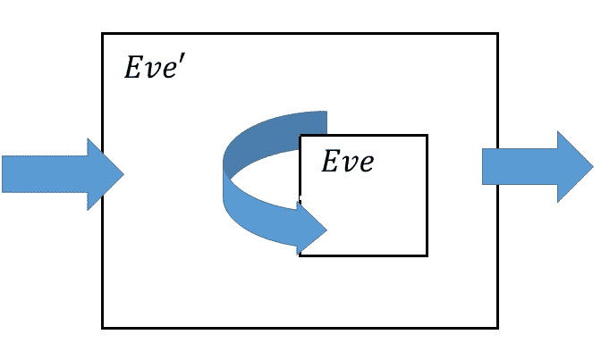
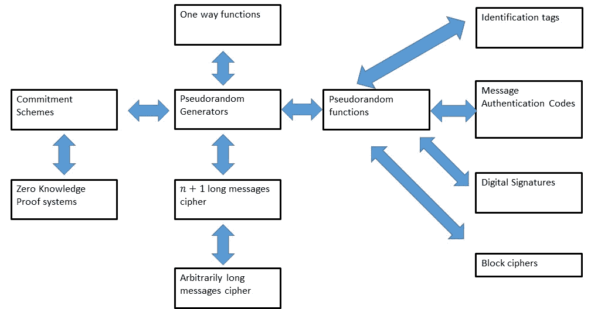
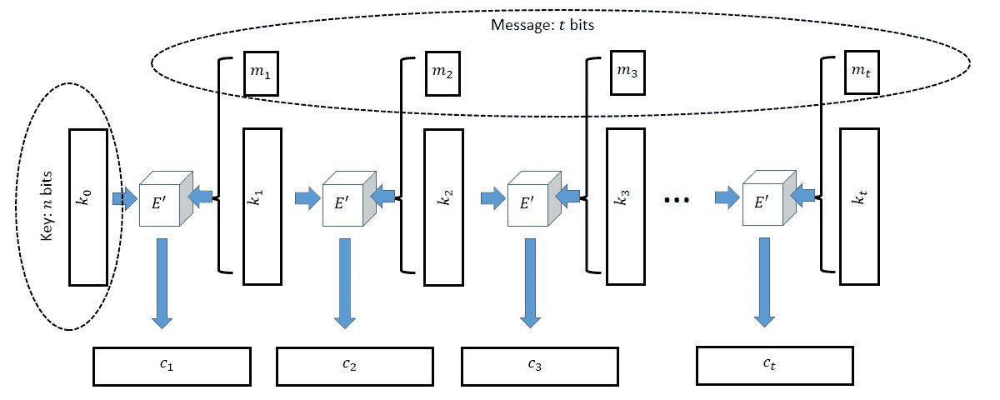

# 计算安全

> 原文：[`intensecrypto.org/public/lec_02_computational-security.html`](https://intensecrypto.org/public/lec_02_computational-security.html)

*发现任何错误/打字错误/令人困惑的解释？[在 GitHub 上打开一个 issue](https://github.com/boazbk/crypto/issues/new)。您也可以在下面评论*

**★ 另请参阅本章的[PDF 版本](https://files.boazbarak.org/crypto/lec_02_computational-security.pdf)（更好的格式/参考文献）★

**附加阅读：** 骨诺-休普书籍中的第 2.2 节和第 2.3 节。卡茨-林德尔书籍中的第三章，包括第 3.3 节。

回顾我们的人物设定——爱丽丝和鲍勃想要在由爱管闲事的伊芙监视的通道上安全地通信。在上一次讲座中，我们看到了*完美保密*的定义，该定义保证了伊芙无法了解他们通信的任何内容，除了她已经知道的内容。然而，这种安全性是有代价的。对于每一比特的通信，爱丽丝和鲍勃必须事先交换一些密钥。实际上，这个结果的证明产生了一个简单的 Python 程序，可以破解使用 128 比特密钥、129 比特消息的任何加密方案：

```cpp
from itertools import product # Import an iterator for cartesian products
from random import choice # choose random element of list

# Gets ciphertext as input and two potential plaintexts
# Returns most likely plaintext
# We assume we have access to the function Encrypt(key,plaintext)
def Distinguish(ciphertext,plaintext1,plaintext2):
 for key in product([0,1], repeat = 128): # Iterate over all possible keys of length 128
 if Encrypt(key, plaintext1)==ciphertext:
 return plaintext1
 if Encrypt(key, plaintext2)==ciphertext:
 return plaintext2
 return choice([plaintext1,plaintext2])
```

程序`Distinguish`将破解任何 128 比特密钥和 129 比特消息的加密`Encrypt`，其意义在于存在一对消息\(m_0,m_1\)，使得`Distinguish`\((\)`Encrypt`\((k,m_b),m_0,m_1)=m_b\)，在\(k \leftarrow_R \{0,1\}^n\)和\(b \leftarrow_R \{0,1\}\)的概率至少为\(0.75\)。

现在，生成、分发和保护大量密钥会导致巨大的后勤问题，这也是为什么几乎所有实际使用的加密方案实际上都利用了短密钥（例如，128 比特长）和可以非常长的消息（有时甚至达到数太字节或更多数据）。

那么，我们为什么不能使用上面的 Python 程序来破解互联网上的所有加密，并赢得恶名和财富？实际上我们可以，但我们得等一个非常长的时间，因为`Distinguish`中的循环将运行\(2^{128}\)次，即使我们使用地球上所有的计算机，也需要比宇宙的寿命还要长的时间才能完成。

然而，这个特定程序不是一个可行的攻击，并不意味着不存在不同的攻击。但这仍然暗示了一个诱人的可能性：如果我们考虑一个放宽的完美保密版本，限制伊芙只能执行在这个宇宙中可以完成的计算（例如，少于\(2^{256}\)步应该是安全的，不仅对人类，对所有潜在的外星文明也是如此），那么我们能否绕过不可能的结果，并允许密钥比消息短得多？

实际上这似乎是正确的，但我们已经看到，定义安全性是一个微妙的工作，需要小心处理。正如之前所做的那样，我们避免（至少是避免一些）历史上许多密码系统的陷阱，是因为我们坚持非常精确地 *定义* 一个方案如何才能是安全的。

让我们暂时推迟讨论如何定义在“少于 \(T\) 次操作”内可计算的功能的讨论，只是说有一种正式的方法可以这样做。我们希望说，如果一个方案在不超过 \(2^{256}\) 次操作的情况下无法被破解，那么它就有“\(256\) 位的安全性”；更普遍地说，如果它不能在不超过 \(2^t\) 次操作的情况下被破解，那么它就有 \(t\) 位的安全性。根据我们上次看到的完美保密定义，定义计算保密性的一个自然尝试如下：

一个加密方案 \((E,D)\) 如果对于任意两个不同的明文 \(\{m_0,m_1\} \subseteq {\{0,1\}}^\ell\) 和 Eve 使用最多 \(2^t\) 计算步骤的任何策略，如果我们随机选择 \(b\in{\{0,1\}}\) 和一个随机密钥 \(k\in{\{0,1\}}^n\)，那么 Eve 在看到 \(E_k(m_b)\) 后猜测 \(m_b\) 的概率最多为 \(1/2\)，则它具有 *\(t\) 位的计算安全性*。

**注意：** 跟踪对手 Eve 所知和未知的内容是很重要的。对手 Eve 知道潜在消息的集合 \(\{ m_0,m_1 \}\) 和密文 \(y=E_k(m_b)\)。她唯一不知道的是 \(b=0\) 或 \(b=1\)，以及秘密密钥 \(k\) 的值。特别是，由于 \(m_0\) 和 \(m_1\) 对 Eve 是已知的，所以在这个“安全游戏”中，我们定义 Eve 的目标为输出 \(m_b\) 或输出 \(b\) 并不重要。

定义 2.1 看起来非常自然，但如果密钥比消息短，实际上 *是无法实现* 的。

在继续阅读之前，你可能想要停下来思考一下，你是否可以 *证明* 没有这样的加密方案，比如说，具有 \(\sqrt{n}\) 比特计算安全性的加密方案，满足 定义 2.1 且 \(\ell = n+1\)，并且加密计算时间是多项式的。

定义 2.1 无法实现的原因是，如果消息比密钥多一个比特，我们总可以有一个非常高效的程序，通过猜测密钥来实现大约 \(1/2 + 2^{-n-1}\) 的成功概率。这是因为我们可以通过随机选择密钥来替换 Python 程序 `Distinguish` 中的循环。由于我们有一些猜对的机会，我们将获得超过一半的小优势。

当然，在猜测消息时，\(2^{-256}\) 的优势并不是我们真正需要担心的。例如，由于地球大约有 50 亿年的历史，我们可以估计出，一个造成恐龙灭绝的同等大小的陨石在此时此刻撞击我们的概率大约是 \(2^{-60}\)。因此，我们希望放宽计算安全的观念，使其不会将这种微小的优势视为“真正的破解”方案。得出的定义如下：

一个加密方案 \((E,D)\) 如果对于每一对不同的明文 \(\{m_0,m_1\} \subseteq {\{0,1\}}^\ell\) 和 Eve 使用的最多 \(2^t\) 计算步骤的策略，如果我们随机选择 \(b\in{\{0,1\}}\) 和一个随机密钥 \(k\in{\{0,1\}}^n\)，那么 Eve 在看到 \(E_k(m_b)\) 后猜测 \(m_b\) 的概率至多为 \(1/2+2^{-t}\)，则它具有 *\(t\) 比特计算安全性^(1)。

吸取了教训后，让我们来看看这种策略是否确实给我们带来了我们想要的条件。特别是，让我们验证这个定义是否意味着与完美保密类似的条件。

如果 \((E,D)\) 根据定义 2.2 具有 \(t\) 比特计算安全性，那么对于每一个 \(M \subseteq {\{0,1\}}^\ell\) 的子集和 Eve 使用的最多 \(2^t-(100\ell+100)\) 计算步骤的策略，如果我们随机选择 \(m\in M\) 和一个随机密钥 \(k\in{\{0,1\}}^n\)，那么 Eve 在看到 \(E_k(m)\) 后猜测 \(m\) 的概率至多为 \(1/|M|+2^{-t+1}\)。

在证明这个定理之前，请注意，它给我们提供了一个相当强的保证。在练习中，我们将进一步强化它，表明无论 Eve 在消息之前有什么先验信息，她都不会得到任何非微不足道的新的信息。2 一种表述方式是，如果发送者使用 256 位安全加密来加密一条消息，那么在宇宙崩溃之前，你获得任何额外信息的概率与一个仙女突然出现并在你耳边低语它的概率大致相同。

在阅读证明之前，再次回顾定理 1.8 的证明，并看看你是否能自己将其推广到计算环境。

证明与完美保密（即定理 1.8）中猜测两个消息之一与猜测许多消息之一的等价性相当类似。然而，在计算环境中，我们需要小心跟踪 Eve 的运行时间。在定理 1.8 的证明中，我们表明如果存在：

+   消息的子集 \(M\subseteq {\{0,1\}}^\ell\)

和

+   一个对手 \(Eve:{\{0,1\}}^o\rightarrow{\{0,1\}}^\ell\)，使得

    \[ \Pr_{m{\leftarrow_{\tiny R}}M, k{\leftarrow_{\tiny R}}{\{0,1\}}^n}[ Eve(E_k(m))=m ] > 1/|M| \]

然后，存在两个消息 \(m_0,m_1\) 和一个对手 \(Eve':{\{0,1\}}^o\rightarrow{\{0,1\}}^\ell\)，使得 \(\Pr_{b{\leftarrow_{\tiny R}}{\{0,1\}},k{\leftarrow_{\tiny R}}{\{0,1\}}^n}[Eve'(E_k(m_b))=m_b ] > 1/2\)。

为了将这个证明适应计算环境并完成当前定理的证明，只需证明：

+   如果 \(Eve\) 成功的概率是 \(\tfrac{1}{|M|} + \epsilon\)，那么 \(Eve'\) 成功的概率至少是 \(\tfrac{1}{2} + \epsilon/2\)。

+   如果 \(Eve\) 可以在 \(T\) 次操作中计算出来，那么 \(Eve'\) 可以在 \(T + 100\ell + 100\) 次操作中计算出来。

这将意味着，如果 \(Eve\) 在多项式时间内运行，并且在猜测从 \(M\) 中选择的明文时相对于 \(1/|M|\) 有多项式优势，那么 \(Eve'\) 将会在多项式时间内运行，并且在猜测从 \(\{ m_0,m_1\}\) 中选择的明文时相对于 \(1/2\) 有多项式优势。

第一项可以通过更仔细地做同样的证明来证明，同时跟踪 \(Eve\) 对 \(\tfrac{1}{|M|}\) 的优势如何转化为 \(Eve'\) 对 \(\tfrac{1}{2}\) 的优势。正如世界上最烦人的说法，这样做是读者的一个极好的练习。

第二项是通过查看该证明中 \(Eve'\) 的定义获得的。在输入 \(c\) 时，\(Eve'\) 计算 \(m=Eve(c)\)（这需要 \(T\) 次操作），检查 \(m=m_0\)（这最多需要 \(5\ell\) 次操作），然后输出 \(1\) 或一个随机位（这是一个常数，最多 \(100\) 次操作）。

### 通过归纳法证明

定理 2.3 的证明是本课程中许多结果外观的一个模型。通常，我们将有许多形式为：

> “如果存在一个满足安全性定义 \(X'\) 的方案 \(S'\)，那么存在一个满足安全性定义 \(X\) 的方案 \(S\)”

在 定理 2.3 的上下文中，\(X'\) 是“具有 \(t\) 比特的安全性”（在区分两个密文加密的上下文中）而 \(X\) 是一个更一般的概念，即获取一个随机 \(m\in M\) 加密的非平凡优势的难度。虽然 定理 2.3 中的加密方案 \(S\) 与 \(S'\) 相同，但这并不总是必须的。然而，所有这样的证明都将具有相同的全局结构——我们将假设存在一个高效的对手策略 \(Eve\)，它表明方案 \(S\) 违反了安全性概念 \(X\)，并从 \(Eve\) 构建一个策略 \(Eve'\)，表明 \(S'\) 违反了 \(X'\)。这是一个非常重要的观点，值得重复：

> *要证明如果 \(S'\) 是安全的，那么 \(S\) 也是安全的，你需要给出一个从破坏 \(S\) 的对手到破坏 \(S'\) 的对手的转换*

对于计算机密性，我们始终希望如果“爱娃”（Eve）是高效的，那么“爱娃'”（Eve'）也是高效的，这通常会是情况，因为“爱娃'”（Eve'）将简单地使用“爱娃”（Eve）作为一个黑盒，它不会调用太多次，并且加法将使用一些多项式时间的前处理和后处理。这类证明的更具挑战性的部分通常是：

+   制定策略“爱娃'”。

+   分析成功的概率，特别是证明如果“爱娃”（Eve）有不可忽视的优势，那么“爱娃'”（Eve'）也会有。



??: 我们通过将攻击者“爱娃”（Eve）破解“S”转换为攻击者“爱娃'”（Eve'）破解“S'”来证明“S'”的安全性意味着“S”的安全性。

注意，就像在 NP 完全性或不可计算性减少的背景下一样，安全性减少是*逆向*工作的。也就是说，我们基于方案“S'”构建方案“S”，然后证明我们可以将破解“S”的算法转换为破解“S'”的算法。就像在计算复杂性中一样，有时很难跟踪减少的方向。事实上，密码学减少可能更加微妙，因为它们涉及多个实体（例如，发送者、接收者和攻击者）和概率选择（例如，关于要发送的消息和密钥）。 

## 渐近方法

对于实际安全性，通常每个比特的安全性都很重要。我们希望我们的密钥尽可能短，我们的方案尽可能快，同时满足特定的安全级别。在实践中，我们通常会希望确保当我们使用几百或几千的小安全参数\(n\)时：

+   *诚实方*（运行加密和解密算法的各方）非常高效，大约每处理一个字节数据需要 100-1000 个周期。从理论的角度来看，我们希望他们使用\(O(n)\)或最坏情况下\(O(n²)\)的时间算法，并且隐藏常数不太大。

+   我们希望保护那些具有更强大计算能力的*对手*（试图破解加密的各方）。典型的现代加密算法设计得如此之好，以至于使用标准密钥大小，它可以在几十年的时间里抵御地球上所有计算机的计算能力的联合攻击。从理论的角度来看，我们希望破解该方案的时间为\(2^{\Omega(n)}\)（或者如果不是，至少为\(2^{\Omega(\sqrt{n})}\)或\(2^{\Omega(n^{1/3})}\)），并且隐藏常数不太小。

在实践中实现密码学时，安全和效率之间的权衡可能至关重要。然而，为了理解密码学背后的*原理*，关注具体的安全性可能会分散注意力，因此就像我们在算法课程中所做的那样，我们将使用*渐近分析*（也称为*大 O 表示法*）来掩盖许多这些细节。

在本课程中，我们将遇到两种类型的运行时间：

+   形式为 \(d\cdot n^c\) 的 *多项式* 运行时间，其中 \(d,c>0\) 是某些常数（或简写为 \(poly(n)=n^{O(1)}\)），我们将将其视为 *有效*。

+   形式为 \(2^{d\cdot n^{\epsilon}}\) 的 *指数* 运行时间，其中 \(d,\epsilon >0\) 是某些常数（或简写为 \(2^{n^{\Omega(1)}}\)），我们将将其视为 *不可行*。^(3)

另一种说法是，在本课程中，如果一个方案有任何安全性，它至少将拥有 \(n^{\epsilon}\) 比特的安全性，其中 \(n\) 是密钥长度，而 \(\epsilon>0\) 是某个绝对常数，例如 \(\epsilon=1/3\)。因此，在本课程中，每当您听到“超多项式”这个术语时，您可以在心中将其等同于“指数”，这样您就不会离真相太远。

这些并不是所有可能的理论运行时间。可以存在中间函数，例如 \(n^{\log n}\)，尽管我们通常不会遇到这些。为了使事情变得清晰（并且与标准术语相对应），我们通常将“有效计算”与 \(n\) 的 *多项式时间* 相关联，其中 \(n\) 是其输入长度或密钥大小（密钥大小和输入长度总是多项式相关的，因此这种选择不会影响）。我们希望我们的算法（加密、解密等）能够在多项式时间内计算，但需要 *超多项式时间* 来破解。

**可忽略的概率**。在密码学中，我们不仅关心对手的运行时间，还关心他们成功的概率（这应该尽可能小）。如果 \(\mu:\N \rightarrow 0,\infty)\) 是一个函数（我们通常将其视为对应于对手的成功概率或相对于平凡概率的优势，作为密钥大小 \(n\) 的函数），那么我们说 \(\mu(n)\) 是 *可忽略的*，如果它小于每个（正）多项式的倒数。我们的安全定义将具有以下形式：

> “方案 \(S\) 是安全的，如果对于每一个多项式 \(p(\cdot)\) 和 \(p(n)\) 时间的对手 \(Eve\)，都存在某个可忽略函数 \(\mu\)，使得 \(Eve\) 在 \(S\) 的安全性游戏中的成功概率至多为 \(trivial + \mu(n)\)*”

我们现在将这些概念更加形式化。

一个函数 \(\mu:\mathbb{N} \rightarrow [0,\infty)\) 是 *可忽略的*，如果对于每个多项式 \(p:\N \rightarrow \N\)，存在 \(N \in \N\)，使得对于每个 \(n>N\)，\(\mu(n) < \tfrac{1}{p(n)}\)。^([4)

以下练习提供了一个很好的方法来熟悉这个定义：

1.  设 \(\mu:\N \rightarrow [0,\infty)\) 是一个可忽略函数。证明对于每个非负系数的多项式 \(p,q:\R \rightarrow \R\)，使得 \(p(0) = 0\)，函数 \(\mu':\N \rightarrow [0,\infty)\) 定义为 \(\mu'(n) = p(\mu(q(n)))\) 是可忽略的。

1.  设 \(\mu:\N \rightarrow [0,\infty)\)。证明 \(\mu\) 是可忽略的当且仅当对于每一个常数 \(c\)，\(\lim_{n \rightarrow \infty} n^c \mu(n) = 0\)。

如果你之前没有遇到过渐近分析，上述定义可能会让人困惑。阅读 KL 书籍的第三章开头（第 43-51 页），以及我在[我的 TCS 入门笔记](http://www.introtcs.org/public/index.html)中的数学背景讲座，可能会非常有用。作为一个经验法则，如果你每次看到“多项式”这个词就想象函数 \(n^{10}\)，每次看到“可忽略”这个词就想象函数 \(2^{-\sqrt{n}}\)，那么你就会得到正确的直觉。

你需要记住的是，可忽略的比任何逆多项式都要小得多，而多项式在乘法下是封闭的，因此我们得到“等式”

\[可忽略 \times 多项式 = 可忽略\]

和

\[多项式 \times 多项式 = 多项式\]

如前所述，在实践中，人们真正想要的是尽可能接近 \(n\) 比特的安全性，使用 \(n\) 比特密钥，但只要安全性随着密钥的增长而增长，我们就会感到满意，所以当我们说一个方案是“安全的”时，你可以认为它具有 \(\sqrt{n}\) 比特的安全性（尽管任何比 \(\log n\) 增长得快的函数也行）。

从现在起，我们将要求所有的加密方案都应该是**高效的**，这意味着加密和解密算法应该在多项式时间内运行。安全性意味着任何高效的对手在猜测消息的概率上最多只能获得可忽略的增益，相对于其先验概率.^(5)

我们现在可以正式用渐近术语定义计算安全性：

如果对于每一对不同的明文 \(\{m_0,m_1\} \subseteq {\{0,1\}}^\ell\) 和每一个高效的（即多项式时间）的伊娃策略，如果我们随机选择 \(b\in{\{0,1\}}\) 和一个随机密钥 \(k\in{\{0,1\}}^n\)，那么伊娃在看到 \(E_k(m_b)\) 后猜测 \(m_b\) 的概率至多为 \(1/2+\mu(n)\)，其中 \(\mu(\cdot)\) 是某个可忽略的函数。\(*计算安全性*

### 计算操作的数量。

我们至今尚未考虑的一个细节是，一个函数使用至多 \(T\) 次操作可计算究竟意味着什么。幸运的是，当我们并不关心 \(T\) 和，比如说，\(T²\) 之间的差异时，几乎所有合理的定义都会给出相同的答案.^(6) 形式上，我们可以使用图灵机、布尔电路或直线程序的概念来定义复杂性。为了具体化，让我们定义一个函数 \(F:{\{0,1\}}^n\rightarrow{\{0,1\}}^m\) 的复杂性至多为 \(T\)，如果存在一个布尔电路使用至多 \(T\) 个布尔门（比如 AND/OR/NOT 或 NAND；或者你也可以选择你喜欢的通用门集合）来计算 \(F\)。我们通常会考虑 *概率性* 函数，在这种情况下，我们允许电路有一个 RAND 门，它输出一个随机的比特（尽管这通常不会提供额外的能力）。我们只关心渐近性的事实意味着在密码学论证中你实际上不需要考虑门。然而，知道这个概念有一个精确的数学表述是令人欣慰的。

**均匀与非均匀模型。** 虽然许多计算文本关注图灵机等模型，但在密码学中，使用布尔电路更为方便，因为布尔电路是计算的非均匀模型 [non uniform model](https://introtcs.org/public/lec_11_running_time.html#nonuniformcompsec)，我们允许对于每个给定的输入长度使用不同的电路。原因如下：

1.  电路可以表达 *有限* 的计算，而图灵机只适用于任意大输入长度的计算，因此我们可以理解诸如“\(t\) 比特的计算安全性”这样的概念。

1.  电路允许“硬连线”的概念，即如果我们可以使用 \(T\) 个门的电路来计算某个函数 \(F:\{0,1\}^{n+s} \rightarrow \{0,1\}^m\)，并且有一个字符串 \(w \in \{0,1\}^s\)，那么我们也可以使用 \(T\) 个门来计算函数 \(x \mapsto F(xw)\)。这在许多密码学证明中很有用。

也可以使用图灵机来构建密码学理论，但这更为繁琐。

在课程的后期，我们的密码方案和对手都将超越简单的将输入映射到输出的函数，我们将考虑 *交互算法*，这些算法会相互交换消息。这样的算法可以使用电路或图灵机来实现，这些电路或图灵机以先前的状态和交互过程中某个点的消息历史作为输入，并输出交互中的下一个消息。这种策略使用的操作数是计算所有消息所使用的总门数。

## 我们第一个猜想

我们现在可以提出我们的第一个猜想：

> **密码猜想：**^(7) 存在一个计算上保密的加密方案 \((E,D)\)（其中 \(E,D\) 是高效的），其长度函数为 \(\ell(n)=n+1\)。

*猜想* 是一个定义良好的数学陈述，我们（1）相信它是正确的，但（2）还不知道如何证明。证明密码猜想将是一项伟大的成就，并且将特别解决 P 与 NP 问题，这可以说是计算机科学的基本问题。也就是说，以下定理是已知的：

如果 \(P=\ensuremath{\mathit{NP}}\)，那么不存在一种计算上安全的加密方式，它具有高效的 \(E\) 和 \(D\)，并且消息长度大于密钥长度。

我们只是简要地概述了证明过程，因为这不是本课程的重点。如果 \(P=\ensuremath{\mathit{NP}}\)，那么每当我们在某个域中搜索某个满足特定属性（如上面 `Distinguish` 子例程中的循环遍历所有密钥）的字符串时，这个循环可以被指数级地加速。

尽管人们普遍认为 \(P\neq \ensuremath{\mathit{NP}}\)，但目前我们还不知道如何 *证明* 这一点，因此只能接受密码猜想作为基本上是一个公理，尽管我们将在本课程后面看到，我们可以证明它可以从一些看似更弱的猜想中得出。

有几个理由相信密码猜想。我们现在简要地提一下其中的一些：

+   *直觉*：如果密码猜想是错误的，那么这意味着对于 *每一个* 可能的密码，我们都可以使上述指数时间攻击变得有效。这听起来“好得令人难以置信”，就像假设 P=NP 似乎好得令人难以置信一样。

+   *具体候选者*：正如我们将在下一节课中看到的，有一些具体的候选密码，它们使用比消息更短的密钥，尽管投入了大量的努力，但没有人知道如何破解它们。其中一些被广泛使用，因此政府和其他善良或不那么善良的组织有充分的理由投入大量资源来尝试破解它们。尽管如此，据我们所知（以及爱德华·斯诺登揭露之后我们知道得更多），对于最流行的密码，还没有出现重大的破解。此外，还有一些密码可以基于规范数学问题，例如分解大整数或解码随机线性码，这些密码本身就有极大的兴趣，独立于它们的密码学应用。

+   *极简主义*：显然，如果密码猜想是错误的，那么我们也就没有一种安全的加密方式，比如消息长度是密钥的两倍。但事实上，密码猜想对于几乎所有加密原语都是必要的，包括不仅仅是私钥和公钥加密，还有数字签名、哈希函数、伪随机生成器等等。也就是说，如果密码猜想是错误的，那么在很大程度上，密码学就不存在了，因此我们基本上必须假设这个猜想，如果我们想要进行任何形式的密码学的话。

## 为什么关心密码猜想？

> *“给我一个立足点，我将移动世界”* 阿基米德，约公元前 250 年

每个完美安全的加密方案显然也是计算安全的，因此如果我们需要大小为 \(n\) 的消息而不是 \(n+1\)，那么一次垫方案就可以轻易地满足这个猜想。然而，消息比密钥长仅一个比特似乎并不那么令人印象深刻。当然，如果我们使用 128 位长密钥的这种方案，我们的通信将比一次垫方案小 128/129 倍（或者说节省了大约 0.8%），但这似乎不值得冒使用未经证明的猜想的风险。然而，结果证明，如果我们假设这个相当弱的条件，我们实际上可以为每个多项式 \(p(\cdot)\) 获得一个消息大小为 \(p(n)\) 的计算安全加密方案！本质上，我们可以固定一个 \(n\) 位长的密钥，并安全地通信任意多的比特！

此外，这仅仅是开始。从这个看似无害的猜想中，我们可以获得大量其他有用的密码学工具：（我们将在课程中稍后看到所有这些名称以及一些这些归约的含义。）



12.1：与具有大于密钥消息的密码等价的概念之间的归约网

我们将很快看到本课程中我们将学习的许多归约中的第一个。这个“归约网”构成了密码学的科学核心，连接了许多核心概念，并使我们能够基于相对简单的“公理”如密码猜想构建越来越复杂的工具。

## 预言：计算不可区分性

Eve 破解加密方案的任务是区分 \(m_0\) 的加密和 \(m_1\) 的加密。考虑两个分布何时是*计算不可区分的*这个问题是有用的：

设 \(X\) 和 \(Y\) 是 \({\{0,1\}}^m\) 上的两个分布。我们说 \(X\) 和 \(Y\) 是 \((T,\epsilon)\)*-计算不可区分的*，记为 \(X \approx_{T,\epsilon} Y\)，如果对于每个最多 \(T\) 次操作可计算函数 \(D:\{0,1\}^m \rightarrow \{0,1\}\)，

\[ | \Pr[ D(X) = 1 ] - \Pr[ D(Y) = 1 ] | \leq \epsilon \;. \]

证明对于上述的每个 \(X,Y\) 和 \(T,\epsilon\)，如果且仅当对于每个最多 \(T\) 次操作可计算的 \(\leq T\)-操作 \(Eve\)，\(Eve\) 在以下游戏中获胜的概率至多为 \(1/2 + \epsilon/2\)：

1.  我们从 \(\{0,1\}\) 中随机选择 \(b \leftarrow_R \{0,1\}\)。

1.  如果 \(b=0\)，我们让 \(w \leftarrow_R X\)。如果 \(b=1\)，我们让 \(w \leftarrow_R Y\)。

1.  我们给 \(Eve\) 输入 \(w\)，\(Eve\) 输出 \(b' \in \{0,1\}\)。

1.  如果 \(b=b'\)，\(Eve\) *获胜*。

独立完成这个练习是熟悉计算不可区分性的好方法，这是一个基本概念。

对于每个函数 \(Eve:\{0,1\}^m \rightarrow \{0,1\}\)，令 \(p_X = \Pr[ Eve(X)=1]\) 和 \(p_Y = \Pr[Eve(Y)=1]\)。

因此，Eve 赢得游戏的概率是：

\\Pr[ b=0 + \Pr[b=1] p_Y\]

由于 \(\Pr[b=0]=\Pr[b=1]=1/2\)，因此这可以表示为

\[ \tfrac{1}{2} - \tfrac{1}{2}p_X + \tfrac{1}{2}p_Y = \tfrac{1}{2} + \tfrac{1}{2}(p_Y-p_X) \]

我们可以看到，Eve 以 \(1/2 + \epsilon/2\) 的成功率赢得游戏，当且仅当

\[ \Pr[ Eve(Y) = 1 ] - \Pr[Eve(X)=1] = \epsilon \;. \]由于 \(\Pr[ Eve(Y) = 1 ] - \Pr[Eve(X)=1] \leq \left| \Pr[ Eve(X) = 1 ] - \Pr[Eve(Y)=1] \right|\)，这已经表明如果 \(X\) 和 \(Y\) 是 \((T,\epsilon)\)-不可区分的，那么 Eve 将以最多 \(\epsilon/2\) 的概率赢得游戏。

对于另一个方向，假设 \(X\) 和 \(Y\) 不是计算上不可区分的，并设 \(Eve\) 是一个 \(T\) 时间操作函数，使得

\[ \left| \Pr[ Eve(X) = 1 ] - \Pr[Eve(Y)=1] \right| \geq \epsilon \;. \]

根据绝对值的定义，有两种可能的情况。要么 \(\Pr[ Eve(X) = 1 ] - \Pr[Eve(Y)=1] \geq \epsilon\)，在这种情况下，Eve 以至少 \(1/2 + \epsilon/2\) 的概率赢得游戏。否则，\(\Pr[ Eve(X) = 1 ] - \Pr[Eve(Y)=1] \leq -\epsilon\)，在这种情况下，函数 \(Eve'(w)=1-Eve(w)\)（同样容易计算）以至少 \(1/2 + \epsilon/2\) 的概率赢得游戏。

注意，上面我们假设“最多 \(T\) 次操作可计算”的函数类在否定下是**封闭的**，即如果 \(F\) 属于这个类，那么 \(1-F\) 也属于。对于标准的布尔电路，如果我们不计否定门（这最多可以改变总电路大小的一个因子），或者允许 Eve' 需要一个常数额外的操作数，在这种情况下，练习仍然是基本上正确的，但表述稍微繁琐一些。

就像我们在计算机密性中所做的那样，我们也可以定义计算不可区分性的渐近定义。

设 \(m:\N \rightarrow \N\) 是某个函数，并设 \(\{ X_n \}_{n\in \N}\) 和 \(\{ Y_n \}_{n\in \N}\) 是两个分布序列，使得 \(X_n\) 和 \(Y_n\) 是 \(\{0,1\}^{m(n)}\) 上的分布。

我们说 \(\{ X_n \}_{n\in \N}\) 和 \(\{ Y_n \}_{n\in\N}\) 在计算上是不可区分的，表示为 \(\{ X_n \}_{n\in\N} \approx \{ Y_n \}_{n\in\N}\)，如果对于每个多项式 \(p:\N \rightarrow \N\) 和足够大的 \(n\)，\(X_n \approx_{p(n), 1/p(n)} Y_n\)。

解决以下渐近类似 已解决练习 2.1 是熟悉计算不可区分性渐近定义的好方法：

设 \(\{ X_n \}_{n\in \N},\{Y_n\}_{n\in \N}\) 和 \(m:\N \rightarrow \N\) 如上所述。那么 \(\{ X_n \}_{n\in\N} \approx \{ Y_n \}_{n\in\N}\) 当且仅当对于每个多项式时间 \(Eve\)，存在某个可忽略函数 \(\mu\)，使得 \(Eve\) 在以下游戏中获胜的概率最多为 \(1/2 + \mu(n)\)：

1.  我们随机选择 \(b \leftarrow_R \{0,1\}\)。

1.  如果 \(b=0\)，我们让 \(w \leftarrow_R X_n\)。如果 \(b=1\)，我们让 \(w \leftarrow_R Y_n\)。

1.  我们给 \(Eve\) 输入 \(w\)，\(Eve\) 输出 \(b' \in \{0,1\}\)。

1.  \(Eve\) *获胜* 如果 \(b=b'\)。

**省略索引 \(n\)。** 由于我们分布的索引 \(n\) 通常可以从上下文中清楚地看出（实际上在大多数情况下它将是密钥的长度），我们有时会从我们的符号中省略它。所以如果 \(X\) 和 \(Y\) 是依赖于某个索引 \(n\) 的两个随机变量，那么当序列 \(\{ X_n \}_{n\in \N}\) 和 \(\{ Y_n \}_{n\in\N}\) 是计算不可区分的时，我们将说 \(X\) 计算上与 \(Y\) 不可区分（表示为 \(X \approx Y\))。

我们可以使用计算不可区分性来更简洁地表述计算机密性的定义：

设 \((E,D)\) 是一个有效的加密方案。那么 \((E,D)\) 是计算机密的当且仅当对于每两条消息 \(m_0,m_1 \in \{0,1\}^\ell\)，

\[ \{ E_k(m_0) \}_{n\in \N} \approx \{ E_k(m_1) \}_{n\in\N}\]其中这些两个分布都是通过从 \(\{0,1\}}^n\) 中随机采样 \(k{\leftarrow_{\tiny R}}\) 得到的。

推导证明是一个确保你理解计算机密性和计算不可区分性定义的绝佳方法，因此我们将其留作练习。

计算不可区分性的一个直观理解是它与某种“距离”概念相关。如果两个分布是计算不可区分的，那么我们可以认为它们彼此“非常接近”，至少对有效观察者来说是这样。直观上，如果 \(X\) 接近 \(Y\) 且 \(Y\) 接近 \(Z\)，那么 \(X\) 应该接近 \(Z\)。^(8) 类似地，如果四个分布 \(X,X',Y,Y'\) 满足 \(X\) 接近 \(Y\) 且 \(X'\) 接近 \(Y'\)，那么你可能会期望从 \(X\) 和 \(X'\) 分别独立抽取的两个样本的分布 \((X,X')\) 与从 \(Y\) 和 \(Y'\) 分别独立抽取的两个样本的分布 \((Y,Y')\) 是接近的。我们现在将验证这些直觉实际上是正确的：

假设 \(X_1 \approx_{T,\epsilon} X_2 \approx_{T,\epsilon} \cdots \approx_{T,\epsilon} X_m\). 那么 \(X_1 \approx_{T, (m-1)\epsilon} X_m\).

假设存在一个 \(T\) 时间 \(Eve\) 使得

\[ |\Pr[ Eve(X_1)=1] - \Pr[ Eve(X_m)=1]| > (m-1)\epsilon \;. \]

写作

\[ \Pr[ Eve(X_1)=1] - \Pr[ Eve(X_m)=1] = \sum_{i=1}^{m-1} \left( \Pr[ Eve(X_i)=1] - \Pr[ Eve(X_{i+1})=1] \right) \;. \]

因此，

\[ \sum_{i=1}^{m-1} \left| \Pr[ Eve(X_i)=1] - \Pr[ Eve(X_{i+1})=1] \right| > (m-1)\epsilon \]因此，特别地，必须存在某个 \(i\in\{1,\ldots,m-1\}\) 使得\[ \left| \Pr[ Eve(X_i)=1] - \Pr[ Eve(X_{i+1})=1] \right| > \epsilon \]这与假设对于所有 \(i\in\{1,\ldots,m-1\}\)，\(\{ X_i \} \approx_{T,\epsilon} \{ X_{i+1} \}\) 相矛盾。

假设 \(X_1,\ldots,X_\ell,Y_1,\ldots,Y_\ell\) 是 \({\{0,1\}}^n\) 上的分布，使得 \(X_i \approx_{T,\epsilon} Y_i\)。那么 \((X_1,\ldots,X_\ell) \approx_{T-10\ell n,\ell\epsilon} (Y_1,\ldots,Y_\ell)\)。

对于每个 \(i\in\{0,\ldots,\ell\}\)，我们定义 \(H_i\) 为分布 \((X_1,\ldots,X_i,Y_{i+1},\ldots,Y_\ell)\)。显然 \(H_\ell = (X_1,\ldots,X_\ell)\) 和 \(H_0 = (Y_1,\ldots,Y_\ell)\)。我们将证明对于每个 \(i\)，\(H_{i-1} \approx_{T-10\ell n,\epsilon} H_i\)，然后证明将遵循三角不等式（你能看到为什么吗？）。实际上，假设为了矛盾的假设，存在某个 \(i\in \{1,\ldots,\ell\}\) 和某个 \(T-10\ell n\) 时间的 \(Eve':{\{0,1\}}^{n\ell}\rightarrow{\{0,1\}}\)，使得

\[ \left| {\mathbb{E}}[ Eve'(H_{i-1}) ] - {\mathbb{E}}[ Eve'(H_i) ] \right| > \epsilon\;. \]

换句话说

\[ \left| {\mathbb{E}}_{X_1,\ldots,X_{i-1},Y_i,\ldots,Y_\ell}[ Eve'(X_1,\ldots,X_{i-1},Y_i,\ldots,Y_\ell) ] - {\mathbb{E}}_{X_1,\ldots,X_i,Y_{i+1},\ldots,Y_\ell}[ Eve'(X_1,\ldots,X_i,Y_{i+1},\ldots,Y_\ell) ] \right| > \epsilon\;. \]

通过期望的线性，我们可以写出这两个期望的差为

\[ {\mathbb{E}}_{X_1,\ldots,X_{i-1},X_i,Y_i,Y_{i+1},\ldots,Y_\ell}\left[ Eve'(X_1,\ldots,X_{i-1},Y_i,Y_{i+1},\ldots,Y_\ell) - Eve'(X_1,\ldots,X_{i-1},X_i,Y_{i+1},\ldots,Y_\ell) \right] \]

根据*平均原理*^(9)，这意味着存在一些值 \(x_1,\ldots,x_{i-1},y_{i+1},\ldots,y_\ell\)，使得

\[ \left|{\mathbb{E}}_{X_i,Y_i}\left[ Eve'(x_1,\ldots,x_{i-1},Y_i,y_{i+1},\ldots,y_\ell) - Eve'(x_1,\ldots,x_{i-1},X_i,y_{i+1},\ldots,y_\ell) \right]\right|>\epsilon \]现在 \(X_i\) 和 \(Y_i\) 分别是从分布 \(X\) 和 \(Y\) 中独立抽取的，因此如果我们定义 \(Eve(z) = Eve'(x_1,\ldots,x_{i-1},z,y_{i+1},\ldots,y_\ell)\)，那么 \(Eve\) 的时间复杂度最多是 \(Eve'\) 的时间复杂度加上 \(10\ell n\)^(10)，并且它满足\[ \left| {\mathbb{E}}_{X_i} [ Eve(X_i) ] - {\mathbb{E}}_{Y_i} [ Eve(Y_i) ] \right| > \epsilon \]这与假设 \(X_i \approx_{T,\epsilon} Y_i\) 相矛盾。

上述证明展示了被称为*混合论证*的强大技术，通过提出一系列分布 \(H_0,\ldots,H_t\)，我们展示了两个分布 \(C⁰\) 和 \(C¹\) 相互接近。这些分布满足 \(H_t = C¹, H_0 = C⁰\)，并且我们可以论证对于所有 \(i\)，\(H_i\) 都接近于 \(H_{i+1}\)。这种论证在密码学中反复出现，因此熟悉它非常重要。

## 长度扩展定理或流密码

我们现在转向展示**长度扩展定理**，该定理指出，如果我们有一个对\(n+1\)长度消息使用\(n\)长度密钥的加密方案，那么我们可以获得一个对每个多项式\(p(n)\)长度消息的加密方案。为了热身，让我们展示一个更简单的事实：我们可以将上述加密方案转换为具有长度为\(tn\)的密钥和长度为\(t(n+1)\)的消息的加密方案，对于每个整数\(t\)：

假设\((E',D')\)是一个具有\(n\)位密钥和\(n+1\)位消息的计算上保密的加密方案。那么方案\((E,D)\)，其中\(E_{k_1,\ldots,k_t}(m_1,\ldots,m_t)= (E'_{k_1}(m_1),\ldots, E'_{k_t}(m_t))\)和\(D_{k_1,\ldots,k_t}(c_1,\ldots,c_t)= (D'_{k_1}(c_1),\ldots, D'_{k_t}(c_t))\)是一个具有\(tn\)位密钥和\(t(n+1)\)位消息的计算上保密方案。

这可能看起来“很明显”，但在密码学中，即使是明显的事实有时也是错误的，因此正式证明这一点很重要。幸运的是，这是计算不可区分性在许多样本下保持不变的事实的一个相当直接的推论。也就是说，根据\((E',D')\)的安全性，我们知道对于每两个消息\(m,m' \in {\{0,1\}}^{n+1}\)，\(E'_k(m) \approx E'_k(m')\)，其中\(k\)是从分布\(U_n\)中选择的。因此，根据许多样本不可区分的引理，对于每两个元组\(m_1,\ldots,m_t \in {\{0,1\}}^{n+1}\)和\(m'_1,\ldots,m'_t\in {\{0,1\}}^{n+1}\)，

\[ (E'_{k_1}(m_1),\ldots,E'_{k_t}(m_t)) \approx (E'_{k_1}(m'_1),\ldots,E'_{k_t}(m'_t)) \]

对于从\(U_n\)独立选择的随机\(k_1,\ldots,k_t\)，这正好是\((E,D)\)是计算上保密的条件。

**随机化加密方案。** 我们现在可以证明完整的长度扩展定理。在这样做之前，我们需要将加密方案的概念推广到允许 *随机化加密方案*。也就是说，我们将考虑加密方案，其中加密算法可以在其计算中“掷硬币”。密钥材料和这种“临时”随机性之间存在一个关键的区别。密钥不仅需要随机选择，还需要在发送者和接收者之间预先共享，并在其整个生命周期内安全存储。随机化加密方案使用的“掷硬币”是“即时”生成的，接收者不知道，发送者也不需要长期存储。因此，允许这种随机化加密对大多数加密方案的应用没有影响。事实上，正如我们将在本课程后面看到的那样，随机化加密对于抵御更复杂的攻击（如选择明文攻击和选择密文攻击）以及获得安全的 *公钥* 加密是 *必要的*。我们将使用 \(E_k(m;r)\) 来表示加密算法在密钥 \(k\)、消息 \(m\) 和内部随机性 \(r\) 上的输出。我们通常省略随机性的表示，因此使用 \(E_k(m)\) 来表示通过采样随机 \(r\) 并输出 \(E_k(m;r)\) 得到的随机变量。

现在我们可以证明，给定一个消息长度比密钥长一比特的加密方案，我们可以获得一个具有任意长消息的（随机化）加密方案：

假设存在一个计算上安全的加密方案 \((E',D')\)，其密钥长度为 \(n\)，消息长度为 \(n+1\)。那么对于每一个多项式 \(t(n)\)，都存在一个具有密钥长度 \(n\) 和消息长度 \(t(n)\) 的（随机化）计算上安全的加密方案 \((E,D)\)。



2.3: 从长度为 \(n+1\) 的消息构造一个 \(t\) 位长消息的密码

这可能是我们第一个非平凡的密码学定理的例子，这个证明的蓝图将是我们在这门课程中反复遵循的。请确保你仔细阅读这个证明并理解论证。

该构造，如图 2.3 所示，实际上是非常自然的，其实际变体在实践中被用于 *流密码*，这是一种使用固定大小密钥加密任意长消息的方法。其思想是，我们使用一个大小为 \(n\) 的密钥 \(k_0\) 来加密 **（1）** 一个大小为 \(n\) 的新密钥 \(k_1\) 和 **（2）** 消息的一位。现在我们可以使用 \(k_1\) 来加密 \(k_2\)，依此类推。我们现在将详细描述该构造和分析。

令\(t=t(n)\)。我们给定一个加密方案\(E'\)，它可以使用\(n\)比特长的密钥加密\(n+1\)比特长的消息，我们需要加密一个\(t\)比特长的消息\(m=(m_1,\ldots,m_t) \in {\{0,1\}}^t\)。我们的想法很简单（至少在事后看来）。令\(k_0 {\leftarrow_{\tiny R}}{\{0,1\}}^n\)为我们密钥（它是随机选择的）。要使用\(k_0\)加密\(m\)，加密函数将选择\(t\)个随机字符串\(k_1,\ldots, k_t {\leftarrow_{\tiny R}}{\{0,1\}}^n\)。然后我们将使用密钥\(k_0\)加密\(n+1\)比特长的消息\((k_1,m_1)\)以获得密文\(c_1\)，然后使用密钥\(k_1\)加密\(n+1\)比特长的消息\((k_2,m_2)\)以获得密文\(c_2\)，以此类推，直到我们使用密钥\(k_{t-1}\)加密消息\((k_t,m_t)\)以获得密文\(c_t\)。最后，我们将\((c_1,\ldots,c_t)\)输出为最终的密文。\^(11)\^(12)

要使用密钥\(k_0\)解密\((c_1,\ldots,c_t)\)，首先解密\(c_1\)以学习\((k_1,m_1)\)，然后使用\(k_1\)解密\(c_2\)以学习\((k_2,m_2)\)，以此类推，直到我们使用\(k_{t-1}\)解密\(c_t\)并学习\((k_t,m_t)\)。最后，我们可以简单地输出\((m_1,\ldots,m_t)\)。

上述显然是有效的加密和解密算法，因此真正的问题变成了**它是否安全**？直观上，\(c_1\)隐藏了关于\((k_1,m_1)\)的所有信息，因此特别是消息的第一个比特被安全地加密了，\(k_1\)仍然可以被视为一个未知随机字符串，即使是对看到了\(c_1\)的对手也是如此。因此，我们可以将\(k_1\)视为加密\(c_2\)的随机密钥，因此消息的第二个比特被安全地加密了，以此类推。

我们上面的讨论看起来像是一个合理的直观论证，但为了确保它是正确的，我们需要给出一个实际的证明。令\(m,m' \in {\{0,1\}}^t\)为两个消息。我们需要证明\(E_{U_n}(m) \approx E_{U_n}(m')\)。证明的核心将是以下断言：

**断言**：令\(\hat{E}\)为一种算法，它在输入消息\(m\)和密钥\(k_0\)时，除了其第\(i\)个块包含\(E'_{k_{i-1}}(k'_i,m_i)\)（其中\(k'_i\)是\({\{0,1\}}^n\)中的一个**随机**字符串，它是独立于其他所有东西选择的，包括密钥\(k_i\)）外，与\(E\)的工作方式相同。那么，对于每个消息\(m\in{\{0,1\}}^t\)

\[ E_{U_n}(m) \approx \hat{E}_{U_n}(m) \;\;(2.1) \;. \]

注意，\(\hat{E}\)不是一个有效的加密方案，因为它根本不清楚存在一个解密算法。它只是我们用于证明的一个假设工具。由于\(E\)和\(\hat{E}\)都是随机加密方案（\(E\)使用\((t-1)n\)比特的随机性用于临时密钥\(k_1,\ldots,k_{t-1}\)，而\(\hat{E}\)使用\((2t-1)n\)比特的随机性用于临时密钥\(k_1,\ldots,k_t,k'_2,\ldots,k'_t\)），我们也可以将方程 2.1 写成

\[ E_{U_n}(m; U'_{tn}) \approx \hat{E}_{U_n}(m; U'_{(2t-1)n}) \] 其中我们使用 \(U'_\ell\) 来表示一个从 \(\{0,1\}^\ell\) 中均匀随机选择的随机变量，并且独立于 \(U_n\) 的选择（它是从 \(\{0,1\}^n\) 中均匀随机选择的）。

一旦我们证明了断言，那么我们就完成了，因为我们知道对于每对消息 \(m,m'\)， \(E_{U_n}(m) \approx \hat{E}_{U_n}(m)\) 和 \(E_{U_n}(m') \approx \hat{E}_{U_n}(m')\)，但 \(\hat{E}_{U_n}(m) \approx \hat{E}_{U_n}(m')\)，因为 \(\hat{E}\) 实质上与我们在上面分析的 \(t\) 次重复方案相同。因此，根据三角不等式，我们可以得出 \(E_{U_n}(m) \approx E_{U_n}(m')\)，正如我们所希望的。

**断言的证明：** 我们通过混合方法来证明这个断言。对于 \(j\in \{0,\ldots, t\}\)，令 \(H_j\) 是密文分布，在前 \(j\) 块中我们像 \(\hat{E}\) 一样行动，在最后 \(t-j\) 块中我们像 \(E\) 一样行动。也就是说，我们独立地从 \(U_n\) 中随机选择 \(k_0,\ldots,k_t,k'_1,\ldots,k'_t\)，如果 \(i>j\)，则 \(H_j\) 的第 \(i\) 块等于 \(E'_{k_{i-1}}(k_i,m_i)\)，如果 \(i\leq j\)，则等于 \(E'_{k_{i-1}}(k'_i,m_i)\)。显然，\(H_t = \hat{E}_{U_n}(m)\) 和 \(H_0 = E_{U_n}(m)\)，因此我们只需要证明对于每个 \(j\)，\(H_{j-1} \approx H_j\)。实际上，令 \(j \in \{1,\ldots,t\}\)，假设为了矛盾的目的存在一个高效的 \(Eve'\)，

\[ \left| {\mathbb{E}}[ Eve'(H_{j-1})] - {\mathbb{E}}[ Eve'(H_j)]\right|\geq \epsilon \;\;(*) \]

其中 \(\epsilon = \epsilon(n)\) 是可注意的。根据平均原理，存在某个固定的 \(k'_1,\ldots,k'_t,k_0,\ldots,k_{j-2},k_j,\ldots,k_t\) 的选择，使得 \((*)\) 仍然成立。注意，在这种情况下，唯一的随机性是 \(k_{j-1}{\leftarrow_{\tiny R}}U_n\) 的选择，而且 \(H_{j-1}\) 和 \(H_j\) 的前 \(j-1\) 块和最后 \(t-j\) 块将是相同的，我们可以分别用 \(\alpha\) 和 \(\beta\) 来表示它们，因此可以将 \((*)\) 写作

\[ \left| {\mathbb{E}}_{k_{j-1}}[ Eve'(\alpha,E'_{k_{j-1}}(k_j,m_j),\beta) - Eve'(\alpha,E'_{k_{j-1}}(k'_j,m_j),\beta) ] \right| \geq \epsilon \;\;(**) \]

但现在考虑定义的对手 \(Eve\)，其定义为 \(Eve(c) = Eve'(\alpha,c,\beta)\)。那么 \(Eve\) 也是高效的，并且根据 \((**)\)，它可以区分 \(E'_{U_n}(k_j,m_j)\) 和 \(E'_{U_n}(k'_j,m_j)\)，从而与 \((E',D')\) 的安全性相矛盾。这完成了对断言的证明，因此定理得证。

### 附录：计算模型

为了具体起见，让我们给出一个精确的定义，即函数或概率过程 \(f\) 将 \(\{0,1\}^n\) 映射到 \(\{0,1\}^m\) 时，使用 \(T\) 次操作可计算的含义。

+   如果你已经上过任何关于计算复杂性的课程（例如哈佛 CS 121），那么这就是布尔电路的模型，除了我们也允许随机化。

+   如果你没有上过这样的课程，你可能只是相信可以用 \(T\) 个“基本操作”来模拟算法将输入 \(x\) 映射到输出 \(f(x)\) 的含义。

在这两种情况下，你可能想跳过这个附录，只有在发现某些内容令人困惑时才返回。

我们使用的模型是一个布尔电路，它还有一个输出随机位的 \(\ensuremath{\mathit{RAND}}\) 门。我们可以使用标准的 \(\ensuremath{\mathit{AND}}\)、\(\ensuremath{\mathit{OR}}\) 和 \(\ensuremath{\mathit{NOT}}\) 作为基本门集，但为了简单起见，我们使用只有一个元素的集合 \(\ensuremath{\mathit{NAND}}\)。我们用直线程序表示电路，但这当然只是方便起见。正如（例如）在 [CS 121 教科书](http://introtcs.org) 中所示，这两种表示是相同的。

一个*概率直线程序*由一系列行组成，其中每一行都是以下形式之一：

+   `foo = NAND(bar, baz)` 其中 `foo`,`bar`,`baz` 是变量标识符。

+   `foo = RAND()` 其中 `foo` 是一个变量标识符。

给定一个程序 \(\pi\)，我们称其*大小*为它包含的行数。形式为 `X[`\(i\)`]` 或 `Y[`\(j\)`]` 的变量分别被认为是输入和输出变量。如果输入变量范围从 \(0\) 到 \(n-1\)，输出变量范围从 \(0\) 到 \(m-1\)，则该程序以自然方式计算将 \(\{0,1\}^n\) 映射到 \(\{0,1\}^m\) 的概率过程。如果 \(F\) 是将 \(\{0,1\}^n\) 映射到 \(\{0,1\}^m\) 的（概率或确定性）映射，则 \(F\) 的*复杂度*是计算它的最小程序 \(P\) 的大小。

如果你之前没有上过像 CS121 这样的课程，你可能会想知道这样一个简单的模型是如何捕捉使用循环、条件语句以及比 \(\{0,1\}\) 中的位更复杂的数据类型的复杂程序的。更不用说可能涉及定制硬件的特殊用途密码破解设备了。实际上，它确实可以（出于同样的原因，我们可以将复杂的编程语言编译到运行在具有非常有限的指令集的硅芯片上的程序）。事实上，据我们所知，这个模型甚至可以捕捉自然界中发生的计算，无论是蜜蜂群体还是人类大脑（包含大约 \(10^{10}\) 个神经元，因此原则上可以通过具有相同数量级行数的程序来模拟）。关键的是，对于密码学来说，我们关心这样的程序并不是因为我们想真正运行它们，而是因为我们想论证它们的*不存在性*。如果我们有一个不能由长度小于 \(2^{128}>10^{38}\) 的直线程序计算的过程，那么可以说，一个大小如人类大脑（甚至这个星球上所有人类和非人类大脑）的计算机也无法执行它。

**高级笔记：非均匀性**。我们在本课程中使用的计算模型是[*非均匀*](https://introtcs.org/public/lec_11_running_time.html#nonuniformcompsec)（对应布尔电路），而不是*均匀*（对应图灵机）。如果这个区别对你来说没有什么意义，你可以忽略它，因为它在我们接下来的工作中不会扮演重要角色。这基本上意味着我们允许我们的程序具有硬编码的 \(poly(n)\) 位常数，其中 \(n\) 是输入/密钥长度。实际上，为了更精确，我们将对自己提出比对手更高的标准，即我们要求我们的算法在更强的意义上是可计算的，即在均匀概率多项式时间内可计算（对于某个固定的多项式，通常是 \(O(n)\) 或 \(O(n²)\)），而对手被允许使用非均匀性。

**量子计算**。一个有趣的潜在例外是，每个自然过程都应该能够通过一个与其复杂度相当的直线程序来模拟这一原则，即那些量子力学中的*干涉*和*纠缠*概念起着重要作用的进程。我们将在课程结束时讨论这个*量子计算*的概念，但请注意，当我们把量子加入进来时，我们所说的许多内容实际上并没有真正改变。正如在[CS 121 文本](https://introtcs.org/public/lec_26_quantum_computing.html)中讨论的那样，我们仍然可以通过直线程序（现在形式稍微复杂一些）来捕捉这些进程，因此只要我们接受对密码猜想强形式的猜想，即即使对于量子计算机来说，密码也是不可破解的，我们将在量子领域做的大部分工作都将以相同的方式继续进行。所有当前的证据都指向这种强形式也是正确的。构建可能对量子计算机安全的加密方案领域被称为[后量子密码学](https://en.wikipedia.org/wiki/Post-quantum_cryptography)，我们将在课程中稍后回到这个话题。

1.  “\(t\) 位安全性”的另一种版本是，如果一个方案有 \(t\) 位安全性，那么对于每个 \(t_1+t_2 \leq t\)，一个在 \(2^{t_1}\) 时间内运行的攻击者不能获得超过 \(2^{-t_2}\) 的成功概率优势。然而，这两个定义之间的差异最多只有两个因子。这可能在实际应用中很重要（其中 \(64\) 位和 \(32\) 位安全性的差异可能是关键的），但对我们关注的问题来说并不重要。

    ↩

1.  后者属性被称为“语义安全性”，参见 Katz-Lindell 关于“语义安全性”的第 3.2.2 节，以及 Boneh-Shoup 的“计算密码和语义安全性”的第二部分。

    ↩

1.  一些文本将术语 *指数* 保留给形式为 \(2^{\epsilon n}\) 的函数（其中 \(\epsilon > 0\)），并将像 \(2^{\sqrt{n}}\) 这样的函数称为 *次指数*。然而，在本课程中，我们通常不会做出这种区分。

    ↩

1.  可忽略函数有时被定义为像 \([0,1]\) 这样的像，而不是非负实数的集合 \(0,\infty)\)，因为它们通常用于界定概率。然而，这并没有太大的区别，因为如果 \(\mu\) 是可忽略的，那么对于足够大的 \(n\)，\(\mu(n)\) 将小于一。

    [↩

1.  注意，这里有一个关于量词顺序的微妙问题。为了使方案高效，加密和解密等算法需要在某些固定的多项式时间内运行，例如 \(n²\) 或 \(n³\)。相比之下，我们允许对手在任意多项式时间内运行。也就是说，对于每一个 \(c\)，如果 \(n\) 足够大，那么方案应该能够抵御运行时间为 \(n^c\) 的对手。这与密码学中的普遍原则一致，即我们总是允许对手拥有比诚实用户更多的潜在资源。在实际安全中，我们通常假设诚实使用和对手资源之间的差距可以是指数级的。例如，一个低功耗的嵌入式设备可以加密消息，据我们所知，即使是使用超级计算机和大型数据中心的国家也无法解密。

    ↩

1.  由于需要添加一些由于 *量子计算机* 引起的注意事项：我们将在课程稍后讨论这些，尽管它们不会改变我们的大多数理论。还可以参考我在我的 TCS 入门教科书中关于“扩展 Church-Turing 假说”的[这个讨论](https://introtcs.org/public/lec_04_code_and_data.html#PECTTsec)和 Aaronson 的[这个演示](https://www.scottaaronson.com/talks/bernays2.ppt)。

    ↩

1.  就像我们将讨论的其他猜想一样，“Cipher Conjecture” 这个名字不是一个标准名称，而是一个我们在本课程中会使用的名称。在文献中，这个猜想通常被称为“单向函数存在性”的猜想，这是一个我们稍后将会了解的概念。这两个猜想从先验上看似乎相当不同，但已经被证明是等价的。

    ↩

1.  这种形式的结果被称为“三角不等式”，因为它们可以被视为平面上的三个点 \(x,y,z\) 的距离从 \(x\) 到 \(z\) 不大于从 \(x\) 到 \(y\) 的距离加上从 \(y\) 到 \(z\) 的距离这一陈述的推广。换句话说，三角形 \((x,y,z)\) 的边 \(\overline{x,z}\) 的长度不大于其他两边 \(\overline{x,y}\) 和 \(\overline{y,z}\) 长度的和。

    ↩

1.  这是这样一个原则：如果一次考试的平均成绩至少是 \(\alpha\)，那么**某人**必须至少得到了 \(\alpha\) 分，换句话说，如果一个实值随机变量 \(Z\) 满足 \({\mathbb{E}}[Z] \geq \alpha\)，那么 \(\Pr[Z\geq \alpha]>0\)。

    ↩

1.  成本 \(10 \ell n\) 是为了将“硬编码”的字符串 \(x_1,\ldots,x_{i-1}\)，\(y_{i+1},\ldots,y_\ell\) 输入到 \(Eve'\) 中。这些字符串最多占用 \(\ell n\) 位，根据计算模型的不同，存储并将它们输入到 \(Eve'\) 中可能需要 \(c\ell n\) 步骤，其中 \(c\) 是小于 10 的小常数。在未来，我们通常会忽略这样的小细节，简单地说，如果 \(Eve'\) 以多项式时间运行，那么 \(Eve\) 也会以多项式时间运行。

    ↩

1.  在密码学文献中，密钥 \(k_1,\ldots,k_t\) 有时被称为**临时密钥**，因为它们只为这次特定的交互而创建。

    ↩

1.  聪明的读者可能会注意到关键的 \(k_t\) 在加密和解密过程中实际上没有被使用，因此我们可以在最后一轮中用这些密钥加密更多的消息位。我们使用当前的描述是为了对称性和表述的简单性。

    ↩

## 评论

评论发布在 [GitHub 仓库](https://github.com/boazbk/crypto/issues) 上，使用 [utteranc.es](https://utteranc.es) 应用程序。发表评论需要 GitHub 登录。如果您不想授权应用程序代表您发布，您也可以直接在 [GitHub 上的此页面问题](https://github.com/boazbk/crypto/issues?q=Computational%20security%3Atitle) 上发表评论。

编译于 2021 年 11 月 17 日 22:36:25

版权所有 2021，Boaz Barak。

本作品受[Creative Commons Attribution-NonCommercial-NoDerivatives 4.0 International License](https://creativecommons.org/licenses/by-nc-nd/4.0/)许可。

使用 [pandoc](https://pandoc.org/) 和 [panflute](http://scorreia.com/software/panflute/) 以及从 [gitbook](https://www.gitbook.com/) 和 [bookdown](https://bookdown.org/) 衍生的模板制作。
