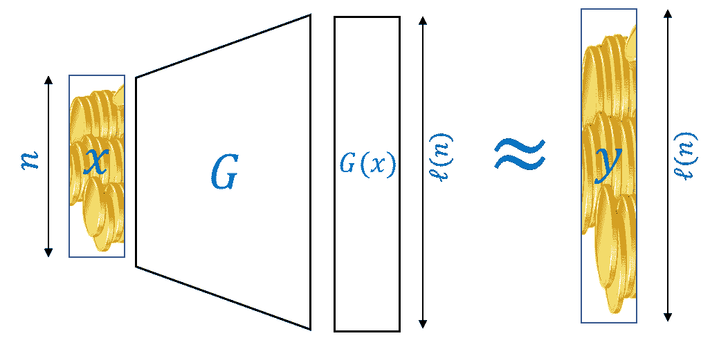
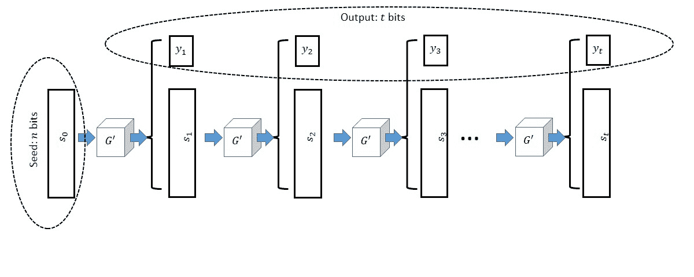
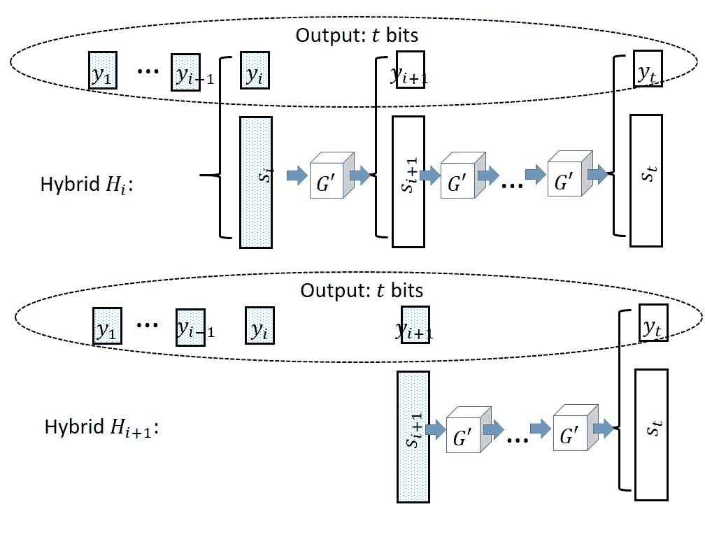
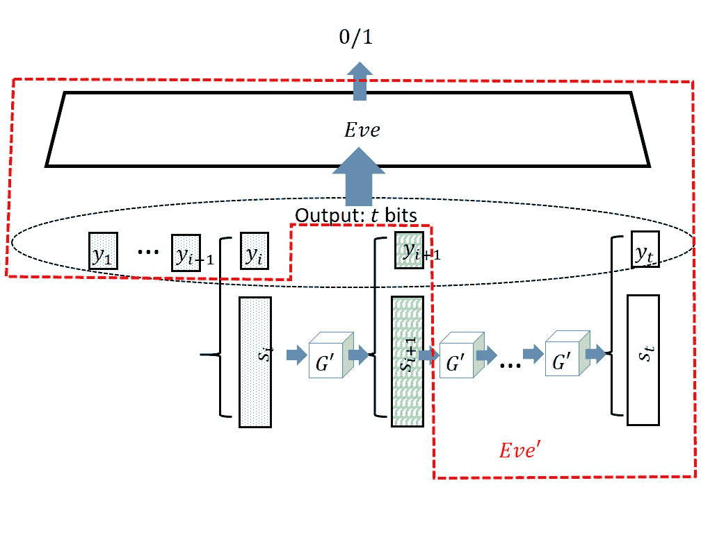

# 伪随机性

> 原文：[`intensecrypto.org/public/lec_03_pseudorandom-generators.html`](https://intensecrypto.org/public/lec_03_pseudorandom-generators.html)

*如有任何错误/错别字/令人困惑的解释？[在 GitHub 上打开一个 issue](https://github.com/boazbk/crypto/issues/new)。您也可以在下面评论*

**★ 另请参阅本章的[PDF 版本](https://files.boazbarak.org/crypto/lec_03_pseudorandom-generators.pdf)（格式更好/参考文献）★**

**阅读：** Katz-Lindell 第 3.3 节，Boneh-Shoup 第三章^(1)

随机性的本质已经困扰了哲学家、科学家、统计学家和普通大众多年.^(2) 多年来，人们对数据随机性的含义以及概率的本质提出了不同的答案。行星的运动最初看起来是随机的和任意的，但后来早期的天文学家设法找到了*秩序*并对它们做出了一些*预测*。同样，我们在预测天气方面取得了巨大进步，并可能会继续这样做。

因此，尽管现在看起来是否会在一周后下雨似乎是*随机的*，但我们想象在将来我们能够准确预测天气。即使是经典的随机实验概念——抛硬币——[可能也没有你想象的那么随机](http://statweb.stanford.edu/~susan/papers/headswithJ.pdf)：第二次抛掷有大约 51% 的概率会得到与第一次相同的结果。（尽管[也参见这个实验](https://www.stat.berkeley.edu/~aldous/Real-World/coin_tosses.html)。）可以想象，在某个时刻，有人会发现某个函数 \(F\)，给定任何给定的人前 100 次抛硬币的结果，可以预测第 101 次抛硬币的值^(3)

在所有这些例子中，事件背后的物理现象，无论是行星的运动、天气还是抛硬币，都没有改变，只是我们预测它们的能力发生了变化。因此，在很大程度上，*随机性是观察者的函数*，换句话说

> *如果一个量难以计算，它可能就是随机的。*

大部分密码学都是关于尝试使这种直觉更加正式，并利用它来构建安全系统。我们想要的基本对象如下：

函数 \(G:{\{0,1\}}^n\rightarrow{\{0,1\}}^\ell\) 是一个 \((T,\epsilon)\) 伪随机生成器，如果 \(G(U_n) \approx_{T,\epsilon} U_\ell\)，其中 \(U_t\) 表示 \({\{0,1\}}^t\) 上的均匀分布。

即，如果没有任何最多 \(T\) 个门的电路能够以比 \(\epsilon\) 更好的偏差区分 \(G\)（在随机输入上的输出）和相同长度的均匀随机字符串，那么 \(G\) 是一个 \((T,\epsilon)\) 伪随机生成器。完全展开来说，这意味着对于每个最多使用 \(T\) 次操作可计算的功能 \(D:\{0,1\}^\ell \rightarrow \{0,1\}\)，

\[\left| \Pr_{x \leftarrow_R \{0,1\}^n}[ D(G(x))=1 ] - \Pr_{y \leftarrow_R \{0,1\}^\ell}[ D(y)=1 ] \right| < \epsilon\;.\]

正如我们在加密的情况中所做的那样，我们通常使用**渐近术语**来描述密码学伪随机生成器。我们说 \(G\) 是一个简单的伪随机生成器，如果它是高效可计算的，并且对于每个多项式 \(p(\cdot)\)，它都是 \((p(n),1/p(n))\)-伪随机生成器。换句话说，我们如下定义伪随机生成器：

设 \(G:\{0,1\}^* \rightarrow \{0,1\}^*\) 是某个多项式时间内可计算的功能。我们说 \(G\) 是一个具有长度函数 \(\ell:\N \rightarrow \N\)（其中 \(\ell(n)>n\)）的**伪随机生成器**，如果

+   对于每个 \(x\in \{0,1\}^*\)，\(|G(x)| = \ell(|x|)\)。

+   对于每个多项式 \(p(\cdot)\) 和足够大的 \(n\)，如果 \(D:\{0,1\}^{\ell(n)} \rightarrow \{0,1\}\) 是最多 \(p(n)\) 次操作可计算的，那么

\[\left| \Pr[D(G(U_n))=1] - \Pr[ D(U_\ell)=1] \right| < \tfrac{1}{p(n)} \;\;(3.1)\]

另一种说法是，一个多项式时间内可计算的功能 \(G\)，将 \(n\) 位的字符串映射到 \(\ell(n)>n\) 位的字符串，如果两个分布 \(G(U_n)\) 和 \(U_{\ell(n)}\) 是**计算上不可区分的**，则 \(G\) 是一个伪随机生成器。

这个定义（在密码学中通常如此）有点长，但伪随机生成器的概念在密码学中是核心的，因此你应该花时间确保你理解它。直观地说，一个函数 \(G\) 是一个伪随机生成器，如果**（1）**它扩展了其输入（将 \(n\) 位映射到 \(n+1\) 位或更多）并且**（2）**我们不能区分伪随机生成器的种子 \(x\)（即 \(n\) 位长的短随机字符串）的输出 \(G(x)\) 和从 \(\{0,1\}^{\ell(n)}\) 中随机均匀选择的真正随机长字符串。



3.1: 一个函数 \(G:\{0,1\}^n \rightarrow \{0,1\}^{\ell(n)}\) 是一个**伪随机生成器**，如果对于随机短字符串 \(x \leftarrow_R \{0,1\}^n\)，\(G(x)\) 在计算上是不可区分于长真正随机字符串 \(y \leftarrow_R \{0,1\}^{\ell(n)}\) 的。

注意，要求 \(\ell>n\) 是使这个概念非平凡的必要条件，因为当 \(\ell=n\) 时，函数 \(G(x)=x\) 显然满足 \(G(U_n)\) 与分布 \(U_n\) 相同（并且因此特别不可区分）。(确保你理解这个最后的陈述！）然而，当 \(\ell>n\) 时，这绝非平凡。特别是，如果我们不对 Eve 的运行时间进行限制，那么这样的伪随机生成器将不存在：

假设 \(G:{\{0,1\}}^n\rightarrow{\{0,1\}}^{n+1}\)。那么存在一个（效率低下的）算法 \(Eve:{\{0,1\}}^{n+1}\rightarrow{\{0,1\}}\)，使得 \({\mathbb{E}}[ Eve(G(U_n)) ]=1\) 但 \({\mathbb{E}}[ Eve(U_{n+1})] \leq 1/2\)。

在输入 \(y\in{\{0,1\}}^{n+1}\) 的情况下，考虑算法 \(Eve\)，它遍历所有可能的 \(x\in{\{0,1\}}^n\)，并且当且仅当存在某个 \(x\) 使得 \(y=G(x)\) 时输出 \(1\)。显然 \({\mathbb{E}}[ Eve(G(U_n)) ] =1\)。然而，Eve 输出 \(1\) 的集合 \(S =\{ G(x) : x\in {\{0,1\}}^n \}\) 的大小最多为 \(2^n\)，因此一个随机的 \(y{\leftarrow_{\tiny R}} U_{n+1}\) 落入 \(S\) 的概率最多为 \(1/2\)。

证明如果 \(P=\ensuremath{\mathit{NP}}\)，则上述算法 Eve 可以被高效化。特别是，目前我们还不知道如何 *证明* 伪随机生成器的存在。尽管如此，我们相信伪随机生成器是存在的，因此我们提出以下猜想：

> **猜想（PRG 猜想）**：对于每个 \(n\)，存在一个将 \(n\) 比特映射到 \(n+1\) 比特的伪随机生成器 \(G\)。^(4)

就像加密猜想一样，对于任何其他猜想，关于 PRG 猜想有两个自然的问题：我们为什么应该相信它，我们为什么应该关心它。幸运的是，第一个问题的答案是简单的：已知加密猜想 *蕴含* PRG 猜想，因此如果我们相信前者，我们也应该相信后者。（证明非常非平凡，我们可能在本课程中看不到它。）至于第二个问题，我们将看到 PRG 猜想蕴含了许多有用的加密工具，包括加密猜想（即，这两个猜想实际上是等价的）。我们首先展示，一旦我们能够得到比输入长一比特的输出，我们实际上可以获得任意多项式数量的比特。

假设 PRG 猜想是正确的。那么对于每个多项式 \(t(n)\)，存在一个将 \(n\) 比特映射到 \(t(n)\) 比特的伪随机生成器。



3.2：伪随机生成器的长度扩展

这个定理的证明与密码长度扩展定理非常相似，实际上这个定理可以用来给出前一个定理的另一种证明。

构造如图 3.2 所示。我们给定一个将\(n\)位映射到\(n+1\)位的伪随机生成器\(G'\)，需要构造一个将\(n\)位映射到\(t=t(n)\)位的伪随机生成器\(G\)，其中\(t(\cdot)\)是一个多项式。思路是保持一个\(n\)位的初始状态，即我们的输入种子^(5) \(s_0\)，在第\(i\)步使用\(G'\)将\(s_{i-1}\)映射到\(n+1\)位的比特串\((s_i,y_i)\)，输出\(y_i\)并将\(s_i\)作为新的状态。为了证明此构造的安全性，我们需要证明分布\(G(U_n) = (y_1,\ldots,y_t)\)在计算上是不可区分的，与均匀分布\(U_t\)。通常，我们将使用混合论证。对于\(i\in\{0,\ldots,t\}\)，我们定义\(H_i\)为前\(i\)位随机均匀选择，而最后\(t-i\)位按上述方式计算。也就是说，我们在\(\{0,1\}^n\)中随机选择\(s_i\)，并从状态\(s_i\)继续计算\(y_{i+1},\ldots,y_t\)。显然，\(H_0=G(U_n)\)和\(H_t=U_t\)，因此根据三角不等式，只需证明对于所有\(i\in\{0,\ldots,t-1\}\)，\(H_i \approx H_{i+1}\)。我们在图 3.3 中说明了这两个混合体。



3.3：混合\(H_i\)和\(H_{i+1}\)——虚线方框表示独立且均匀随机选择的值

现在假设相反，存在某个对手\(Eve\)，使得对于某个非可忽略的\(\epsilon\)，\(\left| \E[Eve(H_i)] - \E[Eve(H_{i+1})] \right| \geq \epsilon\)。从\(Eve\)，我们将设计一个打破伪随机生成器\(G'\)安全性的对手\(Eve'\)（参见图 3.4）。



3.4：从区分\(H_i\)和\(H_{i+1}\)的对手\(Eve\)构建\(G'\)的对手\(Eve'\)。标有问号的方框是随机或伪随机的，这取决于我们是在\(H_i\)还是\(H_{i+1}\)中。虚线红色线内的所有内容都是由\(Eve'\)模拟的，它接收\(n+1\)位字符串\((s_{i+1},y_{i+1})\)作为输入。

在输入长度为 \(n+1\) 的字符串 \(y\) 时，Eve' 将 \(y\) 解释为 \((s_{i+1},y_{i+1})\)，其中 \(s_{i+1} \in \{0,1\}^n\)。然后她随机选择 \(y_1,\ldots,y_i\)，并计算 \(y_{i+2},\ldots,y_t\)，就像我们在伪随机生成器的构造中做的那样。Eve' 将 \((y_1,\ldots,y_t)\) 输入 Eve，并输出 Eve 所做的任何操作。显然，如果 Eve 是高效的，那么 Eve' 也是高效的。此外，可以看出，如果 \(y\) 是随机的，那么 Eve' 将按照 \(H_{i+1}\) 的分布向 Eve 提供输入，而如果 \(y\) 是形式为 \(G(s)\) 的随机 \(s\)，那么 Eve' 将按照 \(H_i\) 的分布向 Eve 提供输入。因此，我们得到 \(| \E[ Eve'(G'(U_n))] - \E[Eve'(U_{n+1})] | \geq \epsilon\)，这与 \(G'\) 的安全性相矛盾。

定理 3.4 的证明 表明了许多伪随机生成器的实际构造。在许多操作系统和编程环境中，伪随机生成器的工作方式如下：

1.  在初始化时，系统获得一个初始的随机种子 \(x_0 \in \{0,1\}^n\)（其中通常 \(n\) 是 \(128\) 或 \(256\) 这样的值）。

1.  在第 \(t\) 次调用如 `rand` 这样的函数以获取新的随机数时，系统使用一些底层的伪随机生成器 \(G':\{0,1\}^n \rightarrow \{0,1\}^{n+m}\) 来让 \(x'\|y = G'(x_{t-1})\)，更新 \(x_t = x'\) 并输出 \(y\)。

常常有一些额外的复杂性，关于如何从某些“不可预测”或“高熵”的观察（有时包括网络延迟、用户输入和鼠标模式等）中获得这个种子，以及系统是否使用额外的观察定期“刷新”其状态。

### 不可预测性：证明长度扩展定理的另一种方法

在本章开头讨论的“随机”与“不可预测”是相同的概念，可以如下形式化。

一个可高效计算的函数 \(G:\{0,1\}^* \rightarrow \{0,1\}^*\) 是不可预测的，如果对于任何 \(n\)，\(1\le i<\ell(n)\) 和多项式大小的电路 \(P\)，

\[\Pr_{y\leftarrow G(U_n)}[P(y_1,\ldots,y_{i-1}) = y_i] \le \frac12+negl(n).\] 这里，\(\ell(n)\) 是 \(G\) 的长度函数，\(y\leftarrow G(U_n)\) 表示 \(y\) 是 \(G\) 的一个随机输出。换句话说，没有任何多项式大小的电路可以在给定前几个比特的情况下比随机猜测更好地预测 \(G\) 的下一个比特。

现在我们将证明一个函数 \(G\) 不可预测的条件等价于它是一个安全伪随机生成器的条件。请确保你跟随证明，因为它是一个重要的定理，因为它也是经典密码学证明的另一个例子。

设 \(G:\{0,1\}^* \rightarrow \{0,1\}^*\) 是一个具有长度函数 \(\ell(n)\) 的函数，那么 \(G\) 是一个安全的伪随机生成器（PRG）当且仅当它是不可预测的。

对于正向方向，假设存在某个 \(i\) 和某个电路 \(P\)，它可以以概率 \(p\ge \frac12+\epsilon(n)\)（对于非忽略的 \(\epsilon\)）预测 \(y_i\) 给定 \(y_1,\ldots,y_{i-1}\)。考虑敌手 \(Eve\)，它给定一个字符串 \(y\)，在 \(y_1,\ldots,y_{i-1}\) 上运行电路 \(P\)，检查输出是否等于 \(y_i\)，如果是，则输出 1。

如果 \(y=G(x)\) 对于一个均匀的 \(x\)，那么 \(P\) 以概率 \(p\) 成功。如果 \(y\) 是均匀随机的，那么我们可以想象比特 \(y_i\) 是在 \(P\) 完成计算后生成的。比特 \(y_i\) 是 \(0\) 或 \(1\)，概率相等，所以 \(P\) 以概率 \(\frac12\) 成功。由于 \(Eve\) 在 \(P\) 成功时输出 1，

\[\left| \Pr[Eve(G(U_n))=1] - \Pr[ Eve(U_\ell)=1] \right|=|p-\frac12|\ge \epsilon(n),\]这是一个矛盾。

对于反向方向，设 \(G\) 是一个不可预测的函数。设 \(H_i\) 是这样一个分布，其中前 \(i\) 比特来自 \(G(U_n)\)，而最后 \(\ell-i\) 比特都是随机的。注意 \(H_0=U_\ell\) 和 \(H_\ell=G(U_n)\)，所以只需证明对于所有 \(i\)，\(H_{i-1} \approx H_{i}\)。

假设对于某个 \(i\)，\(H_{i-1} \not\approx H_{i}\)，即存在某个敌手 \(Eve\) 和非忽略的 \(\epsilon\)，

\[\Pr[Eve(H_{i})=1]-\Pr[Eve(H_{i-1})=1]>\epsilon(n).\]考虑程序 \(P\)，它在输入 \((y_1,\ldots,y_{i-1})\) 时，随机均匀地选择比特 \(\hat y_{i},\ldots, \hat y_\ell\)。然后，\(P\) 在生成的输入上调用 \(Eve\)。如果 \(Eve\) 输出 \(1\)，则 \(P\) 输出 \(\hat y_{i}\)，否则输出 \(1-\hat y_{i}\)。

字符串 \((y_1,\ldots,y_{i-1}, \hat y_i,\ldots,\hat y_\ell)\) 与 \(H_{i-1}\) 有相同的分布。然而，在 \(\hat y_i=y_i\) 的条件下，该字符串的分布等于 \(H_{i}\)。设 \(p\) 是 \(Eve\) 在 \(\hat y_i=y_i\) 时输出 1 的概率，\(q\) 是 \(\hat y_i\neq y_i\) 时相同的概率，那么我们得到

\[p-\frac12(p+q)=\Pr[Eve(H_{i})=1]-\Pr[Eve(H_{i-1})=1]>\epsilon(n).\]因此，\(P\) 输出正确值的概率等于 \(\frac12p+\frac12(1-q)=\frac12+\epsilon(n)\)，这是一个矛盾。

不可预测性的定义是有用的，因为我们的许多伪随机生成器候选方案在它们的证明中依赖于不可预测性的定义。例如，我们将在本章后面看到的 Blum-Blum-Shub 生成器被证明在“二次剩余问题”困难的情况下是不可预测的。了解我们本章开始时的直觉可以形式化也是很好的。

## 流密码

现在我们展示伪随机生成器与加密方案之间的联系：

如果 PRG 假设是真的，那么加密假设也是真的。

结果表明，逆方向也是正确的，因此这两个假设是**等价的**。我们可能不会在这个课程中展示这个事实的（相当非平凡的）证明。（我们可能会展示一个较弱版本。）

回想一下，*一次性密码*是一个完美的加密方案，但它的唯一问题是加密一个\(n+1\)长的消息需要一个\(n+1\)长的比特密钥。现在使用伪随机生成器，我们可以将一个\(n\)比特长的密钥映射到一个看起来足够随机的\(n+1\)比特长字符串，我们可以将其用作一次性密码的密钥。也就是说，我们的加密方案如下：

\[ E_k(m) = G(k) \oplus m \]

和

\[ D_k(c) = G(k) \oplus c \]

就像一次性密码一样，\(D_k(E_k(m)) = G(k) \oplus G(k) \oplus m = m\)。此外，加密和解密算法显然是高效的。我们将通过展示更强的断言来证明加密的安全性，即对于任何\(m\)，\(E_{U_n}(m)\approx U_{n+1}\)。

注意到\(U_{n+1}=U_{n+1}\oplus m\)，正如我们在一次性密码的安全性中所示。假设对于某个非可忽略的\(\epsilon=\epsilon(n)>0\)，存在一个有效的对手\(Eve'\)，使得

\[ \left| {\mathbb{E}}[ Eve'(G(U_n)\oplus m)] - {\mathbb{E}}[ Eve'(U_{n+1}\oplus m) ] \right| \geq \epsilon. \]

然后，定义的对手\(Eve\)作为\(Eve(y) = Eve'(y\oplus m)\)也将是高效的。此外，如果\(y\)是伪随机的，则\(Eve(y)=Eve'(G(U_n)\oplus m)\)；如果\(y\)是均匀随机的，则\(Eve(y)=Eve'(U_{n+1}\oplus m)\)。然后，\(Eve\)可以用优势\(\epsilon\)区分这两个分布，这是矛盾的。

如果 PRG 输出\(t(n)\)位而不是\(n+1\)位，那么我们自动得到一个具有\(t(n)\)长消息长度的加密方案。实际上，在实践中，如果我们使用 PRG 的长度扩展，我们不需要事先决定消息的长度。每次我们需要加密消息的另一个位（或另一个块）\(m_i\)，我们就运行基本 PRG 来更新我们的状态并获得一些新的随机数\(y_i\)，我们可以将其与消息进行异或并输出。这种构造在文献中被称为*流密码*。在大量的实际文献中，*流密码*这个名字既用于伪随机生成器本身，也用于通过将其与一次性密码结合而获得的加密方案。

以下是对伪随机生成器的一个巧妙应用。爱丽丝和鲍勃希望通过电话掷一个公平的硬币。他们使用伪随机生成器\(G:\{0,1\}^n\rightarrow\{0,1\}^{3n}\)。

1.  爱丽丝将\(z\leftarrow_R\{0,1\}^{3n}\)发送给鲍勃

1.  鲍勃随机选择\(s\leftarrow_R\{0,1\}^n\)和\(b \leftarrow_R \{0,1\}\)。如果\(b=0\)，则鲍勃发送\(y=G(s)\)；如果\(b=1\)，则他发送\(y=G(s)\oplus z\)。换句话说，\(y = G(s) \oplus b\cdot z\)，其中\(b\cdot z\)是向量\((b\cdot z_1,\ldots, b\cdot z_{3n})\)。

1.  然后，爱丽丝随机选择\(b'\leftarrow_R\{0,1\}\)并发送给鲍勃。

1.  鲍勃将字符串\(s\)和\(b\)发送给爱丽丝。爱丽丝验证确实\(y= G(s) \oplus b \cdot z\)。否则，爱丽丝中断。

1.  协议的输出是\(b \oplus b'\)。

可以证明（假设协议已完成），输出是一个随机硬币，爱丽丝或鲍勃都无法控制或预测，并且比一半的优势微乎其微。尝试形式化这一点并证明是一个很好的练习。证明中的两个主要组成部分是：

+   在 \(z \leftarrow_R \{0,1\}^{3n}\) 的概率 \(1-negl(n)\) 上，集合 \(S_0 = \{ G(x) | x\in \{0,1\}^n \}\) 和 \(S_1 = \{ G(x) \oplus z | x\in \{0,1\}^n \}\) 将是互斥的。因此，通过随机选择 \(z\)，爱丽丝可以确保鲍勃在发送 \(y\) 后对 \(b\) 的选择是*承诺*的。

+   对于每一个 \(z\)，分布 \(G(U_n)\) 和 \(G(U_n)\oplus z\) 都是假随机的。这可以证明意味着无论爱丽丝选择什么字符串 \(z\)，她都不能以比 \(1/2 + negl(n)\) 更高的概率从鲍勃发送的字符串 \(y\) 中预测 \(b\)。因此，她选择的 \(b'\) 将基本上独立于 \(b\)。

## 假随机生成器实际上看起来是什么样子？

到目前为止，我们做出了假设，即诸如密码和假随机生成器之类的对象*存在*，而没有给出任何关于它们实际外观的线索。（尽管我们有凯撒密码、维吉尼亚密码和恩尼格玛密码的例子，说明安全的密码*是什么样的。）。如上所述，我们不知道如何*证明*任何特定的函数是假随机生成器。然而，有一些相当简单的*候选者*（即被假设为安全假随机生成器的函数），但在构建它们时必须小心。我们现在考虑将 \(n\) 位映射到 \(n+1\) 位（或更一般地，对于某个常数 \(c\)，映射到 \(n+c\) 位）的函数的候选者，并至少看起来有些“随机”。由于这些构造通常用作通过长度扩展定理（定理 3.4）获得更长的 PRG 的基本组件，我们将这些假随机生成器视为将表示当前状态的字符串 \(s\in\{0,1\}^n\) 映射到表示新状态的字符串 \(s’\in\{0,1\}^n\) 以及表示当前输出的字符串 \(b\in\{0,1\}^c\)。参见 Katz-Lindell 的第 6.1 节以及（为了更深入的了解）Boneh-Shoup 书中的第 3.6-3.9 节。

### 尝试 0：计数生成器

要开始，让我们看看一个明显是虚假的假随机生成器的例子。我们定义“计数假随机生成器” \(G:\{0,1\}^n \rightarrow \{0,1\}^{n+1}\) 如下。\(G(s)=(s',b)\) 其中 \(s' = s + 1 \mod 2^n\)（将 \(s\) 和 \(s'\) 作为 \(\{0,\ldots,2^n-1\}\) 中的数字处理）且 \(b\) 是 \(s'\) 的最低有效位。弄清楚为什么这不是一个安全的假随机生成器是一个很好的练习。

你真的应该在这里停下来，确保你看到为什么“计数假随机生成器”不是一个安全的假随机生成器。证明即使我们将最低有效位替换为每个 \(0 \leq k < n\) 的第 \(k\) 位，这一点仍然是正确的。

### 尝试 1：线性校验和/线性反馈移位寄存器（LFSR）

LFSR 可以被认为是所有伪随机生成器的“母亲”（或者可能更像是病态的远亲）。给定一个 \(n\) 位数，生成一个“随机”额外数字的最简单方法之一是使用**校验和**——一些数字的线性组合，一个典型的例子是[循环冗余校验](https://en.wikipedia.org/wiki/Cyclic_redundancy_check)或 CRC。这促使了**线性反馈移位寄存器生成器**（LFSR）的概念：如果当前状态是 \(s\in\{0,1\}^n\)，则输出是 \(f(s)\)，其中 \(f\) 是一个线性函数（模 2），而新状态是通过将前一个状态向右移位并在最左边位置放置 \(f(s)\) 得到的。也就是说，\(s'_1 = f(s)\) 和 \(s'_i = s_{i-1}\) 对于 \(i\in\{2,\ldots,n\}\)。

LFSR（线性反馈移位寄存器）具有几个良好的特性——如果选择合适的函数 \(f(\cdot)\)，它们可以具有非常长的**周期**（即，需要指数级步骤才能使状态重复），尽管这一点也适用于我们上面看到的简单“计数器”生成器。它们还具有每个单独的比特以恰好一半的概率等于 \(0\) 或 \(1\) 的特性（计数器生成器也具有这个特性）。

一个更有趣的特性是（如果函数选择得当），每两个坐标之间都是相互独立的。也就是说，存在某个超多项式函数 \(t(n)\)（实际上 \(t(n)\) 可以是 \(n\) 的指数函数）使得如果 \(\ell \neq \ell' \in \{0,\ldots, t(n) \}\)，那么如果我们查看对应于生成器的 \(\ell\)-th 和 \(\ell'\)-th 输出的两个随机变量（其中随机性是初始状态），那么它们分布得像两个独立的随机硬币。（这并不简单，它取决于 \(f\) 的选择——这是一个具有挑战性但很有用的练习。）计数器生成器在这个条件下表现得很差：两个连续状态之间的最低有效位总是翻转。

存在一个更一般的**线性生成器**的概念，其中新状态可以是前一个状态的任何可逆线性变换。也就是说，我们将状态 \(s\) 解释为某些整数 \(q,t\) 的 \(\Z_q^t\) 的一个元素，并让 \(s’=F(s)\) 和输出 \(b=G(s)\)，其中 \(F:\Z_q^t\rightarrow\Z_q^t\) 和 \(G:\Z_q^t\rightarrow\Z_q\) 是可逆的线性变换（模 \(q\)）。这包括一个特殊情况，即**线性同余生成器**，其中 \(t=1\)，而映射 \(F(s)\) 对应于取 \(as \pmod{q}\)，其中 \(a\) 是与 \(q\) 互质的数。

所有这些生成器都由于密码学的大敌——学生在任何线性代数课程中通常遇到的**高斯消元算法**——而不安全。

存在一个多项式时间算法可以解决 \(m\) 个变量 \(n\) 的线性方程（或者证明不存在解）在任何环上。

尽管高斯消元法（以及一些推广和相关算法，如欧几里得扩展最大公约数算法和 LLL 格减法算法）看似简单且普遍，但它一次又一次地被用来破解候选加密构造。特别是，如果我们观察一个线性生成器 \(b_1,\ldots,b_n\) 的前 \(n\) 个输出，那么我们可以写出关于未知初始状态的线性方程 \(f_1(s)=b_1,\ldots,f_n(s)=b_n\)，其中 \(f_i\) 是已知的线性函数。这些函数要么是**线性无关**的，在这种情况下，我们可以解这些方程以得到原始状态 \(s\) 的唯一解，并从这一点预测生成器的所有输出，要么是相关的，这意味着即使没有恢复原始状态，我们也可以预测一些输出。无论哪种情况，生成器都被 \(*\sharp !\)’ed（其中 \(* \sharp !\) 指的是你愿意在你系统被破解时使用的任何动词）。参见 James Reed 的这篇[1977 年论文](http://alumni.cs.ucr.edu/~jsun/random-number.pdf)。

这意味着在加密应用中使用线性校验和作为伪随机生成器是一个糟糕的主意，实际上在任何对抗性环境中（例如，不应该希望攻击者无法逆向工程计算信用卡号码控制位的算法^(9))。然而，这并不意味着没有合法的情况可以使用线性生成器。在一个应用不是对抗性的环境中，并且你有能力 *测试* 生成器是否真正成功的情况下，使用这种不安全的非加密生成器可能是合理的。它们通常更高效（尽管通常提高不大），因此在许多编程环境中（如 `C rand()` 命令）通常是默认选项。（实际上，使用密码学伪随机生成器的真正瓶颈通常是为其种子生成 *熵*，正如前一次讲座中讨论的那样，而不是它们的实际运行时间。）

### 从不安全到安全

通常情况下，我们希望“修复”一个损坏的加密原语，例如伪随机生成器，使其变得安全。目前这更多的是一种艺术而不是科学，但密码学家已经使用了一些原则来尝试使这一过程更加有原则性。主要直觉是，某些计算问题的特性使得它们更容易被算法处理（即，“更容易”），而当我们希望这些问题对密码学有用（即，“困难”）时，我们通常寻求不具有这些特性的变体。以下表格展示了此类特性的几个例子。（这些不是正式的陈述，而是旨在提供一些直觉。）

| 易 | 难 |
| --- | --- |
| 连续 | 离散 |
| 凸 | 非凸 |
| 线性 | 非线性（度 \(\geq 2\)） |
| 无噪声 | 有噪声 |
| 局部 | 全局 |
| 浅层 | 深层 |
| 低度 | 高度 |

许多密码构造可以被认为是试图通过从左到右移动此表的列来将一个简单问题转化为一个困难问题。

**离散对数问题**是连续实对数问题的离散版本。**错误学习问题**可以被认为是线性方程问题的噪声版本（或最小二乘最小化的离散版本）。在构建**分组密码**时，我们通常有 *混合* 转换来确保不同位之间的依赖结构是 *全局* 的，*S-盒* 来确保 *非线性*，以及许多 *轮数* 来确保 *深层结构* 和 *大的代数度*。

这也适用于另一个方向。许多算法和机器学习进展是通过将离散问题嵌入到连续凸问题中来实现的。一些对密码对象的攻击可以被认为是试图恢复一些结构（例如，通过将模运算嵌入到实线或“线性化”非线性方程）。

### 尝试 2：丢弃位的线性同余生成器

在伪随机生成器的实现中，广泛使用的一种方法是采用如上所述的线性生成器，如线性同余生成器，并使用线性函数的“切割”版本作为输出，并丢弃一些最低有效位。丢弃这些位的操作是非线性的，因此上述攻击并不立即适用。然而，这种攻击可以推广以处理这种情况，因此即使丢弃了位，线性同余生成器也是完全不安全的，并且（如果有的话）仅应在没有对手的应用程序（如模拟）中使用。Boneh-Shoup 书中的第 3.7.1 节描述了对这种生成器的一种攻击，该攻击使用了我们在本课程中将在不同背景下遇到的 *格算法* 的概念。

## 成功的例子

让我们现在描述一些（至少按照当前的知识）*成功*（的）伪随机生成器：

### 案例研究 1：子集和生成器

我们知道，这是一个极其简单的生成器，尽管如此，它仍然很安全^(10)。

```cpp
# seed is a list of 40 zero/one values
# output is a 48 bit integer
def subset_sum_gen(seed):
 modulo = 0x1000000
 constants = [ 
 0x3D6EA1, 0x1E2795, 0xC802C6, 0xBF742A, 0x45FF31, 
 0x53A9D4, 0x927F9F, 0x70E09D, 0x56F00A, 0x78B494, 
 0x9122E7, 0xAFB10C, 0x18C2C8, 0x8FF050, 0x0239A3, 
 0x02E4E0, 0x779B76, 0x1C4FC2, 0x7C5150, 0x81E05E, 
 0x154647, 0xB80E68, 0xA042E5, 0xE20269, 0xD3B7F3, 
 0xCC5FB9, 0x0BFC55, 0x847AE0, 0x8CFDF8, 0xE304B7, 
 0x869ACE, 0xB4CDAB, 0xC8E31F, 0x00EDC7, 0xC50541, 
 0x0D6DDD, 0x695A2F, 0xA81062, 0x0123CA, 0xC6C5C3 ]

 # return the modular sum of the constants
 # corresponding to ones in the seed
 return reduce(lambda x,y: (x+y) % modulo,
 map(lambda a,b: a*b, constants,seed))
```

这个生成器的种子是一个 40 位的`seed`数组，每个硬编码的常量长度为 48 位（这些常量是随机生成的，但一旦固定就永远不变，并且不是保密的，因此不被认为是秘密随机种子的一部分）。输出很简单

\[\sum_{i=1}^{40} \texttt{seed}[i]\texttt{constants}[i] \pmod{2^{48}}\]因此将 40 位输入扩展为 48 位输出。

这个生成器松散地受到“子集和”计算问题的启发，该问题是 NP 完难的。然而，由于 NP 完难是一个 *最坏情况* 的复杂度概念，它并不意味着伪随机生成器的安全性，伪随机生成器的安全性需要 *平均情况* 变体的难度。为了对其安全性有一个直观的了解，我们可以分析为什么（鉴于它似乎是线性的）我们不能简单地使用高斯消元法来破解它。

这是你停下来并尝试自己回答这个问题的绝佳时机。

给定已知的常数和已知的输出，确定潜在的种子集可以被视为在 40 个变量中求解一个 *单个* 方程。然而，这个方程显然是过定的，并且无论观察到的值是否确实是生成器的输出，或者它是随机均匀选择的，都将有一个解。

更具体地说，我们可以使用线性方程求解来计算（给定已知的常数 \(c_1,\ldots,c_{40} \in \Z_{2^{48}}\) 和输出 \(y \in \Z_{2^{48}}\)）所有向量 \((s_1,\ldots,s_{40}) \in (\Z_{2^{48}})^{40}\) 的线性子空间 \(V\)，使得 \(\sum s_i c_i = y \pmod{2^{48}}\)。但是，无论 \(y\) 是从 \(\Z_{2^{48}}\) 中随机生成的，还是作为生成器的输出生成的，子空间 \(V\) 总是具有相同的维度（具体来说，因为它是由 \(40\) 个变量的单个线性方程形成的，所以维度将是 \(39\)）。要破解生成器，我们似乎需要能够判断这个线性子空间 \(V \subseteq (\Z_{2^{48}})^{40}\) 是否包含一个 *布尔向量*（即一个 \(s\in \{0,1\}^n\) 的向量）。由于向量是布尔的条件不是由线性方程定义的，我们不能使用高斯消元法来破解生成器。一般来说，在离散线性子空间内找到具有 *小系数* 的向量的任务与一个经典问题密切相关，即寻找 [晶格中的最短向量](https://goo.gl/WRNT9S)。（另见 [短整数解（SIS）问题](https://goo.gl/KwZWhV)。）

### 案例研究 2：RC4

以下是一个称为 RC4（这代表 Rivest Cipher 4，因为 Ron Rivest 在 1987 年发明了它）的极其简单的生成器的另一个示例，并且至今仍然相当广泛地被使用。

```cpp
def RC4(P,i,j):
 i = (i + 1) % 256
 j = (j + P[i]) % 256
 P[i], P[j] = P[j], P[i]
 return (P,i,j,P[(P[i]+P[j]) % 256])
```

函数 `RC4` 以生成器的当前状态 `P,i,j` 作为输入，并返回新的状态以及一个单独的输出字节。生成器的状态由一个 256 字节的数组 `P` 组成，可以将其视为 \(0,\ldots,255\) 的一个 *排列*，即我们保持不变性，对于每个 \(i\neq j\)，\(\texttt{P}[i]\neq\texttt{P}[j]\)。我们可以将初始状态视为 `P` 是一个完全随机的排列，而 `i` 和 `j` 被初始化为零的情况，尽管为了节省初始种子大小，通常 RC4 使用某种“伪随机”方法从更短的种子生成 `P`。

RC4 具有极其高效的软件实现，因此已被广泛实现。然而，它在安全性方面存在一些问题。特别是，Mantin^(11) 和 Shamir 表明，即使初始化向量是随机的，RC4 的第二个位**也不是**随机的。这些问题以及其他问题导致了 802.11b WiFi 协议的实际攻击，参见 Boneh-Shoup 的第 9.9 节。对这些攻击的最初反应是建议丢弃输出中的前 1024 个字节，但现在攻击已经足够扩展，以至于 RC4 已经不再被认为是一个安全的密码了。由 Dan Bernstein 设计的 Salsa 和 ChaCha 密码与 RC4 有类似的设计，被认为是安全的，并部署在几个标准协议中，如 TLS、SSH 和 QUIC，参见 Boneh-Shoup 的第 3.6 节。

### 案例研究 3：布卢姆、布卢姆和舒布

B.B.S.，代表作者布卢姆、布卢姆和舒布，是一个由数论中的一个可能难以解决的问题构建的简单生成器。

设 \(N=P\cdot Q\)，其中 \(P,Q\) 是素数。（我们通常使用大小约为 \(n\) 的 \(P,Q\)，其中 \(n\) 是我们的安全参数，因此使用大写字母来强调这些数字的大小是安全参数的指数级。） 

我们定义 \(\ensuremath{\mathit{QR}}_N\) 为模 \(N\) 的**二次剩余**的集合，这些数有模平方根。形式上，

\[\ensuremath{\mathit{QR}}_N=\{X² \mod N \mid \gcd(X,N )=1\}.\]

这个定义扩展了当我们处理标准整数时“完全平方数”的概念。注意，\(Y \in \ensuremath{\mathit{QR}}_N\) 中的每个数至少有一个平方根（即 \(X\)，使得 \(Y = X² \mod N\)）。在课程的后半部分，我们将看到如果 \(N = P\cdot Q\) 对于素数 \(P,Q\)，那么每个 \(Y\in \ensuremath{\mathit{QR}}_N\) 恰好有 \(4\) 个平方根。B.B.S. 生成器选择 \(N=P\cdot Q\)，其中 \(P,Q\) 是素数且 \(P,Q\equiv 3\pmod{4}\)。第二个条件保证了对于每个 \(Y\in \ensuremath{\mathit{QR}}_N\)，恰好有一个平方根落在 \(\ensuremath{\mathit{QR}}_N\) 中，因此 \(X \mapsto X² \mod N\) 是从 \(\ensuremath{\mathit{QR}}_N\) 到自身的单射和满射映射。

它被定义为如下：

```cpp
def BBS(X):
 return (X * X % N, N % 2)
```

换句话说，对于输入 \(X\)，\(\ensuremath{\mathit{BBS}}(X)\) 输出 \(X² \mod N\) 和 \(X\) 的最低有效位。我们可以将 \(\ensuremath{\mathit{BBS}}\) 视为一个映射 \(\ensuremath{\mathit{BBS}}:QR_N \rightarrow \ensuremath{\mathit{QR}}_N \times \{0,1\}\)，因此它将一个域映射到一个更大的域。我们还可以将其扩展以输出 \(t\) 个额外的位，通过重复平方输入，令 \(X_0 = X\)，\(X_{i+1} = X_i² \mod N\)，对于 \(i=0,\ldots,{t-1}\)，然后输出 \(X_t\) 以及 \(X_0,\ldots,X_{t-1}\) 的最低有效位。结果发现，假设不存在多项式时间算法（其中“多项式时间”意味着 \(N\) 的位数表示的多项式，即 \(\log N\) 的多项式）来分解随机选择的整数 \(N=P\cdot Q\)，对于 \(N\) 的位数中的每一个 \(t\)，\(t\)-步 \(\ensuremath{\mathit{BBS}}\) 生成器的输出在计算上与 \(U_{QR_N} \times U_t\) 无法区分，其中 \(U_{QR_N}\) 表示 \(\ensuremath{\mathit{QR}}_N\) 上的均匀分布。

证明所需的数论需要一段时间来发展。然而，它很有趣，我建议读者搜索这个特定的生成器，例如查看 [Junod 的这篇调查](https://www.cs.miami.edu/home/burt/learning/Csc609.062/docs/bbs.pdf)。

## 伪随机生成器的非构造性存在

现在我们证明，如果我们不坚持伪随机生成器的**构造性**，那么存在输出比输入长度**指数级更大**的伪随机生成器。

存在一个绝对常数 \(C\)，对于每一个 \(\epsilon,T\)，如果 \(\ell > C (\log T + \log (1/\epsilon))\) 且 \(m \leq T\)，那么存在一个 \((T,\epsilon)\) 伪随机生成器 \(G: \{0,1\}^\ell \rightarrow \{0,1\}^m\)。

证明使用了一种极其有用的技术，称为“概率方法”，在数学上并不太难，但一开始可能会让人困惑.^(12) 策略是给出一个“非构造性”的伪随机生成器 \(G\) 存在的证明，通过表明如果 \(G\) 是随机选择的，那么它是一个有效的 \((T,\epsilon)\) 伪随机生成器的概率是正的。特别是这意味着存在一个单一的 \(G\)，它是一个有效的 \((T,\epsilon)\) 伪随机生成器。概率方法只是证明这种函数存在的一种**证明技术**。最终，我们的目标是证明存在一个满足 \((T, \epsilon)\) PRG 条件的**确定性**函数 \(G\)。

到目前为止，上述讨论可能相当抽象，但看过证明后就会变得清晰。

令 \(\epsilon,T,\ell,m\) 如引理所述。我们需要证明存在一个函数 \(G:\{0,1\}^\ell \rightarrow \{0,1\}^m\)，它可以“欺骗”每个 \(T\) 行程序 \(P\)，按照方程式 3.1 的意义。我们将证明这可以从以下命题中得出：

**命题 I:** 对于每个固定的 NAND 程序/布尔电路 \(P\)，如果我们随机选择 \(G:\{0,1\}^\ell \rightarrow \{0,1\}^m\)，那么违反方程式 3.1 的概率至多为 \(2^{-T²}\)。

在证明命题 I 之前，让我们看看为什么它意味着引理 3.12。我们可以将一个函数 \(G:\{0,1\}^\ell \rightarrow \{0,1\}^m\) 与其“真值表”或简单地所有可能的 \(2^\ell\) 输入上的评估列表相对应。由于每个输出都是一个 \(m\) 位的字符串，我们也可以将 \(G\) 视为 \(\{0,1\}^{m\cdot 2^\ell}\) 中的字符串。我们定义 \(\mathcal{F}^m_\ell\) 为从 \(\{0,1\}^\ell\) 到 \(\{0,1\}^m\) 的所有函数的集合。如上所述，我们可以将 \(\mathcal{F}_\ell^m\) 与 \(\{0,1\}^{m\cdot 2^\ell}\) 相对应，选择一个从 \(\mathcal{F}_\ell^m\) 中随机选择的函数 \(G\) 相当于选择一个随机的 \(m\cdot 2^\ell\) 长度的位字符串。

对于每个 NAND 程序/布尔电路 \(P\)，令 \(B_P\) 为事件，如果我们从 \(\mathcal{F}_\ell^m\) 中随机选择 \(G\)，那么方程式 3.1 相对于程序 \(P\) 被违反。理解事件 \(B_P\) 定义在什么样本空间上很重要，即这个事件依赖于 \(G\) 的选择，因此 \(B_P\) 是 \(\mathcal{F}_\ell^m\) 的一个子集。定义事件 \(B_P\) 的另一种等效方式是，它是所有将 \(\{0,1\}^\ell\) 映射到 \(\{0,1\}^m\) 且违反方程式 3.1 的函数的子集，换句话说：

\ B_P = \left\{ G \in \mathcal{F}_\ell^m \; \big| \; \left| \tfrac{1}{2^\ell}\sum_{s\in \{0,1\}^\ell} P(G(s)) - \tfrac{1}{2^m}\sum_{r \in \{0,1\}^m}P(r) \right| > \epsilon \right\} \;\;. \;\;(3.2) \中的概率陈述替换为等效的求和，以减少对 \(B_P\) 定义在什么样本空间上的混淆。)

要理解这个证明，关键在于你在这里暂停一下，看看上面 \(B_P\) 的定义如何与方程式 3.2 相对应。这很可能需要重新阅读上面的文本一两次，但这是解析概率陈述和了解如何识别这些陈述对应的*样本空间*的好练习。

现在，大小为 \(T\) 的程序（或大小为 \(T\) 的电路）的数量最多为 \(2^{O(T\log T)}\)。由于 \(T\log T = o(T²\))，这意味着如果命题 I 是正确的，那么根据并集原理，\(B_P\) 在所有最多 \(T\) 行的 NAND 程序上的并集的概率最多为 \(2^{O(T\log T)}2^{-T²} < 0.1\)，对于足够大的 \(T\) 来说。对我们来说，数字 \(0.1\) 的重要之处在于它小于 \(1\)。特别是，这意味着存在一个唯一的 \(G^* \in \mathcal{F}_\ell^m\)，它不违反方程 3.1 中的任何最多 \(T\) 行的 NAND 程序，但这恰恰意味着 \(G^*\) 是一个 \((T,\epsilon)\) 伪随机生成器。

因此，只需证明命题 I，就可以得出引理 3.12 的证明。选择一个随机的 \(G: \{0,1\}^\ell \rightarrow \{0,1\}^m\) 等同于选择 \(L=2^\ell\) 个随机的字符串 \(y_0,\ldots,y_{L-1} \in \{0,1\}^m\)，并让 \(G(x)=y_x\)（通过二进制表示将 \(\{0,1\}^\ell\) 和 \([L]\) 进行对应）。因此，该命题等价于证明对于每一个固定的函数 \(P:\{0,1\}^m \rightarrow \{0,1\}\)，如果 \(L > 2^{C (\log T + \log (1/\epsilon))}\)（通过设置 \(C>4\)，我们可以确保它大于 \(10 T²/\epsilon²\)），那么

\[ \left| \tfrac{1}{L}\sum_{i=0}^{L-1} P(y_i) - \Pr_{s \leftarrow_R \{0,1\}^m}[P(s)=1] \right| > \epsilon \;\;(3.3) \]的最大值是 \(2^{-T²}\)。?? ?? 直接来自 Chernoff 界。如果我们让对于每一个 \(i\in [L]\) 的随机变量 \(X_i\) 表示 \(P(y_i)\)，那么由于 \(y_0,\ldots,y_{L-1}\) 是独立随机选择的，这些是独立同分布的随机变量，其期望值为 \(\E_{y \leftarrow_R \{0,1\}^m}[P(y)]= \Pr_{y\leftarrow_R \{0,1\}^m}[ P(y)=1]\)，因此它们偏离其期望值的概率最多为 \(2\cdot 2^{-\epsilon² L/2}\)。

1.  由理查德·徐在 2020 年春季编辑和扩展。

    ↩

1.  即使律师们也在思考这个问题，最近的例子是关于幻想足球是运气游戏还是技能游戏的辩论。

    ↩

1.  事实上，在某种意义上，这样的函数必须存在，因为在整个世界历史上，据推测，从未有过 100 次公平投掷硬币的序列重复过。

    ↩

1.  “PRG 猜想”这个名字是非标准的。在文献中，这被称为伪随机生成器存在性的猜想。这是我在[理论计算机科学入门讲义](https://goo.gl/G7bU4M)中提出的“最优 PRG 猜想”的较弱形式，因为 PRG 猜想只假设存在具有任意多项式指数增长的伪随机生成器，而最优 PRG 猜想假设的是指数增长。

    ↩

1.  由于我们使用小的输入来生成一个大的伪随机字符串，伪随机生成器的输入通常被称为其“种子”。

    ↩

1.  CRC 通常用于生成一个“校验位”来检测信用卡或社会保障卡号的输入错误。尽管这两种用法有一些共同的直觉，但其目标与用于伪随机生成器的使用非常不同。

    ↩

1.  环是一组元素，其中加法和乘法是定义的，并遵循自然结合律和交换律（尽管不一定每个元素都有乘法逆元）。对于每个整数 \(q\)，我们定义 \(\Z_q\)（称为 *模 \(q\) 的整数环*）为 \(\{0,\ldots,q-1\}\)，其中加法和乘法是在模 \(q\) 下进行的。

    ↩

1.  尽管名称如此，该算法至少可以追溯到公元前 150 年左右的中文《九章算术》手稿。

    ↩

1.  该数字是通过应用 [Hans Peter Luhn](https://goo.gl/SL8ahM) 的算法获得的，该算法将一个简单的映射应用于卡的每一位，然后对它们进行求和并取模 10。

    ↩

1.  实际上，现代计算机将能够通过暴力破解这个生成器，但如果常数长度和数量加倍（或许四倍）的话，这应该足够安全，尽管写起来会更长。

    ↩

1.  我通常不会在这些讲义中包含参考文献，而是留给文本，但在这里我破例，因为 Itsik Mantin 是我在研究生院的一个好朋友。

    ↩

1.  有整本（强烈推荐）[Alon 和 Spencer 的书](https://www.amazon.com/Probabilistic-Method-Discrete-Mathematics-Optimization/dp/1119061954/ref=dp_ob_title_bk)专门介绍这种方法。

    ↩

## 评论

评论通过 [GitHub 仓库](https://github.com/boazbk/crypto/issues) 使用 [utteranc.es](https://utteranc.es) 应用程序发布。发表评论需要 GitHub 登录。如果您不想授权应用程序代表您发布，您也可以直接在 [GitHub 上的此页面问题](https://github.com/boazbk/crypto/issues?q=Pseudorandomness+in%3Atitle)上发表评论。

编译于 2021 年 11 月 17 日 22:36:09

版权所有 2021，Boaz Barak。

本作品受 [Creative Commons Attribution-NonCommercial-NoDerivatives 4.0 国际许可协议](https://creativecommons.org/licenses/by-nc-nd/4.0/) 的许可。

使用 [pandoc](https://pandoc.org/) 和 [panflute](http://scorreia.com/software/panflute/) 以及从 [gitbook](https://www.gitbook.com/) 和 [bookdown](https://bookdown.org/) 衍生的模板制作。
