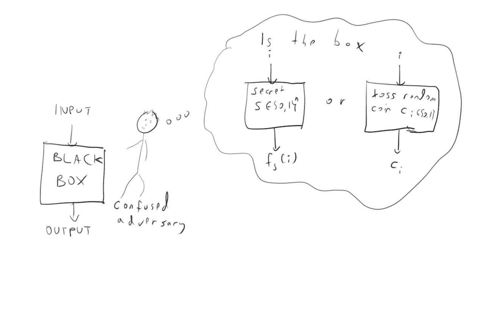

# 伪随机函数

> 原文：[`intensecrypto.org/public/lec_04_pseudorandom-functions.html`](https://intensecrypto.org/public/lec_04_pseudorandom-functions.html)

*如有任何错误/打字错误/令人困惑的解释，请[在 GitHub 上打开一个 issue](https://github.com/boazbk/crypto/issues/new)。您也可以在下面评论*

**★ 另请参阅本章的[PDF 版本**](https://files.boazbarak.org/crypto/lec_04_pseudorandom-functions.pdf)（更好的格式/参考文献）★

**阅读材料**：[Rosulek 第六章](https://web.engr.oregonstate.edu/~rosulekm/crypto/chap6.pdf)对伪随机函数有很好的描述。Katz-Lindell 的伪随机函数的讲解顺序与我们的不同。本节课和下一节课的内容在 KL 的第 3.4-3.5 节（PRFs 和 CPA 安全）、第 4.1-4.3 节（MACs）和第 8.5 节（从 PRG 构造 PRFs）中有所涉及。

在上一节课中，我们看到了**伪随机生成器**的概念，并介绍了**PRG 猜想**，该猜想指出存在一个将\(n\)位映射到\(n+1\)位的伪随机生成器。我们看到了**长度扩展定理**，该定理指出，对于任意大的多项式\(m(n)\)，给定这样的伪随机生成器，存在一个生成器将\(n\)位映射到\(m\)位。但我们能否进一步扩展呢？比如说，扩展到\(2^n\)位？这个问题甚至有意义吗？我们为什么要这样做？这就是本节课的主题。

初看之下，将伪随机生成器的输出长度扩展到\(2^n\)位似乎没有意义。毕竟，我们希望我们的生成器是**高效的**，而仅仅写下输出就会花费指数级的时间。然而，有一种方法可以绕过这个难题。虽然我们无法高效地写下完整的输出，但我们可以要求，给定一个索引\(i\in \{0,\ldots,2^n-1\}\)，可以在多项式时间内计算出输出的第\(i\)位。也就是说，我们要求函数\(i \mapsto G(s)_i\)是高效可计算的，并且（由于伪随机生成器的安全性）与将每个索引\(i\)映射到\(\{0,1\}\)中的一个独立随机位的函数不可区分。这就是**伪随机函数生成器**的概念，这个概念定义和构造起来有点微妙，但最终在密码学中有着许多应用。

一个高效可计算的功能\(F\)，它接受两个输入\(s\in\{0,1\}^*\)和\(i \in \{0,\ldots,2^{|s|}-1\}\)，并输出一个单比特\(F(s,i)\)，如果对于每个输出单个比特和多项式\(p(n)\)的多项式时间敌手\(A\)，当\(n\)足够大时：

\[ \left| \E_{s\in\{0,1\}^n}[ A^{F(s,\cdot)}(1^n)] - \E_{H \leftarrow_R [2^n]\rightarrow\{0,1\}}[A^H(1^n)] \right| < 1/p(n) \;.\]

关于符号的一些说明是必要的。输入 \(1^n\) 简单地是一个由 \(n\) 个 1 组成的字符串，并且这是一个典型的密码学约定，即假设这样的输入总是被敌手给出。这仅仅是因为当我们说“多项式时间敌手”时，我们实际上是指 \(n\) 的多项式（这是我们的密钥大小或安全参数）^(2)。符号 \(A^{F(s,\cdot)}\) 表示 \(A\) 有 *黑盒*（也称为 *预言机*）访问将 \(i\) 映射到 \(F(s,i)\) 的函数。也就是说，\(A\) 可以选择一个索引 \(i\)，查询盒子并获取 \(F(s,i)\)，然后选择一个新的索引 \(i'\)，查询盒子以获取 \(F(s,i')\)，以此类推，进行多项式次数的查询。符号 \(H \leftarrow_R [2^n] \rightarrow \{0,1\}\) 表示 \(H\) 是一个完全随机的函数，它将每个索引 \(i\) 映射到一个独立且随机的不同比特。

这个随机选择函数的概念可能难以理解。试着想象一个包含 \(\{0, 1\}^n\) 中所有字符串的表。我们现在走到每个可能的输入，随机生成一个比特作为它的输出，并在表中写下结果。当我们完成时，我们有一个长度为 \(2^n\) 的查找表，它将每个输入映射到一个随机生成的输出，这些输出是均匀且独立于所有其他输出的。这个查找表现在就是我们的随机函数 \(H\)。

在实践中，实际上生成所有 \(2^n\) 比特是非常繁琐的，有时在理论上，将每个输出视为仅在查询之后生成会更方便。这导致了采用 *懒加载评估模型*。在懒加载评估模型中，我们想象一个懒惰的人坐在一个房间里，这个房间有一个与之前相同的查找表，但所有条目都是空的。如果有人进行一些查询 \(H(s)\)，懒惰的人会检查查找表中 \(s\) 的条目是否为空。如果是，懒惰的评估者会生成一个随机比特，写下 \(s\) 的结果，并将其返回。否则，如果之前已经为 \(s\) 生成了一个输出（因为 \(s\) 之前已经被查询过），懒惰的评估者只需返回这个值。你能看出为什么这种模型在某些方面更方便吗？

考虑一个完全随机函数是如何确定的，还有一种最后的方法，那就是首先观察从 \(\{0, 1\}^n\) 到 \(\{0, 1\}\) 存在总共 \(2^{2^n}\) 个函数（你能看出为什么吗？可能更容易想象成从 \([2^n]\) 到 \(\{0, 1\}\) 的函数）。我们随机选择其中一个作为 \(H\)，并且对于任何给定的输入 \(s\)，结果 \(H(s)\) 是 \(0\) 或 \(1\)，概率相等，且与任何其他输入无关。

无论我们使用哪种模型来思考 \(H\) 的生成，在我们选择 \(H\) 并将其放入黑盒之后，\(H\) 的行为在某种意义上是“确定性的”，因为对于相同的查询，它总是会返回相同的结果。然而，在我们做出任何给定的查询 \(s\) 之前，我们只能以概率 \(\tfrac{1}{2}\) 正确猜测 \(H(s)\)，因为如果没有先前观察到 \(H(s)\)，它对我们来说实际上是随机的和未决定的（就像在懒惰评估器模型中一样）。

现在是一个停下来深入思考上述三个构造的绝佳时机，特别是为什么它们都是等价的。如果你不想思考，至少你应该在心里记下，如果你感到困惑，稍后再回来，因为这个想法在以后会非常有用。

因此，PRF 定义中的符号 \(A^H\) 表示 \(A\) 可以访问一个完全随机的黑盒，对于任何新的查询返回一个随机位，对于之前看到的查询返回之前相同的位。最后还有一个注意事项：以下我们将集合 \([2^n] = \{0,\ldots,2^n-1\}\) 与集合 \(\{0,1\}^n\) 等同（这些集合之间存在一对一的映射，使用二进制表示），因此我们将 \(i\) 互换地视为 \([2^n]\) 中的数字或 \(\{0,1\}^n\) 中的字符串。

**PRFs 的集合**。如果 \(F\) 是一个伪随机函数生成器，那么如果我们选择一个随机字符串 \(s\)，并考虑由 \(f_s\) 定义的函数，其中 \(f_s(i) = F(s,i)\)，则没有任何有效的算法能够区分对 \(f_s(\cdot)\) 的黑盒访问和对完全随机函数的黑盒访问（参见图 4.1）。值得注意的是，黑盒访问意味着事先攻击者不知道它正在查询哪个函数。从攻击者的角度来看，他们查询某个预言机 \(O\)（在幕后可能是 \(f_s(\cdot)\) 或 \(H\)），并必须决定 \(O = f_s(\cdot)\) 或 \(O = H\)。因此，我们经常不谈论伪随机函数生成器，而是将伪随机函数集合 \(\{ f_s \}_{s\in \{0,1\}^*}\) 称为伪随机函数集合。形式上，这定义如下：

设 \(\{ f_s \}_{s\in \{0,1\}^*}\) 是一个函数集合，对于每个 \(s\in \{0,1\}^*\)，\(f_s:\{0,1\}^{|s|} \rightarrow \{0,1\}\)。我们说 \(\{ f_s \}\) 是一个伪随机函数集合，如果输入 \(s\in \{0,1\}^*\) 和 \(i \in \{0,\ldots,2^{|s|}-1\}\) 时输出 \(f_s(i)\) 的函数 \(F\) 是一个 PRF 生成器。

注意，定义 4.3 的条件对应于要求对于每个多项式 \(p\) 和 \(p(n)\) 时间的攻击者 \(A\)，如果 \(n\) 足够大，则

\[ \left| \E_{s\in\{0,1\}^n}[ A^{f_s(\cdot)}(1^n)] - \E_{h \leftarrow_R \mathcal{F}_{n,1} }[A^h(1^n)] \right| < 1/p(n)\]，其中 \(\mathcal{F}_{n,1}\) 是所有将 \(\{0,1\}^n\) 映射到 \(\{0,1\}\) 的函数的集合（即集合 \(\{0,1\}^n \rightarrow \{0,1\}\)）。

值得停下来确保你理解为什么定义 4.3 和定义 4.1 给出了关于同一对象的不同的说法方式。

4.1：在伪随机函数中，攻击者无法判断他们是否得到了一个计算函数 \(i \mapsto F(s,i)\) 的黑盒，其中 \(s\) 是随机选择并固定的某个秘密，或者黑盒计算的是一个完全随机的函数，每次接收到新的输入 \(i\) 时都会掷一个新的随机硬币。

在下一讲中，我们将看到以下定理的证明（归功于 Goldreich、Goldwasser 和 Micali）

假设 PRG 猜想成立，存在一个安全的伪随机函数生成器。

但在我们看到定理 4.4 的证明之前，让我们看看为什么伪随机函数可能是有用的。

## 一次性密码（例如 Google Authenticator、RSA ID 等）

到目前为止，我们讨论了加密的任务，即保护消息的*机密性*。但认证的任务，即保护消息的*完整性*，同样重要。例如，考虑你通过一个开放的通道（如未加密的 Wi-Fi 连接）接收你 PC、手机、汽车、心脏起搏器等设备的软件更新。更新的内容并不是秘密，但至关重要的是，它必须与公司发送的消息保持不变，并且没有恶意攻击者修改了代码。同样，当你登录银行时，你可能会更担心有人冒充你并清空你的账户，而不是担心你信息的机密性。

让我们从一个非常简单的场景开始，我们将称之为**登录问题**。**Alice**和**Bob**像以前一样共享一个密钥，但现在 Alice 只想向 Bob 证明她的身份。使这个问题具有挑战性的是，这次他们需要应对的不是被动监听者 Eve，而是主动攻击者**Mallory**，她完全控制着他们之间的通信通道，并且可以修改（或*mall*）他们发送的任何消息。具体到身份验证的案例，我们考虑以下场景。这种**身份验证协议**的每个实例都是 Alice 和 Bob 之间的一些交互，以 Bob 决定是否接受它作为真实的身份或拒绝它作为冒充尝试而结束。Mallory 的目标是欺骗 Bob，让她被认为是 Alice。

尝试解决登录问题最基本的方法是简单地使用**密码**。也就是说，如果我们假设爱丽丝和鲍勃可以共享一个密钥，我们可以将这个密钥视为从 \(\{0,1\}^n\) 中随机选择的某个秘密密码 \(p\)（因此只能以 \(2^{-n}\) 的概率猜测）。为什么爱丽丝不直接将 \(p\) 发送给鲍勃以证明自己的身份呢？稍加思考就会显示这是一个非常糟糕的想法。由于马尔洛里控制着通信线路，她会在第一次身份验证尝试后学习到 \(p\)，然后可以轻易地冒充爱丽丝进行未来的交互。然而，我们似乎有保护 \(p\) 秘密性的工具——**加密**。假设爱丽丝和鲍勃共享一个秘密密钥 \(k\) 和一个额外的秘密密码 \(p\)。那么，爱丽丝向鲍勃发送密码 \(p\) 的加密版本来解决问题不是一种简单的方法吗？毕竟，加密的安全性应该保证马尔洛里不能学习到 \(p\)，对吧？

这可能是一个停止阅读并尝试自己思考是否使用安全的加密来加密 \(p\) 就能保证登录问题安全的好时机。（真的，停下来想想。）

问题在于马尔洛里不需要学习密码 \(p\) 就能冒充爱丽丝。例如，她可以简单地记录爱丽丝在第一次会话中发送给鲍勃的消息 \(c_1\)，然后在下一次会话中将其**重放**给鲍勃。由于该消息是 \(p\) 的有效加密，鲍勃就会接受它来自马尔洛里！（这被称为**重放攻击**，是在密码学协议中需要防范的一种常见攻击。）人们可以尝试采取对策来防御这种特定的攻击，但其存在表明密码的秘密性并不能保证登录协议的安全性。

### 伪随机函数是如何帮助解决登录问题的？

这个想法是创建一个所谓的**一次性密码**。爱丽丝和鲍勃将共享一个索引 \(s\in\{0,1\}^n\)，用于伪随机函数生成器 \(\{ f_s \}\)。当爱丽丝想要向鲍勃证明自己的身份时，鲍勃将选择一个随机的 \(i\leftarrow_R\{0,1\}^n\), 将 \(i\) 发送给爱丽丝，然后爱丽丝将 \(f_s(i),f_s(i+1),\ldots,f_s(i+\ell-1)\) 发送给鲍勃，其中 \(\ell\) 是某个参数（你可以将 \(\ell=n\) 简化思考）。鲍勃将检查确实 \(y=f_s(i)\)，如果是这样，就接受会话为真实的。

正式协议如下：

**协议** `PRF-Login`**:**

+   共享输入：\(s\in\{0,1\}^n\)。爱丽丝和鲍勃将其视为伪随机函数生成器 \(\{ f_s \}\) 的种子。

+   在每个会话中，爱丽丝和鲍勃都执行以下操作：

    1.  鲍勃选择一个随机的 \(i\leftarrow_R[2^n]\) 并将其发送给爱丽丝。

    1.  爱丽丝将 \(y_1,\ldots,y_\ell\) 发送给鲍勃，其中 \(y_j = f_s(i+j-1)\)。

    1.  鲍勃检查对于每个 \(j\in\{1,\ldots,\ell\}\)，\(y_j = f_s(i+j-1)\)，如果是这样，就接受会话；否则拒绝。

正如我们将看到的，输入 \(i\)（在密码学中被称为 *nonce*）是否随机实际上并不是特别关键。关键是它永远不会重复，以防止重放攻击。因此，在许多应用中，爱丽丝和鲍勃将 \(i\) 计算为当前时间的函数（例如，基于某个约定的起始点的当前分钟的索引），因此我们可以将其变成一个单消息协议。此外，参数 \(\ell\) 有时被故意选择得很短，这样人们就很容易输入 \(y_1,\ldots,y_\ell\) 的值。

12.1：Google Authenticator 应用是一个使用伪随机函数的一次密码方案的流行例子。另一个例子是 RSA 的 SecurID 令牌。

*为什么这是安全的？* 理解使用伪随机函数的方案的关键是想象如果 \(f_s\) 是一个 *实际* 随机函数而不是一个 *伪* 随机函数会发生什么。在一个真正的随机函数中，每一个值 \(f_s(0),\ldots,f_s(2^n-1)\) 都是从 \(\{0,1\}\) 中独立且均匀地随机选择的。想象这一点的有用方式是使用“懒评估”的概念。我们可以将 \(f_S\) 视为通过掷 \(2^n\) 个不同的硬币来确定 \(f(0),\ldots,f(2^n-1)\) 的值。现在考虑这种情况，我们直到需要它时才掷第 \(i^{th}\) 个硬币。关键点是，如果我们已经在 \(T\ll 2^n\) 个位置查询了函数，那么当鲍勃随机选择一个 \(i\in[2^n]\) 时，任何属于集合 \(\{i,i+1,\ldots,i+\ell-1\}\) 的位置都是我们之前查询过的位置的概率是 *极低的*。因此，如果函数是真正的随机函数，马洛里对这些坐标上函数的值 *没有任何信息*，并且能够以最多 \(2^{-\ell}\) 的概率预测（或者更确切地说，猜测）这些位置上的值。

请确保你理解上述非正式推理，因为我们现在将将其翻译成一个形式化的定理和证明。

假设 \(\{ f_s \}\) 是一个安全的伪随机函数生成器，并且爱丽丝和鲍勃使用协议 `PRF-Login` 与 Mallory 控制的某个多项式数量的会话（通过 Mallory 控制的通道）进行交互。在观察了这些交互之后，Mallory 然后与鲍勃进行交互，其中鲍勃遵循协议的指示，但 Mallory 可以访问任意有效的计算。然后，鲍勃接受交互的概率最多是 \(2^{-\ell}+\mu(n)\)，其中 \(\mu(\cdot)\) 是某个可忽略的函数。

这个证明，就像这门课程中的许多其他证明一样，使用了一个通过矛盾的方法。我们假设，为了矛盾的目的，存在一个对手 \(M\)（代表 Mallory），在 \(T\) 次交互后以概率 \(2^{-\ell}+\epsilon\) 破坏识别方案`PRF-Login`。然后我们构建一个攻击者 \(A\)，可以在 \(poly(T)\) 时间内以至少 \(\epsilon/2\) 的偏差区分对 \(\{ f_s \}\) 的访问和对随机函数的访问。

我们如何构建这个对手 \(A\) 呢？思路如下。首先，我们证明如果我们使用一个*实际随机*的函数运行协议`PRF-Login`，那么 \(M\) 就无法以比 \(2^{-\ell}+negligible\) 更高的概率成功进行伪装。因此，如果 \(M\) 真的做得更好，那么我们可以利用这一点来区分 \(f_s\) 和一个随机函数。对手 \(A\) 获得一些黑盒 \(O(\cdot)\)（用于*预言机*）并将使用它，同时在内部模拟`PRF-Login`协议的 \(T+1\) 次交互中的所有参与者——Alice、Bob 和 Mallory（使用 \(M\)）。每当任何一方需要评估 \(f_s(i)\) 时，\(A\) 将将 \(i\) 传递给其黑盒 \(O(\cdot)\) 并返回值 \(O(i)\)。然后，如果 \(M\) 在这个内部模拟中成功进行伪装，它将输出 \(1\)；否则输出 \(0\)。上述论证表明，如果 \(O(\cdot)\) 是一个真正的随机函数，那么 \(A\) 输出 \(1\) 的概率最多是 \(2^{-\ell}+negligible\)（因此特别地小于 \(2^{-\ell}+\epsilon/2\)）。另一方面，如果 \(O(\cdot)\) 是某个固定且随机的 \(s\) 的函数 \(i \mapsto f_s(i)\)，那么这个概率至少是 \(2^{-\ell}+\epsilon\)。因此 \(A\) 将以至少 \(\epsilon/2\) 的偏差区分这两种情况。我们现在转向正式的证明：

**命题 1**：假设`PRF-Login*`是协议`PRF-Login`的一个假设性变体，其中 Alice 和 Bob 共享一个完全随机的函数 \(H:[2^n]\rightarrow\{0,1\}\)。那么，无论 Mallory 做什么，她在观察到 \(T\) 次交互后伪装成 Alice 的概率最多是 \(2^{-\ell}+(8\ell T)/2^n\)。

（如果`PRF-Login*`比`PRF-Login`更容易证明其安全性，你可能会 wonder 为什么我们最初要使用`PRF-Login`而不是简单地使用`PRF-Login*`。原因是指定一个随机函数 \(H\) 需要指定 \(2^n\) 位，因此这将是一个*巨大的*共享密钥。所以`PRF-Login*`不是一个我们可以实际运行的协议，而是一个假设性的“心理实验”，它帮助我们论证`PRF-Login`的安全性。）

**声明 1 的证明：** 设 \(i_1,\ldots,i_{2T}\) 是鲍勃在第一 \(T\) 次迭代中选择的非随机数，并被爱丽丝接收。也就是说，\(i_1\) 是鲍勃在第一次迭代中选择的非随机数，而 \(i_2\) 是爱丽丝在第一次迭代中接收到的非随机数（如果 Mallory 没有修改它，那么 \(i_1=i_2\)）。同样，\(i_3\) 是鲍勃在第二次迭代中选择的非随机数，而 \(i_4\) 是爱丽丝接收到的非随机数，以此类推。设 \(i\) 是在 \(T+1\) 次迭代中 Mallory 试图冒充爱丽丝时选择的非随机数。我们声称存在某个 \(j\in\{1,\ldots,2T\}\) 使得 \(|i-i_j|<2\ell\) 的概率至多为 \(8\ell T/2^n\)。实际上，设 \(S\) 是所有形式为 \(\{ i_j-2\ell+1,\ldots, i_j+2\ell-1 \}\) 的区间的并集，对于 \(1 \leq j \leq 2T\)。由于它是长度小于 \(4\ell\) 的 \(2T\) 个区间的并集，\(S\) 包含最多 \(8T\ell\) 个元素，因此 \(i\) 属于 \(S\) 的概率是 \(|S|/2^n \leq (8T\ell)/2^n\)。现在，如果不存在 \(j\) 使得 \(|i-i_j|<2\ell\)，那么特别意味着在第一 \(T\) 次迭代中，爱丽丝或鲍勃对 \(H(\cdot)\) 所做的所有查询都与区间 \(\{ i,i+1,\ldots,i+\ell-1 \}\) 不相交。由于 \(H(\cdot)\) 是一个完全随机的函数，\(H(i),\ldots,H(i+\ell-1)\) 的值是从该函数的所有其他值中均匀且独立地选择的。由于 Mallory 在 \(T+1\) 次迭代中对鲍勃的消息 \(y\) 只取决于她过去观察到的，\(H(i),\ldots,H(i+\ell-1)\) 的值与 \(y\) 是独立的，因此在没有重叠的条件下，它们等于 \(y\) 的概率是 \(2^{-\ell}\)。QED（声明 1）。

声明 1 的证明并不困难，但有些微妙，所以再次复习并确保你理解它是很好的。

现在我们有了声明 1，定理的证明如上所述进行。我们通过让 \(A\) 在“其腹中”模拟所有参与者爱丽丝、鲍勃和 Mallory，如果 Mallory 成功冒充则输出 1 来构建一个针对 \(M\) 的伪随机函数生成器的对手 \(A\)。由于我们假设 \(\epsilon\) 是非可忽略的，\(T\) 是多项式的，我们可以假设 \((8\ell T)/2^n < \epsilon/2\)，因此根据声明 1，如果黑盒是一个随机函数，那么我们处于 `PRF-Login*` 设置，Mallory 的成功将最多是 \(2^{-\ell}+\epsilon/2\)。如果黑盒是 \(f_s(\cdot)\)，那么我们得到确切的 `PRF-Login` 设置，因此根据我们的假设，成功将至少是 \(2^{-\ell}+\epsilon\)。我们得出结论，\(A\) 在随机和伪随机情况下输出 1 的概率差异至少是 \(\epsilon/2\)，这与伪随机函数生成器的安全性相矛盾。

### 修改 PRFs 的输入和输出长度

在从 PRF 构建这个单次密码方案的过程中，我们实际上证明了一个有用的通用陈述：我们可以将标准 PRF（即从\(\{0,1\}^n\)到\(\{0,1\}\)的函数集合\(\{ f_s \}\)）转换为一个具有更长输出\(\ell\)的 PRF。具体来说，我们可以做出以下定义：

设\(\ell_{\text{in}},\ell_{\text{out}}:\N \rightarrow \N\)。如果函数集合\(\{ f_s \}_{s\in \{0,1\}^*}\)是一个具有输入长度\(\ell_{\text{in}}\)和输出长度\(\ell_{\text{out}}\)的**PRF 集合**，则：

1.  对于每一个\(n\in\N\)和\(s \in \{0,1\}^n\)，\(f_s:\{0,1\}^{\ell_{\text{in}}} \rightarrow \{0,1\}^{\ell_{\text{out}}}\)。

1.  对于每一个多项式\(p\)和\(p(n)\)-时间敌手\(A\)，如果\(n\)足够大，那么

\[ \left| \E_{s\in\{0,1\}^n}[ A^{f_s(\cdot)}(1^n)] - \E_{h \leftarrow_R \{0,1\}^{\ell_{\text{in}}} \rightarrow \{0,1\}^{\ell_{\text{out}}} }[A^h(1^n)] \right| < 1/p(n) \;.\]

我们在定义 4.3 中定义的标准 PRFs 对应于广义 PRFs，其中\(\ell_{\text{in}}(n)=n\)和\(\ell_{\text{out}}(n)=1\)对所有\(n\in\N\)成立。证明以下定理是一个很好的练习（我们将留给读者来完成）：

假设 PRFs 存在。那么对于每一个常数\(c\)和多项式时间可计算函数\(\ell_{\text{in}},\ell_{\text{out}}:\N \rightarrow \N\)，其中\(\ell_{\text{in}}(n), \ell_{\text{out}}(n) \leq n^c\)，存在一个具有输入长度\(\ell_{\text{in}}\)和输出长度\(\ell_{\text{out}}\)的 PRF 集合。

因此，从现在开始，每当被赋予一个 PRF 时，我们将允许自己假设它具有对我们来说方便的任何多项式输出大小。

## 消息认证码

单次密码是一种工具，允许你向，比如说，你的电子邮件服务器证明你的**身份**。但即使你这样做了，服务器如何信任未来的通信来自你而不是来自某个可以干扰你与服务器之间通信通道的攻击者（所谓“中间人”攻击）？同样，单次密码可能允许软件公司在发送软件更新之前证明他们的身份，但你如何知道攻击者没有在服务器和你的设备之间的传输过程中更改软件更新中的某些位？

这就是 *消息认证码 (MACs)* 发挥作用的地方——它们的作用不仅是要验证参与者的 *身份*，还要验证他们的 *通信*。再次，我们有 **爱丽丝** 和 **鲍勃**，以及可以积极修改消息的敌手 **玛洛丽**（与被动的窃听者伊娃形成对比）。与加密的情况类似，爱丽丝有一个她想要发送给鲍勃的 *消息* \(m\)，但现在我们不是关心玛洛丽 *学习* 消息的内容。相反，我们想要确保鲍勃得到爱丽丝发送的确切消息 \(m\)。实际上，这要求太多了，因为玛洛丽总是可以选择阻止所有通信，但我们可以要求鲍勃要么得到确切的消息 \(m\)，要么检测到失败并接受任何消息。由于我们处于 *私钥* 设置，我们假设爱丽丝和鲍勃共享一个玛洛丽不知道的密钥 \(k\)。

我们想要什么样的安全性？显然，我们希望玛洛丽不能让鲍勃接受一个 \(m'\neq m\) 的消息。但是，就像在加密设置中一样，我们想要的不仅仅是这样。我们希望爱丽丝和鲍勃能够为 *许多* 消息使用相同的密钥。因此，玛洛丽可能会在尝试让鲍勃接受一个 \(m'_{T+1} \neq m_{T+1}\) 的消息之前，观察爱丽丝和鲍勃在消息 \(m_1,\ldots,m_T\) 上的交互。事实上，为了使我们的安全概念更加稳健，我们甚至允许玛洛丽 *选择* 消息 \(m_1,\ldots,m_T\)（这被称为 *选择消息* 或 *选择明文* 攻击）。下面是结果的形式定义：

令 \((S,V)\)（代表 *签名* 和 *验证*）是一对高效可计算的算法，其中 \(S\) 以密钥 \(k\) 和消息 \(m\) 为输入，并产生一个标签 \(\tau \in \{0,1\}^*\)，而 \(V\) 以密钥 \(k\)、消息 \(m\) 和标签 \(\tau\) 为输入，并产生一个比特 \(b\in\{0,1\}\)。我们说 \((S,V)\) 是一个 *消息认证码 (MAC)*，如果：

+   对于每个密钥 \(k\) 和消息 \(m\)，\(V_k(m,S_k(m))=1\)。

+   对于每个多项式时间敌手 \(A\) 和多项式 \(p(n)\)，在 \(k\leftarrow_R\{0,1\}^n\) 的选择上，\(A^{S_k(\cdot)}(1^n)=(m',\tau')\) 的概率小于 \(1/p(n)\)，其中 \(m'\) 是 *不是* \(A\) 查询的消息之一，且 \(V_k(m',\tau')=1\).^(3)

如果爱丽丝和鲍勃共享密钥 \(k\)，那么要向鲍勃发送消息 \(m\)，爱丽丝将简单地发送一对 \((m,\tau)\)，其中 \(\tau = S_k(m)\)。如果鲍勃收到消息 \((m',\tau')\)，那么他只有在 \(V_k(m',\tau')=1\) 的情况下才会接受 \(m'\)。玛洛丽现在观察了 \(t\) 轮以 \((m_i,S_k(m_i))\) 形式进行的通信，其中 \(m_1,\ldots,m_t\) 是她选择的邮件，她的目标是尝试创建一个新消息 \(m'\)，这个消息不是爱丽丝发送的，但她可以伪造一个有效的标签 \(\tau'\) 以通过验证。我们的安全概念保证她只能以可忽略的概率做到这一点，在这种情况下，MAC 是 **CMA-secure**.^(4)

“选择消息攻击”这一概念可能看起来有些“过于夸张”。毕竟，Alice 将要发送给 Bob 的是她自己的选择的消息，而不是她的敌手 Mallory 选择的消息。然而，正如密码学家一次又一次地艰难地学到的那样，在安全定义上保守一些是更好的。首先，我们希望一个消息认证码能够适用于任何消息序列，因此最好考虑允许 Mallory 选择它们的“最坏情况”设置。其次，在许多现实场景中，敌手可能会对各方发送的消息产生一些影响。这种情况在从网络服务器到二战中的德国潜艇的各种案例中反复出现，当我们讨论加密方案上的*选择明文*和*选择密文*攻击时，我们将回到这一点。

一些文本（如 Boneh Shoup）定义了一个更强的不可伪造性概念，其中敌手甚至不能为攻击中已查询的消息生成新的签名。也就是说，敌手不能生成一个它以前没有见过的有效消息-签名对。这个更强的定义对于某些应用可能是有用的。将满足定义 4.8 的 MAC 转换为满足强不可伪造性的 MAC 相当容易。特别是，如果签名函数是确定性的，并且我们使用一个*规范验证算法*，其中\(V_k(m,\sigma)=1\)当且仅当\(S_k(m)=\sigma\)，那么弱不可伪造性自动意味着强不可伪造性，因为每个消息都有一个会通过验证的签名（你能看到为什么吗？）。

## 从 PRF 到 MAC

现在我们将展示伪随机函数生成器如何产生消息认证码。事实上，这个构造是如此直接，以至于大部分更应用性的密码学文献并不区分这两个概念，并使用“消息认证码”这个名字来指代 MAC 和 PRF。然而，由于这不是应用密码学文献，这个区分非常重要。

在 PRF 猜想下，存在一个安全的 MAC。

设\(F(\cdot,\cdot)\)为一个输出\(n/2\)位的安全伪随机函数生成器（我们可以使用定理 4.7 来获得）。我们定义\(S_k(m) = F(k,m)\)和\(V_k(m,\tau)\)以输出\(1\)当且仅当\(F(k,m)=\tau\)。假设为了矛盾的目的，存在一个敌手\(A\)破坏了这个 MAC 构造的安全性。也就是说，\(A\)查询\(S_k(\cdot)\) \(poly(n)\)次，并且以某个多项式\(p\)的概率输出\((m',\tau')\)，她没有请求这样的输出，使得\(F(k,m')=\tau'\)。

我们使用 \(A\) 构造一个对手 \(A'\)，该对手可以通过在 \(A'\) 内模拟 MAC 安全游戏来区分对 PRF 和随机函数的查询。每当 \(A\) 请求某个消息 \(m\) 的签名时，\(A'\) 返回 \(O(m)\)。当 \(A\) 在 \(\ensuremath{\mathit{MAC}}\) 游戏结束时返回 \((m', \tau')\)，如果 \(O(m') = \tau'\)，则 \(A'\) 返回 \(1\)，否则返回 \(0\)。如果 \(O(\cdot) = H(\cdot)\) 对于某个完全随机的函数 \(H(\cdot)\)，那么 \(H(m')\) 的值在 \(\{0,1\}^{n/2}\) 中是完全随机的，并且与所有先前的查询无关。因此，这个值等于 \(\tau'\) 的概率至多为 \(2^{-n/2}\)。如果相反 \(O(\cdot) = F(k,\cdot)\)，那么由于 \(A\) 以概率 \(1/p(n)\) 赢得 MAC 安全游戏，对手 \(A'\) 将以概率 \(1/p(n)\) 输出 \(1\)。这意味着这样的对手 \(A'\) 可以区分 \(F(k,\cdot)\) 的查询和一个随机函数 \(H\) 的查询，这给我们带来了矛盾。

## MAC 和 PRFs 的任意输入长度扩展

到目前为止，我们要求要签名的消息 \(m\) 的长度不能超过密钥 \(k\) 的长度（即，两者都是 \(n\) 位长）。然而，不难看出这个要求实际上并不是必需的。如果我们的消息更长，我们可以将其分成块 \(m_1,\ldots,m_t\)，并分别对每个消息 \((i,m_i)\) 进行签名。这里的缺点是标签的大小（即，MAC 输出）会随着消息的大小而增长。然而，这也不是必需的。因为标签的长度为 \(n/2\)，对于长度为 \(n\) 的消息，我们可以对 \(*标签*\) \(\tau_1,\ldots,\tau_t\) 进行签名，并且只输出这些。验证者可以重复这个计算来验证。我们可以继续这样做，从而为任意长度的消息获得 \(O(n)\) 长度的标签。因此，在未来，无论何时我们需要，我们都可以假设我们的 PRFs 和 MACs 可以接收 \(\{0,1\}^*\) 的输入——即，任意长度的字符串。

我们注意到，这个问题实际上在实践中的长度扩展是一个相当棘手且重要的问题。上述方法并不是实现这一目标最高效的方式，文献中还有几种更实用的变体（参见 Boneh-Shoup 第 6.4-6.8 节）。此外，一个人需要非常小心地处理消息块的确切切割方式和填充到块大小的整数倍。已经对那些执行此操作不正确的方案发起了几次攻击。

## 旁注：自然证明

伪随机函数在计算复杂性中扮演着重要的角色，它们已被用作证明诸如 \(\mathbf{P}\neq \mathbf{NP}\) 等结果的一种“屏障结果”的方法。[自然证明](https://goo.gl/fiH3Pe) 屏障对于证明电路下界说，如果存在足够强的伪随机函数，那么某些类型的论证注定会失败。这些论证提出了布尔函数 \(f:\{0,1\}^n \rightarrow \{0,1\}\) 的属性 \(\ensuremath{\mathit{EASY}}\)，使得：

+   如果函数 \(f\) 可以通过多项式大小的电路计算，那么它具有 \(\ensuremath{\mathit{EASY}}\) 属性。

+   对于具有高概率的随机函数，属性 \(\ensuremath{\mathit{EASY}}\) 不成立。

+   检查 \(\ensuremath{\mathit{EASY}}\) 是否成立可以在 \(f\) 的真值表大小多项式时间内完成。也就是说，在 \(2^{O(n)}\) 时间内。

从先验上看，这些技术条件可能看起来并不非常“自然”，但结果证明，许多用于证明电路下界（对于电路的特定族）的方法都具有这种形式。其思想是，这些方法找到易于计算函数的“非通用”属性，例如，在输入的一些位和输出之间找到一些有趣的关联。这些关联在随机函数中不太可能发生。下界通常通过展示一个不具有这种属性的函数 \(f_0\) 来实现，然后利用这一点推导出 \(f_0\) 不能由这个特定的电路族有效地计算。

强伪随机函数的存在可以证明与这种属性 \(\ensuremath{\mathit{EASY}}\) 的存在相矛盾，因为伪随机函数可以通过多项式大小的电路计算，但它不能与随机函数区分开来。虽然从先验上看，伪随机函数仅对多项式时间区分器是安全的，但在某些假设下，可能可以创建一个具有大小为 \(n⁵\) 的种子（例如）的伪随机函数，它对在时间 \(2^{O(n²)}\) 内运行的对手来说是安全的。

1.  我们通常会识别长度为 \(n\) 的字符串与介于 \(0\) 和 \(2^{n-1}\) 之间的数字，并且可以在两种表示之间自由切换，因此也可以将 \(i\) 也视为 \(\{0,1\}^n\) 中的一个字符串。我们还将根据方便性在从 \(0\) 开始和从 \(1\) 开始索引字符串之间切换。

    ↩

1.  这也使我们能够与“输入大小多项式”这一概念保持一致。

    ↩

1.  显然，如果对手输出一个它已经从其预言机查询的\((m,\tau)\)对，那么这对将能够通过验证。这暗示了可能存在一种**重放**攻击，其中 Mallory 重新发送 Alice 之前发送给 Bob 的消息。如上所述，可以通过坚持要求每个消息\(m\)以一个新的随机数或从当前时间派生的值开始来阻止这种攻击。

    ↩

1.  从先验的角度来看，你可能会问我们是否也应该给 Mallory 一个对\(V_k(\cdot)\)的预言机。毕竟，在那些许多互动的过程中，Mallory 也可以发送她选择的许多消息\((m',\tau')\)给 Bob，并从他的行为中观察这些消息是否通过了验证。证明添加这样的预言机不会改变定义的效力是一个很好的练习，尽管我们注意到，在加密的类似问题中，这显然**不是**情况。

    ↩

1.  这段讨论更多地与计算复杂性有关，而不是密码学，因此可以安全地跳过，而不会损害对课程中未来材料的理解。

    ↩

## 评论

评论发布在[GitHub 仓库](https://github.com/boazbk/crypto/issues)上，使用[utteranc.es](https://utteranc.es)应用程序。发表评论需要 GitHub 登录。如果您不想授权应用程序代表您发布，您也可以直接在[GitHub 页面上的 GitHub 问题](https://github.com/boazbk/crypto/issues?q=Pseudorandom functions+in%3Atitle)上发表评论。

编译于 2021 年 11 月 17 日 22:36:03

版权所有 2021，Boaz Barak。

本作品受[Creative Commons Attribution-NonCommercial-NoDerivatives 4.0 International License](https://creativecommons.org/licenses/by-nc-nd/4.0/)许可。

使用[pandoc](https://pandoc.org/)和[panflute](http://scorreia.com/software/panflute/)以及从[gitbook](https://www.gitbook.com/)和[bookdown](https://bookdown.org/)中提取的模板制作。
