# 从伪随机生成器到伪随机函数

> 原文：[`intensecrypto.org/public/lec_05_prf-from-prg.html`](https://intensecrypto.org/public/lec_05_prf-from-prg.html)

*看到任何错误/打字错误/令人困惑的解释吗？[在 GitHub 上打开一个 issue](https://github.com/boazbk/crypto/issues/new)。您也可以在下面评论*

**★ 另请参阅本章的[**PDF 版本**](https://files.boazbarak.org/crypto/lec_05_prf-from-prg.pdf)（更好的格式/参考文献）★

在本讲座中，我们将看到 PRG 猜想意味着 PRF 猜想。我们还将看到 PRFs 如何暗示一个即使我们使用相同的密钥加密多个消息也是安全的加密方案。

我们已经看到 PRF（伪随机函数）非常有用，我们将在稍后看到它们的一些更多应用。但它们可能太过神奇而不存在？为什么有人会想象这样一个美妙的东西是可行的？答案是以下定理：

假设 PRG 猜想是真的，那么存在一个安全的 PRF 集合\(\{ f_s \}_{s\in\{0,1\}^*}\)，对于每一个\(s\in\{0,1\}^n\)，\(f_s\)将\(\{0,1\}^n\)映射到\(\{0,1\}^n\)。

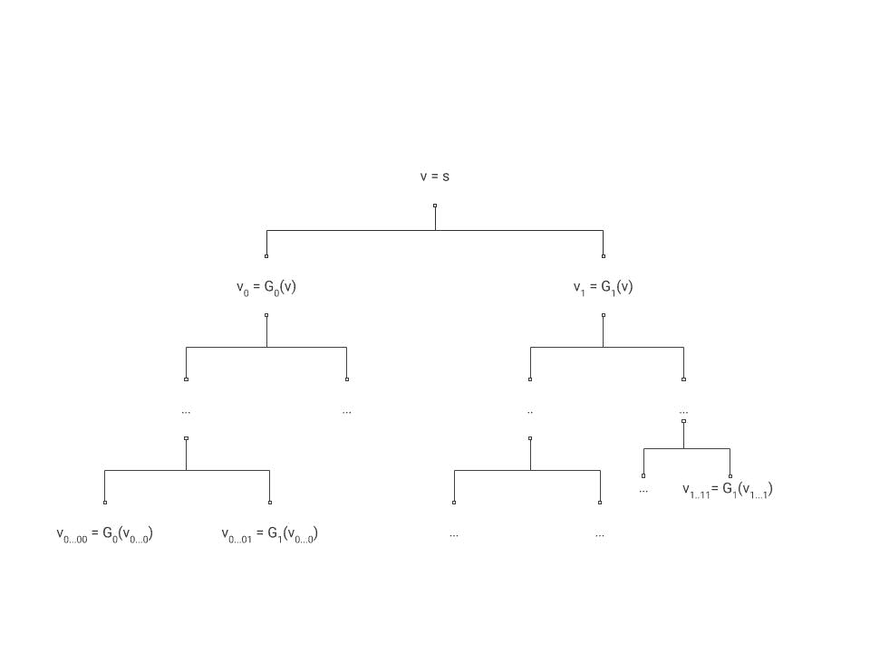

5.1：从伪随机生成器构造伪随机函数可以用深度为\(n\)的二叉树来表示。根节点标记为种子\(s\)，对于每个内部节点\(v\)标记为字符串\(x\in\{0,1\}^n\)，我们使用该标签\(x\)作为 PRG \(G\)的种子来标记\(v\)的两个子节点。特别是，\(v\)的子节点分别标记为\(G_0(x)\)和\(G_1(x)\)。函数\(f_s\)在输入\(i\)上的输出是从左到右数的第\(i\)个叶子的标签。请注意，叶子\(i\)的编号与\(i\)的位串表示以及以下方式中的路径叶子\(i\)有关：我们通过从根节点读取\(i\)的\(n\)位从左到右来遍历到叶子\(i\)，对于遇到的每个 0，我们进入当前节点的左子节点，对于每个 1，我们向右遍历。

我们描述了证明，另请参阅 Rosulek 的[第六章](https://web.engr.oregonstate.edu/~rosulekm/crypto/chap6.pdf)或 Katz-Lindell 的第 8.5 节（第 2 版的第 7.5 节）以获取不同的解释。

如果 PRG 猜想是真的，那么特别是根据长度扩展定理，存在一个 PRG \(G:\{0,1\}^n\rightarrow\{0,1\}^{2n}\)，它将\(n\)位映射到\(2n\)位。让我们用\(G(s)=G_0(s)\circ G_1(s)\)来表示，其中\(\circ\)表示连接。也就是说，\(G_0(s)\)表示\(G(s)\)的前\(n\)位，而\(G_1(s)\)表示\(G(s)\)的最后\(n\)位。

对于\(i\in\{0,1\}^n\)，我们定义\(f_s(i)\)为

\[G_{i_n}(G_{i_{n-1}}(\cdots G_{i_1}(s))).\] 这对应于 \(G_{b}\) 的 \(n\) 次组合应用，其中 \(b \in \{0,1\}\)。如果 \(i\) 的二进制字符串的第 \(j\) 位是 0，则 PRG 的第 \(j\) 次应用是 \(G_{0}\)，否则是 \(G_{1}\)。这一系列连续应用从初始种子 \(s\) 开始。

此定义直接对应于图 5.1 中的描述，其中 \(G_{b}\) 的连续应用对应于递归标记过程。

根据上述定义，我们可以看出，为了评估 \(f_s(i)\)，我们需要在长度为 \(n\) 的输入上对伪随机生成器进行 \(n\) 次评估，因此如果伪随机生成器是可高效计算的，那么伪随机函数也是可高效计算的。因此，“剩下”要证明的只是构造的安全性，这正是本证明的核心。

我之前提到，写证明的第一步是让自己相信陈述是正确的，但实际上有一个更重要的零步，那就是理解陈述实际上*意味着什么*。在这种情况下，我们需要证明的是以下内容：

我们需要证明 PRG \(G\) 的安全性意味着 PRF 集合 \(\{ f_s \}\) 的安全性。通过逆否命题，这意味着我们假设存在一个敌手 \(A\)，可以在时间 \(T\) 内区分 \(f_s(\cdot)\) 的黑盒与随机函数的黑盒，具有优势 \(\epsilon\)。我们需要使用 \(A\) 来构造一个敌手 \(D\)，可以在时间 \(poly(T)\) 内区分形式为 \(G(s)\) 的输入（其中 \(s\) 在 \(\{0,1\}^n\) 中是随机的）和形式为 \(y\) 的输入，其中 \(y\) 在 \(\{0,1\}^{2n}\) 中是随机的，偏差至少为 \(\epsilon/poly(T)\)。

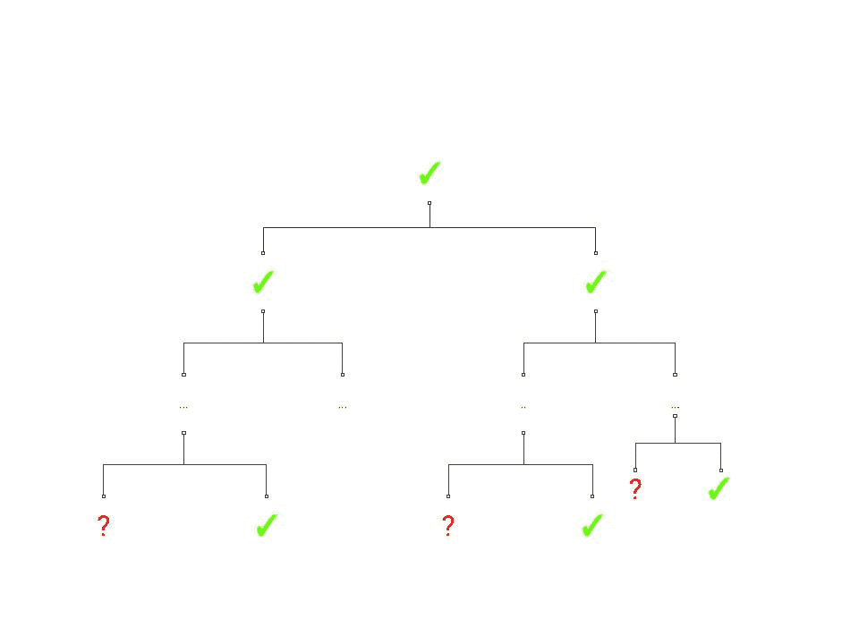

5.2: 在对敌手的黑盒“懒加载”实现中，我们仅在需要时才对树中的每个节点进行标记。后续遍历不会重新评估 PRG，导致中间种子被重复使用。例如，两个兄弟叶节点将对应于对 \(G(x)\) 的单个调用，其中 \(x\) 是它们的父节点标签，但左子节点接收 \(G(x)\) 的前 \(n\) 位，右子节点接收 \(G(x)\) 的后 \(n\) 位。在此图中，勾号对应已标记的节点，问号对应尚未标记的节点。

假设上述 \(A\) 是一个 \(T\) 次时间的对手，它在“PRF 游戏”中获胜的优势为 \(\epsilon\)。让我们考虑 \(A\) 的“懒加载”实现，如图 5.2 所示。也就是说，在任意时刻，在满二叉树中都有已标记的节点和尚未标记的节点。当 \(A\) 提出查询 \(i\) 时，这个查询对应于树中的路径 \(i_1\ldots i_n\)。我们查看路径上标记了某个值 \(y\) 的最低（离根最远）节点 \(v\)，然后从 \(v\) 开始向下标记路径，直到我们到达 \(i\)。换句话说，我们用 \(G_0(y)\) 和 \(G_1(y)\) 来标记 \(v\) 的两个子节点，然后如果路径 \(i\) 包含第一个子节点，我们就用 \(G_0(G_0(y))\) 和 \(G_1(G_0(y))\) 来标记其子节点，依此类推（见图 5.3）。注意，因为 \(G_{0}(y)\) 和 \(G_{1}(y)\) 对应于对 \(G\) 的单个调用，无论遍历是继续向左还是向右（即当前层是否对应于 \(i\) 中的值 0 或 1），我们同时标记两个子节点。

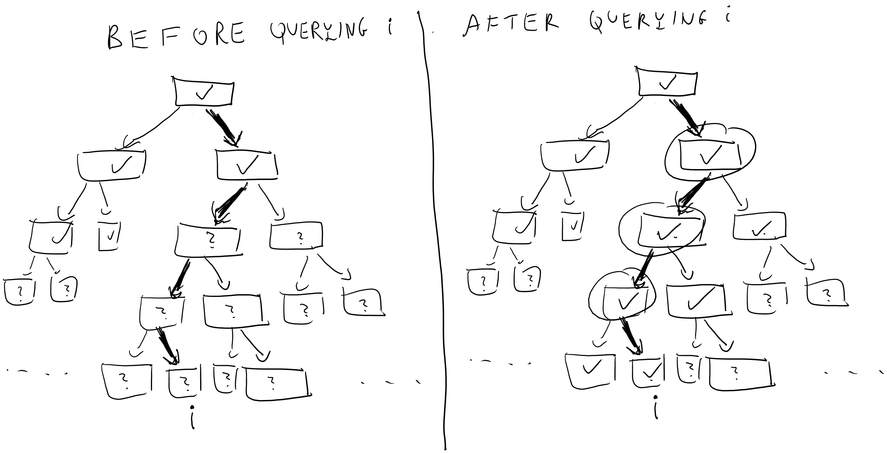

5.3：当对手查询 \(i\) 时，预言者从 \(i\) 到根的路径，并计算所需的最小内部节点数以获得第 \(i\) 个叶子的标签。

一想便知，这仅仅是另一种（或许有些繁琐）描述预言者的方法，预言者只是简单地计算映射 \(i\mapsto f_s(i)\)。因此，使用这个预言者运行 \(A\) 的实验会产生与使用 \(f_s(\cdot)\) 访问 \(A\) 时完全相同的结果。注意，由于 \(A\) 的运行时间最多为 \(T\)，我们的预言者需要标记内部节点的次数最多为 \(T' \leq 2nT\)（因为对于每个查询 \(i\)，我们最多标记 \(2n\) 个节点）。

我们现在定义以下 \(T'\) 混合：在 \(j^{th}\) 混合中，我们进行这个实验，但在前 \(j\) 次实验中，预言者需要标记内部节点，然后使用独立的随机标签。也就是说，在前 \(j\) 次标记节点 \(v\) 时，我们不是让 \(v\) 的标签为 \(G_b(u)\)（其中 \(u\) 是 \(v\) 的父节点，且 \(b\in \{0,1\}\) 对应于 \(v\) 是 \(u\) 的左子节点还是右子节点），而是用 \(\{0,1\}^n\) 中的随机字符串来标记 \(v\)。

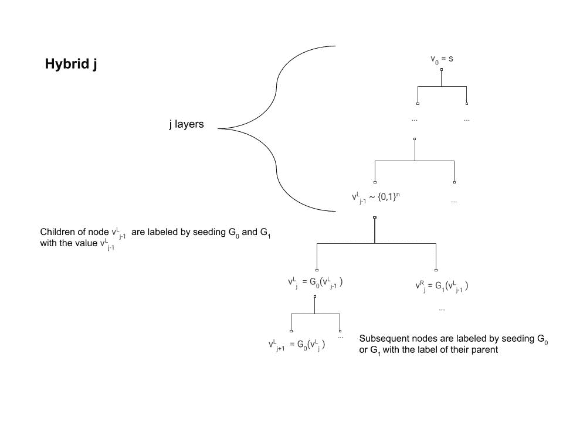

5.4: 在第 \(j\) 个混合模型中，前 \(j\) 个内部标签从 \(U_{n}\) 中均匀随机抽取。所有后续子标签都按照常规方式生成，通过用父标签 \(z\) 的标签对 \(G\) 进行初始化，并将前 \(n\) 位 (\(G_{0}(z)\)) 分配给左子节点，最后 \(n\) 位 (\(G_{1}(z)\)) 分配给右子节点。例如，对于第 \(j\) 层的某个节点 \(v^{L}_{j-1}\)，我们生成伪随机字符串 \(G(v^{L}_{j-1})\)，并将左子节点 \(v^{L}_{j} = G_{0}(v^{L}_{j-1})\) 和右子节点 \(v^{R}_{j} = G_{1}(v^{L}_{j-1})\) 标记。请注意，此图的标记方案与之前图中的方案不同。这只是为了便于说明，我们仍然可以通过从根节点到达它们的路径来索引我们的节点。

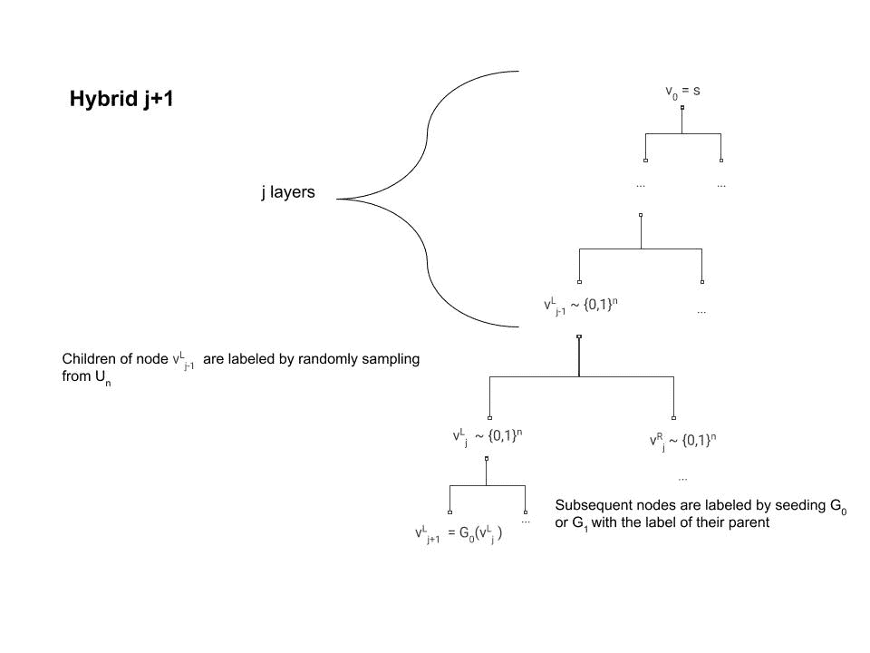

5.5: 第 \(j+1^{st}\) 个混合模型与第 \(j^{th}\) 个混合模型的不同之处在于，分配随机标签的过程一直持续到第 \(j+1^{st}\) 步，而不是第 \(j^{th}\) 步。混合模型在其他方面完全相同。

注意，第 \(0\) 个混合模型对应于预言者实现函数 \(i\mapsto f_s(i)\) 的情况，而在第 \(T'^{th}\) 个混合模型中，所有标签都是随机的，因此实现了随机函数。通过混合论证，如果 \(A\) 可以以偏差 \(\epsilon\) 区分第 \(0\) 个混合模型和第 \(T'^{th}\) 个混合模型，那么必须存在某个 \(j\)，使得它可以以至少 \(\epsilon/T'\) 的偏差区分第 \(j\) 个混合模型（如图 5.4 所示）和第 \(j+1^{st}\) 个混合模型（如图 5.5 所示）。我们将使用这个 \(j\) 和 \(A\) 来破解伪随机生成器。

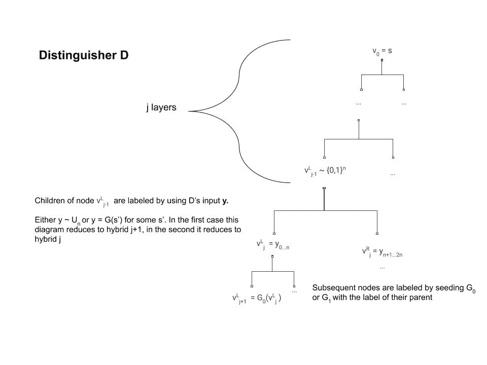

5.6: 区分器 D 与混合 \(j\) 类似，因为在第一 \(j\) 层中的节点被分配了完全随机的标签。在沿着通过 \(v_{j-1}^{L}\) 的特定路径评估时，而不是通过对其标签应用 \(G\) 来标记两个子节点，它只是将输入 \(y\) 分成两个字符串 \(y_{0...n}\)，\(y_{n+1...2n}\)。如果 \(y\) 真的是随机的，那么 \(D\) 与混合 \(j+1\) 相同。如果 \(y=G(s)\) 对于某个随机种子 \(s\)，那么 \(D\) 模拟混合 \(j\)。

现在我们可以描述我们的区分器 \(D\)（见图 5.6）（图 5.6）用于伪随机生成器。对于输入字符串 \(y\in\{0,1\}^{2n}\)，\(D\) 将运行 \(A\) 和其体内的第 \(j^{th}\) 预言者，有一个区别——当需要标记第 \(j^{th}\) 个节点时，它不是通过对其父节点 \(v\) 的标签应用伪随机生成器（这在第 \(j^{th}\) 预言者中应该发生）来这样做，而是使用其输入 \(y\) 来标记 \(v\) 的两个子节点。

现在，如果 \(y\) 完全随机，那么我们得到的就是第 \(j+1\) 个预言机的分布，因此在这种情况下，\(D\) 内部模拟了第 \(j+1\) 个混合函数。然而，如果 \(y=G(s)\) 对于某个随机采样的 \(s\in\{0,1\}^n\)，尽管一开始可能不明显，我们实际上得到的是第 \(j\) 个预言机的分布。

在 \(y=G(s)\) 条件下，混合 \(j\) 和区分器 \(D\) 之间的等价性并不明显，因为在混合 \(j\) 中，\(v_{j-1}^{L}\) 的子节点的标签本应是通过将伪随机生成器应用于 \(v_{j-1}^{L}\) 的标签得到的，而不是应用于某个其他随机字符串（参见图 5.6）。然而，因为 \(v\) 在第 \(j\) 步之前就被标记了，所以我们知道它实际上是由一个随机字符串标记的。此外，由于我们使用懒加载评估，我们知道第 \(j\) 步是实际使用 \(v\) 标签值的第一步。因此，如果我们在这个时候重新采样这个标签并使用一个完全独立的随机字符串 \(s\)，那么 \(v_{j-1}^{L}\) 和 \(s\) 的分布将是*相同的*。

这里的关键观察是：

1.  \(A\) 的输出不直接依赖于内部标签，而只依赖于叶子的标签（因为那些是预言机返回的唯一值）。

1.  内部顶点 \(v\) 的标签只使用一次，那就是用于生成其子节点的标签。

因此，对于从 \(U_n\) 中抽取的 \(s\)，\(y=G(s)\) 的分布与第 \(j\) 个混合函数的分布 \(G(v_{j-1}^{L})\) 相同，因此如果 \(A\) 在破解 PRF \(\{ f_s \}\) 时具有优势 \(\epsilon\)，那么 \(D\) 在破解 PRG \(G\) 时将具有优势 \(\epsilon/T'\)，从而产生矛盾。

虽然这种构造让我们确信，即使在记得吃药的日子里，我们也可以依赖伪随机函数的存在，但这并不是人们在实践中需要 PRF 时使用的构造，因为它仍然有些低效，需要调用底层的伪随机生成器 \(n\) 次。有一些基于哈希函数的构造（例如 HMAC），它们需要更强的假设，但可以使用底层数据的最少两次调用。当我们讨论哈希函数和随机预言模型时，我们将介绍这些构造。还可以从 *分组密码* 中获得 PRF 的实际构造，我们将在本讲座的后面看到。

## 安全地加密许多消息 - 选择明文安全

让我们回到我们最喜欢的任务 *加密*。我们似乎已经确定了安全加密的定义，或者我们没有？

尝试思考一下，定义 2.6 中我们看到的计算秘密概念没有提供哪些安全保证

定义 2.6 讨论了加密单个消息，但这并不是我们在现实世界中使用加密的方式。通常，爱丽丝和鲍勃（或亚马逊和博阿兹）会设置一个共享密钥，然后相互之间进行多次往返消息。起初，我们可能会认为这个问题仅仅是技术性的。毕竟，如果爱丽丝想要将一系列消息 \((m_1,m_2,\ldots,m_t)\) 发送给鲍勃，她可以简单地将其视为一个长消息。此外，流密码的工作方式是，爱丽丝可以计算消息的前几个比特的加密，她决定下一个比特是什么，因此她可以向鲍勃发送 \(m_1\) 的加密，然后是 \(m_2\) 的加密。这种观点有一定的真实性，但使用流密码处理多个消息存在一些问题。为了以这种方式加密消息，爱丽丝和鲍勃必须维护一个**同步的共享状态**。如果 \(m_1\) 被网络丢弃，那么鲍勃将无法正确解密 \(m_2\) 的加密。

将许多消息视为单个元组处理的方式存在另一个不令人满意的地方。在现实生活中，爱娃可能能够对爱丽丝加密的消息内容产生一定的影响。例如，Katz-Lindell 书籍描述了二战期间盟军为了仅此一目的而采取的特定军事行动，即让轴心国军队发送盟军选择的消息的加密。考虑一个更现代的例子，如今谷歌对所有搜索流量进行加密，包括（大部分）显示在页面上的广告。但这意味着攻击者通过支付谷歌，可以使其加密他们选择的任意文本。这种攻击，其中爱娃选择她想要加密的消息，被称为**选择明文攻击**。你可能认为我们已经在当前的定义中涵盖了这一点，该定义要求对每对消息的安全性，因此这组消息可以被爱娃选择。然而，在多消息的情况下，我们希望允许爱娃在看到 \(m_1\) 的加密后能够选择 \(m_2\)。

所有这些都引导我们得出以下定义，这是我们对计算安全定义的加强：

如果加密方案 \((E,D)\) 对**选择明文攻击（CPA 安全）**是安全的，那么对于每个多项式时间 \(Eve\)，Eve 在以下定义的游戏中获胜的概率最多为 \(1/2+negl(n)\)：

1.  密钥 \(k\) 在 \(\{0,1\}^n\) 中随机选择并固定。

1.  爱娃将密钥长度 \(1^n\) 作为输入。1

1.  Eve 与 \(E\) 进行 \(t=poly(n)\) 轮交互，如下：在第 \(i\) 轮，Eve 选择一个消息 \(m_i\) 并获得 \(c_i= E_k(m_i)\)。

1.  然后，爱娃选择两个消息 \(m_0,m_1\)，并得到 \(c^* = E_k(m_b)\) 对于 \(b\leftarrow_R\{0,1\}\)。

1.  Eve 继续与 \(E\) 进行另一轮 \(poly(n)\) 的交互，就像第 3 步中那样。

1.  如果 Eve 输出 \(b\)，则她 *获胜*。

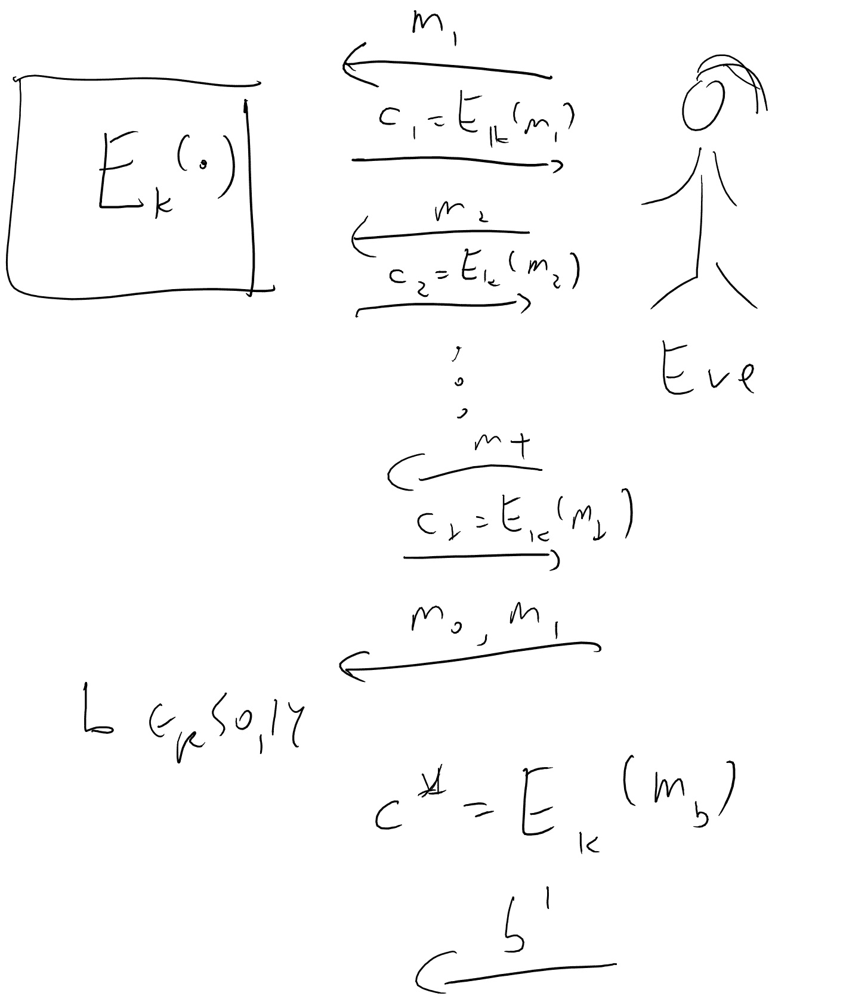

5.7：在 CPA 游戏中，Eve 与加密预言机交互，并在最后选择 \(m_0,m_1\)，获取加密 \(c^*=E_k(m_b)\) 并输出 \(b'\)。如果 \(b'=b\)，则她 *获胜*。

定义 5.3 在 图 5.7 中得到说明。我们之前的概念计算安全性（即，定义 2.6）对应于我们跳过上面提到的步骤 3 和 5 的情况。由于步骤 3 和 5 只给了对手更多的权力（因此更有可能获胜），CPA 安全（定义 5.3）比计算安全性（定义 2.6）*更强*，在意义上，每个 CPA 安全加密 \((E,D)\) 也是计算安全的。实际上，CPA 安全是*严格更强*的，在意义上，如果没有修改，我们的流密码不能是 CPA 安全的。事实上，我们有一个更强，并且最初有些令人惊讶的定理：

没有 CPA 安全 \((E,D)\) 其中 \(E\) 是 *确定性* 的。

证明非常简单：Eve 将只与 \(E\) 交互一轮，她将请求加密 \(c_1\) 为 \(0^\ell\)。在第二轮中，Eve 将选择 \(m_0=0^{\ell}\) 和 \(m_1=1^{\ell}\)，并获取 \(c^*=E_k(m_b)\)，然后她将输出 \(0\) 当且仅当 \(c^*=c_1\)。

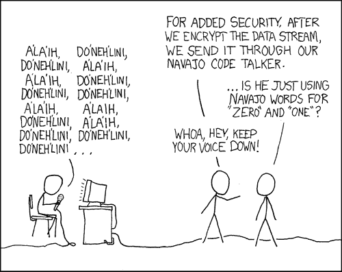

5.8：确定性加密的不安全性

这个证明如此简单，你可能会认为它显示了定义上的问题，但实际上这是一个真正的安全问题。如果你加密了许多消息，其中一些消息重复出现，通过观察重复模式（再次召唤 XKCD 漫画，见图 5.8），你可能会获得重要信息。为了避免这个问题，我们需要使用 *随机化*（或 *概率性*）加密，这样如果我们加密相同的消息两次，我们 *不会* 看到相同的密文副本。2 但我们如何做到这一点呢？在这里，伪随机函数就派上用场了：

假设 \(\{ f_s \}\) 是一个 PRF 集合，其中 \(f_s:\{0,1\}^n\rightarrow\{0,1\}^\ell\)，那么以下是一个 CPA 安全加密方案：\(E_s(m)=(r,f_s(r)\oplus m)\)，其中 \(r \leftarrow_R \{0,1\}^n\)，并且 \(D_s(r,z)=f_s(r)\oplus z\)。

我留给你们去验证 \(D_s(E_s(m))=m\)。我们需要展示 CPA 安全属性。正如在基于 PRF 构造中通常所做的那样，我们首先展示如果 \(f_s\) 是一个真正的随机函数，这个方案将是安全的，然后利用这一点来推导安全性。

考虑当使用完全随机函数玩游戏时上述游戏，并让 \(r_i\) 是 \(E\) 在第 \(i\) 轮选择的随机字符串，\(r^*\) 是最后一轮选择的字符串。我们从一个简单但至关重要的断言开始：

**断言：** 对于某个 \(i\)，\(r^*=r_i\) 的概率至多为 \(T/2^n\)。

**断言的证明：** 对于任何特定的 \(i\)，由于 \(r^*\) 是独立于 \(r_i\) 选择的，\(r^*=r_i\) 的概率是 \(2^{-n}\)。因此，根据并集原理，断言成立。QED

基于此断言，我们知道以概率 \(1-T/2^n\)（这是 \(1-negl(n)\)），字符串 \(r^*\) 与之前选择的任何字符串都不同。这意味着根据懒惰评估原则，如果 \(f_s(\cdot)\) 是一个完全随机的函数，那么 \(f_s(r^*)\) 的值可以被认为是最终回合中独立于之前发生任何事情随机选择的。但是，\(f_s(r^*)\oplus m_b\) 等于简单地使用一次性密码加密 \(m_b\)。也就是说，分布 \(f_s(r^*)\oplus m_0\) 和 \(f_s(r^*)\oplus m_1\)（我们将 \(r^*,m_0,m_1\) 视为固定，随机性来自随机函数 \(f_s(\cdot)\) 的选择）都是 \(\{0,1\}^n\) 上的均匀分布 \(U_n\)，因此伊娃对 \(b\) 完全没有任何信息。

这表明如果 \(f_s(\cdot)\) 是一个随机函数，那么伊娃（Eve）赢得游戏的概率最多为 \(1/2\)。现在如果我们有一个高效的伊娃，以至少 \(1/2+\epsilon\) 的概率赢得游戏，那么我们可以构建一个针对 PRF 的对手 \(A\)，该对手将以黑盒方式访问 \(f_s(\cdot)\) 并输出 \(1\)，当且仅当伊娃赢得游戏。根据上述论点，当 \(f_s(\cdot)\) 是随机的和伪随机的时，输出 \(1\) 的概率至少相差 \(\epsilon\)，从而与 PRF 的安全属性相矛盾。

## 假随机排列/分组密码

现在我们有了伪随机函数，我们可能会变得贪婪，想要具有更多神奇特性的函数。这就是假随机排列概念出现的地方。

::: {.definition title=“假随机排列” #PRPdef} 设 \(\ell:\N \rightarrow \N\) 是某个多项式界定的函数（即，存在某些 \(0<c<C\) 使得对于每个 \(n\)，有 \(n^c < \ell(n) < n^C\)）。如果函数集合 \(\{ f_s \}\) 中 \(f_s:\{0,1\}^{\ell} \rightarrow\{0,1\}^{\ell}\) 对于 \(\ell=\ell(|s|)\) 被称为假随机排列（PRP）集合，则：

1.  它是一个假随机函数集合（即，映射 \(s,x \mapsto f_s(x)\) 可以高效计算，并且没有有效的区分器可以区分 \(f_s(\cdot)\) 在随机 \(s\) 和随机函数之间的差异）。

1.  每个函数 \(f_s\) 是 \(\{0,1\}^\ell\) 的排列（即，一对一且到映射）。

1.  存在一个高效的算法，在输入 \(s,y\) 时返回 \(f_s^{-1}(y)\)。参数 \(n\) 被称为假随机排列集合的 *密钥长度*，参数 \(\ell=\ell(n)\) 被称为 *输入长度* 或 *块长度*。通常，\(\ell=n\)，因此在大多数情况下可以安全地忽略这种区别。

初看起来 ?? ?? 可能似乎没有意义，因为一方面它要求映射 \(x \mapsto f_s(x)\) 是一个排列，但另一方面可以证明，以高概率，一个随机的映射 \(H:\{0,1\}^\ell \rightarrow \{0,1\}^\ell\) 将 *不是* 一个排列。那么这样的集合如何是伪随机的呢？关键洞察是，虽然一个随机的映射可能不是一个排列，但使用多项式数量的查询无法区分一个计算随机函数的黑色盒子和一个计算随机排列的黑色盒子。理解为什么是这样，以及这为什么意味着 ?? ?? 是合理的，对于理解这一概念至关重要，因此我建议你现在暂停并确保你理解这些要点。

就像通常对于一个新的概念，我们想知道是否能够实现它，以及它是否有用。前者由以下定理确立：

如果 PRF 猜想成立（并且因此根据定理 5.1 如果 PRG 猜想也成立），那么存在一个伪随机排列集合。

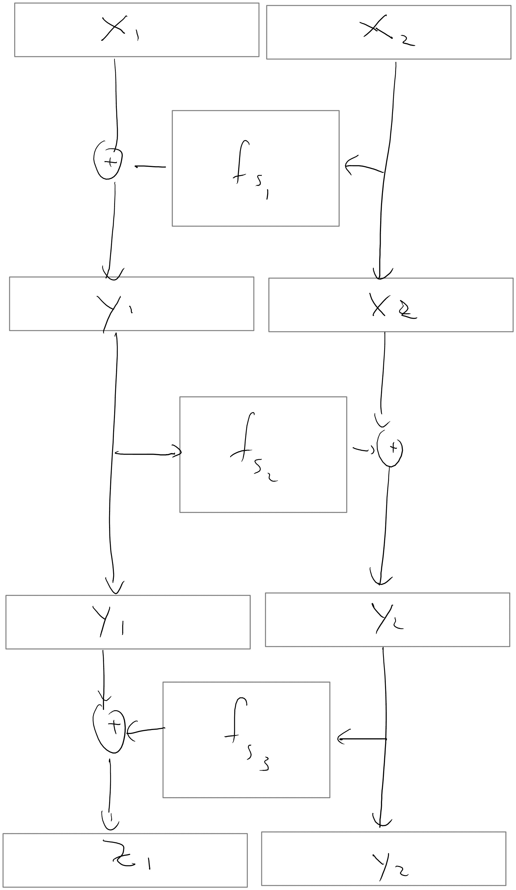

5.9：我们通过让 \(p_{s_1,s_2,s_3}(x_1,x_2)=(z_1,y_2)\) 来构建一个基于 \(n\) 位比特的三个 PRF \(f_{s_1},f_{s_2},f_{s_3}\) 的 PRP \(p\)，其中 \(y_1 = x_1 \oplus f_{s_1}(x_2)\)，\(y_2 = x_2 \oplus f_{s_2}(y_1)\) 以及 \(z_1 = f_{s_3}(y_2) \oplus y_1\)。

图 5.9 展示了从伪随机函数构造伪随机排列的过程。该构造（称为 Luby-Rackoff 构造）使用了几轮所谓的[Feistel 变换](https://en.wikipedia.org/wiki/Feistel_cipher)，该变换将一个函数 \(f:\{0,1\}^n \rightarrow \{0,1\}^n\) 映射到一个排列 \(g:\{0,1\}^{2n} \rightarrow \{0,1\}^{2n}\)，使用映射 \((x,y) \mapsto (x,f(x) \oplus y)\)。

具体来说，给定一个具有 \(n\) 位密钥、输入和输出的 PRF 族 \(\{f_s\}\)，我们的候选 PRP 族将被称为 \(\{p_{s_1,s_2,s_3}\}\)。在这里，\(p_{s_1,s_2, s_3}:\{0,1\}^{2n} \to \{0,1\}^{2n}\) 在输入 \((x_1, x_2) \in \{0,1\}^{2n}\) 上计算如下（参见图 5.9）：

+   首先，将 \((x_1, x_2) \mapsto (y_1, x_2)\) 映射，其中 \(y_1 = x_1 \oplus f_{s_1}(x_2)\)。

+   接下来，将 \((y_1, x_2) \mapsto (y_1, y_2)\) 映射，其中 \(y_2 = x_2 \oplus f_{s_2}(y_1)\)。

+   接下来，将 \((y_1, y_2) \mapsto (z_1, y_2)\) 映射，其中 \(z_1 = y_1 \oplus f_{s_3}(y_2)\)。

+   最后，输出 \(p_{s_1,s_2,s_3}(x_1,x_2) = (z_1, y_2)\)。

上述前三个步骤对应于 Feistel 变换的单轮，这很容易看出既可高效计算又可高效逆变换。实际上，我们可以通过以相反的顺序运行上述三个 Feistel 变换轮次，高效地计算任意字符串 \((z_1,y_2) \in \{0,1\}^{2n}\) 的 \(p_{s_1,s_2,s_3}^{-1}(z_1, y_2)\)。

因此，证明定理 5.6 的真正挑战不在于证明\(\{p_{s_1,s_2,s_3}\}\)是一个有效的排列，而在于证明它是*pseudorandom*。这个证明的剩余部分相当技术性，在第一次阅读时可以安全地跳过。

直观地说，论证过程是这样的。考虑一个针对\(p_{s_1,s_2,s_3}\)的预言机\(\mathcal{O}\)，它通过执行上述三个 Feistel 变换并输出\((z_1, y_2)\)来回答对手的查询\((x_1, x_2)\)。首先，我们将证明，在所有查询过程中，\(\mathcal{O}\)几乎不会两次遇到相同的中间字符串\(y_1\)（除非对手进行了重复查询）。由于字符串\(y_1\)是在第一步计算出来的，它决定了第二步中\(f_{s_2}\)评估的输入，因此可以推断出第二步中计算出的字符串\(y_2\)看起来是独立且随机选择的。特别是，*它们*也将以高概率成对区分。由于字符串\(y_2\)随后作为输入传递给第三步中的\(f_{s_3}\)，因此可以推断出在整个查询过程中遇到的字符串\(z_1\)看起来也是独立且随机选择的。最终，这意味着预言机的输出\((z_1, y_2)\)将看起来像是全新的独立随机字符串。

为了使这个推理更精确，首先注意到，建立\(p_{s_1,s_2,s_3}\)的一个*变体*的安全性就足够了，在这个变体中，构建中使用的伪随机函数\(f_{s_1}\)、\(f_{s_2}\)和\(f_{s_3}\)被替换为真正的随机函数\(h_1,h_2,h_3 : \{0,1\}^n \to \{0,1\}^n\)。称这个变体为\(p_{h_1,h_2,h_3}\)。实际上，\(\{f_s\}\)是 PRF 集合的假设告诉我们，进行这种改变对具有\(p\)预言机访问权的对手的输出只有微不足道的影响。考虑到这一点，我们的任务是证明对于每个有效的对手\(A\)，差异\(|\Pr[A^{p_{h_1,h_2,h_3}(\cdot)}(1^n)=1] - \Pr[A^{H(\cdot)}(1^n)=1]|\)是微不足道的。在这个表达式中，第一个概率是在 Feistel 变换中使用的随机函数\(h_1,h_2,h_3 :\{0,1\}^n \to \{0,1\}^n\)的选择上取的，第二个概率是在随机函数\(H : \{0,1\}^{2n} \to \{0,1\}^{2n}\)上取的。为了简化问题，假设没有损失一般性，\(A\)总是对其预言机进行\(q(n)\)个*不同*的查询，表示为\((x_1^{(1)}, x_2^{(1)}), \ldots, (x_1^{(q(n))}, x_2^{(q(n))})\)的顺序。同样，让\(y_1^{(i)}, y_2^{(i)}, z_1^{(i)}\)表示在三个 Feistel 变换的三个回合中计算出的中间字符串。在这里，\(q\)是\(n\)的多项式。

考虑一个情况，其中攻击者 \(A\) 正在与 \(p_{h_1,h_2,h_3}\) 的预言机交互，而不是与随机预言机交互。让我们说，如果对于某个 \(1 \le i < j \le q(n)\)，在回答 \(A\) 的第 \(i\) 个查询时计算出的字符串 \(y_1^{(i)}\) 与在回答 \(A\) 的第 \(j\) 个查询时计算出的字符串 \(y_1^{(j)}\) 相同，那么在 \(y_1\) 处发生了碰撞。我们声称在 \(y_1\) 处发生碰撞的概率极小。确实，如果在 \(y_1\) 处发生了碰撞，那么对于某个 \(i \neq j\)，\(y_1^{(i)} = y_1^{(j)}\)。根据 \(p_{h_1,h_2,h_3}\) 的构造，这意味着 \(x_1^{(i)} \oplus h_1(x_2^{(i)}) = x_1^{(j)} \oplus h_1(x_2^{(j)})\)。特别是，不可能出现 \(x_1^{(i)} \neq x_1^{(j)}\) 和 \(x_2^{(i)} = x_2^{(j)}\) 的情况。由于我们假设 \(A\) 向其预言机提出不同的查询，因此可以得出 \(x_2^{(i)} \neq x_2^{(j)}\)，从而 \(h_1(x_2^{(i)})\) 和 \(h_1(x_2^{(j)})\) 是均匀且独立的。换句话说，\(\Pr[y_1^{(i)} = y_1^{(j)}] = \Pr[x_1^{(i)} \oplus f_1(x_2^{(i)}) = x_1^{(j)} \oplus f_1(x_2^{(j)})] = 2^{-n}\)。对所有 \(i\) 和 \(j\) 的选择取并集，我们看到在 \(y_1\) 处发生碰撞的概率最多是 \(q(n)²/2^n\)，这是一个可以忽略不计的概率。

接下来，定义一个在 \(y_2\) 处的 *碰撞*，通过一对查询 \(1 \le i < j \le q(n)\) 使得 \(y_2^{(i)} = y_2^{(j)}\)。我们论证，在 \(y_1\) 处没有发生碰撞的极有可能事件的前提下，\(y_2\) 处发生碰撞的概率也是可以忽略不计的。确实，如果对于所有 \(i \neq j\)，\(y_1^{(i)} \neq y_1^{(j)}\)，那么 \(h_2(y_1^{(1)}), \ldots, h_2(y_1^{(q(n))})\) 是独立且均匀随机分布的。特别是，我们有 \(\Pr[y_2^{(i)} = y_2^{(j)} \mid \text{no collision at }y_1] = 2^{-n}\)，即使在所有 \(i\) 和 \(j\) 上取并集后，这个概率也是可以忽略不计的。将同样的论证应用于 Feistel 变换的 *第三轮*，同样可以表明，在 \(y_1\) 或 \(y_2\) 处没有发生碰撞的极有可能事件的前提下，\(z_1^{(1)}, \ldots, z_1^{(i)}\) 对于 \(1 \le i \le q(n)\) 也是作为新鲜、独立、随机字符串分布的。到此为止，我们已经表明，攻击者无法区分 \(p_{h_1,h_2,h_3}\) 的预言机输出的 \((z_1^{(1)}, y_2^{(1)}), \ldots, (z_1^{(q(n))}, y_2^{(q(n))})\) 与随机预言机输出的区别，除非发生一个概率极小的事件。我们得出结论，集合 \(\{p_{h_1,h_2,h_3}\}\)，因此我们的原始集合 \(\{p_{s_1,s_2,s_3}\}\)，是一个安全的 PRP 集合。

关于这个证明的更多细节，请参阅 Boneh Shoup 的第 4.5 节或 Katz-Lindell 的第 8.6 节（第 2 版的第 7.6 节），其证明被用作我们证明的模型。

在定理 5.6 的证明中构建的构造通过执行 3 轮已知的 PRF \(f\) 的 Feistel 变换来构建一个 PRP \(p\)。尝试证明仅进行 1 轮或 2 轮的 Feistel 变换*不足以*达到 PRP 是一个有趣的练习。*提示：考虑一个对手，它会对形式为 \((x_1, x_2)\) 的查询进行询问，其中 \(x_2\) 保持不变，而 \(x_1\) 是变化的。*

混乱置换的更常见名称是*块加密*（尽管通常期望块加密除了是 PRP 之外还要满足额外的安全属性）。实际使用的块加密构造并不遵循定理 5.6 的构造（尽管它们使用了其中的一些想法），而是具有更随意的性质。

现代块加密算法之一是 IBM 在 20 世纪 70 年代构建的[数据加密标准（DES）](https://goo.gl/XiCvjs)。它是一个相当好的加密算法——直到今天，据我们所知，与密钥长度相比，它提供了相当多的安全位。问题是它的密钥长度只有\(56\)位，这在现代计算能力之外已经不再安全。（结果证明，DES 的微妙变体安全性更低，容易受到称为[差分密码分析](https://goo.gl/GAvbh8)的技术的影响；DES 的 IBM 设计者知道这种技术，但在 NSA 的要求下保密。）

在 1997 年至 2001 年期间，美国国家标准与技术研究院（NIST）举办了一场竞赛，以取代 DES，最终采用了块加密算法 Rijndael 作为新的[高级加密标准（AES）](https://goo.gl/1HnqFb)。它具有 128 位的块大小（即输入长度）和 128 位、196 位或 256 位的密钥大小（即种子长度）。

AES（或 DES）的实际构造并不非常具有启发性，但让我们简单谈谈许多分组密码背后的通用原则。它们通常是通过重复一系列非常简单的排列来构建的（见图 5.10）。每次这样的迭代被称为一个 *轮*。如果有 \(t\) 轮，那么密钥 \(k\) 通常通过某种称为 *密钥调度算法* 的伪随机生成器扩展成一个更长的字符串，我们将其视为一个字符串的 \(t\) 元组 \((k_1,\ldots,k_t)\)。元组中的第 \(i\) 个字符串被称为 *轮密钥*，并在第 \(i\) 轮中使用。每一轮通常由几个组件组成：有一个“密钥混合组件”执行基于密钥的某些简单排列（通常只是简单地异或密钥），有一个“混合组件”混合块的位，使得最初靠近的位不会保持在一起，然后还有一个非线性的组件（通常通过将一些称为“S 盒”的简单非线性函数应用于输入的小块来获得），以确保整个加密器不会是一个仿射函数。这些操作中的每一个都是容易逆操作的，因此解密加密器只需反向运行轮次。

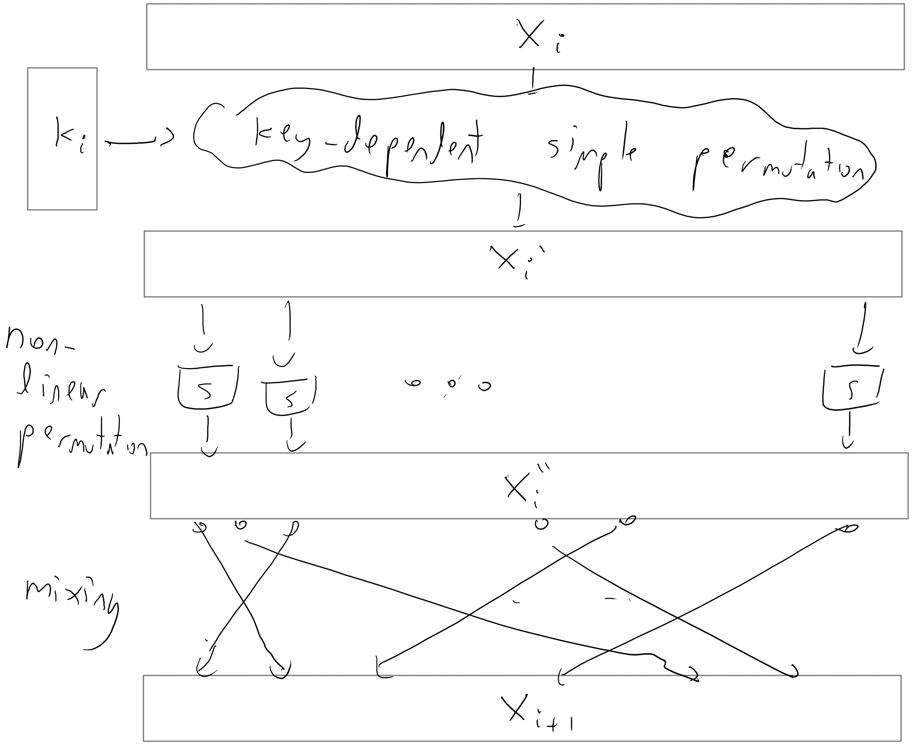

5.10：一个分组密码的典型轮次，\(k_i\) 是第 \(i\) 轮的密钥，\(x_i\) 是第 \(i\) 轮之前的块，\(x_{i+1}\) 是本轮结束时的块。

## 加密模式

我们如何使用分组密码实际加密流量？嗯，我们可以在上述构造中使用它作为 PRF，但在实践中，人们使用其他方法。3

最自然的方法是加密消息 \(m\)，我们只需简单地使用 \(p_s(m)\)，其中 \(\{ p_s \}\) 是 PRP/分组密码。这被称为分组密码的 *电子密码本（ECB）模式*（见图 5.11）。请注意，我们可以轻松解密，因为我们能计算 \(p_s^{-1}(m)\)。如果 PRP \(\{p_s\}\) 只接受固定长度的输入 \(\ell\)，我们可以通过将 \(m = (m_1, m_2, \ldots, m_t)\) 写出来，其中每个块 \(m_i\) 的长度为 \(\ell\)，然后单独加密每个块 \(m_i\) 来使用 ECB 模式加密长度为 \(\ell\) 的倍数的消息 \(m\)。这种加密方案输出的密文是 \((p_s(m_1), \ldots, p_s(m_t))\)。ECB 模式的一个主要缺点是它是一个 *确定性* 加密方案，因此不能是 CPA 安全的。此外，这实际上是在现实输入上的一个真实安全问题（见图 5.12），因此 ECB 模式绝不应该使用。

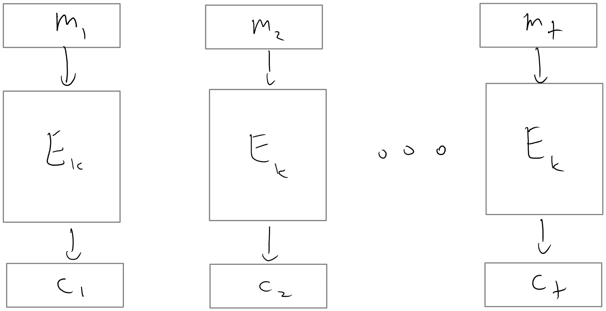

5.11：在电子密码本（ECB）模式下，每条消息都是确定性和独立地加密的

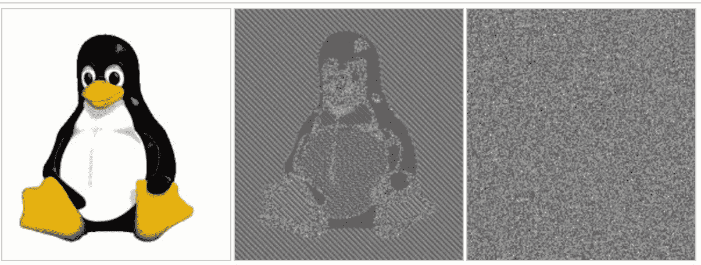

5.12：使用 ECB 模式（中间图像）和 CBC 模式（右侧图像）加密 Linux 企鹅（左侧图像）。ECB 加密是不安全的，因为它揭示了原始图像的许多结构。图片来自维基百科。

使用分组密码加密的一种更安全的方式是**密码块链（CBC）模式**。密码块链的思想是顺序地加密消息的块 \(m = (m_1, \ldots, m_t)\)。为了加密第一个块 \(m_1\)，我们在应用分组密码 \(p_s\) 之前，将 \(m_1\) 与一个称为**初始化向量**的随机字符串进行异或运算，或称为 \(\ensuremath{\mathit{IV}}\)。为了加密后续的某个块 \(m_i\)，其中 \(i > 1\)，我们在应用分组密码 \(p_s\) 之前，将 \(m_i\) 与 \(m_{i-1}\) 的**加密**进行异或运算。形式上，密文由元组 \((\ensuremath{\mathit{IV}}, c_1, \ldots, c_t)\) 组成，其中 \(\ensuremath{\mathit{IV}}\) 是随机均匀选择的，且 \(c_i = p_s(c_{i-1} \oplus m_i)\) 对于 \(1 \le i \le t\)（我们使用约定 \(c_0 = \ensuremath{\mathit{IV}}\)）。这个加密过程在图 5.13 中展示。为了解密 \((\ensuremath{\mathit{IV}}, c_1, \ldots, c_t)\)，我们只需计算 \(m_i = p_s^{-1}(c_i) \oplus c_{i-1}\) 对于 \(1 \le i \le t\)。注意，如果我们失去了 CBC 模式中的块 \(c_i\)，那么我们就无法解密下一个块 \(c_{i+1}\)，但我们可以从那个点开始恢复。

一方面，CBC 模式在安全性上远优于简单的电子密码本，因为带有随机 \(\ensuremath{\mathit{IV}}\) 的 CBC 模式是 CPA 安全的（证明这一点是一个极好的练习）。另一方面，CBC 模式存在一个缺点，即加密过程不能并行化：密文块 \(c_i\) **必须**在 \(c_{i+1}\) 之前计算。

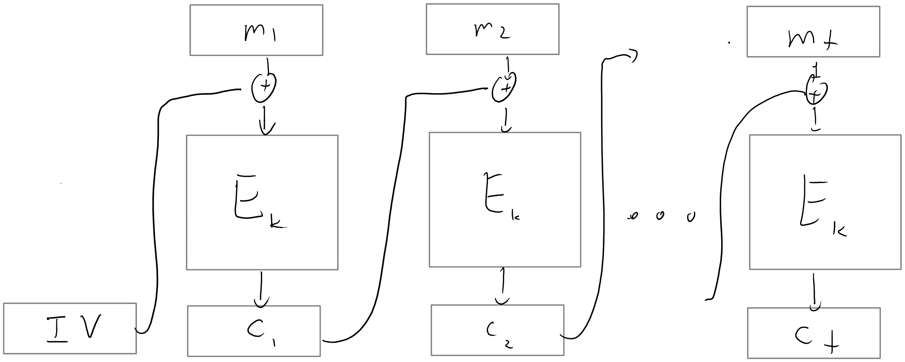

5.13：在密码块链（CBC）中，在加密当前消息之前，将前一条消息的加密与当前消息进行异或运算。第一条消息与一个**初始化向量**（IV）进行异或运算，如果随机选择，则确保 CPA 安全性。

在*输出反馈（OFB）模式*中，我们首先使用 CBC 模式加密全零字符串，以获得一个伪随机输出序列 \((y_1,y_2,\ldots)\)，我们可以将其用作流密码。为了传输消息 \(m \in \{0,1\}^*\)，我们发送 \(m\) 与流密码输出的比特的异或，以及用于生成序列的 \(\ensuremath{\mathit{IV}}\)。接收者可以通过首先使用 \(\ensuremath{\mathit{IV}}\) 恢复 \((y_1, y_2, \ldots)\)，然后取 \(c\) 与该序列中适当数量的比特的异或来解密密文 \((\ensuremath{\mathit{IV}}, c)\)。与 CBC 模式一样，当 \(\ensuremath{\mathit{IV}}\) 随机选择时，OFB 模式是 CPA 安全的。与 CBC 模式相比，OFB 模式的一些优点包括发送者可以在要加密的消息已知之前很久就预先计算序列 \((y_1, y_2, \ldots)\)，以及用于生成 \((y_1, y_2, \ldots)\) 的底层函数 \(p_s\) 只需要是一个 PRF（不一定是 PRP）。

可能最简单的操作模式是*计数（CTR）模式*，其中我们通过使用流 \(p_s(\ensuremath{\mathit{IV}}),p_s(\ensuremath{\mathit{IV}}+1),p_s(\ensuremath{\mathit{IV}}+2),\ldots\) 将块加密转换为流密码，其中 \(\ensuremath{\mathit{IV}}\) 是 \(\{0,1\}^n\) 中的一个随机字符串，我们将其识别为 \([2^n]\)（并执行模 \(2^n\) 的加法）。也就是说，为了加密消息 \(m = (m_1, \ldots, m_t)\)，我们随机选择 \(\ensuremath{\mathit{IV}}\)，并输出 \((\ensuremath{\mathit{IV}}, c_1, \ldots, c_t)\)，其中 \(c_i = p_s(\ensuremath{\mathit{IV}} + i) \oplus m_i\) 对于 \(1 \le i \le t\)。解密操作类似。对于现代块加密，CTR 模式与 CBC 或 OFB 模式一样安全，实际上还提供了几个优点。例如，CTR 模式可以轻松并行加密和解密块，而 CBC 模式则不行。此外，CTR 模式只需要评估 \(p_s\) 一次即可解密密文中的任何单个块，而 OFB 模式则不行。

对不同块加密模式的全面研究可以在[罗加韦的这篇文档](http://web.cs.ucdavis.edu/~rogaway/papers/modes.pdf)中找到。他的结论是，如果我们仅仅考虑 CPA 安全性（而不是我们在下一讲中将要看到的更强的*选择密文安全性*概念），那么计数模式是最好的选择，但由于历史原因，CBC、OFB 和 CFB 模式被广泛实现。ECB 不应该使用（除非作为构建更强安全性的构造的一部分）。

## 可选，旁白：广播加密

在本章的开头，我们看到了定理 5.1 的证明，该定理表明 PRG 猜想意味着存在一个安全的 PRF 集合。这个证明的核心是一个相当巧妙的基于二叉树的构造。实际上，类似的树构造已经被反复用于解决密码学中的许多其他问题。在本节中，我们将讨论这些树构造的一个应用，即**广播加密**。

让我们设身处地，想象一下好莱坞高管面临的以下问题：我们刚刚发布了一部新电影（以下载或蓝光光盘的形式），我们希望防止它被盗版。一方面，购买了电影副本的消费者应该能够在某些经过批准的独立设备上观看，例如电视和蓝光播放器，而无需外部互联网连接。另一方面，为了最大限度地减少盗版风险，这些消费者**不应**访问电影数据本身。

保护电影数据的一种方法，我们将它建模为一个字符串 \(x\)，就是向消费者提供数据的加密 \(E_k(x)\)。尽管用于加密数据的密钥 \(k\) 对消费者是隐藏的，但它被提供给设备制造商，以便他们以某种安全、防篡改的方式将其嵌入他们的电视和蓝光播放器中。只要密钥 \(k\) 从不泄露给公众，这个系统就能确保只有经过批准的设备才能解密并播放消费者的电影副本。因此，我们有时将 \(k\) 称为**设备密钥**。这种设置在图 5.14 中有所描述。

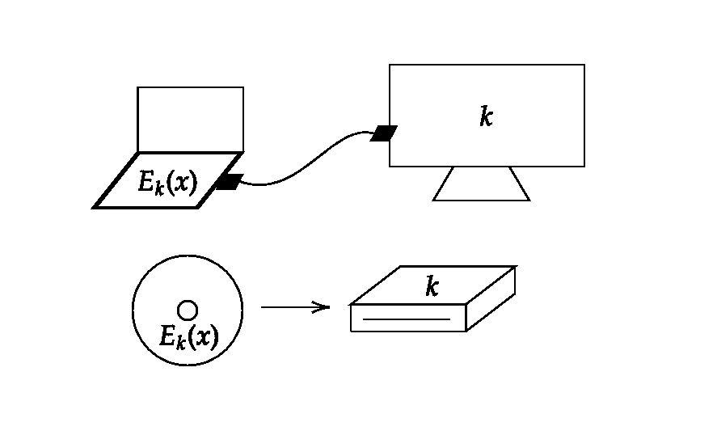

5.14: 广播加密的问题设置。

不幸的是，如果我们严格按照这个方案实施，它几乎肯定会在几天内被破解。毕竟，一旦即使只有一个设备被黑客攻击，设备密钥 \(k\) 就会被泄露。这将允许公众访问我们的电影数据，以及我们为这些设备发布的所有未来电影的**数据**！这个后果是我们当然希望避免的，而要避免它就需要有**可撤销**密钥的概念：

对于我们的目的，一个**广播加密方案**由以下内容组成：

+   一组 \(m\) 个不同的设备（或设备制造商），每个设备都可以访问 \(n\) 位的设备密钥之一 \(k_1, \ldots, k_m\)。

+   一种解密算法 \(D\)，它接收输入密文 \(y\) 和密钥 \(k_i\)。

+   一种加密算法 \(E\)，它接收输入明文 \(x\)、密钥 \(k_{master}\) 和一个不再被信任的设备（或设备制造商）的*撤销集* \(R \subseteq [m]\)。

直观地说，如果 \(D_{k_i}\) 能够在 \(i \notin R\) 时从 \(E_{k_{master}, R}(x)\) 成功恢复 \(x\)，但在 \(i \in R\) 时无法做到，那么广播加密方案是安全的。在我们的电影盗版示例中，这样的加密方案将允许我们在发现某些设备密钥 \(k_i\) 泄露时**撤销**这些设备密钥。要撤销密钥 \(k_i\)，我们只需在加密所有未来的电影时包含 \(i \in R\)。这样做可以防止 \(k_i\) 被用来解密这些电影。关键的是，撤销被黑设备 \(i\) 的密钥 \(k_i\) 并不会阻止安全设备 \(j \neq i\) 继续解密未来的电影发布；这正是我们系统所希望的。

为了简洁起见，我们**不会**提供广播加密方案安全性的正式定义，尽管这可以并且已经做到了。相反，在本节的剩余部分，我们将描述几个广播加密方案的例子，其中一个巧妙地使用了树构建，正如所承诺的那样。

广播加密方案的最简单构建涉及让 \(k_{master} = (k_1, \ldots, k_m)\) 成为所有设备密钥的集合，并让 \(E_{k_{master}, R}(x)\) 成为所有不在 \(R\) 中的 \(i\) 的安全加密 \(E_{k_i}(x)\) 的连接。设备 \(i\) 通过查找密文的相关子串 \(E_{k_i}(x)\) 并用 \(k_i\) 解密它来进行解密。直观地说，在这个方案中，如果 \(x\) 代表我们的电影数据，并且有 \(m \approx\) 一百万个设备，那么 \(E_{k_{master}, R}(x)\) 只是电影（每个设备密钥一个）的加密。撤销密钥 \(k_i\) 等于只加密所有未来电影的 \(999,999\) 份副本，这样设备 \(i\) 就不能再进行解密了。

显然，这个简单的广播加密问题解决方案有两个严重的不效率：主密钥的长度是 \(O(nm)\)，每个加密的长度是 \(O(|x|m)\)。解决前一个问题的一种方法是用**密钥派生函数**。也就是说，我们可以通过选择一个固定的 PRF 集合 \(\{f_k\}\) 来缩短主密钥，并按照规则 \(k_i = f_{k_{master}}(i)\) 计算每个设备密钥 \(k_i\)。后一个问题可以使用称为**混合加密**的技术来解决。在混合加密中，我们首先选择一个临时的密钥 \(\hat k \leftarrow_R \{0,1\}^n\)，使用不在 \(R\) 中的每个设备密钥 \(k_i\) 加密 \(\hat k\)，然后输出这些字符串的连接 \(E_{k_i}(\hat k)\)，以及使用临时密钥对电影进行**单个**加密 \(E_{\hat k}(x)\)。结合这两个优化措施，将 \(k_{master}\) 的长度减少到 \(O(n)\)，每个加密的长度减少到 \(O(nm + |x|)\)。

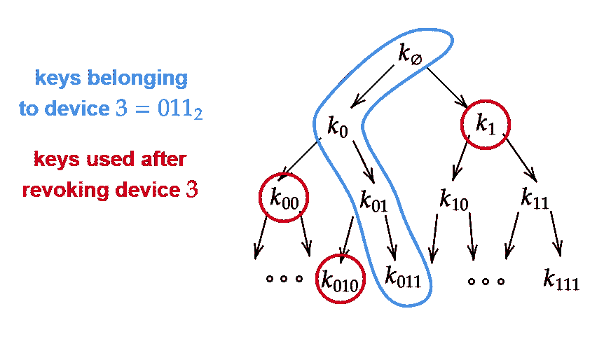

5.15: 基于树的具有可撤销密钥的广播加密构建。

事实上，我们可以通过考虑一个**密钥树**（见图 5.15）来构造一个具有更短密文的多播加密方案。这个树的根被标记为 \(k_{\varnothing}\)，其子节点是 \(k_0\) 和 \(k_1\)，它们的子节点是 \(k_{00}, k_{01}, k_{10}, k_{11}\)，依此类推。树的深度是 \(\log_2 m\)，树中每个密钥的值是随机均匀决定的，或者通过将一个字符串 \(k_{master}\) 应用到密钥派生函数来决定。每个设备 \(i\) 接收从根到第 \(i\) 个叶子的**所有**密钥。例如，如果 \(m=8\)，那么设备 \(011\) 接收密钥 \(k_{\varnothing}, k_0, k_{01}, k_{011}\)。

要加密消息 \(x\)，我们执行以下步骤：最初，当没有密钥被撤销时，我们使用一个临时的密钥 \(\hat k\)（如上所述）来加密 \(x\)，并用单个设备密钥 \(k_\varnothing\) 来加密 \(\hat k\)。这是足够的，因为所有设备都可以访问 \(k_\varnothing\)。为了将一个被黑掉的设备 \(i\) 添加到撤销集中，我们丢弃属于设备 \(i\) 的所有 \(\log_2 m\) 个密钥，这些密钥构成了树中从根到叶子的路径。我们不会使用这些密钥，而是确保使用这条路径上顶点的**兄弟**来加密所有未来的 \(\hat k\)。这样做可以确保（1）设备 \(i\) 无法再解密安全内容，并且（2）每个设备 \(j \neq i\) 可以继续使用至少一个从根到第 \(j\) 个叶子的路径上的密钥来解密内容。在这个方案中，密文的总长度仅为 \(O(n|R| \log_2 m + |x|)\) 比特，其中 \(|R|\) 是迄今为止被撤销的设备数量。当 \(|R|\) 很小时，这个界限比我们之前在没有基于树的结构的情况下所达到的界限要好得多。

## 阅读理解练习

我建议学生在阅读讲座后做以下练习。它们并不涵盖所有材料，但可以是一个检查你理解的好方法。

设 \((E,D)\) 为我们在第 2 讲中看到的加密方案，其中 \(E_k(m)=G(k)\oplus m\)，其中 \(G(\cdot)\) 是一个伪随机生成器。这个方案是 CPA 安全的吗？

1.  不，它永远不是 CPA 安全的。

1.  它总是 CPA 安全的。

1.  它有时是 CPA 安全的，有时不是，这取决于 PRG \(G\) 的性质

考虑从 PRGs 构造 PRFs 的证明。在数量级上，当在输入 \(i\in \{0,1\}^n\) 上查询时，伪随机函数集合执行了多少次底层伪随机生成器的调用？

1.  \(n\)

1.  \(n²\)

1.  \(1\)

1.  \(2^n\)

在以下内容中，我们将一个分组密码与一个伪随机排列（PRP）集合相对应。以下哪个陈述是正确的：

1.  每个 PRP 集合也是 PRF 集合

1.  每个 PRF 集合也是 PRP 集合

1.  如果 \(\{ f_s \}\) 是一个 PRP 集合，那么加密方案 \(E_s(m)=f_s(m)\) 是一个 CPA 安全的加密方案。

1.  如果\(\{ f_s \}\)是一个 PRF 集合，那么加密方案\(E_s(m)=f_s(m)\)是一个 CPA 安全加密方案。

1.  将密钥作为由\(n\)个\(1'\)组成的序列而不是二进制表示形式提供给 Eve 是密码学中的一种常见记法约定。这没有区别，除了它使得 Eve 的输入长度为\(n\)，这在逻辑上是合理的，因为我们希望允许 Eve 在\(poly(n)\)时间内运行。

    ↩

1.  如果消息保证具有*高熵*，这大致意味着消息重复自身的概率可以忽略不计，那么就可以实现安全的确定性私钥加密，这在实践中有时会被使用。（尽管通常需要添加某种随机化或填充以确保这一属性，因此实际上创建了一种随机加密。）确定性加密有时对于在加密数据库上进行高效查询等应用很有用。参见 Dan Boneh 在 Coursera 课程中的[这个讲座](https://goo.gl/GWJLFd)。

    ↩

1.  部分原因是因为在上面的构造中，我们必须使用长度为\(n\)的明文编码长度为\(2n\)的密文，这意味着通信开销为 100%。

    ↩

## 评论

评论通过[utteranc.es](https://utteranc.es)应用发布在[GitHub 仓库](https://github.com/boazbk/crypto/issues)上。需要 GitHub 登录才能评论。如果您不想授权应用代表您发布，您也可以直接在[GitHub 页面上的 GitHub issue](https://github.com/boazbk/crypto/issues?q=PRFs from PRGs+in%3Atitle)上评论。

编译于 2021 年 11 月 17 日 22:36:33

版权所有 2021，Boaz Barak。

本作品受[Creative Commons Attribution-NonCommercial-NoDerivatives 4.0 International License](https://creativecommons.org/licenses/by-nc-nd/4.0/)许可。

使用[pandoc](https://pandoc.org/)和[panflute](http://scorreia.com/software/panflute/)以及从[gitbook](https://www.gitbook.com/)和[bookdown](https://bookdown.org/)中提取的模板制作。
