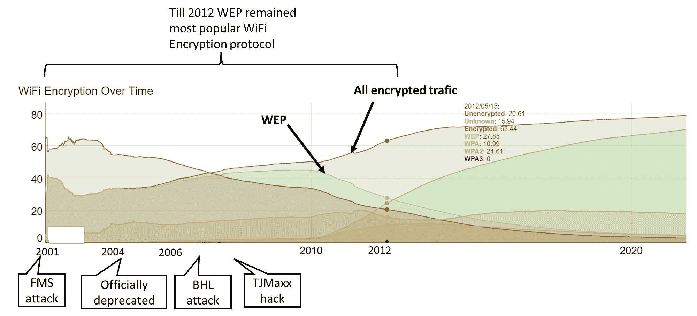
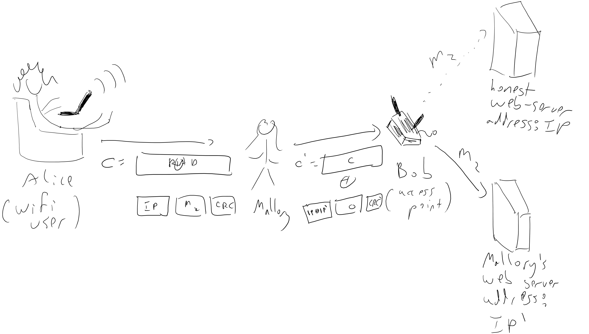
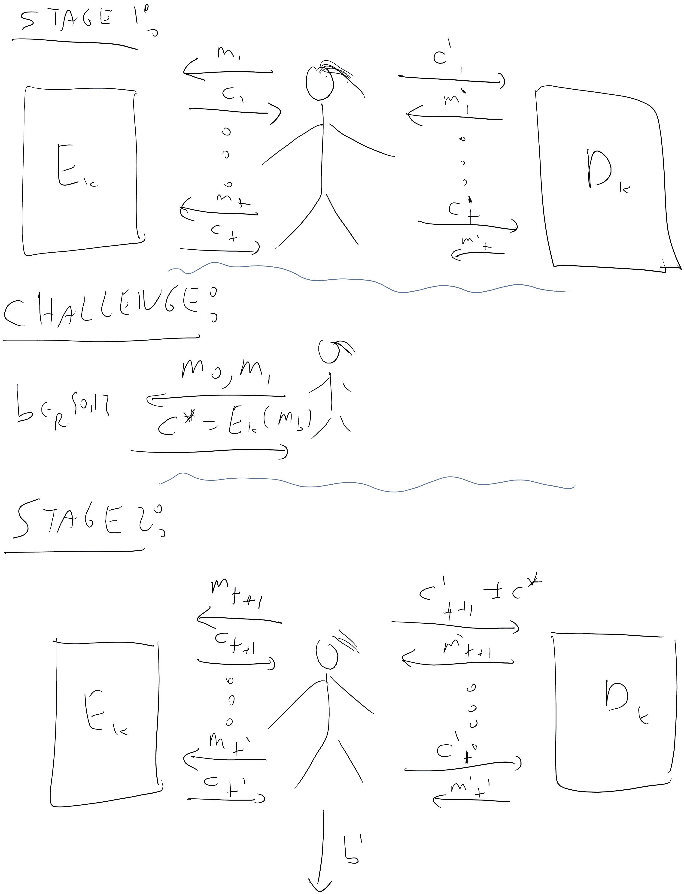
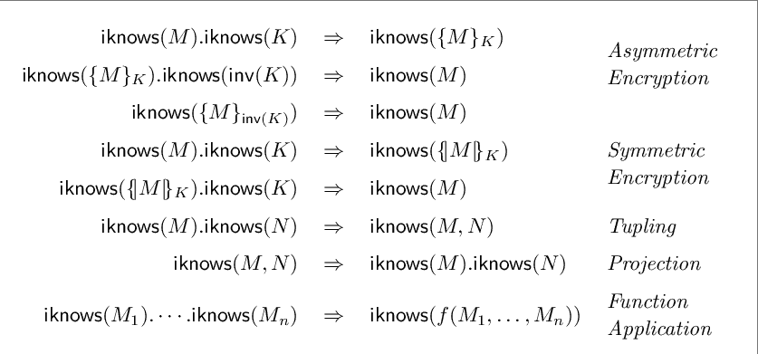

# 选择密文安全性

> 原文：[`intensecrypto.org/public/lec_06_CCA.html`](https://intensecrypto.org/public/lec_06_CCA.html)

**如有任何错误/打字错误/令人困惑的解释？[在 GitHub 上打开一个 issue](https://github.com/boazbk/crypto/issues/new)。您也可以在下面评论*

**★ 另请参阅本章的[**PDF 版本**](https://files.boazbarak.org/crypto/lec_06_CCA.pdf)（更好的格式/参考文献）★

## 简短回顾

让我们先回顾一下我们到目前为止学到了什么：

+   我们可以用数学方法定义加密方案的安全性。一个自然的定义是**完美保密**：无论 Eve 做什么，她都无法了解关于明文的信息，这些信息是她之前不知道的。不幸的是，这要求密钥的长度与消息一样长，从而对其实用性造成了严重的限制。

+   为了解决这个问题，我们需要考虑计算方面的考虑。一个基本对象是**伪随机生成器**，我们考虑了**PRG 猜想**，它规定存在一个可高效计算的函数 \(G:\{0,1\}^n\rightarrow\{0,1\}^{n+1}\)，使得 \(G(U_n)\approx U_{n+1}\)（其中 \(U_m\) 表示在 \(\{0,1\}^m\) 上的均匀分布，\(\approx\) 表示计算不可区分）。^(1)

+   我们证明了 PRG 猜想意味着任何多项式输出长度的伪随机生成器，特别是通过流密码构造意味着具有任意大于密钥的明文的计算安全加密。（唯一的限制是明文的尺寸是多项式的，如果我们实际上想要能够读取和写入它，这是必需的。）

+   然后，我们证明了 PRG 猜想实际上意味着一个更强的对象，称为**伪随机函数（PRF）函数集合**：这是一个函数集合 \(\{ f_s \}\)，如果我们随机选择 \(s\) 并固定它，然后给对手一个计算 \(i \mapsto f_s(i)\) 的黑盒，那么她无法区分这个黑盒和计算随机函数的黑盒.^(2)

+   伪随机函数被证明对**身份验证协议**、**消息认证码**以及这种强大的加密安全性概念，即**选择明文攻击（CPA）安全性**很有用，其中我们允许加密 Eve 选择的**许多消息**，同时仍然要求下一个消息隐藏除了 Eve 之前已知的所有信息之外的所有信息。

## 超越 CPA

它可能看起来我们已经最终确定了加密的安全定义。毕竟，还有什么能比允许 Eve 无限制地访问加密函数更强大呢？显然，满足这一属性的加密在所有实际情况下都会隐藏消息的内容。或者，它会吗？

请在此处停下来，播放一个不祥的音轨。

### 示例：有线等效隐私（WEP）

有线等效隐私（Wired Equivalence Privacy，WEP）协议可能是所有协议中最不准确命名的协议之一。它于 1999 年发明，目的是为了保护 Wi-Fi 网络，使其具有与有线网络几乎相同的安全级别，但早在早期就已经指出了一些安全漏洞。特别是在 2001 年，Fluhrer、Mantin 和 Shamir 展示了我们之前讲座中提到的 RC4 漏洞如何可以在不到一分钟内完全破解 WEP。然而，该协议仍然存在，并且在许多年后仍然是使用最广泛的 WiFi 加密协议，因为许多路由器将其作为默认选项。2007 年，WEP 被指责为 T.J. Maxx 窃取了 4500 万张信用卡号码的黑客攻击。2012 年（攻击了 11 年后！），估计它仍然在约四分之一的加密无线网络中使用，2014 年它仍然是许多 Verizon 家庭路由器的默认选项。它仍然（！）在一些路由器中使用，参见图 6.1。这是一个很好的例子，说明了从实际使用中移除不安全协议是多么困难（因此正确制定这些协议是多么重要）。

6.1：根据[Wigle.net](https://wigle.net/stats)随时间推移的 WEP 使用情况。尽管自 2001 年以来已经记录了安全问题，并且自 2004 年以来已正式弃用，但 WEP 直到 2012 年仍然是最受欢迎的 WiFi 加密协议，并且在撰写本文时，它仍然被大量设备使用（尽管请参阅[这个 stackoverflow 答案](https://security.stackexchange.com/a/191076)以获取更多信息）。

在这里，我们将讨论 WEP 的一个不同缺陷，这个缺陷实际上与其他许多协议共享，包括用于保护所有加密网络流量的安全套接字层（SSL）协议的第一个版本。

为了避免不必要的细节，我们将考虑一个高度抽象（并且有些不准确）的 WEP 版本，它仍然可以证明我们的主要观点。在这个协议中，Alice（用户）向 Bob（接入点）发送一个她希望路由到互联网上某个地方的 IP 数据包。

因此，我们可以将爱丽丝发送给鲍勃的消息视为一个形式为 \(m=m_1\|m_2\) 的字符串 \(m\)，其中 \(m_1\) 是需要路由到该数据包的 IP 地址，而 \(m_2\) 是需要传递的实际消息。在 WEP 协议中，爱丽丝发送给鲍勃的消息形式为 \(E_k(m\|\ensuremath{\mathit{CRC}}(m))\)（其中 \(\|\) 表示连接，\(\ensuremath{\mathit{CRC}}(m)\) 是某种[循环冗余校验](https://en.wikipedia.org/wiki/Cyclic_redundancy_check)）。一个 \(\ensuremath{\mathit{CRC}}\) 是将 \(\{0,1\}^n\) 映射到 \(\{0,1\}^t\) 的某个函数，其目的是为了检测输入或通信中的错误。其想法是，如果消息 \(m\) 被误输入为 \(m'\)，那么 \(\ensuremath{\mathit{CRC}}(m) \neq \ensuremath{\mathit{CRC}}(m')\) 的可能性非常高。它与信用卡号码和许多其他情况中使用的[校验位](https://en.wikipedia.org/wiki/Luhn_algorithm)类似。与消息认证码不同，CRC 没有秘密密钥，并且不安全于对抗性扰动。

实际使用的加密 WEP 是 RC4，但对我们来说这并不重要。真正重要的是加密的形式为 \(E_k(m') = pad \oplus m'\)，其中 \(pad\) 是作为密钥的某个函数计算得出的。特别是，我们将描述的攻击即使在我们的更强的基于 PRF 的 CPA 安全方案中也能工作，其中 \(pad=f_k(r)\) 对于某个随机（或计数器）\(r\)，该随机（或计数器）\(r\) 是单独发送的。

现在加密的安全性意味着一个看到密文 \(c=E_k(m\|\ensuremath{\mathit{CRC}}(m))\) 的对手将无法知道 \(m\)，但由于这是在空中传输的，对手可以“伪造”信号并发送不同的密文 \(c'\) 给鲍勃。特别是，如果对手知道爱丽丝使用的 IP 地址 \(m_1\)（例如，例如，对手可以猜测爱丽丝可能是那些定期访问 boazbarak.org 网站数十亿人中的一员），那么她可以将密文与一个她选择的字符串进行异或操作，从而将密文 \(c = pad \oplus (m_1\| m_2 \|\ensuremath{\mathit{CRC}}(m_1,m_2))\) 转换为密文 \(c' = c \oplus x\)，其中 \(x = x_1\|x_2\|x_3\) 是计算出来的，使得 \(x_1 \oplus m_1\) 等于对手自己的 IP 地址！

因此，对手不需要解密消息——通过伪造密文，她可以确保鲍勃（他是一个接入点，其任务是解密并交付数据包）直接将未加密的消息直接交到她手中。一个问题是在 Eve 修改\(m_1\)之后，CRC 代码不太可能仍然通过检查，因此鲍勃会拒绝该数据包。然而，[CRC 32](https://goo.gl/5aqEHB)——WEP 使用的 CRC 算法是**线性**的模\(2\)，即\(\ensuremath{\mathit{CRC}}(x \oplus x') = \ensuremath{\mathit{CRC}}(x)\oplus \ensuremath{\mathit{CRC}}(x')\)。这意味着如果原始密文\(c\)是消息\(m= m_1 \| m_2 \| \ensuremath{\mathit{CRC}}(m_1,m_2)\)的加密，那么\(c'=c \oplus (x_1\|0^t\|\ensuremath{\mathit{CRC}}(x_1\|0^t))\)将是消息\(m'=(m_1 \oplus x_1) \|m_2 \| \ensuremath{\mathit{CRC}}( (x_1\oplus m_1) \| m_2)\)的加密（其中\(0^t\)表示与\(m_2\)相同长度的零字符串，因此\(m_2 \oplus 0^t = m_2\)）。因此，通过异或\(c\)与\(x_1 \|0^t \| \ensuremath{\mathit{CRC}}(x_1\|0^t)\)，对手 Mallory 可以确保鲍勃将消息\(m_2\)交付到她选择的 IP 地址\(m_1 \oplus x_1\)（参见图 6.2）。

6.2：攻击 WEP 协议，允许对手 Mallory 在爱丽丝使用 CPA 安全加密的情况下读取加密消息。

### 选择密文安全性

这不是一个孤立的例子，而是一个在实践协议中许多中断的一般模式的实例。一些通过类似手段破坏的协议的例子包括[XML 加密](http://www.nds.rub.de/media/nds/veroeffentlichungen/2011/10/22/HowToBreakXMLenc.pdf)、[IPSec](https://www.cs.columbia.edu/~smb/papers/badesp.pdf)（参见[此处](https://eprint.iacr.org/2005/416)）以及 JavaServer Faces、Ruby on Rails、ASP.NET 和 Steam 游戏客户端（参见维基百科上的[填充 Oracle 攻击](https://goo.gl/b5aKYg)页面）。

重点是，我们的对手通常可以是**主动的**，并修改发送者和接收者之间的通信，这实际上使他们不仅能够选择他们选择的**明文**进行加密，甚至对解密后的**密文**产生一定的影响。这促使以下安全概念的提出（参见图 6.3）：

如果一个加密方案\((E,D)\)是**选择密文攻击（CCA）安全**的，那么每个有效的对手 Mallory 在以下游戏中获胜的概率最多为\(1/2+ negl(n)\)：

+   Mallory 得到\(1^n\)，其中\(n\)是密钥的长度

+   在\(poly(n)\)轮中，Mallory 可以访问函数\(m \mapsto E_k(m)\)和\(c \mapsto D_k(c)\)。

+   Mallory 选择一对消息\(\{ m_0,m_1 \}\)，在\(\{0,1\}\)中随机选择一个秘密\(b\)，Mallory 得到\(c^* = E_k(m_b)\)。

+   Mallory 现在可以再次获得对函数 \(m \mapsto E_k(m)\) 和 \(c \mapsto D_k(c)\) 的 \(poly(n)\) 轮访问权限，但她不允许向她的第二个预言机查询 \(c^*\)。

+   Mallory 输出 \(b'\)，如果 \(b'=b\)，则她*获胜*。

6.3：CCA 安全游戏。

这个定义可能看起来相当奇怪，让我们慢慢消化它。大多数人一旦理解了这个定义的含义，就不太喜欢它。对此有两个自然的反对意见：

+   **这个定义似乎太强了**：我们绝对不会让 Mallory 玩一个*解密盒* - 这基本上相当于让她破解加密方案。当然，她可能会对 Bob 解密的密文产生影响，并观察到一些结果副作用，但那与给她访问解密算法的预言机权限还有很长的路要走。

对此的回答是，很难模拟 Mallory 可能从她可能使 Bob 解密的密文中获得的“现实”信息。安全定义的目标不是精确地捕捉现实生活中发生的攻击场景，而是要足够保守，以便这些现实生活中的攻击可以在我们的游戏中进行模拟。因此，有一个太强的定义并不是一件坏事（只要它能实现！）WEP 的例子表明，这个定义确实捕捉了安全中的一个实际问题，类似的攻击在现实协议中已经被证明了一次又一次（例如，参见 Katz 和 Lindell 书中第 3.7.2 节关于“填充攻击”的讨论。）

+   **这个定义似乎太弱了**：我们不允许 Mallory 向解密盒查询 \(c^*\) 的理由是什么？毕竟，她是一个对手，她可以做任何她想要的事情。答案是，如果 Mallory 可以简单地获取 \(c^*\) 的解密并了解它是否是 \(m_0\) 或 \(m_1\) 的加密，那么这个定义将显然无法实现。因此，这个限制是我们能做的最少的限制，而不会使这个概念显然不可能实现。也许令人惊讶的是，一旦我们做出这个最小限制，我们实际上可以构建 CCA 安全的加密。

**CCA 与 WEP 有什么关系**？CCA 安全游戏有些奇怪，可能不会立即清楚它与我们在 WEP 协议上描述的攻击有什么关系。然而，结果是使用 CCA 安全的加密*确实*可以防止那种攻击。关键是以下这个断言：

假设 \((E,D)\) 是一个 CCA 安全的加密。那么，没有有效的算法，给定明文 \((m_1,m_2)\) 的加密 \(c\)，输出一个解密为 \((m'_1,m_2)\) 的密文 \(c'\)，其中 \(m'_1 \neq m_1\)。

尤其是引理 6.2 排除了将加密消息从以某些地址\(\ensuremath{\mathit{IP}}\)开始的\(c\)转换为以不同地址\(\ensuremath{\mathit{IP}}'\)开始的密文的攻击。现在让我们概述其证明。

我们将证明，如果我们有一个违反该声明结论的对手\(M'\)，那么就有一个可以在 CCA 游戏中获胜的对手\(M\)。

证明很简单，并且依赖于一个关键事实，即 CCA 游戏允许\(M\)查询其选择的任何密文上的解密盒，只要它不是与挑战密文\(c^*\)“完全相同”即可。特别是，如果\(M'\)能够将加密\(c\)的\(m\)转换为某些不同的加密\(c'\)的\(m'\)，并且在这些位上与\(m\)一致，那么\(M\)可以这样做：在安全游戏中，使用\(m_0\)作为某个随机消息，\(m_1\)作为这个明文\(m\)。然后，当接收到\(c^*\)时，应用\(M'\)以获得密文\(c'\)（注意，如果明文不同，密文也必须不同；你能看出为什么吗？）要求解密盒解密它，如果结果消息在相应的位上与\(m\)一致，则输出 1（否则输出一个随机位）。如果\(M'\)成功的概率是\(\epsilon\)，那么\(M\)在 CCA 游戏中的获胜概率至少是\(1/2 + \epsilon/10\)左右。

上面的证明相当简略。然而，它并不非常困难，并且自己证明引理 6.2 是一个确保熟悉 CCA 安全定义的绝佳方法。

## 构建 CCA 安全加密

CCA 的定义似乎非常强大，因此它是有用的这一点也许并不令人惊讶，但我们实际上能构建它吗？WEP 攻击表明我们之前看到的 CPA 安全加密（即\(E_k(m)=(r,f_k(r)\oplus m)\)）并不是 CCA 安全的。我们将在练习中看到其他非 CCA 安全加密的例子。那么，我们如何构建这样的方案呢？WEP 攻击实际上已经暗示了 CCA 安全的核心。我们希望确保 Mallory 无法将挑战密文\(c^*\)修改为相关的\(c'\)。另一种说法是，如果我们有一个违反该声明结论的对手\(M'\)，那么就有一个可以在 CCA 游戏中获胜的对手\(M\)。证明很简单，并且依赖于一个关键事实，即 CCA 游戏允许\(M\)查询其选择的任何密文上的解密盒，只要它不是与挑战密文\(c^*\)“完全相同”即可。特别是，如果\(M'\)能够将加密\(c\)的\(m\)转换为某些不同的加密\(c'\)的\(m'\)，并且在这些位上与\(m\)一致，那么\(M\)可以这样做：在安全游戏中，使用\(m_0\)作为某个随机消息，\(m_1\)作为这个明文\(m\)。然后，当接收到\(c^*\)时，应用\(M'\)以获得密文\(c'\)（注意，如果明文不同，密文也必须不同；你能看出为什么吗？）要求解密盒解密它，如果结果消息在相应的位上与\(m\)一致，则输出 1（否则输出一个随机位）。如果\(M'\)成功的概率是\(\epsilon\)，那么\(M\)在 CCA 游戏中的获胜概率至少是\(1/2 + \epsilon/10\)左右。

> 为了确保机密性，你需要完整性。

这是一个已经被反复证明的教训，许多协议由于错误地认为如果我们只关心 *机密性*，仅使用 *加密*（并且仅是 CPA 安全的）就足够了，无需 *认证*，而导致被破解。[Matthew Green](http://blog.cryptographyengineering.com/2012/05/how-to-choose-authenticated-encryption.html) 更有挑衅性地写道

> *你在学校、教科书中和维基百科上了解到的大多数对称加密模式（可能是）不安全的.^(3)*

正是因为这些基本模式仅确保对 *被动监听敌手* 的安全性，并不确保选择密文安全性，这是在线应用的“黄金标准”。（对于对称加密，人们通常在实践中使用“认证加密”这个名字而不是 CCA 安全性；这些概念并不相同，但它们是极其相关的概念。）

所有这些都表明，消息认证码可能有助于我们获得 CCA 安全性。结果证明确实如此。但需要特别注意如何使用 MAC 来获得 CCA 安全性。在这个时候，你可能想要停下来思考你将如何做这件事……

你应该在这里停下来，尝试思考你将如何通过结合 MAC 和 CPA 安全的加密来实现 CCA 安全的加密。

如果你之前没有停下来思考，那么你现在真的应该停下来思考一下。

好吧，既然你已经有机会自己思考这个问题，我们将描述一种实现从 MAC 获得 CCA 安全性的方法。我们将在练习中探索其他可能或可能不起作用的方法。

设 \((E,D)\) 为 CPA 安全的加密方案，\((S,V)\) 为具有 \(n\) 位密钥和规范验证算法的 CMA 安全的 MAC。^(4) 然后，以下具有 \(2n\) 位密钥的加密方案 \((E',D')\) 是 CCA 安全的：

+   \(E'_{k_1,k_2}(m)\) 通过计算 \(c=E_{k_1}(m)\)，\(\sigma = S_{k_2}(c)\) 并输出 \((c,\sigma)\) 来获得。

+   \(D'_{k_1,k_2}(c,\sigma)\) 如果 \(V_{k_2}(c,\sigma)\neq 1\)，则输出空（例如，错误消息），否则输出 \(D_{k_1}(c)\)。

假设，为了与矛盾，存在一个敌手 \(M'\)，它以至少 \(1/2+\epsilon\) 的概率赢得方案 \((E',D')\) 的 CCA 游戏。我们考虑以下两种情况：

**情况 I:** 至少以 \(\epsilon/10\) 的概率，在 CCA 游戏的某个时刻，\(M'\) 向其解密盒发送一个与之前从其加密盒获得的密文之一不相同的密文 \((c,\sigma)\)，并从它那里获得一个非错误响应。

**情况 II:** 上述事件发生的概率小于 \(\epsilon/10\)。

我们将在两种情况下得出矛盾。在第一种情况下，我们将使用 \(M'\) 获得一个能够破解 MAC \((S,V)\) 的敌手，而在第二种情况下，我们将使用 \(M'\) 获得一个能够破解 \((E,D)\) 的 CPA 安全性的敌手。

让我们从情况 I 开始：当这种情况成立时，我们将为 MAC \((S,V)\) 构建一个对手 \(F\)（代表“伪造者”），我们可以假设对手 \(F\) 可以作为黑盒访问签名和验证算法，对于某个随机选择并固定的未知密钥 \(k_2\)。\(F\) 将自己选择 \(k_1\)，并且还将随机选择一个从 \(1\) 到 \(T\) 的数字 \(i_0\)，其中 \(T\) 是 \(M'\) 对解密盒进行的总查询数。\(F\) 将使用 \(k_1\) 和其对黑盒的访问来运行整个 CCA 游戏，直到 \(M'\) 在其解密盒上进行第 \(i_0\) 次查询 \((c,\sigma)\) 之前。在那个时刻，\(F\) 将输出 \((c,\sigma)\)。我们断言，以至少 \(\epsilon/(10T)\) 的概率，我们的伪造者将在 CMA 游戏中成功，即 **(i)** 查询 \((c,\sigma)\) 将通过验证，**(ii)** 消息 \(c\) 之前没有被查询过签名预言机。

事实上，因为我们处于情况 I，概率为 \(\epsilon/10\)，在这个游戏中，\(M'\) 提出的某些查询将是一个之前未提出的查询，因此 \(F\) 没有向其签名预言机查询过，而且返回的消息不是错误消息，因此签名通过了验证。由于 \(i_0\) 是随机的，以概率 \(\epsilon/(10T)\) 这个查询将在第 \(i_0\) 轮发生。让我们假设上述事件 \(\ensuremath{\mathit{GOOD}}\) 发生了，其中对解密盒的第 \(i_0\) 次查询是一个 \((c,\sigma)\) 对，它既通过了验证，而且 \((c,\sigma)\) 对之前没有被加密预言机返回。由于我们通过了（规范化的）验证，我们知道 \(\sigma=S_{k_2}(c)\)，而且因为所有加密查询都返回形式为 \((c',S_{k_2}(c'))\) 的对，这意味着没有这样的查询以 \(c\) 作为其第一个元素返回。换句话说，当事件 \(\ensuremath{\mathit{GOOD}}\) 发生时，第 \(i_0\) 次查询包含一个 \((c,\sigma)\) 对，其中 \(c\) 之前没有被查询过签名盒，但 \((c,\sigma)\) 通过了验证。这是在选定消息攻击中破解 \((S,V)\) 的定义，因此我们得到了与 \((S,V)\) 的 CMA 安全性相矛盾的结论。

现在来看情况 II：在这种情况下，我们将为原始方案 \((E,D)\) 中的 CPA 游戏构建一个对手 \(Eve\)。正如你所预期的，对手 \(Eve\) 将自己选择 MAC 方案的密钥 \(k_2\)，并尝试与 \(M'\) 进行 CCA 安全性游戏。当 \(M'\) 进行加密查询时，这不应该有问题——\(Eve\) 可以将明文 \(m\) 传递给其加密预言机以获取 \(c=E_{k_1}(m)\)，然后计算 \(\sigma = S_{k_2}(c)\)，因为她知道签名密钥 \(k_2\)。

然而，当\(M'\)进行解密查询时，爱娃会做什么呢？也就是说，假设\(M'\)向其解密盒发送形式为\((c,\sigma)\)的查询。为了模拟算法\(D'\)，爱娃需要访问\(D\)的解密盒，但在 CPA 游戏中她没有这样的盒子（这是一个微妙的问题——请在这里停下来，直到你确信你理解了它为止！）

为了处理这个问题，爱娃将采取常见的“碰运气，希望一切顺利”的方法。当\(M'\)发送形式为\((c,\sigma)\)的查询时，爱娃将首先检查\((c,\sigma)\)是否之前作为加密查询\(m\)的响应返回过。在这种情况下，爱娃将松一口气，简单地返回\(m\)给\(M'\)作为答案。（这显然是正确的：如果\((c,\sigma)\)是\(m\)的加密，那么\(m\)是\((c,\sigma)\)的解密。）然而，如果查询\((c,\sigma)\)之前没有作为加密查询\(m\)的响应返回过，那么爱娃就有些棘手了。摆脱困境的方法是简单地返回“错误”并希望一切顺利。关键观察是，因为我们处于情况 II，所以事情*将会*顺利。毕竟，爱娃犯错误唯一的方式是返回一个错误消息，而原始解密盒不会这样做，但这发生的概率最多是\(\epsilon/10\)。因此，如果\(M'\)在 CCA 游戏中成功率为\(1/2+\epsilon\)，那么即使\(M'\)在爱娃犯这个错误时总是输出错误的答案，我们仍然至少会得到\(1/2+0.9\epsilon\)的成功率。由于\(\epsilon\)是非可忽略的，这将与\((E,D)\)的 CPA 安全性相矛盾，从而得出定理的证明。

这个证明是证明 CCA 安全性的一个通用原则的象征。其想法是表明解密盒对于攻击者来说完全是“无用的”，因为从它那里获得非错误响应的唯一方法是将从加密盒接收到的密文输入给它。

## （简化）GCM 加密

上述构造作为一个通用构造是有效的，但在某些方面成本较高，因为我们需要评估块加密和 MAC。特别是，如果消息有\(t\)个块，那么我们每块就需要调用两个加密操作（一个块加密和一个 MAC 计算）。[GCM（Galois 计数模式）](https://goo.gl/uz6WgS)是解决这个问题的一种方法。我们将描述这种模式的简化版本。为了简单起见，假设块数\(t\)是固定的且已知的（尽管块加密操作模式中的许多令人烦恼但重要的细节涉及处理块的倍数填充和处理可变块大小）。

一个 [通用哈希函数集合](https://goo.gl/jLpNtU) 是一个函数族 \(\{ h:\{0,1\}^\ell\rightarrow\{0,1\}^n \}\)，使得对于 \(\{0,1\}^\ell\) 中的每个 \(x \neq x'\)，从该族中随机选择的 \(h\) 的随机变量 \(h(x)\) 和 \(h(x')\) 在 \(\{0,1\}^{2n}\) 中是成对独立的。也就是说，对于 \(\{0,1\}^n\) 中的每个可能的输出 \(y,y'\)，

\[ \Pr_h[ h(x)=y \;\wedge\; h(x')=y']=2^{-2n} \;\;(6.1) \]

通用哈希函数有相当高效的构造方法，特别是如果我们放宽定义以允许*几乎通用*哈希函数（其中我们将方程 6.1 右侧的 \(2^{-2n}\) 因子替换为一个略大的、但仍然可以忽略不计的数量），那么构造将变得极其高效，而 \(h\) 的描述大小仅与 \(n\) 有关，无论 \(\ell\) 有多大。\^(6)

我们的加密方案定义为如下。密钥是 \((k,h)\)，其中 \(k\) 是一个指向伪随机排列 \(\{ p_k \}\) 的索引，而 \(h\) 是通用哈希函数的密钥。\^(7) 要加密消息 \(m = (m_1,\ldots,m_t) \in \{0,1\}^{nt}\)，执行以下操作：

+   在 \([2^n]\) 中随机选择 \(\ensuremath{\mathit{IV}}\)。

+   设 \(z_i = E_k(\ensuremath{\mathit{IV}}+i)\) 对于 \(i=1,\ldots,t+1\)。

+   设 \(c_i = z_i \oplus m_i\)。

+   设 \(c_{t+1} = h(c_1,\ldots,c_t) \oplus z_{t+1}\).

+   输出 \((\ensuremath{\mathit{IV}},c_1,\ldots,c_{t+1})\)。

通信开销包括一个额外的输出块加上 IV（其传输通常可以避免或减少，具体取决于设置；参见“基于 nonce 的加密”的概念）。这是相当最小的。在 \(t\) 个块加密评估之上，额外的计算成本是应用 \(h(\cdot)\)。对于在 Galois 计数模式中使用的特定 \(h\) 选择，这个函数 \(h\) 可以非常高效地评估——每个块的成本是 \(2^{128}\) 大小的 Galois 域中的一次乘法（可以将其视为将两个 \(128\) 位字符串映射到单个字符串的某些非常特定的操作，并且可以相当高效地执行）。我们将它留作一个（极好的！）练习，证明所得到的方案是 CCA 安全的。

## 填充、切割及其陷阱：密码学的“缓冲区溢出”

在这门课程中，我们通常关注最简单的情况，即消息具有*固定大小*。但实际上，在现实生活中，我们经常需要将长消息切割成块，或者填充消息，使其长度成为块大小的整数倍。此外，还有几种微妙的方法会出错，这些方法已被用于几个实际攻击。

**分割成块：** 块加密算法在先验上提供了一种加密长度为 \(n\) 的消息的方法，但我们通常有更长的消息，需要将它们“分割”成块。这就是之前讲座中讨论的*块加密模式*发挥作用的地方。然而，基本流行的模式，如 CBC 和 OFB，**并不**提供针对选择性密文攻击的安全性，实际上通常使得用额外的块来*扩展*密文或从密文中*移除*最后一个块变得容易，这两种操作在 CCA 安全加密中都不应该可行。

**填充：** 通常情况下，消息的长度不是块大小的整数倍，因此需要*填充*。填充通常是一个映射，它将消息的最后一个部分块（即长度在 \(\{0,\ldots,n-1\}\) 的字符串 \(m\)）映射到一个完整的块（即字符串 \(m\in\{0,1\}^n\））。这个映射必须是可逆的，这意味着如果消息的长度已经是块大小的整数倍，我们将需要添加一个额外的块。（因为我们必须将所有长度为 \(1,\ldots,n-1\) 的 \(1+2+\ldots+2^{n-1}\) 个消息映射到长度为 \(n\) 的 \(2^n\) 个消息，并且是一对一的方式。）实现这一点的 一种方法是用字符串 \(10^{n-n'-1}\) 填充长度为 \(n'<n\) 的消息。有时人们使用不同的填充方法，这涉及到编码填充的长度。

## 选择性密文攻击作为实现隐喻

加密的一个经典“隐喻”是一个密封的信封，但正如我们在 WEP 中看到的，这个隐喻可能会误导你。如果你在一个密封的信封中放入一个消息 \(m\)，你不应该能够在不打开信封的情况下将其修改为消息 \(m \oplus m'\)，然而这正是标准 CPA 安全加密 \(E_k(m)=(r,f_k(r) \oplus m)\) 中发生的事情。CCA 安全更接近于实现这个隐喻，因此被认为是安全加密的“黄金标准”。即使你不想写关于加密的诗，这也非常重要。*形式化验证*计算机程序是一个随着计算机程序变得更加复杂和关键而日益重要的领域。密码协议可能会以微妙的方式失败，甚至已经发表的关于安全性的证明也可能被发现存在漏洞。因此，有一系列研究致力于寻找自动证明密码协议安全性的方法。这些研究中的大部分都是基于简单模型来描述协议，这些模型被称为*多勒夫-姚模型*，基于首次提出这种模型的论文。这些模型定义了一种*代数*形式的安全性，在这种形式中，我们不是将消息、密钥和密文视为二进制字符串，而是将它们视为抽象实体。这些符号有一些操作规则。例如，给定一个密钥 \(k\) 和一个消息 \(m\)，你可以创建一个密文 \(\{ m \}_k\)，你可以使用相同的密钥将其解密回 \(m\)。然而，假设任何不能通过这种操作获得的信息都是未知的。

将这个代数中的安全证明翻译成针对现实世界对手的证明是非常非平凡的。然而，为了有哪怕是一线机会，加密方案需要尽可能强大，特别是结果表明，像 CCA 这样的安全概念起着至关重要的作用。

6.4：[多勒夫-姚](https://en.wikipedia.org/wiki/Dolev%E2%80%93Yao_model) 模型中对手或“入侵者”所知道的事物的代数。图来自[这里](https://www.ceeol.com/search/article-detail?id=896120)。

## 阅读理解练习

我建议学生在阅读讲座后做以下练习。它们并不涵盖所有材料，但可以是一个检查你理解的好方法。

设 \((E,D)\) 是基于 PRF 的“典型”CPA 安全加密，其中 \(E_k(m)= (r,f_k(r)\oplus m)\) 和 \(\{ f_k \}\) 是一个 PRF 集合，\(r\) 是随机选择的。这个方案是 CCA 安全的吗？

1.  不，它永远不是 CCA 安全的。

1.  它总是 CCA 安全的。

1.  它有时是 CCA 安全的，有时不是，这取决于 PRF \(\{ f_k \}\) 的性质。

假设我们允许密钥的长度与消息一样长，因此我们可以使用一次性密码。一次性密码会是：

1.  CPA 安全

1.  CCA 安全

1.  既不是 CPA 也不是 CCA 安全。

以下哪个陈述关于 定理 6.3 的证明是正确的：

1.  情况 I 对应于破解 MAC，情况 II 对应于破解底层加密方案的 CPA 安全性。

1.  情况 I 对应于破解底层加密方案的 CPA 安全性，情况 II 对应于破解 MAC。

1.  这两种情况都对应于破解 MAC 和加密方案

1.  如果情况 I 和情况 II 都没有发生，那么我们得到一个攻击者破解底层加密方案的安全性。

1.  PRG 猜想是我们在这个课程中使用的名称。在文献中，这被称为存在伪随机生成器的猜想，并且通过 [Håstad, Impagliazzo, Levin 和 Luby (HILL)](https://www.csc.kth.se/~johanh/prgfromowf.pdf) 的工作，它被证明与存在 *单向函数* 等价，参见 [Vadhan，第七章](https://people.seas.harvard.edu/~salil/pseudorandomness/)。

    ↩

1.  这是由 [Goldreich, Goldwasser 和 Micali](https://www.wisdom.weizmann.ac.il/~oded/X/ggm.pdf) 完成的。

    ↩

1.  我也喜欢格林关于一种分组密码模式的说法：“如果 OCB 是你的孩子，他将会参加三项运动并朝着哈佛大学前进。”我们将有一个关于 GCM 模式简化版本的练习（或许它只参加一项运动，并正在朝着……前进）。你可以在 Boneh-Shoup 的书中阅读有关 OCB 的内容，第 9.14 节；它使用了“可调整的分组密码”这一概念，这仅仅意味着给定一个单一密钥 \(k\)，你实际上会得到一个集合 \(\{ p_{k,1},\ldots,p_{k,t} \}\) 的排列，这些排列与 \(t\) 个独立的随机排列不可区分（集合 \(\{1,\ldots, t\}\) 被称为“调整”集合，我们有时用字符串而不是数字来索引它）。

    ↩

1.  我们所说的 *规范验证算法* 意味着 \(V_k(m,\sigma)=1\) 当且仅当 \(S_k(m)=\sigma\)。

    ↩

1.  由于我们使用具有规范验证的 MAC，访问签名算法意味着访问验证算法。

    ↩

1.  在 \(\epsilon\)-几乎全称哈希函数中，我们要求对于每一个 \(y,y'\in \{0,1\}^{n}\)，以及 \(x\neq x' \in \{0,1\}^\ell\)，\(h(x)= h(x')\) 的概率至多为 \(\epsilon\)。可以很容易地证明，只要 \(\epsilon\) 是可忽略的，下面的分析可以扩展到 \(\epsilon\) 几乎全称哈希函数。但我们将把这个验证留给读者。

    ↩

1.  在实践中，密钥 \(h\) 通过对某些特定输入应用 PRP 从密钥 \(k\) 中导出。

    ↩

## 评论

评论通过[utteranc.es](https://utteranc.es)应用程序发布在[GitHub 仓库](https://github.com/boazbk/crypto/issues)。发表评论需要 GitHub 登录。如果您不想授权应用程序代表您发布评论，您也可以直接在[此页面的 GitHub 问题](https://github.com/boazbk/crypto/issues?q=Chosen%20Ciphertext%20Security%3Atitle)上评论。

编译于 2021 年 11 月 17 日 22:36:15

版权所有 2021，博阿兹·巴拉克。

本作品受[Creative Commons Attribution-NonCommercial-NoDerivatives 4.0 International License](https://creativecommons.org/licenses/by-nc-nd/4.0/)许可。

使用[pandoc](https://pandoc.org/)和[panflute](http://scorreia.com/software/panflute/)以及从[gitbook](https://www.gitbook.com/)和[bookdown](https://bookdown.org/)获取的模板制作而成。**
