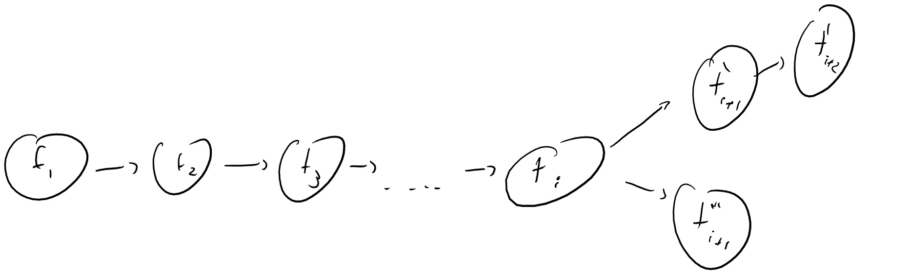
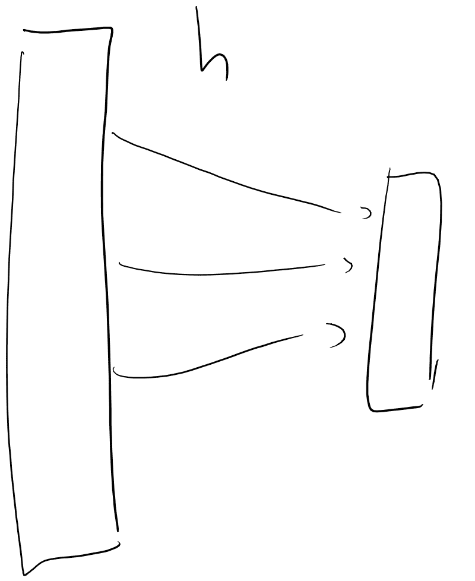
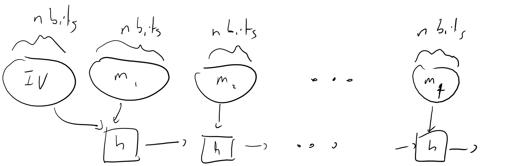

# 哈希函数、随机预言机和比特币

> [原文链接](https://intensecrypto.org/public/lec_07_hash_functions.html)

*发现任何错误/打字错误/令人困惑的解释？[在 GitHub 上打开一个 issue](https://github.com/boazbk/crypto/issues/new)。您也可以在下面评论*

**★ 另请参阅本章的[PDF 版本](https://files.boazbarak.org/crypto/lec_07_hash_functions.pdf)（更好的格式/参考文献）★

我们已经看到了伪随机生成器、函数和排列，以及消息认证码、CPA 和 CCA 安全的加密。本周我们将讨论加密哈希函数及其一些神奇的性质。我们通过比特币这种加密货币来激发这个话题。像往常一样，我们的讨论将非常抽象和理想化，与现实中的任何活着的或已故的加密货币的相似之处纯属巧合。

## “比特币”问题

使用密码学创建一个*集中化*的数字货币相对简单，实际上这正是 Visa、Mastercard 等所做的事情。比特币的主要挑战在于它是*去中心化*的。没有可信的服务器，没有“用户账户”，没有中央权威来裁决主张。相反，我们有一群匿名和自主的各方，他们需要以某种方式就有效支付达成一致。

### 货币问题

在谈论加密货币之前，让我们先谈谈一般意义上的货币。在抽象层面上，一种货币需要两个组成部分：

+   稀缺资源。

+   一种确定和转移这种资源一定数量所有权的机制。

一些货币是基于[商品货币](https://goo.gl/K7awAW)的。稀缺资源是某些具有内在价值的商品，如黄金或白银，甚至是盐或茶，所有权基于实物占有。然而，由于各种金融和政治原因，一些社会转向了[代表货币](https://goo.gl/K6c4qP)，这里的货币不是商品本身，而是一种提供商品所有权的证书。代表货币需要信任某个中央权威，该权威会尊重证书。货币演化的下一步是[法定货币](https://en.wikipedia.org/wiki/Fiat_money)，这是一种货币（如今天的美元，自从美国脱离[金本位制](https://goo.gl/SPN5BS)以来），它不对应任何商品，而只依赖于对中央权威的信任。（另一个例子是罗马硬币，尽管最初是由银制成的，但经历了持续的[贬值](https://goo.gl/ZDkGzL)过程，直到它们只含有不到 2%的银。）法定货币的一个优点（有时是缺点）是它允许中央权威在货币政策上具有更大的灵活性。

### 比特币架构

比特币是一种没有中央权威的法定货币。从先验的角度来看，这似乎是一种术语上的矛盾。如果没有可信赖的中央权威，我们如何确保稀缺资源？谁来解决所有权主张？又是谁制定货币政策？

例如，我们特别关注的一个问题是*双重消费*问题。以下场景是一个双重消费的例子：

1.  对手\(A\)从皮诺曹那里订购披萨。

1.  \(A\)给皮诺曹一个特定的“一组”钱\(m\)。

1.  \(A\)吃了披萨。

1.  \(A\)把同样的钱\(m\)给了另一家多米诺披萨店，这样皮诺曹就不再拥有那笔钱。

1.  \(A\)吃了第二块披萨。

用现金，这种情况是无法理解的。但想想信用卡：如果你可以“撤销”（或争议）第一次付款，你就可以在你收到一些商品或服务之后从皮诺曹那里拿走钱。再考虑一下，在步骤 4 中，\(A\)不必把\(m\)给多米诺，而是可以直接把\(m\)还给自己。

我们希望让任何人都不可能执行这种双重消费。

比特币（以及其他加密货币）旨在为这个问题以及更多问题提供加密解决方案。

比特币系统中的基本单位是*币*。每一枚币都有一个唯一的标识符和一个当前的*所有者*。2 系统中的交易要么是“用标识符\(\ensuremath{\mathit{ID}}\)和所有者\(P\)铸造币”，要么是“将币\(\ensuremath{\mathit{ID}}\)从\(P\)转移到\(Q\)”。所有这些交易都记录在一个公开的*账本*中。

由于比特币中没有用户账户，实体“\(P\)”和“\(Q\)”不是任何物理人的标识符。相反，“\(P\)”和“\(Q\)”是“计算难题”。一个*计算难题*可以被认为是一个字符串\(\alpha\)，它指定了一些“问题”，使得验证另一个字符串\(\beta\)是否是该问题的“解决方案”很容易，但自己找到这样的解决方案却很困难。（具有复杂度背景的学生会在这里认出**NP**类。）因此，当我们说“将币\(\ensuremath{\mathit{ID}}\)从\(P\)转移到\(Q\)”时，我们的意思是，持有难题\(Q\)的解决方案的人现在成为了币\(\ensuremath{\mathit{ID}}\)的所有者（为了验证这次转账的真实性，你需要提供一个难题\(P\)的解决方案。）更准确地说，如果涉及币\(\ensuremath{\mathit{ID}}\)的交易包含与\(\ensuremath{\mathit{ID}}\)相关的难题的解决方案，那么这个交易就根据账本中的最新交易是自我验证的。

请重新阅读上一段，以确保你理解了逻辑。

一个难题的理论例子如下：如果\(N\)是难题，一个实体可以通过产生数字\(A,B\)来“证明”他们拥有分配给\(N\)的币，如果\(A\cdot B=N\)。

另一个更通用的例子（你可以将其作为我们在这里使用的谜题的潜在实现方案记住）是：\(\alpha\) 是 \(\{0,1\}^{2n}\) 中的某个字符串，\(\beta\) 将是 \(\{0,1\}^n\) 中的某个字符串，使得 \(\alpha = G(\beta)\)，其中 \(G:\{0,1\}^n\rightarrow\{0,1\}^{2n}\) 是某个伪随机生成器。

实际的比特币系统通常使用基于 *数字签名* 的谜题，我们将在本课程稍后学习这个概念，但你可以简单地将 \(P\) 视为指定某个抽象谜题，并且每个能够解决 \(P\) 的人都可以使用 \(P\) 所拥有的硬币构造交易。^([3)] 不幸的是，这意味着如果你 *丢失* 了解决谜题的解决方案，那么你就无法访问该硬币。更令人震惊的是，如果有人从你那里偷走了解决方案，那么你就没有途径或方法来找回你的硬币。人们已经设法 [损失数百万美元](http://readwrite.com/2014/01/13/what-happens-to-lost-Bitcoins)。

## 比特币账本

比特币背后的主要理念是存在一个公开的 *账本*，其中包含所有已执行并被系统视为有效的交易的有序列表。给定这样一个账本，很容易回答任何特定硬币的所有权问题。主要问题是如何让一群没有中央权威的匿名各方就这个账本达成一致？这是分布式计算中 *共识* 问题的一个实例。这看起来相当可怕，因为已知这个问题的非常强烈的负面结果；例如，著名的 [Fischer, Lynch, Patterson (FLP) 结果](http://the-paper-trail.org/blog/a-brief-tour-of-flp-impossibility/) 表明，如果有一个参与者出现 *良性* 故障（即，它停止响应），则在完全异步的网络中保证共识是不可能的。如果我们假设某种程度的部分同步（即，全局时钟和消息延迟的一些界限）以及大多数或超级大多数的参与者行为正确，情况会更好。

部分同步假设通常在互联网上大致得到维持，但诚实多数假设似乎相当可疑。在一个匿名网络中，“多数参与者”意味着什么？在这个网络中，单个人可以创建多个“实体”并使它们任意恶意行为（在分布式术语中称为“拜占庭”错误）？此外，为什么我们会假设即使有一个参与者会诚实地行为——如果没有中央权威，作弊有利可图，那么每个人都会作弊，不是吗？

7.1：比特币账本由一系列有序的交易组成。在任何给定的时间点，可能会有几个“分叉”继续账本，不同的各方不必一定达成一致。然而，比特币架构被设计成确保对应于大多数计算能力的各方将就单一账本达成共识。

比特币背后的主要想法可能是“多数”将对应于“计算能力的多数”，或者正如[原始比特币论文](https://Bitcoin.org/Bitcoin.pdf)所说，“一个 CPU 一票”（或者也许更准确地说，“一个循环一票”）。这可能不是立即显而易见的如何实现，但至少这意味着创建虚构的新实体（有时被称为[Sybil 攻击](https://goo.gl/jMZ7Qg)，关于多重人格障碍的电影）是无用的。为了实现它，我们转向一个称为“工作量证明”的密码学概念，该概念最初由 Dwork 和 Naor 在 1991 年提出，作为对抗垃圾邮件营销的一种方式。4

考虑一个将 \(n\) 位映射到 \(\ell\) 位的伪随机函数 \(\{ f_k \}\)。平均而言，Alice 需要 \(2^\ell\) 次查询才能获得一个输入 \(x\) 使得 \(f_k(x)=0^\ell\)。因此，如果我们不够小心，我们可能会认为这样的输入 \(x\) 是 Alice 花费 \(2^\ell\) 时间的*证明*。

停下来，试着思考一下，是否真的存在一种情况，即无法在少于 \(2^\ell\) 步骤的情况下找到一个输入 \(x\) 使得 \(f_k(x)=0^\ell\)。

使用 PRF 进行工作量证明的主要问题是谁持有伪随机函数的密钥 \(k\)。如果有一个可信的服务器持有密钥，那么当然，找到这样的输入 \(x\) 平均需要 \(2^\ell\) 次查询，但比特币的整个目的就是*不*有一个可信的服务器。如果我们把 \(k\) 给给 Alice，我们能否保证她不能在没有运行 \(2^\ell\) 次查询的情况下找到一条“捷径”来找到这样的输入？通常情况下，答案是**不能**。

事实上，证明（在 PRF 猜想下）存在一个将 \(n\) 位映射到 \(n\) 位的 PRF \(\{ f_k \}\) 和一个有效的算法 \(A\)，使得 \(A(k)=x\) 且 \(f_k(x)=0^\ell\) 是一个很好的练习。

然而，假设 \(\{ f_k \}\) 以某种方式是一个“超级强大的 PRF”，它将表现得像一个随机函数，即使是对持有密钥的一方也是如此。在这种情况下，我们可以想象查询 \(f_k\) 就像是投掷 \(\ell\) 个独立的随机硬币，而使用少于 \(2^\ell\) 次循环来获得 \(x\) 使得 \(f_k(x)=0^\ell\) 是不可行的。因此，提供这样的输入 \(x\) 可以作为“工作量证明”，表明你已经花费了大约 \(2^\ell\) 次循环。通过调整 \(\ell\)，我们可以获得一个证明，表明我们为我们的选择值 \(T\) 花费了 \(T\) 次循环。现在，如果事情像往常一样进行，那么我就会陈述以下结果：

> **定理：**在 PRG 猜想下，存在超级强 PRF。

再次，这里的“超级强 PRF”表现得像是一个真正的随机函数，即使是对持有密钥的一方也是如此。不幸的是，这样的结果**并非**已知为真，而且有一个非常好的原因。定义“超级强 PRF”的大多数自然方式都会导致可以证明**不可能实现**的性质。尽管如此，其背后的直觉仍然似乎是有用的，因此我们有以下启发式：

> **随机预言机启发式（又称“随机预言机模型”，Bellare-Rogaway 1993）：**如果一个“自然”协议在所有各方都能访问一个随机函数 \(H:\{0,1\}^n\rightarrow\{0,1\}^\ell\) 时是安全的，那么即使我们给各方提供具有相同输入和输出长度的加密哈希函数的**描述**，该协议仍然保持安全。

我们没有很好的特征来描述什么使得一个协议“自然”，我们确实有一些相当强的反例来反驳这个启发式（尽管它们可以说是“不自然的”）。尽管如此，它仍然似乎是一种获取安全直觉的有用方法，特别是为了分析比特币（以及许多其他实际协议），我们确实需要假设它，至少在当前的知识水平上。

随机预言机启发式与我们之前考虑的所有猜想都大不相同。它**不是**一个正式的猜想，因为我们没有很好的方法来定义“自然”，而且我们确实有一些协议的例子，当所有各方都能访问一个随机函数时是安全的，但当我们用**任何**有效可计算函数替换这个随机函数时，这些协议就会**不安全**（参见作业练习）。

**在随机预言机模型下**，我们现在可以指定比特币的“工作量证明”协议。给定某个标识符 \(\ensuremath{\mathit{ID}}\in\{0,1\}^n\)，一个整数 \(T \ll 2^n\)，和一个哈希函数 \(H:\{0,1\}^{2n}\rightarrow\{0,1\}^n\)，对应于 \(\ensuremath{\mathit{ID}}\) 和 \(T\) 的工作量证明将是某个 \(x\in\{0,1\}^*\)，使得 \(H(\ensuremath{\mathit{ID}}\| x)\) 的前 \(\lceil \log T \rceil\) 位为零.^(5)

### 从工作量证明到账本上的共识

工作量证明如何帮助我们实现共识？

我们希望比特币系统中的每一笔交易 \(t_i\) 都有一个对应的工作量证明。特别是，一些与 \(t_i\) 的某个唯一标识符相关的 \(T_i\) 时间“工作量”证明。

账本 \((t_1,\ldots,t_n)\) 的**长度**是相应 \(T_i\) 的总和。换句话说，**长度**对应于创建此账本所投入的总周期数。如果一个账本中的每笔交易形式为“将硬币 \(\ensuremath{\mathit{ID}}\) 从 \(P\) 转移到 \(Q\)”都由 \(P\) 的一个解决方案进行自我证明，则该账本**有效**。

关键的是，比特币网络中的参与者（特别是矿工）因向账本添加有效条目而得到奖励。换句话说，他们通过执行添加条目到账本所需的“工作”来获得比特币（这些比特币是为他们新铸造的）。然而，诚实参与者（包括非矿工，只是阅读账本的人）会接受已知的最长账本作为事实真相。此外，比特币矿工在将条目 \(i\) 添加到账本之后会得到奖励。这给矿工提供了一个选择最长账本并贡献他们工作的激励。为了理解这一点，考虑以下对激励结构的粗略近似：

记住，比特币矿工在将条目 \(i\) 添加到账本之后会得到奖励。换句话说，他们通过执行添加条目到账本所需的“工作”（这直接对应于 CPU 周期，而 CPU 周期又直接对应于货币价值）来“下注”特定的账本是否会“获胜”。想象一下你自己是一位矿工，考虑一个存在两个竞争账本的场景。账本 1 的长度为 \(3\)，账本 2 的长度为 \(6\)。这意味着矿工将大约 \(2\) 倍的工作量（= CPU 周期 = 货币）投入到了账本 2 中。为了使账本 1“获胜”（从你的角度来看，这意味着达到长度 \(104\) 以获得奖励并变得比账本 2 更长），你需要执行 \(3\) 个条目的工作量，仅仅是为了使账本 1 达到长度 \(6\)。但与此同时，其他矿工已经在账本 2 上工作，进一步增加了其长度！因此，你希望向账本 2 添加条目。

如果账本 \(L\) 对应于在这个网络中可用的多数周期，那么每个诚实方都会接受它，因为任何替代账本必然会更短。（参见图 7.1。）

因此，可以希望共识账本将继续增长。（这是一个相当模糊和不够精确的论点，有关更深入的分析，请参阅[这篇论文](https://eprint.iacr.org/2015/261)；这也与被称为[优先连接](https://en.wikipedia.org/wiki/Preferential_attachment)的现象有关。）

**挖矿成本、挖矿池**：一般来说，如果你知道完成一个\(T\)周期证明可以得到一枚硬币，那么进行一次查询（成功概率为\(1/T\)）就像购买一张彩票，成本为一个周期，有\(1/T\)的概率赢得一枚硬币。与实际彩票的一个不同之处在于，你还有一定的概率在错误的账本分支上工作，但这激励人们尽可能地避免这种情况。另一个，可能甚至更重要的不同之处在于，事情被设置为一种*有利可图*的企业，周期成本小于\(1/T\)硬币的价值。就像在彩票中一样，人们可以并且确实会聚集在一起（被称为“挖矿池”），他们将所有的计算资源集中在一起，然后在赢得奖励时平分奖金。加入一个池不会改变你赢得的期望，但会减少*方差*。在极端情况下，如果每个人都同一个池，那么对于你花费的每个周期，你将得到正好\(1/T\)枚硬币。这些池在实际操作中的工作方式是，有人花费了\(C\)个周期寻找所有零的输出，只有\(C/T\)的概率得到它，但很可能得到一个以\(\log C\)个零开头的输出。这个输出可以作为他们自己的“工作量证明”，证明他们花费了\(C\)个周期，他们可以将它发送给池管理，以便获得相应的奖励份额。

> **真正的比特币**：上述描述的协议与真正的比特币协议在几个方面有所不同。其中一些已经在上面讨论过了：比特币通常使用数字签名来解决难题（尽管它有一个更通用的脚本语言来指定它们），交易涉及多个 Satoshis（用户界面通常以 BTC 单位显示货币，其中 BTC 是\(10⁸\) Satoshis）。比特币协议还有一个公式，旨在考虑每轮美元成本的下降，从而使比特币随着时间的推移变得更加昂贵。除了挖矿之外，还有一个费用机制来激励各方添加到账本中。（比特币中的激励机制相当微妙，并未完全解决，而且各方的行为可能会随着时间的推移而改变。）账本不是通过每次单个交易增长，而是通过一个*区块*的交易增长，并且还有一个时间同步机制（根据共识不可能性结果，这是必要的）。还有其他一些差异；有关更多信息，请参阅[Bonneau 等人论文](https://eprint.iacr.org/2015/261)以及[Tschorsch 和 Scheuermann 调查](https://eprint.iacr.org/2015/464)。

## 碰撞抵抗哈希函数和创建简短的“唯一”标识符

我们“掩盖”的另一个问题是，我们如何为每笔交易生成这些唯一的标识符。我们希望每笔交易 \(t_i\) 都与账本状态 \((t_1,\ldots,t_{i-1})\) 相关联，因此 \(t_i\) 的 ID 应该包含所有先前交易的 ID。但另一方面，我们希望这个 ID 只有 \(n\) 位长。理想情况下，如果我们有一个从 \(\{0,1\}^N\) 到 \(\{0,1\}^n\) 的**一对一**映射 \(H\)，其中 \(N\) 非常大 \(N\gg n\)，那么就可以解决这个问题。然后，对应于将 \(t_i\) 添加到 \((t_1,\ldots,t_{i-1})\) 的任务对应的 ID 将简单地是 \(H(t_1\|\cdots\|t_i)\)。唯一的问题是，这显然是不可能的 - \(2^N\) 明显大于 \(2^n\)，并且不存在从大集合到小集合的一对一映射。幸运的是，我们身处神奇的密码学世界，在这里不可能的事情是常规的，而难以想象的事情是偶尔发生的。因此，我们实际上可以找到一个“本质上”是一对一的函数 \(H\)。

12.1：一个抗碰撞散列函数是一个从大宇宙到小宇宙的映射，在“实际上是一对一”的意义上，即对于该函数来说，碰撞是存在的，但很难找到。

主要思想是以下简单结果，这可以被视为所谓的[“生日悖论”](https://goo.gl/GSPrDW)的一方面：

如果 \(H\) 是从某个域 \(S\) 到 \(\{0,1\}^n\) 的随机函数，那么在 \(T\) 次查询之后，攻击者找到 \(x\neq x'\) 使得 \(H(x)=H(x')\) 的概率至多为 \(T²/2^n\)。

让我们考虑 \(H\) 在“懒加载”模式下的情况，其中对于每次对手提出的查询，我们都会在查询发生时从 \(\{0,1\}^n\) 中随机选择一个答案。（我们可以假设对手永远不会重复查询，因为重复查询可以通过重复相同的答案来模拟。）对于 \([T]\) 中的 \(i< j\)，令 \(E_{i,j}\) 为事件 \(H(x_i)=H(x_j)\)。由于 \(H(x_j)\) 是随机选择的，并且独立于 \(H(x_i)\) 的先前选择，因此 \(E_{i,j}\) 的概率是 \(2^{-n}\)。因此，所有 \(i,j\) 的并集的概率小于 \(T²/2^n\)，但这正是我们需要计算的概率。

这意味着一个随机函数 \(H\) 在以下意义上是**抗碰撞**的，即对于高效的对手来说，找到两个发生碰撞的输入是困难的。因此，随机预言机启发式方法会建议可以使用加密散列函数来获得以下对象：

一组函数 \(\{ h_k \}\)，其中 \(h_k:\{0,1\}^*\rightarrow\{0,1\}^n\) 对于 \(k\in\{0,1\}^n\) 是一个**抗碰撞散列函数（CRH）集合**，如果映射 \((k,x)\mapsto h_k(x)\) 可以高效计算，并且对于每个高效的对手 \(A\)，\(A(k)=(x,x')\) 的概率（其中 \(x\neq x'\) 且 \(h_k(x)=h_k(x')\)）是可以忽略不计的.^(6)

尽管抗碰撞特性被认为是密码哈希函数的一个理想特性，但我们仍然不知道一个定理，即在 PRG 假设下存在一个抗碰撞的哈希函数集合。然而，我们确实知道如何在课程中将要看到的各种假设下获得满足这一条件的集合，例如错误学习问题和分解及离散对数问题。此外，如果我们考虑在**第二次预映攻击**（也称为“通用单向哈希函数”或 UOWHF）下的较弱安全性概念，那么从 PRG 假设中推导出这样的函数是已知的。

一组具有抗碰撞特性的哈希函数集合 \(\{ h_k \}\) 与具有相同输入输出长度的伪随机函数集合 \(\{ f_s \}\) 是不可比较的。一方面，抗碰撞的特性并不意味着 \(h_k\) 与随机函数不可区分。例如，可以构造一个有效的抗碰撞哈希函数，其中第一个输出位始终为零（因此很容易与随机函数区分开来）。另一方面，与定义 4.1 不同，定义 7.3 的攻击者不仅被提供了一个“黑盒”来计算哈希函数，而且还提供了哈希函数的密钥。这是一个更强的攻击模型，因此 PRF 不必具有抗碰撞特性。（构造一个不具有抗碰撞特性的 PRF 是一个既有趣又推荐的练习。）

## 密码哈希函数的实际构造

虽然我们讨论了作为**密钥**集合的哈希函数，但在实践中，人们通常将哈希函数视为一个**固定无密钥函数**。然而，这是因为大多数实际构造涉及一些硬编码的标准常数（通常称为 IV），可以将其视为密钥的选择。

密码哈希函数的实际构造通常从一个基本块开始，这个基本块被称为**压缩函数** \(h:\{0,1\}^{2n}\rightarrow\{0,1\}^n\)。当消息由 \(t\) 个块组成时，函数 \(H:\{0,1\}^*\rightarrow\{0,1\}^n\) 定义为 \(H(m_1,\ldots,m_t)=h(h(h(m_1,\ensuremath{\mathit{IV}}),m_2),\cdots,m_t)\)（如果需要，我们可以对其进行填充）。参见图 7.3。这种构造被称为 Merkle-Damgard 构造，我们知道它确实可以保持抗碰撞特性：

7.3：Merkle-Damgard 构造将压缩函数 \(h:\{0,1\}^{2n}\rightarrow\{0,1\}^n\) 转换为一个将任意长度的字符串映射到 \(\{0,1\}^n\) 的哈希函数。这种转换保持了抗碰撞特性，即使 \(h\) 是伪随机的，也不产生 PRF。因此，对于许多应用，它不应直接使用，而应与 HMAC 等转换组合使用。

令\(H\)如上所述由\(h\)构造。然后给定两个消息\(m \neq m' \in \{0,1\}^{tn}\)，使得\(H(m)=H(m')\)，我们可以有效地找到两个消息\(x \neq x' \in \{0,1\}^{2n}\)，使得\(h(x)=h(x')\)。

证明背后的直觉是，如果\(h\)是可逆的，那么我们可以通过简单地反向操作来逆转\(H\)。因此，从原则上讲，如果\(H\)存在冲突，那么\(h\)也存在冲突。当然，这是一个空洞的陈述，因为\(h\)和\(H\)都缩小了它们的输入，因此显然有冲突。但我们要证明一个**构造性**的证明，这将允许我们将\(H\)的冲突转换为\(h\)的冲突。这很简单。我们查看\(H(m)\)和\(H(m')\)的计算，以及第一个输入不同但输出相同的块（必须存在这样的块）。这个块将为\(h\)产生一个冲突。

### 实际上的随机函数

在实践中，我们希望我们的哈希函数具有比冲突抵抗更多的功能。特别是，我们通常希望它们也是 PRF。不幸的是，Merkle-Damgard 构造**不是**PRF，即使\(\ensuremath{\mathit{IV}}\)是随机和秘密的。这是因为我们可以对其执行**长度扩展攻击**。即使我们不知道\(\ensuremath{\mathit{IV}}\)，给定\(y=H_{IV}(m_1,\ldots,m_t)\)和一个块\(m_{t+1}\)，我们也可以计算\(y' = h(y,m_{t+1})\)，它等于\(H_{IV}(m_1,\ldots,m_{t+1})\)。

一种解决方法是在加密的**末尾**使用不同的\(\ensuremath{\mathit{IV}}'\)。也就是说，我们定义：

\(H_{IV,\ensuremath{\mathit{IV}}'}(m_1,\ldots,m_t) = h(\ensuremath{\mathit{IV}}',H_{IV}(m_1,\ldots,m_t))\)

这种构造（其中\(\ensuremath{\mathit{IV}}'\)是\(\ensuremath{\mathit{IV}}\)的某个简单函数）的一个变体被称为 HMAC，并且可以证明在压缩函数\(h\)的一些伪随机性假设下，它是一个伪随机函数。它被非常广泛地实现。在许多情况下，当我在这门课程中说“使用一个加密哈希函数”时，我实际上是指使用像 HMAC 这样的构造，可以推测它至少提供 PRF，如果不是更强的“随机预言机”-样属性。

压缩函数最简单的实现方式是取一个\(n\)位密钥和一个\(n\)位消息的**块加密**，然后简单地定义\(h(x_1,\ldots,x_{2n})=E_{x_{n+1},\ldots,x_{2n}}(x_{1},\ldots,x_{n})\)。一个更常见的变体是戴维斯-迈耶（Davies-Meyer），其中我们还将输出与\(x_{n+1},\ldots x_{2n}\)进行异或操作。在实践中，人们通常使用为某些效率或安全性考虑而设计的**定制**块加密。

### 一些历史

几乎所有实际使用的哈希函数都是基于 Merkle-Damgard 范式。哈希函数被设计得极其高效^(7)，这也意味着它们通常处于“不安全”的边缘，并且确实已经越过了这个边缘。

在 1990 年，Ron Rivest 提出了 MD4，它在 1991 年就已经显示出弱点，并在 1995 年找到了一个完整的碰撞。此后还发现了更快攻击方法，MD4 被认为完全不安全。

作为对这些弱点的回应，Rivest 在 1991 年设计了 MD5。它在 1996 年显示出弱点，并在 2004 年展示了完整的碰撞。因此，它现在也被认为是不安全的。

在 1993 年，国家标准研究院提出了一种名为**安全散列算法（SHA**）的散列函数标准，它与 MD4 和 MD5 函数有相当多的相似之处。这个函数被称为 SHA-0，该标准在 1995 年被 SHA-1 所取代，SHA-1 增加了一个额外的“混合”操作（即位旋转）。当时没有给出这种变化的原因，但后来发现 SHA-0 是不安全的。在 2002 年，增加了一个输出更长的变体，称为 SHA-256（以及一些其他变体）。在 2005 年，继 MD5 碰撞之后，SHA-1 显示出了重大的弱点。在 2017 年，发现了[完整的 SHA-1 碰撞](https://goo.gl/jdqUX9)。如今，SHA-1 被认为是不安全的，而 SHA-256 被推荐使用。

由于 MD-5 和 SHA-1 的弱点，NIST 在 2006 年启动了一场竞赛，以寻找一个新的散列标准，基于与 MD5/SHA-0/SHA-1 家族足够不同的函数。（SHA-256 尚未被破解，但它似乎与那些其他系统过于接近，让人感到不舒服。）在 2015 年 8 月，Keccak 散列函数被选为新的标准[SHA-3](https://goo.gl/Bx1bu2)。

### NSA 与散列函数

NSA 是世界上最大的数学家雇主，并且在密码学研究上投入了大量的资源。他们似乎投入了比公开研究社区更多的资源来分析对称原语，如分组密码和散列函数。确实，上述历史表明，NSA 在发现散列函数攻击方面始终领先于密码学社区（对于分组密码的差分密码分析技术也是如此）。尽管有时将“神话般”的力量归因于 NSA，但这一历史表明，他们比公开社区领先，但领先程度并不大，发现散列函数攻击大约比它们出现在公开文献中早 5 年左右。

我们有几种方式可以了解 NSA 的思考方式。一些这样的见解可以从斯诺登文件中获得。2012 年在伊朗发现了[Flame 恶意软件](https://en.wikipedia.org/wiki/Flame_(malware))，它自 2010 年起至少在运行。它使用 MD5 碰撞来实现其目标。这种碰撞自 2008 年以来在公开文献中就已知晓，但 Flame 使用了文献中未知的另一种变体。因此，有人怀疑它是被一个西方情报机构设计的。

另一个关于国家安全局（NSA）想法的见解可以在 NSA 内部 [Cryptolog 通讯](https://cryptome.org/2013/03/cryptologs/cryptolog_126.pdf) 的第 12-19 页找到，该通讯最近被解密；在那里可以找到一个相当有趣且具有观点（或者根据你的观点可能是令人讨厌的）的 CRYPTO 1992 会议评论。在第 14 页，作者评论说，在会议上展示的 MD5 的某些弱点不太可能扩展到完整版本，这表明 NSA（或者至少作者）当时并不知道 MD5 冲突。（Cryptolog 通讯的[完整档案](https://cryptome.org/2013/03/cryptologs/00-cryptolog-index.htm)值得一读！）

### 加密哈希函数与非加密哈希函数

哈希函数当然也广泛应用于*非加密*应用，如构建哈希表和负载均衡。对于这些应用，人们通常使用称为*循环冗余码（CRC）*的*线性*哈希函数。然而，即使在那些看似非加密的应用中，如果攻击者能够生成许多冲突，他可能会对系统造成显著的减速。这已经被用来进行拒绝服务攻击。[例如](http://arstechnica.com/business/2011/12/huge-portions-of-web-vulnerable-to-hashing-denial-of-service-attack/)。一般来说，如果你的系统输入可能是由不关心你最佳利益的人生成的，那么使用加密哈希函数会更好。

## 阅读理解练习

我建议学生在阅读讲座后完成以下练习。它们并不涵盖所有材料，但可以是一个检查你理解的好方法。

从以下选项中选择最强的真命题。（也就是说，从这些选项中选择一个既是真的，又可以推导出其他真命题的数学陈述。）

1.  对于每一个函数 \(h:\{0,1\}^{1024} \rightarrow \{0,1\}^{128}\)，都存在两个字符串 \(x \neq x'\) 在 \(\{0,1\}^{1024}\) 中，使得 \(h(x)=h(x')\)。

1.  存在一个随机算法 \(A\)，它对一个给定的黑盒进行最多 \(2^{128}\) 次查询，该黑盒计算一个函数 \(h:\{0,1\}^{1024} \rightarrow \{0,1\}^{128}\)，且以至少 \(0.9\) 的概率，\(A\) 输出 \(\{0,1\}^{1024}\) 中的两个不同的 \(x \neq x'\) 对，使得 \(h(x)=h(x')\)。

1.  存在一个随机算法 \(A\)，它对一个给定的黑盒进行最多 \(100 \cdot 2^{64}\) 次查询，该黑盒计算一个函数 \(h:\{0,1\}^{1024} \rightarrow \{0,1\}^{128}\)，且以至少 \(0.9\) 的概率，\(A\) 输出 \(\{0,1\}^{1024}\) 中的两个不同的 \(x \neq x'\) 对，使得 \(h(x)=h(x')\)。

1.  存在一个随机算法 \(A\)，它对一个给定的黑盒进行最多 \(0.01 \cdot 2^{64}\) 次查询，该黑盒计算一个函数 \(h:\{0,1\}^{1024} \rightarrow \{0,1\}^{128}\)，且以至少 \(0.9\) 的概率，\(A\) 输出 \(\{0,1\}^{1024}\) 中的两个不同的 \(x \neq x'\) 对，使得 \(h(x)=h(x')\)。

假设\(h:\{0,1\}^{1024} \rightarrow \{0,1\}^{128}\)是随机选择的。如果\(y\)在\(\{0,1\}^{128}\)中随机选择，并且我们独立地在\(\{0,1\}^{1024}\)中随机选择\(x_1,\ldots,x_t\)，那么\(t\)需要有多大，才能使得存在某个\(x_i\)使得\(h(x_i)=y\)的概率至少为\(1/2\)。（选择最接近的估计答案）：

1.  \(2^{1024}\)

1.  \(2^{256}\)

1.  \(2^{128}\)

1.  \(2^{64}\)

假设 Alice 和 Bob 使用一个作为其组件的函数\(h\)作为黑盒的消息认证码\((S,V)\)在\(h\)是一个随机函数时是安全的。当 Alice 和 Bob 使用从某个 PRF 集合中选择的哈希函数\(h\)，并且其密钥被敌手提供时，它仍然是安全的吗？

1.  有时可能是安全的，有时可能不安全。

1.  总是安全的。

1.  总是是不安全的。

1.  我无论如何都不是经济学家，所以请带着极大的怀疑态度来讨论以下内容。我非常欢迎对此有任何评论。

    ↩

1.  这是我们简化并偏离实际比特币系统的地方之一。在实际的比特币系统中，最小的原子单位被称为*萨托希*，一个比特币（缩写为 BTC）是\(10⁸\)萨托希。出于效率的考虑，每个萨托希没有单独的标识符，交易可以涉及多个萨托希的转移和创建。然而，从概念上讲，我们可以将原子币视为每个都有唯一标识符。

    ↩

1.  有一些原因说明为什么比特币使用数字签名而不是这些谜题。主要问题是，我们希望将谜题不仅绑定到硬币上，而且绑定到特定的交易上，这样如果你知道与硬币\(\ensuremath{\mathit{ID}}\)对应的谜题\(P\)的解决方案，并想用它将硬币转移到\(Q\)，在你将交易添加到公共账本之前，没有人能够使用你的解决方案将硬币转移到\(Q'\)。在我们了解数字签名之后，我们将回到这个问题。作为快速预览，在比特币中，谜题如下：任何能够使用与公钥\(P\)对应的私钥生成数字签名的人可以声称这些硬币。

    ↩

1.  这是一篇相当有远见的论文，因为它在“垃圾邮件”这个术语被引入之前就预见到了这个问题，实际上在电子邮件本身，更不用说垃圾邮件，几乎还没有广泛传播的时候。

    ↩

1.  实际的比特币协议稍微更通用一些，其中证明是某个\(x\)，使得\(H(\ensuremath{\mathit{ID}}\|x)\)，当解释为\([2^n]\)中的数时，至多为\(T\)。还有一些关于如何确切放置\(x\)和从历史中计算\(\ensuremath{\mathit{ID}}\)的其他问题，我们在这里忽略。

    ↩

1.  注意，生日界限的另一面表明，你可以使用大约 \(2^{n/2}\) 次查询在 \(h_k\) 中找到碰撞。因此，我们通常需要将哈希函数的输出长度加倍，与其它密码学原语的关键字大小相比（例如，与 128 位相比，256 位）。

    ↩

1.  例如，Boneh-Shoup 的书中引用了在 1.83 GHz Intel Core 2 处理器上的处理速度高达 255MB/sec，这对于处理哈佛的网络甚至 [Lamar 学院的](http://www.huffingtonpost.com/2014/06/27/colleges-fastest-internet-speed-infographic_n_5536834.html) 网络速度来说已经足够了。

    ↩

## 评论

评论通过 [GitHub 仓库](https://github.com/boazbk/crypto/issues) 使用 [utteranc.es](https://utteranc.es) 应用发布。发表评论需要 GitHub 登录。如果你不想授权应用代表你发布，你也可以直接在 [GitHub 上的此页面问题](https://github.com/boazbk/crypto/issues?q=Hash Functions, Random Oracles, and Bitcoin+in%3Atitle) 上发表评论。

编译于 2021 年 11 月 17 日 22:36:30

版权所有 2021，Boaz Barak。

本作品受 [Creative Commons Attribution-NonCommercial-NoDerivatives 4.0 国际许可协议](https://creativecommons.org/licenses/by-nc-nd/4.0/) 的许可。

使用 [pandoc](https://pandoc.org/) 和 [panflute](http://scorreia.com/software/panflute/) 以及从 [gitbook](https://www.gitbook.com/) 和 [bookdown](https://bookdown.org/) 提取的模板生成。
