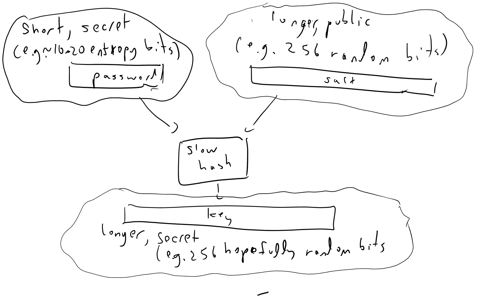
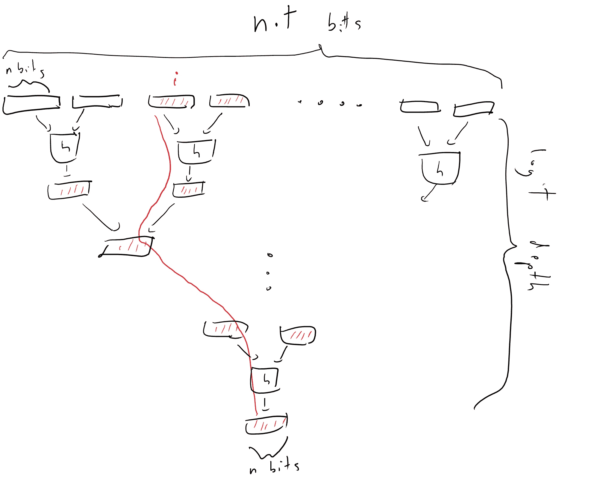
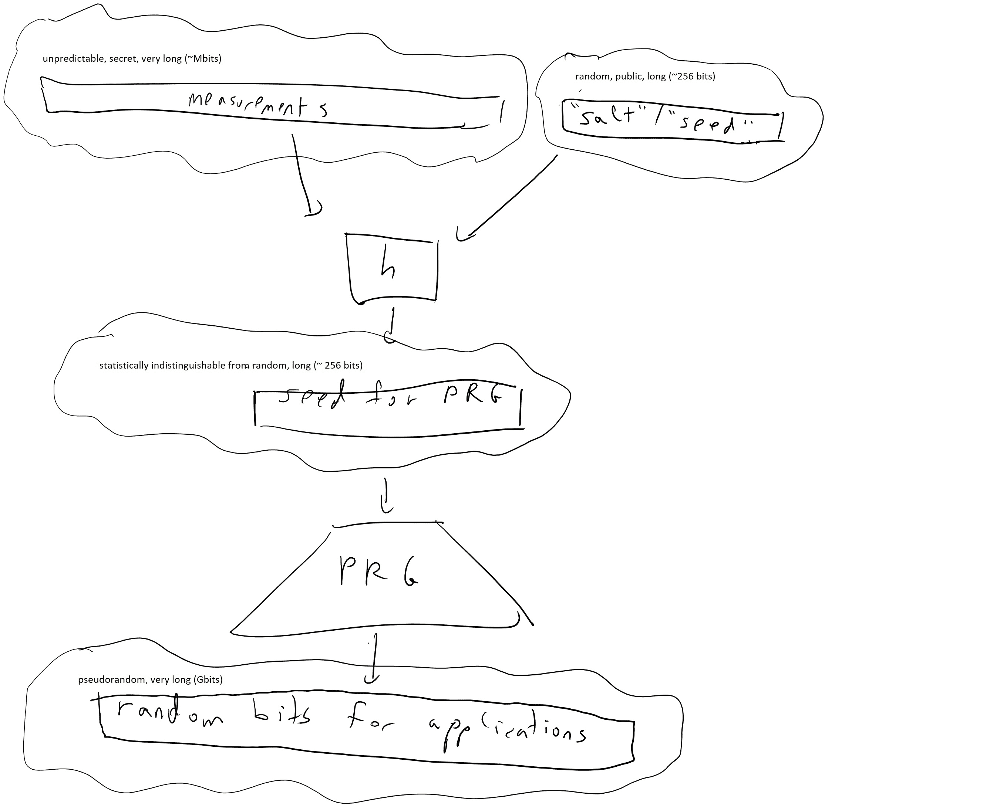

# 密钥派生、保护密码、慢速哈希、默克尔树

> 原文：[`intensecrypto.org/public/lec_08_hash_functions_part2.html`](https://intensecrypto.org/public/lec_08_hash_functions_part2.html)

*发现任何错误/打字错误/令人困惑的解释？[在 GitHub 上打开一个 issue](https://github.com/boazbk/crypto/issues/new)。您也可以在下面评论*

**★ 另请参阅本章的[**PDF 版本**](https://files.boazbarak.org/crypto/lec_08_hash_functions_part2.pdf)（更好的格式/参考文献）★

在上一节课中，我们看到了密码哈希函数的概念，这些函数的行为类似于随机函数，即使在攻击者可以访问允许他们评估哈希函数的密钥的设置中也是如此（与标准 PRF 不同）。哈希函数在密码学中找到了各种用途，在本节课中，我们将探讨它们的一些其他应用。在这些情况下，我们只需要相对温和且定义明确的 *抗碰撞性* 属性，而在其他情况下，我们只知道如何分析在更强（且不精确定义）的 *随机预言机启发式方法* 下的安全性。

## 从密码中提取密钥

我们已经看到了一些伟大的密码学工具，包括 PRFs、MACs 和 CCA 安全的加密，Alice 和 Bob 可以在他们共享大约 128 位加密密钥时使用。但不幸的是，许多当前使用密码学的人是 *人类*，一般来说，他们存储大数字的记忆能力极其有限。有 $62⁸ \approx 2^{48}$ 种选择 8 个大小写字母和数字的密码的方法，但某些字母/数字组合的选择频率远高于其他组合。由于几次大规模黑客攻击，非常大的密码数据库已经公开，其中一项 [估计](https://blogs.dropbox.com/tech/2012/04/zxcvbn-realistic-password-strength-estimation/) 是，用户选择的 91%的密码包含在大约 $1,000 \approx 2^{10}$ 个字符串的列表中。

如果我们从某个集合 $D$ 中随机选择一个密码，那么该密码的熵就是 $\log_2 |D|$。然而，估计现实生活中的密码熵相当困难。例如，假设我使用赢得马萨诸塞州百万彩票的号码作为我的密码。从先验知识来看，我的密码由 $5$ 个介于 $1$ 到 $75$ 之间的数字组成，因此其熵大约是 $\log_2 (75⁵) \approx 31$。然而，如果攻击者 *知道* 我这样做，熵可能类似于 $\log(520) \approx 9$（因为过去十年中只选择了大约 $520$ 个这样的数字）。此外，如果他们确切知道我基于哪个抽奖来设置密码，那么他们就会确切知道，因此（从他们的角度来看）熵将是零。这一点值得强调：

> *秘密的熵总是相对于攻击者的观点来衡量的。*

密码的确切安全性当然是一个具有高度实际意义的问题，但我们将简单地假设密码是从某个集合 $D\subseteq\{0,1\}^n$（有时称为“字典”）中随机选择的（）。集合 $D$ 是攻击者所知的，但她对密码的特定选择没有任何信息。

使用密码安全地面临的许多挑战都依赖于*离线*和*在线*攻击之间的区别。如果每个密码猜测都需要与服务器进行在线交互，就像在 ATM 中输入 PIN 号码那样，那么即使是弱密码（例如最多提供 13 位熵的 4 位 PIN），也可以提供有意义的保证，因为通常在五次或五次以上的失败尝试后，会触发警报。

然而，如果对手有检查密码是否正确的能力，那么他们可以尝试的猜测次数可以高达他们可用的计算周期数，这可以轻易达到数十亿，从而破解熵为 30 位或更多的密码。（这是我们学习完*公钥密码学*后，在讨论*密码认证密钥交换*时将再次讨论的问题。）

考虑一个密码管理器应用程序。在这样的应用程序中，用户通常会选择一个*主密码* $p_{master}$，然后可以使用它来访问她所有的其他密码 $p_1,\ldots,p_t$。为了使她能够在不要求在线访问服务器的情况下做到这一点，主密码 $p_{master}$ 被用来*加密*其他密码。然而，为了做到这一点，我们需要从密码中导出一个密钥 $k_{master}$。

一种自然的方法是简单地让密钥就是密码。例如，如果密码 $p$ 是最多 16 字节的字符串，那么我们可以简单地将其视为一个 128 位密钥并用于加密。停下来想想为什么这*不会*是一个好主意。特别是考虑一个安全的加密 $(E,D)$ 和一个在 $\{0,1\}^n$ 上的分布 $P$，其熵至少为 $n/2$，如果密钥 $k$ 是从 $P$ 中随机选择的，那么加密将是完全不安全的。

一种经典的方法是简单地使用一个加密散列函数 $H:\{0,1\}^*\rightarrow\{0,1\}^n$，并让 $k_{master} = H(p_{master})$。如果我们把 $H$ 视为一个随机预言机，而 $p_{master}$ 是从 $D$ 中随机选择的，那么只要攻击者向预言机提出 $\ll |D|$ 次查询，他们就不太可能提出 $p_{master}$ 的查询，因此从他们的角度来看，$k_{master}$ 的值将是完全随机的。

然而，由于 $|D|$ 不太大，执行这样的 $|D|$ 查询可能并不那么困难。因此，人们通常使用一个故意“慢”的哈希函数作为密钥派生函数。其理由是，诚实用户只需要评估 $H$ 一次，因此可以承受它花费一些时间，而对手则需要评估它 $|D|$ 次。例如，如果 $|D|$ 大约是 $100,000$，并且诚实用户愿意每次从 $p_{master}$ 导出 $k_{master}$ 时花费 1 美分的计算资源，那么我们可以设置 $H(\cdot)$ 使得评估它需要 1 美分，因此平均来说，对手恢复它将花费 1,000 美元。

有几种方法试图使 $H$ 故意变得“慢”或“昂贵”以进行评估，但最流行和最简单的一种方法是将 $H$ 通过迭代多次基本哈希函数（如 SHA-256）来获得。也就是说，$H(x)=h(h(h(\cdots h(x))))$，其中 $h$ 是某种标准（“快速”）的加密哈希函数，迭代次数被调整到诚实用户可以容忍的最大值。^([1)]

事实上，我们通常会设置 $k_{master} = H(p_{master}\| r)$，其中 $r$ 是一个长随机但**公开**的字符串，称为“盐”（见图 8.1）。包括这样的“盐”对于挫败对手试图分摊计算成本的努力可能很重要，请参见练习。

8.1：要从密码中获取密钥，我们通常会使用一个“慢”的哈希函数将密码和用户唯一的公共“盐”值映射到一个加密密钥。即使有这样的程序，生成的密钥也不能被认为像真正随机选择的密钥那样安全且不可预测，尤其是在我们处于一个对手可以发起**离线**攻击以猜测所有可能性的环境中。

即使当我们不使用一个密码来加密其他密码时，通常也认为将密码以明文形式存储而不是以这种“慢速哈希和加盐”的形式存储是最佳实践，因此如果密码文件落入对手手中，恢复它们将非常昂贵。

## Merkle 树和验证存储。

假设你将你的大量数据文件 $x\in\{0,1\}^N$ 外包到云端存储。现在你需要获取该文件的 $i^{th}$ 位，并向云端请求 $x_i$。你如何确定你实际上收到了正确的位？

Ralph Merkle 在 1979 年提出了一种巧妙的解决方案，这被称为“Merkle 哈希树”。其想法如下（参见定理 8.1）：假设我们有一个抗碰撞哈希函数 $h:\{0,1\}^{2n}\rightarrow\{0,1\}^n$，并将字符串 $x$ 视为由 $t$ 个大小为 $n$ 的块组成。然后我们哈希每对连续的块，将 $x$ 转换为 $t/2$ 个块的字符串 $x_1$，并以这种方式继续进行 $\log t$ 步，直到我们得到一个单独的块 $y\in\{0,1\}^n$。（这里为了简单起见，假设 $t$ 是 2 的幂，尽管这并没有太大的影响。）

8.1：在 Merkle 树构建中，我们将长字符串 $x$ 映射到块 $y\in\{0,1\}^n$，它是长字符串 $x$ 的“摘要”。与抗碰撞哈希一样，我们可以想象这个映射在“一对一”的意义上，即不可能找到具有相同摘要的 $x'\neq x$。此外，我们可以高效地证明 $x$ 的某个比特等于某个值，而不需要发送所有 $x$，而是发送在 $i$ 到根之间的路径上的 $\log t$ 个块及其在哈希函数中使用的“兄弟”块，总共最多 $2\log t$ 个块。

Alice，将 $x$ 发送到云端 Bob 的人，将保留短块 $y$。每当 Alice 查询值 $i$ 时，她将要求一个 *证书* 来证明 $x_i$ 确实是正确的值。这个证书将包括包含 $i$ 的块，以及从该块到根的所有 $2\log t$ 个块，这些块用于从该块到根的哈希。该方案的安全性源于以下简单的定理：

假设 $\pi$ 是一个有效的证书，证明 $x_i=b$，那么这个陈述要么是真的，要么可以从 $\pi$ 和 $x$ 中高效地提取两个不同的输入 $z\neq z'$ 在 $\{0,1\}^{2n}$ 中，使得 $h(z)=h(z')$。

证书 $\pi$ 由一系列 $\log t$ 个大小为 $n$ 的块对组成，这些块是通过在树中从 $x$ 的第 $i$ 个坐标到最终根 $y$ 的路径上跟踪得到的。最后一个块对是 $h$ 下 $y$ 的前像，而列表中的每一对都是下一对中某个块的预像。如果 $x_i \neq b$，则第一个块对不能与包含 $x$ 中第 $i$ 个坐标的块对的 $x$ 相同。然而，由于我们知道最终根 $y$ 是相同的，如果我们比较 $x$ 和 $\pi$ 中的对应路径，我们将看到在某个点，路径中必须有一个输入 $z$，在 $\pi$ 中有一个不同的输入 $z'$，它们哈希到相同的输出。

## 可检索性证明

上述方法为 Alice 提供了一种确保从云存储检索到的值是正确的方法，但 Alice 如何确保云服务器仍然存储了她 *没有* 询问的值？

从先验的角度来看，你可能认为她显然做不到。如果鲍勃懒惰，或者存储空间不足，他可能会决定只存储 $x$ 的一小部分，他认为爱丽丝更有可能查询的部分。只要鲍勃运气不错，爱丽丝不提出这些查询，那么这似乎鲍勃可以逃脱惩罚。在 2007 年由朱尔斯和卡利斯基首次提出的*可检索性证明*中，爱丽丝将能够确信鲍勃确实存储了她的数据。

首先，请注意，爱丽丝可以通过定期要求鲍勃提供 $x$ 在大约 100 个随机位置的值（以及证明！）的答案来保证鲍勃至少存储了她 99%的数据。这个想法是，如果鲍勃丢失了超过 1%的位，那么他很可能被当场抓住，并从爱丽丝那里得到一个关于他没有保留的位置的问题。

现在，如果我们使用一些冗余来存储 $x$，例如 RAID 格式，其中它由一些小的部分 $c$ 组成，并且只要最多有一个部分丢失，我们就可以恢复原始数据的任何位，那么我们可能会希望即使 1%的 $x$ 确实丢失了，我们仍然可以恢复整个字符串。这不是一个万无一失的保证，因为可能的情况是鲍勃丢失的数据并没有局限于单个部分。为了处理这种情况，需要考虑 RAID 的推广，称为“局部重建码”或“局部可解码码”。[Dodis, Vadhan 和 Wichs](http://www.people.seas.harvard.edu/~salil/research/PoR-tcc09.pdf)的论文是这方面的良好来源；还可以参考[Seny Kamara 的这些幻灯片](http://research.microsoft.com/en-us/um/people/senyk/slides/pos-cai.pdf)，以了解理论和实现的最新概述。

## 熵提取

正如我们一次又一次看到的，*随机性*对于密码学至关重要。但我们如何获得我们需要的这些随机位呢？如果我们只有少量 $n$ 个随机位（例如，$n=128$ 或如此），那么我们可以使用伪随机生成器将它们扩展到我们想要的任何数量，但我们从哪里获得最初的 $n$ 位呢？

实际中使用的这种方法被称为“熵收集”。其想法是，我们对一些被认为是“不可预测”的事件进行大量测量 $x_1,\ldots,x_m$，包括鼠标移动、硬盘和网络延迟、噪声源等，并将它们积累在一个熵“池”中，这个池子简单地是一个内存数组。当我们估计我们已经积累了超过 $128$ 比特的随机性时，我们将这个数组哈希成一个 $128$ 比特的字符串，将其用作伪随机生成器的种子（参见图 8.3）。^(2) 因为熵需要从攻击者的视角来测量，所以这个“熵估计”程序有点像是一种“黑魔法”，并没有一个非常原则性的方法来执行它。在实践中，人们试图非常保守（例如，假设 64 比特测量值中只有 1 比特的熵）并寄希望于最好的结果，这通常有效，但有时也会[ spectacularly fails](https://factorable.net/paper.html)，尤其是在无法访问许多这些来源的嵌入式系统中。

8.3：为了获取用于密码学应用的伪随机位，我们需要将包含某些*熵*的测量值哈希成一个更短的字符串，希望这个字符串是真正均匀随机的，或者至少在统计上接近均匀随机，然后使用伪随机生成器将其扩展，以获得我们需要的尽可能多的伪随机位。

哈希函数在这个过程中是如何起作用的呢？其想法是，如果一个输入 $x$ 有 $n$ 比特的熵，那么 $h(x)$ 仍然会有相同的比特熵，只要其输出大于 $n$。在实践中，人们以一种相当宽松的方式来使用“熵”的概念，但下面我们将尝试更加精确地描述。

分布 $D$ 的*熵*旨在捕捉你对分布的“不确定性”程度。典型的例子是当 $D$ 是 $\{0,1\}^n$ 上的均匀分布时，在这种情况下，它有 $n$ 比特的熵。如果你学习 $D$ 的一个比特，那么你将减少一个比特的熵。例如，如果你了解到第 $17$ 比特等于 $0$，那么新的条件分布 $D'$ 是 $x \in \{0,1\}^n$ 中所有字符串的均匀分布，使得 $x_{17}=0$，并且有 $n-1$ 比特的熵。熵在样本空间的排列下是不变的，并且只依赖于概率向量，因此对于每个集合 $S$，所有熵的概念都会给出 $S$ 上均匀分布的 $\log_2 |S|$ 比特熵。在某个集合 $S$ 上均匀分布的分布被称为*平坦*分布。

当分布不是平坦的时，不同的熵概念开始有所不同。*香农熵* 遵循的原则是“原始不确定性 = 学习到的知识 + 新的不确定性”。也就是说，它遵循*链式法则*，即如果随机变量 $(X,Y)$ 有 $n$ 比特的熵，且 $X$ 有 $k$ 比特的熵，那么在平均情况下，学习 $X$ 后 $Y$ 将有 $n-k$ 比特的熵。也就是说，

$H_{Shannon}(X)+H_{Shannon}(Y|X) = H_{Shannon}(X,Y)$

条件分布 $Y|X$ 的熵简单地是 $\E_{x\leftarrow X} H_{Shannon}(Y|X=x)$，其中 $Y|X=x$ 是在 $X=x$ 事件上对 $Y$ 进行条件化得到的分布。

如果 $(p_1,\ldots,p_m)$ 是一个概率向量，其和为 $1$，并且假设它们被四舍五入，使得对于每个 $i$，$p_i = k_i/2^n$，其中 $k_i$ 是某个整数。那么我们可以将集合 $\{0,1\}^n$ 分割成 $m$ 个不相交的集合 $S_1,\ldots,S_m$，其中 $|S_i|=k_i$，并考虑概率分布 $(X,Y)$，其中 $Y$ 在 $\{0,1\}^n$ 上均匀分布，而 $X$ 在 $Y \in S_i$ 时等于 $i$。因此，根据上述原则，我们知道 $H_{Shannon}(X,Y)=n$（因为 $X$ 完全由 $Y$ 决定，因此 $(X,Y)$ 在 $2^n$ 个元素集合上均匀分布），并且 $H(Y|X)= \E \log k_i$。因此，链式法则告诉我们 $H_{Shannon}(X) = H(X,Y) - H(Y|X) = n - \sum_{i=1}^m p_i \log(k_i) = n - \sum_{i=1}^m p_i \log(2^n p_i)$，因为 $p_i = k_i/2^n$。由于 $\log(2^n p_i) = n + \log(p_i)$，我们看出这意味着

$$ H_{Shannon}(X) = n - \sum_i p_i \cdot n - \sum_i p_i \log(p_i) = - \sum_i p_i \log (p_i) $$ 使用 $\sum_i p_i = 1$ 的事实。

香农熵具有许多吸引人的特性，但结果表明，对于加密应用，*最小熵* 的概念更为合适。对于一个分布 $X$，*最小熵* 定义为 $H_{\infty}(X)= \min_x \log(1/\Pr[X=x])$.^(3) 注意，如果 $X$ 是平坦的，那么 $H_{\infty}(X)=H_{Shannon}(X)$，并且对于所有 $X$，$H_{\infty}(X) \leq H_{Shannon}(X)$。我们现在可以正式定义提取器的概念：

函数 $h:\{0,1\}^{\ell+n}\rightarrow\{0,1\}^n$ 是一个 *随机提取器*（简称“提取器”），如果对于 $\{0,1\}^\ell$ 上的每个具有至少 $2n$ 比特最小熵的分布 $X$，如果我们选择 $s$ 作为随机的“盐”，那么分布 $h_s(X)$ 在计算上与均匀分布不可区分.^(4)

策略是，我们将散列函数应用于 $\{0,1\}^\ell$ 中的测量，如果这些测量至少有 $k$ 位熵（和一些额外的“安全边际”），那么输出 $h_s(X)$ 将与随机的一样好。由于“盐”值 $s$ 不是秘密的，它可以随机选择一次并硬编码到函数的描述中。（实际上，在实践中人们通常不明确使用这样的“盐”，但散列函数描述包含一些参数 IV，起着类似的作用。）

假设 $h:\{0,1\}^{\ell+n}\rightarrow\{0,1\}^n$ 是随机选择的，并且 $\ell < n^{100}$。那么，以高概率 $h$ 是一个提取器。

让 $h$ 如上所述选择，并让 $X$ 是 $\{0,1\}^\ell$ 上的某个分布，使得 $\max_x \{ \Pr[X=x]\} \leq 2^{-2n}$。现在，对于 $\{0,1\}^n$ 中的每个 $s$，让 $h_s$ 是将 $x\in\{0,1\}^\ell$ 映射到 $h(s\|x)$ 的函数，并让 $Y_s = h_s(X)$。我们想要证明 $Y_s$ 是伪随机的。我们将使用以下断言：

**断言：** 让 $Col(Y_s)$ 是从 $Y_s$ 中抽取的两个独立样本相同的概率。那么，至少以 $0.99$ 的概率，$Col(Y_s) < 2^{-n} + 100\cdot 2^{-2n}$。

**断言的证明：** $\E_s Col(Y_s) =\sum_s 2^{-n} \sum_{x,x'} \Pr[X=x]\Pr[X=x']\sum_{y\in\{0,1\}^n}\Pr[h(s,x)=y]\Pr[h(s,x')=y]$。让我们将这个分开到当 $x=x'$ 和它们不同时的贡献。第一项的贡献是 $\sum_s 2^{-n}\sum_x \Pr[X=x]²$，这仅仅是 $Col(X)=\sum\Pr[X=x]² \leq 2^{-{2n}}$，因为 $\Pr[X=x]\leq 2^{-2n}$。在第二项中，事件 $h(s,x)=y$ 和 $h(s,x')=y$ 是独立的，因此这里的贡献最多是 $\sum_{x,x'}\Pr[X=x]\Pr[X=x']2^{-n}$。这个断言来自马尔可夫。

现在假设 $T$ 是从 $\{0,1\}^n$ 到 $\{0,1\}$ 的某个可高效计算的功能，那么根据柯西-施瓦茨不等式 $|\E[T(U_n)] - \E[T(Y_s)]| = |\sum_{y\in\{0,1\}^n} T(y)[2^{-n}-\Pr[Y_s=y]]| \leq \sqrt{\sum_y T(y)² \cdot \sum_y (2^{-n}-\Pr[Y_s=y])² }$，但展开 $\sum_y (2^{-n}-\Pr[Y_S=y ])²$ 我们得到 $2^{-n} - 2\cdot 2^{-n}\sum_y \Pr[Y_s=y] + \sum_y\Pr[Y_s=y]²$ 或者 $Col(Y_s)-2^{-n}$，这最多是可忽略的数量 $100\cdot 2^{-2n}$。

这个证明实际上证明了更强烈的陈述。首先，注意我们根本没有使用 $T$ 是可高效计算的事实，因此分布 $h_s(X)$ 不仅仅是伪随机的，而是实际上与真正的随机分布**统计上不可区分**。其次，我们没有使用 $h$ 是完全随机的事实，而是我们需要的仅仅是**成对独立性**：对于每个 $x\neq x'$ 和 $y$，$\Pr_s[ h_s(x)=h_s(x')=y] = 2^{-2n}$。存在具有这种属性的函数 $h(\cdot)$ 的有效构造，尽管在实践中人们仍然经常使用加密散列函数来完成这个目的。

### 前向和后向机密性

如果对手知道了私钥，那么加密这样的加密工具显然是不安全的，同样，如果对手知道了伪随机生成器的种子，那么生成器的输出也是不安全的。所以，一旦发生这种情况，可能看起来就像是“游戏结束”。然而，仍然有一些希望。例如，如果对手在时间 $t$ 时得知，但在那之前并不知道，那么可以希望她没有学习到在时间 $t-1$ 之前交换的信息。这种属性被称为“前向机密性”。最近，它作为保护强大“攻击者”如 NSA 的手段而受到关注，这些攻击者可能会记录通信记录，希望在得知密钥之后的一些未来时刻解密它们。在伪随机生成器的背景下，可以希望既有前向机密性也有后向机密性。前向机密性意味着生成器的状态在每一个时间点都会更新，这样学习到时间 $t$ 的状态并不能帮助恢复过去的状态，“后向机密性”意味着我们可以通过用新的熵更新生成器来从对手知道我们的内部状态中恢复过来。参见我写的[这篇论文](https://eprint.iacr.org/2005/029)中关于这个问题的讨论，以及 Dodis 等人后来的[这项工作](https://eprint.iacr.org/2013/338)。

1.  由于 CPU 速度可能变化很大，攻击者甚至可能使用专用硬件快速评估迭代哈希函数，Abadi、Burrows、Manasse 和 Wobber 在 2003 年建议使用*内存限制*函数作为替代方法，这些函数 $H(\cdot)$ 被设计成评估它们至少需要消耗一些大数 $T$ 的内存。参见 Dwork、Goldberg 和 Naor 的后续论文。这种方法也被用于一些实际的关键派生函数，如`scrypt`和[《Argon2》](https://password-hashing.net/argon2-specs.pdf)。

    ↩

1.  人们之所以使用“熵池”而不是简单地将熵加到生成器的状态中，是因为后者可能是不安全的。假设生成器的初始状态被对手所知，现在熵正“一点一点地”流入，而我们持续使用生成器产生对手可以观察到的输出。每次添加新的熵位时，对手现在会在生成器的两个潜在状态之间有不确定性，但一旦产生输出，这种不确定性就会消除。相比之下，如果我们等到积累了，比如说，128 位熵，那么现在对手将会有 $2^{128}$ 种可能的状态选项需要考虑，而使用进一步的观察来筛选它们可能是计算上不可行的。

    ↩

1.  对于最小熵的符号 $H_{\infty}(\cdot)$，源于可以定义一个类似熵的函数族，包含基于概率分布的 $p$-范数的每个非负数 $p$ 的函数。也就是说，$p$ 阶的 Rényi 熵定义为 $H_p(X)=(1-p)^{-1}-\log(\sum_x \Pr[X=x]^p)$。最小熵可以看作是当 $p$ 趋向于无穷大时 $H_p$ 的极限，而 Shannon 熵是当 $p$ 趋向于 $1$ 时的极限。熵 $H_2(\cdot)$ 与 $X$ 的 *碰撞概率* 相关，也经常被使用。最小熵是所有熵中最小的，因此它是最 *保守的*（因此适合用于密码学）。对于 *平坦源*，即在整个某个子集上均匀分布的源，所有熵都相同。

    ↩

1.  假随机性文献更广泛地研究了提取器的概念，并考虑了所有可能的参数变化，如熵需求、盐（更常见的是种子）大小、与均匀性的距离等。我们在这里考虑的概念在该文献中被称为“强种子提取器”。参见 [Vadhan 的专著](https://goo.gl/XHQjTB) 以深入了解此主题。

    ↩

## 评论

评论通过 [GitHub 仓库](https://github.com/boazbk/crypto/issues) 使用 [utteranc.es](https://utteranc.es) 应用发布。需要 GitHub 登录才能评论。如果您不想授权应用代表您发布，您也可以直接在 [此页面的 GitHub 问题](https://github.com/boazbk/crypto/issues?q=Hash functions II: Key derivations, protecting passwords, Merkle trees+in%3Atitle) 上发表评论。

编译于 2021 年 11 月 17 日 22:36:11

版权所有 2021，博阿兹·巴拉克。

本作品受 [Creative Commons Attribution-NonCommercial-NoDerivatives 4.0 国际许可协议](https://creativecommons.org/licenses/by-nc-nd/4.0/) 许可。

使用 [pandoc](https://pandoc.org/) 和 [panflute](http://scorreia.com/software/panflute/) 制作，模板来源于 [gitbook](https://www.gitbook.com/) 和 [bookdown](https://bookdown.org/)。**
