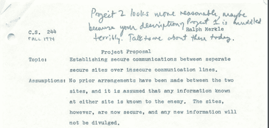
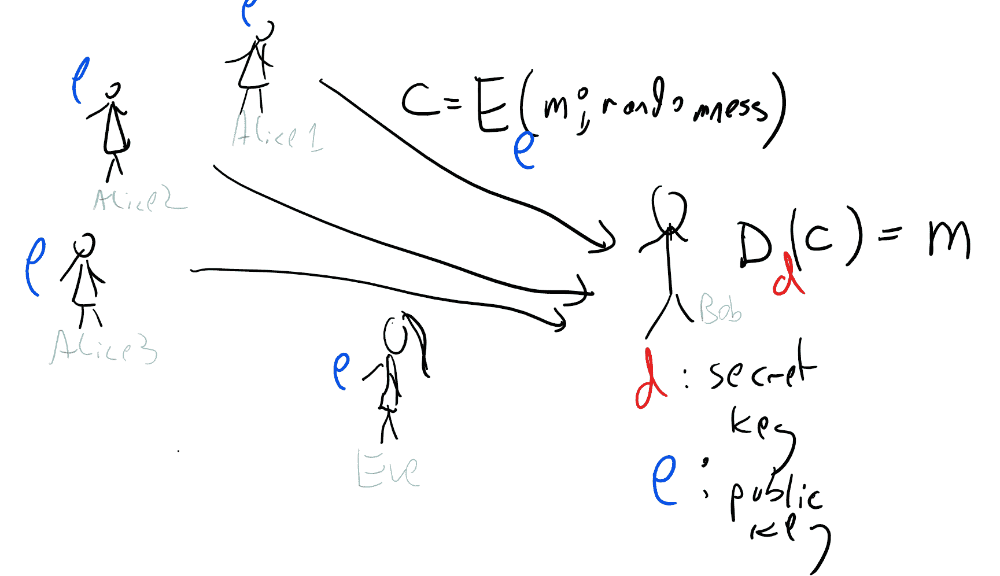
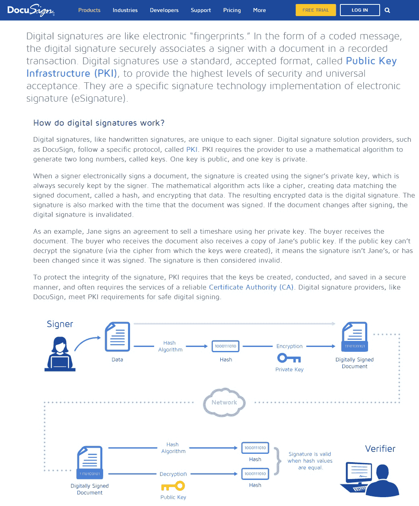

# 公钥密码学

> 原文：[`intensecrypto.org/public/lec_10_public_key_intro.html`](https://intensecrypto.org/public/lec_10_public_key_intro.html)

*发现任何错误/打字错误/令人困惑的解释？[在 GitHub 上打开问题](https://github.com/boazbk/crypto/issues/new)。您也可以在下面评论*

**★ 另请参阅本章的[PDF 版本](https://files.boazbarak.org/crypto/lec_10_public_key_intro.pdf)（更好的格式/参考文献）★**

人们梦想着比空气重的飞行，至少可以追溯到达芬奇的时代（更不用说希腊神话中的伊卡洛斯了）。儒勒·凡尔纳在 1865 年就详细描述了去月球的过程。然而，据我所知，直到大约 50 年前，没有人考虑过在没有首先交换共享密钥的情况下安全通信的可能性。考虑到人们使用秘密写作已经有数千年的历史，这一点令人惊讶。然而，在 20 世纪 60 年代末和 70 年代初，一些人开始质疑这种“常识”。

其中最令人惊讶的这些先知之一是加州大学伯克利分校的一名本科生，名叫拉尔夫·默克尔。1974 年秋季，他为计算机安全课程写了一个[项目提案](http://www.merkle.com/1974/)，尽管

> *“直观上可能看起来很明显，如果两个人从未有机会预先安排加密方法，那么他们将在不安全的通道上无法安全通信……我认为这是错误的。”*

默克尔还觉得加上“不，我没有开玩笑。”这一点很重要。他的项目提案被教授以“不够好”为由拒绝。默克尔后来向 ACM 通信提交了一篇论文，他在论文中为缺乏参考文献道歉，因为他无法在科学文献中找到任何关于这个问题的提及，而他在科幻故事中甚至看到了这个问题被提出。论文被拒绝，评论说“经验表明，在明文中传输密钥信息极其危险。”默克尔表明，可以设计一个协议，其中 Alice 和 Bob 可以使用\(T\)次哈希函数调用来交换密钥，但攻击者（在随机预言模型中，尽管他当然没有使用这个名字）需要大约\(T²\)次调用才能破解它。他推测，可能存在这样的协议，破解比使用它们更难，但他想不出任何具体的方法来实现这一点。

9.1：拉尔夫·默克尔在加州大学伯克利分校 CS 244 项目提案中开发公钥密码学

我们直到很久以后才得知，在默克尔的几年之前，即 20 世纪 60 年代末，英国情报机构 GCHQ 的詹姆斯·埃利斯[有着类似的思考](http://cryptome.org/jya/ellisdoc.htm)。他的好奇心是由一份来自贝尔实验室的二战旧手稿引发的，该手稿提出了以下方式，即两个人可以通过电话线安全地通信。爱丽丝会在电话线中注入噪声，鲍勃会传递他的信息，然后爱丽丝会减去噪声以获取信号。这个想法是，线路另一端的对手只能看到爱丽丝和鲍勃信号的叠加，而不知道信号来自哪里。这让詹姆斯·埃利斯开始思考，是否有可能在数字上实现类似的东西。正如他后来回忆的那样，1970 年他意识到在原则上这是可能的。他想到了一个假设的黑盒 \(B\)，当输入一个“处理” \(\alpha\) 和明文 \(p\) 时，会给出一个“密文” \(c\)。会有一个与 \(\alpha\) 对应的密钥 \(\beta\)，将 \(\beta\) 和 \(c\) 输入盒子中可以恢复 \(p\)。然而，埃利斯并不知道如何实际实现这个盒子。他和其他人一直把这个问题作为一个谜题给聪明的应届新员工，直到其中一位，克利福德·科克斯，在 1973 年提出了一个基于分解问题的候选解决方案；1974 年，另一位 GCHQ 新员工，马尔科姆·威廉森，提出了一个使用模幂运算的解决方案。

但在所有考虑公钥密码学的人中，可能看到最远的是斯坦福大学的两位研究人员，Whit Diffie 和 Martin Hellman。他们意识到，随着电子通信的出现，密码学将在间谍和潜艇的军事领域之外找到新的应用。他们明白，在这个拥有众多用户和点对点通信的新世界中，密码学需要扩展。他们设想了一个我们现在称之为“门限排列”的对象，尽管他们称之为“单向门限函数”或有时简单地称为“公钥加密”。这是一个排列集合 \(\{ p_k \}\)，其中 \(p_k\) 是在（比如说）\(\{0,1\}^{|k|}\) 上的排列，并且映射 \((x,k)\mapsto p_k(x)\) 可以高效计算，*但*反向映射 \((k,y) \mapsto p_k^{-1}(y)\) 计算起来很困难。然而，也存在一些秘密密钥 \(s(k)\)（即“门限”），使用 \(s(k)\) 可以高效地计算 \(p^{-1}_k\)。他们的想法是，使用这样的门限排列，Alice 知道 \(s(k)\) 就能够将 \(k\) 发布在某个公开文件上，这样任何想要给她发送消息 \(x\) 的人都可以通过计算 \(p_k(x)\) 来做到。 （虽然今天我们知道，由于 Goldwasser 和 Micali 的工作，这种确定性加密不是一个好主意，但在当时，Diffie 和 Hellman 有着惊人的直觉，但并没有真正有适当的安全定义。）但他们并没有止步于此。他们意识到，保护通信的*完整性*与保护其*机密性*同样重要。因此，他们想象 Alice 可以“逆向运行加密”来证明或*签名*消息。也就是说，给定某些消息 \(m\)，Alice 会发送值 \(x=p_k^{-1}(h(m))\)（对于一个哈希函数 \(h\)）作为她支持 \(m\) 的证明方式，并且任何知道 \(k\) 的人都可以通过检查 \(p_k(x)=h(m)\) 来验证这一点。

在这个时候，Diffie 和 Hellman 处于与过去一些物理学家相似的位置，他们预测某种粒子应该存在，但没有实验验证。幸运的是，他们[遇到了 Ralph Merkle](http://cr.yp.to/bib/1988/diffie.pdf)。他对概率性*密钥交换协议*的想法，以及他们斯坦福同事[John Gill](https://profiles.stanford.edu/john-gill)的建议，激发了他们提出今天所知的*Diffie-Hellman 密钥交换*（他们不知道，两年前 GCHQ 的 Malcolm Williamson 已经找到了一个类似的协议）。他们在 1976 年发表了论文“Cryptography 的新方向”（https://www-ee.stanford.edu/~hellman/publications/24.pdf），这篇论文被认为是现代密码学的诞生。然而，他们仍然没有找到他们所追求的陷门函数。这是 Rivest，Shamir 和 Adleman 在第二年完成的，他们提出了 RSA 陷门函数，通过 Diffie 和 Hellman 的框架，不仅提供了加密，还提供了签名（这实际上是 GCHQ 的 Clifford Cocks 早些时候发现的相同函数，尽管据我所知，Cocks，Ellis 和 Williamson 没有意识到其应用于数字签名的应用）。从这一点开始，密码学领域开始了一系列的快速发展，直到今天仍未真正放缓。

9.2：John T. Gill III。Gill 建议 Diffie 和 Hellman 使用模幂运算作为单向函数，这（连同 Merkle 的想法）使得今天所知的*Diffie-Hellman 密钥交换协议*成为可能。

## 私钥密码学回顾

在我们开始探索*公钥密码学*的奇妙旅程之前，让我们简要回顾一下我们关于*私钥密码学*所学的知识。这部分内容主要涵盖在 Katz Lindell（KL）的书籍的第一章到第九章以及 Boneh Shoup（BS）书籍的第一部分（第一章到第九章）。现在正是你阅读这些书籍中相应证明的好时机。通常，看到相同的证明以略微不同的方式呈现是有帮助的。以下是对我们在课堂上看到的某些各种缩减的回顾，以及指向 Katz-Lindell（第 2 版）和 Boneh-Shoup 书籍中相应章节的指针。这些内容也在[Rosulek 的书籍](https://web.engr.oregonstate.edu/~rosulekm/crypto/)中有涉及。

+   伪随机生成器（PRG）长度扩展（从\(n+1\)输出 PRG 到\(poly(n)\)输出 PRG）：KL 7.4.2，BS 3.4.2

+   PRG 到伪随机函数（PRF）：KL 7.5，BS 4.6

+   PRF 到选择明文攻击（CPA）安全加密：KL 3.5.2，BS 5.5

+   PRF 到安全的消息认证码（MAC）：KL 4.3，BS 6.3

+   MAC 加上 CPA 安全加密到选择密文攻击（CCA）安全加密：BS 4.5.4，BS 9.4

+   伪随机排列（PRP）到 CPA 安全加密/块加密模式：KL 3.5.2，KL 3.6.2，BS 4.1，4.4，5.4

+   哈希函数应用：指纹识别、Merkle 树、密码：KL 5.6，BS 第八章

+   电话掷硬币：我们在课堂上看到了一个使用伪随机生成器构建的**承诺方案**的构造。这可以在 BS 3.12 中找到，KL 5.6.5 展示了使用随机预言机的另一种构造。

+   从 PRF 到 PRP 的构造：我们只概述了可以在 KL 7.6 或 BS 4.5 中找到的构造。

在本课程中我们没有讨论的一个重要点是**单向函数**。单向函数的定义相当简单：

函数\(f:\{0,1\}^*\rightarrow\{0,1\}^*\)是**单向函数**，如果它是可高效计算的，并且对于每个\(n\)和一个\(poly(n)\)时间内的对手\(A\)，\(A(f(x))\)输出\(x'\)且\(f(x')=f(x)\)的概率是可忽略的。

“OWF 猜想”是单向函数存在的猜想。它成为大量私钥密码学的必要且充分条件。也就是说，以下定理是已知的（通过结合许多人的工作）：

以下内容是等价的：

+   单向函数存在

+   存在伪随机生成器（具有非平凡扩展）

+   伪随机函数存在

+   存在 CPA 安全的私钥加密

+   存在 CCA 安全的私钥加密

+   消息认证码存在

+   存在承诺方案

该定理证明中的关键结果是 Hastad、Impagliazzo、Levin 和 Luby 的结果，即如果存在单向函数，则存在伪随机生成器。如果您想了解更多信息，请参阅[Vadhan 的伪随机性专著](https://people.seas.harvard.edu/~salil/pseudorandomness/)的第七章。KL 书中第 7.2-7.4 节也涵盖了当单向函数是\(\{0,1\}^n\)上的**排列**时该定理的一个特殊情况。这个证明在 Haitner、Holenstein、Reingold、Vadhan、Wee 和 Zheng 的工作中得到了相当大的简化并进行了定量改进。更多关于这个证明的信息，请参阅[Salil Vadhan 的这次演讲](http://people.seas.harvard.edu/~salil/research/CompEnt-abs.html)。还可以参阅我在普林斯顿关于这个主题的研讨会上的[这些讲义](http://www.cs.princeton.edu/courses/archive/spring08/cos598D/scribe3.pdf)（尽管自那时以来，上述工作已经简化了证明）。

我们没有深入讨论的另一个主题是针对私钥密码系统的攻击。这些攻击通常通过“打开黑盒”并查看分组密码或哈希函数的内部操作来实现。然后我们给各种内部寄存器分配变量，并寻找满足这些变量之间某些非平凡关系的输入集合。这是一个相当模糊的描述，但你可以阅读 KL 的第 6.2.6 节关于 *线性* 和 *差分* 密码分析，以及 BS 的第 3.7-3.9 节和第 4.3 节以获取更多信息。还可以参考[Adi Shamir 的课程](http://www.cs.tau.ac.il/~tromer/SKC2006/)，以及 Dunkelman 关于分析[分组密码](https://www.cs.haifa.ac.il/~orrd/BlockCipherSeminar/)和[哈希函数](https://www.cs.haifa.ac.il/~orrd/HashFuncSeminar/)的课程。还有对公钥和私钥密码的 *侧信道攻击* 的迷人领域，参见[Tromer 的课程](http://www.cs.tau.ac.il/~tromer/istvr1516.html)。

在本次讲座中，我们将讨论 *数字签名*，它是消息认证码的公钥对应物。令人惊讶的是，尽管它是一个“公钥”对象，但数字签名可以基于单向函数（这是通过 Lamport、Merkle、Goldwasser-Goldreich-Micali、Naor-Yung 和 Rompel 的想法实现的）。然而，这些构造并不非常高效（这可能是有内在原因的），因此在实际中，人们使用的是使用与公钥加密类似的技术构建的数字签名。

## 公钥加密：定义

我们现在讨论如何定义公钥加密的安全性。如上所述，密码学家们花费了相当长的时间才得出“正确”的定义，但为了节省时间，我们将直接跳到目前的标准基本概念（也参见图 9.3）：

9.3：在公钥加密中，接收者 Bob 生成一个 *密钥对* \((e,d)\)。*加密密钥* \(e\) 用于加密，而*解密密钥*用于解密。我们称之为公钥系统，因为该方案的安全性不依赖于对手 Eve 不知道加密密钥。因此，Bob 可以向大量潜在接收者公布密钥 \(e\)，同时仍然确保他接收到的消息的机密性。

如果一个由三个高效算法 \((G,E,D)\) 组成的三元组满足以下条件，则它是一个长度函数 \(\ell:\N \rightarrow \N\) 的 *公钥加密方案*：

+   \(G\) 是一种称为 *密钥生成算法* 的概率算法，它接受输入 \(1^n\) 并输出一个关于密钥对 \((e,d)\) 的分布。

+   \(E\) 是一种 *加密算法*，它接受一对输入 \(e,m\)，其中 \(m\in \{0,1\}^{\ell(n)}\)，并输出 \(c=E_e(m)\)。

+   \(D\) 是一种 *解密算法*，它接受一对输入 \(d,c\)，并输出 \(m'=D_d(c)\)。

+   对于每一个 \(m\in\{0,1\}^{\ell(n)}\)，在 \(G(1^n)\) 从 \((e,d)\) 的选择和 \(E\)、\(D\) 的硬币的选择上，以 \(1-negl(n)\) 的概率输出 \(D_d(E_e(m))=m\)。

定义 9.5 仅指公钥加密方案的有效性，即我们可以使用密钥 \(e\) 和 \(d\) 分别进行加密和解密，但不是指其安全性。公钥加密的安全性的标准定义是 CPA 安全：

如果 \((G,E,D)\) 是 *CPA 安全* 的，我们说它意味着每一个有效的敌手 \(A\) 在以下游戏中获胜的概率最多为 \(1/2+negl(n)\)：

+   \((e,d) \leftarrow_R G(1^n)\)

+   \(A\) 被赋予 \(e\) 并输出一对消息 \(m_0,m_1 \in \{0,1\}^n\)。

+   \(A\) 被赋予 \(c=E_e(m_b)\) 对于 \(b\leftarrow_R\{0,1\}\)。

+   \(A\) 输出 \(b'\in\{0,1\}\)，如果 \(b'=b\) 则 *获胜*。

尽管这是一种“选择明文攻击”，但在公钥设置中，我们并没有明确地给 \(A\) 访问加密预言机的权限。请确保你理解为什么给予它这样的访问权限并不会赋予它更多的权力。

公钥加密的一个隐喻是一个“自锁锁”，你不需要钥匙来 *锁上它*（而是简单地推动锁链直到它咔哒一声锁上），但你确实需要钥匙来 *解锁* 它。所以，如果 Alice 生成 \((e,d)=G(1^n)\)，那么 \(e\) 作为“锁”可以用来为 Alice 加密消息，而只有 \(d\) 可以用来解密这些消息。另一种思考方式是，\(e\) 是一个“跛脚钥匙”，只能用于 \(d\) 的某些功能。

### 混淆范式

为什么有人会想象这样一个神奇的对象能够存在呢？詹姆斯·艾利斯以及迪菲和赫尔曼的写作都表明，他们的思考过程大致如下。你想象一个“魔法黑盒” \(B\)，如果所有各方都能访问 \(B\)，那么我们就可以得到一个公钥加密方案。现在，如果公钥加密是不可能的，这意味着对于每一个可能的程序 \(P\)，它计算 \(B\) 的功能，如果我们把 \(P\) 的代码分发给所有各方，那么我们就不会得到一个安全的加密方案。这意味着无论对手得到什么程序 \(P\)，她总是会从那段代码中获取一些信息，这些信息有助于破解加密，即使如果 \(P\) 是一个黑盒，她本来是无法破解的。现在，直观地理解任意代码是一个非常困难的问题，所以迪菲和赫尔曼想象，可能将这个理想的 \(B\) 编译成足够低级的汇编语言，使其表现得像一个“虚拟黑盒”。

尤其是如果你取，比如说，一个特定密钥 \(k\) 的块加密的编码过程 \(m \mapsto p_k(m)\)，并通过一个优化编译器运行它，你可能会希望虽然使用生成的可执行文件执行这个映射是可能的，但从中提取 \(k\) 会很困难。因此，你可以将此代码视为“公钥”。这表明了获取加密方案的方法：

> **“基于混淆的公钥加密”：**（思想实验 - 并非实际构造）
> 
> **成分：**
> 
> *(i)* 一个伪随机排列集合 \(\{ p_k \}_{k\in \{0,1\}^*}\)，其中对于每一个 \(k\in \{0,1\}^n\)，\(p_k:\{0,1\}^n \rightarrow \{0,1\}^n\)
> 
> *(ii)* 一个“混淆编译器”多项式时间内可计算的 \(O:\{0,1\}^* \rightarrow \{0,1\}^*\)，使得对于每一个电路 \(C\)，\(O(C)\) 是一个计算与 \(C\) 相同函数的电路。
> 
> **操作：**
> 
> +   *密钥生成：* 私钥是 \(k \leftarrow_R \{0,1\}^n\), 公钥是 \(E=O(C_k)\)，其中 \(C_k\) 是将 \(x\in \{0,1\}^n\) 映射到 \(p_k(x)\) 的电路。
> +   
> +   *加密：* 使用公钥 \(E\) 加密 \(m\in \{0,1\}^n\)，选择 \(\ensuremath{\mathit{IV}} \leftarrow_R \{0,1\}^n\) 并输出 \((\ensuremath{\mathit{IV}}, E(x \oplus \ensuremath{\mathit{IV}}))\)。
> +   
> +   *解密：* 使用密钥 \(k\) 解密 \((\ensuremath{\mathit{IV}},y)\)，输出 \(\ensuremath{\mathit{IV}} \oplus p_k^{-1}(y)\)。

Diffie 和 Hellman 实际上找不到使这成为可能的方法，但这使他们相信这种公钥的概念并不是*本质上不可能的*。将程序编译成功能等效但“难以理解”的形式的概念被称为*软件混淆*。它已经证明是一个相当棘手的对象，既难以形式化定义，也难以实现，但它为可以取得什么成果提供了很好的直觉，即使，就像随机预言机一样，这种直觉有时可能过于乐观。（事实上，如果软件混淆是可能的，那么我们可以通过取一个从 PRF 族中选择的函数 \(f_k\) 的代码并通过混淆编译器编译它来获得一个“类似随机预言机”的哈希函数。）

我们现在不会正式定义混淆器，但在直观层面上，它将是一个编译器，它接受一个程序 \(P\) 并将其映射到一个程序 \(P'\)，使得：

+   \(P'\) 并不比 \(P\) 慢多少/大多少（例如，作为一个布尔电路，它最多是多项式级别的更大）。

+   \(P'\) 与 \(P\) 功能上等价，即对于每一个输入 \(x\)，\(P'(x)=P(x)\)。^(1)

+   \(P'\) 在某种意义上是“难以理解的”，即看到 \(P'\) 的代码并不比获得 \(P\) 的*黑盒访问*更有信息量。

让我再强调一次，没有已知构造的混淆器能够实现与这个定义类似的结果。事实上，这个定义最自然的正式化是 [不可能](https://www.boazbarak.org/Papers/obfuscate.pdf) 实现的（正如我们可能在课程中稍后看到的）。只有最近（令人兴奋！）才取得了对混淆器类似概念的重大进展，这些概念足够强大，可以实现这些和其他应用，但也有一些重要的限制，参见 [我对这个主题的调查](https://eprint.iacr.org/2016/210) 和一篇更近期的 [Quanta 文章](https://www.quantamagazine.org/computer-scientists-achieve-crown-jewel-of-cryptography-20201110/)。

然而，当试图发挥想象力来考虑在密码学中可能实现的惊人可能性时，首先问问自己如果所有相关人员都能访问一个魔法黑盒会怎样，这并不是一个坏的经验法则。这对迪菲和赫尔曼来说确实很有效。

## 一些具体的候选者：

我们本希望证明一个形式为的定理：

> **“定理”**：如果 PRG 猜想是正确的，那么存在一个 CPA-安全的公钥加密。

这意味着我们不需要假设比已经最小的伪随机生成器（或等价地，单射函数）更多的东西来获得公钥密码学。不幸的是，没有这样的结果（这可能[固有](https://www.cs.virginia.edu/~mohammad/files/papers/MerkleFull.pdf)）。我们已知的结果具有以下形式：

> **定理**：如果问题 \(X\) 是困难的，那么存在一个 CPA-安全的公钥加密。

在这里，\(X\) 是人们试图解决但未能解决的问题。因此，我们有各种 *候选者* 用于公钥加密，我们热切地希望其中至少有一个实际上是安全的。密码学的 [一个不为人知的秘密](https://eprint.iacr.org/2017/365.pdf) 是我们实际上并没有那么多候选者。我们实际上只有两个研究得很好的家族.^(2) 其中一个是“群论”家族，它依赖于离散对数（在模算术或椭圆曲线上）或整数分解问题的难度。另一个是“编码/格论”家族，它依赖于解决噪声线性方程或相关问题的难度，例如在 *格* 中找到短向量以及解决“背包”问题的实例。此外，已知第一个家族中的问题在名为“量子计算”的计算模型中是 *有效可解* 的。如果存在模拟此模型的大规模物理设备，即 *量子计算机*，那么它们可以破解所有依赖于这些问题的密码系统，我们将只剩下一种 *单一* 的候选公钥加密方案。

我们将首先描述基于第一类（在发现其他之前被发现并更广泛实施）的密码系统，并在未来的讲座中讨论第二类。

### Diffie-Hellman 加密（又称 El-Gamal）

Diffie-Hellman 公钥系统建立在假设的**离散对数问题**难度之上：

对于任何数 \(p\)，令 \(\Z_p\) 是由 \(\{0,\ldots,p-1\}\) 组成的数集，其中加法和乘法是在模 \(p\) 下进行的。我们将考虑大小大约为 \(2^n\) 的数 \(p\)，因此可以用大约 \(n\) 位来描述。我们可以清楚地在 \(poly(n)\) 时间内对这些数进行模 \(p\) 的乘法和加法。如果 \(g\in \Z_p\) 且 \(a\) 是任何自然数，我们可以定义 \(g^a\) 为 \(g\cdot g \cdots g\) (\(a\) 次)。事先，人们可能会认为计算 \(g^a\) 可能需要 \(a\cdot poly(n)\) 的时间，如果 \(a\) 本身大约是 \(2^n\)，这可能是指数级的。然而，我们可以使用**重复平方技巧**在 \(poly((\log a) \cdot n)\) 时间内计算这个值。这个想法是，如果 \(a=2^{\ell}\)，那么我们可以通过平方 \(g\) \(\ell\) 次来计算 \(g^a\)，而一个一般的 \(a\) 可以通过二进制表示分解成二的幂。

**离散对数**问题是在给定 \(g,h \in \Z_p\) 的情况下计算一个数 \(a\)，使得 \(g^a=h\)。如果这样的解 \(a\) 存在，那么总是也存在一个大小不超过 \(p\) 的解（你能看到为什么吗？），因此解可以用 \(n\) 位表示。然而，目前已知的最优算法计算离散对数的时间大约是 \(2^{n^{1/3}}\)，当 \(p\) 是长度约为 \(2048\) 位的质数时，这目前是过于昂贵的.^(3)

约翰·吉尔建议迪菲和赫尔曼，模幂运算可以是他们寻找的“易于计算但难以逆转”函数的良好来源。迪菲和赫尔曼基于以下公钥加密方案：

+   **密钥生成算法**，在输入 \(n\) 后，从 \(n\) 位描述的质数 \(p\) 中采样（即，在 \(2^{n-1}\) 到 \(2^n\) 之间），一个数 \(g\leftarrow_R \Z_p\) 和 \(a \leftarrow_R \{0,\ldots,p-1\}\)。我们还采样一个哈希函数 \(H:\{0,1\}^n\rightarrow\{0,1\}^\ell\)。公钥 \(e\) 是 \((p,g,g^a,H)\)，而密钥 \(d\) 是 \(a\).^(4)

+   **加密算法**，在输入一个消息 \(m \in \{0,1\}^\ell\) 和公钥 \(e=(p,g,h,H)\) 后，将选择一个随机的 \(b\leftarrow_R \{0,\ldots,p-1\}\) 并输出 \((g^b,H(h^b)\oplus m)\)。

+   **解密算法**，在输入密文 \((f,y)\) 和密钥后，将输出 \(H(f^a) \oplus y\)。

解密算法的正确性可以从以下事实得出：\((g^a)^b = (g^b)^a = g^{ab}\)，因此加密算法计算出的\(H(h^b)\)与解密算法计算出的\(H(f^a)\)的值相同。离散对数和 Diffie-Hellman 系统之间有一个简单的关系：

如果存在一个多项式时间算法可以解决离散对数问题，那么 Diffie-Hellman 系统是*不安全的*。

使用离散对数算法，我们可以从公钥中存在的参数\(p,g,g^a\)计算出私钥\(a\)，显然一旦我们知道私钥，我们就可以解密任何我们选择的消息。

不幸的是，在另一个方向上没有已知这样的结果。然而，我们可以证明，在随机预言模型下，假设从\(g^a\)和\(g^b\)计算\(g^{ab}\)（现在称为*Diffie-Hellman 问题*）是困难的，那么这个协议是安全的。

> **计算 Diffie-Hellman 假设：** 设\(\mathbb{G}\)是一个元素可以用\(n\)位描述的群，它有一个可以在\(poly(n)\)时间内计算的关联和交换乘法操作。如果对于\(\mathbb{G}\)的每个生成元（见下文）\(g\)和有效的算法\(A\)，\(A\)在输入\(g,g^a,g^b\)时输出元素\(g^{ab}\)的概率是\(n\)的函数且可以忽略不计，那么*计算 Diffie-Hellman (CDH)*假设在群\(\mathbb{G}\)中成立。\(^(5)\)

尤其我们可以做出以下猜想：

> **模素数群的计算 Diffie-Hellman 猜想：** 对于一个随机的\(n\)位素数和一个随机的\(g \in \mathbb{Z}_p\)，CDH 在群\(\mathbb{G} = \{ g^a \mod p \;| a\in \mathbb{Z} \}\)中成立。

即，对于每个多项式\(q:\N \rightarrow \N\)，如果\(n\)足够大，那么在从\([2^n]\)中选择一个均匀的素数\(p\)和\(g\in \Z_p\)时，至少有\(1-1/q(n)\)的概率，对于大小不超过\(q(n)\)的每个电路\(A\)，\(A(g,p,g^a,g^b)\)输出\(h\)的概率至多为\(1/q(n)\)，这里的概率是在\(\Z_p\)中随机选择\(a,b\)的情况下取的。（在实践中，人们通常取\(g\)为比\(p\)小得多的群的一个生成元，这使得\(a,b\)可以更小，从而使得乘法更有效；我们在讨论中忽略了这种优化。）

请您花时间仔细重读以下猜想，直到您确信您理解了它的含义。维克多·休普的杰出且在线可用的书籍[A Computational Introduction to Number Theory and Algebra](http://www.shoup.net/ntb/)对群、生成元和离散对数以及 Diffie-Hellman 问题进行了深入探讨。参见 Boneh-Shoup 书籍的第 10.4 和 10.5 章，以及 Katz-Lindell 书籍的第 8.3 和 11.4 章。本章末尾也有解决好的群论练习题。

假设对于模素数群的计算 Diffie-Hellman 假设是正确的。那么，Diffie-Hellman 公钥加密在随机预言机模型中是 CPA 安全的。

对于 CPA 安全性，我们需要证明（对于固定大小为 \(p\) 的 \(\mathbb{G}\) 和随机预言机 \(H\)），以下两个分布对于每对字符串 \(m,m' \in \{0,1\}^\ell\) 在计算上是不可区分的：

+   对于 \(a,b\) 在 \(\Z_{p}\) 中均匀独立地选择的情况，\((g^a,g^b,H(g^{ab})\oplus m)\)。

+   对于 \(a,b\) 在 \(\Z_{p}\) 中均匀独立地选择的情况，\((g^a,g^b,H(g^{ab})\oplus m')\)。

（你能看出这为什么意味着 CPA 安全吗？你应该在这里停下来验证这一点！）

我们做出以下断言：

**断言：** 对于固定大小为 \(p\) 的 \(\mathbb{G}\)，生成元 \(g\)，以及给定的随机预言机 \(H\)，如果存在一个大小为 \(T\) 的区分器 \(A\)，在 \((g^a,g^b,H(g^{ab}))\) 分布和 \((g^a,g^b,U_\ell)\) 分布之间具有 \(\epsilon\) 的优势（其中 \(a,b\) 在 \(\Z_{p}\) 中均匀独立地选择），那么存在一个大小为 \(poly(T)\) 的算法 \(A'\) 可以解决与 \(\mathbb{G},g\) 相关的 Diffie-Hellman 问题，成功概率至少为 \(\epsilon\)。也就是说，对于随机的 \(a,b \in \Z_p\)，\(A'(g,g^a,g^b)=g^{ab}\) 的概率至少为 \(\epsilon/(2T)\)。

**断言的证明：** 证明很简单。我们声称，在上述假设下，\(A\) 以至少 \(\epsilon/2\) 的概率向其预言机 \(H\) 发出查询 \(g^{ab}\)，因为否则，根据“懒惰评估”范式，我们可以假设 \(H(g^{ab})\) 在 \(A\) 的攻击完成后独立随机选择，因此（在假设攻击者没有进行该查询的条件下），值 \(H(g^{ab})\) 与均匀输出是不可区分的。因此，在输入 \(g,g^a,g^b\) 的情况下，\(A'\) 可以模拟 \(A\) 并随机输出 \(A\) 向 \(H\) 发出的最多 \(T\) 个查询之一，并且成功的概率至少为 \(\epsilon/(2T)\)。

现在给定该断言，我们可以通过以下混合分布来完成安全性的证明。定义以下“混合”分布（在所有情况下 \(a,b\) 都在 \(\Z_{p}\) 中均匀独立地选择）：

+   \(H_0\): \((g^a,g^b,H(g^{ab}) \oplus m)\)

+   \(H_1\): \((g^a,g^b,U_\ell \oplus m)\)

+   \(H_2\): \((g^a,g^b,U_\ell \oplus m')\)

+   \(H_3\): \((g^a,g^b,H(g^{ab}) \oplus m')\)

该断言意味着 \(H_0 \approx H_1\)。实际上，否则我们可以将一个区分器 \(T\) 从 \(H_0\) 和 \(H_1\) 转换为区分器 \(T'\)，通过让 \(T'(h,h',z) = T(h,h',z \oplus m)\) 违反该断言。

通过与一次性密码的安全性相同的论证，\(H_1\) 和 \(H_2\) 的分布是“相同”的（因为 \(U_\ell \oplus m\) 与 \(U_\ell\) 相同）。

通过与 \(H_0 \approx H_1\) 相同的论证，\(H_2\) 和 \(H_3\) 在计算上是不可区分的。

一起这些意味着 \(H_0 \approx H_3\)，从而得出该方案是 CPA 安全的。

如果我们假设一个更强的变体，即所谓的*决策性 Diffie-Hellman (DDH)*假设，那么我们可以为这个协议得到安全结果，而无需随机预言机：对于随机的 \(a,b, u \in \mathbb{Z}_p\)（素数 \(p\)），三元组 \((g^a, g^b, g^{ab})\approx (g^a, g^b, g^u)\)。这暗示了 CDH（你能看到原因吗？）。DDH 还限制我们的关注点在素数阶的群上。特别是，DDH 在偶数阶群中不成立。例如，DDH 在 \(\mathbb{Z}^{\*}_p=\{1,2\ldots p-1\}\)（以模 \(p\) 的乘法为群运算）中不成立，因为其一半的元素是二次剩余，并且使用费马小定理测试一个元素是否是二次剩余是高效的（你能看到原因吗？参见练习 10.7）。然而，DDH 在 \(\mathbb{Z}^{\*}_p\) 的素数阶子群中成立。如果 \(p\) 是安全素数（即 \(p=2q+1\) 对于一个素数 \(q\)），那么我们可以使用二次剩余的子群，它有素数阶 \(q\)。参见 Boneh-Shoup 10.4.1 以获取关于 CDH 和 DDH 的潜在群体的更多详细信息。

如前所述，Diffie-Hellman 系统可以使用许多阿贝尔群的变体运行。当然，对于其中的一些群，离散对数问题可能很容易，因此它们不适合用于此系统。已经提出的一个变体是[椭圆曲线密码学](https://en.wikipedia.org/wiki/Elliptic_curve_cryptography)。这是一个由形式为 \((x,y,z)\in \Z_p³\) 的点组成的群，这些点满足某个方程，其中乘法可以以某种方式定义。椭圆曲线密码学的主要优势是，已知的最优算法运行时间约为 \(2^{\approx n}\)，而相比之下，\(2^{\approx n^{1/3}}\)，这使得密钥可以更短。不幸的是，椭圆曲线密码学与 \(\Z_p\) 上的离散对数问题一样容易受到量子算法的影响。

在大多数密码学文献中，上述协议被称为*Diffie-Hellman 密钥交换*协议，当作为公钥系统考虑时，有时也被称为*ElGamal 加密*。6 的原因主要源于早期对正确安全定义的混淆。Diffie 和 Hellman 认为加密是一个*确定性*过程，因此他们将他们的方案称为“密钥交换协议”。Goldwasser 和 Micali 的工作表明，加密必须是概率性的才能保证安全。此外，由于效率考虑，如今公钥加密主要用作交换私钥加密密钥的机制，然后用于大部分通信。这意味着区分两消息密钥交换算法和公钥加密没有太多意义。

### 随机素数采样

为了采样一个随机的 \(n\) 位质数，可以采样一个随机数 \(0 \leq p < 2^n\)，然后测试 \(p\) 是否为质数。如果不是质数，则可以再次采样一个新的随机数。为了使这可行，我们需要证明两个性质：

*高效测试：* 存在一个 \(poly(n)\) 时间复杂度的算法来测试一个 \(n\) 位数字是否为质数。实际上，存在这样的 [已知算法](https://en.wikipedia.org/wiki/Primality_test)。自 1970 年代以来，已经知道有 *随机化* 算法。此外，在 2002 年的一个突破中，[Manindra Agrawal, Neeraj Kayal 和 Nitin Saxena](https://goo.gl/nycWFA)（来自印度理工学院坎普尔的教授和两名本科生）提出了第一个测试质数的确定性多项式时间算法。

*质数密度：* 随机 \(n\) 位数字是质数的概率至少为 \(1/poly(n)\)。实际上，根据 [质数定理](https://goo.gl/ChrXJY)，这个概率实际上是 \(1/\ln(2^n)=\Omega(1/n)\)。然而，为了完整性，我们下面简要地论证这个概率至少为 \(\Omega(1/n²)\)。

介于 \(1\) 和 \(N\) 之间的质数的数量是 \(\Omega(N/\log N)\)。

回想一下，两个或更多 \(a_1,\ldots,a_t\) 的 *最小公倍数（LCM）* 是最小的能被所有 \(a_i\) 整除的数。计算 \(a_1,\ldots,a_t\) 的 LCM 的一种方法是对所有 \(a_i\) 进行质因数分解，然后 LCM 是这些分解中出现的所有质数的乘积，每个质数取其在分解中出现的最高幂次。设 \(k\) 是介于 \(1\) 和 \(N\) 之间的质数的数量。以下两个断言将导致该引理：

**断言 1：** \(\ensuremath{\mathit{LCM}}(1,\ldots,N) \leq N^k\)。

**断言 2：** 如果 \(N\) 是奇数，那么 \(\ensuremath{\mathit{LCM}}(1,\ldots,N) \geq 2^{N-1}\)。

这两个断言立即导致结果，因为它们意味着 \(2^{N-1} \leq N^k\)，取对数后得到 \(N-1 \leq k \log N\) 或 \(k \geq (N-1)/\log N\)。（我们可以假设 \(N\) 是奇数，因为将 \(N\) 改为 \(N+1\) 最多只会改变质数的数量一个单位。）因此，剩下的只是证明这两个断言。

**对断言 1 的证明：** 设 \(p_1,\ldots,p_k\) 是介于 \(1\) 和 \(N\) 之间的所有质数，设 \(e_i\) 是满足 \(p_i^{e_i} \leq N\) 的最大整数，且 \(L = p_1^{e_1} \cdots p_k^{e_k}\)。由于 \(L\) 是 \(k\) 个项的乘积，每个项的大小最多为 \(N\)，因此 \(L \leq N^k\)。但我们的断言是每个数 \(1 \leq a \leq N\) 都能整除 \(L\)。实际上，\(a\) 的质因数分解中的每个质数 \(p\) 都是 \(p_i\) 之一，并且由于 \(a \leq N\)，\(p\) 在 \(a\) 中出现的幂次最多为 \(e_i\)。根据最小公倍数的定义，这意味着 \(\ensuremath{\mathit{LCM}}(1,\ldots,N) \leq L\)。QED（断言 1）

**命题 2 的证明：** 考虑积分 \(I=\int_0¹ x^{(N-1)/2}(1-x)^{(N-1)/2} dx\)。这显然是一个正数，所以 \(I>0\)。一方面，对于零和一之间的每个 \(x\)，\(x(1-x) \leq 1/4\)，因此 \(I\) 至多为 \(4^{-(N-1)/2}=2^{-N+1}\)。另一方面，多项式 \(x^{(N-1)/2}(1-x)^{(N-1)/2}\) 是一个最高次数为 \(N-1\) 的整数系数多项式，因此 \(I=\sum_{k=0}^{N-1} C_k \int_0¹ x^k dx\)，其中 \(C_0,\ldots,C_{N-1}\) 是一些整数系数。由于 \(\int_0¹ x^k dx = \tfrac{1}{k+1}\)，我们看到 \(I\) 是一个分子为整数、分母最多为 \(N\) 的分数之和。由于所有分母都最多为 \(N\) 且 \(I>0\)，因此 \(I \geq \tfrac{1}{LCM(1,\ldots,N)}\)，所以

\[2^{-N+1} \geq I \geq \tfrac{1}{LCM(1,\ldots,N)}\]，这意味着 \(\ensuremath{\mathit{LCM}}(1,\ldots,N) \leq 2^{N-1}\)。QED（命题 2 以及引理）

### 一点群论。

如果你还没有见过群论，快速复习一下可能对你有帮助。我们不会使用很多群论，主要使用有限交换群（也称为阿贝尔群）的理论（实际上通常是*循环群*），这是一个非常简单的版本，可能不会被许多群论学家视为真正的“群论”。Shoup 的[优秀书籍](http://www.shoup.net/ntb/)包含了我们需要知道的一切（以及更多）。你需要记住的是以下内容：

+   一个 *有限交换群* \(\mathbb{G}\) 是一个有限集，其中包含一个满足 \(a\cdot b = b\cdot a\) 和 \((a\cdot b)\cdot c = a\cdot (b\cdot c)\) 的乘法运算。

+   \(\mathbb{G}\) 有一个称为 \(1\) 的特殊元素，其中对于每个 \(g\in\mathbb{G}\)，都有 \(g1=1g=g\)，并且对于每个 \(g\in \mathbb{G}\)，存在一个元素 \(g^{-1}\in \mathbb{G}\)，使得 \(gg^{-1}=1\)。

+   对于每个 \(g\in \mathbb{G}\)，\(g\) 的 *阶*，记为 \(order(g)\)，是使得 \(g^a=1\) 的最小正整数 \(a\)。

以下基本事实都不太难证明，并且会是有用的练习：

+   对于每个 \(g\in \mathbb{G}\)，映射 \(a \mapsto g^a\) 是从 \(\{0,\ldots,|\mathbb{G}|-1\}\) 到 \(\mathbb{G}\) 的 \(k\) 到 \(1\) 映射，其中 \(k=|\mathbb{G}|/order(g)\)。见脚注以获取提示.^(7)

+   作为推论，\(g\) 的阶总是 \(|\mathbb{G}|\) 的一个约数。这是更一般现象的一个特例：集合 \(\{ g^a \;|\; a\in\mathbb{Z} \}\) 是 \(\mathbb{G}\) 群的一个子集，在乘法下是封闭的，这样的子集被称为 \(\mathbb{G}\) 的*子群*。通过使用与上面相同的方法，可以证明对于每个群 \(\mathbb{G}\) 和子群 \(\mathbb{H}\)，\(\mathbb{H}\) 的大小是 \(\mathbb{G}\) 大小的一个约数。这在群论中被称为 [拉格朗日定理](https://goo.gl/Q9VSqn)。

+   \(\mathbb{G}\) 中的一个元素 \(g\) 被称为 *生成元*，如果 \(order(g)=|\mathbb{G}|\)。如果一个群有生成元，则称为 *循环群*。如果 \(\mathbb{G}\) 是循环群，那么存在一个（不一定高效可计算的）*同构* \(\phi:\mathbb{G}\rightarrow\Z_{|\mathbb{G}|}\)，它是一个一一对应且满射的映射，并且对于每个 \(g,h\in\mathbb{G}\)，满足 \(\phi(g\cdot h)=\phi(g)+\phi(h)\)。

当使用群 \(\mathbb{G}\) 进行 Diffie-Hellman 协议时，我们希望 \(g\) 是该群的 *生成元*，这也意味着映射 \(a \mapsto g^a\) 是从 \(\{0,\ldots,|\mathbb{G}|-1\}\) 到 \(\mathbb{G}\) 的一一对应映射。如果我们知道群的阶和其分解，这可以高效地测试，因为只有在 \(g^a \neq 1\) 对于每个 \(a<|\mathbb{G}|\) 时（你能看到为什么这成立？）它才会发生，并且我们知道如果 \(g^a=1\)，那么 \(a\) 必须整除 \(\mathbb{G}\)（以及这个？）。

证明一个随机元素 \(g\in \mathbb{G}\) 将以非平凡的概率成为生成元并不困难（原因与随机数以非平凡的概率是素数类似）。因此，获取这样一个生成元的方法是简单地随机选择 \(g\) 并测试 \(g^a \neq 1\) 对于所有少于 \(\log |\mathbb{G}|\) 个由 \(|\mathbb{G}|/q\) 得到的数，其中 \(q\) 是 \(|\mathbb{G}|\) 的一个因子。

尝试在这里停下来并验证上述关于群的事实。本章末尾还有额外的群论练习。

### 数字签名

公钥加密解决了 *机密性* 问题，但我们仍然需要解决 *真实性* 或 *完整性* 问题，这在实践中可能更为重要。也就是说，假设爱丽丝想要支持一个消息 \(m\)，任何人都能够验证，但只有她能够签名。这当然在许多环境中被广泛使用，包括软件更新、网页、金融交易等等。

如果一个三元组算法 \((G,S,V)\) 满足以下条件，则它是一个选择消息攻击安全的 *数字签名方案*：

+   在输入 \(1^n\) 时，概率性 *密钥生成* 算法 \(G\) 输出密钥对 \((s,v)\)，其中 \(s\) 是私有的 *签名密钥*，\(v\) 是公有的 *验证密钥*。

+   在输入消息 \(m\) 和签名密钥 \(s\) 时，签名算法 \(S\) 输出一个字符串 \(\sigma = S_{s}(m)\)，使得在概率 \(1-negl(n)\) 下，\(V_v(m,S_s(m))=1\)。

+   每个高效的对手 \(A\) 在以下游戏中最多以可忽略的概率获胜：

    1.  密钥对 \((s,v)\) 由密钥生成算法选择。

    1.  对手获得输入 \(1^n\)、\(v\) 以及对签名算法 \(S_s(\cdot)\) 的黑盒访问。

    1.  如果对手输出一个 \((m^*,\sigma^*)\) 对，使得 \(m^*\) 在签名算法之前没有被查询过，并且 \(V_v(m^*,\sigma^*)=1\)，则对手获胜。

就像对于 MACs（参见定义 4.8）一样，我们关于针对选择消息攻击的数字签名安全性的定义并不排除对手产生一个新签名的能力，该签名是对它已经看到签名的同一消息。就像在 MACs 中一样，人们有时会考虑**强不可伪造性**的概念，该概念要求对手不可能产生一个新的消息-签名对（即使消息本身之前已被查询过）。一些签名方案（如完整域哈希和 DSA 方案）满足这个更强的概念，而其他方案则不满足。然而，就像 MACs 一样，可以将任何具有标准安全性的签名转换为一个满足这个更强不可伪造性条件的签名。

### 数字签名算法（DSA）

Diffie-Hellman 协议可以被转换成签名方案。这首先由 ElGamal 完成，NSA 开发了他的方案的一个变体，并由 NIST 标准化为数字签名算法（DSA）标准。当基于椭圆曲线时，这被称为 ECDSA。起点是以下将加密方案转换为**身份验证协议**的通用想法。

如果 Alice 发布了公钥加密密钥\(e\)，那么 Alice 向 Bob 证明其身份的一个自然方法如下。Bob 将发送一个加密消息\(c=E_e(x)\)，其中\(x \leftarrow_R \{0,1\}^n\)是某个随机消息，发送给 Alice，Alice 将发送\(x'=D_d(c)\)回传。如果\(x=x'\)，那么她已经证明了她可以解密使用\(e\)加密的密文，因此 Bob 可以确信她是公钥\(e\)的合法所有者。

然而，在两个方面，这还不足以成为一个签名方案：

+   这只是一个身份验证协议，并不允许 Alice 对特定的消息\(m\)进行背书。

+   这是一个**交互式**协议，因此 Alice 不能基于\(m\)生成一个静态签名，该签名可以被任何一方在没有进一步交互的情况下验证。

第一个问题并不那么重要，因为我们总是可以让密文是\(x=H(m)\)的加密，其中\(H\)是假设行为像随机预言机的某个哈希函数。（我们**不**想简单地用\(x=m\)运行这个协议。你能看出为什么吗？）

第二个问题更为严重。我们可以想象 Alice 试图自己运行这个协议，通过生成密文然后解密，然后将记录发送给 Bob。但这并不能真正证明她知道相应的私钥。毕竟，即使不知道\(d\)，任何一方都可以生成密文\(c\)及其对应的解密。DSA 协议背后的想法是我们要求 Alice 生成一个满足某些额外条件的密文\(c\)及其解密，这将证明 Alice 确实知道密钥。

**DSA 签名**：DSA 签名算法的工作原理如下：（参见 KL 书籍中的第 12.5.2 节）

+   *密钥生成:* 选择 \(\mathbb{G}\) 的生成元 \(g\) 和 \(a\in \{0,\ldots,|\mathbb{G}|-1\}\)，并令 \(h=g^a\)。选择 \(H:\{0,1\}^\ell\rightarrow\mathbb{G}\) 和 \(F:\mathbb{G}\rightarrow\mathbb{G}\) 作为一些可以被认为是“哈希函数”的函数。\^(8) 公钥是 \((g,h)\)（以及函数 \(H,F\)），私钥是 \(a\)。

+   *签名:* 使用密钥 \(a\) 对消息 \(m\) 进行签名，随机选择 \(b\)，然后令 \(f=g^b\)，接着令 \(\sigma = b^{-1}[H(m)+a\cdot F(f)]\)，其中所有计算都是在 \(\mathbb{G}\) 的模 \(|\mathbb{G}|\) 下进行的。签名是 \((f,\sigma)\)。

+   *验证:* 要验证消息 \(m\) 上的签名 \((f,\sigma)\)，检查 \(\sigma\neq 0\) 且 \(f^\sigma=g^{H(m)}h^{F(f)}\)。

你应该在这里停下来，验证这确实是一个有效的签名方案，即对于每个 \(m\)，\(V_s(m,S_s(m))=1\)。

大致来说，安全性的理念在于一方面 \(\sigma\) 并不泄露关于 \(b\) 和 \(a\) 的信息，因为这被“随机”值 \(H(m)\) 所“掩盖”。另一方面，如果对手能够生成有效的签名，那么至少如果我们把 \(H\) 和 \(F\) 当作预言机，如果签名通过了验证，那么（通过对 \(g\) 取对数）这些预言机的答案 \(x,y\) 将满足 \(b\sigma = x + ay\)，这意味着足够多的此类方程应该足以恢复离散对数 \(a\)。

在看到实际证明之前，尝试将上述直觉转化为形式化的证明是一个非常有益的练习。

假设离散对数假设对于群 \(\mathbb{G}\) 成立。那么当 \(H,F\) 被建模为随机预言机时，DSA 签名是安全的。

假设，为了与矛盾，存在一个 \(T\) 时间的对手 \(A\)，在针对 DSA 方案的选择消息攻击中成功概率为 \(\epsilon\)。我们将证明存在一个对手，可以计算离散对数，其运行时间和概率与 \(T\) 和 \(\epsilon\) 分别多项式相关。

回想一下，在随机预言机模型中的选择消息攻击中，对手与签名预言机以及计算函数 \(F\) 和 \(H\) 的预言机进行交互。首先，我们考虑以下实验 \(\ensuremath{\mathit{CMA}}'\)，在选择消息攻击中，我们将签名盒替换为以下“伪造签名预言机”和“伪造函数 \(F\) 预言机”：

在输入消息 \(m\) 时，伪造的盒子将在 \(\{0,\ldots,p-1\}\) 中随机选择 \(\sigma,r\)（其中 \(p=|\mathbb{G}|\)），然后计算

\[f=(g^{H(m)}h^{r})^{\sigma^{-1} \mod p} \;\;(9.1)\]并输出 \((f,\sigma)\)。然后我们将记录 \(F(f)=r\) 的值，并在未来对 \(F\) 的查询中回答 \(r\)。如果我们之前已经用不同的值回答了 \(F(f)\)，那么我们停止实验并输出错误。我们声称对手在 \(\ensuremath{\mathit{CMA}}'\) 中成功的机会在计算上是不可区分的，与它在原始 \(\ensuremath{\mathit{CMA}}\) 实验中成功的机会相同。确实，因为我们随机选择 \(r=F(f)\) 的值，只要我们不重复之前查询过的值 \(f\)，函数 \(F\) 就是完全随机的。但是，由于对手最多进行 \(T\) 次查询，每个 \(f\) 都根据 方程 9.1 选择，该方程产生群 \(\mathbb{G}\) 中的随机元素（其大小大约为 \(2^n\)），\(f\) 重复的概率最多为 \(T/|\mathbb{G}|\)，这是可以忽略的。现在我们在假框中计算 \(\sigma\) 作为随机值，但我们也可以将 \(\sigma\) 计算为等于 \(b^{-1}(H(m)+a r) \mod p\)，其中 \(b=\log_g f \mod p\) 也是均匀的，因此签名的分布 \((f,\sigma)\) 与真实框的分布相同。

注意，我们可以在不知道 \(a\) 的值（\(h=g^a\)）的情况下模拟实验 \(\ensuremath{\mathit{CMA}}'\) 的结果。现在我们将一个在 \(\ensuremath{\mathit{CMA}}'\) 实验中能够伪造签名的算法 \(A'\) 转换为一个算法，该算法给定 \(\mathbb{G},g,g^a\) 能够恢复 \(a\)。

我们让 \((m^*,f^*,\sigma^*)\) 是对手 \(A'\) 在成功攻击结束时输出的消息和签名。我们可以假设没有损失一般性，\(f^*\) 在攻击过程中某个时刻被查询到 \(F\) 奥林匹克。例如，通过修改 \(A'\) 在输出最终签名之前进行此查询。）因此，我们分为两种情况：

**案例一**：签名框首先查询 \(F(f^*)\) 的值。

**案例二**：首先由对手查询 \(F(f^*)\) 的值。

如果案例一以非可忽略的概率发生，那么我们知道在为某些消息 \(m \neq m^*\) 生成签名 \((f^*,\sigma)\) 时查询了 \(f^*\) 的值，因此我们知道以下两个方程成立：

\[ g^{H(m)}h^{F(f^*)} = (f^*)^{\sigma}\]和\[ g^{H(m^*)}h^{F(f^*)}= (f^*)^{\sigma^*}\]取对数后，我们得到以下关于 \(a = \log_g h\) 和 \(b=\log_g f^*\) 的方程：\[H(m)+aF(f^*) = b\sigma\]和\[H(m^*)+aF(f^*)=b\sigma^*\]或者\[b= (H(m)-H(m^*))(\sigma-\sigma^*)^{-1} \mod p\]，因为所有值 \(H(m^*),H(m),\sigma,\sigma^*\) 都是已知的，这意味着我们可以计算 \(b\)，从而也恢复未知值 \(a\)。

如果案例二发生，那么我们也将其分为两个情况。

**案例 IIa** 是在 \(F(f^*)\) 在 \(H(m^*)\) 之前查询的 **案例 II** 的子案例，而 **案例 IIb** 是在 \(F(f^*)\) 在 \(H(m^*)\) 之后查询的 **案例 II** 的子案例。

我们首先考虑 **案例 IIa** 以非忽略的概率 \(\epsilon\) 发生的设置。通过平均论证，存在一些 \(t'< t \in \{1,\ldots,T\}\)，使得至少以 \(\epsilon/T²\) 的概率，敌手在第 \(t'\) 次查询时查询 \(f^*\)，在第 \(t\) 次查询时查询 \(m^*\)。我们运行 \(\ensuremath{\mathit{CMA}}'\) 实验两次，使用相同的随机数直到第 \(t-1\) 次查询，然后从那时起使用独立的随机数。至少以 \((\epsilon/T²)²\) 的概率，这两个实验都将导致成功的伪造，并且由于 \(f^*\) 在阶段 \(t'<t\) 时已经查询过，我们得到以下方程

\[H_1(m^*)+aF(f^*) = b\sigma\]和\[H_2(m^*)+aF(f^*)=b\sigma^*\]，其中 \(H_1(m^*)\) 和 \(H_2(m^*)\) 是我们在第一次和第二次实验中对 \(H\) 进行查询 \(m^*\) 的答案。（由于这发生在第 \(t\) 步之前，\(F\) 对 \(f^*\) 的答案相同）。与之前一样，我们可以用这个方法恢复 \(a=\log_g h\)。

如果 **案例 IIb** 以非忽略的概率发生，\(\epsilon>0\)。那么再次通过平均论证，存在一些 \(t< t' \in \{1,\ldots,T\}\)，使得至少以 \(\epsilon/T²\) 的概率，敌手在第 \(t\) 次查询时查询 \(m^*\)，在第 \(t'\) 次查询时查询 \(f^*\)。我们运行 \(\ensuremath{\mathit{CMA}}'\) 实验两次，使用相同的随机数直到第 \(t'-1\) 次查询，然后从那时起使用独立的随机数。这次我们将得到两个方程

\[H(m^*)+aF_1(f^*) = b\sigma\]和\[H(m^*)+aF_2(f^*)=b\sigma^*\]，其中 \(F_1(f^*)\) 和 \(F_2(f^*)\) 是我们在第一次和第二次实验中的两个答案，现在我们可以用这个方法学习 \(a= b(\sigma-\sigma^*)(F_1(f^*)-F_2(f^*))^{-1}\)。

重要的是，我们得到了一个概率多项式时间算法，该算法在输入 \(\mathbb{G},g,g^a\) 时，以非忽略的概率恢复 \(a\)，从而违反了离散对数问题对于群 \(\mathbb{G}\) 是困难的这一假设。

在这次讲座中，我们的加密方案和数字签名方案都没有在明确的计算假设下被证明是安全的，而是使用了随机预言模型启发式。然而，已知如何获得不依赖于这种启发式的方案，我们将在本课程后面的部分看到这样的方案。

## 将所有这些放在一起——实践中的安全性。

让我们简要讨论一下，如何通过我们使用`https://` URL 时使用的 SSL/TLS 协议，使用公钥加密技术来保护网络流量。这种安全措施非常令人印象深刻。无论你使用什么有线或无线网络，无论你在哪个国家，只要你的设备（例如，手机/笔记本电脑等）和你正在与之通信的服务器（例如，谷歌、亚马逊、微软等）运行正常，你就可以安全地通信，中间没有任何一方能够学习或修改你交互的内容。⁹

在网络环境中，有**服务器**拥有公钥，而**用户**通常没有这样的密钥。理想情况下，作为一个用户，你应该已经知道你与之通信的所有实体的公钥，例如`amazon.com`、`google.com`等。然而，你将如何学习这些公钥呢？传统的答案是，因为它们是**公开的**，这些密钥更容易传播，服务器甚至可以将它们作为广告发布在《纽约时报》上。当然，如今每个人都是通过`nytimes.com`阅读《时报》的，这似乎是一个鸡生蛋还是蛋生鸡的问题。

这个解决方案又回到了阿基米德的名言“给我一个支点，我能撬动地球”。这个想法是信任可以是**可传递的**。假设你有一台 Mac。那么，你已经在很大程度上信任了苹果，将你的个人信息交给了它，所以如果这台 Mac 预装了你信任的苹果公钥，你可能不会有问题。现在，假设你想与`Amazon.com`进行通信。现在，你可能不知道亚马逊的正确公钥，但苹果肯定知道。所以苹果可以向亚马逊提供一个签名的消息，内容如下：

> *“我苹果公司认证，亚马逊.com 的公钥是`30 82 01 0a 02 82 01 01 00 94 9f 2e fd 07 63 33 53 b1 be e5 d4 21 9d 86 43 70 0e b5 7c 45 bb ab d1 ff 1f b1 48 7b a3 4f be c7 9d 0f 5c 0b f1 dc 13 15 b0 10 e3 e3 b6 21 0b 40 b0 a3 ca af cc bf 69 fb 99 b8 7b 22 32 bc 1b 17 72 5b e5 e5 77 2b bd 65 d0 03 00 10 e7 09 04 e5 f2 f5 36 e3 1b 0a 09 fd 4e 1b 5a 1e d7 da 3c 20 18 93 92 e3 a1 bd 0d 03 7c b6 4f 3a a4 e5 e5 ed 19 97 f1 dc ec 9e 9f 0a 5e 2c ae f1 3a e5 5a d4 ca f6 06 cf 24 37 34 d6 fa c4 4c 7e 0e 12 08 a5 c9 dc cd a0 84 89 35 1b ca c6 9e 3c 65 04 32 36 c7 21 07 f4 55 32 75 62 a6 b3 d6 ba e4 63 dc 01 3a 09 18 f5 c7 49 bc 36 37 52 60 23 c2 10 82 7a 60 ec 9d 21 a6 b4 da 44 d7 52 ac c4 2e 3d fe 89 93 d1 ba 7e dc 25 55 46 50 56 3e e0 f0 8e c3 0a aa 68 70 af ec 90 25 2b 56 f6 fb f7 49 15 60 50 c8 b4 c4 78 7a 6b 97 ec cd 27 2e 88 98 92 db 02 03 01 00 01`”*

这样的消息被称为 *证书*，它允许你将你对苹果的信任扩展到对亚马逊的信任。现在当你的浏览器与亚马逊通信时，它可以请求这条消息，如果它不存在，则终止交互或至少显示一些警告。显然，中间人可以阻止这条消息传输，从而阻止交互继续，但他们不能 *伪造* 消息并发送他们自己的公钥证书，除非他们知道苹果的秘密密钥。（在今天的实际实现中，由于各种商业和其他原因，浏览器和设备中预先安装的受信任密钥并不属于苹果或微软，而是属于像 *Verisign* 这样的特定公司，这些公司被称为 *证书颁发机构*。这些证书颁发机构私钥的安全性对于整个协议的安全性至关重要，并且它已经被 [攻击](https://en.wikipedia.org/wiki/DigiNotar) [过](http://www.wired.com/2011/10/son-of-stuxnet-in-the-wild/)。）

使用证书，我们可以假设用户鲍勃拥有服务器爱丽丝的公钥验证密钥 \(v\)。现在爱丽丝可以向鲍勃发送一个公钥加密密钥 \(e\)，该密钥由 \(v\) 认证，因此可以保证其正确性.^(10) 一旦鲍勃知道了爱丽丝的公钥，他们就可以开始业务——他可以使用这个公钥来发送某个私钥 \(k\) 的加密版本，然后他们可以使用这个密钥进行所有后续的通信。

这在非常高的层面上是 SSL/TLS 协议，但其中包含许多细节，包括从加密中需要的确切安全概念，双方如何协商 *使用* 哪种加密算法，以及更多。所有这些问题都可以，并且已经被用于攻击这个协议。有关最近的两篇讨论，请参阅 [这篇博客文章](http://blog.cryptographyengineering.com/2013/12/how-does-nsa-break-ssl.html) 和 [这个网站](https://weakdh.org/)。

12.1：当你连接到受 SSL/TLS 保护的网页时，浏览器会显示证书的真实性信息

12.1：'Google.com' 使用的加密和证书。请注意，Google 拥有一个 2048 位 RSA 签名密钥，然后使用它来认证基于椭圆曲线的 Diffie-Hellman 密钥交换协议，以创建用于 Galois 计数模式中 128 位密钥的块加密 AES 会话密钥。

12.1：在许多司法管辖区，数字签名和其他形式的电子签名具有法律约束力。这是电子签名公司 DocuSign 网站的某些内容。

> **示例**：以下是截至 2016 年春季，Mozilla 产品默认信任的证书颁发机构列表：Actalis，Amazon，AS Sertifitseerimiskeskuse (SK)，Atos，Autoridad de Certificacion Firmaprofesional，Buypass，CA Disig a.s.，Camerfirma，Certicámara S.A.，Certigna，Certinomis，certSIGN，中国金融认证中心 (CFCA)，中国互联网网络信息中心 (CNNIC)，中华电信股份有限公司，Comodo，ComSign，Consorci Administració Oberta de Catalunya (Consorci AOC, CATCert)，Cybertrust Japan / JCSI，D-TRUST，德国储蓄银行出版社有限公司 (S-TRUST, DSV-Gruppe)，DigiCert，DocuSign (OpenTrust/Keynectis)，e-tugra，EDICOM，Entrust，GlobalSign，GoDaddy，法国政府 (ANSSI, DCSSI)，香港政府 (SAR)，香港邮政，Certizen，日本政府，内阁府和通信省，西班牙政府，瓦伦西亚自治区认证机构 (ACCV)，台湾政府，政府根证书颁发机构 (GRCA)，荷兰政府，PKIoverheid，土耳其政府，公共认证中心 (Kamu SM)，HARICA，IdenTrust，Izenpe S.A.，Microsec e-Szignó CA，NetLock Ltd.，PROCERT，QuoVadis，EMC 安全部门 RSA，SECOM Trust Systems Co. Ltd.，Start Commercial (StartCom) Ltd.，瑞士通信有限公司 (瑞士)，SwissSign AG，Symantec / GeoTrust，Symantec / Thawte，Symantec / VeriSign，T-Systems International GmbH (德国电信)，台湾-CA 公司 (TWCA)，TeliaSonera，趋势科技，Trustis，Trustwave，TurkTrust，Unizeto Certum，Visa，Web.com，富国银行 N.A.，WISeKey，WoSign CA Limited

## 附录：素数密度的替代证明

我在这里记录了一种展示 \([2^n]\) 中素数分数是 \(\Omega(1/n)\) 的替代方法。11

随机 \(n\) 位数字是素数的概率至少是 \(\Omega(1/n)\)。

令 \(N=2^n\)。我们需要证明在 \(1\) 和 \(N\) 之间的素数数量至少是 \(\Omega(N/\log N)\)。考虑数字 \(\binom{2N}{N}=\tfrac{2N!}{N!N!}\)。根据斯特林公式，我们知道 \(\log \binom{2N}{N} = (1 - o(1))2N\)，特别是 \(N \leq \log\binom{2N}{N} \leq 2N\)。此外，通过使用阶乘的公式，\(\binom{2N}{N}\) 的所有素数因子都在 \(0\) 和 \(2N\) 之间，并且每个因子 \(P\) 不能出现超过 \(k=\floor{\tfrac{\log 2N}{\log P}}\) 次。实际上，对于每一个 \(N\)，\(P\) 在 \(N!\) 的分解中出现的次数是 \(\sum_i \floor{\tfrac{N}{P^i}}\)，因为我们从 \(\{1,\ldots,N\}\) 的分解中得到 \(\floor{\tfrac{N}{P}}\) 次因子 \(P\)，\(\floor{\tfrac{N}{P²}}\) 次形式为 \(P²\) 的因子，等等。因此，\(P\) 在 \(\binom{2N}{N}=\tfrac{(2N)!}{N!N!}\) 的分解中出现的次数等于 \(\sum_i \floor{\tfrac{2N}{P^i}}-2\floor{\tfrac{N}{P^i}}\)：一个最多有 \(k\) 个元素的和（因为 \(P^{k+1}>2N\)），每个元素要么是 \(0\) 要么是 \(1\)。

因此，\(\binom{2N}{N} \leq \prod_{\substack{1 \leq P \leq 2N \\ P \text{ prime }}} P^{\floor{\tfrac{\log 2N}{\log P}}}\)。取对数后得到

\[N \leq \log \binom{2N}{N}\]\[\leq \sum_{P \text{ prime} \in [2n]} \floor{\tfrac{\log 2N}{\log P}}\log P\]\[\leq \sum_{P \text{ prime} \in [2n]} \log 2N\]，从而证明了 \([1,N]\) 中素数的数量是 \(\Omega(\tfrac{N}{\log N})\)。

## 额外的群论练习和证明

下面是一些可选的群论相关练习和证明，旨在帮助获得对群论的理解。注意，在这个课程中，我们倾向于只讨论有限交换群 \(\mathbb{G}\)，但还有更一般的群：

+   例如，整数（即无限多个元素）的运算为加法是一个交换群：如果 \(a,b,c\) 是整数，那么 \(a+b = b+a\)（交换性），\((a+b)+c = a+(b+c)\)（结合性），\(a+0 = a\)（因此 \(0\) 是这里的单位元；我们通常将单位元视为 \(1\)，尤其是在群运算为乘法时），并且 \(a+(-a) = 0\)（即对于任何整数，我们都可以考虑它的加法逆元，它也是一个整数）。

+   非交换群（或非阿贝尔群）是一个群，其中存在 \(a,b \in \mathbb{G}\) 使得 \(a * b \neq b * a\)（其中 \(*\) 是群运算）。一个例子（一个无限的非交换群）是实数上的 \(2 \times 2\) 矩阵集合（可逆矩阵），运算为矩阵乘法。单位元是传统的单位矩阵，每个矩阵都有一个逆（并且两个可逆矩阵的乘积仍然是可逆的），矩阵乘法满足结合律。然而，这里的矩阵乘法不一定满足交换律。

在这个课程中，我们限制自己只研究有限交换群，以避免无限群阶的复杂性以及非交换操作的烦恼。对于以下问题，假设“群”实际上是一个“有限交换群”。

这里列举了五个在密码学中除了 \(\mathbb{Z}_{p}\) 之外的重要群。回想一下，群由一个集合和一个二元运算给出。

+   对于某个质数 \(p\)，\(\mathbb{Z}_p^{*}=\{1,\ldots , p-1\}\)，运算为模 \(p\) 的乘法（注意：\(^{*}\) 用于区分这个群与具有加法运算的 \(\mathbb{Z}_p\) 以及与 \(\ensuremath{\mathit{GF}}(p)\) 的区别。）

+   \(\mathbb{Z}_p^{*}\) 的二次剩余：\(Q_p=\{a²:a\in \mathbb{Z}_p^{*}\}\)，其中操作为模 \(p\) 的乘法

+   \(\mathbb{Z}_n^{*}\)，其中 \(n=p\cdot q\)（两个质数的乘积）

+   \(\mathbb{Z}_n^{*}\) 的二次剩余：\(Q_n=\{a²:a\in \mathbb{Z}_n^{*}\}\)，其中 \(n=p\cdot q\)

+   椭圆曲线群

为了更熟悉群的定义，你可以验证前四个群满足群公理。对于密码学，群 \(\mathbb{G}\) 中的元素 \(a,b\) 的两个运算需要是高效的：

+   指数运算：\(a,b\mapsto a^b\)。这可以通过重复平方法有效地完成，即生成所有 \(2^k\) 的平方，然后使用二进制表示法。

+   逆元：\(a \mapsto a^{-1}\)。在 \(\mathbb{Z}_p^{\*}\) 中，这可以通过费马小定理有效地完成。\(a^{-1}=a^{p-2}\) mod \(p\)。

### 解题练习：

如果运算规则是模 \(7\) 的乘法，集合 \(S = \{1,2,3,4,5,6\}\) 是一个群吗？如果运算规则是模 \(7\) 的加法呢？

是的（如果运算规则是乘法）和不是（如果运算规则是加法）。为了证明某个集合是一个群，我们需要通过群的定义来验证。这个集合是有限的，并且乘法（即使是模某个数的乘法）将满足交换律和结合律。单位元是 \(1\)，因为任何数乘以 \(1\)，即使是模 \(7\)，仍然是它本身。要找到逆元，在这种情况下我们可以直接找到逆元。\(1 * 1 \mod 7 = 1 \mod 7\)（所以 \(1\) 的逆元是 \(1\)）。\(2 * 4 \mod 7 = 8 \mod 7 = 1 \mod 7\)（所以 \(2\) 的逆元是 \(4\)，根据交换律，\(4\) 的逆元也是 \(2\)）。\(3 * 5 \mod 7 = 15 \mod 7 = 1 \mod 7\)（所以 \(3\) 的逆元是 \(5\)，\(5\) 的逆元也是 \(3\)）。\(6 * 6 \mod 7 = 36 \mod 7 = 1 \mod 7\)（所以 \(6\) 是它自己的逆元；注意，一个元素可以是它自己的逆元，即使它不是单位元 \(1\)）。如果运算规则是加法，集合 \(S\) 不是一个群，原因有很多：一种方式是看到 \(1+6 \mod 7 = 0 \mod 7\)，但 \(0\) 不是 \(S\) 的元素，所以这个群在其运算下不是**封闭的**（群的定义中隐含的想法是群的操作必须将两个群元素映射到同一个群元素集合内的另一个元素）。

群 \(\{1,2,3,4,5,6 \}\) 的生成元是什么，其中运算规则是模 \(7\) 的乘法？

\(3\) 和 \(5\)。回忆一下，群的生成元是一个元素 \(g\)，使得 \(\{g,g²,g³,\cdots\}\) 是整个群。我们可以直接检查这里的元素：\(\{1,1²,1³,\cdots\} = \{1\}\)，所以 \(1\) 不是一个生成元。\(2\) 不是一个生成元，因为 \(2³ \mod 7 = 8 \mod 7 = 1\)，所以集合 \(\{2,2²,2³,2⁴,\cdots\}\) 实际上是集合 \(\{2,4,1\}\)，这并不是整个群。\(3\) 将是一个生成元，因为 \(3² \mod 7 = 9 \mod 7 = 2 \mod 7\)，\(3³ \mod 7 = 2*3 \mod 7 = 6 \mod 7\)，\(3³ \mod 7 = 18 \mod 7 = 4 \mod 7\)，\(3⁴ = 12 \mod 7 = 5\)，\(3⁵ \mod 7 = 15 \mod 7 = 1\)，所以 \(\{3,3²,3³,3⁴,3⁵,3⁶,3⁷ \} = \{3,2,6,4,5,1\}\)，这些都是所有元素。\(4\) 不是一个生成元，因为 \(4³ \mod 7 = 64 \mod 7 = 1 \mod 7\)，所以就像 \(2\) 一样，我们不会得到每个元素。\(5\) 是一个生成元，因为 \(5² \mod 6 = 4\)，\(5³ \mod 7 = 20 \mod 7 = 6\)，\(5⁴ \mod 7 = 30 \mod 7 = 2\)，\(5⁵ \mod 7 = 10 \mod 7 = 3\)，\(5⁶ \mod 7 = 15 \mod 7 = 1\)，所以就像 \(3\) 一样，\(5\) 是一个生成元。\(6\) 不是一个生成元，因为 \(6² \mod 7= 1 \mod 7\)，所以就像 \(2\) 一样，集合 \(\{6,6²,6³,\cdots\}\) 不能包含所有元素（它只会包含 \(1\) 和 \(6\)）。

在群 \(\{1,2,3,4,5,6 \}\) 中，每个元素的阶是什么，其中运算为模 \(7\) 的乘法？

元素（\(1,2,3,4,5,6\)）的阶分别是 \(1,3, 6, 3, 6, 2\)。这可以从上一个问题的结果中看出，我们在那里测试了元素的幂。注意，所有这些阶都能整除我们群中元素的数量。这不是巧合，它是拉格朗日定理的一个例子，该定理表明群的每个子群的阶都将整除群的阶。回忆一下，子群仅仅是群的一个子集，它本身也是一个群，并且对群的运算封闭。

假设我们有一个（有限、交换）群 \(\mathbb{G}\)。证明任何元素的逆元是唯一的（即证明如果 \(a \in \mathbb{G}\)，那么如果 \(b,c \in \mathbb{G}\) 满足 \(ab = 1\) 和 \(ac = 1\)，那么 \(b=c\)）。

假设 \(a \in \mathbb{G}\) 并且 \(b,c \in \mathbb{G}\) 满足 \(ab = 1\) 和 \(ac = 1\)。那么我们知道 \(ab = ac\)，然后我们可以对两边应用 \(a^{-1}\)（我们保证 \(a\) 在群中有某个逆元 \(a^{-1}\)），所以我们有 \(a^{-1}ab = a^{-1}ac\)，但我们知道 \(a^{-1}a = 1\)（并且我们可以使用群的结合律），所以 \((1)b = (1)c\)，因此 \(b = c\)。QED。

假设我们有一个（有限、交换）群 \(\mathbb{G}\)。证明单位元是唯一的（即如果对于所有 \(c \in \mathbb{G}\)，有 \(ca = c\)，并且如果对于所有 \(c \in \mathbb{G}\)，有 \(cb = c\)，那么 \(a=b\)）。

假设对所有 \(c \in \mathbb{G}\)，都有 \(ca = c\) 和 \(cb = c\)。那么我们可以断言 \(ca =c = cb\)（对于任何 \(c\)，但我们可以选择特定的 \(c\)，例如 \(c=1\)）。然后 \(c\) 在群中有一个逆元 \(c^{-1}\)，所以 \(c^{-1}ca = c^{-1}cb\)，但 \(c^{-1}c = 1\)，因此 \(a = b\)，正如我们所期望的那样。QED

接下来的几个问题与二次剩余有关，但这些问题的范围更广（特别是，我们考虑的是某个群及其子群，该子群包含第一个群中的所有平方元素）。

假设 \(\mathbb{G}\) 是某个（有限、交换）群，\(\mathbb{H}\) 是由 \(\mathbb{H} := \{ h \in \mathbb{G}: \exists g \in G, g² = h\}\) 定义的集合。验证 \(\mathbb{H}\) 是 \(\mathbb{G}\) 的子群。

要成为子群，我们需要确保 \(\mathbb{H}\) 在其自身中也是一个群（特别是，它包含恒等元，包含逆元，并且对乘法封闭；交换律和结合律因为我们在满足交换律和结合律的更大集合 \(\mathbb{G}\) 中而自动成立）。

*恒等元* 好吧，\(1² = 1\)，所以 \(1 \in \mathbb{H}\)，因此 \(\mathbb{H}\) 有恒等元。*逆元* 如果 \(h \in \mathbb{H}\)，那么存在某个 \(g \in \mathbb{G}\)，使得 \(g² = h\)，但 \(g\) 在 \(\mathbb{G}\) 中有逆元，我们可以考虑 \(g²(g^{-1})² = (gg^{-1})² = 1² = 1\)（在这里我使用了交换律和结合律，以及逆元的定义）。显然，\((g^{-1})² \in \mathbb{H}\)，因为存在一个元素在 \(\mathbb{G}\) 中（具体是 \(g^{-1}\)），其平方是 \((g^{-1})²\)。因此 \(h\) 在 \(\mathbb{H}\) 中有逆元，如果 \(h=g²\)，那么 \(h^{-1} = (g^{-1})²\)。*运算封闭性* 如果 \(h_1,h_2 \in \mathbb{H}\)，那么存在 \(g_1,g_2 \in \mathbb{G}\)，使得 \(h_1 = (g_1)², h_2 = (g_2)²\)。所以 \(h_1h_2 = (g_1)²(g_2)² = (g_1g_2)²\)，因此 \(h_1h_2 \in \mathbb{H}\)。因此，\(\mathbb{H}\) 是 \(\mathbb{G}\) 的子群。

假设 \(|\mathbb{G}|\) 是一个偶数且已知，并且对于任何 \(g \in \mathbb{G}\)，都有 \(g^{|\mathbb{G}|}=1\)。还假设 \(\mathbb{G}\) 是一个循环群，即存在某个 \(g \in \mathbb{G}\)，使得任何 \(f \in \mathbb{G}\) 都可以写成 \(f^k\) 的形式，其中 \(k\) 是某个整数。还假设在这种情况下的指数运算效率高（即对于任何 \(g \in \mathbb{G}\)，我们可以在有效的时间内计算 \(g^r\)，其中 \(0 \leq r \leq |\mathbb{G}|\)）。

在上述假设下，证明存在一种有效的方法来检查 \(\mathbb{G}\) 中的某个元素是否也是 \(\mathbb{H}\) 的元素，其中 \(\mathbb{H}\) 仍然是 \(\mathbb{G}\) 元素平方的子群（注意：遍历 \(\mathbb{G}\) 的所有可能元素可能不是有效的，因此这不能是你的策略）。

假设我们收到某个元素 \(g \in \mathbb{G}\)。我们想知道是否存在某个 \(g' \in \mathbb{G}\) 使得 \(g = (g')²\)（这等价于 \(g\) 在 \(\mathbb{H}\) 中）。为此，计算 \(g^{|\mathbb{G}|/2}\)。我断言，当且仅当 \(g \in \mathbb{H}\) 时，\(g^{|\mathbb{G}|/2}=1\)。

（证明“如果”）：如果 \(g \in \mathbb{H}\)，那么 \(g=(g')²\) 对于某个 \(g' \in \mathbb{G}\)。然后我们有 \(g^{|\mathbb{G}|/2} = ((g')²)^{|\mathbb{G}|/2} = (g')^{|\mathbb{G}|}\)。但是根据我们的假设，一个元素被提升到群的阶数时是 \(1\)，所以 \((g')^{|\mathbb{G}|} = 1\)，因此 \(g^{|\mathbb{G}|/2} = 1\)。因此，如果 \(g \in \mathbb{H}\)，那么 \(g^{|\mathbb{G}|/2} = 1\)。

（证明“仅当”）：现在假设 \(g^{|\mathbb{G}|/2} = 1\)。在这个时候，我们使用 \(\mathbb{G}\) 是循环群的事实，所以让 \(f \in \mathbb{G}\) 成为 \(\mathbb{G}\) 的生成元。我们知道 \(g\) 是 \(f\) 的某个幂，这个幂要么是偶数，要么是奇数。如果幂是偶数，我们就完成了。如果幂是奇数，那么 \(g = f^{2k+1}\) 对于某个自然数 \(k\)。然后我们看到 \(g^{|\mathbb{G}|/2} = (f^{2k+1})^{|\mathbb{G}|/2} = f^{|\mathbb{G}| + |\mathbb{G}|/2} = f^{|\mathbb{G}|}f^{|\mathbb{G}|/2}\)。我们可以使用任何元素被提升到其群的阶数时是 \(1\) 的假设，所以 \(1 = g^{|\mathbb{G}|/2} = f^{|\mathbb{G}|}f^{|\mathbb{G}|/2} = f^{|\mathbb{G}|/2}\)。这告诉我们 \(f\) 的阶数最多是 \(|\mathbb{G}|/2\)，但这与 \(f\) 是 \(\mathbb{G}\) 的生成元的事实相矛盾，因为 \(f\) 的阶数不能小于 \(|\mathbb{G}|\)（如果是这样，那么在观察 \(\{f,f²,f³,\cdots\}\) 时，我们最多只能计算到一半的元素，然后循环回到 \(1,f,f²,\cdots\)，所以这个集合不会包含 \(\mathbb{G}\) 中的所有元素）。因此，我们达到了矛盾，所以 \(g^{|\mathbb{G}|/2} = 1\) 意味着 \(g = f^{2k} = (f^k)²\)，所以 \(g \in \mathbb{H}\)。

已知这种指数运算效率高，因此检查 \(g^{|\mathbb{G}|/2} == 1\) 是一种高效且正确的方式来测试 \(g \in \mathbb{H}\)。QED。

这个证明想法来源于[这里](https://crypto.stanford.edu/pbc/notes/numbertheory/qr.html)，以及来自麻省理工学院教授 Yael Kalai 在哈佛大学于 2020 年 2 月 25 日所做的讲座。

**关于假设和证明的评论**：证明 \(g^{|\mathbb{G}|}=1\) 是一项很有价值的练习，但它与我们的 2020 年问题集有些重叠，所以我们在这里不进行证明；观察一下，如果 \(\mathbb{G}\) 是 \(\{1,2,3,\cdots,p-1\}\) 的集合，其中 \(p\) 是某个素数，那么这是费马小定理的一个特例，该定理表明对于 \(a \in \{1,2,3,\cdots,p-1\}\)，有 \(a^{p-1} \mod p = 1\)。此外，可以证明对于素数 \(p\)，\(Z_p^{\*}\)（即 \(0,1,2,\cdots,p-1\) 的集合，操作为模 \(p\) 乘法）是循环的，其中一种方法可以在 [这里](https://crypto.stanford.edu/pbc/notes/numbertheory/gen.html) 找到，那里的证明归结为分解某些多项式和将数字按素数幂分解。然后我们可以看到上述证明表明存在一种有效的方法来测试 \(Z_p^{\*}\) 的一个元素是否为平方。

1.  为了简化，假设程序 \(P\) 是 *无副作用* 的，因此它只是计算某个函数，例如从 \(\{0,1\}^n\) 到 \(\{0,1\}^\ell\) 的某个 \(n,\ell\)。

    ↩

1.  对于公钥加密（包括一些由 [本人](http://www.eng.tau.ac.il/~bennyap/pubs/ncpkcFull1.pdf) 提出，以及诸如 [同构星问题](http://eprint.iacr.org/2006/291) 这样的建议），已经有一些其他更奇特的建议，但它们尚未得到广泛的审查。

    ↩

1.  计算离散对数模 \(n\) 位素数算法的最佳运行时间是 \(2^{f(n)2^{n^{1/3}}}\)，其中 \(f(n)\) 是一个依赖于 \(n\) 的多项式对数函数。如果 \(f(n)\) 等于 \(1\)，那么我们需要 \(128³ \approx 2\cdot 10⁶\) 比特的数字来获得 \(128\) 比特的安全性，但由于 \(f(n)\) 大于 \(1\)，当前的 [估计](https://goo.gl/ntszsg) 认为我们需要让 \(n=3072\) 比特密钥来获得 \(128\) 比特的安全性。然而，这种非平凡算法的存在意味着我们需要比用于私钥系统的密钥大得多的密钥才能达到相同的安全级别。特别是，为了将估计的安全性加倍到 \(256\) 比特，NIST 建议我们将 RSA 密钥大小乘以五倍至 \(15,360\)。（同一份文件还提到，SHA-256 作为伪随机生成器提供 \(256\) 比特的安全性，但在用于数字签名的文档散列时只有 \(128\) 比特；你能看出为什么吗？）

    ↩

1.  形式上，密钥应该包含公钥中的所有信息以及额外的秘密信息，但为了简化符号，我们省略了公钥信息。

    ↩

1.  形式上，由于这是一个渐近性陈述，CDH 假设需要用*一系列群*来定义。然而，为了简化符号，我们将忽略这个问题，并且只将其用于那些我们可以轻松增加“安全参数” \(n\) 的群（例如，模某些 \(n\) 位素数的数）。

    ↩

1.  ElGamal 的实际贡献是设计了一种基于 Diffie-Hellman 问题的*签名方案*，其变体之一是下面描述的数字签名算法 (DSA)。

    ↩

1.  对于每一个 \(f\in \mathbb{G}\)，你可以通过选择后者集合中的一个元素 \(b\)，并观察映射 \(a \mapsto a+b \mod |\mathbb{G}|\)，来展示集合 \(\{ a : g^a = 1 \}\) 和集合 \(\{b : g^b= f \}\) 之间的一一对应关系。

    ↩

1.  这有点繁琐，但并不难，将将字符串映射到字符串的函数转换为定义域或值域为群元素的函数。正如 KL 书中所述，在实际的 DSA 协议中，\(F\) 并不是一个密码学哈希函数，而是一种非常简单的函数，但仍然假设它对于安全性来说是“足够好”的。

    ↩

1.  他们能够知道发生了这样的交互，以及交换的比特数。防止这类攻击更为微妙，解决方案的方法被称为*隐写术*和*匿名路由*。

    ↩

1.  如果这个密钥是*临时*生成的，用于这次交互，并在之后删除，那么这就有确保*前向机密性*属性的好处，即即使某个习惯记录所有通信的实体后来发现了 Alice 的私钥验证密钥，它仍然无法解密信息。在应用密码学领域，这个属性有时被误称为“完美前向机密性”，并与 Diffie-Hellman 密钥交换（或其椭圆曲线变体）相关联，因为在那些协议中，实现它的额外开销并不多（参见[这篇博客文章](http://vincent.bernat.im/en/blog/2011-ssl-perfect-forward-secrecy.html)）。前向安全性的重要性通过发现 [Heartbleed](http://heartbleed.com/) 漏洞得到了强调（参见[这篇论文](https://jhalderm.com/pub/papers/heartbleed-imc14.pdf)），该漏洞允许通过 OpenSSL 中的缓冲区溢出攻击来学习服务器的私钥。

    ↩

1.  可能这两种方法在某种程度上是相同或相似的，就像我们展开多项式 \((1-x)^kx^k\) 会得到二项式系数一样。

    ↩

## 评论

评论通过 [GitHub 仓库](https://github.com/boazbk/crypto/issues) 使用 [utteranc.es](https://utteranc.es) 应用发布。发表评论需要 GitHub 登录。如果您不想授权应用代表您发布，您也可以直接在 [此页面的 GitHub 问题](https://github.com/boazbk/crypto/issues?q=Public%20key%20cryptography%20in%3Atitle) 上发表评论。

编译于 2021 年 11 月 17 日 22:36:13

版权所有 2021，Boaz Barak。

本作品受 [Creative Commons Attribution-NonCommercial-NoDerivatives 4.0 国际许可协议](https://creativecommons.org/licenses/by-nc-nd/4.0/) 的许可。

使用 [pandoc](https://pandoc.org/) 和 [panflute](http://scorreia.com/software/panflute/) 以及从 [gitbook](https://www.gitbook.com/) 和 [bookdown](https://bookdown.org/) 衍生的模板制作。
