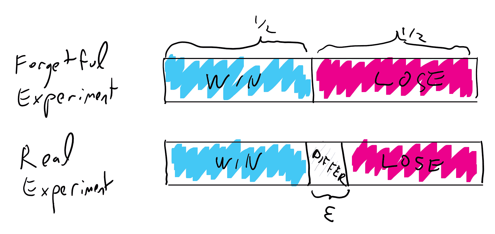

# 公钥密码学的具体候选方案

> 原文：[`intensecrypto.org/public/lec_11_concrete_pkc.html`](https://intensecrypto.org/public/lec_11_concrete_pkc.html)

*看到任何错误/打字错误/令人困惑的解释吗？[在 GitHub 上打开一个 issue](https://github.com/boazbk/crypto/issues/new)。你还可以在下面评论*

**★ 另请参阅本章的[**PDF 版本**](https://files.boazbarak.org/crypto/lec_11_concrete_pkc.pdf)（更好的格式/参考文献）★

在上一节课中，我们讨论了*公钥密码学*，并介绍了 Diffie-Hellman 系统和 DSA 签名方案。在本节课中，我们将探讨 RSA 陷阱门函数及其在加密和签名中的应用。

## 一些数论。

（有关这些和许多其他主题的广泛介绍，请参阅[Shoup 的优秀且免费可用的书籍](http://www.shoup.net/ntb/)。）

对于每一个数\(m\)，我们定义\(\Z_m\)为集合\(\{0,\ldots,m-1\}\)，其中包含模\(m\)的加法和乘法运算。当两个元素在\(\Z_n\)中时，我们将始终假设所有操作都是模\(m\)进行的，除非另有说明。我们让\(\Z^*_m = \{ a\in \Z_m : gcd(a,m)=1 \}\)。注意，如果且仅当\(|\Z^*_m|=m-1\)时，\(m\)是素数。对于\(\Z^*_m\)中的每一个\(a\)，我们可以使用扩展欧几里得算法找到一个元素\(b\)（通常表示为\(a^{-1}\)），使得\(ab=1\)（你能看到为什么吗？）。集合\(\Z^*_m\)是一个阿贝尔群，具有乘法运算，因此根据上一节课的观察，对于\(\Z^*_m\)中的每一个\(a\)，有\(a^{|\Z^*_m|}=1\)。当\(m\)是素数时，这个结果被称为“费马小定理”，通常表述为对于每一个\(a\neq 0\)，\(a^{p-1}=1 \pmod{p}\)。

在基于数论密码学中，有一个方面常常令人困惑，那就是我们需要始终跟踪我们是在谈论“大”数还是“小”数。在密码学的许多情况下，我们使用\(n\)来谈论我们的密钥大小或安全参数，在这种情况下，我们认为\(n\)是一个大小约为\(100-1000\)的“小”数。然而，当我们与\(\Z^*_m\)一起工作时，我们通常认为\(m\)是一个大约有\(100-1000\)个*数字*的“大”数；也就是说，\(m\)大约是\(2^{100}\)到\(2^{1000}\)左右。我将尝试保留\(n\)的符号来表示“小”数，但有时可能会忘记这样做，而 RSA 等描述通常使用\(n\)来表示“大”数。重要的是，无论何时看到数字\(x\)，你都要确保你有一个关于它是“小”数（在这种情况下，\(poly(x)\)时间被认为是高效的）还是“大”数（在这种情况下，只有\(poly(log(x))\)时间被认为是高效的）的感觉。

在本课程的大部分内容中，我们使用 \(m\) 来表示要加密或认证的明文消息的字符串。在整数分解的上下文中，使用 \(m=pq\) 作为要分解的合数是方便的。为了使内容更有趣（或者更坦白地说，因为我总是用完字母），在本讲中我们将使用 \(m\) 的两种用法（尽管希望不是在同一个定理或定义中！）。当我们谈论分解、RSA 和 Rabin 时，我们将使用 \(m\) 作为合数，而在基于抽象门限置换的加密和签名的上下文中，我们将使用 \(m\) 作为消息。当你看到 \(m\) 的一个实例时，确保你理解它的用法。

### 原始测试

我们经常需要的一个程序是找到一个 \(n\) 位的质数。人们通常的做法是选择一个随机的 \(n\) 位数字 \(p\)，然后测试它是否是质数。我们在上一讲中已经证明，一个随机的 \(n\) 位数字是质数的概率至少是 \(\Omega(1/n²)\)（实际上，根据素数定理，概率是 \(\tfrac{1\pm o(1)}{\ln n}\)）。我们现在讨论如何测试质数性。

存在一个 \(poly(n)\) 时间的算法来测试给定的 \(n\) 位数字是质数还是合数。

定理 10.3 首先由 Solovay、Strassen、Miller 和 Rabin 在 20 世纪 70 年代通过一个 *概率* 算法（该算法可能以使用硬币数量的指数小概率出错）证明，在 2002 年的一个突破中，Agrawal、Kayal 和 Saxena 给出了相同问题的 *确定性* 多项式时间算法。

存在一个概率多项式时间算法 \(A\)，在输入一个数字 \(m\) 时，如果 \(m\) 是质数，\(A\) 以概率 \(1\) 输出 `YES`，如果 \(A\) 不是一个“伪素数”，它以至少 \(1/2\) 的概率输出 `NO`。（“伪素数”的定义将在下面的证明中阐明。）

该算法非常简单，基于费马小定理：在输入 \(m\) 时，随机选择 \(a \in \{2,\ldots,m-1\}\)，如果 \(gcd(a,m)\neq 1\) 或 \(a^{m-1} \neq 1 \pmod{m}\) 则返回 `NO`，否则返回 `YES`。

根据费马小定理，算法在质数 \(m\) 上总是返回 `YES`。我们定义“伪素数”为一个非质数 \(m\)，对于所有 \(a\)，使得 \(gcd(a,m)=1\)，都有 \(a^{m-1}=1 \pmod{m}\)。

如果 \(n\) 不是伪素数，那么集合 \(S = \{ a\in\Z^*_m : a^{m-1}=1 \}\) 是 \(\Z^*_m\) 的严格子集。但很容易看出 \(S\) 是一个 *群*，因此 \(|S|\) 必须整除 \(|Z^*_n|\)，因此特别地，它必须满足 \(|S| < |\Z^*_n|/2\)，因此算法至少以 \(1/2\) 的概率输出 `NO`。

引理 10.4 的力量可能看起来并不十分有意义，因为它并不清楚有多少伪素数。然而，这些伪素数，也称为“卡迈克尔数”，比素数要少得多，具体来说，在 1 到\(N\)之间大约有 \(N/2^{-\Theta(\log N/\log\log N)}\) 个伪素数。如果我们随机选择一个数 \(m \in [2^n]\)，并且只有在 引理 10.4 算法输出 `YES` 时才输出它（否则重新采样），那么我们出错并输出伪素数的概率等于 \([2^n]\) 中伪素数集合与 \([2^n]\) 中素数集合的比值。由于 \([2^n]\) 中有 \(\Omega(2^n/n)\) 个素数，这个比值是 \(\tfrac{n}{2^{-\Omega(n/\log n)}}\)，这是一个可以忽略不计的数量。此外，如上所述，还有更好的算法适用于 *所有* 数字。

与 *测试* 一个数是素数还是合数相比，目前还没有已知的高效算法来实际 *找到* 合数的分解。已知的最优算法运行时间大约为 \(2^{\tilde{O}(n^{1/3})}\)，其中 \(n\) 是位数。

### 域

如果 \(p\) 是一个素数，那么 \(\Z_p\) 是一个 *域*，这意味着它在加法和乘法下是封闭的，并且有 \(0\) 和 \(1\) 元素。域的一个性质如下：

如果 \(f\) 是 \(\Z_p\) 上一个非零的多项式，其次数为 \(d\)，那么至多有 \(d\) 个不同的输入 \(x\) 满足 \(f(x)=0\)。

（如果你好奇为什么，你可以看到，给定 \(x_1,\ldots,x_{d+1}\)，找到在 \(x_i\) 上消失的多项式的系数的任务相当于解一个 \(d+1\) 个变量和 \(d+1\) 个方程的线性系统，这些方程由于范德蒙德矩阵的非奇异性而相互独立。）

特别地，每个 \(x \in \Z_p\) 至多有 *两个* 平方根（满足 \(s² = x \mod p\) 的数 \(s\)）。事实上，就像在实数域上一样，每个 \(x\in\Z_p\) 要么没有平方根，要么恰好有两个平方根，形式为 \(\pm s\)。

我们可以高效地找到模一个素数的平方根。事实上，以下结果是已知的：

存在一个概率的 \(poly(\log p,d)\) 时间算法来找到 \(\Z_p\) 上次数为 \(d\) 的多项式的根。

这是有限域上多项式分解问题的特殊情况，由贝尔莱克普在 1967 年提出，并在其基础上进行了大量工作；参见 [Shoup](http://www.shoup.net/ntb/)) 的第二十章。

### 中国剩余定理

假设 \(m=pq\) 是两个素数的乘积。在这种情况下，\(Z^*_m\) 不包含从 1 到 \(m-1\) 的所有数。实际上，所有形式为 \(p,2p,3p,\ldots,(q-1)p\) 和 \(q,2q,\ldots,(p-1)q\) 的数都将与 \(m\) 有非平凡的最大公约数。这样的数有 \(q-1 + p-1\) 个（因为 \(p\) 和 \(q\) 是素数，所以上述形式的所有数都是不同的）。因此，\(|Z^*_m| = m-1 - (p-1) - (q-1) = pq - p - q +1 = (p-1)(q-1)\)。

注意到 \(|Z^*_m|=|\Z^*_p|\cdot |\Z^*_q|\)。这并非偶然：

如果 \(m=pq\)，那么存在一个同构 \(\varphi:\Z^*_m \rightarrow \Z^*_p \times \Z^*_q\)。也就是说，\(\varphi\) 是一一对应的，并且将 \(x\in\Z^*_m\) 映射到一个对 \((\varphi_1(x),\varphi_2(x)) \in \Z^*_p \times \Z^*_q\)，对于每一个 \(x,y \in \Z^*_m\)：

* \(\varphi_1(x+y) = \varphi_1(x)+\varphi_1(y) \pmod{p}\)

* \(\varphi_2(x+y) = \varphi_2(x)+\varphi_2(y) \pmod{q}\)

* \(\varphi_1(x\cdot y) = \varphi_1(x)\cdot \varphi_1(y) \pmod{p}\)

* \(\varphi_2(x\cdot y) = \varphi_2(x)\cdot \varphi_2(y) \pmod{q}\)

\(\varphi\) 简单地将 \(x\in \Z^*_m\) 映射到对 \((x \mod p, x \mod q)\)。验证它是否满足所有期望的性质是一个很好的练习。QED

特别地，对于每一个多项式 \(f()\) 和 \(x\in \Z^*_m\)，\(f(x)=0 \pmod{m}\) 当且仅当 \(f(x)=0 \pmod{p}\) 和 \(f(x)=0 \pmod{q}\)。因此，如果你知道 \(m\) 的分解，那么在复合数 \(m\) 上找到多项式 \(f()\) 的根是容易的。然而，如果你不知道分解，那么这是困难的。特别是，提取平方根与找出因子一样困难。

假设存在一个有效的算法 \(A\)，对于每一个 \(m\in \N\) 和 \(a\in \Z^*_m\)，\(A(m,a² \pmod {m})=b\)，使得 \(a² = b² \pmod{m}\)。那么，存在一个有效的算法可以从 \(m\) 中恢复 \(p,q\)。

假设存在这样的算法 \(A\)。使用 CRT，我们可以定义 \(f:\Z^*_p\times\Z^*_q \rightarrow \Z^*_p\times \Z^*_q\) 为 \(f(x,y)=\varphi(A(\varphi^{-1}(x²,y²)))\)，对于所有 \(x\in \Z^*_p\) 和 \(y\in\Z^*_q\)。现在，对于任何 \(x,y\)，令 \((x',y')=f(x,y)\)。由于 \(x² = x'² \pmod{p}\) 和 \(y² = y'² \pmod{q}\)，我们知道 \(x' \in \{\pm x \}\) 和 \(y' \in \{ \pm y \}\)。由于翻转符号不会改变 \((x',y')=f(x,y)\) 的值，通过翻转 \(x\) 或 \(y\) 的一个或两个符号，我们可以确保 \(x'=x\) 和 \(y'=-y\)。因此 \((x,y)-(x',y')=(0,2y)\)。换句话说，如果 \(c = \varphi^{-1}(x-x',y-y')\)，那么 \(c= 0 \pmod{p}\) 但 \(c \neq 0 \pmod{q}\)，这特别意味着 \(c\) 和 \(m\) 的最大公约数是 \(q\)。因此，通过取 \( gcd(A(\varphi^{-1}(x,y)),m)\)，我们将找到 \(q\)，从而我们可以找到 \(p=m/q\)。

这几乎可行，但有一个问题，那就是我们不知道 \(p\) 和 \(q\)，我们该如何找到 \(\varphi^{-1}(x,y)\) 呢？关键观察点是，我们不需要这样做。我们只需在 \(\{1,\ldots,m\}\) 中随机选择一个值 \(a\)。以非常高的概率（即 \((p-1+q-1)/pq\)）\(a\) 将在 \(\Z^*_m\) 中，因此我们可以想象这个过程与随机选择 \(x\in\Z^*_p\)、随机选择 \(y\in \Z^*_q\) 然后随机翻转 \(x\) 和 \(y\) 的符号并取 \(a=\varphi(x,y)\) 的过程是等价的。根据上述论证，至少有 \(1/4\) 的概率，将满足 \( gcd(a-A(a²),m)=q \)。

注意，即使算法 \(A\) 是一个**平均情况**算法，只能成功找到大部分输入的平方根，这个论点仍然成立。这个观察对于密码学应用至关重要。

### RSA 和 Rabin 函数

现在我们已经准备好描述 RSA 和 Rabin 门限函数：

给定一个数 \(m=pq\) 和 \(e\)，使得 \(gcd((p-1)(q-1),e)=1\)，相对于 \(m\) 和 \(e\) 的**RSA 函数**是映射 \(f_{m,e}:\Z^*_m\rightarrow\Z^*_m\)，使得 \(\ensuremath{\mathit{RSA}}_{m,e}(x) = x^e \pmod{m}\)。

给定一个数 \(m=pq\)，相对于 \(m\) 的**Rabin 函数**是映射 \(Rabin_m:\Z^*_m\rightarrow \Z^*_m\)，使得 \(Rabin_m(x)=x² \pmod{m}\)。

注意，这两个映射都可以在多项式时间内计算。使用中国剩余定理和 定理 10.6，我们知道如果我们知道分解，这两个函数都可以被有效地**逆转**。1

然而，定理 10.6 对于逆转 RSA 和 Rabin 函数来说是一个过于庞大的锤子，而且存在直接且简单的逆转算法（见作业练习）。根据 定理 10.8，逆转 Rabin 函数相当于分解 \(m\)。对于 RSA 函数，尚无此类结果，但已知没有比通过分解 \(m\) 更好的算法来攻击它。RSA 函数的优势在于它是在 \(\Z^*_m\) 上的一个**排列**：

\(\ensuremath{\mathit{RSA}}_{m,e}\) 在 \(\Z^*_m\) 上是一对一。

假设 \(\ensuremath{\mathit{RSA}}_{m,e}(a)=\ensuremath{\mathit{RSA}}_{m,e}(a')\)。根据 CRT，这意味着存在 \((x,y) \neq (x',y') \in \Z^*_p \times \Z^*_q\)，使得 \(x^e = x'^e \pmod{p}\) 和 \(y^e = y'^e \pmod{q}\)。但如果这种情况成立，我们就会得到 \((xx'^{-1})^e = 1 \pmod{p}\) 和 \((yy'^{-1})^e = 1 \pmod{q}\)。但这意味着 \(e\) 必须是 \(xx'^{-1}\) 和 \(yy'^{-1}\) 的**阶**的倍数（至少有一个不是 \(1\)，因此阶大于 \(1\)）。但由于阶总是能整除群的大小，这意味着 \(e\) 必须与 \(|Z^*_p|\) 或 \(|\Z^*_q|\) 以及 \((p-1)(q-1)\) 有非平凡的最大公约数。

RSA 门限函数也被称为“普通”或“教科书”RSA 加密。这是因为最初 Diffie 和 Hellman（以及随后 RSA）将加密方案视为一个确定性过程，因此简单地通过应用 \(\ensuremath{\mathit{ESA}}_{m,e}(x)\) 加密消息 \(x\)。然而，如今我们知道，直接使用门限函数作为加密方案而不添加一些随机化是不安全的。

### 抽象：门限排列

我们可以抽象出 RSA 和 Rabin 函数的特定构造，来讨论一个通用的**门限排列族**。我们给出以下定义

*门限排列族 (TDP)* 是一个函数族 \(\{ p_k \}\)，其中对于每一个 \(k\in\{0,1\}^n\)，函数 \(p_k\) 是 \(\{0,1\}^n\) 上的排列，并且：

*存在一个 *密钥生成算法* \(G\)，当输入 \(1^n\) 时，它输出一个对 \((k,\tau)\)，使得映射 \(k,x \mapsto p_k(x)\) 和 \(\tau,y \mapsto p_k^{-1}(y)\) 可以高效计算。

+   对于每一个有效的对手 \(A\)，\(\Pr_{(k,\tau) \leftarrow_R G(1^n), y\in\{0,1\}^n}[ A(k,y)=p_k^{-1}(y) ] < negl(n)\)。

RSA 函数不是在字符串集合上的排列，而是在某些 \(m=pq\) 上的 \(\Z^*_m\)。然而，如果我们找到区间 \([2^{n/2}(1-negl(n)),2^{n/2}]\) 中的质数 \(p,q\)，那么 \(m\) 将在区间 \([2^n(1-negl(n)),2^n]\) 中，因此 \(\Z^*_m\)（大小为 \(pq - p - q +1 = 2^n(1-negl(n))\)）可以看作与 \(\{0,1\}^n\) 本质上相同，因为我们总是从 \(\{0,1\}^n\) 中随机选择元素，因此它们在 \(\Z^*_m\) 中的概率为 \(1-negl(n)\)。人们普遍认为，对于每个足够大的 \(n\)，在区间 \([2^n-poly(n),2^n]\) 中都存在一个质数（这遵循 *扩展黎曼猜想*），Baker、Harman 和 Pintz *证明了* 在区间 \([2^n-2^{0.6n},2^n]\) 中存在一个质数。（2）

### 基于门限排列的公钥加密

这就是我们如何从一个门限排列方案 \(\{ p_k \}\) 获取公钥加密的方法。

> **基于 TDP 的公钥加密 (TDPENC):**
> 
> +   *密钥生成:* 运行 TDP 的密钥生成算法以获取 \((k,\tau)\)。\(k\) 是 *公开加密密钥*，\(\tau\) 是 *秘密解密密钥*。
> +   
> +   *加密:* 使用密钥 \(k\in\{0,1\}^n\) 加密消息 \(m\)，选择 \(x\in\{0,1\}^n\) 并输出 \((p_k(x),H(x)\oplus m)\)，其中 \(H:\{0,1\}^n\rightarrow\{0,1\}^\ell\) 是我们将其建模为随机预言机的哈希函数。
> +   
> +   *解密:* 使用密钥 \(\tau\) 解密密文 \((y,z)\)，输出 \(m=H(p_k^{-1}(y))\oplus z\)。

请验证您理解为什么 TDPENC 是一个 *有效* 的加密方案，即在解密加密后的 \(m\) 时会得到 \(m\)。

如果 \(\{ p_k \}\) 是一个安全的门限排列，且 \(H\) 是一个随机预言机，那么 TDPENC 是一个 CPA 安全的公钥加密方案。

假设，为了矛盾，存在一个多项式大小的对手 \(A\)，在 TDPENC 的 CPA 游戏中（访问随机预言机 \(H\)）以非忽略的优势 \(\epsilon\) 胜出。我们将使用 \(A\) 设计一个算法 \(I\)，该算法可以反转门限排列。

回想一下，CPA 游戏的工作方式如下：

+   对手 \(A\) 接收一个密钥 \(k \in \{0,1\}^n\) 作为输入。

+   算法 \(A\) 进行一些多项式数量的计算，并对随机预言机 \(H\) 进行 \(T_1=poly(n)\) 次查询，并生成一对消息 \(m_0,m_1 \in \{0,1\}^\ell\)。

+   “挑战者”选择 \(b^* \leftarrow_R \{0,1\}\)，选择 \(x^* \leftarrow_R \{0,1\}^n\) 并计算密文 \((y^*=p_k(x^*),z^* = H(x^*) \oplus m_{b^*})\)，这是 \(m_{b^*}\) 的加密。

+   对手 \(A\) 接收 \((y^*,z^*)\) 作为输入，进行一些额外的多项式计算，并对 \(H\) 进行 \(T_2=poly(n)\) 次查询，然后输出 \(b\)。

+   如果 \(b=b^*\)，则对手**获胜**。

我们做出以下主张：

**主张：**至少以 \(\epsilon\) 的概率，对手 \(A\) 将查询 \(x^*\) 发送到随机预言机。

**证明：**假设相反。我们将使用 Boneh-Shoup 书籍中使用的“健忘的矮人”技术来证明这一主张。根据“懒惰评估”范式，我们可以想象查询 \(H\) 的回答是由一个“忠诚的矮人”提供的，每当遇到一个新的查询 \(x\)，它都会选择一个均匀且独立的值 \(w \leftarrow_R \{0,1\}^\ell\) 作为响应，并记录 \(H(x)=w\) 以供未来查询作为答案。

现在考虑以下实验：在挑战部分，我们使用一个“健忘的矮人”来回答 \(H(x^*)\)，通过一个均匀且独立的字符串 \(w^* \leftarrow_R \{0,1\}^\ell\)，并且**不**记录答案以供未来的查询使用。在“健忘实验”中，密文 \(z^* = w^* \oplus m_{b^*}\) 的第二个分量在 \(\{0,1\}^\ell\) 中均匀分布，并且与其他所有随机选择独立，无论 \(b^*=0\) 还是 \(b^*=1\)。因此，在这个“健忘实验”中，对手无法获得关于 \(b^*\) 的任何信息，其获胜的概率最多为 \(1/2\)。但是，如果 \(x^*\) 只查询 \(H\) 一次，那么健忘实验与实际实验是相同的。除了挑战者对 \(x^*\) 的查询外，所有对 \(H\) 的其他查询都是由对手进行的。根据我们的假设，对手以最多 \(\epsilon\) 的概率进行 \(x^*\) 的查询，并且在此事件不发生的情况下，两个实验是相同的。由于健忘实验中获胜的概率最多为 \(1/2\)，因此整体实验中获胜的概率小于 \(1/2+\epsilon\)，从而产生矛盾并证实了这一主张。（这类对样本空间的分析可能会令人困惑；参见图 10.1 以图形化说明这一论点。）

给定这一主张，我们现在可以构建我们的解密算法 \(I\) 如下：

+   \(I\) 的输入是门限置换的密钥 \(k\) 和 \(y^* = p_k(x^*)\)。\(I\) 的目标是输出 \(x^*\)。

+   解密器模拟 CPA 攻击中的对手，如果查询是新的，则通过随机值回答其所有对预言机 \(H\) 的查询，如果之前已经询问过，则回答之前提供的答案。每当对手对 \(H\) 进行查询 \(x\) 时，\(I\) 会检查 \(p_h(x)=y^*\)，如果是，则停止并输出 \(x\)。

+   当产生挑战的时间到来时，逆器 \(I\) 随机选择 \(z^*\) 并向对手提供 \((y^*,z^*)\)，其中 \(z^* = w^* \oplus m_{b^*}\)^(3)。

+   如果对手提出查询 \(x\) 使得 \(p_k(x)=y^*\) 到 \(H\)，逆器将继续模拟并停止输出 \(x\)。

我们声称，直到我们停止为止，实验与实际攻击是相同的。事实上，由于 \(p_k\) 是一个排列，我们知道如果在产生挑战的时间到来之前我们没有停止，那么查询 \(x^*\) 还没有被提交给 \(H\)。因此，我们可以自由地选择一个独立的随机值 \(w^*\) 作为 \(H(x^*)\) 的值。（我们的逆器不知道 \(x^*\) 的值是什么，但这对于这个论点并不重要：你能看出为什么吗？）因此，由于根据声明，对手将以至少 \(\epsilon\) 的概率向 \(H\) 提出查询 \(x^*\)，我们的逆器将以相同的概率成功。

10.1: 在 TDPENC 安全性的证明中，我们表明如果声明的假设被违反，则“遗忘实验”与真实实验在概率大于 \(1-\epsilon\) 的情况下是相同的。在这种情况下，即使所有概率质量都集中在样本空间中遗忘实验中的对手会输而真实实验中的对手会赢的点，后者实验中获胜的概率仍然会小于 \(1/2+\epsilon\)。

这个定理 10.15 的证明并不长，但有些微妙。请重新阅读它，并确保你理解了它。我还建议你看看 Boneh Shoup 书中相同证明的版本：第 11.4 节中的定理 11.2（“基于门限函数方案的加密”）。

在这个方案中，我们不需要使用随机预言机来获得安全性，特别是当 \(\ell\) 足够短时。我们可以用具有称为“核心构造”的特定属性的哈希函数替换 \(H()\)；这是 Goldreich 和 Levin 首次提出的。

### 门限排列的数字签名

这就是我们如何从门限排列 \(\{ p_k \}\) 获取数字签名。这被称为“全域哈希”签名。

> **全域哈希签名 (FDHSIG):**
> 
> +   *密钥生成:* 运行 TDP 的密钥生成算法以获取 \((k,\tau)\)。\(k\) 是 *公共验证密钥*，\(\tau\) 是 *秘密签名密钥*。
> +   
> +   *签名:* 要使用密钥 \(\tau\) 签名消息 \(m\)，我们输出 \(p_{k}^{-1}(H(m))\)，其中 \(H:\{0,1\}^*\rightarrow\{0,1\}^n\) 是一个作为随机预言机的哈希函数。
> +   
> +   *验证:* 要验证一个消息-签名对 \((m,x)\)，我们检查 \(p_k(x)=H(m)\)。

我们现在证明全域哈希的安全性。

如果 \(\{ p_k \}\) 是一个安全的 TDP 且 \(H\) 是一个随机预言机，那么 FDHSIG 是一个选择消息攻击安全的数字签名方案。

假设为了矛盾的目的，存在一个多项式大小的攻击者 \(A\)，以非忽略概率 \(\epsilon>0\) 成功进行选定的消息攻击。我们将为陷门置换集合构造一个逆器 \(I\)，它以非忽略概率成功。

回想一下，在选定的消息攻击中，攻击者向其签名盒提出 \(T\) 次查询 \(m_1,\ldots,m_T\)，这些查询与 \(T'\) 次查询 \(m'_1,\ldots,m'_{T'}\) 到随机预言机 \(H\) 交织在一起。我们可以假设（通过修改攻击者并最多加倍查询次数）攻击者总是先向随机预言机查询消息 \(m_i\)，然后再向签名盒查询，尽管它也可以向随机预言机提出额外的查询（因此 \(T' \geq T\))。攻击结束时，攻击者以概率 \(\epsilon\) 输出一个对 \((x^*,m^*)\)，其中 \(m^*\) 未被查询到签名盒，且 \(p_k(x^*)=H(m^*)\)。

我们的逆器 \(I\) 如下工作：

+   **输入：** \(k\) 和 \(y^*=p_k(y^*)\)。目标是输出 \(x^*\)。

+   \(I\) 将随机猜测 \(t^*\)，这是攻击者将查询 \(m^*\)（它最终将要伪造的消息）到 \(H\) 的步骤。以 \(1/T'\) 的概率，猜测将是正确的。

+   \(I\) 模拟 \(A\) 的执行过程。除了步骤 \(t^*\) 外，每当 \(A\) 向随机预言机提出新的查询 \(m\) 时，\(I\) 将选择一个随机的 \(x\leftarrow \{0,1\}^n\)，计算 \(y=p_k(x)\) 并指定 \(H(m)=y\)。在步骤 \(t^*\) 中，当攻击者提出查询 \(m^*\) 时，逆器 \(I\) 将返回 \(H(m^*)=y^*\)。\(I\) 将记录 \((x,y)\) 的值，因此它将始终知道 \(p_k^{-1}(H(m))\) 对于它从其预言机查询 \(m\) 返回的每个 \(H(m) \neq y^*\)。

+   当 \(A\) 向签名盒提出查询 \(m\) 时，由于 \(m\) 之前已被查询到 \(H\)，如果 \(m \neq m^*\) 则 \(I\) 使用其记录返回 \(x=p_k^{-1}(H(m))\)。如果 \(m=m^*\) 则 \(I\) 停止并输出“失败”。

+   游戏结束时，攻击者输出 \((m^*,x^*)\)。如果 \(p_k(x^*)=y^*\) 则 \(I\) 输出 \(x^*\)。

我们声称，在攻击者成功且最终消息 \(m^*\) 是在步骤 \(t^*\) 中查询的概率 \(\geq \epsilon/T'\) 事件下，我们提供了一个实际游戏的完美模拟。实际上，在游戏过程中，值 \(y=H(m)\) 将在 \(\{0,1\}^n\) 中独立随机选择，这相当于选择 \(x \leftarrow_R \{0,1\}^n\) 并让 \(y=p_k(x)\)。毕竟，对均匀分布应用置换仍然是均匀的。

因此，以至少 \(\epsilon/T'\) 的概率，逆器 \(I\) 将输出 \(x^*\) 使得 \(p_k(x^*)=y^*\)，从而成功完成逆器。

再次强调，这个证明有些微妙。我建议你阅读 Boneh-Shoup 第 13.4 节中这个证明的版本。

使用带签名的哈希函数还有另一个原因。通过将碰撞抵抗的哈希函数 \(h:\{0,1\}^* \rightarrow \{0,1\}^\ell\) 与长度为 \(\ell\) 的消息的签名方案 \((S,V)\) 结合起来，我们可以通过定义 \(S'_s(m)=S_s(h(m))\) 和 \(V'_v(m,\sigma)=V_v(h(m),\sigma)\) 来获得任意长度消息的签名。

## 没有随机预言机的硬核比特和安全性

使用陷阱门函数作为公钥加密基础的主要问题有两个：> * 事实是 \(f\) 是一个陷阱门函数并不能排除从 \(f(x)\) 计算出 \(x\) 的可能性，当 \(x\) 是某种特殊形式时。回想一下，单向函数的安全性是在均匀随机输入上给出的。通常要发送的消息并不是从均匀分布中抽取的，并且对于某些特定的 \(x\) 值，反转 \(f(x)\) 可能是容易的，而这些值恰好是常见的发送消息。> * 事实是 \(f\) 是一个陷阱门函数并不能排除从 \(f(x)\) 中容易计算出关于 \(x\) 的某些部分信息的可能性。假设我们希望在位通道上玩扑克。如果即使是牌的花色或颜色可以从该牌的加密中揭示出来，那么即使整个加密不能被反转，也没有关系；能够计算出明文的一个比特就足以使整个游戏无效。RSA 和 Rabin 函数尚未被成功破解，但没有人能够证明它们提供*语义安全*。> 解决这些问题的方法是使用单向函数 \(f\) 的一个硬核谓词。我们首先定义硬核谓词的安全性，然后展示如何用它来构建语义安全的加密。

设 \(f:\{0, 1\}^n \rightarrow \{0, 1\}^n\) 为一个单向函数（为了简单起见，我们假设 \(f\) 是长度保持的），\(\ell(n)\) 为一个长度函数，\(h: \{0, 1\}^n \rightarrow \{0, 1\}^{\ell(n)}\) 是多项式时间内可计算的。我们说 \(h\) 是 \(f\) 的一个**硬核谓词**，如果对于每个有效的对手 \(A\)，每个多项式 \(p\)，以及所有足够大的 \(n\)，

\[\left| \Pr[A(f(X_n), b(X_n)) = 1] - \Pr[A(f(X_n), R_{\ell(n)}) = 1]\right| < \frac{1}{p(n)}\]，其中 \(X_n\) 和 \(R_{\ell(n)}\) 分别独立且均匀地分布在 \(\{0, 1\}^n\) 和 \(\{0, 1\}^{\ell(n)}\) 上。

即，给定一个随机均匀选择的输入 \(x \leftarrow_R \{0, 1\}^n\)，没有有效的对手可以在给定 \(f(x)\) 的情况下，以非可忽略的优势区分随机字符串 \(r\) 和 \(b(x)\)。这允许我们构建语义安全的公钥加密：

> **基于硬核谓词的公钥加密**：
> 
> +   *密钥生成*：运行单向函数 \(f\) 的标准密钥生成算法以获得 \((e, d)\)，其中 \(e\) 是用于计算函数 \(f\) 的公钥，\(d\) 是相应的秘密陷阱门密钥，这使得反转 \(f\) 变得容易。
> +   
> +   *加密:* 使用公钥 \(e\) 加密长度为 \(n\) 的消息 \(m\)，随机从 \(\{0, 1\}^n\) 中选择 \(x\) 并计算 \((f_e(x), b(x) \oplus m)\)。

+   *解密:* 要解密密文 \((c, c')\)，我们首先使用秘密陷阱门密钥 \(d\) 来计算 \(D_d(c) = D_d(f_e(x)) = x\)，然后计算 \(b(x)\) 和 \(b(x) \oplus c' = m\)

请停止验证这是一个有效的公钥加密方案。

> 注意，在这个公钥加密的构造中，\(f\) 的输入是从 \(\{0, 1\}^n\) 中均匀随机抽取的 \(x\)，因此可以直接应用 \(f\) 的单向性定义。此外，由于 \(b(x)\) 即使在给定 \(f(x)\) 的情况下也与随机字符串 \(r\) 不可区分，因此 \(b(x) \oplus m\) 实质上是对 \(m\) 的一次性垫加密，其中密钥只能由能够求逆 \(f\) 的人获取。形式化证明安全性的工作留作练习。
> 
> 这听起来很好，但我们如何实际构造一个核心谓词呢？Blum 和 Micali 是第一个基于离散对数问题构造核心谓词的人，但第一个针对一般单向函数的构造是由 Goldreich 和 Levin 提出的。他们的想法是，如果 \(f\) 是单向的，那么在给定 \(f(x)\) 和子集本身的情况下，猜测 \(f\) 输入的随机子集的异或是非常困难的。

令 \(f\) 为一个单向函数，令 \(g\) 定义为 \(g(x, r) = (f(x), r)\)，其中 \(|x| = |r|\)。令 \(b(x, r) = \oplus_{i \in [n]} x_ir_i\) 为 \(x\) 和 \(r\) 的内积 \(\mod 2\)。那么 \(b\) 是函数 \(g\) 的一个核心谓词。

> 这个定理的证明遵循经典的通过归约方法，我们假设存在一个能够以非可忽略的优势预测 \(b(x, r)\) 给定 \(g(x, r)\) 的对手，并构造一个以非可忽略的概率求逆 \(f\) 的对手。令 \(A\) 为一个（可能是随机的）程序，且 \(\epsilon_A(n) > \frac{1}{p(n)}\) 对于某个多项式 \(n\) 成立，

\[P[A(g(X_n, R_n)) = b(X_n, R_n)] = \frac{1}{2} + \epsilon_A(n)\]

其中 \(X_n\) 和 \(R_n\) 是在 \(\{0, 1\}^n\) 上的均匀且独立的分布。我们观察到，由于 \(b\) 不安全并且输出为单个比特，这意味着存在这样的程序 \(A\)。首先，我们证明在所有可能的输入中至少有 \(\epsilon_A(n)\) 的比例，程序 \(A\) 在预测 \(b\) 的输出方面具有 \(\frac{\epsilon_A(n)}{2}\) 的优势。

存在一个集合 \(S \subseteq \{0, 1\}^n\)，其中 \(|S| > \epsilon_A(n) (2^n)\)，使得对于所有 \(x \in S\)，

\[s(x) = P[A(g(x, R_n)) = b(x, R_n)] \geq \frac{1}{2} + \frac{\epsilon_A(n)}{2}\]

结果来源于平均论证。设 \(k = \frac{|S|}{2^n}\)，\(\displaystyle \alpha = \frac{1}{k} \sum_{x \in S} s(x)\) 和 \(\displaystyle \beta = \frac{1}{1 - k} \sum_{x \notin S} s(x)\) 分别是 \(s(x)\) 在 \(S\) 中和不在 \(S\) 中的值的平均值，因此 \(k \alpha + (1 - k) \beta = \frac{1}{2} + \epsilon\)。为了方便记号，我们设 \(\epsilon = \epsilon_A(n)\)。根据定义 \(\mathbb{E}[s(X_n)] = \frac{1}{2} + \epsilon\)，所以 \(\alpha \leq 1\) 和 \(\beta < \frac{1}{2} + \frac{\epsilon}{2}\) 给出 \(k + (1 - k) \left( \frac{1}{2} + \frac{\epsilon}{2} \right) > \frac{1}{2} + \epsilon\)，解得 \(k > \epsilon\)。

> 现在我们观察到，对于任何 \(r \in \{0, 1\}^n\)，我们有

\[x_i = b(x, r) \oplus b(x, r \oplus e_i)\]

其中 \(e_i\) 是除了第 \(i\) 个位置为 \(1\) 外其余位置都是 \(0\) 的向量。这个观察结果来自 \(b\) 的定义，并且它激发了减少的主要思想：猜测 \(b(x, r)\) 并使用 \(A\) 来计算 \(b(x, r \oplus e_i)\)，然后将它们组合起来以找到所有 \(i\) 的 \(x_i\)。猜测为什么有效将在稍后变得清楚，但直观上我们不能简单地使用 \(A\) 来计算 \(b(x, r)\) 和 \(b(x, r \oplus e_i)\) 的原因是 \(A\) 同时正确猜测的概率（标准并集）至少被 \(1 - 2 \left( \tfrac{1}{2} - \epsilon_A(n)\right) = 2\epsilon_A(n)\) 限制。然而，如果我们能正确猜测 \(b(x, r)\)，那么我们只需要调用一次 \(A\) 就可以获得正确确定 \(x_i\) 的超过一半的概率。然后，通过在多个这样的 \(r\) 上进行多数投票，就可以确定每个 \(x_i\)。

> 现在自然的疑问是，我们如何可能猜测（在这里我们字面上是指随机猜测）每个 \(b(x, r)\) 的值？关键是 \(r\) 的值只需要是**成对**独立的，因为我们计划稍后使用切比雪夫不等式来评估我们猜测的准确性^(4)。这意味着虽然我们需要 \(poly(n)\) 个 \(r\) 的值，但我们可以通过猜测 \(\log (n)\) 个 \(b(x, r)\) 的值，并通过一些技巧将它们结合起来以获得更多值，同时保持成对独立性。由于 \(2^{-\log n} = \tfrac{1}{n}\)，以非可忽略的概率，我们可以正确猜测多项式数量 \(r\) 的所有 \(b(x, r)\)。然后我们使用 \(A\) 来计算所有 \(r\) 和 \(i\) 的 \(b(x, r \oplus e_i)\)，由于 \(A\) 通过多数投票具有非可忽略的优势，我们可以检索每个 \(x_i\) 来逆 \(f\)，从而与 \(f\) 的单向性相矛盾。

重要的是要理解为什么我们不能依赖于在 \(b(x, r)\) 和 \(b(x, r \oplus e_i)\) 上两次调用 \(A\)。同样重要的是要理解为什么，在非零概率下，我们可以正确猜测 \(b(x, r_1), \dots b(x, r_\ell)\) 对于独立且均匀随机选择的 \(r_1, \dots r_\ell\) 和 \(\ell = O(\log n)\)。目前，使用什么技巧来组合我们的猜测并不重要，但如果你能理解为什么我们可以在输入中实现成对独立性而不是完全独立性，这将减少未来的混淆。

在继续我们的定理的正式证明之前，请停下来说服自己，鉴于存在一些技巧，这种策略可以用于逆 \(f\)。

我们使用 \(A\) 的假设存在性来构建 \(B\)，一个逆 \(f\) 的程序（我们假设为了记号方便，\(f\) 是长度保持的）。选择 \(n = |x|\) 和 \(l = \lceil \log(2n \cdot p(n)² + 1) \rceil\)，其中 \(\epsilon_A(n) > \tfrac{1}{p(n)}\)。接下来，独立且均匀地随机选择 \(s¹, \dots s^l \in \{0, 1\}^n\) 和 \(\sigma¹, \dots \sigma^l \in \{0, 1\}\)。在这里，我们将 \(\sigma^i\) 设置为 \(b(x, s^i)\) 的猜测值。对于 \(\{1, 2, \dots l\}\) 的非空子集 \(J\) 的每个非空子集，令 \(r^J = \oplus_{j \in J} s^j\)。我们可以观察到

\[b(x, r^J) = b(x, \oplus_{j \in J} s^j) = \oplus_{j \in J} b(x, s^j)\]

通过加法模 2 的性质，因此我们可以断言 \(\rho^J = \oplus_{j \in J} \sigma^j\) 是 \(b(x, r^J)\) 的正确猜测，只要 \(J\) 中的每个 \(\sigma^j\) 都是正确的。我们可以很容易地验证 \(r^J\) 的值是成对独立且均匀的，因此这种构造给我们提供了 \(poly(n)\) 个正确的成对 \((b(x, r^J), \rho^J)\)，概率为 \(\tfrac{1}{poly(n)}\)，正好是我们所需要的。

定义 \(G(J, i) = \rho^J \oplus A(f(x), r^J \oplus e_i)\) 为使用输入 \(r^J\) 计算的 \(x_i\) 的猜测值。从这里，\(B\) 只需将 \(x_i\) 设置为在 \(J\) 的可能选择上的猜测 \(G(J, i)\) 的多数值，并输出 \(x\)。

现在我们证明，鉴于我们的猜测 \(\rho^J\) 都是正确的，对于所有 \(x \in S\) 和对于每个 \(1 \leq i \leq n\)，我们有

\[\Pr \left[ \left| \{ J | G(J, i) = x_i \} \right| > \frac{1}{2}(2^l - 1) \right] > 1 - \frac{1}{2n}\]

即，以至少 \(1 - O(\tfrac{1}{n})\) 的概率，我们超过一半的 \(x_i\) 的 \((2^l - 1)\) 个猜测是正确的，其中 \(2^l - 1\) 是 \(\{1, 2, \dots l\}\) 的非空子集 \(J\) 的数量。

> 对于每个 \(J\)，定义 \(I_J\) 为 \(G(J, i) = x_i\) 的指示符，并且我们可以观察到 \(I_J\) 是伯努利分布，期望值为 \(s(x)\)（再次强调，给定我们对 \(b(x, r^J)\) 的猜测是正确的）。\(I_J\) 的成对独立性由 \(r^J\) 的成对独立性给出。设置 \(m = 2^l - 1\)，定义 \(s(x) = \tfrac{1}{2} + \tfrac{1}{q(n)}\)，并使用切比雪夫不等式，我们得到

\[ \begin{aligned} \Pr \left[ \sum_{J}I_J \leq \frac{1}{2}m \right] &\leq \Pr \left[ \left| \sum_{J} I_J - \left(\frac{1}{2} + \frac{1}{q(n)} \right) m \right| \geq \frac{m}{q(n)}m \right] \\ &= \Pr \left[ \left| \sum_{J} I_J - \mathbb{E} \left[ \sum_{J} I_J \right] \right| \geq \frac{m}{q(n)} \right] \\ &\leq \frac{m \mathbf{Var}(I_J)}{\left(\frac{m}{q(n)}\right)²} \\ &\leq \frac{\frac{1}{4}}{\left( \frac{1}{q(n)} \right)² m} \end{aligned} \]

将其扩展到多个核心比特

\[\frac{\frac{1}{4}}{\left( \frac{1}{q(n)} \right)² m} \leq \frac{\frac{1}{4}}{\left( \frac{1}{2p(n)} \right)² 2n \cdot p(n)²} = \frac{1}{2n} \]

将所有内容综合起来，\(B\) 必须首先在 \(S\) 中选择一个 \(x\)，然后正确猜测所有 \(i \in [1, 2, \dots l]\) 的 \(\sigma^i\)，接着 \(A\) 必须在超过一半的 \(r^J\) 上正确计算 \(b(x, r^J \oplus e_i)\)。由于这些事件都是独立发生的，我们得到 \(B\) 的成功概率为 \(\epsilon_A(n) (\tfrac{1}{2^l})(1 - \tfrac{1}{2n}) = \epsilon_A(n) (\tfrac{1}{2n p(n)²}) ( 1 - \tfrac{1}{2n}) > (\tfrac{1}{p(n)})(\tfrac{1}{2np(n)²})(\tfrac{1}{2}) = \tfrac{1}{4n p(n)³}\)，这在 \(n\) 上是非可忽略的。这与 \(f\) 是单向函数的假设相矛盾，因此没有对手 \(A\) 可以在非可忽略的优势下预测 \(b(x, r)\) 给定 \((f(x), r)\)，并且 \(b\) 是 \(g\) 的核心谓词。

### 由于 \(x \in S\)，我们知道 \(\frac{1}{q(n)} \geq \frac{\epsilon_A(n)}{2} \geq \frac{1}{2p(n)}\)，所以

根据定义，上面构建的 \(b\) 只是一个长度为 \(1\) 的核心谓词。虽然这个方法对任何任意的单向函数都适用，但在现实世界中，消息有时比单个比特长。幸运的是，还有希望：Goldreich 和 Levin 的核心比特构建可以重复使用，以获得对数长度的核心谓词。

设 \(f\) 为一个单向函数，并定义 \(g_2(x, s) = (f(x), s)\)，其中 \(|x| = n\) 且 \(|s| = 2n\)。设 \(c > 0\) 为一个常数，且 \(l(n) = \lceil c \log n \rceil\)。设 \(b_i(x, s)\) 表示二进制向量 \(x\) 和 \((s_{i + 1}, \dots s_{i + n})\) 的内积模 2，其中 \(s = (s_1, \dots s_{2n})\)。那么函数 \(h(x, s) = b_1(x, s) \dots b_{l(n)}(x, s)\) 是 \(g_2\) 的一个核心函数。

很明显，这相对于单个核心比特来说是一个重要的改进，但仍然远远达不到一般可用的程度；想象一下用指数长度的文档大小的密钥加密一个文本文档。需要一种完全不同的方法来获得长度与密钥大小多项式相关的核心谓词。Bellare、Stepanovs 和 Tessaro 通过使用电路不可区分混淆，一种假设存在的密码学原语，成功地实现了这一点，就像 PRGs 的存在一样。

设 \(\mathbf{F}\) 为一个单向函数族，\(\mathbf{G}\) 为一个具有与 \(\mathbf{F}\) 相同输入长度的打孔 PRF。那么在假设存在不可区分混淆器的情况下，存在一个函数族 \(\mathbf{H}\)，它是针对 \(\mathbf{F}\) 的核心函数。此外，\(\mathbf{H}\) 的输出长度与 \(\mathbf{G}\) 的输出长度相同。

由于 \(G\) 的输出长度可以是其输入长度的多项式，因此 \(H\) 在其输入长度上输出多项式数量的核心位。证明定理 10.22 和定理 10.23 需要使用本课程尚未涉及的结果和概念，但我们将有兴趣的读者指引到它们原始的论文：

Goldreich, O., 1995\. Three XOR-lemmas-an exposition. In Electronic Colloquium on Computational Complexity (ECCC).

Bellare, M., Stepanovs, I. and Tessaro, S., 2014, December. Poly-many hardcore bits for any one-way function and a framework for differing-inputs obfuscation. In International Conference on the Theory and Application of Cryptology and Information Security (pp. 102-121). Springer, Berlin, Heidelberg.

1.  使用 定理 10.6 来求逆函数需要 \(e\) 不要太大。然而，正如我们下面将要看到的，使用因式分解我们可以对每个 \(e\) 的 RSA 函数进行求逆。此外，在实践中，人们经常为了效率的原因使用一个较小的 \(e\) 值（有时小到 \(e=3\)）。

    ↩

1.  另一个，较小的问题可能是密钥的描述可能不与 \(\log m\) 具有相同的长度；为了简化符号，我将它们定义为相同的，这可以通过一些填充和连接技巧来确保。

    ↩

1.  这相当于向对手提供一个在 \(\{0,1\}^\ell\) 中均匀选择的 \(z^*\)，你能看出为什么吗？

    ↩

1.  这与切比雪夫不等式基于随机变量的方差的事实有关。如果我们必须使用切诺夫界，我们会遇到麻烦，因为这需要完全独立性。关于这些和其他集中界限的更多信息，我们建议参考 Eli Upfal 的《概率与计算》一书。

    ↩

## 评论

评论通过 [GitHub 仓库](https://github.com/boazbk/crypto/issues) 使用 [utteranc.es](https://utteranc.es) 应用程序发布。发布评论需要 GitHub 登录。如果您不想授权应用程序代表您发布，您也可以直接在 [GitHub 页面的问题](https://github.com/boazbk/crypto/issues?q=Public%20key%20encryption%20candidates%2Bin%3Atitle) 上发表评论。

编译于 2021 年 11 月 17 日 22:36:27

版权所有 2021，Boaz Barak。[Creative Commons License](https://creativecommons.org/licenses/by-nc-nd/4.0/)

本作品受[Creative Commons Attribution-NonCommercial-NoDerivatives 4.0 International License](https://creativecommons.org/licenses/by-nc-nd/4.0/)许可。

使用[pandoc](https://pandoc.org/)和[panflute](http://scorreia.com/software/panflute/)制作，模板源自[gitbook](https://www.gitbook.com/)和[bookdown](https://bookdown.org/)。**
