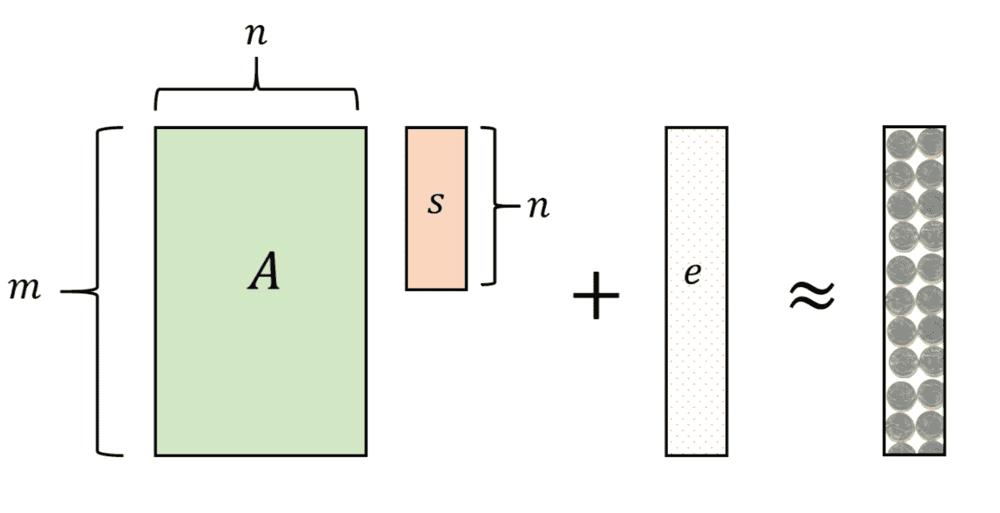
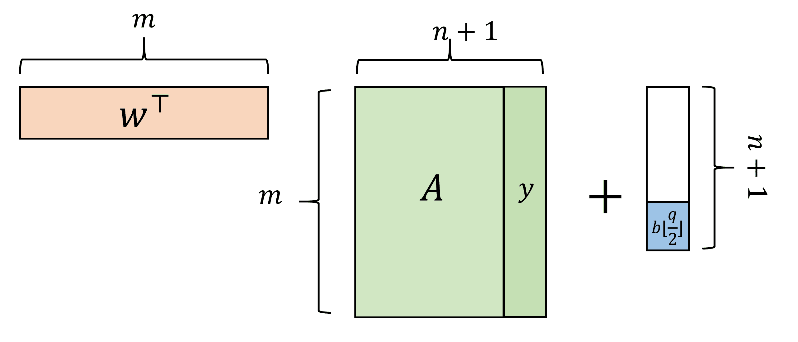
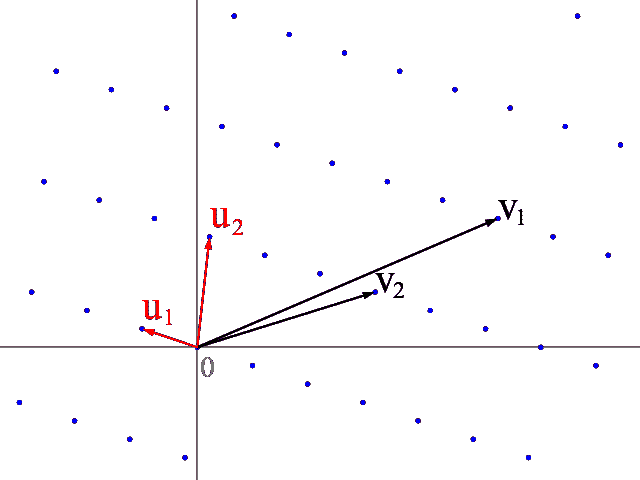

# 基于格的密码学

> 原文：[`intensecrypto.org/public/lec_12_lattices.html`](https://intensecrypto.org/public/lec_12_lattices.html)

**查看任何错误/打字错误/令人困惑的解释？[在 GitHub 上打开一个 issue](https://github.com/boazbk/crypto/issues/new)。您也可以在下面评论**

**★ 另请参阅本章的[PDF 版本](https://files.boazbarak.org/crypto/lec_12_lattices.pdf)（更好的格式/参考文献）★

基于格的公钥加密（以及被称为背包和编码加密的近亲）几乎与基于离散对数和因式分解的方案一样历史悠久。早在 1976 年，就在 Diffie-Hellman 密钥交换被发现（在 RSA 之前）之后，Ralph Merkle 就开始研究从 NP 难的**背包**问题构建公钥加密（参见[Diffie 的回忆](http://cr.yp.to/bib/1988/diffie.pdf)）。这可以被视为在实数上解决形式为$Ax = y$的线性方程的任务（其中$A$是给定的矩阵，$y$是给定的向量，未知数是$x$），但有一个额外的约束，即$x$必须是$0$或$1$。他的提议演变成了 1978 年提出的 Merkle-Hellman 系统（该系统在 1984 年被破解）。

McEliece 在 1978 年提出了一种基于一般线性码解码问题难度的系统。这是解决**噪声线性方程**的任务，其中给定$A$和$y$，使得$y=Ax+e$，对于“小”误差向量$e$，需要恢复$x$。关键的是，我们在这里在一个有限域中工作，例如在某个素数$q$（甚至可以是$2$）的模$q$下工作，而不是在实数或有理数上。对于某些特殊的矩阵$A^*$，我们知道如何高效地解决这个问题：这些被称为高效可解码的[纠错码](https://goo.gl/vM7Pvv)。McEliece 提出了一种方案，其中密钥生成器让$A$成为一个特殊的$A^*$（基于[Goppa 代数几何码](https://goo.gl/Vd4yye)）的“打乱”版本。因此，知道打乱方法的人可以解决这个问题，但（希望）不知道的人则不能。迄今为止，McEliece 的系统尚未被破解。

在 1996 年的一个突破性进展中，Ajtai 展示了一个基于整数格的**私钥**方案，它具有一个非常奇特的特征——其安全性可以基于这样的假设：某些问题在**最坏情况下**才难以解决，而且这些问题的变体已知是 NP 难。这重新点燃了我们可以实现基于仅仅假设$P\neq \ensuremath{\mathit{NP}}$的旧梦想的希望。然而，我们现在明白，这种方法存在根本性的障碍。

尽管如此，Ajtai 的工作引起了广泛关注，并在一年内，Ajtai、Dwork 以及 Goldreich、Goldwasser 和 Halevi 都提出了基于格的公钥加密（前者基于**最坏情况**假设）的构造。大约在同一时间，Hoffstein、Pipher 和 Silverman 提出了他们的 NTRU 公钥系统，该系统基于更强的假设但提供了更好的性能，并且他们与 Daniel Lieman 一起围绕它成立了一家公司。

你可能已经注意到我还没有解释什么是**格**；我们稍后会这样做，但就目前而言，如果你只是简单地考虑涉及某些素数$q$模线性方程的问题，你将获得足够的直觉。（格的观点更偏向于几何，我们将在下面进一步讨论；它最初被用来**攻击**密码系统，特别是破解 Merkle-Hellman 背包方案及其许多变体。）

基于格的密码学最近在理论和实践上都引起了大量关注。在理论方面，许多新颖的构造现在都是基于基于格的密码学，其中最重要的是全同态加密以及不可区分性模糊化（尽管后者的安全性基础仍然不够稳固）。在应用方面，量子计算机技术的稳步进步终于让从业者开始担心 RSA、Diffie-Hellman 和椭圆曲线。虽然目前针对量子计算机的构造还远远达不到在经典计算中分解大数的能力（甚至比手工分解的能力还要差），鉴于开发新标准并部署它们需要许多年，许多人认为应该从今天开始（或许应该几年前就开始）努力过渡到这些基于分解/dlog 的方案之外。基于这一点，美国国家标准与技术研究院已经开始了一个[过程来识别“后量子”公钥加密方案](https://csrc.nist.gov/projects/post-quantum-cryptography)。所有公钥加密的决赛选手都是基于格/码。

密码学有一个独特/不幸的特征，即如果 20 年后建造了一台可以分解大整数的机器，它仍然可以用来破解我们今天传输的通信（前提是这些通信被记录下来）。因此，如果你有一些你预计 20 年后仍然希望保持秘密的数据（许多政府和商业实体都是这样），你可能有所担忧。目前，基于格的密码学是唯一真正的“镇上游戏”对于可能抵抗量子计算的公钥加密方案。

基于格的密码学是一个巨大的领域，在这场讲座和这门课程中，我们只触及了它的一些方面。我强烈推荐[Chris Peikert 的综述](https://web.eecs.umich.edu/~cpeikert/pubs/lattice-survey.pdf)，以更深入地了解这个领域。

### 快速线性代数回顾

一个 *域* $\mathbb{F}$ 是支持操作 $+,\cdot$ 的集合，并包含数字 $0$ 和 $1$（更正式地说，是加法单位元和乘法单位元），具有实数所具有的通常性质。（即结合律、交换律和分配律，对于每个 $x \in \mathbb{F}$ 都存在一个元素 $-x$ 使得 $x + (-x) = 0$，以及如果 $x \neq 0$，则存在一个元素 $x^{-1}$ 使得 $x \cdot x^{-1} = 1$。）除了实数之外，本节中我们将主要感兴趣的域是 $\Z_q$ 域，其中数字为 $\{0,1,\ldots,q-1\}$，加法和乘法在模 $q$ 下进行，其中 $q$ 是一个素数.^(1)

你应该熟悉以下概念（这些在多个来源中都有涉及，包括 Katz-Lindell 的附录和 [Shoup 的在线可用书籍](https://shoup.net/ntb/))：

+   一个向量 $v \in \mathbb{F}^n$ 和一个 *矩阵* $M \in \mathbb{F}^{m \times n}$。一个 $m\times n$ 矩阵有 $m$ 行和 $n$ 列。我们将向量视为 *列向量*，因此我们可以将向量 $v \in \mathbb{F}^n$ 视为一个 $n\times 1$ 矩阵。我们用 $v_i$ 表示 $v$ 的第 $i$ 个坐标，用 $M_{i,j}$ 表示 $M$ 的第 $i$ 行第 $j$ 列的坐标（即第 $i$ 行第 $j$ 列的坐标）。我们经常将向量 $v$ 写作 $(v_1,\ldots,v_n)$，但我们仍然意味着它是一个列向量，除非我们另有说明。

+   如果 $\alpha \in \mathbb{F}$ 是一个 *标量*（即一个数）且 $v \in \mathbb{F}^n$ 是一个向量，那么 $\alpha v$ 是向量 $(\alpha v_1 ,\ldots, \alpha v_n)$。如果 $u,v$ 是 $n$ 维向量，那么 $u+v$ 是向量 $(u_1+v_1,\ldots,u_n+v_n)$。

+   一个 *线性子空间* $V \subseteq \mathbb{F}^n$ 是一个非空向量集合，对于每个向量 $u,v \in V$ 和 $\alpha,\beta \in \mathbb{F}$，$\alpha u + \beta v \in V$。特别是这意味着 $V$ 包含所有零向量 $0^n$（你能看出为什么吗？）。如果不存在集合 $a_1,\ldots,a_k \in A$ 和标量 $\alpha_1,\ldots,\alpha_k$ 使得 $\sum \alpha_i a_i = 0^n$，那么子集 $A \subseteq V$ 是 *线性无关* 的。已知（并且不难证明）如果 $A$ 是线性无关的，那么 $|A| \leq n$。已知对于每个这样的线性子空间，存在一个线性无关的向量集 $B = \{ b_1,\ldots,b_d \}$，其中 $d \leq n$，对于每个 $u \in V$，存在 $\alpha_1,\ldots,\alpha_d$ 使得 $v = \sum \alpha_i b_i$。这样的集合被称为 $V$ 的 *基*。一个子空间 $V$ 有许多基，但它们都具有相同的尺寸 $d$，这被称为 $V$ 的 *维度*。一个 *仿射子空间* 是形如 $\{ u_0 + v : v\in V \}$ 的集合，其中 $V$ 是一个线性子空间。我们也可以将 $U$ 写作 $u_0 + V$。在这种情况下，我们表示 $U$ 的维度为 $V$ 的维度。

+   两个相同维数 $n$ 的向量的 **内积**（也称为“点积”）$\langle u,v \rangle$ 定义为 $\sum u_i v_i$（在域 $\mathbb{F}$ 中进行加法）。^(2)

+   一个 $m \times k$ 和一个 $k\times n$ 矩阵的 **矩阵乘积** $\ensuremath{\mathit{AB}}$ 结果是一个 $m\times n$ 矩阵。如果我们把 $A$ 的行看作向量 $A_1,\ldots,A_m \in \mathbb{F}^k$，把 $B$ 的列看作 $B_1,\ldots,B_n \in \mathbb{F}^k$，那么 $\ensuremath{\mathit{AB}}$ 的 $(i,j)$ 坐标是 $\langle A_i , B_j \rangle$。矩阵乘法是结合的，并且满足分配律，但 **不满足交换律**：存在一对平方矩阵 $A,B$，使得 $\ensuremath{\mathit{AB}} \neq \ensuremath{\mathit{BA}}$。

+   一个 $n\times m$ 矩阵 $A$ 的 **转置** 是 $m\times n$ 矩阵 $A^\top$，使得 $(A^\top)_{i,j} = A_{j,i}$。

+   一个 $n\times n$ 矩阵 $A$ 的 **逆矩阵** 是矩阵 $A^{-1}$，使得 $\ensuremath{\mathit{AA}}^{-1} = I$，其中 $I$ 是 $n\times n$ 的 **单位矩阵**，当 $i=j$ 时 $I_{i,j}=1$，否则 $I_{i,j}=0$。

+   一个 $m\times n$ 矩阵 $A$ 的 **秩** 是最小的数 $r$，使得我们可以将 $A$ 写成 $\sum_{i=1}^r u_i(v_i)^\top$，其中 $u_i \in \mathbb{F}^m$ 和 $v_i \in \mathbb{F}^n$。我们可以把 $u_i$ 看作一个 $m\times r$ 矩阵的列，$v_i$ 看作一个 $r\times n$ 矩阵的行，因此 $A$ 的秩是最小的 $r$，使得 $A=\ensuremath{\mathit{UV}}$，其中 $U$ 是 $m\times r$，$V$ 是 $r\times n$。可以证明，一个 $n\times n$ 矩阵是满秩的当且仅当它有逆。

+   解 **线性方程** 可以看作是给定一个 $m \times n$ 矩阵 $A$ 和 $m$ 维向量 $y$，找到 $n$ 维向量 $x$，使得 $Ax = y$。如果 $A$ 的秩至少为 $n$（这特别意味着 $m \geq n$），那么通过删除 $A$ 的 $m-n$ 行和 $y$ 的坐标，我们可以得到方程 $A'x = y'$，其中 $A'$ 是一个 $n\times n$ 矩阵，它有逆。在这种情况下，如果存在解，解将等于 $(A')^{-1}y$。如果对于一组方程我们有 $m>n$ 并且我们可以找到两个这样的矩阵 $A',A''$，使得 $(A')^{-1}y \neq (A'')^{-1}y$，那么我们说它是 **超定** 的，在这种情况下它没有解。如果一组方程的变量 $n$ 比方程 $m$ 多，我们说它是 **欠定** 的。在这种情况下，它要么没有解，要么解形成一个至少 $n-m$ 维的仿射子空间。

+   **高斯消元**算法可以用来在给定一组方程 $Ax = y$ 的情况下，如果存在解，则获得 $x$ 的解，或者证明不存在解。它可以以多项式时间执行，其时间复杂度与维数和涉及数字的位数复杂度有关。此算法还可以用来获得给定矩阵 $A$ 的逆，如果存在这样的逆。

在本章的整个过程中，并且在一般地从事基于格的密码学时，跟踪维度至关重要。每次你看到符号如 $v,A,x,y$ 时，都要问自己：

+   它是一个**标量**，一个**向量**还是一个**矩阵**？

+   如果它是一个向量或矩阵，它的维度是什么？

+   如果它是一个矩阵，它是“正方形”的（即，$m=n$），“短而胖”的（即，$m \ll n$)，还是“高而瘦”的？（$m\gg n$)？

## 没有高斯消元的世界

人们通常用来获取公钥加密的方法是找到一个具有某些数学**结构**的困难计算问题。我们在**离散对数**问题中看到了这一点，那里的任务是求逆映射 $a \mapsto g^a \pmod{p}$，以及在整数分解问题中，那里的任务是求逆映射 $a,b \mapsto a\cdot b$。可能要考虑的最简单的结构是解线性方程的任务。

假设我们不知道高斯消元，^(3) 并且如果我们选择一个“通用”矩阵 $A$，那么映射 $x \mapsto Ax$ 将是难以逆的。（在这里和其他地方，我们默认将向量 $x$ 解释为**列向量**，因此如果 $x$ 是 $n$ 维的，而 $A$ 是 $m\times n$ 的，那么 $Ax$ 是 $m$ 维的。我们用 $x^\top$ 表示通过**转置** $x$ 得到的行向量。）我们能利用这一点来得到一个公钥加密方案吗？

这里有一个具体的方法。让我们固定一个素数 $q$（把它想象成多项式大小，例如，$q$ 小于 $1024$ 或如此，尽管人们可以，有时也考虑指数大小的 $q$），并且下面的所有计算都将模 $q$ 进行。密钥是向量 $x\in\Z_q^n$，而公钥是 $(A,y)$，其中 $A$ 是一个随机 $m\times n$ 矩阵，其元素在 $\Z_q$ 中，且 $y=Ax$。根据我们的假设，从公钥中恢复密钥是困难的，但我们如何使用公钥进行加密？

关键的观察是，即使我们不知道如何解线性方程，我们仍然可以将几个方程组合起来得到新的方程。为了使事情简单，让我们考虑加密单个比特的情况。

如果你有一个针对单个比特消息的 CPA 安全公钥加密方案，那么你可以将其扩展为针对任何长度消息的 CPA 安全加密方案。你能看出为什么吗？

如果 $a_1,\ldots,a_m$ 是 $A$ 的行，我们可以将公钥视为在未知变量 $x$ 中的方程集 $\langle a_1,x \rangle=y_1,\ldots, \langle a_m,x \rangle=y_m$。其想法是，为了加密值 $0$，我们将生成一个新的关于 $x$ 的 *正确* 方程，而要加密值 $1$，我们将生成一个 *错误* 方程。为了解密密文 $(a,\sigma)\in \Z_q^{n+1}$，我们将其视为形式为 $\langle a,x \rangle=\sigma$ 的方程，并且当且仅当方程是错误的时输出 $1$。

加密算法不知道 $x$，如何根据需求得到正确或错误的方程？一种方法就是简单地取两个方程 $\langle a_i,x \rangle=y_i$ 和 $\langle a_j,x \rangle=y_j$ 并将它们相加，得到方程 $\langle a_i+a_j,x \rangle=y_i+y_j$。这个方程是正确的，因此可以使用它来加密 $0$，而要加密 $1$，我们只需将某个固定的非零数 $\alpha\in\Z_q$ 加到等式右边，得到错误的方程 $\langle a_i+a_j,x \rangle= y_i+y_j + \alpha$。然而，即使给定这些方程很难求解 $x$，攻击者（也知道了公钥 $(A,y)$）可以尝试所有方程对并做同样的事情。

我们针对这个问题的解决方案很简单——就是添加更多的方程！如果加密者添加一个随机的方程子集，那么就有 $2^m$ 种可能性，攻击者无法全部猜出。也就是说，如果 $A$ 的行是 $a_1,\ldots,a_m$，那么我们可以随机选择一个向量 $w \in \{0,1\}^m$，并考虑方程 $\langle a ,x \rangle = y$，其中 $a = \sum w_i a_i$ 和 $y = \sum w_i y_i$。换句话说，我们可以将这个方程视为 $w^\top A x = \langle w,y \rangle$（注意 $\langle w,y \rangle = w^\top y$，因此我们可以将其视为从 $Ax = y$ 通过将两边左乘行向量 $w^\top$ 得到的方程）。

因此，至少从直观上看，以下加密方案在攻击者没有学习过线性代数的情况下，在无高斯消元的世界中是“安全”的：

> **方案“LwoE-ENC”**：基于“无错误学习线性方程”的困难性进行公钥加密。
> 
> +   **密钥生成**：选择一个随机的 $m\times n$ 矩阵 $A$ 在 $\Z_q$ 上，$x\leftarrow_R\Z_q^n$，秘密密钥是 $x$，公钥是 $(A,y)$，其中 $y=Ax$。
> +   
> +   **加密**：为了加密消息 $b\in\{0,1\}$，选择 $w\in\{0,1\}^m$ 并输出 $w^\top A,\langle w,y \rangle+\alpha b$，其中 $\alpha$ 是某个固定的非零 $\Z_q$ 元素。
> +   
> +   **解密**：为了解密密文 $(a,\sigma)$，输出 $0$ 当且仅当 $\langle a,x \rangle=\sigma$。

请在这里停下来，确保你明白为什么这是一个有效的加密（不是指它安全——它并不安全——而是指加密 $b$ 的解密返回比特 $b$），并且这个描述与之前的描述相对应；像往常一样，所有计算都是在模 $q$ 下进行的。

## 现实世界中的安全性。

无论你是否喜欢（密码学家通常不喜欢）高斯消元在现实世界中是可能的，并且上述方案完全不安全。然而，高斯消元算法极其 *脆弱*。

当你合并方程时，错误往往会放大。这通常被认为是一件坏事，而数值分析很大程度上就是处理这个问题。然而，从密码学的角度来看，这些错误可以成为我们的救命稻草，并使我们能够挽救上述荒谬方案的安全性。

要了解高斯消元法为何脆弱，让我们回顾一下它是如何工作的。为了简化，假设 $m=n$。给定未知变量 $x$ 的方程 $Ax=y$，高斯消元的目标是将它们转换成方程 $Ix = y'$，其中 $I$ 是单位矩阵（因此解很简单，就是 $x=y'$）。回顾一下我们是如何做的：通过重新排列和缩放，我们可以假设 $A$ 的左上角等于 $1$，然后我们将第一个方程加到其他方程上（适当缩放）以将 $A$ 的其他所有行的第一个元素置零（即，使 $A$ 的第一列等于 $(1,0,\ldots,0)$），然后继续对第二列以及后续列进行同样的操作。

现在，假设方程是“噪声”的，也就是说我们在 $y$ 中添加了一个向量 $e\in\Z_q^m$，使得对于每个 $i$，$|e_i|<\delta q$。^(4) 即使忽略缩放步骤的影响，简单地将在第一个方程加到其他方程上通常会导致方程 $2,\ldots,m$ 的相对误差从 $\approx \delta$ 增加到 $\approx 2\delta$。现在，当我们重复这个过程时，我们将方程 $3,\ldots,m$ 的误差从 $\approx 2\delta$ 增加到 $\approx 4\delta$，我们看到当我们处理大约 $n/2$ 个变量时，剩余方程的误差水平大约是 $2^{n/2}\delta$。所以，除非 $\delta$ 真的非常小（且 $q$ 真的很大，在这种情况下，在 $\Z_q$ 中工作与简单地使用整数或有理数没有区别），否则得到的方程的形式是 $Ix = y' + e'$，其中 $e'$ 非常大，以至于我们无法从 $x$ 中获得任何信息。

*错误学习（LWE）猜想* 认为这是 *固有的*：

> **猜想（错误学习，Regev 2005）**：设 $q=q(n)$ 和 $\delta=\delta(n)$ 是一些函数。关于 $q,\delta$ 的 *错误学习（LWE）猜想*，记为 $\ensuremath{\mathit{LWE}}_{q,\delta}$，是以下猜想：对于每个多项式 $m(n)$ 和多项式时间对手 $R$，
> 
> $$\Pr[ R(A,Ax+e) = x ] < negl(n)$$，其中对于 $q=q(n)$ 和 $\delta = \delta(n)$，这个概率是在 $A$ 是一个随机的 $m\times n$ 矩阵，$x$ 是 $\Z_q^n$ 中的一个随机向量，$e$ 是 $\Z_q^m$ 中的一个随机“噪声向量”的情况下取的，其中 $|e_i| < \delta q$ 对于每一个 $i \in [m]$。（5）
> 
> *LWE 猜想*（没有任何参数）是这样的：存在某个绝对常数 $c$，对于每一个多项式 $p(n)$，如果 $q(n) > p(n)^c$，那么相对于 $q(n)$ 和 $\delta(n)=1/p(n)$，LWE 成立。（6）

在学习错误猜想中注意量词的顺序是很重要的。如果我们想处理足够小的噪声（比如说 $\delta(n) = 1/n²$），那么我们需要选择足够大的模数 $q$（例如，人们认为 $q > n⁴$ 对于这种情况将足够好）然后对手可以选择 $m(n)$ 为他们喜欢的任意大的多项式，并且当然运行时间是一个关于 $n$ 的任意多项式。因此，我们可以将这样的对手 $R$ 视为获得访问一个“魔法盒子”的权限，他们可以使用 $m=poly(n)$ 次来获取形式为 $(a_i,y_i)$ 的“关于 $x$ 的噪声方程”，其中 $a_i\in \Z_q^n$，$y_i \in \Z_q$，且 $y_i = \langle a_i, x \rangle + e_i$。

LWE 猜想假设没有*有效*算法可以从 $A$ 和 $Ax + e$ 中恢复 $x$。但你可能会想知道是否可以*低效地*做到这一点。答案是肯定的。直观上，原因是我们有比未知数更多的方程（即，如果 $m>n$），那么这些方程包含足够的信息来确定未知变量，即使它们是噪声的。可以证明，如果 $m$ 足够大（$m>10n$ 就足够了），那么在 $A,x,e$ 的高概率下，给定 $A$ 和 $y=x +e$，如果我们对所有 $\tilde{x} \in \Z_q^n$ 进行枚举，并输出使 $| A\tilde{x} - y|$ 最小的字符串（其中我们定义 $|v| =\sum |v_i|$ 对于一个向量 $v$），那么 $\tilde{x}$ 将等于 $x$。

计算细节是一个很好的练习，但提示是这可以通过证明对于每一个 $\tilde{x}\neq x$，在 $A$ 的高概率下，$|A\tilde{x} - Ax| > \delta q m$ 来证明。后一个事实成立，因为 $v = A(x-\tilde{x})$ 是 $\Z_q^m$ 中的一个随机向量，且 $|v|<\delta q m$ 的概率远小于 $q^{-0.1 m} < q^{-n}$。因此，我们可以对所有可能的 $\tilde{x} \in \Z_q^n$ 取并集。

## 搜索到决策

结果表明，如果 LWE 是困难的，那么区分随机方程和几乎正确的方程也是困难的：

11.1：搜索到决策的归约（定理 11.2）意味着在 LWE 假设下，对于每个 $m=poly(n)$，如果我们选择并固定一个在 $\Z_q$ 上的随机 $m\times n$ 矩阵 $A$，那么分布 $Ax+e$ 与 $\Z_q^m$ 中的随机向量不可区分，其中 $x$ 是 $\Z_q^n$ 中的随机向量，$e$ 是 $\Z_q^m$ 中的随机“短”向量。这两个分布即使在知道 $A$ 的对手面前也是不可区分的。

如果 LWE 假设是正确的，那么对于每个 $q=poly(n)$、$\delta=1/poly(n)$ 和 $m=poly(n)$，以下两个分布是计算上不可区分的：

+   $\{ (A,Ax+e) \}$，其中 $A$ 是 $\Z_q$ 中的随机 $m\times n$ 矩阵，$x$ 是 $\Z_q^n$ 中的随机数，$e\in \Z_q^m$ 是大小为 $\delta$ 的随机噪声向量。

+   $\{ (A,y) \}$，其中 $A$ 是 $\Z_q$ 中的随机 $m\times n$ 矩阵，$y$ 是 $\Z_q^m$ 中的随机数。

假设我们有一个决策性对手 $D$，它能够以偏差 $\epsilon$ 成功地区分上述两个分布。例如，假设 $D$ 在来自第一个分布的输入上以概率 $p+\epsilon$ 输出 $1$，在来自第二个分布的输入上以概率 $p$ 输出 $1$。

我们将展示如何使用这种方法获得一个多项式时间算法 $S$，该算法在输入 $x$ 上的 $m$ 个噪声方程和一个值 $a\in\ Z_q$ 时，将以高概率学习 $x$ 的第一个坐标是否等于 $a$。显然，我们可以重复这个过程来学习所有可能的 $q$ 值的 $a$，从而精确地学习第一个坐标，然后继续这种方式来学习所有坐标。

我们的算法 $S$ 接收输入对 $(A,y)$，其中 $y=Ax+e$，我们需要判断 $x_1 = a$。现在考虑实例 $(A+(r\|0^m\|\cdots \|0^m),y+ar)$，其中 $r$ 是 $\Z_q^m$ 中的一个随机向量，矩阵 $(r\|0^m\|\cdots \|0^m)$ 简单地是一个第一列等于 $r$，其余列都等于 $0$ 的矩阵。如果 $A$ 是随机的，那么 $A+(r\|0^m\|\cdots \|0^m)$ 也是随机的。现在注意 $Ax + (r\|0^m\cdots \|0^m)x = Ax + x_1 r$，因此如果 $x_1 = a$，那么我们仍然有一个相同形式的输入 $(A',A'x+e)$。

相反，我们声称如果 $x_1 \neq a$，那么分布 $(A',y')$，其中 $A'=A+(r\|0^m\|\cdots \|0^m)$ 和 $y'= Ax + e + ar$，与在随机均匀选择的矩阵 $A'$ 和随机且独立的均匀选择的向量 $y'$ 上的均匀分布相同。实际上，我们可以将这个分布写成 $(A',y')$，其中 $A'$ 是随机均匀选择的，$y'= A'x + e + (a-x_1)r$，其中 $r$ 是随机且独立的向量。 (你能看到为什么吗？) 由于 $a-x_1 \neq 0$，这相当于向 $y'$ 添加一个随机且独立的向量 $r$，这意味着分布 $(A',y')$ 是均匀且独立的。

因此，如果我们将输入 $(A',y')$ 发送到我们的决策算法 $D$，那么如果 $x_1=a$，我们就会以概率 $p+\epsilon$ 得到 $1$，否则以概率 $p$ 得到输出 $1$。

现在的关键观察是，如果我们的决策算法 $D$ 需要使用 $m$ 个方程在偏差 $\epsilon$ 下成功，我们可以使用 $100mn/\epsilon²$ 个方程（这仍然是多项式时间）来调用它 $100n/\epsilon²$ 次。这使我们能够以概率 $1-2^{-n}$ 区分 $D$ 以概率 $p+\epsilon$ 输出 $1$ 和以概率 $p$ 输出 $1$ 的情况（这遵循 Chernoff 界；你能看出为什么吗？）。因此，通过使用比决策算法 $D$ 多得多的样本，我们得到了一个能够实际恢复 $x$ 的搜索算法 $S$。

## 一个基于 LWE 的加密方案

我们现在可以展示我们原始加密方案的加密变体：

> **基于 LWE 的加密 LWE-ENC：**
> 
> +   *参数：* 令 $\delta(n)=1/n⁴$，并令 $q=poly(n)$ 为一个质数，使得 LWE 相对于 $q,\delta$ 成立。我们令 $m = n²\log q$。
> +   
> +   *密钥生成：* 选择 $x\in\Z_q^n$。私钥是 $x$，公钥是 $(A,y)$ 其中 $y=Ax+e$，$e$ 是一个 $\delta$-噪声向量，$A$ 是一个随机的 $m\times n$ 矩阵。
> +   
> +   *加密：* 给定密钥 $(A,y)$ 加密 $b\in\{0,1\}$，选择 $w\in\{0,1\}^m$ 并输出 $w^\top A, \langle w,y \rangle+b\floor{q/2}$（所有计算都在 $\Z_q$ 中进行）。
> +   
> +   *解密：* 要解密 $(a,\sigma)$，如果 $|\langle a,x \rangle-\sigma|<q/10$，则输出 $0$。

方案 LWEENC 也在 图 11.2 中描述，但符号略有不同。我强烈建议你停下来验证你是否理解为什么这两个描述是等价的。

11.2：在加密方案 LWEENC 中，公钥是一个矩阵 $A'=(A|y)$，其中 $y=As+e$，$s$ 是秘密密钥。要加密一个比特 $b$，我们选择一个随机的 $w \leftarrow_R \{0,1\}^m$，并输出 $w^\top A' + (0,\ldots,0,b\floor{\tfrac{q}{2}})$。我们使用密钥 $s$ 将 $c \in \Z_q^{n+1}$ 解密为零，如果 $|\langle c,(s,-1) \rangle| \leq q/10$，其中内积是在模 $q$ 下进行的。

与我们的典型方案不同，这里并不立即清楚这种加密是否有效，即在解密 $b$ 的加密形式时返回值 $b$ 的意义上。但情况是这样的：

以高概率，加密的解密等于 $b$。

$\langle w^\top A,x \rangle = \langle w,Ax \rangle$。因此，如果$y=Ax+e$，那么$\langle w,y \rangle = \langle w^\top A,x \rangle + \langle w,e \rangle$。但由于$w$的每个坐标要么是$0$要么是$1$，对于我们的参数选择，$|\langle w,e \rangle|<\delta m q < q/10$。因此，我们得到，如果$a= w^\top A$且$\sigma = \langle w,y \rangle+b\floor{q/2}$，那么$\sigma - \langle a,x \rangle = \langle w,e \rangle + b\floor{q/2}$将小于$q/10$当且仅当$b=0$。

我们现在证明基于 LWE 的加密的安全性：

如果 LWE 猜想成立，则 LWEENC 是 CPA 安全的。

对于消息仅为比特的公钥加密方案，CPA 安全性意味着即使给定公钥，$0$的加密与$1$的加密也是不可区分的。因此定理 11.4 将以下引理得出：

令$q,m,\delta$在 LWEENC 中设置。假设 LWE 猜想成立，以下分布是计算不可区分的：

+   $D$：形式为$(A,y,w^\top A,\langle w,y \rangle)$的四元组分布，其中$A$在$\Z_q^{m\times n}$中均匀分布，$x$在$\Z_q^n$中均匀分布，$e \in \Z_q^m$被选择，使得$e_i \in \{-\delta q,\ldots,+\delta q\}$，$y=Ax+e$，且$w$在$\{0,1\}^m$中均匀分布。

+   $\overline{D}$：所有条目均匀分布的四元组$(A,y',a,\sigma)$的分布：$A$在$\Z_q^{m\times n}$中均匀分布，$y'$在$\Z_q^m$中均匀分布，$a$在$\Z_q^n$中均匀分布，$\sigma$在$\Z_q$中均匀分布。

你应该在这里停下来并验证以下几点**（i）**你理解了引理 11.5 的陈述，以及**（ii）你理解为什么这个引理意味着定理 11.4**。其思路是引理 11.5 表明公钥与$0$的加密串联是不可区分的，与完全随机的东西相同。然后你可以用它来证明公钥与$1$的加密串联也是不可区分的，然后使用混合论证来完成。

我们现在证明引理 11.5，这将完成定理 11.4 的证明。

将$D$定义为引理陈述中的分布$(A,y,w^\top A,\langle w,y \rangle)$（即对于某个$x$，$y=Ax+e$，$e$如上所述选择）。将$D'$定义为分布$(A,y',w^\top A, \langle w,y' \rangle)$，其中$y'$在$\Z_q^m$中均匀选择。

我们声称在 LWE 假设下，$D'$ 与 $D$ 在计算上是不可区分的。事实上，根据 定理 11.2（搜索到决策的缩减），这个假设意味着对 $(A,y)$ 对的分布 $X$，其中 $y=Ax+e$，与对 $(A,y')$ 对的分布 $X'$ 不可区分，其中 $y'$ 是均匀的。但如果存在某个多项式时间算法 $T$ 可以区分 $D$ 和 $D'$，那么我们可以设计一个随机多项式时间算法 $T'$ 通过设置 $T'(A,y)=T(A,y,w^\top A,\langle w,y \rangle)$ 来区分 $X$ 和 $X'$，其中 $w$ 是从 $\{0,1\}^m$ 中随机选择的。

我们将通过证明分布 $D'$ 与 $\overline{D}$ 在统计上不可区分（即具有可忽略的总变差距离）来完成证明。这遵循以下断言：

**断言**: 假设 $m > 100 n \log q$。如果 $A'$ 是一个在 $\Z_q$ 上的随机 $m\times n+1$ 矩阵，那么在 $A'$ 的选择中，至少有 $1-2^{-n}$ 的概率，通过在 $\{0,1\}^m$ 中随机选择 $w$ 并输出 $w^\top A'$，得到的 $\Z_q^{n+1}$ 上的分布 $Z_{A'}$ 与 $\Z_q^{n+1}$ 上的均匀分布之间的统计距离最多为 $2^{-n}$。

注意，用于分布 $Z_{A'}$ 的随机性仅来自于 $w$ 的选择，而不是固定不变的 $A'$ 的选择。（这通过一个基本的“合理性检查”是成立的，因为 $w$ 有 $m$ 个随机位，而 $\Z_q^n$ 上的均匀分布需要 $n \log q \ll m$ 个随机位，因此 $Z_{A'}$ 至少有“一搏之力”在统计上接近它。）另一种表述同样的断言的方式是，对 $(A',w^\top A')$ 这对来说，它在统计上与从 $\Z_q^{n+1}$ 中独立随机选择的向量 $z$ 的均匀分布 $(A',z)$ 不可区分。

该断言完成了引理的证明，因为让 $A'$ 为矩阵 $(A|y)$，$z=(a,\sigma)$，我们看到分布 $D'$，作为形式 $(A',z)$ 的分布，其中 $A'$ 是一个均匀随机的 $m\times (n+1)$ 矩阵，$z$ 是从 $Z_{A'}$ 中抽取的（即 $z=w^\top A'$，其中 $w$ 在 $\{0,1\}^m$ 中均匀选择）。因此这意味着 $D'$ 与 $\overline{D}$（所有元素都是均匀的）之间的统计距离是 $O(2^{-n})$。（请确保你理解这个推理！）

**断言的证明**：这个断言的证明依赖于 [剩余散列引理](https://goo.gl/KXpccP)。

首先，证明的基本思想：对于每一个在 $\Z_q$ 上的 $m\times (n+1)$ 矩阵 $A'$，定义 $h_{A'}:\Z_q^m \rightarrow \Z_q^{n+1}$ 为映射 $h_{A'}(w)=w^\top A'$。这个集合可以证明在某些特定的技术意义上是一个“好的”哈希函数集合，这特别意味着对于每个具有远大于 $n\log q$ 比特最小熵的分布 $D$，在 $A'$ 的选择上除了可以忽略的概率之外，$h_{A'}(D)$ 在统计上与均匀分布不可区分。现在当我们随机地在 $\{0,1\}^m$ 中选择 $w$ 时，它来自一个具有 $m$ 比特熵的分布。如果 $m \gg (n+1)\log q$，那么因为这个函数的输出比 $m$ 小得多，我们期望它是完全均匀的，这正是剩余哈希引理所证明的。

现在我们将形式化这个蓝图。首先我们需要剩余哈希引理。

固定 $\epsilon>0$。设 $\mathcal{H}$ 是一个具有函数 $h:\mathcal{W}\to\mathcal{V}$ 的通用哈希族。设 $W$ 是一个输出在 $\mathcal{W}$ 上的随机变量，其 $H_{\infty}(W)\ge \log|\mathcal{V}|+2\log(1/\epsilon)-2$。那么 $(H(W),H)$，其中 $H$ 在 $\mathcal{H}$ 上均匀分布，其统计差异小于 $\epsilon$，与 $(V,H)$ 的统计差异，其中 $V$ 在 $\mathcal{V}$ 上均匀分布。

为了解释什么是*通用哈希族*，一个函数 $h:\mathcal{W}\to\mathcal{V}$ 的集合 $\mathcal{H}$ 是一个通用哈希族，如果对于所有 $x\neq x'$，$\Pr_{h\gets_R\mathcal{H}}[h(x)=h(x')]\le\frac{1}{|\mathcal{V}|}$。

首先，让我们看看为什么 引理 11.6 推出了这个结论。考虑哈希族 $\mathcal{H}=\{h_{A'}\}$，其中 $h_{A'}:\Z_q^m \rightarrow \Z_q^{n+1}$ 由 $h_{A'}(w)=w^\top A'$ 定义。对于这个哈希族，$w\neq w'$ 冲突的概率是 $A'$ 上的概率 $\Pr_{A'}[w^\top A'=w'^\top A']=\Pr_{A'}[(w-w')^\top A'=0]$。由于 $A'$ 是随机的，这是 $1/(q^{n+1})$。所以 $\mathcal{H}$ 是一个通用哈希族。

$w\gets_R\{0,1\}^m$ 的最小熵与熵（因为它是一致的）相同，即 $m$。哈希族的输出在 $\Z_q^{n+1}$ 中，且 $\log|\Z_q^{n+1}|=(n+1)\log q$。由于根据假设 $m\ge(n+1)\log q+20n-2$，引理 11.6 表明 $(w^\top A',A')$ 在统计距离上与在 $\Z_q^{n+1}$ 上均匀选择的 $z$ 的 $(z,A')$ 至少有 $2^{-10n}$ 的接近。

现在，我们将展示这表明，在 $A'$ 的选择概率 $\ge 1-2^{-n}$ 的情况下，$w^\top A'$ 和 $z$ 之间的统计距离小于 $2^{-n}$。如果不是这样，$(w^\top A',A')$ 和 $(z,A')$ 之间的距离至少是 $2^{-n}\cdot 2^{-n}>2^{-10n}$。

**引理 11.6 的证明:**^(8)

设 $Z$ 是随机变量 $(H(W),H)$，其概率是在 $H$ 和 $W$ 上。设 $Z'$ 是 $Z$ 的一个独立副本。

**第一步：** $\Pr[Z=Z']\le\frac{1}{|\mathcal{H}|\cdot|\mathcal{V}|}(1+4\epsilon²)$。确实，

$$\begin{aligned} \Pr[Z=Z']&=\Pr[(H(W),H)=(H'(W'),H')]\\&=\Pr[H=H']\cdot\Pr[H(W)=H(W')]\\&=\frac{1}{|\mathcal{H}|}\left(\Pr[W=W']+\Pr[H(W)=H(W')\wedge W\neq W']\right)\\&\le\frac{1}{|\mathcal{H}|}\left(\frac{1}{|\mathcal{V}|}\epsilon²\cdot 4+\frac{1}{|\mathcal{V}|}\right)\\&=\frac{1}{|\mathcal{H}|\cdot|\mathcal{V}|}(1+4\epsilon²).\end{aligned}$$

**第二步：** $(H(W),H)$ 和 $(V,H)$ 之间的统计差异小于 $\epsilon$。用 $\Delta((H(W),H),(V,H))$ 表示这个统计差异，那么

$$\begin{aligned} \Delta((H(W),H),(V,H))&=\frac{1}{2}\sum_{h,w}\left|\Pr[Z=(h(w),w)]-\frac{1}{|\mathcal{H}|\cdot|\mathcal{V}|}\right|.\end{aligned} $$定义 $x_{h,w}=\Pr[Z=(h(w),h)]-\frac{1}{|\mathcal{H}|\cdot|\mathcal{V}|}$ 和 $s_{h,w}=\text{sign}(x_{h,w})$。用 $x$ 表示所有 $x_{h,w}$ 的向量，用 $s$ 表示所有 $s_{h,w}$ 的向量。那么$$\begin{aligned}\Delta((H(W),H),(V,H))&=\frac{1}{2}\langle x,s\rangle\\&\le\frac{1}{2}\|x\|_2\cdot\|s\|_2&\text{Cauchy-Schwarz}\\ &=\frac{\sqrt{|\mathcal{H}|\cdot|\mathcal{V}|}}{2}\|x\|_2.\end{aligned}$$

让我们展开 $\|x\|_2$:

$$\begin{aligned} \|x\|_2²&=\sum_{h,w}\left(\Pr[Z=(h(w),h)]-\frac{1}{|\mathcal{H}|\cdot|\mathcal{V}|}\right)²\\&=\sum_{h,w}\left(\Pr[Z=(h(w),h)]²-\frac{2\Pr[Z=(h(w),h)]}{|\mathcal{H}|\cdot|\mathcal{V}|}+\frac{1}{(|\mathcal{H}|\cdot|\mathcal{V}|)²}\right)\\&\le\frac{1+4\epsilon²}{|\mathcal{H}|\cdot|\mathcal{V}|}-\frac{2}{|\mathcal{H}|\cdot|\mathcal{V}|}+\frac{|\mathcal{H}|\cdot|\mathcal{V}|}{(|\mathcal{H}|\cdot|\mathcal{V}|)²}\\&=\frac{4\epsilon²}{|\mathcal{H}|\cdot|\mathcal{V}|}.\end{aligned}$$

当我们将这个结果代入统计距离的表达式时，我们得到

$$\begin{aligned}\Delta((H(W),H),(V,H))&\le\frac{\sqrt{|\mathcal{H}|\cdot|\mathcal{V}|}}{2}\|x\|_2\\&\le \epsilon.\end{aligned}$$

这完成了对引理 11.6 的证明，从而也完成了定理的证明。

定理 11.4 的证明相当微妙，需要重新阅读和思考。要了解更多关于这个内容，你可以查看 Oded Regev 的调查报告，“On the Learning with Error Problem”，[“关于错误学习问题”](http://www.cims.nyu.edu/~regev/papers/lwesurvey.pdf)部分 3 和 4。

## 但什么是格？

你可以将晶格视为子空间的离散版本。晶格 $L$ 简单地是 $\mathbb{R}^n$ 的一个离散子集，如果 $u,v\in L$ 且 $a,b$ 是整数，那么 $au+bv\in L$。晶格由一个基给出，这个基是一个矩阵 $B$，使得 $L$ 中的每个向量 $u$ 都可以表示为 $u=Bx$，其中 $x$ 是某个整数向量。可以证明，我们可以假设没有损失一般性，$B$ 是满维的，因此它是一个 $n$ 行 $n$ 列的可逆矩阵。请注意，给定一个基 $B$，我们可以生成 $L$ 中的向量，以及通过测试 $B^{-1}v$ 是否是整数向量来测试一个向量 $v$ 是否在 $L$ 中。同一个晶格可以有多个不同的基，其中一些比其他更容易处理（参见图 11.3）。

11.3：**晶格**是 $\R^n$ 的一个离散子空间 $L \subseteq \R^n$，它对**整数**组合是封闭的。晶格的一个**基**是一个最小的集合 $b_1,\ldots,b_m$（通常 $m=n$），使得 $L$ 中的每个 $u$ 都是 $b_1,\ldots,b_m$ 的整数组合。同一个晶格可以有不同的基。在这个图中，晶格是 $\R²$ 中的点集，黑色向量 $v_1,v_2$ 和参考向量 $u_1,u_2$ 是它的两种不同的基。通常我们认为基 $u_1,u_2$ “更好”，因为向量更短，且它更少“倾斜”。

晶格上的某些经典计算问题包括：

+   **最短向量问题**：给定 $L$ 的一个基 $B$，找到 $L$ 中范数最小的非零向量 $v$。

+   **最接近向量问题**：给定 $L$ 的一个基 $B$ 和一个不在 $L$ 中的向量 $u$，找到 $L$ 中与 $u$ 最接近的向量。

+   **有界距离解码**：给定 $L$ 的一个基 $B$ 和一个形式为 $u=v+e$ 的向量 $u$，其中 $v$ 在 $L$ 中，而 $e$ 是一个特别短的“错误”向量（所以特别地，晶格中没有任何其他向量在距离 $\|e\|$ 内到 $u$），恢复 $v$。请注意，这是一个最接近向量问题的特例。

特别地，如果 $V$ 是 $\Z_q^n$ 的一个线性子空间，我们也可以将其视为 $\mathbb{R}^n$ 的一个晶格 $\hat{V}$，我们简单地说，如果一个向量 $\hat{u}$ 的所有坐标都是整数，并且如果我们让 $u_i = \hat{u}_i \pmod{q}$ 则 $u\in V$，那么这个向量 $\hat{u}$ 就在 $\hat{V}$ 中。从 $Ax+e$ 中恢复 $x$ 的学习误差任务可以被视为 $\hat{V}$ 的有界距离解码问题的实例。

解决**最近向量**和**有界距离解码**问题的自然算法是取向量 $u$，通过计算 $w = B^{-1}u$ 在基 $B$ 中表示它，然后将 $w$ 的所有坐标四舍五入以获得整数向量 $\tilde{w}$，并让 $v=B\tilde{w}$ 成为格中的一个向量。如果我们有一个非常好的格基 $L$，那么 $v$ 可能确实是格中最接近的向量，但在其他更“倾斜”的基中，它可以离得很远。

## 环基格

拉格朗日基密码系统最大的问题之一是密钥大小。特别是，上述方案使用了一个 $m\times n$ 矩阵，其中每个条目需要 $\log q$ 比特来描述。（它还使用整个向量来加密单个比特，但已知更高效的“多比特”变体。）使用**理想格**的方案是尝试获得更实用的变体。这些方案的结构非常相似，除了选择的矩阵 $A$ 并非完全随机，而是可以由一个单独的向量来描述。一个常见的变体如下：我们固定一个在 $\Z_q$ 上的多项式 $p$，其次数为 $n$，然后将 $\Z_q^n$ 中的向量视为 $n-1$ 次多项式的系数，并始终在这个多项式 $p$ 下进行运算。（我的意思是，对于每个次数至少为 $n$ 的多项式 $t$，我们将其写成 $ps+r$ 的形式，其中 $p$ 是上述多项式，$s$ 是某个多项式，$r$ 是次数小于 $n$ 的“余数”多项式；然后 $t \pmod{p} = r$。）现在，对于每个固定的多项式 $t$，定义的操作 $A_t$，即 $s \mapsto ts \pmod{p}$，是一个将次数最多为 $n-1$ 的多项式映射到次数最多为 $n-1$ 的多项式的线性操作，或者换句话说，它是在 $\Z_q^n$ 上的一个线性映射。然而，映射 $A_d$ 可以使用 $t$ 的 $n$ 个系数来描述，而不是矩阵的 $n²$ 描述。此外，通过使用快速傅里叶变换，我们可以将这个操作在约 $n$ 步内完成，而不是 $n²$ 步。理想格基密码系统使用这种形式的矩阵来节省密钥大小和计算时间。目前还不清楚这种结构是否可以用于攻击；最近攻击主理想格的论文表明，需要对此非常小心。

一个基于理想格的系统是谷歌实验过的“[新希望]密码系统”（参见[论文](https://eprint.iacr.org/2015/1092.pdf)）。人们还制作了高度优化的通用（非理想）格基构造，特别是[“Frodo”系统](https://frodokem.org/)（[论文在此](https://eprint.iacr.org/2016/659)，你能猜到名字背后的含义吗？）。新希望和 Frodo 都提交给了[NIST 竞赛](https://csrc.nist.gov/Projects/Post-Quantum-Cryptography)，以选择一个“后量子”公钥加密标准。

1.  虽然在本章中这不会对我们产生兴趣，但也可以定义有限域，其大小是形式为 $q^k$ 的素数幂，其中 $q$ 是一个素数，$k$ 是一个整数；这有时是有用的，特别是在实践中有时会使用大小为 $2^k$ 的域。在这样的域中，我们通常将元素视为向量 $v \in (\Z_q)^k$，加法是按分量进行的，但乘法不是按分量定义的（因为否则只有一个坐标为零的向量就没有逆元）而是在不同的方式下，通过将这些向量解释为次数为 $k-1$ 的多项式的系数。

    ↩

1.  内积可以更一般地定义，特别是对于复数等域，我们会定义内积为 $\sum \overline{u}_i v_i$，其中对于 $a\in \mathbb{C}$，$\overline{a}$ 表示 $a$ 的**复共轭**。然而，我们仍坚持本章的简单情况。

    ↩

1.  尽管名称如此，[高斯消元法](https://goo.gl/3HNb5U) 自公元前 150 年左右以来就已经为中国数学家所知，并且是通过艾萨克·牛顿 1670 年的笔记在西方流行起来的，比高斯出生早 100 多年。

    ↩

1.  在 $\Z_q$ 上，我们也可以将 $q-1$ 视为 $-1$ 的数，依此类推。因此，如果 $a\in\Z_q$，我们定义 $|a|$ 为 $a$ 和 $q-a$ 中的最小值。这确保了绝对值满足自然属性 $|a|=|-a|$。

    ↩

1.  可以将 $e$ 视为简单地让每个坐标在 $\{ -\delta q, -\delta q + 1 , \ldots, +\delta q \}$ 中随机选择。出于技术原因，我们有时会考虑其他分布，特别是通过让 $e$ 的每个坐标都是一个独立的高斯随机变量（标准差为 $\delta q$），条件是它是一个整数来获得的**离散高斯**分布。（通过选择这样的高斯随机变量并将其四舍五入到最接近的整数，可以得到一个密切相关分布。）

    ↩

1.  人们有时也会考虑 $p(n)$ 和 $q(n)$ 都可以像指数一样大的变体。

    ↩

1.  事实上，由于误差向量条目的**符号**不同，我们预计误差会有显著的抵消，因此我们预计 $|\langle w,e \rangle|$ 的幅度将大致为 $\sqrt{m}\delta q$，但这对于我们讨论不是至关重要的。

    ↩

1.  这基于 [Daniel Wichs 的课程](http://www.ccs.neu.edu/home/wichs/class/crypto-fall15/) 的笔记

    ↩

1.  通过离散，我们是指 $L$ 中的点都是孤立的。一种正式的定义方式是存在某个 $\epsilon>0$，使得 $L$ 中每个不同的 $u,v$ 至少相距 $\epsilon$。

    ↩

## 评论

评论通过 [GitHub 仓库](https://github.com/boazbk/crypto/issues) 使用 [utteranc.es](https://utteranc.es) 应用发布。发布评论需要 GitHub 登录。如果您不想授权应用代表您发布，您也可以直接在 [此页面的 GitHub 问题](https://github.com/boazbk/crypto/issues?q=Lattice%20based%20cryptography%20in%3Atitle) 上发表评论。

编译于 2021 年 11 月 17 日 22:36:38

版权所有 2021，Boaz Barak. 

本作品受 [Creative Commons Attribution-NonCommercial-NoDerivatives 4.0 国际许可协议](https://creativecommons.org/licenses/by-nc-nd/4.0/) 的许可。

使用 [pandoc](https://pandoc.org/) 和 [panflute](http://scorreia.com/software/panflute/) 制作，模板来源于 [gitbook](https://www.gitbook.com/) 和 [bookdown](https://bookdown.org/).**
