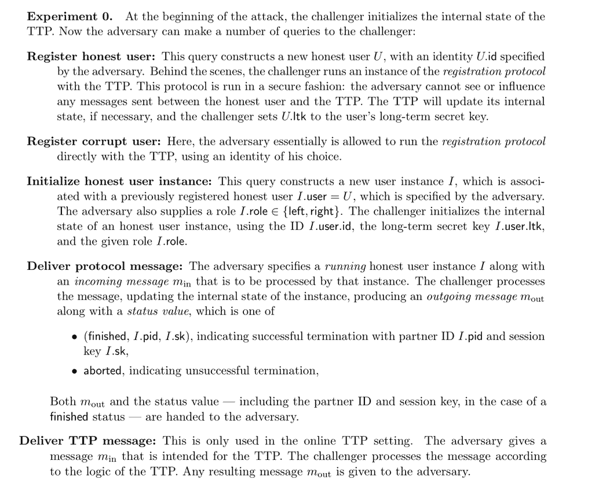

# 在不安全的通道上建立安全连接

> 原文：[`intensecrypto.org/public/lec_13_handshake.html`](https://intensecrypto.org/public/lec_13_handshake.html)

*如有任何错误/打字错误/令人困惑的解释？[在 GitHub 上打开一个 issue](https://github.com/boazbk/crypto/issues/new)。您也可以在下面评论*

**★ 另请参阅本章的[PDF 版本](https://files.boazbarak.org/crypto/lec_13_handshake.pdf)（更好的格式/参考文献）★

我们现在已经汇集了实现密码学基本目标（这个目标经常被篡改）所需的所有工具，允许爱丽丝和鲍勃在观察或受敌手控制的通道上交换消息，确保其完整性和机密性。我们实现这一目标的工具包括：

+   公钥（也称为非对称）加密方案。

+   公钥（也称为非对称）数字签名方案。

+   私钥（也称为对称）加密方案 - 块密码和流密码。

+   私钥（也称为对称）消息认证码和伪随机函数。

+   既可以用于压缩消息进行身份验证，也可以用于密钥派生和其他任务的哈希函数。

我们从这些构建块中所需的安全概念也可以有所不同。对于加密方案，我们谈论 CPA（选择明文攻击）和 CCA（选择密文攻击），对于哈希函数，我们谈论抗碰撞性，将其（与密钥结合）用作伪随机函数，然后有时我们简单地将其建模为随机预言机。此外，所有这些工具都需要访问随机源，在这里我们同样使用哈希函数进行熵提取。

## 密码学对形容词的迷恋。

随着我们学习越来越多的密码学，我们看到越来越多的形容词，每个概念似乎都有诸如“非可变”、“抗泄露”、“基于身份”、“并发安全”、“自适应”、“非交互式”等修饰语。确实，这激发了一个[自动密码学论文标题生成器](https://cseweb.ucsd.edu/~mihir/crypto-topic-generator.html)的讽刺网页。与算法不同，算法通常有直接的*定量*权衡（例如，更快更好），在密码学中，有许多*定性*的方式协议可以根据它们操作下的假设和它们提供的安全概念而有所不同。

在考虑在两个当事人爱丽丝和鲍勃之间安全传输信息时，以下问题会出现：

+   **基础设施/设置假设:** 爱丽丝和鲍勃可以依赖什么样的设置？例如，在 TLS 协议中，通常爱丽丝是一个网站，鲍勃是一个用户；使用证书机构的设施，鲍勃有可信的方式来获取爱丽丝的**公共签名密钥**，而爱丽丝对鲍勃一无所知。但还有许多其他变体。爱丽丝和鲍勃可以共享一个（低熵）**密码**。其中一方可能有一些硬件令牌，或者他们可能有一个安全的非信道通道（例如，短信）来传输少量信息。甚至有变体，其中当事人通过他们**知道**的东西进行认证，一个最近的例子是**见证加密**的概念（Garg, Gentry, Sahai, and Waters），其中一个人可以将信息加密在一个“数字时间胶囊”中，由任何找到黎曼猜想证明的人打开。

+   **对抗性访问:** 我们需要防范哪些类型的攻击。最简单的设置是一个**被动监听**的对手（通常称为“爱娃”）但有时我们会考虑**主动的中间人攻击**（有时称为“马洛里”）。我们有时会考虑**优雅恢复**的概念。例如，如果对手成功入侵其中一方，那么他们显然可以自那时起清楚地阅读他们的通信，但我们希望保护他们过去的通信（一个称为**前向保密**的概念）。如果我们依赖于像证书机构这样的可信基础设施，我们可能会问如果对手入侵了这些机构会发生什么。有时我们依赖于几个实体或秘密的安全性，我们希望考虑控制**一些**但不是**所有**它们的对手，这个概念称为**门限密码学**。虽然我们通常假设信息要么是完全保密的，要么是完全公开的，但我们有时想要模拟**侧信道攻击**，其中对手可以了解关于秘密的**部分信息**，这被称为**抗泄露密码学**。

+   **交互:** 爱丽丝和鲍勃能否进行交互并来回传递几条消息，或者这是一个“一次性”协议？你可能认为这只是关于效率的问题，但结果证明这对某些应用至关重要。有时，爱丽丝和鲍勃可能不是空间上分隔的两个当事人，而是时间上分隔的同一当事人。也就是说，爱丽丝希望通过将加密和认证后的版本存储在某种媒体上来向她的未来自我发送消息。在这种情况下，如果没有时间机器，两个当事人之间的来回交互显然是不可能的。

+   **安全目标**：协议的安全目标通常用否定形式来表述——对手在安全游戏中“获胜”意味着什么。我们通常希望对手除了显然可以知道的信息外，对秘密一无所知。例如，如果我们从 $t$ 种可能性中选择共享密码，那么我们可能需要允许对手有 $1/t$ 的成功概率，但我们不希望她得到 $1/t+negl(n)$ 以上的任何东西。在某些情况下，对手显然可以完全切断 Alice 和 Bob 之间的通信通道，但我们希望她基本上只能选择完全中断通信或让它不受干扰地通过，而没有修改通信而不被检测的能力。在某些情况下，例如在隐写术和无名路由的情况下，我们希望对手甚至不知道对话是否发生过。

## 基本密钥交换协议

安全通信的基本原语是密钥交换协议，其目标是 Alice 和 Bob 共享一个共同的随机密钥 $k\in\{0,1\}^n$。一旦完成，他们可以使用 CCA 安全/认证的私钥加密来保密和完整地通信。

基本密钥交换协议的典型例子是*迪菲-赫尔曼*协议。它使用公共参数组 $\mathbb{G}$ 和生成元 $g$，然后按照以下步骤进行：

1.  Alice 随机选择 $a\leftarrow_R\{0,\ldots,|\mathbb{G}|-1\}$ 并发送 $A=g^a$。

1.  Bob 随机选择 $b\leftarrow_R \{0,\ldots,|\mathbb{G}|-1\}$ 并发送 $B=g^b$。

1.  他们都将密钥设置为 $k=H(g^{ab})$（Alice 将其计算为 $B^a$，Bob 将其计算为 $A^b$），其中 $H$ 是某个哈希函数。

另一种变体是使用任意公钥加密方案，如 RSA：

1.  Alice 生成密钥 $(d,e)$ 并将 $e$ 发送给 Bob。

1.  Bob 随机选择 $k \leftarrow_R\{0,1\}^m$ 并将 $E_e(k)$ 发送给 Alice。

1.  他们都将密钥设置为 $k$（Alice 通过解密 Bob 的密文来计算密钥）

在合理的假设下，可以证明这些协议对*被动监听对手 Eve*是安全的。这里的“安全”概念意味着，类似于加密，如果 Eve 观察到的转储中，她以概率 $1/2$ 收到 $k$ 的值，以概率 $1/2$ 收到一个随机字符串 $k'\gets\{0,1\}^n$，那么她猜测哪个是案例的概率最多为 $1/2+negl(n)$（其中 $n$ 可以被认为是 $\log |\mathbb{G}|$ 或与该组成员位表示长度相关的其他参数）。

## 认证密钥交换

这个密钥交换协议的主要问题当然是，对手通常**不是**被动的。特别是，一个主动的“第三者”可以分别与 Alice 和 Bob 协商自己的密钥，然后能够看到并修改所有未来的通信。她也可能通过修改消息$A$为$A²$等，创建一些奇怪（可能具有潜在的安全影响）的相关性。

因此，在实际应用中，我们通常使用**认证**密钥交换。所使用的认证概念取决于我们对设置假设的假设。一个标准的假设是 Alice 有一些公钥，而 Bob 没有。这个假设的合理性在于 Alice 可能是一个服务器，它具有生成私钥/公钥对、分发公钥（例如，使用证书机构）并在安全存储中维护私钥的能力。相比之下，如果 Bob 是一个个人用户，那么他可能无法访问安全存储来维护私钥（因为个人设备通常容易受到黑客攻击）。此外，Alice 可能不关心 Bob 的身份。例如，如果 Alice 是 nytimes.com，而 Bob 是一个读者，那么 Bob 想知道他阅读的新闻确实来自《纽约时报》，但 Alice 对与任何读者进行交流都同样满意。在其他情况下，例如 gmail.com，在建立初始安全连接后，Bob 可以作为一个注册用户向 Alice 进行认证（通过发送他的登录信息或发送从过去交互中存储的“cookie”）。

在这些假设下，有可能获得一个安全的通道，但需要小心谨慎。确实，用于保护网络的标准化协议：传输层安全性（TLS）协议（及其前身 SSL）已经经历了六次修订（包括从 SSL 更名为 TLS），这主要是因为安全问题的考虑。我们现在将说明其中的一种攻击。

### 布莱钦巴赫对 RSA PKCS V1.5 和 SSL V3.0 的攻击

如果你有一个公钥，一个自然的方法是采用基于加密的协议并简单地跳过第一步，因为 Bob 已经知道 Alice 的公钥$e$。这基本上就是 SSL V3.0 协议中发生的事情。然而，正如布莱钦巴赫在 1998 年[所展示的](http://archiv.infsec.ethz.ch/education/fs08/secsem/bleichenbacher98.pdf)，结果发现这容易受到以下攻击：

+   对手监听对话，并特别观察$c=E_e(k)$其中$k$是私钥。

+   那么对手开始与服务器建立多个连接，使用与$c$相关的密文，并观察它们是否成功或失败（以及如果失败，它们是如何失败的）。结果发现，基于这些信息，对手将能够恢复密钥$k$。

特别是，SSL V3.0 协议中使用的 RSA 版本（称为 PKCS ＃1 V1.5）要求值 $x$ 具有特定的格式，最高两位字节具有某种形式。如果在协议过程中，服务器解密 $y$ 并得到一个不符合这种格式的值 $x$，则它将发送错误消息并终止连接。虽然 SSL V3.0 的设计者可能没有这样考虑，但这相当于说，SSL V3.0 服务器向任何一方提供了一个预言机，该预言机在输入 $y$ 时输出 $1$，当且仅当 $y^{d} \pmod{m}$ 具有这种形式，其中 $d = e^{-1} \pmod{|\Z^*_m|}$ 是秘密解密密钥。结果证明，可以使用这样的预言机来逆转 RSA 函数。对于类似的结果，参见 KL 中定理 11.31（第 418 页）的证明，其中他们展示了给定 $y$ 输出 $y^d \pmod{m}$ 的最低有效位的预言机允许逆转 RSA 函数。^(1)

因此，新的 SSL 版本使用了 RSA 的不同变体，称为 PKCS ＃1 V2.0，该变体在假设下满足 *选择密文安全 (CCA)*，并且特别是这样的预言机不能用来破解加密。尽管如此，仍然存在一些实现问题，使得对手能够执行一些攻击。具体来说，[Manger](http://archiv.infsec.ethz.ch/education/fs08/secsem/Manger01.pdf) 展示了，根据 PKCS ＃1 V2.0 的实现方式，仍然可能发起攻击。主要原因在于规范中声明了几个条件，在这些条件下解密盒应该返回“错误”。CCA 安全性的证明关键在于攻击者无法区分导致错误消息的条件。然而，某些实现仍然可能泄露这些信息，例如通过逐个检查这些条件，并在较早的条件成立时更快地返回“错误”。参见 Katz-Lindell (第 3 版) 12.5.4 的讨论。

## 公钥密码学的选择密文攻击安全性

选择密文攻击安全的概念对于 *公钥* 加密同样有意义。它以与私钥设置相同的方式定义：

如果在以下游戏中，每个有效的 Mallory 获胜的概率最多为 $1/2+ negl(n)$，则公钥加密方案 $(G,E,D)$ 是 *选择密文攻击 (CCA) 安全*：

+   密钥 $(e,d)$ 通过 $G(1^n)$ 生成，Mallory 得到公钥加密密钥 $e$ 和 $1^n$。

+   对于 $poly(n)$ 轮，Mallory 可以访问函数 $c \mapsto D_d(c)$。 (她不需要访问 $m \mapsto E_e(m)$，因为她已经知道 $e$。)

+   Mallory 选择一对消息 $\{ m_0,m_1 \}$，在 $\{0,1\}$ 中随机选择一个秘密 $b$，Mallory 得到 $c^* = E_e(m_b)$。 (注意，她当然不会得到用于生成这个挑战加密的随机性。)

+   Mallory 现在可以再次获得对函数 $c \mapsto D_d(c)$ 的 $poly(n)$ 轮访问权限，但她不允许查询 $c^*$。

+   Mallory 输出 $b'$，如果 $b'=b$，则*获胜*。

在私钥设置中，我们通过结合 CPA 安全的私钥加密方案和消息认证码（MAC）来实现 CCA 安全性，其中要为消息 $m$ 进行 CCA 加密，我们首先使用 CPA 安全的方案对 $m$ 进行处理以获得密文 $c$，然后通过使用 MAC 对 $c$ 进行签名添加一个认证标签 $\tau$。解密算法首先验证 MAC，然后再解密密文。在公钥设置中，我们可能希望重复使用 CPA 安全的*公钥*加密，并用*数字签名*替换 MAC。

尝试思考这样的构造会是什么样子，以及是否存在将数字签名和公钥加密以相同方式结合起来的基本障碍。

啊，正如你可能意识到的，这里有一个问题。在签名方案（必然）中，是*签名密钥*是*秘密的*，而*验证密钥*是*公开的*。但在公钥加密中，*加密密钥*是*公开的*，因此使用秘密签名密钥是没有意义的。（不难看出，如果你泄露了秘密签名密钥，那么最初使用签名方案就没有意义了。）

**为什么 CCA 安全性很重要。** 如上所述，构建 CCA 安全的公钥加密非常具有挑战性。但这值得麻烦吗？我们真的需要这种“极度保守”的安全概念吗？答案是*是的*。正如我们为*私钥*加密所论证的那样，选择密文安全是使我们尽可能接近设计符合*安全密封信封*隐喻的加密的一种概念。数字类比永远不会是物理类比完美的模仿，但这样的隐喻是人们在设计密码协议时心中所想的，即使我们不必担心对手能够打开密封的信封并使用任意字符串对其中写的内容进行 XOR 运算，这也是一项艰巨的任务。实际上，包括 Bleichenbacher 攻击在内的几种实际攻击正是利用了这种物理隐喻和数字实现之间的差距。关于这一点，请参阅[Victor Shoup 的调查报告](http://www.shoup.net/papers/expo.pdf)，其中他还描述了 Cramer-Shoup 加密方案，这是第一个被证明在无需随机预言机启发式方法的情况下具有 CCA 安全性的实际公钥系统。（CCA 安全性的第一个定义以及第一个多项式时间构造是在 Dolev、Dwork 和 Naor 于 1991 年发表的开创性工作中给出的。）

## 随机预言模型中的 CCA 安全公钥加密

我们现在将展示如何将任何 CPA 安全的公钥加密方案转换为随机或 acles 模型中的 CCA 安全方案（这个构造来自 Fujisaki 和 Okamoto，CRYPTO 99）。在作业中，你将看到从 *trapdoor permutation*（一种变体被称为 OAEP，它具有更好的密文扩展性）直接构造 CCA 安全方案的某种较为简单的直接构造方法，该方案已被标准化为 PKCS ＃1 V2.0 并用于几个协议中。通用构造的优点是它可以实例化为不仅仅是 RSA 和 Rabin 方案，还可以直接实例化为 Diffie-Hellman 和基于格的方案（尽管对于这些方案也有直接和更有效的变体）。

> **CCA-ROM-ENC 方案：**
> 
> +   **成分：** 一个 CPA 安全的公钥加密方案 $(G',E',D')$ 和三个哈希函数 $H,H',H'':\{0,1\}^*\rightarrow\{0,1\}^n$（我们将它们建模为独立的随机或 acles^(2))。
> +   
> +   **注意：** 我们假设 $E'$ 接受 $n$ 位消息（因为 CPA 安全性在连接下得到保留，一个单比特方案可以被转换成这样的方案）。由于 $E'$ 必然是随机的，我们用 $E'(x;s)$ 表示使用随机数 $s$ 加密消息 $x$。我们假设 $E'$ 使用的随机数位数是 $n$。（否则我们可以通过使用伪随机生成器修改方案以使用 $n$ 位，或者修改 $H$ 的陪域以成为 $E'$ 的随机选择空间。） 
> +   
> +   **密钥生成：** 我们为底层加密方案生成密钥 $(e,d)=G'(1^n)$。
> +   
> +   **加密：** 为了加密一个消息 $m\in\{0,1\}^\ell$，我们选择 $r \leftarrow_R \{0,1\}^n$，然后输出
> +   
> $$E_e(m) = E'_e(r ; H(m\|r)) \| H''(r) \oplus m \| H'(m \| r)$$
> 
> 回想一下，$E'_e(r ; s)$ 表示使用随机数 $s$ 加密消息 $r$。
> 
> +   **解密：** 为了解密密文 $c\|y \| h$，首先让 $r=D'_d(c)$，然后计算 $m=H''(r) \oplus y$。最后检查 $c= E'_e(r ; H(m\|r))$ 和 $h=H'(m\|r)$。如果任一检查失败，我们输出 `error`；否则我们输出 $m$。

上述 CCA-ROM-ENC 方案是 CCA 安全的。

设 $A$ 为一个多项式时间对手，它在方案 $(G,E,D)$ 中以概率 $1/2 + \epsilon$ 赢得“CCA 游戏”。我们将证明（断言 1）存在一个对手 $\tilde{A}$，它可以在不使用解密盒的情况下以概率 $1/2 + \epsilon - negl(n)$ 赢得这个游戏。然后我们将证明（断言 2）这意味着 $A'$ 可以以概率 $1/2 + \Omega(\epsilon)$ 赢得方案 $(G',E',D')$ 中的 *CPA 游戏*。我们首先建立第一个断言：

**断言 1：** 在上述假设下，存在一个多项式时间对手 $\tilde{A}$，它可以在不向解密盒发出任何查询的情况下赢得方案 $(G,E,D)$ 中的 CCA 游戏。

**对主张 1 的证明：** 对手 $\tilde{A}$ 将模拟 $A$，并跟踪 $A$ 对其解密和随机预言机的所有查询。每当 $A$ 向解密预言机发出查询 $c\|y\|h$ 时，$\tilde{A}$ 将使用以下“伪造”解密盒 $\tilde{D}$ 进行响应：检查 $h$ 是否之前已从随机预言机 $H'$ 作为对 $A$ 发出的查询 $m\|r$ 的响应返回。如果是这样，$\tilde{A}$ 将检查 $c = E'_e(r;H(m\|r))$ 和 $y= H''(r) \oplus m$。如果是这样，它将返回 $m$，否则它将返回 `error`。请注意，$\tilde{D}(c\|y\|h)$ 是在没有任何关于密钥 $d$ 的知识的情况下计算的。

我们声称 $\tilde{A}$ 返回与真实解密盒不同的答案的概率是可以忽略不计的。确实，对于每个特定的查询 $c\|y\|h$，首先观察到如果 $\tilde{D}(c\|y\|h)$ 不是 `error`，那么 $\tilde{D}(c\|y\|h) = D_d(c\|y\|h)$。确实，在这种情况下，有 $c=E'_e(m;H(m\|r))$，$y=H'(r) \oplus m$ 和 $h=H'(m\|r)$。因此，这是一个正确格式的加密 $m$，对于这个加密，真实解密盒也将返回 $m$。

因此，$D$ 和 $\tilde{D}$ 不同的唯一方式是 $D_d(c\|y\|h)=m$ 但 $\tilde{D}(c\|y\|h)$ 返回 `error`。为此，必须满足 $r=D'_d(c)$，$h=H'(m\|r)$ 但 $m\|r$ 之前没有被 $A$ 查询过。有两种选择：要么 $m\|r$ 完全没有被查询过，但根据“懒惰评估”范式，值 $H'(m\|r)$ 在 $\{0,1\}^n$ 中均匀选择，与 $h$ 无关，它等于 $h$ 的概率是 $2^{-n}$。另一种选择是 $m\|r$ 被查询过，但不是由对手查询。在 CCA 游戏中，唯一可以对预言机进行查询的其他方是挑战者，它在生成挑战密文 $C^* = c^*\|y^*\|h^*$ 时只对 $H'$ 进行一次查询，其中 $h^* = H'(m^*\|r^*)$。现在，对手不允许查询 $C^*$，因此在这种情况下，查询必须具有形式 $c\|y\|h^*$，其中 $c\|y \neq c^*\|y^*$。但 $D_d(c\|y\|h^*)$ 返回除 `error` 之外值的唯一方式是对于 $r=D'_d(c)$ 和 $m = y \oplus H''(r)$，$c=E_e(r;H(m\|r))$ 和 $h^* = H'(m\|r)$。由于 $H'$ 中碰撞的概率可以忽略不计，这只能发生在 $m\|r = m^*\|r^*$ 的情况下，但在这种情况下，将满足 $c=c^*$ 和 $y=y^*$，这与密文必须与 $C^*$ 不同的事实相矛盾。**QED（主张 1）**

**主张 2：** 在上述假设下，存在一个多项式时间对手 $A'$，它在方案 $(G',E',D')$ 的 CPA 游戏中获胜的概率至少为 $1/2 + \epsilon/10$。

**对主张 2 的证明：**

$A'$ 使用“懒评估”模拟随机预言机 $H,H',H''$，与从断言 1 中获得的对手 $\tilde{A}$ 进行完整的 CCA 实验。当对手 $\tilde{A}$ 选择两个密文 $m_0,m_1$ 时，$A'$ 将执行以下操作：

1.  对手 $A'$ 将选择 $r_0,r_1 \leftarrow_R \{0,1\}^n$，将其提供给自己的挑战者，并获取 $c^*$，它要么是 $E'_e$ 对 $b^* \leftarrow_R \{0,1\}$ 下 $r_{b^*}$ 的加密。如果对手 $\tilde{A}$ 在过去对随机预言机提出了形式为 $r_b$ 或 $m_b\|r_{b'}$ 的查询，其中 $b,b' \in \{0,1\}$，则停止实验并宣布失败。（由于 $r_0,r_1$ 在 $\{0,1\}^n$ 中是随机的，并且 $\tilde{A}$ 只提出了多项式数量的查询，这种情况发生的概率是可以忽略的）。

1.  现在，对手 $A'$ 将 $c^* \| y^* \| h^*$（其中 $y^*,h^* \leftarrow_R \{0,1\}^n$）作为对挑战的响应提供给 $\tilde{A}$。（请注意，这个密文以任何方式都不涉及 $m_0$ 或 $m_1$。）

1.  现在如果对手 $\tilde{A}$ 向其一个预言机提出形式为 $r_b$ 或 $m\|r_b$ 的查询，其中 $b\in \{0,1\}$，那么 $A'$ 将输出 $b$。否则，它将输出一个随机输出。

注意，对手 $A'$ 忽略了 $\tilde{A}$ 的**输出**。它只关心 $\tilde{A}$ 提出的查询。比如说，一个“$r_b$ 查询”是指以 $r_b$ 为后缀的查询。为了完成证明，我们提出以下两个断言：

**断言 2.1**：$\tilde{A}$ 提出形式为 $r_{1-b^*}$ 的查询的概率是可以忽略的。**证明**：这是因为 $\tilde{A}$ 收到的唯一一个依赖于 $r_0,r_1$ 的值是 $c^*$，它是 $r_{b^*}$ 的加密。因此，$\tilde{A}$ 从未看到任何依赖于 $r_{1-b^*}$ 的值，并且由于它在 $\{0,1\}^n$ 中是均匀分布的，$\tilde{A}$ 提出具有这种后缀的查询的概率是可以忽略的。**QED（断言 2.1）**

**断言 2.2**：$\tilde{A}$ 以至少 $\epsilon/2$ 的概率提出形式为 $r_{b^*}$ 的查询。**证明**：设 $c^* = E'_e(r_{b^*} ; s^*)$，其中 $s^*$ 是用于生成它的随机数。根据懒评估范式，由于在此点之前没有提出 $r_{b^*}$ 查询，如果我们定义 $H(m_b\|r_{b^*})=s^*$，定义 $H''(r_{b^*}) = y^* \oplus m_b$ 并定义 $h^* = H'(m_b\|r_{b^*})$，则密文的分布将与实际 CCA 游戏中的分布相同。现在，由于 $\tilde{A}$ 以 $1/2 + \epsilon - negl(n)$ 的概率赢得 CCA 游戏，在这个游戏中，它必须以至少 $\epsilon/2$ 的概率在 $r_{b^*}$ 处查询 $H''$。实际上，在未查询此值的情况下，字符串 $y^*$ 与消息 $m_0$ 独立，并且对手无法以超过 $1/2$ 的概率赢得游戏。**QED（断言 2.2）**

声明 2.1 和 2.2 一起意味着对手$\tilde{A}$至少以$\epsilon/2$的概率进行$r_{b^*}$查询，以可忽略的概率进行$r_{1-b^*}$查询，因此我们的对手$A'$将以至少$\epsilon/2$的概率输出$b^*$，并且在大约除了可忽略的部分之外的所有剩余概率中会随机猜测，导致 CPA 游戏的整体成功率至少为$1/2 + \epsilon/2$。**QED（声明 2 和因此定理）**

### 定义安全的认证密钥交换

安全通信的基本目标是设置两个当事人 Alice 和 Bob 之间的**安全通道**。我们希望在开放的网络上这样做，在那里 Alice 和 Bob 之间的消息可能会被对手读取、修改、删除或添加。此外，我们希望 Alice 和 Bob 确信他们正在与对方交谈，而不是其他当事人。这提出了身份是什么以及如何验证身份的问题。最终，如果我们想使用身份，那么我们需要信任某个权威机构来决定哪个当事人拥有哪个身份。这通常是通过一个**证书颁发机构（CA）**来完成的。这是一个受信任的权威机构，其验证密钥$v_{CA}$是公开的，并且为所有当事人所知。Alice 以某种方式向 CA 证明她确实是 Alice，然后生成一对$(s_{Alice},v_{Alice})$，并从 CA 获得消息$\sigma_{Alice}$=“密钥$v_{Alice}$属于 Alice”由$s_{CA}$签发的消息。$3$。现在 Alice 可以向 Bob 发送$(v_{Alice},\sigma_{Alice})$来证明这个公钥的所有者确实是 Alice。

例如，在网页设置中，某些[证书颁发机构](https://en.wikipedia.org/wiki/Certificate_authority)可以证明某个公钥与某个网站相关联。如果你使用`https`协议访问网站，你应该在你的浏览器上看到一个“锁”符号，它会提供证书的详细信息。通常，证书是一系列证书。如果我点击我的 Chrome 浏览器中的这个锁符号，我会看到证明 amazon.com 的公钥是某个特定字符串（对应于 2048 位的 RSA 模数和指数）的证书是由赛门铁克证书颁发机构签发的，而赛门铁克的密钥是由 Verisign 认证的。我与亚马逊的通信是一个**单向认证**设置的例子。对我而言，知道我真正在与 amazon.com 交谈非常重要，而亚马逊愿意与任何客户交谈。（当然，一旦我们建立了一个安全通道，我就可以用它来登录我的亚马逊账户。）Boneh-Shoup 的第二十一章深入讨论了认证密钥交换协议，例如?? ??。由于定义非常复杂，我们不会在本书中详细讨论完整的正式定义，但我推荐 Boneh-Shoup 以深入了解。

 AEK1 - AEK4 协议的定义。

### 认证密钥交换的编译器方法。

获得认证密钥交换协议有一种通用的“编译器”方法：

+   从一个仅对被动监听攻击者安全的协议，如基本 Diffie-Hellman 协议开始。

+   然后*编译*成一个针对主动攻击者使用认证工具（如数字签名、消息认证码等）的协议，具体取决于你可以假设的设置和你想要达到的属性。

这种方法在构建和分析方面都具有模块化的优势。然而，直接构建可能更有效率。密钥交换协议有许多可能希望拥有的属性，不同的协议以不同的成本实现了这些属性的不同子集。最常用的认证密钥交换协议变体是使用某种版本的 Diffie-Hellman 密钥交换。如果双方都有公钥签名，那么他们可以简单地签名他们的消息，这样就可以有效地排除主动攻击，将主动安全性降低到被动安全性（尽管需要在签名中包含身份信息以确保消息不重复，参见[这里](http://link.springer.com/article/10.1007%2FBF00124891))。

Diffie-Hellman 最有效的变体隐式地实现了认证，其中基本协议保持不变（发送 $X=g^x$ 和 $Y=g^y$），但共享密钥的计算涉及一些认证信息。在这些协议中，一个特别有效的变体是 Law、Menezes、Qu、Solinas 和 Vanstone 的 MQV 协议（其基于与 DSA 签名类似的原则），以及 Krawczyk 的变体[HMQV](https://eprint.iacr.org/2005/176.pdf)，它具有一些改进的安全特性和分析。

## 密码认证密钥交换。

**注意：**以下三个部分尚未编写——我们将在课堂上讨论它们，但请至少浏览以下列出的资源。

PAKE 在 Boneh-Shoup 的第 21.11 章有所介绍。

## 客户端到客户端的密钥交换，用于安全文本消息——ZRTP、OTR、TextSecure。

待完成。参见 [Matthew Green 的博客](http://blog.cryptographyengineering.com/2013/03/here-come-encryption-apps.html) ， [text secure](https://whispersystems.org/blog/advanced-ratcheting/) ， [OTR](https://otr.cypherpunks.ca/Protocol-v3-4.0.0.html)。

安全要求：前向保密，可否认性。

## 心脏出血和日志拥堵攻击

+   过去密码政策的遗迹。

+   “完美前向保密”的重要性

12.1：NSA 对破解加密通信的看法

1.  这种类型的第一次攻击是在 1982 年 Goldwasser、Micali 和 Tong 的论文中给出的。有趣的是，这种“核心位”的概念已经被用于对密码系统的实际*攻击*，以及其他密码系统的理论（有时是实际）*构造*。

    ↩

1.  记住，从单个预言机 $H''$ 获取两个独立的随机预言机 $H$ 和 $H'$ 是很容易的，例如通过让 $H(x)=H''(0\|x)$ 和 $H'(x)=H''(1\|x)$ 来实现。同样，我们可以将这个方法扩展到三个、四个或任何数量的预言机。

    ↩

1.  注册过程可能比这更微妙，例如，Alice 可能需要向 CA*证明*她确实知道相应的密钥。

    ↩

## 评论

评论通过 [utteranc.es](https://utteranc.es) 应用发布在 [GitHub 仓库](https://github.com/boazbk/crypto/issues) 上。需要 GitHub 登录才能评论。如果您不想授权应用代表您发布，您也可以直接在 [GitHub 页面问题](https://github.com/boazbk/crypto/issues?q=Secure%20communication%20over%20insecure%20channels%2Bin%3Atitle) 上发表评论。

编译于 2021 年 11 月 17 日 22:36:31

版权所有 2021，Boaz Barak。

本作品受[Creative Commons Attribution-NonCommercial-NoDerivatives 4.0 International License](https://creativecommons.org/licenses/by-nc-nd/4.0/)许可。

使用 [pandoc](https://pandoc.org/) 和 [panflute](http://scorreia.com/software/panflute/) 以及从 [gitbook](https://www.gitbook.com/) 和 [bookdown](https://bookdown.org/) 衍生的模板制作。
