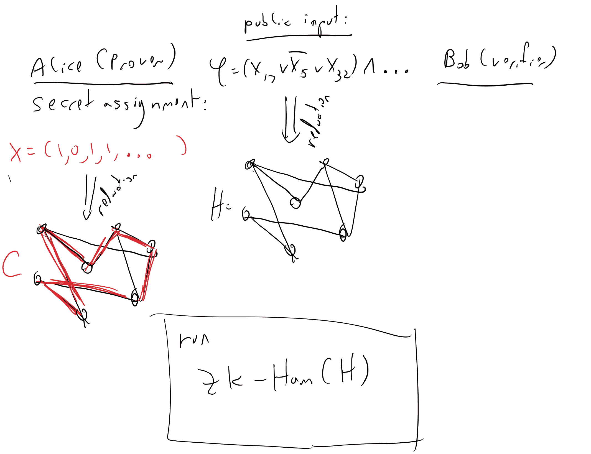

# 零知识证明

> 原文：[`intensecrypto.org/public/lec_14_zero_knowledge.html`](https://intensecrypto.org/public/lec_14_zero_knowledge.html)

*发现任何错误/打字错误/令人困惑的解释？[在 GitHub 上打开一个 issue](https://github.com/boazbk/crypto/issues/new)。你还可以在下面评论*

**★ 另请参阅本章的[**PDF 版本**](https://files.boazbarak.org/crypto/lec_14_zero_knowledge.pdf)（更好的格式/参考文献）★

*证明*的概念在许多领域都是核心的。在数学中，我们希望证明某个断言是正确的。在其他科学中，我们经常希望积累大量的证据（或统计显著性）来拒绝某些假设。在刑法中，起诉方著名地需要“有合理怀疑”地证明其案件。密码学最终给这个古老的概念带来了新的转折。

通常，一个断言 X 为真的证明，也会揭示一些关于 X 为真的*原因*。当赫尔克里·波洛证明诺曼·盖尔杀害了吉斯尔夫人时，他是通过展示盖尔如何乔装成空姐并用毒箭刺杀吉斯尔夫人来证明的。赫尔克里·波洛能否在没有提供任何关于犯罪*如何*进行的信息的情况下，让我们有合理的怀疑盖尔犯了罪？俄罗斯能否在不透露任何关于其设计信息的情况下，向美国证明一个密封的盒子中包含一个真实的核弹头？我能否在不提供关于$m$的质因数任何信息的情况下，向你证明数字$m=385,608,108,395,369,363,400,501,273,594,475,104,405,448,848,047,062,278,473,983$有一个以 7 结尾的质因数？我们不会回答第一个问题，但会展示一些关于后两个问题的见解.^(1)

*零知识证明*是那些完全令人信服地证明一个陈述为真，而不提供*任何额外知识*的证明。因此，在看到$m$有一个以 7 结尾的因子的零知识证明后，你将不会比之前更接近知道$m$的分解。零知识证明由 Goldwasser、Micali 和 Rackoff 于 1982 年发明，并自那时以来在许多环境中得到了应用。你将如何实现这样的事情，甚至定义它？为什么在地球上这会有用？这就是本讲座的主题。

本章将依赖于**NP 完备性**的概念，以及将 NP 视为证明系统的观点。关于这个概念的回顾，请参阅[我的 TCS 引论文本的这一章节](https://introtcs.org/public/lec_13_Cook_Levin.html)。

## 零知识证明的应用。

在我们讨论如何实现零知识之前，让我们讨论一些其潜在的应用：

### 核裁军

美国和俄罗斯已经达到一种危险且昂贵的均衡状态，各自拥有大约 [7000 枚核弹头](https://www.armscontrol.org/factsheets/Nuclearweaponswhohaswhat)，这远远超过了摧毁彼此人口（以及世界上大部分其他地区人口）所需的数量。（^(2）拥有如此多的武器增加了武器“泄露”或因通信故障或反叛指挥官的意外发射（可能导致全面战争）的风险。这也威胁到了[《不扩散核武器条约》](https://en.wikipedia.org/wiki/Treaty_on_the_Non-Proliferation_of_Nuclear_Weapons)的微妙平衡，该条约的核心是一种协议，其中非核武器国家同意不追求核武器，而五个核武器国家同意在核裁军方面取得进展。这些大量的核武器不仅危险，因为它们增加了泄露或个别故障或反叛指挥官引发世界灾难的风险，而且维护成本极高。

由于所有这些原因，2009 年，美国总统奥巴马呼吁将“一个没有核武器的世界”设定为一个长期目标，并在 2012 年具体提到了与俄罗斯讨论减少“不仅我们的战略核弹头，还包括战术武器和储备弹头”。另一方面，俄罗斯总统普京已经在 2000 年表示，他认为“没有任何障碍会阻碍未来战略进攻性武器的深度削减”。（尽管截至 2018 年，双方的政治风向都从裁军转向了更多武装。）

核裁军进展缓慢的原因有很多，其中大部分与零知识或其他任何技术无关。但也有一些技术障碍。其中一个障碍是，为了使美国和俄罗斯能够超越限制部署武器的数量，显著减少库存，他们需要找到一种方法，让一个国家能够可靠地证明它已经拆除了弹头。正如我在与格拉斯和戈尔茨顿的合作中提到的[工作](http://www.nature.com/nature/journal/v510/n7506/full/nature13457.html)（另见[这个页面](http://nuclearfutures.princeton.edu/warhead-verification/)），一个关键的障碍是，核弹头的设计当然是高度机密的，也是美国最不愿意与俄罗斯分享的东西，反之亦然。那么，美国如何让俄罗斯相信它已经销毁了弹头，当它不能让俄罗斯专家接近它时？

### 投票

电子投票由于许多原因而备受关注。一个潜在的优势是它可能允许完全透明的计票，每个公民都可以验证投票是否被正确计票。例如，Chaum 提出了一种方法，通过发布每个投票的加密并让中央权威机构**证明**最终结果与所有明文的计数相对应来实现这一点。但当然，为了保持选民隐私，我们需要在不实际揭示这些明文的情况下证明这一点。我们能这样做吗？

### 更多应用

我选择上述两个例子正是因为它们并不是在思考零知识时首先想到的。零知识已经被用于许多密码学应用中。其中一个应用（起源于 Fiat 和 Shamir 的工作）是用于**身份验证协议**。在这里，Alice 知道谜题$P$的解$x$，并通过例如提供$x$的加密$c$并证明在零知识下$c$确实是$P$的解的加密来向 Bob 证明她的身份。Bob 可以验证这个证明，但由于它是零知识的，因此对谜题的解一无所知，将无法冒充 Alice。对于此类身份验证协议的另一种方法是使用**数字签名**；这种联系是双向的，Schnorr 和其他人将零知识证明用作签名方案的基础。

另一个非常通用的应用是用于“编译协议”。正如我们一次又一次看到的，处理**被动**对手通常比处理**主动**对手容易得多。（例如，与中间人 Mallory 的 CCA 安全相比，对窃听者 Eve 的 CPA 安全要容易得多。）因此，如果我们能够“编译”一个对被动攻击安全的协议，使其对主动攻击也安全，那将是非常美好的。Goldreich、Micali 和 Wigderson 首先展示了零知识证明可以产生这样一个非常通用的编译器。其想法是，所有各方都在零知识下证明他们遵循协议的规范。通常，这样的证明可能需要各方揭示他们的秘密输入，从而违反安全性，但零知识恰好保证了我们可以验证正确的行为而不需要访问这些输入。

## 定义和构建零知识证明

因此，零知识证明是非常好的对象，但我们如何得到它们？事实上，我们还没有回答如何**定义**零知识的甚至更基本的问题。我们必须从定义我们所说的**证明**这一最基本任务开始。

可以将**证明系统**视为一个算法$V$（表示“验证者”），它接受一个**陈述**作为输入，这个陈述是某个字符串$x$，另一个称为**证明**的已知字符串$\pi$，并且当且仅当$\pi$是陈述$x$正确的有效证明时输出$1$。例如：

+   在**欧几里得几何**中，**陈述**是几何事实，例如“在任何三角形中，角度之和为 180 度”，而**证明**是从五个基本[公设](https://en.wikipedia.org/wiki/Euclidean_geometry)逐步推导出陈述的过程。

+   在[*策梅洛-弗兰克尔公理选择（ZFC）*](https://en.wikipedia.org/wiki/Zermelo%E2%80%93Fraenkel_set_theory)中，**陈述**是关于集合的一些所谓事实（例如，黎曼猜想^(4))，而**证明**是从公理逐步推导出它的过程。

+   我们可以定义许多其他“理论”。例如，一个理论，其中陈述是 $(x,m)$ 这样的对，其中 $x$ 是模 $m$ 的二次剩余，而 $x$ 的证明是满足 $x=s² \pmod{m}$ 的数 $s$，或者一个理论，其中定理是**哈密顿图** $G$（包含 $n$ 个顶点和 $n$ 个长循环的图），而证明是循环的描述。

所有这些证明系统都具有验证算法 $V$ 是**高效**的性质。事实上，这就是证明 $\pi$ 的全部意义——它是一系列符号，使得验证陈述为真变得容易。

为了实现零知识证明的概念，Goldwasser 和 Micali 必须考虑从静态符号序列到证明的推广，即证明者与验证者之间的**交互概率协议**。让我们从一个非正式的例子开始。绝大多数人类眼睛中有三种类型的圆锥细胞。我们之所以[感知天空是蓝色的](http://www.patarnott.com/atms749/pdf/blueSkyHumanResponse.pdf)（参见[这里](https://www.forbes.com/sites/briankoberlein/2017/01/11/earths-skies-are-violet-we-just-see-them-as-blue/#33aaaf0f735f))，尽管它的颜色与彩虹的蓝色大不相同，是因为天空的颜色投影到我们的圆锥细胞上最接近蓝色的投影。有人建议，人类人口中可能只有一小部分人（实际上，只有女性，因为这需要两个 X 染色体和某种突变）有四个功能正常的圆锥细胞。一个人如何**证明**给另一个人她实际上是一个[四色性](https://en.wikipedia.org/wiki/Tetrachromacy)者呢？

> **四色性证明：**
> 
> 假设爱丽丝是一个四色性者，可以区分两个塑料碎片，这些碎片对于一个三色性者来说是相同的。她想要向三色性者鲍勃证明这两个碎片不是相同的。她可以这样做：
> 
> 爱丽丝和鲍勃将重复以下实验 $n$ 次：爱丽丝背对着，鲍勃抛硬币，以概率 1/2 保持碎片不变，以概率 1/2 将右碎片与左碎片交换。爱丽丝需要猜测鲍勃是否交换了碎片。
> 
> 如果爱丽丝在所有 $n$ 次重复中都很成功，那么鲍勃将有 $1-2^{-n}$ 的信心认为碎片确实不同。

一个类似的“证明”启发了统计学中有影响力的概念 *假设检验*。Muriel Bristol 博士（[Muriel Bristol](https://www.sciencehistory.org/distillations/ronald-fisher-a-bad-cup-of-tea-and-the-birth-of-modern-statistics)）说，她更喜欢先在杯子里放牛奶，然后放茶的味道，而不是反过来。统计学家 Ronald Fisher 不相信她。William Roach（像 Bristol 一样，是一位化学家，也是她的未来丈夫）提出了一种概率检验，即为 Bristol 倒八杯茶，每杯随机选择是“先牛奶”还是“先茶”。Bristol 正确地识别了所有 8 杯。思考这个实验，以及它所提供的拒绝“零假设”即 Bristol 随机猜测的置信水平，导致了 Fisher 对假设检验和现在无处不在的“$p$ 值”的发展。

我们现在考虑一个更“数学”的例子，与类似的例子。回想一下，如果 $x$ 和 $m$ 是数字，那么我们说 $x$ 是模 $m$ 的 *二次剩余*，如果存在某个 $s$ 使得 $x=s² \pmod{m}$。让我们定义函数 $\ensuremath{\mathit{NQR}}(m,x)$，当且仅当对于每个 $s \in \{0,\ldots, m-1\}$，$x \neq s² \pmod{m}$ 时输出 $1$。有一种非常简单的方式来证明形式为“$\ensuremath{\mathit{NQR}}(m,x)=0$”的陈述：只需给出 $s$。然而，这里有一个交互式证明系统来证明形式为“$\ensuremath{\mathit{NQR}}(m,x)=1$”的陈述：

+   我们有两个当事人：**爱丽丝**和**鲍勃**。**共同输入**是 $(m,x)$，爱丽丝想说服鲍勃 $\ensuremath{\mathit{NQR}}(m,x)=1$。（也就是说，$x$ 不是模 $m$ 的二次剩余）。

+   我们假设爱丽丝可以计算 $\ensuremath{\mathit{NQR}}(m,w)$ 对于每一个 $w\in \{0,\ldots,m-1\}$，但鲍勃是多项式时间的。

+   协议将按以下方式工作：

1.  鲍勃将随机选择一些 $s\in \Z^*_m$（例如，通过在 $\{1,\ldots,m-1\}$ 中随机选择一个数字，如果它与 $m$ 有非平凡的最大公约数，则丢弃它）并掷一个硬币 $b\in\{0,1\}$。如果 $b=0$，那么鲍勃将 $s² \pmod{m}$ 发送给爱丽丝，否则他将 $xs² \pmod{m}$ 发送给爱丽丝。

1.  爱丽丝将利用她计算 $\ensuremath{\mathit{NQR}}(m,\cdot)$ 的能力，如果鲍勃发送了一个二次剩余，则回复 $b'=0$，否则回复 $b'=1$。

1.  如果 $b=b'$，鲍勃将**接受**这个证明。

要看到鲍勃确实会接受这个证明，请注意，如果 $x$ 是一个非剩余，那么 $xs²$ 也必须是一个非剩余（因为如果它有一个根 $s'$，那么 $s's$ 将是 $xs²$ 的一个根）。因此，总是会有 $b'=b$。

此外，如果 $x$ *是*形式为 $x=s'² \pmod{m}$ 的某个 $s'$ 的二次剩余，那么 $xs²=(s's)²$ 简单地是一个随机二次剩余，这意味着在这种情况下，无论 $b=0$ 还是 $b=1$，Bob 的消息分布都是相同的，无论她做什么，Alice 最多有 $1/2$ 的概率猜出 $b$。因此，如果 Alice 总是成功，那么在 $n$ 次重复之后，Bob 对 $x$ 确实是模 $m$ 的非剩余的信心将是 $1-2^{-n}$。

请停下来确保你看到这个协议与证明两块塑料颜色不同的协议之间的相似性。

让我们现在给出正式的定义：

设 $f:\{0,1\}^* \rightarrow \{0,1\}$ 是某个函数。对于 $f$ 的 *概率证明*（即形式为“$f(x)=1$”的陈述的证明），是一对交互算法 $(P,V)$，其中 $V$ 以多项式时间运行，并且它们满足：

+   **完整性**：如果 $f(x)=1$，则在输入 $x$ 时，如果 $P$ 和 $V$ 给定输入 $x$ 并交互，那么在交互结束时，$V$ 将以至少 $0.9$ 的概率输出 `Accept`。

+   **正确性**：如果 $f(x)=0$，那么对于任何任意（有效或无效）的算法 $P^*$，如果 $P^*$ 和 $V$ 给定输入 $x$ 并交互，那么在结束时 $V$ 将以最多 $0.1$ 的概率输出 `Accept`。

在许多文本中，证明系统是根据 *语言* 而不是 *函数* 来定义的。也就是说，我们不是谈论一个函数 $f:\{0,1\}^* \rightarrow \{0,1\}$，而是谈论一个 *语言* $L \subseteq \{0,1\}^*$。这两个观点通过映射 $f \longleftrightarrow L$ 完全等价，其中 $L = \{ x \;| f(x) = 1 \}$。

注意，我们不一定要求证明者有效（实际上，在某些情况下可能不是）。另一方面，即使证明者使用非有效策略，我们的正确性条件仍然成立。5 我们说一个证明系统有一个 *有效证明者*，如果存在一个 $L$ 的 NP 型证明系统 $\Pi$（即某个有效算法 $\Pi$，使得存在 $\pi$，使得 $\Pi(x,\pi)=1$ 当且仅当 $x\in L$，并且使得 $\Pi(x,\pi)=1$ 意味着 $|\pi|\leq poly(|x|)$，使得在给定的任何静态证明 $\pi$ 下，$P$ 的策略可以有效地实现）。

到目前为止，我们一直考虑的是爱丽丝和鲍勃相互信任的加密协议，但我们担心某个对手控制他们之间的通道。现在我们处于一个相对“可疑”的设置中，其中各方不完全信任彼此。在这样的协议中，始终有一个“规定”或**诚实**的策略，一个特定的参与者*应该*遵循，但我们通常不希望其他方的安全性依赖于他人的善意，因此也分析了参与者使用任意**恶意**策略的情况。我们有时也考虑**诚实但好奇**的情况，其中对手是被动收集信息，但不偏离规定的策略。

协议通常只保证当参与者 A 诚实行为时的安全性 - 一个参与者总是可以选择违反自己的安全性，而我们（或我们应该）对此无能为力。

## 定义零知识

到目前为止，我们仅仅定义了交互式证明系统的概念，但我们需要定义一个证明为零知识意味着什么。在我们尝试定义之前，让我们考虑一个例子。回到二次剩余的概念，假设 $x$ 和 $m$ 是公开的，爱丽丝知道 $s$，使得 $x=s² \pmod{m}$。她想要说服鲍勃这是真的。然而，她不想透露 $s$。她能否在不透露任何关于 $s$ 的信息的情况下说服鲍勃存在这样的 $s$？这里有一个这样做的方法：

**协议 ZK-QR：** 爱丽丝和鲍勃的公共输入：$x,m$；爱丽丝的私有输入是 $s$，使得 $x=s² \pmod{m}$。

1.  爱丽丝将随机选择一个 $s'$ 并将其发送给鲍勃 $x' = xs'² \pmod{m}$。

1.  鲍勃将随机选择一个比特 $b \in \{0,1\}$ 并将其发送给爱丽丝。

1.  如果 $b=0$，那么爱丽丝揭示 $ss'$，因此给出了 $x'$ 的一个根；如果 $b=1$，那么爱丽丝揭示 $s'$，因此展示了 $x'x^{-1}$ 的一个根。

1.  鲍勃检查爱丽丝揭示的值 $s''$ 是否确实是 $x'x^{-b}$ 的根，如果是的话，那么它“接受”这个证明。

如果 $x$ 不是二次剩余，那么无论 $x'$ 如何选择，$x'$ 或 $x'x^{-1}$ 都不是剩余，因此鲍勃将以至少 $1/2$ 的概率拒绝证明。通过重复 $n$ 次，我们可以将鲍勃接受非剩余证明的概率降低到 $2^{-n}$。

另一方面，我们声称我们并没有真正揭示关于 $s$ 的任何信息。事实上，如果鲍勃选择 $b=0$，那么他看到的两个消息 $(x',ss')$ 可以被视为一个随机的二次剩余 $x'$ 和它的根。如果鲍勃选择 $b=1$，那么在除以 $x$（他自己可以这样做）之后，他仍然得到一个随机的剩余 $x''$ 和它的根 $s'$。在这两种情况下，这两个消息的分布完全独立于 $s$，因此直观上不会提供关于它的任何额外信息，除了鲍勃之前所知道的信息之外。

为了在数学上定义零知识，我们遵循以下直觉：

> **如果一个证明系统是零知识的，那么验证者在交互后没有学到任何他单独就能学到的东西。**

尽管名为“零知识”，我们并不声称验证者对私有输入 $x$ 一无所知。例如，如果 $1m=p\cdot q$ 对于两个质数 $p,q$，那么每个 $s \in \Z^*_m$ 至多有四个平方根，如果验证者能计算平方根，那么他们可以将 $x$ 约束到这四个可能性。然而，重点是这种知识验证者在与证明者交互之前就已经拥有了，因此参与证明只导致了 **零额外知识**。

这里是我们如何正式定义零知识的：

对于函数 $f$ 的证明系统 $(P,V)$ 是 **零知识** 的，如果对于每一个高效的验证策略 $V^*$，存在一个高效的概率算法 $S^*$（称为 **模拟器**），使得对于每一个 $x$ 满足 $f(x)=1$，以下随机变量在计算上是不可区分的：

+   $V^*$ 在与 $P$ 在输入 $x$ 上交互后的输出。

+   $S^*$ 在输入 $x$ 上的输出。

也就是说，我们可以证明验证者从交互中没有获得任何东西，因为无论他使用什么算法 $V^*$，无论他通过与证明者交互学到什么，他都可以通过简单地运行独立算法 $S^*$ 在相同的输入上同样容易地学到。

定义安全性的自然方式是说，如果一个系统是安全的，那么一些“不良结果清单”X、Y、Z 不能发生。零知识的定义不同。它不是给出一个不允许发生的事件列表，而是给出一个最大化的 **模拟** 条件。

零知识的定义核心是以下内容：显然，我们无法阻止验证者对公共输入运行高效的算法 $S^*$，但我们希望确保这是他从交互中能学到的最多内容。

这种 **模拟范式** 已经成为许多加密应用安全性的标准定义方式。也就是说，我们通过假设一些假设的对手莉莉丝在更加严苛的条件下（例如，不能与证明者交互）来限制对手伊娃能学到的东西，并确保伊娃不能学到莉莉丝无法学到的东西。这种定义的优势在于它是可能的最保守定义，同时也将安全性用 **正面** 术语表达——存在一个模拟——与典型的 **负面** 术语——事件 X、Y、Z 不能发生相对。由于我们通常更容易用正面术语思考，矛盾的是，这种更强的安全性条件有时更容易证明。零知识在某种程度上是模拟范式的最简单设置，我们将在处理更高级概念时一次又一次地看到它。

零知识的定义很令人困惑，因为直观上看，如果验证者对陈述的真实性有了信心，那么他肯定学到了**一些东西**。这是那些密码学反直觉的案例之一。为了更好地理解它，值得看看上述二次剩余协议的正式证明：

上述 ZK-QR 协议是一个零知识协议。

令 $V^*$ 是 Bob 的一个任意高效策略。由于 Bob 只发送一个位，我们可以将这个策略视为由两个函数组成：

+   $V_1(x,m,x')$ 输出 Bob 在输入 $x,m$ 后选择的位 $b$，并在 Alice 的第一条消息是 $x'$ 后。

+   $V_2(x,m,x',s'')$ 是 Bob 在看到 Alice 对位 $b$ 的响应 $s''$ 后输出的内容。

$V_1$ 和 $V_2$ 都可以高效计算。我们现在需要想出一个高效的模拟器 $S^*$，它是一个独立的算法，在输入 $x,m$ 后将输出一个与 $V^*$ 输出不可区分的分布。

模拟器 $S^*$ 将按以下方式工作：

1.  选择 $b'\leftarrow_R\{0,1\}$。

1.  在 $\Z^*_m$ 中随机选择 $s''$。如果 $b=0$，则令 $x'={s''}² \pmod{m}$。否则输出 $x'=x{s''}² \pmod{m}$。

1.  令 $b=V_1(x,m,x')$。如果 $b \neq b'$ 则回到步骤 1。

1.  输出 $V_2(x,m,x',s'')$。

模拟器的正确性由以下命题（所有这些假设 $x$ 实际上是一个二次剩余，因为否则我们不需要做出任何保证，在任何情况下 Alice 的行为也没有明确定义）得出：

**命题 1：** $S^*$ 计算出的 $x'$ 的分布与 Alice 选择的 $x'$ 的分布相同。

**命题 2：** 至少有 $1/2$ 的概率，$b'=b$。

**命题 3：** 在 $b=b'$ 和第 2 步计算出的值 $x'$ 的条件下，$S^*$ 计算出的值 $s''$ 与 Alice 在第一条消息是 $x'$ 且 Bob 的响应是 $b$ 时发送的值相同。

一起，这三个命题意味着在期望中 $S^*$ 只会调用 $V_1$ 和 $V_2$ 一个常数次数（因为每次它最多以 $1/2$ 的概率回到步骤 1）。它们还意味着 $S^*$ 的输出实际上与 Alice 在真实交互中与 $V^*$ 的输出相同。因此，我们只需要证明这些命题，这实际上相当简单：

**命题 1 的证明：** 在两种情况下，$x'$ 是一个随机的二次剩余。**QED（命题 1）**

**命题 2 的证明：** 这是命题 1 的一个推论；由于 $x'$ 的分布与 Alice 选择的分布相同，特别是 $x'$ 不会泄露关于 $b'$ 选择的信息。**QED（命题 2）**

**命题 3 的证明：** 这直接从计算中得出。Alice 发送的值 $s''$ 是 $x'$ 的平方根，如果 $b=0$，或者 $x'x^{-1}$ 的平方根，如果 $x=1$。但是，这与 $b=b'$ 时 $S^*$ 发生的情况相同。**QED（命题 3）**

一起，这些完成了定理的证明。

定理 13.6 很有趣，但还不够好，还不能在实际中保证安全性。毕竟，我们需要真正证明的是零知识的协议，即我们重复这个程序$n$次。这是一个一般定理，如果协议是零知识的，那么依次多项式次数重复它（所谓“顺序重复”）会保持零知识。你可以把它看作是密码学的等式“$0+0=0$”的版本，但像往常一样，直观的东西并不总是正确的，因此这个定理确实需要（一个非平凡的）证明。尝试自己证明它是一个很好的练习。已知有方法以可忽略的正确性错误和**常数**数量的通信轮次实现零知识，参见 Goldreich 的书（第 1 卷，第 4.9 节）。

## 哈密顿性的零知识证明。

我们现在展示另一个语言的证明。

假设 Alice 和 Bob 知道一个$n$个顶点的图$G$，Alice 知道这个图中的一个**哈密顿回路**$C$（即长度为$n$的简单回路——一个恰好遍历所有顶点一次的回路）。以下是 Alice 如何证明存在这样一个回路而不泄露任何关于它的信息。

**协议 ZK-Ham**：

1.  **公共输入**：图$H$（以$n\times n$邻接矩阵的形式）。**Alice 的私有输入**：一个哈密顿回路$C=(C_1,\ldots,C_n)$，这些是不同的顶点，其中$(C_\ell,C_{\ell+1})$是$H$中的一个边，对于所有$\ell\in\{1,\ldots,n-1\}$，并且$(C_n,C_1)$也是一个边。以下我们假设$G:\{0,1\}^n \rightarrow\{0,1\}^{3n}$是一个伪随机生成器。

1.  Bob 选择一个随机的字符串 $z\in \{0,1\}^{3n}$

1.  Alice 选择一个随机排列$\pi$在$\{1,\ldots, n\}$上，并让$M$为$H$的$\pi$置换邻接矩阵（即，$M_{\pi(i),\pi(j)}=1$当且仅当$(i,j)$是$H$中的一个边）。对于每个$i,j$，Alice 选择一个随机字符串$x_{i,j} \in \{0,1\}^n$，并让$y_{i,j}=G(x_{i,j})\oplus M_{i,j}z$。她将$\{ y_{i,j} \}_{i,j \in [n]}$发送给 Bob。

1.  Bob 选择一个比特$b\in\{0,1\}$。

1.  如果$b=0$，那么 Alice 发送出$\pi$和所有$i,j$的字符串$\{ x_{i,j} \}$；如果$b=1$，那么 Alice 发送出$n$个字符串$x_{\pi(C_1),\pi(C_2)},\ldots,x_{\pi(C_n),\pi(C_1)}$以及它们的索引。

1.  如果$b=0$，那么 Bob 计算$M$为$H$的$\pi$置换邻接矩阵，并验证所有$y_{i,j}$都是适当从$x_{i,j}$计算得出的。如果是这样，那么 Bob 接受这个证明，否则拒绝它。如果$b=1$，那么 Bob 验证 Alice 发送的字符串$\{ x_{i,j } \}$的索引形成一个循环，并且确实对于 Alice 发送的每个字符串$x_{i,j}$，有$y_{i,j}=G(x_{i,j})\oplus z$。如果是这样，那么 Bob 接受这个证明，否则拒绝它。

协议 ZK-Ham 是哈密顿图语言的零知识证明系统.^(6)

我们需要证明**完备性**、**正确性**和**零知识**。

**完整性**可以很容易地验证，所以我们留给读者。

对于**正确性**，我们回忆一下（正如我们之前所看到的），以极高的概率，集合 $S_0=\{ G(x) : x\in\{0,1\}^n \}$ 和 $S_1 = \{ G(x)\oplus z : x\in\{0,1\}^n \}$ 将是互斥的（这个概率是在验证者选择的 $z$ 上计算的）。现在，假设这是真的，给定证明者在第一步中发送的消息 $\{ y_{i,j} \}$，定义一个 $\{0,1,?\}$ 中的元素 $n\times n$ 矩阵 $M'$ 如下：如果 $y_{i,j}\in S_0$，则 $M'_{i,j}=0$；如果 $y_{i,j}\in S_1$，则 $M'_{i,j}=1$；否则 $M'_{i,j}=?$。

我们分为两种情况。第一种情况是存在某个排列 $\pi$，使得**（i）** $M'$ 是输入图 $H$ 的 $\pi$-排列版本，**（ii）** $M'$ 包含一个哈密顿回路。显然在这种情况下，$H$ 也包含一个哈密顿回路，因此在分析正确性时我们不需要考虑它。在另一种情况下，我们断言，以至少 $1/2$ 的概率，验证者将拒绝证明。确实，如果**（i）**被违反，那么如果 Bob 选择 $b=0$，则证明将被拒绝；如果**（ii）**被违反，那么如果 Bob 选择 $b=1$，则证明将被拒绝。

我们现在转向证明**零知识**。为此，我们需要为 Bob 的任意有效策略 $V^*$ 构建一个模拟器 $S^*$。回想一下，$S^*$ 获取输入图 $H$（但不获取 *哈密顿* 回路 $C$），并需要产生一个与 $V^*$ 的输出不可区分的输出。它将如下操作：

1.  选择 $b'\in\{0,1\}$。

1.  令 $z\in \{0,1\}^{3n}$ 为 $V^*$ 在输入 $H$ 上计算的第一条消息。

1.  如果 $b'=0$，则 $S^*$ 计算第二条消息与 Alice 相同：在 $\{1,\ldots, n\}$ 上选择一个随机排列 $\pi$，并让 $M$ 成为 $H$ 的 $\pi$-排列邻接矩阵（即 $M_{\pi(i),\pi(j)}=1$ 当且仅当 $(i,j)$ 是 $H$ 中的边）。相反，如果 $b'=1$，则 $S^*$ 让 $M$ 成为全 $1$ 矩阵。对于每个 $i,j$，$S^*$ 选择一个随机字符串 $x_{i,j} \in \{0,1\}^n$，并让 $y_{i,j}=G(x_{i,j})\oplus M_{i,j}z$，其中 $G:\{0,1\}^n\rightarrow\{0,1\}^{3n}$ 是一个伪随机生成器。

1.  令 $b$ 为 $V^*$ 在给定输入 $H$ 和上述计算的第一条消息 $\{ y_{i,j} \}$ 时的输出。如果 $b\neq b'$，则回到步骤 0。

1.  我们像 Alice 那样计算协议的第四条消息：如果 $b=0$，则它由 $\pi$ 和所有 $i,j$ 的字符串 $\{ x_{i,j} \}$ 组成；如果 $b=1$，则我们选择一个随机长度为 $n$ 的循环 $C'$，消息由 $n$ 个字符串 $x_{C'_1,C'_2},\ldots,x_{C'_n,C'_1}$ 以及它们的索引组成。

1.  输出 $V^*$ 在给定先前消息时的输出。

我们通过以下论点证明模拟器的输出与 $V^*$ 在实际交互中的输出是不可区分的：

**主张 1**：$S^*$ 计算的消息 $\{ y_{i,j} \}$ 在计算上与 Alice 计算的第一条消息不可区分。

**主张 2**：$b=b'$ 的概率至少为 $1/3$。

**主张 3**：$S^*$ 计算的第四条消息在计算上与 Alice 计算的第四条消息不可区分。

我们在这里简单地概述证明（例如，参见 Goldreich 的书籍以获取完整证明）：

对于主张 1，请注意，如果 $b'=0$，则消息与 Alice 计算的方式相同。如果 $b'=1$，则差异在于 $S^*$ 计算了一些形式为 $G(x_{i,j})+z$ 的字符串 $y_{i,j}$，而 Alice 会计算相应的字符串为 $G(x_{i,j})$。这是不可区分的，因为 $G$ 是一个伪随机生成器（并且分布 $U_{3n}\oplus z$ 与 $U_{3n}$ 相同）。

主张 2 是主张 1 的推论。如果 $V^*$ 成功选择了一个消息 $b$，使得 $\Pr[ b=b' ] < 1/2 - negl(n)$，那么它特别可以区分 Alice 的第一条消息（这是独立于 $b'$ 计算的，因此不包含关于它的任何信息）和 $V^*$ 的第一条消息。

对于主张 3，请注意，如果 $b=0$，则消息的计算方式与 Alice 相同。如果 $b=1$，则这条消息也是以与 Alice 相同的方式计算的，因为如果我们不是随机选择 $C'$，而是选择一个随机排列 $\pi$ 并让 $C'$ 成为哈密顿回路在该排列下的像，这并不重要。

这完成了定理的证明。

### 这有什么有趣的地方？

为什么关于哈密顿性的协议比关于二次剩余的协议更有趣，是因为哈密顿性是一个 **NP 完全** 问题。具体来说，回想以下内容：

+   如果存在一个多项式时间算法 $V_F$ 和某个整数 $c$，使得对于每个 $x\in \{0,1\}^*$，函数 $F:\{0,1\}^* \rightarrow \{0,1\}$ 属于 NP，当且仅当存在 $y \in \{0,1\}^{|x|^c}$ 使得 $V_F(x,y)=1$。在数学、科学、工程等所有领域，许多有趣的功能都属于 NP 类。

+   设 $\ensuremath{\mathit{HAM}}:\{0,1\}^* \rightarrow \{0,1\}$ 为将图 $G$ 映射到 $1$ 的函数，当且仅当 $G$ 包含一个哈密顿回路。那么 $\ensuremath{\mathit{HAM}} \in \ensuremath{\mathit{NP}}$。事实上，这是通过函数 $V_{HAM}$ 来证明的，其中 $V_{HAM}(G,C)=1$ 当且仅当 $C$ 是图 $G$ 中的哈密顿回路。

+   函数 $\ensuremath{\mathit{HAM}}$ 是 NP 完全的。具体来说，对于每个上述的 $F,V_F$，存在可以高效计算的功能 $r, r_{Encode}, r_{Decode}$，满足以下条件：

    1.  （减少的完备性。）对于每个 $x,y$，使得 $V_F(x,y)=1$，有 $V_{HAM}( r(x), r_{Encode}(x,y))=1$。特别是，这意味着对于每个 $x$，使得 $F(x)=1$，$\ensuremath{\mathit{HAM}}(r(x))=1$。（你能看到为什么吗？）

    1.  （归约的正确性。）对于每个 $x \in \{0,1\}^*$，如果存在 $C$ 使得 $V_{HAM}(r(x),C)=1$，则 $V_F(x,r_{Decode}(x,C))=1$。特别是这意味着对于每个 $\ensuremath{\mathit{HAM}}(r(x))=1$ 的 $x$，$F(x)=1$。（你能看到为什么吗？）

使用上述归约，我们可以将哈密顿性零知识证明转换为针对每个 $F\in \ensuremath{\mathit{NP}}$ 的零知识证明。具体来说，为了证明 $F(x)=1$，验证者和证明者将使用以下系统（也请参见图 13.1）。

1.  **公共输入：** $x$。**证明者的私有输入：** $y$，使得 $V_F(x,y)=1$。

1.  验证者和证明者将计算 $G=r(x)$。证明者将计算 $C=r_{Encode}(x,y)$。

1.  验证者和证明者运行哈密顿性零知识协议，公共输入为 $G$，证明者的私有输入为 $C$。验证者的输出是此协议的输出。

13.1：使用哈密顿性零知识协议，我们可以获得任何在 NP 中的语言 $L$ 的零知识协议。例如，如果公共输入是一个 SAT 公式 $\varphi$，证明者的秘密输入是 $\varphi$ 的一个满足赋值 $x$，那么验证者可以在 $\varphi$ 上运行归约以获得图 $H$，证明者也可以运行相同的归约从 $x$ 获得图 $H$ 中的一个哈密顿回路 $C$。然后他们可以运行 ZK-Ham 协议来证明 $H$ 确实是哈密顿图（因此原始公式是可满足的），而不泄露验证者自己无法获得的信息。

请确保您理解为什么这将为 $F$ 提供一个零知识证明，并且特别是满足完备性、正确性和零知识属性。

注意，虽然哈密顿性的 NP 完备性（以及 Cook-Levin 定理）通常被视为一个 *负面结果*（表明算法不存在），但在这种情况下，我们使用它来获得一个 *正面结果*（许多有趣函数的零知识证明系统）。

这意味着对于每个其他 NP 语言 $L$，我们可以使用从 $L$ 到哈密顿性的归约与协议 ZK-Ham 结合，为 $L$ 提供一个零知识证明系统。特别是这意味着我们可以有如下语言的零知识证明：

+   数字 $m$ 的语言，其中存在一个素数 $p$ 除 $m$，其模 $10$ 的余数是 $7$。

+   元组 $X,e,c_1,\ldots,c_n$ 的语言，其中 $c_i$ 是一个数 $x_i$ 的加密，且 $\sum x_i = X$。 (这实际上就是我们上面投票示例中需要的东西)。

+   对于每个有效的函数 $G$，存在一些输入 $r$ 满足 $y=G(x\|r)$ 的 $x,y$ 对的集合。 (这是我们通常在“协议编译”应用中需要的东西，以证明特定的输出是由正确的程序 $G$ 在公共输入 $x$ 和私有输入 $r$ 上产生的。)

## 并行重复和将零知识证明转换为签名。

当我们讨论通过连续运行 $n$ 次零知识证明来放大其效果时，也可以想象并行运行这 $n$ 个副本。我们能够将错误率降低到 $2^{-n}$ 的相同好处并非易事，但结果证明，在我们感兴趣的案例中确实如此。不幸的是，零知识并不一定得到保留。是否在上述 ZK-Ham 协议中零知识得到保留是一个重要的未解问题。

然而，Fiat 和 Shamir 证明了在协议（如我们在这里展示的协议）中，验证者只发送随机比特的情况下，如果我们用 *随机函数* 替换这个验证者，那么正确性和零知识都得到了保留。这暗示了在随机预言模型中的这些协议的 *非交互* 版本，这确实被广泛使用。Schnorr 设计了基于这种非交互版本的签名。

### “零知识”的“附加功能”

文献中使用了零知识系统的以下属性。我们可能在课堂上讨论一些，但在这里提及。这些在 Boneh-Shoup 的第二十章中有详细说明。

+   *知识证明* - 可以证明上述 Hamiltonicity 的证明不仅提供了正确性。我们可以从成功说服验证者 $G$ 是 Hamiltonian 的概率大于 1/2 的证明者策略中“提取”出一个实际的 Hamiltonian 循环。这意味着证明者不仅说服了验证者图 $G$ 中存在 Hamiltonian 循环，而且证明者“知道”它。这种概念被称为“知识证明”。

+   *论证* - 如果一个证明系统仅对多项式时间证明者满足正确性条件，那么它被称为 *论证系统*。

+   *简洁* 证明 - 证明 $F(x)=1$，其中总通信量是 $n$ 的一个固定多项式，且与验证 $F$ 的时间无关。

将简洁的零知识证明与 Fiat-Shamir 非交互性启发式相结合导致了 *零知识简洁论证* 或 ZK-SNARG 的概念。如果它们也满足“知识证明”属性，则称为 [ZK-SNARKs](https://eprint.iacr.org/2014/580)。这些最近在加密货币中引起了极大的兴趣。参见 [Stanford CS 251 的第 16-18 节课程](https://cs251.stanford.edu/syllabus.html)，以及这篇 [博客文章](https://z.cash/technology/zksnarks/)。

1.  如果你对此好奇，$m$ 的因子是 $1,172,192,558,529,627,184,841,954,822,099$ 和 $328,963,108,995,562,790,517,498,071,717$。

    ↩

1.  公平地说，“只有”大约 1.7 亿美国人居住在 [50 个最大的都市区](https://www.currentresults.com/Weather-Extremes/US/largest-cities-list.php)，因此可以说许多人至少能幸存于核战争的最初影响，尽管估计即使是涉及 100 个不太大的弹头的“小”核战争也可能有 [灾难性的全球后果](http://onlinelibrary.wiley.com/doi/10.1002/2013EF000205/full)。

    ↩

1.  正如我们将看到的，在这样一个场景中，Alice 技术上需要做的是使用对 $P$ 的解决方案的 *零知识证明*。

    ↩

1.  整数可以用各种方式编码为集合。例如，可以将 $0$ 编码为 $\emptyset$，如果 $N$ 是编码 $n$ 的集合，我们可以使用包含 $n+1$ 个元素的集合 $\{ N \} \cup N$ 来编码 $n+1$。

    ↩

1.  人们已经考虑了零知识系统的概念，其中只有对于高效的证明者才保持正确性；这些被称为 *论证系统*。

    ↩

1.  Goldreich, Micali 和 Wigderson 是第一个提出针对 NP 完全问题的零知识证明的人，尽管这里的 Hamiltoncity 协议来自 Blum 后来的作品。我们使用 Naor 的承诺方案。

    ↩

## 评论

评论通过 [GitHub 仓库](https://github.com/boazbk/crypto/issues) 使用 [utteranc.es](https://utteranc.es) 应用发布。发表评论需要 GitHub 登录。如果您不想授权应用代表您发布，您也可以直接在 [此页面的 GitHub 问题](https://github.com/boazbk/crypto/issues?q=Zero%20Knowledge%20proofs%3Atitle) 上发表评论。

编译于 2021/11/17 22:36:40

版权所有 2021，Boaz Barak。

本作品受 [Creative Commons Attribution-NonCommercial-NoDerivatives 4.0 国际许可协议](https://creativecommons.org/licenses/by-nc-nd/4.0/) 的许可。

使用 [pandoc](https://pandoc.org/) 和 [panflute](http://scorreia.com/software/panflute/) 以及从 [gitbook](https://www.gitbook.com/) 和 [bookdown](https://bookdown.org/) 衍生的模板制作。**
