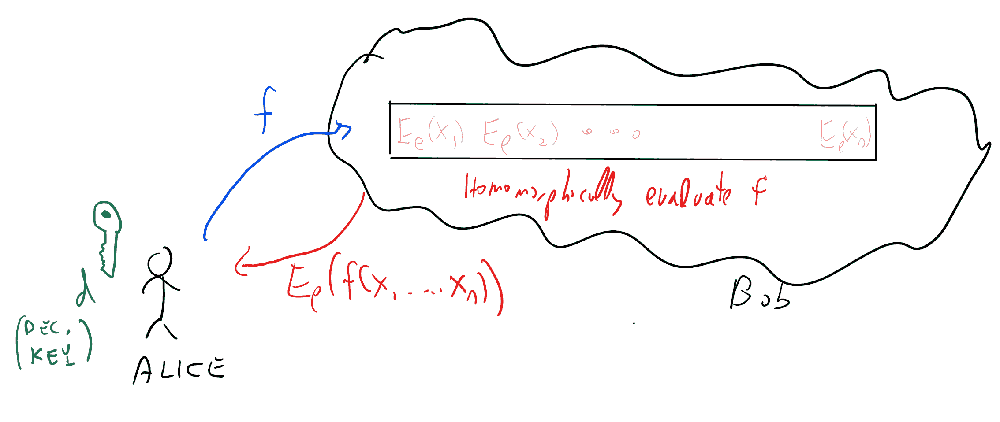
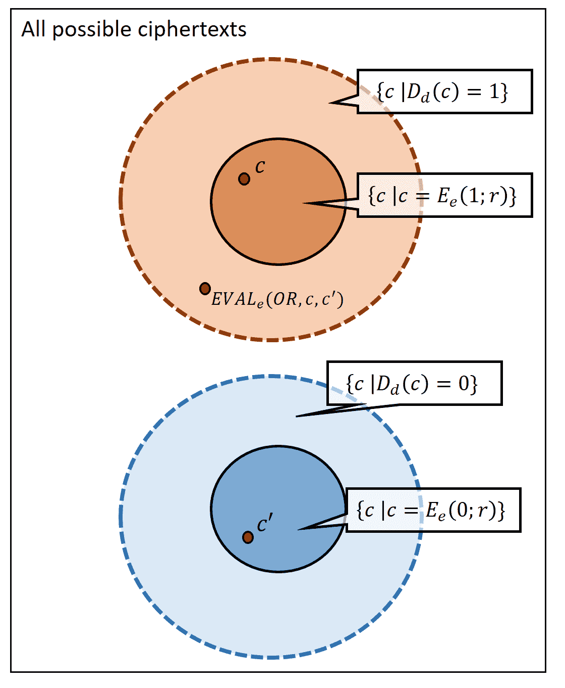
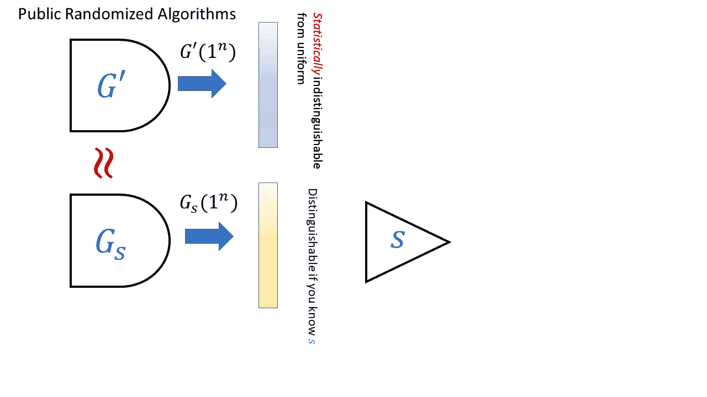
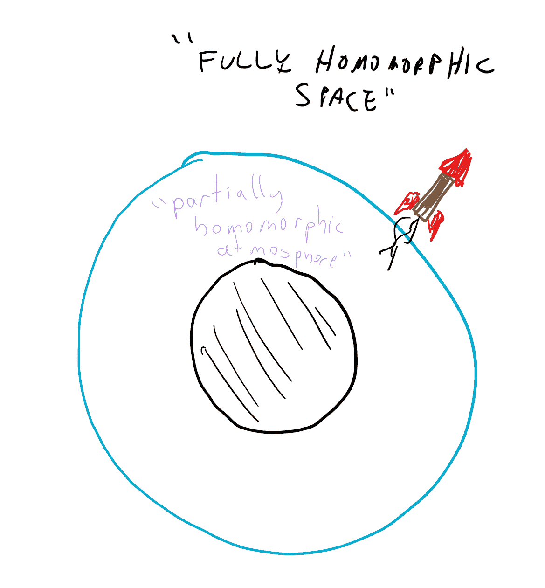
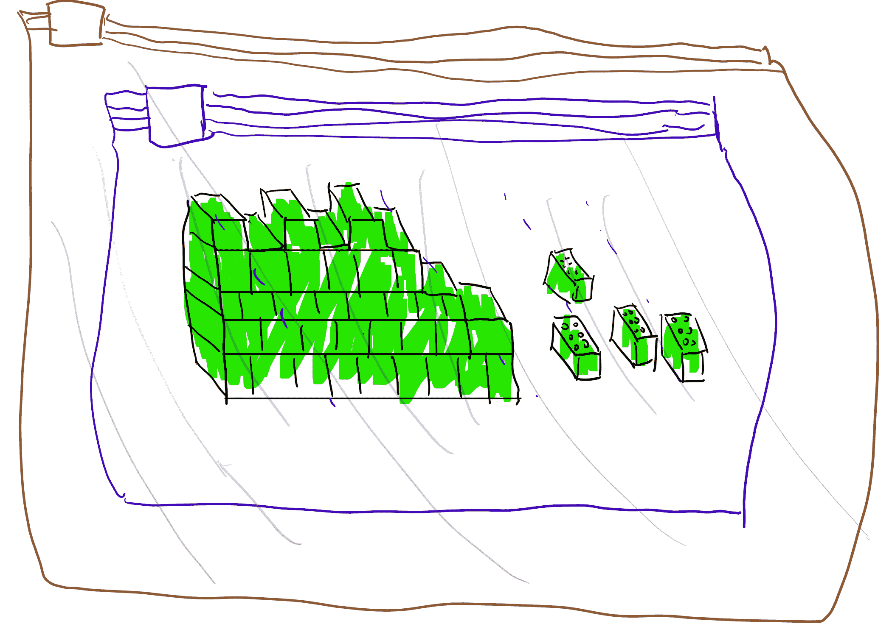

# 完全同态加密：简介和引导

> 原文：[`intensecrypto.org/public/lec_15_FHE.html`](https://intensecrypto.org/public/lec_15_FHE.html)

*发现任何错误/打字错误/令人困惑的解释？[在 GitHub 上打开一个 issue](https://github.com/boazbk/crypto/issues/new)。您也可以在下面评论*

**★ 另请参阅本章的[**PDF 版本**](https://files.boazbarak.org/crypto/lec_15_FHE.pdf)（更好的格式/参考文献）★

在当今“云计算”时代，个人和企业的许多数据都由第三方如 Google、Microsoft、Apple、Amazon、Facebook、Dropbox 等存储和计算。传统上，密码学提供了从 A 点到 B 点保护[数据传输](https://www.schneier.com/blog/archives/2010/06/data_at_rest_vs.html)的解决方案。但这些并不总是足以保护[静止数据](https://en.wikipedia.org/wiki/Data_at_rest)和特别是[使用中的数据](https://en.wikipedia.org/wiki/Data_in_use)。例如，假设*爱丽丝*有一些数据 \(x \in \{0,1\}^n\)（在现代应用中，\(x\) 可能是数太字节长或更长），她希望将其存储在云服务*鲍勃*处，但又担心鲍勃会被黑客攻击、被传唤或根本不完全信任鲍勃。

加密似乎并不能立即解决问题。爱丽丝可以在鲍勃处存储数据的*加密*版本，并保留自己的密钥。但如果是想对数据进行其他操作，而不仅仅是检索特定块，她就会陷入困境。如果她还想将计算外包给鲍勃，并计算某个函数 \(f\) 的 \(f(x)\)，那么她需要与鲍勃共享密钥，这样就违背了最初加密数据的目的。

例如，在 2015 年 6 月发现人事管理办公室（OPM）的计算系统[遭到黑客攻击](https://www.lawfareblog.com/why-opm-hack-far-worse-you-imagine)后，揭示了包括指纹以及多达 1800 万人安全审查期间收集的所有敏感信息，国土安全部网络安全和通信助理部长安迪·奥斯门特[表示](http://www.federaltimes.com/story/government/omr/opm-cyber-report/2015/06/19/opm-breach-encryption/28985237/)，加密并不能帮助预防这种情况，因为“如果对手拥有网络中用户的凭证，那么他们即使数据被加密也能访问数据，就像网络中的用户必须访问数据一样”。那么，我们能否以允许某些访问和计算数据的方式加密数据呢？

早在 1978 年，[Rivest, Adleman and Dertouzos](http://luca-giuzzi.unibs.it/corsi/Support/papers-cryptography/RAD78.pdf) 就考虑了这样一个问题：一家希望使用“商业[分时](https://en.wikipedia.org/wiki/Time-sharing)服务”来存储一些敏感数据的公司。他们设想了一个潜在的解决方案，并将其称为“隐私同态”。这个概念后来被称为*全同态加密（FHE）*，这是一种允许一方（如云服务提供商）在不知道密钥的情况下，将加密 \(x\) 的密文 \(c\) 修改为加密 \(f(x)\) 的密文 \(c'\) 的加密方式，对于每个有效的计算函数 \(f()\)。特别是在我们上面的场景中（参见图 14.1），这样的方案将允许 Bob 在给定 \(x\) 的加密后，计算 \(f(x)\) 的加密，并将这个密文发送给 Alice，而无需获取密钥，因此永远不会了解关于 \(x\)（或 \(f(x)\)）的任何信息。

14.1：全同态加密可以用来在加密形式下存储云上的数据，同时仍然允许云服务提供商在加密形式下评估数据上的函数（而无需了解他们评估的函数的输入或输出）。

与 Diffie 和 Hellman 的挑战在 RSA 出现后仅用一年就被解答的情况不同，在全同态加密的案例中，超过 30 年的时间密码学家们都没有构造出实现这一目标的方案。事实上，有些人怀疑加密方案的安全性与其用户在密文上执行所有这些操作的能力之间本质上是不相容的。斯坦福密码学家 Dan Boneh 曾开玩笑地对即将入学的研究生说，他将会立即签署任何提出全同态加密方案的人的论文。但他从未预料到他会真正遇到这样的论文，直到 2009 年，Boneh 的学生 Craig Gentry 发布了一篇[论文](https://crypto.stanford.edu/craig/)，正是这样做的。Gentry 的论文震撼了密码学界，并引发了一系列研究成果，使他的方案更加高效，减少了它所依赖的假设，扩展并应用了它，等等。特别是，Brakerski 和 Vaikuntanathan 设法获得了一种仅基于我们之前见过的*学习错误（LWE）*假设的全同态加密方案。

尽管有（部分和）全同态加密（FHE）的多种实现（参见[这个列表](https://github.com/jonaschn/awesome-he)），但为了实现 FHE 的完整实际潜力，仍有许多工作要做。对于相当级别的安全性，全同态加密方案的加密和解密操作比传统公钥系统慢几个数量级，并且（取决于其复杂性）同态评估一个电路可能要耗费更多。然而，这是一个快速发展的领域，自 2009 年以来，已经发现了许多显著的优化，这些优化将计算和存储开销降低了多个数量级。正如在公钥加密中，人们可能会想象对于更大的数据，人们会使用结合 FHE 和对称加密的“混合”方法，尽管可能需要提出专门设计的对称加密方案，这些方案可以有效地进行评估。1 对于机器学习可能有用的*近似计算*的同态评估可以[更有效地进行](https://eprint.iacr.org/2016/421)。

在这次讲座和下一讲中，我们将关注最易于描述的全同态加密方案，而不是最有效的方案（尽管有效的方案与我们将要讨论的方案有很多相似之处）。正如对于基于格的加密通常的情况一样，目前最有效的方案是基于*理想*格和诸如环 LWE 或 NTRU 密码系统的安全性等假设。2

为了从理论上和实践之间的距离中取得视角，考虑*验证计算*的情况可能是有用的。在 20 世纪 90 年代初，研究人员（最初由零知识证明激发）提出了[概率可检查证明（PCP）](http://madhu.seas.harvard.edu/papers/2009/pcpcacm.pdf)的概念，这原则上可以提供非常简洁的方式来检查计算的正确性。

概率性可验证证明可以被视为“增强版”的 NP 完全性归约，并且像这些归约一样，主要用于**负**结果，特别是由于最初的证明极其复杂，还包括巨大的隐藏常数。然而，随着时间的推移，人们逐渐更好地理解了这些内容，并使它们更加高效（例如，参见[这篇调查](http://m.cacm.acm.org/magazines/2015/2/182636-verifying-computations-without-reexecuting-them/fulltext)）并且现在这些结果已经[实用](http://cacm.acm.org/magazines/2016/2/197429-pinocchio/abstract)（也参见[这篇](https://eprint.iacr.org/2016/646)），实际上这些想法至少是[两家](http://z.cash) [初创公司](https://starkware.co/)的基础。总的来说，验证计算的构造在过去二十年里至少提高了 20 个数量级。（我们将在本课程中稍后讨论一些这些构造。）如果全同态加密的进展遵循类似的轨迹，那么我们可以预期实用化的道路将非常漫长，但仍有希望它不是一条“通向无人的桥梁”。

由于大规模全同态加密仍然不实用，人们一直在尝试通过某些假设至少实现较弱的加密目标。特别是英特尔芯片有所谓的[“安全区域”](https://goo.gl/HW4pPU)，可以将其视为处理器的一个相对防篡改的区域，该区域应该对外界不可达。想法是云服务提供商的客户将此区域视为一个可信的第三方，它可以通过云服务提供商与之通信。客户可以将他们的数据存储在云上，使用某个密钥 \(k\) 加密，然后使用认证密钥交换协议与区域建立安全通道，并发送 \(k\)。然后，当客户将函数 \(f\) 发送到云服务提供商时，后者可以要求区域计算 \(f(x)\) 的加密，前提是已知 \(x\) 的加密。在这个解决方案中，最终私钥确实位于云服务提供商的计算机上，客户必须信任区域的安全性。在实践中，这可以提供对远程黑客的合理安全性，但（与 FHE 不同）可能无法对抗具有物理访问服务器的复杂攻击者（例如，政府）。

## 定义全同态加密

我们首先定义**部分同态加密**。我们专注于单比特的加密。这在 CPA 安全性（尽管同态加密的 CCA 安全性已被排除，你能看出为什么？）中是通用的，尽管有更高效的构造可以一次加密多个比特。

设 \(\mathcal{F} = \cup \mathcal{F}_\ell\) 为一类函数，其中每个 \(f\in\mathcal{F}_\ell\) 将 \(\{0,1\}^\ell\) 映射到 \(\{0,1\}\)。

一个 **\(\mathcal{F}\)-同态公钥加密方案** 是一个 CPA 安全的公钥加密方案 \((G,E,D)\)，其中存在一个多项式时间算法 \(\ensuremath{\mathit{EVAL}}:\{0,1\}^* \rightarrow \{0,1\}^*\)，使得对于每一个 \((e,d)=G(1^n)\)，\(\ell=poly(n)\)，\(x_1,\ldots,x_\ell \in \{0,1\}\)，以及描述大小 \(|f|\) 至多为 \(poly(\ell)\) 的 \(f\in \mathcal{F}_\ell\)，都有：

+   \(c=\ensuremath{\mathit{EVAL}}_e(f,E_e(x_1),\ldots,E_e(x_\ell))\) 的长度不超过 \(n\)。

+   \(D_d(c)=f(x_1,\ldots,x_\ell)\)。

请停下并确认你是否理解了定义。特别是，你应该理解为什么需要对 \(\ensuremath{\mathit{EVAL}}\) 的输出长度进行一些限制，以排除那些平凡构造，这些构造类似于云服务提供商每次 Alice 想要评估其函数时，都向她发送整个加密数据库的情况。通过人为增加密钥生成算法的随机性，这相当于要求对于某个不随 \(\ell\) 或 \(|f|\) 增长的固定多项式 \(p(\cdot)\)，有 \(|c| \leq p(n)\)。你还应该理解加密算法在明文 \(b\) 上产生的密文与解密后得到 \(b\) 的密文之间的区别，参见图 14.2。

14.2：在一个有效的加密方案 \(E\) 中，满足 \(D_d(c)=b\) 的密文集合是满足 \(c=E_e(b;r)\) 的密文集合的超集，其中 \(r \in \{0,1\}^{t}\) 且 \(t\) 是加密算法使用的随机比特数。我们的部分同态加密方案的定义要求对于我们的家族中的每一个 \(f:\{0,1\}^\ell \rightarrow \{0,1\}\) 和 \(x\in \{0,1\}^\ell\)，如果 \(c_i \in E_e(x_i;\{0,1\}^t)\) 对于 \(i=1...\ell\) 成立，那么 \(\ensuremath{\mathit{EVAL}}(f,c_1,\ldots,c_\ell)\) 在超集 \(\{ c \;|\; D_d(c)=f(x) \}\) 中，该超集是 \(E_e(f(x);\{0,1\}^t)\) 的超集。例如，如果我们对 \(\ensuremath{\mathit{OR}}\) 函数和分别作为 \(1\) 和 \(0\) 加密得到的密文 \(c\) 和 \(c'\) 应用 \(\ensuremath{\mathit{EVAL}}\)，那么输出是一个密文 \(c''\)，该密文会被解密为 \(\ensuremath{\mathit{OR}}(1,0)=1\)，即使 \(c''\) 不在加密算法对 \(1\) 的可能输出的小集合中。这种较小和较大集合之间的区别是我们不能自动将 \(\ensuremath{\mathit{EVAL}}\) 函数应用于从先前 \(\ensuremath{\mathit{EVAL}}\) 操作的输出中获得的密文的原因。

一个 **全同态加密** 简单来说就是一个针对所有函数的集合 \(\mathcal{F}\) 的部分同态加密方案，其中函数的描述是一个电路（例如由 [NAND](https://en.wikipedia.org/wiki/NAND_gate) 门组成，这些门已知是通用基）。

### 另一个应用：用于验证计算的完全同态加密

完全同态加密的典型应用是客户端将加密数据 \(E(x)\) 存储在服务器上，将函数 \(f\) 发送到服务器，并获取 \(f(x)\) 的加密 \(E(f(x))\)。这确保服务器不会学习到关于 \(x\) 的任何信息，但并不保证它实际上计算了正确的函数！

这里有一个可爱的协议来实现这个目标（归功于 [Chung Kalai 和 Vadhan](https://eprint.iacr.org/2010/241)）。奇怪的是，该协议涉及“双重加密”输入，并且同态评估 \(\ensuremath{\mathit{EVAL}}\) 函数本身。

+   **假设：** 我们假设客户端感兴趣的所有函数 \(f\) 都可以用长度为 \(n\) 的字符串来描述。

+   **预处理：** 客户端生成一对密钥 \((e,d)\)。在初始阶段，客户端计算加密数据库 \(\overline{c}=E_e(x)\) 并将 \(\overline{c},e\) 发送到服务器。它还计算 \(c^* = E_e(f^*)\) 对于某个函数 \(f^*\) 以及 \(c^{**}=\ensuremath{\mathit{EVAL}}_{e}(eval,c^*\|\overline{c})\) 对于那个 \(f^*\)，并保留 \(c^*,c^{**}\) 给自己，其中 \(eval(f,x)=f(x)\) 是电路评估函数。

+   **客户端查询：** 要请求对 \(f\) 的评估，客户端生成一个新的随机 FHE 密钥对 \((e',d')\)，选择 \(b \leftarrow_R \{0,1\}\) 并让 \(c_b = E_{e'}(E_e(f))\) 和 \(c_{1-b}=E_{e'}(c^*)\)。它将三元组 \(e',c_0,c_1\) 发送到服务器。

+   **服务器响应：** 给定查询 \(c_0,c_1\)，服务器定义函数 \(g:\{0,1\}^* \rightarrow \{0,1\}^*\)，其中 \(g(c)=\ensuremath{\mathit{EVAL}}_e(eval,c\|\overline{c})\)（对于接收到的固定 \(\overline{c}\)）并计算 \(c'_0,c'_1\)，其中 \(c'_b = \ensuremath{\mathit{EVAL}}_{e'}(g,c_b)\)。（请在此处暂停并确保您理解这一步骤！注意，我们在这里关键地使用了 \(\ensuremath{\mathit{EVAL}}\) 本身是多项式时间计算的事实。）

+   **客户端检查：** 客户端检查 \(D_{d'}(c'_{1-b})=c^{**}\) 是否成立，如果是，则接受 \(D_d(D_{d'}(c'_b))\) 作为答案。

我们声称，如果服务器作弊，客户端将以概率 \(1/2 - negl(n)\) 检测到这一点。通过适当重复，可以将检测概率放大到 \(1-negl(n)\)。有关详细信息，请参阅论文。

## **示例：** 一个 XOR 同态加密

结果表明，我们之前看到的基于 LWE 的加密 LWEENC 是关于线性（模 2）函数类的同态。让我们回顾一下 LWE 假设及其加密方案。

设 \(q=q(n)\) 是一个将自然数映射到素数的函数。*\(q(n)\)-决策学习带误差 (\(q(n)\)-dLWE) 猜想* 如下：对于每个 \(m=poly(n)\)，存在一个分布 \(\ensuremath{\mathit{LWE}}_q\) 在 \((A,s)\) 对上，使得：

+   \(A\) 是一个定义在 \(\Z_q\) 上的 \(m\times n\) 矩阵，\(s\in\Z_q^n\) 满足 \(s_1=\floor{\tfrac{q}{2}}\) 且对于每个 \(i\in \{1,\ldots, m\}\)，\(|(As)_i| \leq \sqrt{q}\)。

+   分布 \(A\)，其中 \((A,s)\) 从 \(\ensuremath{\mathit{LWE}}_q\) 中采样，在计算上是不可区分于 \(\Z_q\) 上 \(m\times n\) 矩阵的均匀分布。

**dLWE 猜想**是对于每个 \(q(n)\) 都有 \(q(n)\)-dLWE 成立，其中 \(q(n)\) 至多为 \(poly(n)\)。这并不完全是我们之前使用的措辞，但正如我们下面所概述的，它本质上等同于它。也可以提出一个更强的猜想，即 \(q(n)\)-dLWE 甚至对于 \(q(n)\) 是 \(n\) 的**超多项式**（例如，\(q(n)\) 的大小大约为 \(2^n\) - 注意到这样的数字仍然可以用 \(n\) 位来描述，我们仍然可以高效地执行加法和乘法等模 \(q\) 的运算）。这个更强的猜想似乎也得到了证据的支持，我们将在未来的讲座中使用它。

在这里暂停并尝试自己证明等价性是个好主意。

**LWE 与 DLWE 之间的等价性：** 这两个猜想等价的原因如下。在我们将猜想表述为从一对 \((A',y)\) 中恢复 \(s\) 之前，其中 \(y=A's'+e\) 且对于每个 \(i\)，\(|e_i|\leq \delta q\)。然后我们展示了从区分这种情况和 \(y\) 是随机向量的情况的**搜索到决策**的转换（定理 11.2），这表明这与区分这两种情况的任务等价。如果我们现在令 \(\alpha = \floor{\tfrac{q}{2}}\) 和 \(\beta = \alpha^{-1} \pmod q\)，并考虑矩阵 \(A=(-\beta y|A')\) 和列向量 \(s=\binom{\alpha}{s'}\)，我们注意到 \(As = e\)。注意，如果 \(y\) 是 \(\Z_q^m\) 中的随机向量，那么 \(-\beta y\) 也是，因此当前形式下的猜想是从之前的一个猜想中得出的。（为了减少自由参数的数量，我们将 \(\delta\) 固定为 \(1/\sqrt{q}\)；在这种形式下，随着 \(q\) 的增长，猜想变得更加强大。）

**一个线性同态加密方案：** 第 11.4 节中描述的 LWE-ENC 的以下变体被证明是线性同态的：

> **LWE-ENC 加密：**
> 
> +   **密钥生成：** 从 \(\ensuremath{\mathit{LWE}}_q\) 中选择 \((A,s)\)，其中 \(m\) 满足 \(q^{1/4} \gg m \log q \gg n\)。
> +   
> +   要**加密** \(b\in\{0,1\}\)，选择 \(w\in\{0,1\}^m\) 并输出 \(w^\top A + (b,0,\ldots,0)\)。
> +   
> +   要**解密** \(c\in\Z_q^n\)，如果 \(|\langle c,s \rangle| \leq q/10\)，则输出 \(0\)，其中对于 \(x\in\Z_q\)，我们定义 \(|x| = \min \{ x , q-x \}\)。（回忆一下，\(s\) 的第一个坐标是 \(\floor{q/2}\)。）

解密算法能够恢复原始明文，因为 \(\langle c,s \rangle= w^\top A s + s_1 b\) 且 \(|w^\top A s| \leq m\sqrt{q} \ll q\)。结果证明，该方案在模 \(2\) 的线性函数类上是同态的。具体来说，我们提出以下论断：

对于每个 \(\ell \ll q^{1/4}\)，存在一个算法 \(\ensuremath{\mathit{EVAL}}_\ell\)，它在输入 \(c_1,\ldots,c_\ell\) 时，这些是 \(b_1,\ldots,b_\ell \in \{0,1\}\) 的 LWEENC-加密，输出一个密文 \(c\)，其解密为 \(b_1 \oplus \cdots \oplus b_\ell\)。

这个论断并不难证明，但自己动手解决可以是一个很好的方法，以更多地熟悉 LWE-ENC’ 和我们在许多基于格的密码学原语构造中反复进行的操作。回想一下，LWE-ENC’ 的密文 \(c\) 是 \(\Z_q^n\) 中的一个向量。尝试证明 \(c = c_1 + \cdots +c_\ell\)（其中加法是在 \(\Z_q\) 中的向量加法）将是 \(b_1 \oplus \cdots \oplus b_\ell\) 的加密。注意，如果 \(q\) 是 \(n\) 的 *超多项式*，那么 \(\ell\) 可以是 \(n\) 的任意大的多项式。

证明相当简单。\(\ensuremath{\mathit{EVAL}}\) 将简单地将在 \(\Z_q\) 中的密文作为向量相加。如果 \(c = \sum c_i\)，那么

\[\langle c,s \rangle = \sum b_i \floor{\tfrac{q}{2}} + \xi \mod q\]其中 \(\xi \in \Z_q\) 是一个“噪声项”，满足 \(|\xi| \leq \ell m \sqrt{q} \ll q\)。

由于 \(|\floor{\tfrac{q}{2}}- \tfrac{q}{2}|<1\)，最多加上 \(\ell\) 项这个差值最多增加 \(\ell\)，因此我们也可以写成

\[\langle c,s \rangle = \floor{ \sum b_i \tfrac{q}{2} } + \xi' \mod q\]对于 \(|\xi'| \leq \ell m \sqrt{q} + \ell \ll q\)。

如果 \(\sum b_i\) 是偶数，那么 \(\sum b_i \tfrac{q}{2}\) 是 \(q\) 的整数倍，因此在这种情况下 \(|\langle c,s \rangle| \ll q\)。如果 \(\sum b_i\) 是奇数，\(\floor{\sum b_i \tfrac{q}{2}} = \floor{q/2} \mod q\)，因此在这种情况下 \(|\langle c,s \rangle| = q/2 \pm o(q) > q/10\)。

还有一些其他加密方案在模线性函数上也是同态的。甚至在 Gentry 的构造之前，就有加密方案的构造，这些方案在某种程度上更大的类（例如，Boneh、Goh 和 Nissim 的二次函数）上是同态的，但并不显著。

### 抽象：一个门限伪随机生成器。

考虑以下抽象（我们将在下一节课中使用）是有益的，即上述加密方案作为一个 *门限生成器*（见图 14.3）。在输入 \(1^n\) 时，密钥生成算法输出一个向量 \(s\in\Z_q^m\)，其中 \(s_1 = \floor{\tfrac{q}{2}}\)，以及一个概率算法 \(G_s\)，使得以下成立：

+   从分布 \(G_s(1^n)\) 中取出的任何多项式数量的样本在计算上是与从 \(\Z_q^n\) 上的均匀分布中独立样本不可区分的。

+   如果 \(c\) 由 \(G_s(1^n)\) 输出，那么 \(|\langle c,s \rangle| \leq n\sqrt{q}\)。

生成器 \(G_s\) 从 \(\{0,1\}^m\) 中选择 \(w \leftarrow_R\)，然后计算 \(w^\top A\)。其输出看起来是伪随机的，但将以 \(w\) 的选择概率 \(1\) 满足条件 \(|\langle G_s(1^n),s \rangle| \leq n\sqrt{q}\)。因此，\(s\) 可以被视为生成器的“门限”，使我们能够区分一个随机向量 \(c \in \Z_q^n\)（在 \(q \gg n²\) 的假设下，以高概率满足 \(|\langle c,s \rangle| \gg n\sqrt{q}\)）和生成器的输出。

我们使用 \(G_s\) 通过让 \(c \leftarrow_R G_s(1^n)\) 并输出 \(c + (b,0,\ldots,0)^\top\) 来加密一个比特 \(b\)。虽然我们的特定实现将 \(G_s(w)\) 映射为 \(w^\top A\)，但我们可以在前面的内容中忽略这些实现细节。

14.3: 在一个**门限生成器**中，我们有两种生成随机算法的方法。也就是说，我们有一些算法 \(\ensuremath{\mathit{GEN}}\) 和 \(\ensuremath{\mathit{GEN}}'\)，使得 \(\ensuremath{\mathit{GEN}}\) 输出一个对 \((G_s,s)\)，而 \(\ensuremath{\mathit{GEN}}'\) 输出 \(G'\)，其中 \(G_s\) 和 \(G'\) 本身也是算法（例如，随机电路）。我们要求满足的条件是：**（1）** 电路 \(G_s\) 和 \(G'\) 的描述（将它们视为字符串上的分布）在计算上是不可区分的；**（2）** 分布 \(G'(1^n)\) 在统计上与均匀分布**不可区分**；**（3）** 存在一个有效的算法，给定秘密的“门限” \(s\)，可以区分 \(G_s\) 的输出和均匀分布。特别是 **（1）**、**（2）** 和 **（3）** 三者共同意味着从 \(G_s\) 的描述中提取 \(s\) 是**不可行的**。

我们基于 LWE 的门限生成器满足以下更强的属性：我们可以生成一个替代生成器 \(G'\)，使得 \(G'\) 的描述与 \(G_s\) 的描述不可区分，但实际上 \(G'\) 确实产生（在指数级小的统计误差下）\(\Z_q^n\) 上的均匀分布。我们可以通过从 \(\ensuremath{\mathit{LWE}}_q\) 分布而不是完全随机地采样 \(A\) 来做到这一点。我们可以正式定义门限生成器如下：

一个**门限生成器**是一对随机算法 \(\ensuremath{\mathit{GEN}},\ensuremath{\mathit{GEN}}'\)，它们满足以下条件：

+   在输入 \(1^n\) 时，\(\ensuremath{\mathit{GEN}}\) 输出一个对 \((G_s,s)\)，其中 \(G_s\) 是一个描述**随机**电路的字符串。电路 \(G_s\) 以 \(1^n\) 作为输入，并输出一个长度为 \(t\) 的（随机选择的）字符串，其中 \(t=t(n)\) 是某个多项式。

+   在输入 \(1^n\) 时，\(\ensuremath{\mathit{GEN}}'\) 输出 \(G'\)，其中 \(G'\) 是一个描述具有相同输入和输出的随机电路的字符串。

+   分布 \(\ensuremath{\mathit{GEN}}(1^n)_1\)（即 \(\ensuremath{\mathit{GEN}}(1^n)\) 的第一个输出）和 \(\ensuremath{\mathit{GEN}}'(1^n)_1\) 在计算上是不可区分的。（这些都是关于 *电路* 的分布。）

+   在 \(\ensuremath{\mathit{GEN}}'\) 输出的 \(G'\) 的选择上，以 \(1-negl(n)\) 的概率，分布 \(G'(1^n)\) 与 \(U_t\)（即 \(\{0,1\}^t\) 上的均匀分布）在统计上不可区分（即总变差距离在 \(negl(n)\) 内）。

+   存在一个高效的算法 \(T\)，对于 \(\ensuremath{\mathit{GEN}}\) 输出的每一对 \((G_s,s)\)，\(\Pr[ T(s,G_s(1^n))=1] \geq 1- negl(n)\)（这里的概率是针对 \(G_s\) 在输入 \(1^n\) 上使用的内部随机性而言的），但 \(\Pr[ T(s,U_t)=1] \leq 1/3\).^(3)

这不是一个容易理解的定义，但查看 图 14.3 可以有所帮助。确保你理解为什么 \(\ensuremath{\mathit{LWEENC}}\) 产生了一个满足 定义 14.6 所需所有条件的陷门生成器。

在上述内容中，我们将伪随机生成器中的“陷门”概念作为一个数学抽象，但在实践中已经出现了具有实际陷门的生成器。2007 年，国家标准研究院（NIST）发布了伪随机生成器的标准。伪随机生成器是典型的私钥原语，通常由哈希函数、分组密码等构建，因此 NIST 在列表中包含了一个基于公钥工具的伪随机生成器——基于椭圆曲线密码学的 [Dual EC DRBG](https://en.wikipedia.org/wiki/Dual_EC_DRBG) 生成器。这已经非常奇怪，但当微软研究人员 Dan Shumow 和 Niels Ferguson [展示](http://rump2007.cr.yp.to/15-shumow.pdf) 这个生成器 *可能* 存在陷门时，情况变得更加令人担忧——它包含了一些硬编码的常数，如果以特定方式生成，就会有一些信息（就像上面的 \(G_s\) 一样）可以区分生成器与随机数（关于这个问题的 [2007 年博客文章](https://www.schneier.com/blog/archives/2007/11/the_strange_sto.html)）。当斯诺登文件泄露 [显示](http://www.reuters.com/article/us-usa-security-rsa-idUSBRE9BJ1C220131220) 美国国家安全局（NSA）秘密支付了 1000 万美元给 RSA，使其成为他们 Bsafe 软件中的默认选项时，我们对此有了更多的了解。

你可能会认为这个生成器已经死了很久，但结果证明它是一个“持续给予的礼物”。2015 年 12 月，Juniper 系统[宣布](http://www.wired.com/2015/12/juniper-networks-hidden-backdoors-show-the-risk-of-government-backdoors/)，他们发现系统中存在恶意代码，可以追溯到至少 2012 年（可能是[2008](https://goo.gl/X6pAXV)），允许攻击者秘密地通过他们的防火墙解密所有 VPN 流量。问题是 Juniper 一直在使用 Dual EC DRBG，有人设法用另一个常数替换了他们使用的常数，一个他们可能知道陷阱门的常数（参见[这里](https://rpw.sh/blog/2015/12/21/the-backdoored-backdoor/)和[这里](http://blog.cryptographyengineering.com/2015/12/on-juniper-backdoor.html)了解更多信息；当然，除非你知道要检查这一点，否则仅通过查看代码很难看出一个看似随机的常数已被另一个常数替换）。显然，尽管这对许多执法和政府机构的人来说非常令人惊讶，但将后门插入加密原语可能会使它们变得不那么安全。2021 年，这个案例中出现了更多细节，请参阅[这个故事](https://finance.yahoo.com/news/juniper-breach-mystery-starts-clear-130016591.html)和[这个推文线程](https://twitter.com/matthew_d_green/status/1433451378391883782?s=20)。

## 从线性同态到全同态

Gentry 的突破有两个组成部分：

+   首先，他提出了一种对数深度算术电路（不仅涉及加法，还包括乘法）的同态方案。

+   第二，他展示了惊人的“自举定理”，如果一个方案足够同态以评估其自身的解密电路，那么它可以转换为一个可以评估*任何*函数的*全同态*加密。

结合这两个洞见导致了他的全同态加密.^(4)

在这次讲座中，我们将重点关注第二个组成部分——自举定理。我们将展示一种“部分同态加密”（基于 Gentry、Sahai 和 Waters 的后续工作），它可以将该定理纳入下一讲。

## 自举：全同态的“逃逸速度”

14.4：自举定理表明，一旦部分同态加密方案对足够丰富的函数族（特别是包含其自身解密算法的函数族）是同态的，那么它就可以转换为一个可以评估*任何*函数的全同态加密方案。

自举定理相当令人惊讶。从先验的角度来看，你可能会预期，由于线性函数的同态加密并不简单，二次函数的同态加密会更难，立方函数甚至更难，以此类推。但事实是存在某个特殊的次数 \(t^*\)，如果我们获得了次数 \(t^*\) 多项式的同态加密，那么我们可以获得适用于所有函数的*完全*同态加密。（具体来说，如果解密算法 \(c \mapsto D_d(c)\) 是次数 \(t\) 的多项式，那么同态评估次数 \(t^*=2t\) 的多项式将是足够的。）这意味着，一旦一个加密方案足够强大，可以*同态评估其自身的解密算法*，那么我们可以通过“自力更生”来获得一个完全同态加密。一个类比是，在这个点上，加密达到了“逃逸速度”，我们可以继续评估门，永无止境。

我们现在展示自举定理：

假设 \((G,E,D)\) 是一个针对家族 \(\mathcal{F}\) 的 CPA 循环^(5) 部分同态加密方案，并且假设对于每一对密文 \(c,c'\)，映射 \(d \mapsto D_d(c) \;\ensuremath{\mathit{NAND}}\; D_d(c')\) 在 \(\mathcal{F}\) 中。那么 \((G,E,D)\) 可以被转换为一个完全同态加密方案。

### 放射性乐高类比

这里有一个关于自举的类比，灵感来源于 Gentry 的[调查](https://crypto.stanford.edu/craig/easy-fhe.pdf)。假设你需要从一种高度有毒的材料（参见图 14.5）构建一个复杂的物体。

你被给予了一堆密封的袋子，这些袋子足够灵活，你可以从袋子外部操作里面的物体。然而，每个袋子只能承受 \(10\) 秒的这种操作，然后就会泄漏。想法是，如果你能在 \(9\) 秒内打开一个袋子在另一个袋子里面，那么你可以用额外的 \(1\) 秒来执行一个步骤。通过重复这个过程，你可以进行任意长度的操作。

具体来说，假设你已经完成了总共 \(T\) 步中的 \(i\) 步，现在有一个部分构建的城堡在一个密封的袋子 \(B_i\) 里面。你现在将袋子 \(B_i\) *放入*一个新的袋子 \(B_{i+1}\) 里面。你现在花 \(9\) 秒在打开袋子 \(B_i\) 在袋子 \(B_{i+1}\) 里面，并且额外的 \(1\) 秒在构建的第 \(i+1\) 步上。在这个点上，我们已经完成了 \(i+1\) 步，并且物体在袋子 \(B_{i+1}\) 里面，我们可以继续通过放入袋子 \(B_{i+2}\) 等等。

14.5：要使用放射性乐高积木建造一座城堡，这些积木可以在特制的密封袋中安全存放 10 秒钟，我们可以这样做：1) 将积木放入一个袋子中，然后将袋子放入外层袋子中。2) 通过外层袋子操作内层袋子，在 9 秒内将其中的积木取出，然后花 1 秒钟将一块积木放置到位。现在，在外层袋子“泄漏”之前，我们将它放入一个全新的袋子中，并重复这个过程。

### 证明自举定理

我们现在转向 定理 14.8 的正式证明

证明背后的思想简单但巧妙。回想一下，NAND 门 \(b,b' \mapsto \neg(b \wedge b')\) 是一个通用门，它允许我们计算任何可以高效计算的函数 \(f:\{0,1\}^n\rightarrow\{0,1\}\)。因此，为了获得一个全同态加密，我们只需要获得一个函数 \(\ensuremath{\mathit{NANDEVAL}}\)，使得 \(D_d(\ensuremath{\mathit{NANDEVAL}}(c,c'))=D_d(c) \;\ensuremath{\mathit{NAND}}\; D_d(c')\)。 (注意，这比典型的同态评估概念更强，因为我们要求 \(\ensuremath{\mathit{NANDEVAL}}\) 在给定任何一对解密为 \(b\) 和 \(b'\) 的密文时输出 \(b \;\ensuremath{\mathit{NAND}}\; b'\) 的加密，无论这些密文是由加密算法还是其他方法产生的，包括 \(\ensuremath{\mathit{NANDEVAL}}\) 程序本身。)

因此，为了证明这个定理，我们需要将 \((G,E,D)\) 修改成一个支持 \(\ensuremath{\mathit{NANDEVAL}}\) 操作的加密方案。我们的新方案将使用相同的加密算法 \(E\) 和 \(D\)，但以下是对密钥生成算法 \(G'\) 的修改：在执行 \((d,e)=G(1^n)\) 后，我们将秘密密钥的加密 \(c^* = E_e(d)\) 添加到公钥中。我们现在已经定义了密钥生成、加密和解密。CPA 安全性源于原始方案的安全性，其中通过循环安全性我们指的是方案即使在对手获得公钥的单次加密的情况下也是安全的。6 这一后者的条件并不一定被标准的 CPA 安全性所蕴含，但据我们所知，所有自然公钥加密都满足这一条件，包括我们稍后将要将其插入到这个定理中的基于 LWE 的加密。

因此，现在我们只剩下定义 \(\ensuremath{\mathit{NANDEVAL}}\) 操作。在输入两个密文 \(c\) 和 \(c'\) 时，我们将构造一个函数 \(f_{c,c'}:\{0,1\}^n\rightarrow\{0,1\}\)（其中 \(n\) 是密钥长度），使得 \(f_{c,c'}(d)=D_d(c) \;\ensuremath{\mathit{NAND}}\; D_d(c')\)。在这个点上停下来并确保你理解 \(f_{c,c'}\) 的输入是什么，什么是“硬编码的常量”，以及它的输出是什么，将会很有用。密文 \(c\) 和 \(c'\) 被简单地当作固定字符串处理，并且不是 \(f_{c,c'}\) 输入的一部分。相反，\(f_{c,c'}\) 是一个函数（依赖于字符串 \(c,c'\)），它将密钥映射到一个比特。在运行 \(\ensuremath{\mathit{NANDEVAL}}\) 时，我们当然不知道密钥 \(d\)，但我们仍然可以设计一个计算这个函数 \(f_{c,c'}\) 的电路。现在 \(\ensuremath{\mathit{NANDEVAL}}(c,c')\) 将被简单地定义为 \(\ensuremath{\mathit{EVAL}}(f_{c,c'},c^*)\)。由于 \(c^* = E_e(d)\)，我们得到

\[D_d(\ensuremath{\mathit{NANDEVAL}}(c,c'))= D_d(\ensuremath{\mathit{EVAL}}(f_{c,c'},c^*))=f_{c,c'}(d) =D_d(c) \;\ensuremath{\mathit{NAND}}\; D_d(c') \;.\]因此，我们确实将任何一对解密为 \(b,b'\) 的密文 \(c,c'\) 映射为一个解密为 \(b \;\ensuremath{\mathit{NAND}}\; b'\) 的密文 \(c''\)。这正是我们需要证明的全部。

不要被简短的证明所迷惑。这个定理相当深刻和微妙，需要阅读和重读才能真正“理解”它。

1.  在 [2015](https://eprint.iacr.org/2012/099.pdf) 中，同态评估 AES 的状态是每块计算约 6 秒，总共使用约 4GB 内存来处理 180 块。还可以参见[这篇论文](https://link.springer.com/article/10.1007/s10623-015-0095-1)。相比之下，现代处理器每秒可以评估[10s-100s 百万](https://www.bearssl.org/speed.html)个 AES 块。

    ↩

1.  正如我们之前提到的，一般来说，理想方案与我们描述的方案之间的区别在于，在理想设置中，我们处理的是具有紧凑表示的单个向量的**结构化**矩阵，并且也允许快速类似 FFT 的矩阵-向量乘法。这可以在存储和计算需求上节省约 \(n\) 倍（其中 \(n\) 是子空间/格的维度）。然而，理想格也有一些微妙的安全影响，例如，参见[这里](https://eprint.iacr.org/2016/127)、[这里](https://eprint.iacr.org/2015/313)、[这里](https://eprint.iacr.org/2016/139)和[这里](https://eprint.iacr.org/2015/676)。

    ↩

1.  选择 \(1/3\) 是任意的，并且可以根据需要放大。

    ↩

1.  这个故事比那要复杂一些。令人沮丧的是，Gentry 基本方案的解密电路对于引导定理来说稍微深了一点。像我这样的人，在这个时候可能会断定全同态加密根本就不可能实现，也许会开始编织或打桥牌作为替代爱好。然而，Craig 坚持不懈，并设法找到了一种方法来“压缩”解密电路，使其能够符合引导参数。后续工作，特别是 Brakerski 和 Vaikuntanathan 的论文，设法得到了具有更好的同态深度和解密电路关系的方案，从而避免了压缩的需要，并改善了安全假设。

    ↩

1.  在第一次阅读时，您可以忽略循环安全性的条件——我们稍后将会讨论它。

    ↩

1.  没有这个假设，我们仍然可以获得一种称为**分层**FHE 的 FHE 形式，其中公钥的大小随着要评估的电路的[深度](https://en.wikipedia.org/wiki/Circuit_complexity)而增长。我们可以通过拥有\(\ell\)个公钥来实现，其中\(\ell\)是我们想要评估的深度，并用第\(i+1\)个公钥加密第\(i\)个密钥的私钥。然而，由于循环安全性似乎很有可能成立，我们在后续讨论中忽略了这种额外的复杂性。

    ↩

## 评论

评论通过[GitHub 仓库](https://github.com/boazbk/crypto/issues)使用[utteranc.es](https://utteranc.es)应用程序发布。需要 GitHub 登录才能评论。如果您不想授权应用程序代表您发布，您也可以直接在[此页面的 GitHub 问题](https://github.com/boazbk/crypto/issues?q=Fully%20Homomorphic%20Encryption%3Bin%3Atitle)上评论。

编译于 2021 年 11 月 17 日 22:36:02

版权所有 2021，Boaz Barak。

本作品受[Creative Commons Attribution-NonCommercial-NoDerivatives 4.0 国际许可协议](https://creativecommons.org/licenses/by-nc-nd/4.0/)许可。

使用[pandoc](https://pandoc.org/)和[panflute](http://scorreia.com/software/panflute/)以及从[gitbook](https://www.gitbook.com/)和[bookdown](https://bookdown.org/)中提取的模板制作。
