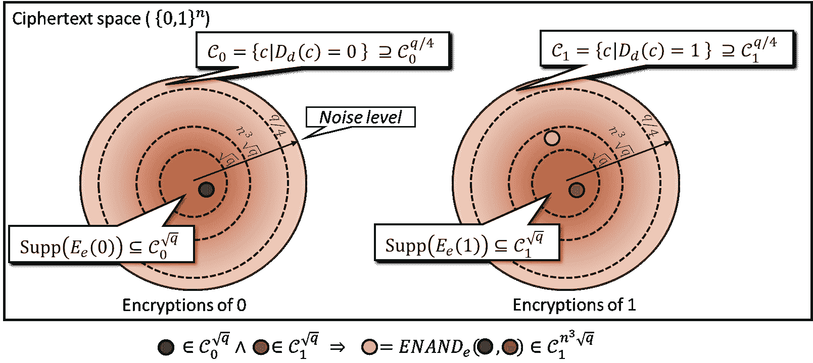
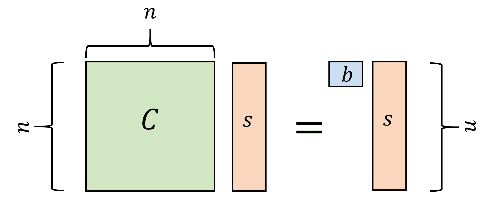
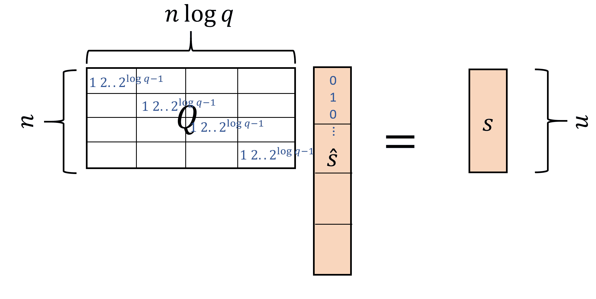
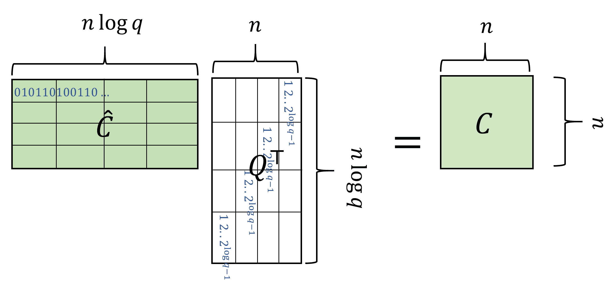
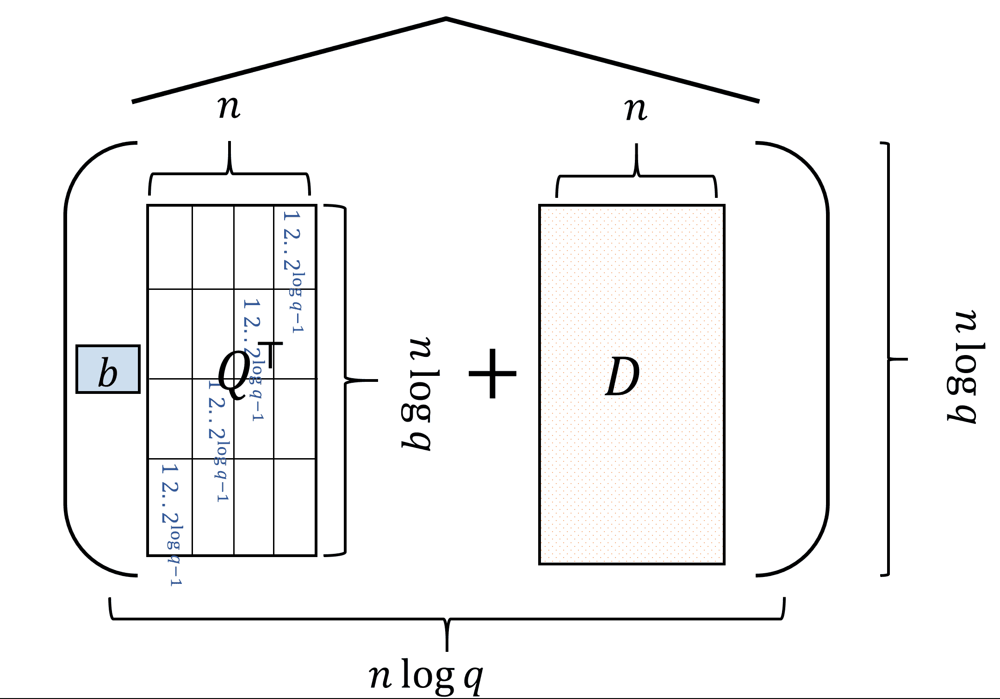
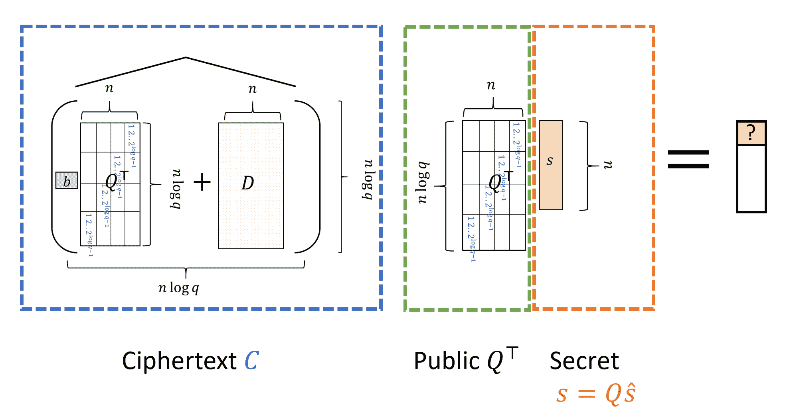

# 全同态加密：构造

> 原文：[`intensecrypto.org/public/lec_16_FHE_part2.html`](https://intensecrypto.org/public/lec_16_FHE_part2.html)

*发现任何错误/打字错误/令人困惑的解释？[在 GitHub 上打开一个 issue](https://github.com/boazbk/crypto/issues/new)。您也可以在下面评论*

**★ 另请参阅本章的[PDF 版本](https://files.boazbarak.org/crypto/lec_16_FHE_part2.pdf)（格式/参考文献更好）★**

在上一节课中，我们定义了全同态加密，并展示了将部分同态加密方案转换为全同态加密方案的“自举定理”，只要原始方案可以同态评估其自身的解密电路。在本节课中，我们将展示一个满足后一性质的加密方案（由 Gentry、Sahai 和 Waters 提出，以下简称 GSW）。也就是说，本节课致力于证明^(1)以下定理：

假设 LWE 猜想成立，存在一个部分同态公钥加密方案 \((G,E,D,\ensuremath{\mathit{EVAL}})\)，它符合自举定理的条件（定理 14.8）。也就是说，对于任意两个密文 \(c\) 和 \(c'\)，函数 \(d \mapsto D_d(c)\; \ensuremath{\mathit{NAND}}\; D_d(c')\) 可以通过 \(\ensuremath{\mathit{EVAL}}\) 同态评估。

在详细描述和分析之前，让我们首先概述我们的策略。以下“噪声同态加密”的概念将至关重要（参见图 15.1）。

一种 *噪声同态加密方案* 是一个算法四元组 \((G,E,D,\ensuremath{\mathit{ENAND}})\)，其中 \((G,E,D)\) 是一个 CPA 安全的公钥方案，并且对于每个密钥对 \((e,d)\)，存在一个函数 \(\eta=\eta_{e,d}\)，它将任何密文 \(c\) 映射到一个数 \(\eta(c)\in [0, \infty)\)（我们称之为 \(c\) 的“噪声水平”），满足以下条件。

对于每个密钥对 \((e,d)\)，如果我们表示

\[\mathcal{C}_b^\theta=\{c:D_d(c)=b,\eta(c)\leq\theta \}.\]

然后

+   \(E_e(b)\in \mathcal{C}_b^{\sqrt{q}}\) 对于任何明文 \(b\)。也就是说，“新鲜加密”的噪声不超过 \(\sqrt{q}\)。

+   如果 \(c\in\mathcal{C}_b^\eta\) 且 \(\eta\leq q/4\)，则 \(D_d(c)=b\)。也就是说，只要噪声不超过 \(q/4\)（这比 \(\gg \sqrt{q}\) 大得多），解密仍然会成功。

+   对于任何 \(c\in\mathcal{C}_b^\eta\) 和 \(c'\in\mathcal{C}_{b'}^{\eta'}\)，都有

    \[\ensuremath{\mathit{ENAND}}(c,c')\in\mathcal{C}_{b\overline{\wedge}b'}^{n³\cdot \max\{\eta,\eta'\}}\]只要 \(n³\cdot \max\{\eta,\eta'\}<q/4\)。也就是说，只要噪声不是太大，将 \(\ensuremath{\mathit{ENAND}}\) 应用于 \(c\) 和 \(c'\) 将会产生一个 \(\ensuremath{\mathit{NAND}}(D_d(c),D_d(c'))\) 的加密，其噪声水平不会“过高”于 \(c\) 和 \(c'\) 的最大噪声水平。

噪声同态加密实际上表述的是，如果 \(C\) 和 \(C'\) 分别将 \(b\) 和 \(b'\) 加密到误差 \(\eta\) 和 \(\eta'\)，那么 \(\ensuremath{\mathit{ENAND}}(c,c')\) 将 \(\ensuremath{\mathit{NAND}}(b,b')\) 加密到某个可以通过 \(\eta,\eta'\) 控制的误差。系数 \(n³\) 在这里不是必要的；我们只需要 \(poly(n)\) 的阶。这一性质允许我们只要能保证累积误差小于 \(q/4\)，就可以重复执行 \(\ensuremath{\mathit{ENAND}}\) 操作，这意味着解密可以正确进行。接下来的定理告诉我们电路可以以何种深度进行同态计算。

15.1：在噪声同态加密中，每个密文 \(c\) 都有一个与之相关的“噪声”参数 \(\eta(c)\)。当我们加密 \(0\) 或 \(1\) 时，我们得到的密文噪声最多为 \(\sqrt{q}\)，而我们保证可以成功解密。将 \(\ensuremath{\mathit{ENAND}}\) 操作应用于两个密文 \(c\) 和 \(c'\) 会产生一个噪声级别最多为 \(c\) 和 \(c'\) 最大噪声 \(n³\) 倍的密文。因此，我们可以组合 \(\ensuremath{\mathit{ENAND}}\) 操作，将任何深度最多为 \(\ell\) 的 NAND 电路应用于新鲜加密，并且只要 \(n^{3\ell}\sqrt{q} \ll q/4\)，就可以成功获得解密为电路输出的密文。

如果存在一个具有 \(q=2^{\sqrt{n}}\) 的噪声同态加密方案，那么它可以扩展到任何深度小于 \(polylog(n)\) 的电路的同态加密方案。

对于任何可以用深度为 \(\ell\) 的电路描述的函数 \(f:\{0,1\}^m\rightarrow \{0,1\}\)，我们可以计算 \(\ensuremath{\mathit{EVAL}}(f,E_e(x_1),\cdots,E_e(x_m))\)，误差最多为 \(\sqrt{q}(n³)^\ell\)。（\(E_e(x_i)\) 的初始误差小于 \(\sqrt{q}\)，误差将以至多为 \(n³\) 的速率累积。）因此，为了保证 \(\ensuremath{\mathit{EVAL}}(f,E_e(x_1),\cdots,E_e(x_m))\) 可以正确解密为 \(f(x_1,\cdots,x_m)\)，我们只需要 \(\sqrt{q}(n³)^\ell\ll q\)，即 \(n^{3\ell}\ll \sqrt{q}=2^{\sqrt{n}/2}\)。这等价于 \(3\ell\log(n)\ll \sqrt{n}/2\)，当 \(\ell =n^{o(1)}\) 或 \(\ell=polylog(n)\) 时可以保证。

在本章的剩余部分，我们将假设 LWE 猜想，其中\(q(n) \approx 2^{\sqrt{n}}\)。有了定理 15.3，我们的目标是构建一个带噪声的 FHE，使得解密映射（特别是对于任何固定的密文\(c\)的映射\(d \mapsto D_d(c)\)）可以通过深度至多为\(polylog(n)\)的电路来计算。（定理 14.8 指的是映射\(d \mapsto \neg(D_d(c) \wedge D_d(c'))\)，但这个后者的映射是通过将一个额外的 NAND 门应用于\(d \mapsto D_d(c)\)的两个并行执行来获得的，因此如果映射\(d \mapsto D_d(c)\)的深度至多为\(polylog(n)\)，那么映射\(d \mapsto \neg(D_d(c) \wedge D_d(c'))\)也是如此。）一旦我们做到了这一点，我们就可以获得一个完全同态加密方案。我们将进入一些细节，展示如何在接下来的章节中构建我们想要的东西。最技术性和有趣的部分将是如何上限噪声/错误。

## 前言：从向量到矩阵

在上一节课中我们看到的线性同态方案中，每个密文都是一个向量\(c\in\Z_q^n\)，使得\(\langle c,s \rangle\)等于（在\(\floor{\tfrac{q}{2}}\)的缩放下）明文比特。我们看到了在模\(q\)下添加两个密文对应于 XOR（即，模\(2\)的加法）相应的两个明文。也就是说，如果我们定义\(c \oplus c'\)为\(c+c' \pmod{q}\)，那么在密文上执行\(\oplus\)操作对应于在模\(2\)下添加明文。

然而，为了得到一个完全同态或部分同态方案，我们需要找到一种方法在两个明文上执行 NAND 操作。挑战在于，似乎我们需要找到一种方法来评估**乘法**：找到一种方法在密文中定义一些操作\(\otimes\)，它对应于明文的乘法。唉，从先验来看，似乎没有一种自然的方法来**乘**两个向量。

处理此类问题的 GSW 方法是从向量转换为**矩阵**。通常，首先考虑密码学家的理想世界，其中不存在高斯消元法，是有教育意义的。在这种情况下，GSW 密文加密\(b\in\{0,1\}\)将是一个定义在\(\Z_q\)上的\(n\times n\)矩阵\(C\)，使得\(Cs = bs\)，其中\(s\in\Z_q^n\)是密钥。也就是说，一个比特\(b\)的加密是一个矩阵\(C\)，其密钥是\(C\)的**特征向量**（模\(q\)），对应的特征值为\(b\)。（我们推迟讨论加密方如何生成这样的密文，因为这在任何情况下只是一个“梦想”玩具示例。）

你应该确保你理解了我们提到的所有标识符的类型。特别是，上面的 \(C\) 是一个 \(n\times n\) 的 *矩阵*，其元素在 \(\Z_q\) 中，\(s\) 是一个 \(\Z_q^n\) 中的 *向量*，而 \(b\) 是一个 \(\{0,1\}\) 中的 *标量*（即只是一个数字）。参见 图 15.2 以了解这个“天真”加密方案中密文的视觉表示。跟踪所有对象的维度将在本讲座的其余部分变得更加重要。

15.2：在 GSW 加密的“天真”版本中，为了加密一个比特 \(b\)，我们输出一个 \(n\times n\) 的矩阵 \(C\)，使得 \(Cs=bs\)，其中 \(s \in \Z_q^n\) 是密钥。在这个方案中，我们可以通过让 \(C'' = I-CC'\) 将 \(b,b'\) 的加密 \(C,C'\) 分别转换成 \(\ensuremath{\mathit{NAND}}(b,b')\) 的加密 \(C''\)。

给定 \(C\) 和 \(s\)，我们可以通过检查 \(Cs=s\) 或 \(Cs=0^n\) 来恢复 \(b\)。该方案允许对加法（模 \(q\)）和乘法进行同态评估，因为如果 \(Cs = bs\) 和 \(C's=b's\)，那么我们可以定义 \(C \oplus C' = C + C'\)（在右侧，加法只是在 \(\Z_q\) 中进行）和 \(C\otimes C' = \ensuremath{\mathit{CC}}'\)（再次，这指的是 \(\Z_q\) 中的矩阵乘法）。

事实上，可以验证加法和乘法都成功了，因为

\[(C+C')s = (b+b')s\] 和 \[\ensuremath{\mathit{CC}}'s = C(b's) = bb's\]，其中所有这些等式都在 \(\Z_q\) 中。

模 \(q\) 的加法与异或不同，但给定这些乘法和加法操作，我们也可以实现 NAND 操作。具体来说，对于每一个 \(b,b' \in \{0,1\}\)，\(b \; \ensuremath{\mathit{NAND}} \; b' = 1-bb'\)。因此，我们可以取一个加密后的密文 \(C\)，它加密了 \(b\)，以及一个加密后的密文 \(C'\)，它加密了 \(b'\)，并将这两个密文转换成加密后的密文 \(C''=(I-CC')\)，它加密了 \(b\; \ensuremath{\mathit{NAND}} \; b'\)（其中 \(I\) 是单位矩阵）。因此，在没有高斯消元的世界里，得到一个完全同态加密并不困难。

我们没有展示如何在不知道 \(s\) 的情况下生成密文，因此严格来说，我们在这个世界里只展示了如何得到一个 *私钥* 完全同态加密。我们的“现实世界”方案将是一个完整的 *公钥* FHE。然而，我们注意到私钥同态加密已经非常有趣，并且实际上对于许多“云计算”应用来说已经足够了。此外，[Rothblum](http://eccc.hpi-web.de/report/2010/146/) 给出了一个从 *私钥* 同态加密到 *公钥* 同态加密的通用转换。

## 现实世界的部分同态加密

现在，我们讨论如何在现实世界中实现加密，尽管我们很愿意忽略它，但确实有一些人（甚至一些计算机程序）知道如何求逆矩阵。像往常一样，想法是“用噪声愚弄高斯消元法”，但我们会看到，我们必须更加注意“噪声管理”，否则即使是持有秘密密钥的方，噪声也会压倒信号。2

主要思想是，我们可以预期以下问题对于随机秘密 \(s\in\Z_q^n\) 是困难的：区分随机矩阵 \(C\) 的样本和满足 \(Cs = bs + e\) 的矩阵，其中 \(b\in\{0,1\}\) 且“短”的 \(e\) 满足 \(|e_i| \leq \sqrt{q}\) 对于所有 \(i\)。这为加密方案提供了一个自然的候选者，其中我们通过一个矩阵 \(C\) 加密 \(b\)，使得 \(Cs = bs + e\)，其中 \(e\) 是一个“短”向量。3

现在，我们可以尝试检查两个矩阵相加和相乘对噪声的影响。如果 \(Cs = bs+e\) 和 \(C's=b's+e'\) 那么

\[(C+C')s = (b+b')s+(e+e') \;\;(15.1)\]和\[\ensuremath{\mathit{CC}}'s = C(b's+e')+e =bb's+ (b'e+Ce')\;. \;\;(15.2) \]

我建议你在这里暂停一下，自己检查一下是否 \(C+C'\) 会加密 \(b+b'\)，而 \(\ensuremath{\mathit{CC}}'\) 会加密 \(bb'\)，直到出现小的噪声。

我们本想像上面那样定义 \(C\oplus C' = C+C' \pmod q\) 和 \(C\otimes C' = \ensuremath{\mathit{CC}}'\pmod q\)。为此，我们需要向量 \((C+C')s\) 等于 \((b+b')s\) 加上一个“短”向量，并且向量 \(\ensuremath{\mathit{CC}}'s\) 等于 \(bb's\) 加上一个“短”向量。前一个陈述确实成立。查看方程 15.2，我们看到 \((C+C')s\) 等于 \((b+b')s\) 加上“噪声”向量 \(e+e'\)，如果 \(e,e'\) 是“短”的，那么 \(e+e'\) 也不会太长。也就是说，如果对于每个 \(i\)，有 \(|e_i|<\eta\) 和 \(|e'_i|<\eta'\)，那么 \(|e_i+e'_i|<\eta + \eta'\)。因此，我们至少可以在噪声失控之前处理大量的加法操作。

然而，如果我们考虑方程 15.2，我们会看到 \(\ensuremath{\mathit{CC}}'\) 将等于 \(bb's\) 加上“噪声向量” \(b'e + Ce'\)。这个噪声向量的第一个分量 \(b'e\) 是“短”的（毕竟 \(b'\in \{0,1\}\) 且 \(e\) 是“短”的）。然而，第二个分量 \(Ce'\) 可能是一个非常大的向量。确实，由于 \(C\) 在 \(\Z_q\) 中看起来像是一个随机矩阵，无论 \(e'\) 的项有多小，\(Ce'\) 的许多项都可能很大。因此，将 \(e'\) 乘以 \(C\) 会让我们“越过混沌的边缘”，使得噪声太大，无法成功解密。

## 通过编码进行噪声管理

我们上面遇到的问题是 \(C\) 的项是 \(\Z_q\) 中的元素，可能非常大，而我们本希望它们是像 \(0\) 或 \(1\) 这样的小数。在这个时候，有人可能会说

> *“如果有一种方法只用 0 和 1 来编码介于 0 和 \(q-1\) 之间的数字该多好”*

如果你足够深入地思考，你会发现有一种称为“二进制基”的东西，它允许我们将一个数 \(x\in\Z_q\) 编码为一个向量 \(\hat{x}\in\{0,1\}^{\log q}\)^(4)。更令人惊讶的是，这个看似微不足道的技巧实际上非常有用。我们将通过 \(\hat{x}\) 定义 \(\Z_q\) 上向量或矩阵 \(x\) 的 *二进制编码*。也就是说，\(\hat{x}\) 是通过将每个坐标 \(x_i\) 替换为 \(\log q\) 个坐标 \(x_{i,0},\ldots,x_{i,\log q-1}\) 得到的，使得

\[x_i = \sum_{j=0}^{\log q-1}2^j x_{i,j} \;. \;\;(15.3)\]

具体来说，如果 \(s\in \Z_q^n\)，那么我们用 \(\hat{s}\) 表示一个具有 \(\{0,1\}\) 条目的 \(n\log q\) 维向量，其中每个 \(\log q\) 大小的块编码 \(s\) 的一个坐标。同样，如果 \(C\) 是一个 \(m\times n\) 矩阵，那么我们用 \(\hat{C}\) 表示一个具有 \(\{0,1\}\) 条目的 \(m\times n\log q\) 矩阵，它对应于将 \(C\) 的每个 \(n\) 维行编码为一个 \(n\log q\) 维行，其中每个 \(\log q\) 大小的块对应于单个条目。（我们仍然将这些向量和矩阵的条目视为 \(\Z_q\) 的元素，因此所有计算都是在模 \(q\) 下进行的。）

虽然在二进制基中进行编码不是线性操作，但 *解码* 操作是线性的，正如你可以在 方程 15.3 中看到的那样。我们让 \(Q\) 是一个 \(n \times (n\log q)\) 的“解码”矩阵，它将编码向量 \(\hat{s}\) 映射回原始向量 \(s\)。具体来说，\(Q\) 的每一行由 \(\log q\) 个大小为 \(n\) 的块组成，其中第 \(i\) 行只有第 \(i\) 个块非零，并且等于值 \((1,2,4,\ldots,2^{\log q-1})\)。验证以下性质是一个很好的练习：对于每个向量 \(s\in \Z_q^n\) 和矩阵 \(C\in \Z_q^{n\times n}\)，\(Q\hat{s}=s\) 和 \(\hat{C}Q^\top =C\)。（参见 图 15.3 和 图 15.4。）

15.3：我们可以通过二进制编码将向量 \(s\in \Z_q^n\) 编码为只有 \(\{0,1\}\) 条目的向量 \(\hat{s} \in \Z_q^{n\log q}\)，方法是替换 \(s\) 的每个坐标为一个 \(\log q\) 大小的块在 \(\hat{s}\) 中。解码操作是 *线性* 的，因此我们可以写 \(s=Q\hat{s}\) 对于一个特定的（简单的）\(n \times (n\log q)\) 矩阵 \(Q\)。

15.4：我们可以使用二进制基将 \(\Z_q\) 上的 \(n\times n\) 矩阵 \(C\) 编码为 \(n\times (n \log q)\) 矩阵 \(\hat{C}\)。我们得到方程 \(C=\hat{C}Q^\top\)，其中 \(Q\) 是我们用来解码向量的相同矩阵。

**我们的最终加密方案：** 我们下面将描述我们最终的同态加密方案（FHEENC）的密钥生成、加密和解密算法。它将满足以下性质：

1.  密文是所有系数都在 \(\{0,1\}\) 中的 \((n \log q)\times (n\log q)\) 矩阵 \(C\)。

1.  秘密密钥是一个向量 \(s \in \Z_q^n\)。我们让 \(v \in \Z_q^{n \log q}\) 是向量 \(V = Q^\top s\)。

1.  \(b\in \{0,1\}\) 的加密是一个满足以下“密文方程”的矩阵 \(C\)

    \[Cv =bv + e \;\;(15.4)\]对于“短”的 \(e\)。

给定条件 1、2 和 3，我们现在可以定义两个密文 \(C,C'\) 的加法和乘法操作如下：

+   \(C \oplus C' = C + C' \pmod{q}\)

+   \(C \otimes C' = \widehat{(\ensuremath{\mathit{CQ}}^\top)}C'\)

请尝试验证，如果 \(C,C'\) 是 \(b,b'\) 的加密，那么 \(C \oplus C'\) 和 \(C \otimes C'\) 分别将是 \(b+b'\) 和 \(bb'\) 的加密。

**操作的正确性。** 假设 \(Cv = bv + e\) 和 \(C'v = b'v + e'\)。那么

\[(C\oplus C')v = (C+C')v = (b+b')v + (e+e') \;\;(15.5)\]

这意味着 \(C \oplus C'\) 满足关于明文 \(b+b'\) 的密文方程 方程 15.4，带有短向量 \(e+e'\)。

现在我们来分析更具有挑战性的情况 \(C \otimes C'\)。

\[(C\otimes C')v = \widehat{(\ensuremath{\mathit{CQ}}^\top)}C'v = \widehat{(\ensuremath{\mathit{CQ}}^\top)}(b'v+e') \;. \;\;(15.6)\]

但由于 \(v=Q^\top s\) 且对于每个矩阵 \(A\)，\(\hat{A}Q^\top = A\)，方程 15.6 的右侧等于

\[\widehat{(\ensuremath{\mathit{CQ}}^\top)}(b'Q^\top s+e')=b'C Q^\top s+\widehat{(\ensuremath{\mathit{CQ}}^\top)}e' = b'Cv + \widehat{(\ensuremath{\mathit{CQ}}^\top)}e' \;\;(15.7)\]

但由于 \(\widehat{B}\) 是每个 \(B\) 都具有小系数的矩阵，且 \(e'\) 是短的，方程 15.7 的右侧等于 \(b'Cv\) 加上一个短向量，并且由于 \(Cv=bv+e\) 且 \(b'e\) 是短的，我们得到 \((C\otimes C')v\) 等于 \(b'bv\) 加上一个短向量，正如所期望的那样。

我们现在可以定义

\[ \ensuremath{\mathit{ENAND}}(C,C') = I - C \otimes C' \;. \]

**跟踪参数。** 对于加密明文 \(b\) 的 \(C\)，令 \(\eta(C) = \max_{i\in [n]} |Cv -bv|\)。现在如果我们能看到如果 \(C\) 使用噪声 \(\eta(C)\) 加密 \(b\)，而 \(C'\) 使用噪声 \(\eta(C')\) 加密 \(b'\)，那么 \(\ensuremath{\mathit{ENAND}}(C,C')\) 将加密 \(1-bb' = \ensuremath{\mathit{NAND}}(b,b')\)，其噪声幅度最多为 \(O(\mu + n\log q \mu')\)，这比 \(n³\cdot \max\{\eta(C),\eta(C')\}\) 小，对于 \(q\approx 2^{\sqrt{n}}\)。

## 将所有这些放在一起

我们现在描述完整的方案。我们将使用一个量级更强的 LWE 版本。即 \(q(n)\)-dLWE 假设，其中 \(q(n)=2^{\sqrt{n}}\)。不难证明我们可以将我们的假设放宽到 \(q(n)\)-LWE \(q(n)=2^{polylog(n)}\)，Brakerski 和 Vaikuntanathan 展示了如何将假设放宽到标准的（即 \(q(n)=poly(n)\)）LWE，尽管我们在这里不会展示这一点。

> **FHEENC：**
> 
> +   **密钥生成：** 如上节课的方案，秘密密钥是 \(s\in\Z_q^n\)，公钥是一个生成器 \(G_s\)，使得从 \(G_s(1^n)\) 中抽取的样本与从 \(\Z_q^n\) 中独立随机抽取的样本不可区分，但如果 \(c\) 是由 \(G_s\) 输出的，则 \(|\langle c,s \rangle|<\sqrt{q}\)，其中内积（以及所有其他计算）是在模 \(q\) 下进行的，并且对于每个 \(x\in\Z_q=\{0,\ldots,q-1\}\)，我们定义 \(|x|=\min \{ x, q-x \}\)。与之前一样，我们可以假设 \(s_1 = \floor{q/2}\)，这意味着 \((Q^\top s)_1\) 也等于 \(\floor{q/2}\)，因为（可以通过直接检查验证）\(Q^\top\) 的第一行是 \((1,0,\ldots,0)\)。
> +   
> +   **加密：** 对 \(b\in\{0,1\}\) 进行加密，令 \(d_1,\ldots,d_{n\log q} \leftarrow_R G_s(1^n)\) 输出 \(C=\widehat{(bQ^\top +D)}\)，其中 \(D\) 是由 \(G_s\) 生成的行向量 \(d_1,\ldots,d_{n\log q}\) 构成的矩阵。（参见图 15.5）
> +   
> +   **解密：** 要解密密文 \(C\)，如果 \(|(\ensuremath{\mathit{CQ}}^\top s)_1|<0.1q\)，则输出 \(0\)；如果 \(0.6q>|(\ensuremath{\mathit{CQ}}^\top s)_1|>0.4q\)，则输出 \(1\)，参见图 15.6。（在其他情况下我们输出的内容无关紧要。）
> +   
> +   **NAND 评估：** 给定密文 \(C,C'\)，我们定义 \(C \overline{\wedge} C'\)（有时也记为 \(\ensuremath{\mathit{NANDEVAL}}(C,C')\)) 等于 \(I- \widehat{(\ensuremath{\mathit{CQ}}^\top)}C'\)，其中 \(I\) 是 \((n\log q)\times (n\log q)\) 的单位矩阵。

请花时间阅读方案的定义，并查看图 15.5 和图 15.6，以确保您理解它。

15.5：在我们的全同态加密中，公钥是一个门控生成器 \(G_s\)。要加密一个比特 \(b\)，我们输出 \(C=\widehat{(bQ^\top +D)}\)，其中 \(D\) 是一个 \((n\log q) \times n\) 矩阵，其行向量使用 \(G_s\) 生成。

15.6：我们通过查看 \(\ensuremath{\mathit{CQ}}^\top s\) 的第一个坐标（或等价地，\(\ensuremath{\mathit{CQ}}^\top Q\hat{s}\)）来解密密文 \(C=\widehat{(bQ^\top +D)}\)。如果 \(b=0\)，则这等于 \(Ds\) 的第一个坐标，其大小最多为 \(\sqrt{q}\)。如果 \(b=1\)，则我们得到一个额外的 \(Q^\top s\) 因子，我们将其设置为在区间 \((0.499q,0.51q)\) 内。我们可以将 \(s\) 或 \(\hat{s}\) 视为我们秘密密钥。

## 我们方案的解析

要证明这个方案是一个有效的部分同态方案，我们需要证明以下性质：

1.  **正确性：** 对 \(b\in\{0,1\}\) 加密后的解密结果等于 \(b\)。

1.  **CPA 安全性：** 对于获得公钥的人来说，加密 \(0\) 与加密 \(1\) 在计算上是不可区分的。

1.  **同态性:** 如果 \(C\) 加密 \(b\) 且 \(C'\) 加密 \(b'\)，那么 \(C \overline{\wedge} C'\) 加密 \(b\; \ensuremath{\mathit{NAND}}\; b'\)（噪声量更大）。噪声的增长将是我们不能立即得到完全同态加密的原因。

1.  **浅层解密电路:** 为了将此方案插入到引导定理中，我们需要证明其解密算法（或者更准确地说，引导定理陈述中的函数）可以在深度 \(polylog(n)\)（独立于 \(q\)）下评估，并且噪声增长足够慢，以至于我们的方案与这样的电路同态。

一旦我们获得了上述 1-4，我们就可以将 FHEENC 插入到引导定理（定理 14.8）中，从而完成完全同态加密方案存在性的证明。我们现在逐一讨论这些点。

### 正确性

方案的正确性将遵循以下更强的条件：

对于每个 \(b \in \{0,1\}\)，如果 \(C\) 是 \(b\) 的加密，那么它是一个 \((n\log q)\times (n \log q)\) 矩阵，满足

\[\ensuremath{\mathit{CQ}}^\top s = bQ^\top s + e\]其中 \(\max |e_i| \ll \sqrt{q}\).

首先，让我们看看这些维度是否合理：\(b\) 的加密是通过 \(C=\widehat{(bQ^\top +D)}\) 来计算的，其中 \(D\) 是一个 \((n\log q)\times n\) 矩阵，满足对于每个 \(i\)，\(|Ds|_i \leq \sqrt{q}\)。

由于 \(Q^\top\) 也是一个 \((n \log q) \times n\) 矩阵，将 \(bQ^\top\)（即 \(Q^\top\) 或全零矩阵，取决于 \(b\) 是否为 1）加到 \(D\) 上是有意义的，并且应用 \(\hat{\cdot}\) 操作将每一行转换为长度 \(n\log q\)，因此 \(C\) 确实是一个 \((n\log q)\times (n \log q)\) 的方阵。

让我们看看这个矩阵 \(C\) 对向量 \(v=Q^\top s\) 做了什么。利用 \(\hat{M}Q^\top = M\) 对于每个矩阵 \(M\) 都成立的事实，我们得到，

\[Cv = (bQ^\top + D) s = bv+ Ds\]但通过构造，\(|(Ds)_i| \leq \sqrt{q}\) 对于每个 \(i\) 都成立。

引理 15.5 表明解密的正确性，因为通过构造我们确保了 \((Q^\top s)_1 \in (0.499q,0.5001q)\)，因此我们得到，如果 \(b=0\)，则 \(|(Cv)_1|=o(q)\)，如果 \(b=1\)，则 \(0.499q-o(q) \leq |(C_v)_1| \leq 0.501q + o(q)\)。

### CPA 安全性

为了证明 CPA 安全性，我们需要证明 \(0\) 的加密与 \(1\) 的加密是不可区分的。然而，根据陷门生成器的安全性，根据我们的算法计算出的 \(b\) 的加密将与当矩阵 \(D\) 是一个随机的 \((n\log q)\times n\) 矩阵时获得的 \(b\) 的加密不可区分。在这种情况下，加密是通过将 \(\hat{\cdot}\) 操作应用于 \(bQ^\top +D\) 来获得的，但如果 \(D\) 是均匀随机的，那么对于 \(b\) 的每个选择，\(bQ^\top + D\) 都是均匀随机的（因为一个固定矩阵加上一个随机矩阵会产生一个随机矩阵），因此矩阵 \(bQ^\top + D\)（以及因此矩阵 \(\widehat{bQ^\top+D}\)）不包含关于 \(b\) 的任何信息。这完成了 CPA 安全性的证明（你能看到为什么吗？）。

如果我们想将此方案插入到自举定理中，那么我们还将假设它是 *循环安全的*。虽然这是一个合理的假设，但遗憾的是，目前我们不知道如何从 LWE 中推导出它。（如果我们不想做出这个假设，我们仍然可以像前一次讲座中讨论的那样获得一个 *分层*完全同态加密。）

### 同态

设 \(v=Q^\top s\)，\(b\in\{0,1\}\) 且 \(C\) 是一个满足 \(Cv = bv + e\) 的密文。我们定义 \(C\) 的 *噪声*，记为 \(\mu(C)\)，为所有 \(i\in[n\log q]\) 上 \(|e_i|\) 的最大值。我们提出以下引理，我们将其称为“噪声同态引理”：

设 \(C,C'\) 分别是加密 \(b,b'\) 的密文，且 \(\mu(C),\mu(C')\leq q/4\)。那么 \(C''=C \overline{\wedge} C'\) 加密 \(b\; \ensuremath{\mathit{NAND}}\; b'\) 并满足

\[\mu(C'') \leq (2n\log q)\max\{ \mu(C), \mu(C') \} \;\;(15.8)\]

这是从我们之前所做的计算中得出的。正如我们所看到的，

\[\widehat{CQ^\top}C'v = \widehat{CQ^\top}(b'v+e') = b'\widehat{CQ^\top}Q^\top s + \widehat{CQ^\top}e' = b'(Cv)+ \widehat{CQ^\top}e' = bb'v + b'e+ \widehat{CQ^\top}e'\]但既然 \(\widehat{CQ^\top}\) 是一个每行长度为 \(n\log q\) 的 \(0/1\) 矩阵，对于每个 \(i\) \((\widehat{CQ^\top}e')_i \leq (n\log q)\max_j |e_j'|\)。我们看到在乘积中的噪声向量的幅度最多为 \(\mu(C)+n\log q \mu(C')\)。添加 NAND 操作的恒等式最多将 \(\mu(C)+\mu(C')\) 添加到噪声中，因此总噪声幅度被限制在 方程 15.8 的右侧。

### 浅解密电路

回想一下，为了将我们的同态加密方案插入到自举定理中，我们需要证明对于每个密文 \(C\)（由加密算法生成），函数 \(f_C:\{0,1\}^{n \log q} \rightarrow \{0,1\}\) 可以通过一个足够浅的电路来计算，其中 \(f_C\) 定义为

\[f_C(d) = D_d(C)\]，其中 \(d\) 是密钥，\(D_d(C)\) 表示应用于 \(C\) 的解密算法。

在我们的情况下，一个 \(polylog(n) \ll n⁵\) 的电路将“足够浅”。具体来说，通过反复应用噪声同态引理（引理 15.6），我们可以证明可以同态评估每个满足条件 \((2n\log q)^\ell \ll q\) 的 *深度* \(\ell\) 的 NAND 电路。如果 \(q = 2^{\sqrt{n}}\)（假设 \(n\) 足够大），只要 \(\ell < n^{0.49}\)，这个条件就会得到满足。

我们将加密方案的密钥编码为二进制字符串 \(\hat{s}\)，它描述了我们的向量 \(s \in Z_q^n\) 作为长度为 \(n\log q\) 的位字符串。给定一个密文 \(C\)，解密算法计算 \(s\) 与 \(\ensuremath{\mathit{CQ}}^\top\) 的第一行的点积模 \(q\)。这可以等价地描述为计算 \(\hat{s}\) 与 \(\ensuremath{\mathit{CQ}}^\top Q\) 的第一行的点积。如果结果数值小（分别大），解密输出 \(0\)（分别 \(1\)）。

尤其是为了证明 \(f_C(\cdot)\) 可以同构地评估，只需证明对于每个固定的向量 \(c\in \Z_q^{n\log q}\)，存在一个 \(polylog(n) \ll n^{0.49}\) 深度的电路 \(F\)，在输入字符串 \(\hat{s}\in\{0,1\}^{n \log q}\) 时，如果 \(|\langle c,\hat{s \rangle}| < q/10\) 则输出 \(0\)，如果 \(|\langle c,\hat{s \rangle}| > q/5\) 则输出 \(1\)。 (我们不在乎 \(F\) 其他情况下做什么。) 上面的条件是充分的，因为给定一个密文 \(C\)，我们可以使用 \(F\) 和向量 \(c\)，其中 \(c\) 是 \(\ensuremath{\mathit{CQ}}^\top Q\) 的顶部行，因此 \(\langle c,\hat{s} \rangle\) 将对应于 \(\ensuremath{\mathit{CQ}}^\top s\) 的第一个元素。

请确保你理解上述论点。

如果 \(c=(c_1,\ldots,c_{n\log q})\) 是一个向量，那么要计算它与 \(0/1\) 向量 \(\hat{s}\) 的内积，我们只需将 \(c_i\) 中 \(\hat{s}_i=1\) 的数字相加。求和 \(m\) 个数字可以通过明显的递归深度来完成，即单个两个数加法的深度的 \(\log m\) 倍。然而，在 \(\Z_q\) 中（每个数表示为 \(\log q\) 位）加两个数的朴素方法将具有深度 \(O(\log q)\)，这对我们来说太多了。问题在于，虽然 \(m = n\log q\) 是 \(n\) 的多项式，但 \(q\) 本身具有 *指数级* 的量级。特别是 \(\log q \approx \sqrt{n}\)，我们无法承担使用那个深度的电路。

请在这里停下来，看看你是否理解为什么计算两个数模 \(q\) 的加法（表示为 \(\log q\) 长度的二进制字符串）的自然电路将需要深度 \(O(\log q)\)。作为一个提示，需要跟踪“进位”。 

幸运的是，因为我们只关心精确到 \(q/10\)，我们可以使计算“更浅”。具体来说，如果我们向 \(\Z_q\) 中添加 \(m\) 个数（每个数用 \(\log q\) 位表示），我们可以丢弃这些数的除了前 \(100\log m\) 个最高有效位之外的所有位。原因是丢弃这些位最多可以改变每个数 \((q/m^{100})\)，因此如果我们忽略这些位，那么它最多会改变 \(m\) 个数的和 \(m(q/m^{100}) \ll q\)。因此，我们可以很容易地在 \(poly(\log m)\) 的深度内完成这项工作，由于 \(m=poly(n)\)，所以这也是 \(poly(\log n)\)。

让我们现在更正式地展示这一点：

对于每个 \(c\in\Z_q^m\)，存在某个函数 \(f:\{0,1\}^m\rightarrow\{0,1\}\) 使得：

1.  对于每个 \(\hat{s}\in \{0,1\}^n\)，使得 \(|\langle \hat{s},c \rangle|<0.1q\)，\(f(\hat{s})=0\)

1.  对于每个 \(\hat{s}\in \{0,1\}^n\)，使得 \(0.4q<|\langle \hat{s},c \rangle|<0.6q\)，\(f(\hat{s})=1\)

1.  存在一个深度不超过 \(100(\log m)³\) 的电路来计算 \(f\)。

::: {.proof data-ref=“decdepthlem”} 对于每个数 \(x\in\Z_q\)，定义 \(\tilde{x}\) 为将 \(x\) 写成二进制形式并将除了最高 \(10\log m\) 位以外的所有位设置为零得到的数。注意 \(\tilde{x} \leq x \leq \tilde{x} + q/m^{10}\)。其思路是我们将通过改变每个数 \(c_i\) 和模数 \(q\) 为它们对应的数 \(\tilde{c}_i\) 和 \(\tilde{q}\) 来进行计算。

我们定义 \(f(\hat{s})\) 等于 \(1\)，如果 \(|\sum \hat{s}_i \tilde{c}_i \pmod {\tilde{q}}| \geq 0.3\tilde{q}\)，否则等于 \(0\)（其中，如通常情况，\(x\) 模 \(\tilde{q}\) 的绝对值是 \(x\) 和 \(\tilde{q}-x\) 中的最小值。所有涉及的数除了最高 \(10\log m\) 位外都包含零，因此可以忽略这些更低的位。因此，我们可以使用标准的算术学校算法在 \(O(\log m)²\) 的深度内将任何这样的数的成对相加模 \(\tilde{q}\)。

现在，我们可以通过添加成对的方式将 \(m\) 个数相加，然后将结果相加，这样在深度为 \(\log m\) 的二叉树中得到总深度为 \(O(\log m)³\)。所以，剩下要证明的是这个函数 \(f\) 满足条件（1）和（2）。

如果我们考虑非模加和，那么 \(|\sum \hat{s}_i \tilde{c}_i - \sum \hat{s}_i c_i | < \frac{mq}{m^{10}} = \frac{q}{m⁹}\)，因此现在我们想要证明取模 \(\tilde{q}\) 的影响与取模 \(q\) 并没有太大的不同。实际上，注意这个和（在模减之前）是一个介于 \(0\) 和 \(qm\) 之间的整数。如果 \(x\) 是这样一个整数，并且我们将 \(x\) 除以 \(q\) 来写成 \(x = kq + r\)（其中 \(r < q\)），那么由于 \(x < qm\)，\(k < m\)，因此我们可以写成 \(x = k\tilde{q} + k(q - \tilde{q}) + r\)，所以 \(k \mod q\) 和 \(k \mod \tilde{q}\) 之间的差异（在我们的标准模度量中）最多是 \(\frac{mq}{m^{10}} = \frac{q}{m⁹}\)。总的来说，我们得到如果 \(\sum \hat{s}_i c_i \mod q\) 在区间 \([0.4q, 0.6q]\) 内，那么 \(\sum \hat{s}_i \tilde{c}_i \pmod{\tilde{q}}\) 将在区间 \([0.4q - \frac{100q}{m⁹}, 0.6q + \frac{100q}{m⁹}]\) 内，这包含在 \([0.3\tilde{q}, 0.7\tilde{q}]\) 内。

这完成了证明我们的方案可以适应自举定理（即 定理 15.1），从而完成了完全同态加密方案的描述。

现在是回顾并确认你是否理解所有部分如何组合在一起以获得完全同态加密方案完整构造的好时机。

## 高级主题：

### 在实数上进行的近似计算的全同态加密：[CKKS](https://eprint.iacr.org/2016/421.pdf)

我们已经看到如何构建一个明文比特 \(b\) 的全同态加密，并且我们能够评估密文空间中的加法和乘法以及一个 NAND 门。一个人也可以将 FHEENC 方案扩展到加密明文消息 \(\mu \in \Z_q\)，并且可以更有效地评估多比特整数的加法和乘法。我们接下来的问题是浮点/定点运算。它们与整数运算类似，但我们需要在每次计算之后能够评估一个舍入操作。不幸的是，评估舍入操作以确保正确性属性被认为是很困难的。一个更简单的解决方案是从一开始就假设近似计算并接受由此产生的错误。

CKKS 方案，作为最近提出的方案之一，通过允许解密结果存在小误差来应对这一挑战。其正确性属性比我们之前看到的更为宽松。现在解密结果不必精确地是原始消息，实际上，这解决了支持实数近似计算的舍入操作问题。为了更好地理解其构造，回想一下，当我们使用 FHEENC 方案解密密文时，我们有 \(\ensuremath{\mathit{CQ}}^\top s = bQ^\top s + e\) 其中 \(\max |e_i| \ll \sqrt{q}\)。由于 \((Q^\top s)_1 \in (0.499q, 0.5001q)\)，乘以这个项将明文位放置在密文的最重要位附近，这样明文就不会被加密噪声所污染。因此，我们能够精确地移除我们为了安全添加的噪声 \(e\)。然而，这种分离的放置实际上使得舍入操作的评估变得困难。另一方面，CKKS 方案在其解密结构中并没有明确分离明文消息和噪声。具体来说，我们有 \(c^\top s = m + e\) 的形式，噪声位于消息的最低有效位部分，并且确实会污染消息的最低位。请注意，只要它保留足够的精度，这是可以接受的。现在我们可以通过将密文 \(c\) 和参数 \(q\) 都除以某个因子 \(p\) 来同态地评估舍入（即论文中的缩放）。处理具有不同加密参数 \(q'=q/p\) 的密文的概念已经众所周知是可行的。如果您对此感兴趣，可以在[这篇论文](https://eprint.iacr.org/2011/277.pdf)中找到更多关于这种模数切换技术的细节。此外，还证明了解密评估结果的精度损失最多比明文计算结果多一位，这意味着该方案的精度保证几乎是最佳的。该方案为许多实际的数据科学和机器学习应用提供了一个高效的同态加密设置，这些应用不需要精确值，而只需要近似值。您可以检查现有的开源库，如[MS SEAL](https://www.microsoft.com/en-us/research/project/microsoft-seal/)和[HEAAN](https://github.com/snucrypto/HEAAN)，以及该方案的许多实际应用，包括文献中的[逻辑回归](https://eprint.iacr.org/2018/254.pdf)。

### 带宽高效的完全同态加密 [GH](https://eprint.iacr.org/2019/733.pdf)

当我们定义同态加密时 定义 14.3，我们只考虑一类单输出函数 \(\mathcal{F}\)。现在我们想将定义扩展到多输出函数，并考虑全同态加密的带宽效率。更具体地说，如果我们想保证解密结果是（或包含）\(f(x_1,\ldots,x_\ell)\)，密文的最小可能长度是多少？让我们首先定义可压缩全同态加密方案。

一个 *可压缩全同态公钥加密方案* 是一个 CPA 安全的公钥加密方案 \((G,E,D)\)，其中存在多项式时间算法 \(\ensuremath{\mathit{EVAL}}, \ensuremath{\mathit{COMP}}:{0,1}^* \rightarrow {0,1}^*\)，使得对于每一个 \((e,d)=G(1^n)\)，\(\ell=poly(n)\)，\(x_1,\ldots,x_\ell \in \{0,1\}\)，以及 \(f:\{0,1\}^\ell\rightarrow \{0,1\}^*\) 可以由一个电路描述，则满足：

+   \(c=\ensuremath{\mathit{EVAL}}_e(f,E_e(x_1),\ldots,E_e(x_\ell))\).

+   \(c^*=\ensuremath{\mathit{COMP}}(c)\).

+   \(f(x_1,\ldots,x_\ell)\) 是 \(D_d(c^*)\) 的前缀。

这个定义与标准全同态加密类似，除了增加了一个压缩步骤。可压缩全同态加密的带宽效率通常用速率来描述，其定义如下：

一个可压缩的全同态公钥加密方案具有 *速率* \(\alpha=\alpha(n)\)，如果对于每一个 \((e,d)=G(1^n)\)，\(\ell=poly(n)\)，\(x_1,\ldots,x_\ell \in \{0,1\}\)，以及 \(f:\{0,1\}^\ell\rightarrow \{0,1\}^*\) 具有足够长的输出，则满足

\[\alpha |c^*|\leq |f(x_1,\ldots,x_\ell)|.\]

[Gentry 和 Halevi 2019](https://eprint.iacr.org/2019/733.pdf) 的以下定理回答了早期的问题，即几乎最优的速率，即任意接近 1 的速率，是可以实现的。

对于任何 \(\epsilon>0\)，在 LWE 假设下，存在一个速率是 \(1-\epsilon\) 的压缩全同态加密方案。

### 使用全同态加密来实现私有信息检索。

私有信息检索（PIR）允许客户端检索具有总共 \(n\) 个条目的数据库的第 \(i\) 个条目，而无需让服务器知道 \(i\)。在这里，我们只考虑单服务器的情况。显然，一个简单的解决方案是服务器将整个数据库发送给客户端。

PIR（私有信息检索）的一个简单情况是每个条目是一个比特，对于这种情况，上述平凡解的通信复杂度为 \(n\)。 [Kushilevitz 和 Ostrovsky 1997](https://web.cs.ucla.edu/~rafail/PUBLIC/34.pdf) 将复杂度降低到小于 \(O(n^\epsilon)\)，其中 \(\epsilon>0\)。之后，另一项工作 ([Cachin 等人 1999](https://people.csail.mit.edu/silvio/Selected%20Scientific%20Papers/Private%20Information%20Retrieval/Computationally%20Private%20Information%20Retrieval%20with%20Polylogarithmic%20Communication.pdf)) 进一步将复杂度降低到 \(polylog(n)\)。关于 PIR 和相关全同态加密技术的更多讨论，可以参考 [Ostrovsky 和 Skeith 2007](https://eprint.iacr.org/2007/059.pdf)、[Yi 等人 2013](https://ieeexplore.ieee.org/document/6189348) 以及其中的参考文献。

一个有趣的观察是，全同态加密可以通过以下程序应用于单服务器 PIR：

+   客户端计算 \(E_e(i)\) 并将其发送到服务器。

+   服务器评估 \(c=\ensuremath{\mathit{EVAL}}(f,E_e(i))\)，其中 \(f(i)\) 返回数据库的第 \(i\) 个条目，并将其（或其压缩版本 \(c^*\)）发送回客户端。

+   客户端解密 \(D_d(c)\) 或 \(D_d(c^*)\) 并获取数据库的第 \(i\) 个条目。

+   带宽高效的完全同态加密 [GH](https://eprint.iacr.org/2019/733.pdf)

由于存在具有几乎最优速率的压缩全同态加密方案，例如速率任意接近 \(1\)（参见 定理 15.10），我们可以立即得到速率-\((1-\epsilon)\) 的 PIR，对于任何 \(\epsilon\)。 (注意，这个结果仅适用于条目相当大的数据库，因为速率是为具有足够长输出的电路定义的。) 在 [Gentry 和 Halevi 2019](https://eprint.iacr.org/2019/733.pdf) 的定理之前，[Kiayias 等人 2015](https://petsymposium.org/2015/papers/23_Kiayias.pdf) 也构建了一个具有几乎最优速率/带宽效率的 PIR 方案。全同态加密在 PIR 中的应用是一个迷人的领域；不仅限于带宽效率，您可能还对计算成本感兴趣。我们参考 [Gentry 和 Halevi 2019](https://eprint.iacr.org/2019/733.pdf) 以获取更多详细信息。

1.  如此陈述的定理已被 Brakerski 和 Vaikuntanathan (ITCS 2014) 证明，他们建立了一系列由 Gentry 的原始 STOC 2009 工作启动的工作。实际上，我们将证明这个定理的一个较弱版本，这是由于 Brakerski 和 Vaikuntanathan (FOCS 2011)，它假设 LWE 的定量加强。然而，我们不会遵循 Brakerski 和 Vaikuntanathan 的证明，而是遵循 Gentry、Sahai 和 Waters (CRYPTO 2013) 的方案。此外，请注意，正如前一次讲座中提到的，所有这些结果都需要在 LWE 之上额外假设 *循环安全性* 以实现非分层全同态加密方案。

    ↩

1.  因此，克雷格·金特里将他推荐的关于全同态加密和其他高级构造的综述称为[混沌边缘的计算](https://eprint.iacr.org/2014/610)。

    ↩

1.  我们故意在“短”的定义上留有一定的灵活性。虽然最初“短”可能意味着对于每个 \(i\)，\(|e_i|<\sqrt{q}\)，但只要 \(|e_i|\) 不超过 \(q/100n\)，解密就会成功。

    ↩

1.  如果我们过于拘泥于细节，向量的长度（以及其他常数）应该是整数 \(\ceil{\log q}\)，但我为了简化符号省略了上取整符号。

    ↩

## 评论

评论通过 [GitHub 仓库](https://github.com/boazbk/crypto/issues) 使用 [utteranc.es](https://utteranc.es) 应用发布。发表评论需要 GitHub 登录。如果您不想授权应用代表您发布，您也可以直接在 [GitHub 上的此页面问题](https://github.com/boazbk/crypto/issues?q=FHE II: Construction+in%3Atitle)上发表评论。

编译于 2021 年 11 月 17 日 22:36:18

版权所有 2021，博阿兹·巴拉克。

本作品受[Creative Commons Attribution-NonCommercial-NoDerivatives 4.0 国际许可协议](https://creativecommons.org/licenses/by-nc-nd/4.0/)许可。

本文档使用 [pandoc](https://pandoc.org/) 和 [panflute](http://scorreia.com/software/panflute/) 制作，模板来源于 [gitbook](https://www.gitbook.com/) 和 [bookdown](https://bookdown.org/)。**
