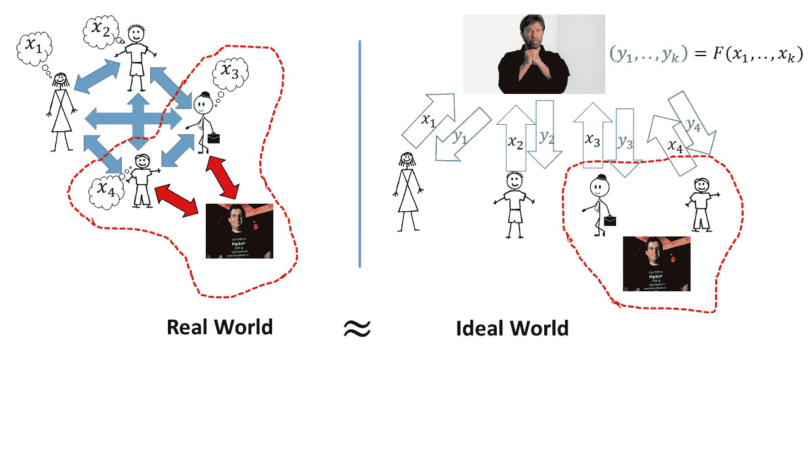

# 多方安全计算 I：定义和从诚实但好奇到恶意编译器的转换

> [`intensecrypto.org/public/lec_17_SFE.html`](https://intensecrypto.org/public/lec_17_SFE.html)

*发现任何错误/打字错误/令人困惑的解释？[在 GitHub 上打开一个 issue](https://github.com/boazbk/crypto/issues/new)。您也可以在下面评论*

**★ 另请参阅本章的[PDF 版本**](https://files.boazbarak.org/crypto/lec_17_SFE.pdf)（更好的格式/参考文献）★

维基百科[定义](https://en.wikipedia.org/wiki/Cryptography)密码学为“在存在称为对手的第三方的情况下进行安全通信的技术和实践研究”。然而，我认为一个更好的定义是：

> *密码学是关于用数学取代信任的*

总的来说，我们之所以在密码学上如此努力，是因为缺乏信任。如果 Alice 和 Bob 可以保证他们的通信，尽管是通过由众多实体控制和监听的无线和有线网络，但它们的可靠性就像是通过信使亲手递送一样可靠，就像[Patti Whitcomb](http://old.iolaregister.com/Local%20News/Stories/Weatherwontstopcarriers.html)一样可靠，而不是好奇的 Eve 可能会查看信息，或者恶意的 Mallory 可能会篡改它们。如果 Vladimir 可以简单地说“相信我，Barack，这是一枚真正的核弹”，我们就不需要零知识证明。如果我们能够信任所有软件更新都是为了使我们的设备更安全，而不是，比如，将我们的手机变成监控设备。

不幸的是，我们生活的世界并不像理想中那样完美，我们需要这些加密工具。但我们能实现到什么程度？这些加密、认证、零知识等例子是幸运的孤立案例，还是更普遍的密码学理论中的特殊案例？实际上，后者是正确的，并且确实存在一个非常普遍的公式，从某种意义上说，它捕捉了上述所有内容以及更多。这个概念被称为*多方安全计算*，有时也称为*安全函数评估*，这也是本讲座的主题。我们将展示（我喜欢的）所谓的“密码学的基本定理”的（一种放松版本），即在大自然的计算假设下（特别是 LWE 假设，以及 RSA 或分解假设）基本上每个密码学任务都可以实现。这个定理起源于 20 世纪 80 年代姚、Goldreich-Micali-Wigderson 以及许多其他人的工作。正如我们将看到的，就像其他领域的“基本定理”一样，这并不是一个关闭该领域的成果，而是一个开启了许多其他问题的结果。但在我们能够陈述这个结果之前，我们需要讨论如何在一般设置中定义安全性。

## 理想模型与实际模型的安全性。

关键概念是，密码学旨在取代 *信任*。因此，我们想象一个 *理想世界*，在这个世界中存在一个普遍可信的方（密码学家西尔维奥·米卡利喜欢用吉米·卡特来表示，但你可以自由地用你自己的信任度较高的人物来替换），它与协议或交互的所有参与者进行通信，包括潜在的对手。我们通过声明，对手在我们的现实世界中能够实现的一切，在理想世界中也能够实现，来定义安全性。

例如，为了获得安全的通信，爱丽丝会将她的信息发送给可信方，然后可信方会将信息传达给鲍勃。对手无法了解信息的任何内容，也无法更改它们。在零知识应用中，为了证明存在某个秘密 \(x\)，使得 \(f(x)=1\)（其中 \(f(\cdot)\) 是一个公开函数），验证者爱丽丝将她的秘密输入 \(x\) 发送给可信方，可信方随后验证 \(f(x)=1\) 并简单地将信息“陈述为真”发送给鲍勃。它不会向鲍勃透露关于秘密 \(x\) 的任何信息。

但这种范式远远超出了这个范围。例如，[第二价格（或维克瑞）拍卖](https://en.wikipedia.org/wiki/Vickrey_auction)被认为是一种激励竞标者出价其真实价值的方法。在这些拍卖中，每个潜在的买家都会提交一个密封的出价，物品归出价最高的买家所有，但买家只需支付第二高出价的价格。我们可以想象一个数字版本，其中买家发送他们出价的加密版本。拍卖师可以宣布赢家是谁以及第二高出的价格是多少，但我们真的能信任他忠实执行吗？也许我们希望有一个拍卖，即使拍卖师也无法了解除了赢家身份和第二高出价价值之外的其他任何出价信息？如果有一个所有竞标者都可以与其共享其私有价值的可信方，并且只宣布拍卖结果而不做更多的事情，那岂不是很好？这不仅可以用于第二价格拍卖，还可以用于实施许多其他机制，尤其是如果你是一位[丹麦甜菜种植者](https://www.cs.purdue.edu/homes/aliaga/cs197-10/papers/bogetoft.pdf)。

还有其他一些例子。也许两家医院可能想知道同一个病人是否访问了双方，但不想（或法律上不允许）相互分享访问各自医院的人的名单。可信方可以获取这两份名单，并输出它们的交集。

列表可以一直继续。也许我们想要安全地聚合 [爱沙尼亚 IT 公司](https://eprint.iacr.org/2011/662.pdf) 的性能信息或 [华尔街银行](http://arxiv.org/abs/1111.5228) 的财务健康状况。如果我们只是能够访问一个普遍信任的各方，那么几乎每一个加密任务都可以变得非常简单。但在现实世界中，我们当然不能。这就是为什么安全多方计算的概念如此令人兴奋。

## 形式化定义安全多方计算

我们现在转向形式定义。正如我们下面所讨论的，有许多安全多方计算的不同变体，我们下面选择一个简单的版本。一个 *\(k\) 方协议* 是一组为所有 \(k\) 方设计的有效可计算的 \(k\) 方预设交互策略。^(1) 我们假设每对各方之间存在一个认证的私有点对点通道（这可以使用签名和加密来实现）。^(2) 一个 *\(k\) 方功能* 是一个将 \(k\) 个输入映射到 \(\{0,1\}^n\) 中的 \(k\) 个输出的概率过程。^(3)

### 第一次尝试：一个稍微“过于理想”的定义

这里有一个定义尝试，它很干净但有点过于严格。尽管如此，它还是捕捉到了安全多方计算的大部分精神：

设 \(F\) 为一个 \(k\) 方功能。一个 *\(k\) 方安全协议* 是一个满足以下条件的 \(k\) 方协议：对于每个 \(T\subseteq [k]\) 和每个有效的攻击者 \(A\)，存在一个有效的“理想攻击者” \(S\)（即有效的交互算法），使得对于每个输入集 \(\{ x_i \}_{i\in [k]\setminus T}\)，以下两个分布是计算上不可区分的：

+   在协议执行中，\(A\) 控制了 \(T\) 集合中的各方，而 \(T\) 集合外的各方的输入由 \(\{ x_i \}_{i\in [k]\setminus T}\) 给出，所有各方（无论是受攻击者控制的还是不受攻击者控制的）的输出元组 \((y_1,\ldots,y_k)\)。

+   使用以下过程计算出的元组 \((y_1,\ldots,y_k)\)：

    1.  我们让 \(\{ x_i \}_{i \in T}\) 由 \(S\) 选择，并计算 \((y'_1,\ldots,y'_k)=F(x_1,\ldots,x_k)\)。

    1.  对于每个 \(i\in [k]\)，如果 \(i\not\in T\)（即各方 \(i\) 是“诚实的”），则 \(y_i=y'_i\)，否则，我们让 \(S\) 选择 \(y_i\)。

即，如果攻击者完全控制 \(T\) 集合中的各方，那么攻击者可以通过简单地使用这种控制来选择特定的输入 \(\{ x_i \}_{i\in T}\)，诚实地运行协议，并观察功能性的输出，从而获得相同的收益。

注意，特别是如果 \(T=\emptyset\)（因此没有攻击者），那么如果各方的输入是 \((x_1,\ldots,x_k)\)，则他们的输出将等于 \(F(x_1,\ldots,x_k)\)。

### 允许中止

定义 16.1 上面的定义有点过于严格，以下是这样。考虑 \(k=2\) 的情况，其中有两个参与者爱丽丝（参与者 \(1\)）和鲍勃（参与者 \(2\)），他们希望计算某个输出 \(F(x_1,x_2)\)。如果鲍勃被对手控制，那么他显然可以简单地中止协议，防止爱丽丝计算 \(y_1\)。因此，在这种情况下，在协议的实际执行中，输出 \(y_1\) 将是某个错误消息（我们用 \(\bot\) 表示）。但我们没有允许理想化对手 \(S\) 有这种可能性：如果 \(1\not\in T\)，则必须满足输出 \(y_1\) 等于某个 \((y'_1,y'_2)=F(x_1,x_2)\) 中的 \(y'_1\)。

这意味着我们能够区分真实设置和理想设置中的输出。4 这促使我们定义以下稍微有些混乱的定义，允许对手在任何时间点中止执行：

令 \(F\) 为一个 \(k\) 个参与者的功能。一个 *安全的 \(F\) 协议* 是一个 \(k\) 个参与者的协议，满足对于每个 \(T\subseteq [k]\) 和每个有效的对手 \(A\)，存在一个有效的“理想对手”（即有效的交互算法）\(S\)，使得对于每个输入集合 \(\{ x_i \}_{i\in [k]\setminus T}\)，以下两个分布是计算上不可区分的：

+   在协议的执行中，所有参与者（由对手控制的和不由对手控制的）的输出元组 \((y_1,\ldots,y_k)\)，其中 \(A\) 控制参与者 \(T\)，且不在 \(T\) 中的参与者的输入由 \(\{ x_i \}_{i\in [k]\setminus T}\) 给出，我们用 \(y_i = \top\) 表示第 \(i\) 个参与者中止了协议。

+   使用以下过程计算得到的元组 \((y_1,\ldots,y_k)\)：

    1.  我们让 \(\{ x_i \}_{i \in T}\) 由 \(S\) 选择，并计算 \((y'_1,\ldots,y'_k)=F(x_1,\ldots,x_k)\)。

    1.  对于 \(i=1,\ldots,k\)，执行以下操作：询问 \(S\) 是否希望在此阶段中止，如果它不希望中止，则第 \(i\) 个参与者学习 \(y'_i\)。如果对手在此阶段中止，则我们退出循环，并且参与者 \(i+1,\ldots,k\)（无论他们是诚实的还是恶意的）都不会学习相应的输出。

    1.  令 \(k'\) 为我们上面达到的最后一个非中止阶段。对于每个 \(i\not\in T\)，如果 \(i \leq k'\) 则 \(y_i =y'_i\)，如果 \(i>k'\) 则 \(y'_i=\bot\)。我们让对手 \(S\) 选择 \(\{ y_i \}_{i\in T}\)。

12.1：我们通过规定，对于控制参与者子集的每个对手 \(A\)，\(A\) 在协议的实际执行中的视图与在所有参与者将他们的输入发送到一个理想化且完全可信的参与者（然后计算输出并将其发送给每个参与者）的理想设置中的视图是不可区分的，来定义实现功能 \(F\) 的协议的安全性。

下面是一些好的练习，以确保你理解定义：

+   设 \(F\) 为一个两个参与者功能，使得 \(F(H\|C,H')\) 在图 \(H\) 等于图 \(H'\) 且 \(C\) 是哈密顿回路时输出 \((1,1)\)，否则输出 \((0,0)\)。证明计算 \(F\) 的协议是汉密尔顿性问题语言上的零知识证明系统^(5)。

+   设 \(F\) 为一个 \(k\) 方功能，它在输入 \(x_1,\ldots,x_k \in \{0,1\}\) 时，向所有参与者输出 \(x_i\) 的多数值。那么，在任意安全计算 \(F\) 的协议中，对于控制少于一半参与者的任何敌手，如果至少 \(n/2+1\) 个其他参与者的输入等于 \(0\)，则敌手将无法使一个诚实参与者输出 \(1\)。

在这里暂停并尝试至少非正式地解决这些练习是一个很好的想法。

令人惊讶的是，我们可以为*每个*功能获得这样的协议：

在合理的假设^(7)下，对于每个多项式时间可计算的 \(k\) 函数 \(F\)，都存在一个多项式时间协议可以安全地计算它。

定理 16.3 最初由姚在 1982 年为两个参与者功能特例证明，然后在 1987 年由 Goldreich、Micali 和 Wigderson 为一般情况证明。如以下讨论所示，已经证明了该定理的许多变体，这一研究路线仍在继续。

### 一些注释：

实际上并非只有一个定理，而是许多由许多人通过不同的安全属性需求以及不同的加密和设置假设获得的该基本定理的变体。文献中研究的一些问题包括以下内容：

+   **公平性，保证输出交付**：上述定义并未试图防止“拒绝服务”攻击，在这种意义上，敌手即使在理想情况下也被允许阻止诚实参与者接收他们的输出。

    如上所述，没有诚实多数，这在类似的原因上与我们在[比特币讲座](http://www.boazbarak.org/cs127/chap07_hash_functions.pdf)中讨论的问题一样，如果没有诚实多数，达成共识是困难的。当存在诚实多数时，我们可以实现*保证输出交付*的性质，这可以提供对这种“拒绝服务”攻击的保护。即使没有保证输出交付，我们也可能希望有*公平性*的性质，即我们保证如果诚实参与者没有得到输出，则敌手也不会得到。

+   **网络模型：** 当前定义假设我们有一组 \(k\) 个已知身份的参与者，他们之间有成对的安全（保密和认证）通道。其他网络模型的研究包括广播通道、非私有网络，甚至[无认证](https://eprint.iacr.org/2007/464))。

+   **设置假设：** 该定义不假设存在一个可信的第三方，但人们已经研究了不同的设置假设，包括公钥基础设施、共同参考字符串等。

+   **对抗性能力：** 在某些条件下，可以可能获得针对具有无界计算能力的对手（所谓“信息论安全性”）的可靠多方计算。人们还研究了不同类型的对手，包括“诚实但好奇”或“被动对手”，以及“隐蔽”对手，他们只有在不会被抓住的情况下才会偏离协议。其他研究场景限制了对手控制参与者的能力（例如，诚实多数、较小比例的参与者或特定的控制模式，自适应与静态腐败）。

+   **并发组合：** 上面的定义是为 *独立执行* 而设计的，这已知不会自动意味着对 *并发组合* 的安全性，其中可能同时执行多个相同协议（或不同协议）的副本。这开启了各种新的攻击方式。8 看更多内容。关于更详细的内容，请参阅 [Yehuda Lindell 的论文](http://u.cs.biu.ac.il/~lindell/thesis.html)（或[这个更新版本](http://u.cs.biu.ac.il/~lindell/LNCSmonograph.html))。一个被称为“UC 安全性”的非常一般的概念（代表“普遍可组合”或“终极查克”）已被提出，以在这些设置中实现安全性，尽管代价是额外的设置假设，请参阅[这里](http://www.cs.tau.ac.il/~canetti/materials/ICALP08.pdf)和[这里](http://eprint.iacr.org/2007/475)。

+   **通信：** 定理 16.3 的通信成本可能与计算 \(F\) 的电路大小成比例。这可能是一个非常高的成本，尤其是在处理大量数据时。实际上，我们有时可以使用全同态加密或其他技术来避免这种成本。

+   **效率与通用性：** 虽然定理 16.3 告诉我们原则上几乎每个协议问题都可以解决，但它的证明几乎永远不会产生你真正想要运行的协议，因为它有巨大的效率开销。效率问题是多方安全计算迄今为止没有许多实际应用的最大原因。然而，研究人员已经展示了为特定感兴趣的问题量身定制的更高效的协议，并且在这些结果更加实用方面已经取得了稳步进展。有关更多信息，请参阅[这次研讨会的工作坊幻灯片和视频](http://crypto.biu.ac.il/5th-biu-winter-school)。

**多方安全计算是密码学的终结吗？** 多方安全计算的概念似乎非常强大，以至于你可能会认为一旦实现，除了效率问题外，在密码学中就没有其他事情可做了。这离事实非常遥远。多方安全计算确实为我们解决在任意轮次交互和无限通信环境下的许多问题提供了一种方法，但这远非总是如此。正如我们之前提到的，交互有时会带来*质的差异*（当爱丽丝和鲍勃被时间而不是空间分隔时）。在我们对全同态加密的讨论中，也存在其他属性，如紧凑通信，这些属性并不由多方安全计算暗示，但在云计算等环境中可能产生重大影响。话虽如此，多方安全计算是一个极其通用的范式，它确实适用于许多密码学问题。

**进一步阅读：** Lindell 和 Pinkas 的[调查](http://repository.cmu.edu/cgi/viewcontent.cgi?article=1004&context=jpc)对文献中考虑的不同变体和安全属性提供了很好的概述，还可以参考[Goldreich 的调查](http://www.wisdom.weizmann.ac.il/~oded/foc-sur04.html)中的第七部分。Pass 和 Shelat 的笔记[第六章](http://www.cs.cornell.edu/courses/cs4830/2010fa/lecnotes.pdf)也是一个很好的资源。

## 示例：使用比特币的第二价格拍卖

假设我们有以下设置：一个拍卖师想要出售一些物品并运行一个第二价格拍卖，其中每个参与者提交一个密封的出价，最高出价者以次高出价者的价格获得该物品。然而，如上所述，出价者不希望拍卖师了解他们的出价，通常除了最高出价者的身份和次高出价的价值之外，没有其他信息。此外，我们可能希望支付通过电子货币，如比特币，这样拍卖师不仅得到关于获胜出价的信息，而且得到一个实际的自证交易，他们可以使用它来获得付款。

这是我们可以如何使用多方安全计算获得此类协议的方法：

+   我们有 \(k\) 个当事人，其中第一个当事人是拍卖师，当事人 \(2,\ldots,k\) 是出价者。为了简单起见，我们假设每个当事人 \(i\) 都有一个与某个比特币账户相关联的公钥 \(v_i\)。^(9) 我们将这些密钥视为公共输入。

+   出价者 \(i\) 的私有输入是它想要出价的值 \(x_i\) 以及与它们的公钥相对应的秘密密钥 \(s_i\)。

+   该功能只为拍卖师提供输出，这将是有奖竞标者的身份 \(i\) 以及一个有效签名，该签名将 \(x\) 比特币转移到拍卖师的密钥 \(v_1\)，其中 \(x\) 是第二大有效出价的价值（即，\(x\) 等于第二大 \(x_j\)，其中 \(s_j\) 确实是对应于 \(v_j\) 的私钥。))

思考这样一个功能的安全协议能完成什么是有价值的。例如：

+   在理想模型中，对手需要独立选择其查询的事实意味着，对手在决定其出价之前无法从诚实方的出价中获得任何信息。

+   尽管所有各方都将他们的签名密钥作为协议的输入，但我们保证，除了将要产生的单个签名外，没有人会了解其他任何一方的签名密钥。

+   注意，如果 \(i\) 是最高出价者，而 \(j\) 是次高出价者，那么在协议结束时，我们将得到一个在交易中将 \(x_j\) 比特币转移到 \(v_1\) 的有效签名，尽管 \(i\) 并不知道 \(x_j\) 的值（实际上从未了解过 \(j\) 的身份。）尽管如此，\(i\) 保证产生的签名将是在其出价金额以下，并且是其他出价者实际出价的金额。

我发现能够获得如此强大的安全概念非常令人印象深刻。这证明了获取通用功能协议的巨大力量。

### 另一个例子：分布式和门限密码学

有时使用多方安全计算进行**加密计算**也是有意义的。例如，可能有几个原因让我们想要“分割”一个密钥在几个当事人之间，这样就没有任何一方完全知道它。

+   一些关于**密钥托管**（给政府或其他实体解密通信的选项）的提案建议在几个机构或机构之间分割一个加密密钥（例如，联邦调查局、法院等），这样他们必须合作才能解密通信，从而有望防止非法访问。

+   在另一方面，一家公司可能希望将其自己的密钥分割到不同国家的几个服务器上，以确保没有任何一个完全处于一个司法管辖之下。或者它可能出于技术原因这样做，这样如果单个地点发生故障，密钥就不会受到损害。

有几个这样的例子。这种方法的一个问题是，将加密密钥分割开来并不等同于将 100 美元纸币对半切开。如果你只是将一半的比特位给每个参与者，你可能会严重损害安全性。（例如，有可能从仅占其比特位的 \(27\%\) 中恢复完整的 RSA 密钥[参见](http://eprint.iacr.org/2008/510.pdf)）。

这里有一个更好的方法，称为[分享密钥](https://en.wikipedia.org/wiki/Secret_sharing)：为了在 \(k\) 个参与者之间安全地共享字符串 \(s\in\{0,1\}^n\)，使得任何 \(k-1\) 个参与者都没有关于它的信息，我们在 \(\{0,1\}^n\) 中随机选择 \(s_1,\ldots,s_{k-1}\)，并让 \(s_k = s \oplus s_1 \oplus \cdots s_{k-1}\)（\(\oplus\) 如同通常表示异或操作），然后给参与者 \(i\) 分配字符串 \(s_i\)，这被称为 \(s\) 的*第 \(i\) 份共享*。注意 \(s = s_1 \oplus \cdots \oplus s_k\)，因此给定所有 \(k\) 份，我们可以重建密钥。显然，前 \(k-1\) 个参与者没有收到关于 \(s\) 的任何信息（因为他们的份额是独立于 \(s\) 生成的），但以下不太难证明的陈述表明这对于*任何* \(k-1\) 个参与者的集合都成立：

对于每个 \(s\in\{0,1\}^n\)，以及大小为 \(k-1\) 的 \(T\subseteq [k]\) 集合，如果我们随机选择 \(s_i\) 作为 \(i\in T\) 的值，并将 \(s_t = s \oplus_{i\in T} s_i\)（其中 \(t = [k]\setminus T\)），那么我们得到的 \((s_1,\ldots,s_k)\) 的分布与上面完全相同。

我们将引理 16.4 的证明留给读者作为练习。

分享密钥解决了保护“静止”密钥的问题，但如果我们实际上想要*使用*密钥来签名或解密某些消息，那么似乎我们需要将所有这些片段收集到一个地方，这正是我们想要避免做的事情。这就是多方安全计算发挥作用的地方；我们可以定义一个功能 \(F\)，它接受公共输入 \(m\) 和秘密输入 \(s_1,\ldots,s_k\)，并生成 \(m\) 的签名或解密。实际上，我们可以更进一步，甚至让各方在不了解消息内容的情况下签名或解密消息，只要它满足某些条件。

此外，分享密钥可以推广，使得除了 \(k\) 以外的阈值对于重建密钥来说是必要且充分的（人们也研究了更复杂的访问模式）。同样，多方安全计算可以用来实现具有更精细访问控制机制的分布式密码学。

## 证明基本定理：

我们将在本讲座和下一讲座中完成（放宽版本的）基本定理的证明。证明分为两个阶段：

1.  使用完全同态加密的“诚实但好奇”案例的协议。

1.  将一般情况简化为“诚实但好奇”的情况，其中对手精确地遵循协议，但仅仅试图在其“有权”学习的信息之上获取一些信息。（这种简化基于零知识证明，归功于 Goldreich、Micali 和 Wigderson）

我们注意到，虽然全同态加密为第一步提供了一个概念上简单的方法，但它目前并不是最有效的方法，而且大多数实际实现都是基于称为“Yao 的乱序电路”的技术（参见[这本书](http://u.cs.biu.ac.il/~lindell/efficient-protocols.html)或[这篇论文](https://eprint.iacr.org/2004/175.pdf)或[这篇综述](https://www.cs.uic.edu/pub/Bits/PeterSnyder/Peter_Snyder_-_Garbled_Circuits_WCP_2_column.pdf)），它反过来又基于一个称为[ oblivious transfer](https://en.wikipedia.org/wiki/Oblivious_transfer)的概念，这可以被视为“婴儿私人信息检索”（尽管它先于后者概念）。

我们将关注**两方**的情况。同样的想法可以扩展到\(k>2\)方，但会有一些额外的复杂性。

## 恶意到诚实但好奇的简化

我们从第二阶段开始。给出一个将“诚实但好奇”设置中的协议转换为恶意设置中安全的协议的简化。也就是说，我们将证明以下定理：

存在一个多项式时间的“编译器”\(C\)，对于每一个\(k\)方协议\((P_1,\ldots,P_k)\)（其中所有\(P_i\)都是多项式时间可计算的策略，可能是随机的），\((\tilde{P}_1,\ldots,\tilde{P}_k) = C(P_1,\ldots,P_k)\)是一个\(k\)元多项式时间可计算的策略，并且如果\((P_1,\ldots,P_k)\)是一个针对诚实但好奇对手安全的（可能是随机的）功能\(F\)的协议，那么\((\tilde{P}_1,\ldots,\tilde{P}_k)\)是一个针对**恶意**对手安全的相同功能\(F\)的协议。

本节的剩余部分致力于定理 16.5 的证明。为了简化符号，我们将关注\(k=2\)的情况，其中只有两个参与者（“Alice”和“Bob”），尽管这些技术可以推广到任意数量的参与者\(k\)。请注意，从先验的角度来看，这样的编译器是否存在根本不清楚。在“诚实但好奇”的设置中，我们假设对手严格遵循协议。因此，如果 Bob 的指示不是要求这样做，那么 Alice 向 Bob 泄露所有她的秘密的协议在“诚实但好奇”的设置中可以是安全的。更严重的是，Bob 可能有一种以微妙的方式偏离协议的能力，这将是完全不可检测的，但允许他学习 Alice 的秘密。任何将协议转换为在恶意设置中获得安全的转换都需要排除这种偏差。

主要思想如下：我们一次编译一个参与方 - 我们首先将协议转换，使其即使在爱丽丝试图作弊的情况下也能保持安全，然后将其转换，使其即使在鲍勃试图作弊的情况下也能保持安全。让我们专注于爱丽丝。让我们假设（不失一般性）爱丽丝和鲍勃交替在协议中发送消息，爱丽丝先发，因此爱丽丝发送奇数消息，鲍勃发送偶数消息。让我们用 \(m_i\) 表示协议的第 \(i\) 轮中发送的消息。爱丽丝的指令可以被视为一系列函数 \(f_1,f_3,\cdots,f_t\)（其中 \(t\) 是爱丽丝最后一次发言的轮次），每个 \(f_i\) 都是一个高效的函数，将爱丽丝的秘密输入 \(x_1\)、（可能）她的随机硬币 \(r_1\) 以及前一条消息的记录 \(m_1,\ldots,m_{i-1}\) 映射到下一条消息 \(m_i\)。函数 \(\{ f_i \}\) 是公开的，并作为协议指令的一部分。鲍勃唯一不知道的是 \(x_1\) 和 \(r_1\)。因此，我们的想法是改变协议，使得在爱丽丝发送消息 \(i\) 之后，她向鲍勃*证明*该消息确实是通过 \(f_i\) 正确计算出来的。如果 \(x_1\) 和 \(r_1\) 不是秘密的，爱丽丝可以简单地将其发送给鲍勃，以便他可以自行验证计算。但是，因为它们是（并且协议的安全性可能取决于这一点），我们改用*零知识证明*。

首先，让我们假设爱丽丝的策略是*确定性的*（因此没有随机带子 \(r_1\)）。确保她不能使用恶意策略的第一个尝试可能是爱丽丝在消息 \(m_i\) 后跟随一个零知识证明，证明存在某个 \(x_1\)，使得 \(m_i=f_i(x_1,m_1,\ldots,m_{i-1})\)。然而，这实际上并不安全 - 在这一点上，值得你停下来思考一下你是否能理解这个解决方案的问题。

真的，请停下来思考一下为什么这不会安全。

你停下来思考了吗？

问题在于，在每一步，爱丽丝都证明了存在*某个*输入 \(x_1\) 可以解释她的消息，但她并没有证明对于所有消息都是*相同的输入*。如果爱丽丝真的诚实，她应该只选择一次输入并在整个协议中使用它，她不能根据输入 \(x_1\) 计算第一条消息，然后根据某个输入 \(x'_1 \neq x_1\) 计算第三条消息。当然，我们不能让爱丽丝透露输入，因为这会违反安全性。解决方案是让爱丽丝*预先承诺*输入。我们之前见过承诺，但现在让我们正式定义这个概念：

对于长度为 \(\ell\) 的字符串的*承诺方案*是发送者和接收者之间的一种两方协议，满足以下条件：

+   **隐藏（发送者的安全性）**：对于任意两个发送者输入 \(x,x' \in \{0,1\}^\ell\)，无论接收者使用什么有效的策略，它都无法区分发送者使用 \(x\) 还是 \(x'\) 与发送者的交互。

+   **绑定（接收者的安全性）**：无论发送者使用什么（有效或无效）策略，如果接收者遵循协议，则概率 \(1-negl(n)\) 下，最多存在一个字符串 \(x\in\{0,1\}^\ell\)，使得记录与输入 \(x\) 和某些发送者随机数 \(r\) 一致。

那就是，承诺是数字上放置消息在密封信封中以在以后时间打开的类似物。要承诺消息 \(x\)，发送者和接收者根据协议进行交互，要*打开*承诺，发送者只需发送 \(x\) 以及在承诺阶段使用的随机硬币。我们定义的这种变体被称为*计算隐藏和统计绑定*，因为发送者的安全性仅保证对有效接收者，而绑定属性保证对所有发送者。也存在统计隐藏和计算绑定承诺，尽管可以证明我们需要至少将一方限制为有效策略。

我们之前已经看到过一个承诺方案（由于 Naor）：接收者发送一个随机数 \(z\leftarrow_R\{0,1\}^{3n}\)，发送者通过选择一个随机的 \(s\in\{0,1\}^n\) 并发送 \(y = \ensuremath{\mathit{PRG}}(s)\oplus bz\) 来对位 \(b\) 进行承诺，其中 \(\ensuremath{\mathit{PRG}}:\{0,1\}^n\rightarrow\{0,1\}^{3n}\) 是一个伪随机生成器。验证它满足上述定义是一个很好的练习。通过并行运行此协议 \(\ell\) 次，我们可以承诺任意多项式长度的字符串。

我们现在可以完全描述确保协议对恶意爱丽丝安全的转换，对于爱丽丝的原始策略是**确定性的**（因此不使用随机硬币）的情况。

+   初始时，爱丽丝和鲍勃进行一个承诺方案，其中爱丽丝对其输入 \(x_1\) 进行承诺。令 \(\tau\) 为这个承诺阶段的记录，\(r_{com}\) 为爱丽丝在过程中使用的随机数。10

+   对于 \(i=1,2,\ldots\)：

    +   如果 \(i\) 是偶数，则鲍勃将 \(m_i\) 发送给爱丽丝。

    +   如果 \(i\) 是奇数，则爱丽丝将 \(m_i\) 发送给鲍勃，然后他们进行一个零知识证明，证明存在 \(x_1,r_{com}\) 使得（1）\(x_1,r_{com}\) 与 \(\tau\) 一致，并且（2）\(m_i = f_i(x_1,m_1,\ldots,m_{i-1})\)。证明需要重复足够多次，以确保如果陈述是错误的，则鲍勃以 \(1-negl(n)\) 的概率拒绝。

    +   如果证明被拒绝，则鲍勃终止协议。

我们将不会证明安全性，但在这里仅概述它，更详细的证明请参见 Goldreich 调查中的[第 7.3.2 节](http://www.nowpublishers.com/article/Details/TCS-001)：

+   为了论证我们保持了**爱丽丝**的安全性，我们使用零知识属性：我们声称鲍勃无法从零知识证明中学习到任何东西，正是因为他自己可以模拟这些证明。我们还使用了承诺方案的隐藏属性。为了形式化地证明安全性，我们需要证明无论鲍勃在修改后的协议中学到了什么，他都可以在原始协议中同样学到。我们通过**模拟**鲍勃来实现这一点，用对一些随机垃圾的承诺代替 \(x_1\)，用它们的模拟版本代替零知识证明。安全性的证明需要混合论证，这也是一个很好的练习，尝试自己来做。

+   为了论证我们保持了**鲍勃**的安全性，我们使用了承诺方案的绑定属性以及零知识系统的正确性属性。再次，为了形式化证明，我们需要证明我们可以将修改后的协议中爱丽丝的任何潜在恶意策略转换成原始协议中的“诚实但好奇”策略（也允许爱丽丝中止协议）。结果证明，为了做到这一点，仅仅零知识系统是正确的还不够，我们需要一个更强的属性，称为**知识证明**。我们不会正式定义它，但大致来说，这意味着我们可以将任何说服验证者一个陈述以非忽略概率为真的证明者策略转换成一个输出底层秘密（即，在我们的情况下，\(x_1\) 和 \(r_{com}\)）的算法。这对于将爱丽丝的潜在恶意策略转换成诚实但好奇的策略至关重要。

我们可以对鲍勃（或查理、大卫等在 \(k>2\) 方案中的其他人）重复这种转换，将一个在诚实但好奇设置中安全的协议转换为一个在恶意设置中安全（允许中止）的协议。

### 处理概率策略：

到目前为止，我们假设在诚实但好奇的情况下，爱丽丝的原始策略是确定性的，但当然我们需要考虑概率策略。一种方法是将爱丽丝的随机带 \(r\) 视为她秘密输入 \(x_1\) 的一部分。然而，虽然爱丽丝在诚实但好奇的设置中仍然有权自由选择自己的输入 \(x_1\)，但她无权选择随机带，而是应该遵循协议的指示，并随机选择。因此，我们需要使用**掷硬币协议**来选择随机性，或者更准确地说，是一个“在井中掷硬币”协议，其中爱丽丝和鲍勃进行掷硬币协议，在协议结束时他们生成一些随机硬币 \(r\)，只有爱丽丝知道，但鲍勃仍然保证它们是随机的。这样的协议实际上可以非常简单地实现。假设我们想要生成 \(m\) 个硬币：

+   Alice 随机选择 \(r'\leftarrow_R\{0,1\}^m\) 并参与一个**承诺协议**以对 \(r'\) 进行承诺。

+   Bob 选择 \(r'' \leftarrow_R\{0,1\}^m\) 并将其明文发送给 Alice。

+   抛硬币协议的结果将是字符串 \(r=r'\oplus r''\)。

注意，Alice 知道 \(r\)。Bob 不知道 \(r\)，但因为他是在 Alice 对 \(r'\) 进行承诺之后选择 \(r''\) 的，所以他知道它必须是完全随机的，无论 Alice 选择的 \(r'\) 如何。可以证明，如果我们在这个抛硬币协议开始时使用这个协议，然后修改零知识证明以显示 \(m_i=f_i(x_1,r_1,m_1,\ldots,m_{i-1})\)，其中 \(r_1\) 是与抛硬币协议的记录一致的字符串，那么我们就得到了一个将诚实但好奇的对手转化为恶意设置的通用转换。

多方安全计算的观念——定义它并实现它——相当微妙，我强烈建议你阅读上面列出的其他一些参考资料。特别是，[巴伊兰安全计算和效率冬季学校](https://cyber.biu.ac.il/event/the-1st-biu-winter-school/)的幻灯片和视频，以及[实用多方计算进展冬季学校](https://cyber.biu.ac.il/event/the-5th-biu-winter-school/)的幻灯片和视频，都是这个主题和相关材料的极好来源。

1.  与本文的大部分内容不同，在多方安全计算的上下文中，我们使用 \(k\) 来表示协议中的参与者数量，而不是某些加密方案的密钥。

    ↩

1.  对于 \(k>2\) 个参与者的协议，还需要一个**广播通道**，但这可以通过认证通道和数字签名的组合来实现。[↩](http://epubs.siam.org/doi/abs/10.1137/0212045?journalCode=smjcat "实现")

    ↩

1.  将输入和输出大小固定为 \(n\) 是为了符号简单，并且不失一般性。更一般地说，输入和输出的大小可以是 \(n\) 的多项式，一些输入或输出也可以为空。此外，请注意，可以定义一个更一般的状态功能概念，尽管将构建状态功能协议的任务简化为构建无状态协议的任务并不困难。

    ↩

1.  作为一个旁注，如果我们有一个**诚实的大多数**玩家，即如果 \(|T|<k/2\)，我们可以避免这个问题，但在两党设置中，这个条件没有意义，因为只有在没有作弊方的情况下，你才能有一个诚实的大多数。

    ↩

1.  实际上，如果我们想吹毛求疵，这被称为零知识**论证**系统，因为只有对高效证明者才能保证正确性。然而，在几乎所有应用中，这种区别并不重要。

    ↩

1.  我们对输入图 \(H\) 的处理是一般情况的实例。虽然功能性的定义只提到了私有输入，但很容易也包括公共输入。如果我们想包括某些公共输入 \(Z\)，我们只需将 \(Z\) 连接到所有私有输入（并且功能性检查它们是否都相同，否则输出 `error` 或类似的结果）。

    ↩

1.  最初，这是在陷门置换（可以从因式分解或 RSA 假设中推导出来）的假设下证明的，但今天它是在各种其他假设下已知的，特别是包括 LWE 假设。

    ↩

1.  可能出现的问题的一个例子是“大师级攻击”，其中一个人对国际象棋一无所知，可以同时与两位大师对弈，将他们的走法传递给对方，从而保证至少在一场比赛中获胜（或者在两场中都平局）。

    ↩

1.  正如我们之前讨论的，比特币没有账户的概念，而是对于每个公钥，公共账本包含足够多的比特币，这些比特币已经转移到这些密钥上（意味着任何可以针对这些密钥签名的人都可以转移相应的硬币）。

    ↩

1.  注意，尽管我们假设在原始的诚实但好奇协议中，Alice 使用了确定性策略，但我们将把协议转换成在承诺和零知识阶段 Alice 都使用随机策略的协议。

    ↩

## 评论

评论通过 [GitHub 仓库](https://github.com/boazbk/crypto/issues) 使用 [utteranc.es](https://utteranc.es) 应用发布。发表评论需要 GitHub 登录。如果您不想授权应用代表您发布，您也可以直接在 [本页面的 GitHub 问题](https://github.com/boazbk/crypto/issues?q=Multiparty%20secure%20computation%20in%3Atitle) 上发表评论。

编译于 2021 年 11 月 17 日 22:36:37

版权所有 2021，Boaz Barak。

本作品根据 [Creative Commons Attribution-NonCommercial-NoDerivatives 4.0 国际许可协议](https://creativecommons.org/licenses/by-nc-nd/4.0/) 许可。

使用 [pandoc](https://pandoc.org/) 和 [panflute](http://scorreia.com/software/panflute/) 以及从 [gitbook](https://www.gitbook.com/) 和 [bookdown](https://bookdown.org/) 衍生的模板制作。
