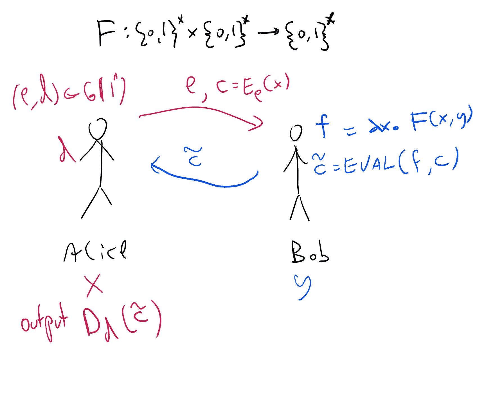
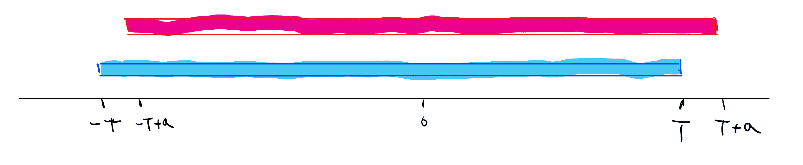

# 多方安全计算 II：使用全同态加密的构造

> 原文：[`intensecrypto.org/public/lec_18_SFE_part2.html`](https://intensecrypto.org/public/lec_18_SFE_part2.html)

*发现任何错误/打字错误/令人困惑的解释？[在 GitHub 上打开问题](https://github.com/boazbk/crypto/issues/new)。您也可以在下面评论。

**★ 另请参阅本章的[PDF 版本**](https://files.boazbarak.org/crypto/lec_18_SFE_part2.pdf)（更好的格式/参考文献）★

在上一节课中，我们看到了安全多方计算的定义，以及将实现一般（恶意）设置中的安全性的任务简化为被动（诚实但好奇）设置的编译器。在本节课中，我们将看到如何使用全同态加密在诚实但好奇的设置中实现安全性。¹ 我们专注于两方情况，并证明以下定理：

假设 LWE 猜想，对于每个两方功能 \(F\)，都有一个在诚实但好奇模型中计算 \(F\) 的协议。

在证明定理之前，回顾一下当 \(k=2\) 和诚实但好奇情况专门化时，安全多方计算的实际定义可能是有益的。由于我们不必处理中止的可能性，这里的定义显著简化了。 

设 \(F\) 是从 \(\{0,1\}^n\times \{0,1\}^n\) 到 \(\{0,1\}^n\times\{0,1\}^n\) 的（可能概率的）映射。一个 *安全的 \(F\) 协议* 是一个两方协议，对于 \(\{1,2\}\) 中的每个方 \(t\)，都存在一个有效的“理想对手”（即有效的交互算法）\(S\)，使得对于每一对输入 \((x_1,x_2)\)，以下两个分布是计算上不可区分的：

+   通过在输入 \(x_1,x_2\) 上运行协议获得的元组 \((y_1,y_2,v)\)，其中 \(y_1,y_2\) 是两方的输出，\(v\) 是方 \(t\) 的 *视图*（所有内部随机数、输入和接收到的消息）。

+   通过让 \((y_1,y_2)=F(x_1,x_2)\) 和 \(v=S(x_t,y_t)\) 计算出的元组 \((y_1,y_2,v)\)。

即，\(S\) 只获取输入 \(x_t\) 和输出 \(y_t\)，可以模拟一个诚实但好奇的对手控制方 \(t\) 将看到的所有信息。

## 从全同态加密构建两方诚实但好奇的计算

设 \(F\) 为两方功能。让我们从 \(F\) 是 *确定性的* 且只有 Alice 接收输出的情况开始。我们稍后将展示一个从一般情况到这种情况的简单化简。以下是一个 Alice 和 Bob 在输入 \(x,y\) 上分别运行的协议的建议，以便 Alice 将学习 \(F(x,y)\) 但不会学习关于 \(y\) 的更多内容，而 Bob 将不会学习关于 \(x\) 的任何他之前不知道的内容。

17.1：使用具有电路隐私的全同态加密方案的两方计算的诚实但好奇协议。

> **协议 2PC:** （见图 17.1）
> 
> +   **假设：** \((G,E,D,\ensuremath{\mathit{EVAL}})\) 是一个完全同态加密方案。
> +   
> +   **输入：** 爱丽丝的输入是 \(x\in\{0,1\}^n\)，鲍勃的输入是 \(y\in\{0,1\}^n\)。目标是让爱丽丝只学习 \(F(x,y)\)，而鲍勃学习不到任何信息。
> +   
> +   **爱丽丝->鲍勃：** 爱丽丝生成 \((e,d)\leftarrow_R G(1^n)\) 并发送 \(e\) 和 \(c=E_e(x)\)。
> +   
> +   **鲍勃->爱丽丝：** 鲍勃定义 \(f\) 为函数 \(f(x)=F(x,y)\)，并将 \(c'=\ensuremath{\mathit{EVAL}}(f,c)\) 发送给爱丽丝。
> +   
> +   **爱丽丝的输出：** 爱丽丝计算 \(z=D_d(c')\)。

首先，注意如果爱丽丝和鲍勃都遵循协议，那么确实在协议结束时爱丽丝将计算 \(F(x,y)\)。我们现在声称鲍勃不会从爱丽丝的输入中学习到任何信息：

**断言 B：** 对于每一个 \(x,y\)，存在一个独立的算法 \(S\)，使得 \(S(y)\) 在与爱丽丝交互并输入 \((x,y)\) 时与鲍勃的视图不可区分。

**证明：** 在这个协议中，鲍勃只收到一个形式为 \((e,c)\) 的单一消息，其中 \(e\) 是一个公钥，\(c=E_e(x)\)。模拟器 \(S\) 将生成 \((e,d) \leftarrow_R G(1^n)\) 并计算 \((e,c)\)，其中 \(c=E_e(0^n)\)。 （通常 \(0^n\) 表示由所有零组成的长度为 \(n\) 的字符串。）无论 \(x\) 是什么，\(S\) 的输出与鲍勃通过加密方案的安全性收到的消息是不可区分的。QED

（实际上，断言 B 即使在鲍勃的恶意策略下也是成立的——你能看出为什么吗？）

我们现在希望我们能证明关于爱丽丝的安全性也是相同的。也就是说，证明以下内容：

**断言 A：** 对于每一个 \(x,y\)，存在一个独立的算法 \(S\)，使得 \(S(y)\) 在与鲍勃交互并输入 \((x,y)\) 时与爱丽丝的视图不可区分。

在这一点上，你可能想尝试自己证明断言 A。如果你在证明它时遇到困难，试着考虑它是否甚至是真的。

因此，断言 A 并非普遍成立。原因是：完全同态加密的定义仅要求 \(\ensuremath{\mathit{EVAL}}(f,E(x))\) 解密为 \(f(x)\)，但它并不要求隐藏 \(f\) 的内容。例如，对于每个 FHE，如果我们修改 \(\ensuremath{\mathit{EVAL}}(f,c)\) 以将 \(f\) 的描述的前 \(100\) 位追加到密文（并且让解密算法忽略这些额外信息），那么这仍然是一个安全的 FHE.^(2) 现在我们没有确切地指定我们如何描述函数 \(f(x)\)，该函数定义为 \(x \mapsto F(x,y)\)，但显然存在一些表示，其中描述的前 \(100\) 位会揭示硬编码常数 \(y\) 的前几位，这意味着爱丽丝将从鲍勃的消息中学习这些位。

因此，我们需要得到一个更强的属性，称为 *电路隐私*。这是一个在其他使用全同态加密（FHE）的上下文中有用的属性。让我们现在定义它：

::: {.definition title=“完美电路隐私” #perfectcircprivatedef} 设 \(\mathcal{E}=(G,E,D,\ensuremath{\mathit{EVAL}})\) 是一个全同态加密（FHE）。我们说 \(\mathcal{E}\) 满足 *完美电路隐私*，如果对于 \(G(1^n)\) 输出的每一个 \((e,d)\)，以及每一个 \(poly(n)\) 描述大小的函数 \(f:\{0,1\}^\ell\rightarrow\{0,1\}\)，以及每一个密文 \(c_1,\ldots,c_\ell\) 和 \(x_1,\ldots,x_\ell \in \{0,1\}\) 使得 \(c_i\) 是由 \(E_e(x_i)\) 输出的，\(\ensuremath{\mathit{EVAL}}_e(f,c_1,\ldots,c_\ell)\) 的分布与 \(E_e(f(x))\) 的分布相同。也就是说，对于每一个 \(z\in\{0,1\}^*\)，\(\ensuremath{\mathit{EVAL}}_e(f,c_1,\ldots,c_\ell)=z\) 的概率与 \(E_e(f(x))=z\) 的概率相同。我们强调，这些概率仅取自算法 \(\ensuremath{\mathit{EVAL}}\) 和 \(E\) 的硬币。

完美电路隐私是一个强大的属性，它也自动意味着 \(D_d(\ensuremath{\mathit{EVAL}}(f,E_e(x_1),\ldots,E_e(x_\ell)))=f(x)\)（你能看出为什么吗？）。特别是，一旦你理解了定义，以下引理就是一个相当直接的练习。

如果 \((G,E,D,\ensuremath{\mathit{EVAL}})\) 满足完美电路隐私，那么如果 \((e,d) = G(1^n)\)，则对于每一个两个 \(poly(n)\) 描述大小的函数 \(f,f':\{0,1\}^\ell\rightarrow\{0,1\}\) 和每一个 \(x\in\{0,1\}^\ell\) 使得 \(f(x)=f'(x)\)，以及每一个算法 \(A\)，

\[| \Pr[ A(d,\ensuremath{\mathit{EVAL}}(f,E_e(x_1),\ldots,E_e(x_\ell)))=1] - \Pr[ A(d,\ensuremath{\mathit{EVAL}}(f',E_e(x_1),\ldots,E_e(x_\ell)))=1] | < negl(n) \;\;(17.1).\]

请在这里停下来，并尝试证明 引理 17.3

上述算法 \(A\) 获取 *密钥* 作为输入，但仍然不能区分 \(\ensuremath{\mathit{EVAL}}\) 算法使用了 \(f\) 还是 \(f'\)。事实上，方程式 17.1 左侧的表达式在方案满足完美电路隐私时等于 *零*。

然而，对于我们的应用，将其限制在可忽略函数内就足够了。因此，我们可以使用“不完美”电路隐私的放宽概念，定义如下：

设 \(\mathcal{E}=(G,E,D,\ensuremath{\mathit{EVAL}})\) 是一个全同态加密（FHE）。我们说 \(\mathcal{E}\) 满足 *统计电路隐私*，如果对于 \(G(1^n)\) 输出的每一个 \((e,d)\)，以及每一个 \(f:\{0,1\}^\ell\rightarrow\{0,1\}\) 的 \(poly(n)\) 描述大小的函数，以及每一个密文 \(c_1,\ldots,c_\ell\) 和 \(x_1,\ldots,x_\ell \in \{0,1\}\) 使得 \(c_i\) 是由 \(E_e(x_i)\) 输出的，\(\ensuremath{\mathit{EVAL}}_e(f,c_1,\ldots,c_\ell)\) 的分布与 \(E_e(f(x))\) 的分布在 \(negl(n)\) 的总变差距离内相等。

那就是说，

\[\sum_{z\in\{0,1\}^*} \left| \Pr[ \ensuremath{\mathit{EVAL}}_e(f,c_1,\ldots,c_\ell)=z] - \Pr[ E_e(f(x))=z ] \right| < negl(n)\]

其中，这些概率仅取自算法 \(\ensuremath{\mathit{EVAL}}\) 和 \(E\) 的硬币。

如果你发现定义 17.4 难以理解，你需要记住的最重要的一点是以下内容：

+   统计电路隐私对于所有应用来说都和完美的电路隐私一样好，所以当你使用它时可以想象后者这个概念。

+   在构造中实现统计电路隐私更容易。

（第三点不言而喻，那就是你可以在课堂上、Piazza、辅导课或办公时间提出澄清问题……）

直观上，电路隐私对应于我们在上述协议中需要保护鲍勃的安全并确保爱丽丝不会从 \(\ensuremath{\mathit{EVAL}}\) 的输出中获得她不应该有的关于他的输入信息，但在解决这个问题之前，让我们看看我们如何构建满足这一特性的全同态加密方案。

## 在全同态加密中实现电路隐私

我们现在讨论如何修改我们的全同态加密方案以实现电路隐私的概念。在我们看到的方案中，比特 \(b\) 的加密，无论是通过加密算法还是 \(\ensuremath{\mathit{EVAL}}\)，总是形式为 \(\Z_q\) 上的矩阵 \(C\)（对于 \(q=2^{\sqrt{n}}\)），其中 \(Cv = bv + e\)，对于某个“小”向量 \(e\)（例如，对于每个 \(i\)，\(|e_i| < n^{polylog(n)}\ll q=2^{\sqrt{n}}\)）。然而，\(\ensuremath{\mathit{EVAL}}\) 算法是**确定性的**，因此这个向量 \(e\) 是我们正在评估的函数 \(f\) 的函数，以及知道密钥 \(v\) 的某人可以恢复 \(e\) 并从中获得关于 \(f\) 的某些信息。我们希望使 \(\ensuremath{\mathit{EVAL}}\) 成为概率性的并丢失这些信息，我们使用以下方法

> *要消灭一个信号，就用大量的噪声淹没它*

也就是说，如果我们能够添加一些额外的随机噪声 \(e'\)，其幅度远大于 \(e\)，那么它将基本上“擦除”\(e\) 所有的结构。更正式地说，我们将使用以下引理：

设 \(a\in \Z_q\) 和 \(T\in\mathbb{N}\) 满足 \(aT<q/2\)。如果我们让 \(X\) 为在 \([-T,+T]\) 中随机选择一个整数 \(x\) 后取 \(x \pmod q\) 得到的分布，并让 \(X'\) 为以相同方式选择 \(x\) 后取 \(a+x \pmod q\) 得到的分布，那么

\[\sum_{y \in \Z_q} \left| \Pr[X=y] - \Pr[X'=y] \right| <|a|/T\]

17.2：如果 \(a \ll T\)，那么区间 \([-T,+T]\) 上的均匀分布与区间 \([-T+a,+T+a]\) 上的均匀分布在统计上非常接近，因为统计距离与事件（以概率 \(a/T\) 发生）成正比，即从其中一个分布中随机抽取的样本落在两个区间的对称差中。

这有一个简单的“图示证明”：考虑数轴上的区间 \([-T,+T]\) 和 \([-T+a,+T+a]\)（见图 17.2）。注意，这两个区间的对称差只是它们并集的 \(a/T\) 分之几。更正式地说，\(X\) 是在区间 \([-T,+T]\) 上的均匀分布，而 \(X'\) 是在这个区间的平移版本 \([-T+a,+T+a]\) 上的均匀分布。恰好有 \(2|a|\) 个数在这两种分布中概率为零，而在另一种分布中概率为 \((2T+1)^{-1}<(2T)^{-1}\)。

我们还将使用以下引理：

如果两个关于数字 \(X\) 和 \(X'\) 的分布满足 \(\Delta(X,X')=\sum_{y\in\Z}|\Pr[X=x]-\Pr[Y=y]|<\delta\)，那么每个条目独立地从 \(X\) 或 \(X'\) 中抽取的 \(m\) 维向量上的分布 \(X^m\) 和 \(X'^m\) 满足 \(\Delta(X^m,X'^m) \leq m\delta\)。

我们省略了引理 17.6 的证明，将其留作练习，使用混合论证来证明它。实际上，我们只将使用引理 17.6 来证明上述分布；你可以通过考虑 \(m=2\) 的情况来获得对它的直观理解，其中我们比较了形式为 \([-T,+T]\times [-T,+T]\) 和 \([-T+a,+T+a]\times[-T+b,+T+b]\) 的矩形。你可以看到它们的并集大小大约为 \(4T²\)，而它们的对称差大小大约为 \(2T\cdot 2a + 2T\cdot 2b\)，因此如果 \(|a|,|b| \leq \delta T\)，那么对称差大约是并集的 \(2\delta\) 分之几。

我们将不会提供全部细节，但共同这些引理表明 \(\ensuremath{\mathit{EVAL}}\) 可以通过自举来减少噪声的幅度到大约 \(2^{n^{0.1}}\)，然后添加额外的随机噪声大约，比如说，\(2^{n^{0.2}}\)，这将使其在统计上与实际加密不可区分。以下是一些如何使这工作的一些提示：想法是在为了“重新随机化”一个密文 \(C\) 我们需要一个非常嘈杂的零加密并将其添加到 \(C\) 上。正常加密将使用幅度为 \(2^{n^{0.2}}\) 的噪声，但我们将提供一个具有较小幅度 \(2^{n^{0.1}/polylog(n)}\) 的密钥加密，这样我们就可以使用自举来减少噪声。允许添加噪声的主要想法是，最终，我们的方案归结为具有形式 \((c,\sigma)\) 的 LWE 实例，其中 \(c\) 是 \(\Z_q^{n-1}\) 中的一个随机向量，\(\sigma = \langle c,s \rangle+a\)，其中 \(a \in [-\eta,+\eta]\) 是一个小噪声添加。如果我们向 \(\sigma\) 添加一些 \(a' \in [-\eta',+\eta']\)，那么我们将创建完全重新随机化噪声的效果。然而，完全分析这需要相当多的注意力和工作。

### 总结：一个两方安全计算协议

使用上述方法，我们可以得到以下定理：

如果 LWE 假设是真的，那么存在一个多项式时间随机算法元组 \((G,E,D,\ensuremath{\mathit{EVAL}},\ensuremath{\mathit{RERAND}})\)，使得：

+   \((G,E,D,\ensuremath{\mathit{EVAL}})\) 是一个针对单比特消息的 CPA 安全完全同态加密。也就是说，如果 \((d,e)=G(1^n)\)，那么对于每一个具有 \(\ell\) 个输入和一个输出的布尔电路 \(C\)，以及 \(x\in \{0,1\}^\ell\)，密文 \(c = \ensuremath{\mathit{EVAL}}_e(C, E_e(x_1),\ldots, E_e(x_\ell))\) 的长度为 \(n\)，并且 \(D_d(c)=C(x)\) 在 \(E\) 和 \(\ensuremath{\mathit{EVAL}}\) 的随机选择下的概率为 1。

+   对于每一对密钥 \((e,d) =G(1^n)\)，存在两个分布 \(\mathcal{C}⁰,\mathcal{C}¹\) 在 \(\{0,1\}^n\) 上：

    +   对于 \(b\in \{0,1\}\)，\(\Pr_{c \sim \mathcal{C}^b} [ D_d(c) = b ]=1\)。也就是说，\(\mathcal{C}^b\) 在解密为 \(b\) 的密文上分布。

    +   对于 \(E_e(\cdot)\) 或 \(\ensuremath{\mathit{EVAL}}_e(\cdot)\) 的像中的每一个密文 \(c \in \{0,1\}^n\)，如果 \(D_d(c)=b\)，那么 \(\ensuremath{\mathit{RERAND}}_e(c)\) 在统计上与 \(\mathcal{C}^b\) 不可区分。也就是说，\(\ensuremath{\mathit{RERAND}}_e(c)\) 的输出是一个解密为与 \(c\) 相同明文的密文，但其分布基本上独立于 \(c\)。

我们不包括完整的证明，但思路是使用我们的标准基于 LWE 的 FHE，并在重新随机化密文 \(c\) 时，向其添加一个 \(0\) 的加密（这将不会改变相应的明文）和一个额外的噪声向量，其幅度将比 \(c\) 的原始噪声向量大得多，但仍然足够小，以便解密成功。

使用上述可重新随机化加密方案，我们可以重新定义 \(\ensuremath{\mathit{EVAL}}\)，在末尾添加一个 \(\ensuremath{\mathit{RERAND}}\) 步骤，并实现统计电路隐私。如果我们使用带有这种方案的协议 2PC，那么我们得到一个针对诚实但好奇对手的安全的两方计算协议。使用 定理 16.5 的编译器，我们为两方设置获得了 定理 16.3 的证明：

如果 LWE 猜想是正确的，那么对于每一个（可能随机的）函数 \(F:\{0,1\}^{n_1} \times \{0,1\}^{n_2} \rightarrow \{0,1\}^{m_1} \times \{0,1\}^{m_2}\)，都存在一个多项式时间协议来计算该函数 \(F\)，并且对可能 *恶意* 的对手是安全的。

## 超过两方

我们现在概述如何超越两方。结果证明，诚实但好奇的编译器在多方设置中也能同样有效，因此问题的关键是获得一个针对 \(k>2\) 方的 *诚实但好奇* 安全协议。

我们从三方的情形开始——爱丽丝、鲍勃和查理。首先，让我们引入一些方便的记号（这些记号在其他设置中也被使用）^(3)。我们将假设每个方最初根据某种完全同态加密（满足统计电路隐私）生成私钥/公钥对，并将它们发送给其他方。我们将使用 \(\{ x \}_A\) 表示使用爱丽丝的公钥对 \(x\in \{0,1\}^\ell\) 的加密（类似地，\(\{ x \}_B\) 和 \(\{ x \}_C\) 将表示使用鲍勃和查理的公钥对 \(x\) 的加密。我们也可以组合这些，因此用 \(\{ \{ x \}_A \}_B\) 表示在鲍勃的密钥下对爱丽丝的密钥下 \(x\) 的加密。

使用上述记号，两方协议 2PC 可以描述如下：

> **协议 2PC：**（使用 BAN 符号）
> 
> +   **输入：** 爱丽丝的输入是 \(x\in\{0,1\}^n\)，鲍勃的输入是 \(y\in\{0,1\}^n\)。目标是让爱丽丝只学习 \(F(x,y)\)，而鲍勃不学习任何内容。
> +   
> +   **爱丽丝->鲍勃：** 爱丽丝将 \(\{ x \}_A\) 发送给鲍勃。（我们省略了描述中的爱丽丝的公钥，这可以被认为是与密文连接在一起的）。
> +   
> +   **鲍勃->爱丽丝：** 鲍勃通过在密文 \(\{ x\}_A\) 和映射 \(x \mapsto F(x,y)\) 上运行 \(\ensuremath{\mathit{EVAL}}_A\)，将 \(\{ f(x,y) \}_A\) 发送给爱丽丝。
> +   
> +   **爱丽丝的输出：** 爱丽丝计算 \(f(x,y)\)

我们现在可以描述三方的协议。我们将关注这样一个案例，即 Alice 的目标是学习\(F(x,y,z)\)（其中\(x,y,z\)分别是 Alice、Bob 和 Charlie 的私有输入），而 Bob 和 Charlie 则一无所知。像往常一样，我们可以通过多次运行协议，让各方轮流扮演 Alice、Bob 和 Charlie 的角色，将通用情况简化为这种情况。

> **协议 3PC:** （使用 BAN 记法）
> 
> +   **输入:** Alice 的输入是\(x\in\{0,1\}^n\)，Bob 的输入是\(y\in\{0,1\}^n\)，Charlie 的输入是\(z\in \{0,1\}^m\)。目标是让 Alice 只学习\(F(x,y,z)\)，而 Bob 和 Charlie 则一无所知。
> +   
> +   **Alice→Bob:** Alice 向 Bob 发送\(\{ x \}_A\)。
> +   
> +   **Bob→Charlie:** Bob 向 Charlie 发送\(\{ \{x\}_A , y \}_B\)。
> +   
> +   **Charlie→Bob:** Charlie 向 Bob 发送\(\{ \{ F(x,y,z) \}_A \}_B\)。Charlie 可以通过在密文上运行\(\ensuremath{\mathit{EVAL}}_B\)以及映射\(c,y \mapsto \ensuremath{\mathit{EVAL}}_A(f_y,c)\)（其中\(f_y\)是电路\(x \mapsto F(x,y,z)\)）来实现这一点。（请多读几遍这句话！）
> +   
> +   **Bob→Alice:** Bob 通过解密 Charlie 发送的密文，向 Alice 发送\(\{ F(x,y,z) \}_A\)。
> +   
> +   **Alice 的输出:** Alice 通过解密 Bob 发送的密文来计算\(F(x,y,z)\)。

如果底层加密是完全同态统计电路隐私加密，那么协议 3PC 对于功能\((x,y,z) \mapsto (F(x,y,z),\bot,\bot)\)是针对诚实但好奇的对手的安全协议。

留给读者 :)

1.  这绝对不是获取多方安全计算的唯一方法。事实上，在发现 FHE 之前，多方安全计算就已经为人所知。实现这一目标的一种常见构造使用了一种称为*Yao 的乱码电路*的技术。

    ↩

1.  严格来说，我们确实允许\(\ensuremath{\mathit{EVAL}}\)的输出长度最多为\(n\)，而这样会使输出变为\(n+100\)，但这只是一个可以轻易绕过的技术细节，例如，可以通过一个新的方案来实现，该方案在安全参数\(n\)下运行原始方案的安全参数为\(n/2\)（因此将有大量的“空间”来填充\(\ensuremath{\mathit{EVAL}}\)的输出以额外的位）。

    ↩

1.  我相信这种记法起源于 Burrows–Abadi–Needham (BAN) 逻辑，尽管我也乐意接受更正/参考文献。

    ↩

## 评论

评论发布在[GitHub 仓库](https://github.com/boazbk/crypto/issues)上，使用[utteranc.es](https://utteranc.es)应用程序。需要 GitHub 登录才能评论。如果您不想授权应用程序代表您发布，您也可以直接在[此页面的 GitHub 问题](https://github.com/boazbk/crypto/issues?q=MPC II: Construction from FHE+in%3Atitle)上评论。

编译于 2021 年 11 月 17 日 22:36:20

版权所有 2021，Boaz Barak。

本作品受[Creative Commons Attribution-NonCommercial-NoDerivatives 4.0 International License](https://creativecommons.org/licenses/by-nc-nd/4.0/)许可协议保护。

使用[pandoc](https://pandoc.org/)和[panflute](http://scorreia.com/software/panflute/)制作，模板源自[gitbook](https://www.gitbook.com/)和[bookdown](https://bookdown.org/)。
