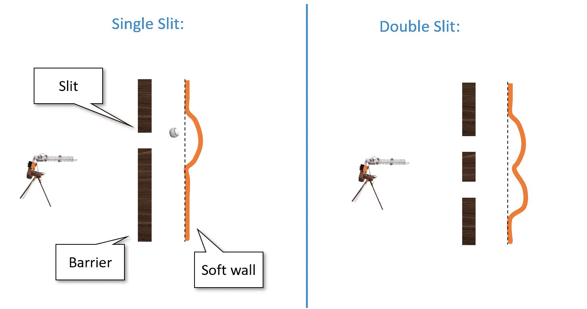
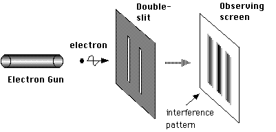
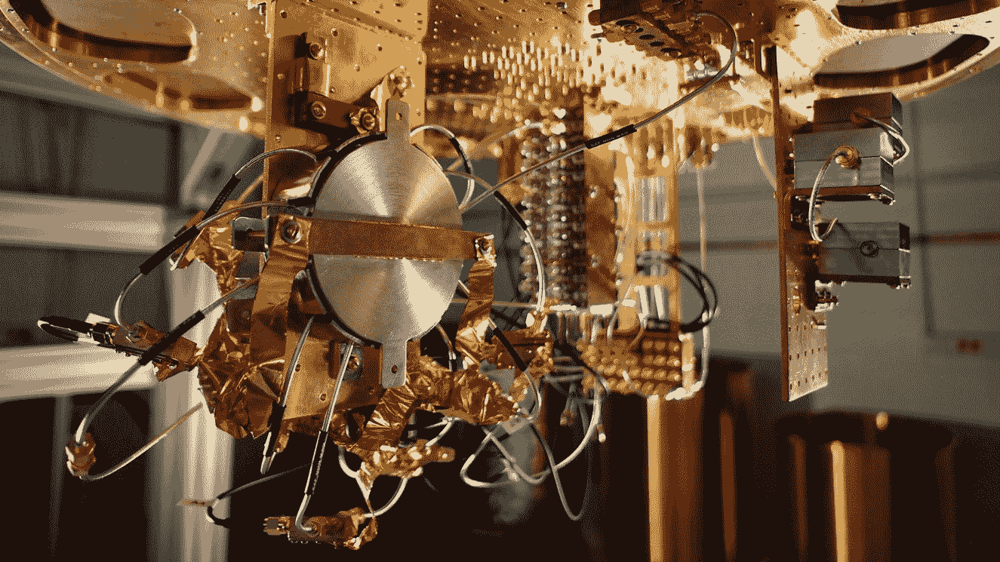

# 量子计算与密码学 I

> 原文：[`intensecrypto.org/public/lec_19_quantum.html`](https://intensecrypto.org/public/lec_19_quantum.html)

*发现任何错误/打字错误/令人困惑的解释？[在 GitHub 上打开一个 issue](https://github.com/boazbk/crypto/issues/new)。您也可以在下面评论*

**★ 另请参阅本章的[PDF 版本](https://files.boazbarak.org/crypto/lec_19_quantum.pdf)（更好的格式/参考文献）★

> *“我认为我可以安全地说，没有人真正理解量子力学。”* ，理查德·费曼，1965 年
> 
> *“概率经典世界与量子世界的方程式之间的唯一区别是，某种方式或另一种方式，似乎概率必须变成负数。”* ，理查德·费曼，1982 年

在古希腊，有两种自然哲学学派。*亚里士多德*认为物体具有一种*本质*，可以解释其行为，而关于自然世界的理论必须提到*原因*（或使用亚里士多德的语言，“最终原因”），以解释它们为什么表现出某些现象。*德谟克利特*相信世界的纯粹机械解释。在他看来，宇宙最终由基本粒子（或*原子*）组成，我们观察到的现象源于这些粒子之间根据某些局部规则相互作用。现代科学（可能从牛顿开始）接受了德谟克利特的观点，即一个由粒子及其相互作用力组成的机械或“时钟”宇宙。

尽管粒子和力的分类随着时间的推移而发展，但“大局”从牛顿到爱因斯坦并没有发生很大变化。特别是，人们认为一个公理是，如果我们完全知道宇宙当前的*状态*（即粒子及其属性，如位置和速度），那么我们就能在任何时间点预测其未来的状态。在计算语言中，在这些所有理论中，一个包含\(n\)个粒子的系统的状态可以存储在一个\(O(n)\)大小的数组中，预测系统的演化可以通过对这个数组运行一些高效的（例如，\(poly(n)\)时间）确定性计算来完成。

## 双缝实验

啊，在 20 世纪初，有几个实验结果开始质疑这个“时钟”或“台球”的世界理论。其中一个著名的实验就是[双缝实验](https://en.wikipedia.org/wiki/Double-slit_experiment)。这里有一种描述它的方法。假设我们买了一个那种棒球投球机，将其对准一个软塑料墙，但在机器和塑料墙之间放置一个*带有单缝的金属屏障*（见图 18.1）。如果我们向塑料墙投掷棒球，那么一些棒球会弹回金属屏障，而一些则会穿过缝隙并使墙凹下去。如果我们现在在金属屏障上再开一个额外的缝隙，那么更多的球会穿过，因此塑料墙会被*更严重地凹下去*。

18.1：“双棒球实验”中，我们从枪中向软墙射击棒球，通过一个有一个或两个缝隙打开的硬屏障。这里只有“建设性干涉”，即在两个缝隙都打开时，墙上的每个位置的凹痕是每个缝隙单独打开时凹痕的总和。

到目前为止，这纯粹是常识，而且据我所知，这确实是对我们向塑料墙投掷棒球时发生的事情的准确描述。然而，当我们向*光子*射击时，情况并非如此。令人惊讶的是，如果我们用“光子枪”（即激光）通过某个屏障向装有光子探测器的墙射击，那么（如图 18.2 所示）在墙的某些位置，当两个缝隙都打开时，我们会看到*更少的*击中次数，而只有一个缝隙打开时则更多！^(1)特别是，当第一个缝隙打开时会被击中，当第二个缝隙打开时也会被击中，但当两个缝隙都打开时却*完全不会被击中*。

18.2：光子或电子枪的双缝实验设置。我们还可以看到*破坏性干涉*，即在墙上有一些位置，当两个缝隙都打开时，比只有一个缝隙打开时得到的击中次数更少。图片来源：维基百科。

似乎每个从枪中出来的光子都知道实验的全局设置，并且当两个缝隙都打开时与只有一个缝隙打开时表现不同。如果我们试图“捕捉光子的行为”并在每个缝隙旁边放置一个探测器，以便我们可以看到每个光子的确切路径，那么会发生更奇怪的事情。仅仅测量路径的事实就改变了光子的行为，现在这种“破坏性干涉”模式消失了，当两个缝隙都打开时，某个位置被击中的次数是每个缝隙单独打开时被击中次数的总和。

你应该多次阅读上面的段落，并确保你真正理解这些结果有多么令人震惊。

## 量子振幅

双缝和其他实验最终迫使科学家接受一个非常反直觉的世界图景。这不仅仅是关于自然被随机化，而是关于某种意义上的概率“变为负数”并相互抵消！

为了理解我们所说的意思，让我们回到棒球实验。假设一个球通过左缝的概率是 \(p_L\)，通过右缝的概率是 \(p_R\)。那么，如果我们从每个枪中射出 \(N\) 个球，我们预计墙会被击中 \((p_L+p_R)N\) 次。相比之下，在光子的量子世界中，而不是棒球，有时可能会出现这样的情况：在第一种和第二种情况下，墙都会以正概率 \(p_L\) 和 \(p_R\) 分别被击中，但不知何故，当两个缝都打开时，墙（或墙上的特定位置）却完全未被击中。这几乎就像概率可以“相互抵消”一样。

为了理解我们在量子力学中如何建模这种方法，考虑一种“懒加载”方法来处理概率是有帮助的。我们可以将像通过两个不同缝射击棒球这样的概率实验以两种不同的方式来考虑：

+   当一个球被射出时，“自然”抛掷一枚硬币，决定它是否会通过左缝（以概率 \(p_L\) 发生），右缝（以概率 \(p_R\) 发生），或者反弹。如果它通过其中一个缝，那么它就会击中墙。后来我们可以查看墙，以确定这个事件是否发生，但事件是否发生的事实是独立于我们是否查看墙的。

+   另一种观点是，当一个球被射出时，“自然”像以前一样计算概率 \(p_L\) 和 \(p_R\)，但**还没有**“抛掷硬币”并确定发生了什么。只有当我们实际上查看墙时，自然才会抛掷硬币，并且以概率 \(p_L+p_R\) 确保我们看到一个凹痕。也就是说，自然使用“懒加载”方法，并且只有在决定**测量**时才确定概率实验的结果。

虽然第一种情况看起来更自然，但两种情况的结果都是相同的（墙被击中的概率是 \(p_L+p_R\)），因此，我们是否应该将自然建模为遵循第一种情况或第二种情况的问题，似乎是在询问森林里掉下一棵树，但没有人听到它的声音的谚语。

然而，当我们想要用光子而不是棒球来描述双缝实验时，第二种情况更适合量子推广。量子力学将一个称为*振幅*的数字 \(\alpha\) 与每个概率实验相关联。这个数字 \(\alpha\) 可以是*负数*，实际上甚至可以是*复数*。我们从未直接观察到振幅，因为每次我们用振幅 \(\alpha\) 测量事件时，自然界都会掷硬币，并确定事件发生的概率为 \(|\alpha|²\)。然而，振幅的符号（或在复数情况下，相位）会影响两个不同事件是否会产生*建设性*或*破坏性*的干涉。

具体来说，考虑一个可能发生也可能不发生的事件（例如，“探测器 17 被光子击中”）。在经典概率中，我们通过两个结果的概率分布来模拟这种情况：一对非负数 \(p\) 和 \(q\)，使得 \(p+q=1\)，其中 \(p\) 对应事件发生的概率，\(q\) 对应事件不发生的概率。在量子力学中，我们也通过一对数字来模拟这种情况，我们称之为*振幅*。这是一对（可能为负或甚至为复数）的数字 \(\alpha\) 和 \(\beta\)，使得 \(|\alpha|² + |\beta|² =1\)。事件发生的概率是 \(|\alpha|²\)，事件不发生的概率是 \(|\beta|²\)。孤立地看，这些负数或复数并不重要，因为我们无论如何都要将它们平方以获得概率。但是，正振幅和负振幅的相互作用可能导致令人惊讶的*抵消*，即在某些情况下，将两个事件发生概率为正的场景结合起来，结果却是一个事件永远不会发生。

如果你觉得上面的描述不令人困惑且不直观，那么你可能没有理解。请确保重新阅读上面的段落，直到你彻底困惑为止。

量子力学是一种数学理论，它使我们能够计算和预测双缝实验以及其他许多实验的结果。如果你把量子力学看作是对“世界真实发生”的解释，那么它可能会相当令人困惑。然而，如果你只是“闭嘴计算”，那么它在预测实验结果方面表现得非常出色。特别是在双缝实验中，对于墙壁上的任何位置，我们可以计算出 \(\alpha\) 和 \(\beta\) 这两个数，使得来自第一缝和第二缝的光子以 \(|\alpha|²\) 和 \(|\beta|²\) 的概率击中该位置。当我们打开两个缝时，击中该位置的概率与 \(|\alpha+\beta|²\) 成正比，因此，如果 \(\alpha=-\beta\)，那么即使当**任一**缝打开时都会被击中，当两个缝都打开时，该位置**根本不会被击中**。如果你对量子力学感到困惑，你并不孤单：几十年来，人们一直在尝试为量子力学背后的“基本现实”提出[解释](https://en.wikipedia.org/wiki/Interpretations_of_quantum_mechanics)，包括[玻姆力学](https://en.wikipedia.org/wiki/De_Broglie%E2%80%93Bohm_theory)、[多世界解释](https://en.wikipedia.org/wiki/Many-worlds_interpretation)以及其他。然而，这些解释中没有一个得到普遍接受，并且所有这些（按设计）都产生了相同的实验预测。因此，在这个阶段，许多科学家更愿意忽略“真正的现实”是什么的问题，而回到简单的“闭嘴计算”。

从振幅或“负概率”中产生的某些反直觉性质包括：

+   **干涉** - 正如我们所看到的，概率可以“相互抵消”。

+   **测量** - 概率在“没有人看”时是负的，当它们被**测量**时“坍缩”为正概率，这一观点令人深感不安。事实上，人们已经表明它可能导致各种奇怪的结果，例如“超距作用”，即我们可以在一个地方测量一个物体，并瞬间（比光速快）在远离的地方引起测量结果的差异。不幸的是（或者幸运的是？）这些奇怪的结果已经在实验中得到证实。

+   **纠缠** - 系统的两个部分以这种奇怪的方式连接在一起，即测量一个会影响到另一个，这种概念被称为**量子纠缠**。

再次，尽管这些概念看似反直觉，但它们已经在实验中得到证实，所以我们只能接受它们。

如果（像作者一样）你对复数感到有些畏惧，不要担心：你可以将所有振幅都视为 *实数*（尽管可能是 *负数*），而不会损失理解。量子计算的所有“魔法”在这个情况下已经出现，因此我们将在本章中经常限制关注到实振幅。

我们也将只讨论所谓的 *纯* 量子态，而不是更一般的 *混合* 态。纯态最终证明是理解量子计算算法方面足够的。

更普遍地说，本章的目的不是对量子力学、量子信息理论或量子计算进行完整描述，而是说明这些领域与经典计算的主要区别点。

### 量子计算与计算 - 执行摘要。

量子力学描绘世界的奇怪之处之一是，与台球球例不同，没有明显的算法可以在 \(poly(n,t)\) 步内模拟 \(n\) 个粒子在 \(t\) 个时间段的演化。事实上，模拟 \(n\) 个量子粒子的自然方式将需要指数级于 \(n\) 的步骤数。这对于实际需要做这些计算的科学家来说是一个巨大的头疼问题。

在 1981 年，物理学家理查德·费曼提出了“将这个柠檬变成柠檬水”的建议，通过以下几乎同义反复的观察：

> *如果一个物理系统不能在 \(T\) 步内被计算机模拟，那么这个系统可以被认为是在进行需要超过 \(T\) 步的计算*

因此，他问是否可以设计一个量子系统，使得其基于初始条件 \(x\) 的结果 \(y\) 是某个函数 \(y=f(x)\)，满足 **(a)** 我们不知道如何以任何其他方式高效计算，并且 **(b)** 确实有用.^(2) 1985 年，大卫·德什（David Deutsch）正式提出了量子图灵机的概念，这个模型自那时起在德什、约萨（Josza）和贝纳桑（Bernstein）以及瓦齐拉尼（Vazirani）的作品中得到了改进。这样的系统现在被称为 *量子计算机*。

一段时间内，这些假设的量子计算机似乎有两个用途。首先，提供一个通用的机制来模拟人们关心的各种真实量子系统。其次，作为对计算理论方法的一种挑战，即通过图灵机模型高效计算，尽管这种挑战在实践上影响不大，因为这种理论上的“额外能力”在人们实际想要解决的问题（如组合优化、机器学习、数据结构等）中似乎并没有带来多少优势。

在很大程度上，这一点至今仍然成立。我们没有确凿的证据表明，当量子计算机被建造出来时，它们将在 99%的计算应用中提供真正重大的优势^(3)。然而，有一个与密码学规模相当的例外：1994 年，彼得·肖尔(Peter Shor)表明，量子计算机可以在多项式时间内解决整数分解和离散对数问题。这一结果吸引了众多人的想象力，并极大地激发了量子计算研究。

这既是因为这些特定问题的难度为我们通信（以及这些天，我们的经济）的巨大部分提供了安全的基础，也是因为它是一个强有力的证明，表明量子计算机可能对那些在先验上似乎与量子物理无关的问题是有用的。

目前，有几种努力正在构建大规模量子计算机。可以说，在接下来的五年左右时间里，不会出现足够大的量子计算机来分解，比如说，一个\(1024\)位的数字。然而，已经建造了一些量子计算机，它们完成了既不是经典计算所知的任务，或者至少在经典计算中似乎需要比这些量子计算机更多的资源。何时以及是否会有这样的计算机能够破解 Diffie-Hellman、RSA 和椭圆曲线密码学的合理参数，这还是未知数。这也可能是一个“自我实现的预言”，即小型量子计算机的存在会导致每个人都转向基于格的密码学，这反过来又会减少投资建设大规模量子计算机所需的巨大资源的动机^(5)。

对于密码学家来说，上述总结可能就是你所需要了解的全部，以及足够的学习动力，正如我们在本课程中所做的那样，研究基于格的密码学。然而，由于量子计算是一个如此美丽且（像密码学一样）反直觉的概念，我们将尝试至少给出一些关于量子计算是什么以及肖尔算法是如何工作的线索。

## 量子 101

我们现在介绍量子信息中的一些基本概念。将这些概念与概率系统进行对比，并观察“负概率”如何产生影响是非常有用的。这次讨论相对简短。我在与阿罗拉合著的[书中](http://theory.cs.princeton.edu/complexity/)（见[此处草稿](http://theory.cs.princeton.edu/complexity/ab_quantumchap.pdf)）关于量子计算的章节是一个相对简短的资源，其中包含了我们在这里讨论的所有内容。还可以参考阿隆森的这篇[博客文章](http://www.scottaaronson.com/blog/?p=208)，其中对 Shor 算法进行了高层次解释，并附有链接到更多详细阐述。还可以参考阿隆森的[这堂讲座](http://www.scottaaronson.com/democritus/lec14.html)，其中对量子计算的可行性进行了深入讨论（阿隆森的[课程讲义](http://www.scottaaronson.com/democritus/default.html)和由此产生的[书籍](http://www.amazon.com/Quantum-Computing-since-Democritus-Aaronson/dp/0521199565)都是值得一读的佳作）。

**状态：** 我们将考虑一个简单的量子系统，该系统包含 \(n\) 个对象（例如，电子/光子/晶体管等），每个对象都可以处于“开启”或“关闭”状态——即每个对象可以编码一个单独的 *比特* 信息，但为了强调“量子性”，我们将它称为 *量子比特*。这样一个系统的 *概率分布* 可以描述为一个 \(2^n\) 维向量 \(v\)，其非负项之和为 \(1\)，其中对于每个 \(x\in\{0,1\}^n\)，\(v_x\) 表示系统处于状态 \(x\) 的概率。正如我们提到的，量子力学允许负概率（实际上甚至是复数概率），因此系统的 *量子状态* 可以描述为一个 \(2^n\) 维向量 \(v\)，使得 \(\|v\|² = \sum_x |v_x|² = 1\)。

**测量：** 假设我们处于经典概率设置中，并且 \(n\) 个比特仅仅是随机硬币。因此，我们可以用 \(2^n\) 维向量 \(v\) 来描述系统的 *状态*，其中对于所有 \(x\)，\(v_x=2^{-n}\)。如果我们 *测量* 系统并查看硬币的结果，我们将以 \(v_x\) 的概率得到值 \(x\)。自然地，如果我们测量系统两次，我们将得到相同的结果。因此，在我们看到硬币是 \(x\) 之后，系统的新的状态 *坍缩* 到一个向量 \(v\)，其中 \(v_y = 1\) 如果 \(y=x\)，而 \(v_y=0\) 如果 \(y\neq x\)。在量子状态下，我们做同样的事情：如果我们 *测量* 一个向量 \(v\)，它将以 \(|v_x|²\) 的概率将其转换为在坐标 \(x\) 上有 \(1\) 而在其他所有坐标上为零的向量。

**操作：** 在经典概率设置中，如果我们有一个处于状态 \(v\) 的系统，并应用某个函数 \(f:\{0,1\}^n\rightarrow\{0,1\}^n\)，那么这会将 \(v\) 转换为状态 \(w\)，使得 \(w_y = \sum_{x:f(x)=y} v_x\)。

另一种表述方式是，\(w=M_f\)，其中 \(M_f\) 是这样一个矩阵，对于所有 \(x\) 和所有其他项都是 \(0\)，使得 \(M_{f(x),x}=1\)。如果我们掷硬币，以概率 \(1/2\) 应用 \(f\)，以概率 \(1/2\) 应用 \(g\)，这对应于矩阵 \((1/2)M_f + (1/2)M_g\)。更一般地，我们可以将我们可以应用的运算集表示为所有此类矩阵的凸组合集——这仅仅是所有列之和为 \(1\) 的非负矩阵的集合——即*随机矩阵*。在量子情况下，我们可以应用于量子状态的运算编码为一个*单位矩阵*，这是一个矩阵 \(M\)，使得对于所有向量 \(v\)，\(\|Mv\|=\|v\|\)。

**基本操作：**当然，即使在概率设置中，并非每个函数 \(f:\{0,1\}^n\rightarrow\{0,1\}^n\) 都能高效计算。我们认为一个函数是高效可计算的，如果它由多项式数量的基本操作组成，这些操作涉及最多 \(2\) 或 \(3\) 位（即布尔*门*）。也就是说，我们说一个矩阵 \(M\) 是*基本的*，如果它只修改三个位。也就是说，\(M\) 是通过“提升”一些 \(8\times 8\) 矩阵 \(M'\)，该矩阵作用于三个位 \(i,j,k\)，而保留所有其他位。形式上，给定一个 \(8\times 8\) 矩阵 \(M'\)（由 \(\{0,1\}³\) 中的字符串索引），以及三个不同的索引 \(i<j<k \in \{1,\ldots,n\}\)，我们定义 \(M'\) 的*\(n\)-提升*，带有索引 \(i,j,k\)，为一个 \(2^n\times 2^n\) 矩阵 \(M\)，使得对于所有字符串 \(x\) 和 \(y\)，它们在所有坐标上除了可能 \(i,j,k\) 外都相同，\(M_{x,y}=M'_{x_ix_jx_k,y_iy_jy_k}\)，否则 \(M_{x,y}=0\)。注意，如果 \(M'\) 是某个函数 \(f:\{0,1\}³\rightarrow\{0,1\}³\) 的形式 \(M'_f\)，那么 \(M=M_g\)，其中 \(g:\{0,1\}^n\rightarrow\{0,1\}^n\) 定义为 \(g(x)=f(x_ix_jx_k)\)。我们定义 \(M\) 为一个*基本随机矩阵*或一个*概率门*，如果 \(M\) 等于某个随机 \(8\times 8\) 矩阵 \(M'\) 的 \(n\) 提升形式。量子情况类似：一个*量子门*是一个 \(2^n\times 2^n\) 矩阵，它是某个单位 \(8\times 8\) 矩阵 \(M'\) 的 \(N\) 提升形式。证明提升保持随机性和单位性是一个练习。也就是说，每个概率门都是一个随机矩阵，每个量子门都是一个单位矩阵。

**复杂度：** 对于每一个随机矩阵 \(M\)，我们可以定义其**随机复杂度**，记为 \(R(M)\)，为最小的数量 \(T\)，使得 \(M\) 可以通过组合 \(T\) 个基本概率门（approximately）获得。具体来说，我们可以定义 \(R(M)\) 为最小的 \(T\)，使得存在 \(T\) 个基本矩阵 \(M_1,\ldots,M_T\)，对于每一个 \(x\)，\(\sum_y |M_{y,x}-(M_T\cdots M_1)_{y,x}|<0.1\)。 (可以证明 \(R(M)\) 是有限的，并且实际上对于每一个 \(M\) 最多为 \(10^n\)；我们可以通过将 \(M\) 写作函数的凸组合，并将每个函数写作映射单个字符串 \(x\) 到 \(y\) 的函数的复合，同时保持所有其他输入不变来实现这一点。) 我们将说，一个将 \(\{0,1\}^n\) 上的分布映射到 \(\{0,1\}^n\) 上的分布的概率过程 \(M\) 是**高效经典可计算**的，如果 \(R(M) \leq poly(n)\)。如果 \(M\) 是一个幺正矩阵，那么我们定义 \(M\) 的**量子复杂度**，记为 \(Q(M)\)，为最小的数量 \(T\)，使得存在量子门 \(M_1,\ldots,M_T\)，对于每一个 \(x\)，\(\sum_y |M_{y,x}-(M_T \cdots M_1)_{y,x}|² < 0.1\)。

我们说 \(M\) 是**高效量子可计算**的，如果 \(Q(M)\leq poly(n)\)。

**计算函数：** 我们已经定义了操作符如何进行概率或量子高效计算的含义，但我们通常对计算某些函数 \(f:\{0,1\}^m\rightarrow\{0,1\}^\ell\) 感兴趣。想法是，我们说 \(f\) 是高效可计算的，如果相应的操作符是高效可计算的，除了我们还可以使用额外的内存，并将 \(f\) 嵌入某个 \(n=poly(m)\)。我们定义 \(f\) 为**高效经典可计算**的，如果存在某个 \(n=poly(m)\)，使得操作符 \(M_g\) 是高效经典可计算的，其中 \(g:\{0,1\}^n\rightarrow\{0,1\}^n\) 定义为 \(g(x_1,\ldots,x_n)=f(x_1,\ldots,x_m)\)。在量子情况下，由于操作符 \(M_g\) 不一定是幺正矩阵，所以我们有一个小的变化。因此，我们说 \(f\) 是**高效量子可计算**的，如果存在 \(n=poly(m)\)，使得操作符 \(M_q\) 是高效量子可计算的，其中 \(g:\{0,1\}^n\rightarrow\{0,1\}^n\) 定义为 \(g(x_1,\ldots,x_n) = x_1\cdots x_m \|( f(x_1\cdots x_m)0^{n-m-\ell}\; \oplus \; x_{m+1}\cdots x_n)\)。

**量子与经典计算：** 我们定义函数高效量子可计算的含义时，可能并不明显，如果 \(f:\{0,1\}^m\rightarrow\{0,1\}^\ell\) 是一个可以通过多项式大小的布尔电路（例如，组合多项式数量的 AND、OR 和 NOT 门）来计算的函数，那么它也是量子高效可计算的。其想法是，对于每一个门 \(g:\{0,1\}²\rightarrow\{0,1\}\)，我们可以定义一个 \(8\times 8\) 的幺正矩阵 \(M_h\)，其中 \(h:\{0,1\}³\rightarrow\{0,1\}³\) 的形式为 \(h(a,b,c)=a,b,c\oplus g(a,b)\)。因此，如果 \(f\) 有一个包含 \(s\) 个门的电路，那么我们可以为每个这样的门额外分配一个比特，然后依次运行相应的 \(s\) 个幺正操作，最终我们将会得到一个计算映射 \(x_1,\ldots,x_{m+\ell+s} = x_1\cdots x_m \| x_{m+1}\cdots x_{m+s} \oplus f(x_1,\ldots,x_m)\|g(x_1\ldots x_m)\) 的算子，其中 \(g(x_1,\ldots,x_n)\) 的第 \(\ell+i^{th}\) 位是应用 \(f(x_1,\ldots,x_m)\) 计算中的第 \(i^{th}\) 个门的结果。所以这“几乎”就是我们想要的，除了我们还有这些“额外垃圾”需要去除。其想法是，我们现在简单地再次运行相同的计算，这基本上意味着我们将另一个 \(g(x_1,\ldots,x_m)\) 的副本 XOR 到最后的 \(s\) 个比特上，但由于 \(g(x)\oplus g(x) = 0^s\)，我们得到我们计算映射 \(x \mapsto x_1\cdots x_m \| (f(x_1,\ldots,x_m)0^s \;\oplus\; x_{m+1}\cdots x_{m+\ell+s})\) 如所期望的那样。

**“显然指数级”谬误**：从先验的角度来看，量子计算可能看起来“显然”具有指数级的强大能力，因为要在 \(n\) 位上进行量子计算，我们需要维持 \(2^n\) 维的状态向量，并对其应用 \(2^n\times 2^n\) 的矩阵。的确，对量子计算的流行描述（过于）经常说，量子计算机与经典计算机的区别在于，经典比特可以是零或一，而量子比特可以同时处于这两种状态，因此，在许多量子比特中，量子计算机可以同时执行指数级的计算。根据你的解释，这种描述要么是错误的，要么同样适用于*概率计算*。然而，对于概率计算，如果 \(f:\{0,1\}^m\rightarrow\{0,1\}^n\) 是一个可高效计算的功能，那么它有一个多项式大小的 AND、OR 和 NOT 门的电路。7。此外，这种“显然”的模拟量子计算的方法不仅需要指数级的时间，还需要指数级的空间，而证明使用简单的递归公式可以用*多项式空间*（在物理学中这被称为“费曼路径积分”）来计算最终量子状态并不困难。因此，仅仅指数级长的向量描述本身并不意味着量子计算机具有指数级的强大能力。实际上，我们无法*证明*它们是这样的（因为特别是我们无法证明*每一个*多项式空间计算都可以在多项式时间内完成，在复杂性术语中，我们不知道如何排除 \(P=\ensuremath{\mathit{PSPACE}}\)），但我们确实有一些问题（整数分解最为突出）对于它们确实提供了相对于目前*已知*的最佳经典（确定性或概率）算法的指数级加速。

### 在物理上实现量子计算

要实现量子计算，需要创建一个包含 \(n\) 个独立二进制状态（即，“量子比特”）的系统，并且能够操纵这些量子比特中的两个或三个的小子集以改变其状态。虽然按照我们上面定义的操作，可能需要能够在这些两个或三个量子比特上执行任意幺正操作，但实际上有几种选择用于*通用集*——一个小的常数量门，可以生成所有其他门。最大的挑战是如何让系统不被测量并*坍缩*到单个经典状态组合。这有时被称为系统的*相干时间*。[阈值定理](https://courses.cs.washington.edu/courses/cse599d/06wi/lecturenotes19.pdf)表明，存在某个绝对常数的错误水平 \(\tau\)，如果错误以小于 \(\tau\) 的速率在每个门上产生，那么我们可以从这些错误中恢复过来并执行任意长时间的计算。（当然，有不同方式来模拟错误，因此实际上有与各种噪声模型相对应的几个阈值*定理*）。

已有几种建议用于构建量子计算机：

+   [超导量子计算机](https://arxiv.org/abs/1905.13641)使用超导电路进行量子计算。这些是目前拥有最多完全可控量子比特的设备。

+   在哈佛，Lukin 的小组正在使用[冷原子](https://lukin.physics.harvard.edu/arrays-cold-atoms)来实现量子计算机。

+   [捕获离子量子计算机](https://en.wikipedia.org/wiki/Trapped_ion_quantum_computer)使用离子的状态来模拟量子比特。在这些计算机上也取得了一些[最近进展](http://iontrap.umd.edu/wp-content/uploads/2016/02/1602.02840v1.pdf)。例如，一个捕获离子计算机被用来[实现 Shor 算法分解 15](http://arxiv.org/abs/1507.08852)。（结果证明 \(15=3\times 5\) :) )

+   [拓扑量子计算机](https://en.wikipedia.org/wiki/Topological_quantum_computer)使用不同的技术，设计上更稳定，但可能更难操作以创建量子计算机。

这些方法并不是相互排斥的，最终量子计算机可能通过结合所有这些方法来构建。目前，我们拥有大约 \(100\) 个量子比特的设备，每个门的错误率约为 \(1\%\)。这种受限的机器有时被称为“有噪声的中等规模量子计算机”或“NISQ”。参见[John Preskil 的这篇文章](https://arxiv.org/abs/1801.00862)，了解这类更受限设备的进展和应用。如果量子比特的数量增加，错误率降低一个或两个数量级，我们可能会看到更多应用。

18.3：谷歌的超导量子计算机原型。图片来源：谷歌 / 《麻省理工学院技术评论》。

### 括号表示法

由于许多原因，量子计算对许多人来说都非常令人困惑和反直觉。但还有一个“文化”原因，使得人们有时觉得量子论证难以理解。量子学家遵循他们自己特殊的[符号](https://en.wikipedia.org/wiki/Bra%E2%80%93ket_notation)来表示向量。许多非量子学家觉得它丑陋且令人困惑，而量子学家则暗自希望人们能经常使用它，而不仅仅是用于非量子线性代数，还包括餐厅账单和小学数学课程。

符号实际上并不那么令人困惑。如果 \(x\in\{0,1\}^n\)，那么 \(|x\rangle\) 表示 \(2^n\) 维度中的第 \(x\) 个标准基向量。也就是说，\( |x\rangle \) 是一个 \(2^n\) 维度的列向量，其在 \(x\) 坐标上为 \(1\)，其他地方为零。因此，我们可以将第 \(x\) 个条目为 \(\alpha_x\) 的列向量描述为 \(\sum_{x\in\{0,1\}^n} \alpha_x |x\rangle\)。另一个有用的符号是，如果 \(x\in\{0,1\}^n\) 且 \(y\in\{0,1\}^m\)，那么我们将 \(|x\rangle|y\rangle\) 与 \(|xy\rangle\) 等同（即，对应于 \(x\) 和 \(y\) 连接的坐标的 \(2^{n+m}\) 维向量，其他地方为零）。这基本上就是你需要了解的关于这个符号的所有内容，以便跟随这次讲座。（^(8）

量子门是对最多三个比特的操作，因此它可以完全由它对 \(8\) 个向量 \(|000\rangle,\ldots,|111\rangle\) 的作用来完全指定。量子态总是单位向量，所以我们有时为了方便省略归一化；例如，我们将状态 \(|0\rangle+|1\rangle\) 与其归一化版本 \(\tfrac{1}{\sqrt{2}}|0\rangle + \tfrac{1}{\sqrt{2}}|1\rangle\) 等同起来。

## 贝尔不等式

量子力学有一些奇怪的地方。在 1935 年，[爱因斯坦、波多尔斯基和罗森 (EPR)](http://plato.stanford.edu/entries/qt-epr/) 通过强调这一理论的一个先前未意识到的推论来试图确定这个问题。他们表明，自然在测量之前不决定实验结果的想法导致了所谓的“超距作用”。也就是说，对一个物体的测量可能瞬间影响宇宙另一端的另一个物体的状态（即振幅向量）。

由于振幅向量只是一个数学抽象，EPR 论文被认为仅仅是哲学家们关注的思维实验，而不涉及实验。这种情况在 1965 年发生了变化，当时约翰·贝尔展示了一个实际实验来测试 EPR 的预测，从而将直观的常识与量子力学对立起来。量子力学获胜：事实证明，实际上确实可以使用测量在彼此远离的对象的状态之间建立相关性，这是任何先前的理论都无法解释的。尽管如此，由于这些实验的结果对于任何坐过扶手椅的人来说都是如此明显地错误，因此仍然有一些 [贝尔否定者](http://www.scottaaronson.com/blog/?p=2464) 认为 这不可能为真，量子力学是错误的。

那么，什么是贝尔不等式呢？假设爱丽丝和鲍勃试图说服你他们有心灵感应能力，他们将通过以下实验来证明这一点。爱丽丝和鲍勃将分别待在两个封闭的房间里.^(9) 你将审问爱丽丝，你的同伴将审问鲍勃。你随机选择一个比特 \(x\in\{0,1\}\)，你的同伴随机选择一个 \(y\in\{0,1\}\)。我们让 \(a\) 是爱丽丝的回答，\(b\) 是鲍勃的回答。我们说如果 \(a \oplus b = x \wedge y\)，那么爱丽丝和鲍勃在这个实验中获胜。换句话说，如果 \(x=y=1\)，爱丽丝和鲍勃需要输出两个不同的比特，否则他们需要输出相同的比特.^(10)

现在如果爱丽丝和鲍勃没有心灵感应能力，那么他们需要事先商定某种策略。爱丽丝和鲍勃以 \(3/4\) 的概率成功并不难：只需总是输出相同的比特。此外，通过进行一些情况分析，我们可以证明无论他们使用什么策略，爱丽丝和鲍勃都不能以高于该概率的成功率获胜:^(11)

对于每一个两个函数 \(f,g:\{0,1\}\rightarrow\{0,1\}\)，\(\Pr_{x,y \in \{0,1\}}[ f(x) \oplus g(y) = x \wedge y] \leq 3/4\)。

由于概率是在所有四个 \(x,y \in \{0,1\}\) 的选择上取的，定理只有在存在两个函数 \(f,g\) 满足

\[f(x) \oplus g(y) = x \wedge y\]

对于所有 \(x,y \in \{0,1\}²\) 的四种选择。让我们将这些四个选择全部代入，看看我们会得到什么（以下我们使用等式 \(z \oplus 0 = z\)，\(z \wedge 0=0\) 和 \(z \wedge 1 = z\)）：

\[ \begin{aligned} f(0) &\oplus g(0) &= 0\;\;\;\; &(\text{将 } x=0,y=0 \text{ 代入}) \\ f(0) &\oplus g(1) &= 0\;\;\;\; &(\text{将 } x=0,y=1 \text{ 代入}) \\ f(1) &\oplus g(0) &= 0\;\;\;\; &(\text{将 } x=1,y=0 \text{ 代入}) \\ f(1) &\oplus g(1) &= 1\;\;\;\; &(\text{将 } x=1,y=1 \text{ 代入}) \end{aligned} \]

如果我们将第一个和第二个等式进行异或运算，我们得到 \(g(0) \oplus g(1) = 0\)，而如果我们对第三个和第四个等式进行异或运算，我们得到 \(g(0) \oplus g(1) = 1\)，从而得到一个矛盾。

一个令人惊讶的[实验验证](http://arxiv.org/abs/1508.05949)的事实是量子力学允许“心灵感应”。^(12) 具体来说，已经证明，利用量子力学的奇怪性，爱丽丝和鲍勃实际上有一个策略，在这个游戏中成功的概率大于 \(3/4\)（实际上，他们成功的概率大约为 \(0.85\)，见引理 18.3)。

## 贝尔的不等式分析

现在我们已经建立了符号，我们可以展示爱丽丝和鲍勃在贝尔游戏中展示“量子心灵感应”的策略。回想一下，在经典情况下，爱丽丝和鲍勃在“贝尔游戏”中成功的概率最多为 \(3/4 = 0.75\)。我们现在表明量子力学允许他们至少以 \(0.8\) 的概率成功.^(13)

存在一个 2 量子比特量子态 \(\psi\in \mathbb{C}⁴\)，如果爱丽丝可以访问 \(\psi\) 的第一个量子比特，可以操纵和测量它，并输出 \(a\in \{0,1\}\)，鲍勃可以访问 \(\psi\) 的第二个量子比特，可以操纵和测量它，并输出 \(b\in \{0,1\}\)，那么 \(\Pr[ a \oplus b = x \wedge y ] \geq 0.8\)。

爱丽丝和鲍勃将首先准备一个处于状态的 2 量子比特量子系统

\[\psi = \tfrac{1}{\sqrt{2}}|00\rangle + \tfrac{1}{\sqrt{2}}|11\rangle\]

（这种状态被称为[爱因斯坦-波多尔斯基-罗森对](https://en.wikipedia.org/wiki/EPR_paradox)）。爱丽丝将系统的第一个量子比特带到她的房间，鲍勃将量子比特带到他的房间。现在，当爱丽丝接收到 \(x\) 时，如果 \(x=0\) 她什么都不做，如果 \(x=1\) 她将对她的量子比特应用单位算符 \(R_{-\pi/8}\)，其中 \(R_\theta = \begin{pmatrix} cos \theta & -\sin \theta \\ \sin \theta & \cos \theta \end{pmatrix}\) 是对应于平面内旋转角度 \(\theta\) 的单位算符。当鲍勃接收到 \(y\) 时，如果 \(y=0\) 他什么都不做，如果 \(y=1\) 他将对他的量子比特应用单位算符 \(R_{\pi/8}\)。然后他们各自测量他们的量子比特并将这些作为他们的响应。

回想一下，为了赢得游戏，鲍勃和爱丽丝希望他们的输出在 \(x=y=1\) 时更有可能不同，在其他情况下更有可能一致。我们将分析分为四种可能的 \(x\) 和 \(y\) 值的每一种情况。

**情况 1: \(x=0\) 和 \(y=0\)**。如果 \(x=y=0\)，则状态不会改变。* 因为状态 \(\psi\) 与 \(|00\rangle + |11\rangle\) 成正比，鲍勃和爱丽丝的测量将始终一致（如果爱丽丝测量 \(0\)，则状态坍缩到 \(|00 \rangle\)，因此鲍勃也测量 \(0\)，同样适用于 \(1\)）。因此，在 \(x=y=1\) 的情况下，爱丽丝和鲍勃总是获胜。

**情况 2: \(x=0\) 和 \(y=1\).** 如果 \(x=0\) 和 \(y=1\)，那么在 Alice 测量她的比特之后，如果她得到 \(0\)，则系统会塌缩到状态 \(|00 \rangle\)，在这种情况下，Bob 执行他的旋转后，他的量子比特将处于状态 \(\cos (\pi/8)|0\rangle+\sin(\pi/8)|1\rangle\)。因此，当 Bob 测量他的量子比特时，他将得到 \(0\)（因此与 Alice 达成一致）的概率是 \(\cos² (\pi/8) \geq 0.85\)。同样地，如果 Alice 得到 \(1\)，则系统会塌缩到 \(|11 \rangle\)，在这种情况下，旋转后 Bob 的量子比特将处于状态 \(-\sin (\pi/8)|0\rangle+\cos(\pi/8)|1\rangle\)，因此他再次会以概率 \(\cos²(\pi/8)\) 与 Alice 达成一致。

对于 **情况 3** 的分析，其中 \(x=1\) 和 \(y=0\)，与情况 2 完全类似。因此，在这种情况下 Alice 和 Bob 也会以概率 \(\cos²(\pi/8)\) 达成一致.^(14)

**情况 4: \(x=1\) 和 \(y=1\).** 对于 \(x=1\) 和 \(y=1\) 的情况，在 Alice 和 Bob 都执行了他们的旋转之后，状态将成比例于

\[R_{-\pi/8}|0\rangle R_{\pi/8}|0 \rangle + R_{-\pi/8}|1\rangle R_{\pi/8}|1 \rangle \;. \;\;(18.1)\]

直观上，因为我们旋转一个状态 45 度，另一个状态 -45 度，它们将相互正交，测量将表现得像独立的抛硬币，以概率 1/2 达成一致。然而，为了完整性，我们现在展示完整的计算。

展开系数并使用 \(\cos(-x)=\cos(x)\) 和 \(\sin(-x)=-\sin(x)\)，我们可以看到 方程 18.1 成比例于

\[ \begin{aligned} \cos²(\pi/8)|00 \rangle &+ \cos(\pi/8)\sin(\pi/8)|01 \rangle \\ - \sin(\pi/8)\cos(\pi/8)|10\rangle &+ \sin²(\pi/8)|11 \rangle \\ - \sin²(\pi/8)|00 \rangle &+ \sin(\pi/8)\cos(\pi/8)|01 \rangle \\ - \cos(\pi/8)\sin(\pi/8)|10\rangle &+ \cos²(\pi/8)|11 \rangle \;. \end{aligned} \]

使用三角恒等式 \(2\sin(\alpha)\cos(\alpha)= \sin(2\alpha)\) 和 \(\cos²(\alpha) - \sin²(\alpha) = \cos(2\alpha)\)，我们可以看到得到 \(|00\rangle,|10\rangle,|01\rangle,|11\rangle\) 中的任何一个的概率成比例于 \(\cos(\pi/4)=\sin(\pi/4)=\tfrac{1}{\sqrt{2}}\)。因此，对于 \((a,b)\) 的四种选择都是等可能的，这意味着在这种情况下 \(a=b\) 的概率是 \(0.5\).

将所有四种情况综合考虑，赢得游戏的总体概率至少是 \(\tfrac{1}{4}\cdot 1 + \tfrac{1}{2}\cdot 0.85 + \tfrac{1}{4} \cdot 0.5 =0.8\).

理解量子力学中是什么使得贝尔不等式有了这样的增益是有益的。为此，考虑以下类似于爱丽丝和鲍勃的概率策略。他们同意，如果他们得到 \(0\) 作为输入，则每个人输出 \(0\)；如果他们得到 \(1\) 作为输入，则以概率 \(p\) 输出 \(1\)。在这种情况下，可以看到他们的成功概率将是 \(\tfrac{1}{4}\cdot 1 + \tfrac{1}{2}(1-p)+\tfrac{1}{4}[2p(1-p)]=0.75 -0.5p² \leq 0.75\)。我们上面描述的量子策略可以看作是参数 \(p\) 设置为 \(\sin² (\pi/8)=0.15\) 的概率策略的变体。但在 \(x=y=1\) 的情况下，我们不同意的情况的概率不是 \(2p(1-p)=1/4\)，因为我们可以在量子世界中使用这些负概率，并沿相反方向旋转状态，因此不同意的情况的概率最终是 \(\sin² (\pi/4)=0.5\)。

## 格罗弗算法

我们将在下一节课中看到的肖尔算法是一个惊人的成就，但它只适用于非常特定的问题。它似乎与破解 AES、基于格的密码学或与量子计算完全不相关的问题（如调度、约束满足、旅行商等）无关。事实上，对于这些搜索问题的最一般形式，在经典情况下，我们不知道如何做得比穷举搜索更好，穷举搜索在 \(n\) 位域上需要 \(2^n\) 的时间。莱夫·格罗弗表明，量子计算机可以在这种穷举搜索上获得二次改进，以 \(2^{n/2}\) 的时间解决 SAT 问题。格罗弗算法对密码学的影响相对温和：本质上需要将对称原语的关键长度加倍。但超出密码学，如果大规模量子计算机最终被建造，格罗弗搜索及其变体可能最终成为他们将要解决的最有用的计算问题之一。格罗弗定理如下：

**定理（格罗弗搜索，1996）：** 存在一个量子 \(O(2^{n/2}poly(n))\) 时间算法，给定一个 \(poly(n)\) 大小的电路计算函数 \(f:\{0,1\}^n\rightarrow\{0,1\}\)，输出一个字符串 \(x^*\in\{0,1\}^n\)，使得 \(f(x^*)=1\)。

**证明概要：** 证明并不难，但我们在这里只做简要说明。一般思路可以通过存在单个 \(x^*\) 满足 \(f(x^*)=1\) 的情况来阐述。（这是一个从一般情况到该问题的经典化简。）与西蒙算法类似，我们可以有效地初始化一个 \(n\) 个量子比特的系统到均匀状态 \(u = 2^{-n/2}\sum_{x\in\{0,1\}^n}|x\rangle\)，该状态与 \(|x^*\rangle\) 的点积为 \(2^{-n/2}\)。当然，如果我们测量 \(u\)，我们只有概率 \((2^{-n/2})² = 2^{-n}\) 获得值 \(x^*\)。我们的目标将是使用 \(O(2^{n/2})\) 次对或 acles 的调用，将系统转换到与状态 \(|x^*\rangle\) 至少有某个常数 \(\epsilon>0\) 点积的状态 \(v\)。

证明使用 \(Had\) 可以高效地计算单位算符 \(U\)，使得 \(Uu = u\) 和对于每个与 \(u\) 正交的 \(v\)，\(Uv = -v\)，是一个练习。此外，使用 \(f\) 的电路，我们可以高效地计算单位算符 \(U^*\)，使得对于所有 \(x\neq x^*\)，\(U^*|x\rangle=|x\rangle\)，而对于 \(U^*|x^*\rangle=-|x^*\rangle\)。结果发现，对 \(u\) 应用 \(\ensuremath{\mathit{UU}}^*\) \(O(2^{n/2})\) 次会产生一个与 \(|x^*\rangle\) 的内积为 \(\Omega(1)\) 的向量 \(v\)。为了理解为什么，考虑这些算符在由 \(u\) 和 \(|x^*\rangle\) 张成的二维线性子空间中的行为。（注意，初始状态 \(u\) 在这个子空间中，并且我们的所有算符都保持这个属性。）设 \(u_\perp\) 是在这个子空间中与 \(u\) 正交的单位向量，设 \(x^*_\perp\) 是在这个子空间中与 \(|x^*\rangle\) 正交的单位向量。限制在这个子空间中，\(U^*\) 是沿 \(x^*_\perp\) 轴的反射，\(U\) 是沿 \(u\) 轴的反射。

现在，设 \(\theta\) 为 \(u\) 和 \(x^*_\perp\) 之间的角度。这两个向量非常接近，因此 \(\theta\) 非常小但不为零——它等于 \(\sin^{-1}( 2^{-n/2})\)，这大约是 \(2^{-n/2}\)。现在，如果我们的状态 \(v\) 与 \(u\) 的角度 \(\alpha \geq 0\)，那么只要 \(\alpha\) 不太大（比如说 \(\alpha<\pi/8\))，这意味着 \(v\) 与 \(x^*_\perp\) 的角度是 \(u+\theta\)。这意味着 \(U^*v\) 与 \(x^*_\perp\) 的角度是 \(-\alpha-\theta\) 或与 \(u\) 的角度是 \(-\alpha-2\theta\)，因此 \(\ensuremath{\mathit{UU}}^*v\) 与 \(u\) 的角度是 \(\alpha+2\theta\)。因此，在 \(\ensuremath{\mathit{UU}}^*\) 的一次应用中，我们从 \(u\) 移动了 \(2\theta\) 弧度，在 \(O(2^{-n/2})\) 步中，\(u\) 和我们的状态之间的角度至少是某个常数 \(\epsilon>0\)。由于我们生活在由 \(u\) 和 \(|x\rangle\) 张成的二维空间中，这意味着我们的状态和 \(|x\rangle\) 的点积也将至少是某个常数。QED

1.  一段关于双缝实验的精美插图描述出现在[这个视频](https://www.youtube.com/watch?v=DfPeprQ7oGc)中。

    ↩

1.  正如其标题所暗示的，费曼的[讲座](https://www.cs.berkeley.edu/~christos/classics/Feynman.pdf)实际上关注的是用计算机模拟物理学的另一面，但他提到这只是一个“附带评论”，人们可以思考是否可能用一种新型的计算机来模拟物理学——一种“量子计算机”，它“[不会]是图灵机，而是一种不同类型的机器”。据我所知，费曼并没有建议这种计算机可以用于完全超出量子模拟领域的计算，而且实际上他认为量子力学能否被经典计算机模拟这个问题更有趣。

    ↩

1.  我使用理论家将“显著”与“超多项式”混淆的定义。正如我们将看到的，Grover 算法确实在计算上提供了非常通用的**二次**优势。这种二次优势是否足够在实际中抵消构建量子计算机的显著开销，仍然是一个悬而未决的问题。我们也没有证据表明超多项式加速**不能**在某些问题（除分解/Dlog 或量子模拟领域之外）中实现，并且至少有[一家公司](http://www.dwavesys.com/)正在押注这种加速实际上是可行的。

    ↩

1.  这“99%”是一个修辞手法，但并非完全如此。似乎对于许多网络服务器来说，TLS 协议（基于当前的非格点系统，量子计算将使其完全失效）大约占 CPU 使用率的 1%[（https://goo.gl/Gekjrc）]。

    ↩

1.  当然，鉴于“出口级”加密（本应在 20 世纪 90 年代消失）[花费了很长时间才消失](http://blog.cryptographyengineering.com/2016/03/attack-of-week-drown.html)，我想我们仍然会在每个人都拥有量子笔记本电脑时运行 1024 位 RSA 产品。

    ↩

1.  验证对于每一个 \(g:\{0,1\}^n\rightarrow\{0,1\}^n\)，\(M_g\) 是幺正的当且仅当 \(g\) 是一个排列，这是一个很好的练习。

    ↩

1.  如果 \(M\) 是一个概率过程，且 \(R(M) \leq T\)，那么存在一个大小约为 \(100 T n²\) 的概率电路，可以近似计算 \(M\)，即对于每个输入 \(x\)，\(\sum_{y\in\{0,1\}^n} \left| \Pr[C(x)=y] - M_{x,y} \right| < 1/3\)，这是一个很好的练习。

    ↩

1.  如果你好奇，对于**行向量**有一个类似的对偶表示法 \(\langle x|\)。一般来说，如果 \(u\) 是一个向量，那么 \(|u\rangle\) 将是其列向量的形式，而 \(\langle u|\) 将是其行积的形式。因此，由于 \(u^\top v = \langle u,v \rangle\)，\(u\) 和 \(b\) 的内积可以被认为是 \(\langle u||v\rangle\)。**外积**（其 \(i,j\) 项是 \(u_iv_j\) 的矩阵）表示为 \(|u\rangle\langle v|\)。

    ↩

1.  如果你极度担心爱丽丝和鲍勃互相通信，你可以与你的助手协调，确保实验在完全相同的时间进行，并确保房间足够远（例如，位于两个不同的洲，或者甚至一个在月球上，另一个在地球上），这样即使他们以光速通信，爱丽丝和鲍勃也无法及时互相告知各自硬币的结果。

    ↩

1.  这种形式的 Bell 游戏是由 [Clauser, Horne, Shimony, and Holt](https://goo.gl/wvJGZU) 展示的。

    ↩

1.  定理 18.2 以下假设爱丽丝和鲍勃分别使用**确定性**策略 \(f\) 和 \(g\)。更一般地，爱丽丝和鲍勃可以使用**随机化**策略，或者等价地，他们各自可以从某些**分布** \(\mathcal{F}\) 和 \(\mathcal{G}\) 中选择 \(f\) 和 \(g\)。然而，**平均原理** (?? ??) 表明，如果所有可能的确定性策略的成功概率最多为 \(3/4\)，那么对于所有随机化策略也是如此。

    ↩

1.  更准确地说，要么放弃对宇宙的“台球球”理论，要么相信心灵感应（信不信由你，一些科学家选择了[后者](https://en.wikipedia.org/wiki/Superdeterminism)）。

    ↩

1.  我们展示的策略并不是最好的。实际上，爱丽丝和鲍勃可以以概率 \(\cos²(\pi/8) \sim 0.854\) 成功。

    ↩

1.  我们使用（不太难）的观察，即这个实验的结果与爱丽丝和鲍勃应用旋转和测量的顺序无关。

    ↩

## 注释

注释发布在 [GitHub 仓库](https://github.com/boazbk/crypto/issues) 上，使用 [utteranc.es](https://utteranc.es) 应用程序。需要 GitHub 登录才能发表评论。如果您不想授权应用程序代表您发表评论，您也可以直接在 [GitHub 上的此页面问题](https://github.com/boazbk/crypto/issues?q=Quantum%20computing%3Atitle) 上发表评论。

编译于 2021 年 11 月 17 日 22:36:22

版权所有 2021，Boaz Barak。

本作品受 [Creative Commons Attribution-NonCommercial-NoDerivatives 4.0 国际许可协议](https://creativecommons.org/licenses/by-nc-nd/4.0/) 许可。

使用 [pandoc](https://pandoc.org/) 和 [panflute](http://scorreia.com/software/panflute/) 以及从 [gitbook](https://www.gitbook.com/) 和 [bookdown](https://bookdown.org/) 提取的模板生成。
