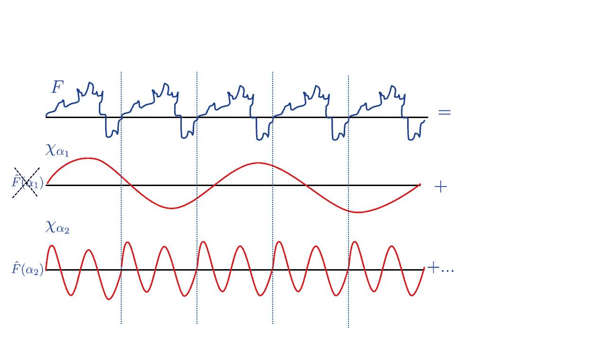

# 量子计算与密码学 II

> 原文：[`intensecrypto.org/public/lec_20_quantum_part2.html`](https://intensecrypto.org/public/lec_20_quantum_part2.html)

*如有任何错误/打字错误/令人困惑的解释，请[在 GitHub 上打开一个问题](https://github.com/boazbk/crypto/issues/new)。您也可以在下面评论*

**★ 另请参阅本章的 [**PDF 版本**](https://files.boazbarak.org/crypto/lec_20_quantum_part2.pdf)（更好的格式/参考文献）★

贝尔不等式是量子力学中存在某种非常奇怪现象的有力证明。但这种“奇怪”是否对解决与量子系统无关的计算问题有任何帮助？直观上，人们可能会猜测答案是*否*。1994 年，彼得·肖尔（Peter Shor）表明，人们是错误的：

将整数 $m$ 映射到其素数分解的映射可以高效地进行量子计算。具体来说，它可以使用 $O(\log³ m)$ 个量子门来计算。

这比我们之前提到的最佳已知经典算法有指数级的改进，这些算法大约需要 $2^{\tilde{O(\log^{1/3}m)}}$ 的时间。

我们现在将概述 Shor 算法背后的思想。实际上，Shor 证明了以下更一般的定理：

存在一个量子多项式时间算法，给定一个乘法阿贝尔群 $\mathbb{G}$ 和元素 $g \in \mathbb{G}$，计算该群中 $g$ 的*阶*。

回想一下，$g$ 在 $\mathbb{G}$ 中的阶是最小的正整数 $a$，使得 $g^a = 1$。当我们说“给定一个群”时，我们的意思是我们可以将群元素表示为长度为 $O(\log |\mathbb{G}|)$ 的字符串，并且存在一个 $poly(\log|\mathbb{G}|)$ 算法来执行群中的乘法。

## 从求序到分解和离散对数

求序问题不仅允许在多项式时间内分解整数，还可以解决任意阿贝尔群上的离散对数，从而表明量子计算机将不仅破坏 RSA，还会破坏 Diffie-Hellman 和椭圆曲线密码学。我们仅概述如何将分解和离散对数问题简化为求序问题：（参见上述部分来源以获取完整细节）

+   对于**分解**，让我们限制在 $m=pq$ 的情况下，其中 $p$ 和 $q$ 是不同的。回想一下，我们展示了找到群 $\Z^*_m$ 的大小 $(p-1)(q-1)=m-p-q+1$ 足以恢复 $p$ 和 $q$。可以证明，如果我们从 $\Z^*_m$ 中随机选择几个 $x$ 并计算它们的阶，这些阶的最小公倍数很可能是群的大小。

+   对于群 $\mathbb{G}$ 中的**离散对数**，如果我们得到 $X=g^x$ 并需要恢复 $x$，我们可以计算形式为 $X^ag^b$ 的各种元素的阶。这样一个元素的阶是一个满足 $c(xa+b) = 0 \pmod{|\mathbb{G}|}$ 的数 $c$。同样，通过几个随机示例，我们将得到一个非平凡示例（其中 $c \neq 0 \pmod{|\mathbb{G}|}$）并能够恢复未知的 $x$。

## 寻找函数的周期：Simon 算法

设 $\mathbb{H}$ 是某个阿贝尔群，其群运算我们将表示为 $\oplus$，$f$ 是将 $\mathbb{H}$ 映射到任意集合（我们可以将其编码为 $\{0,1\}^*$）的某个函数。我们说 $f$ 对于某个 $h^*\in\mathbb{H}$ 有 *周期 $h^*$*，如果对于 $\mathbb{H}$ 中的每个 $x,y$，当且仅当 $y = x \oplus kh^*$（对于某个整数 $k$）时，$f(x)=f(y)$。注意，如果 $\mathbb{G}$ 是某个阿贝尔群，那么如果我们定义 $\mathbb{H}=\Z_{|\mathbb{G}|}$，对于 $\mathbb{G}$ 中的每个元素 $g$，映射 $f(a)=g^a$ 是 $\mathbb{H}$ 上的一个周期映射，其周期为 $g$ 的阶。因此，找到元素的阶归结为找到函数的周期的问题。

我们通常如何找到函数的周期？让我们考虑最简单的情况，其中 $f$ 是一个从 $\R$ 到 $\R$ 的函数，对于某个数 $h^*$，它是 $h^*$ 周期的，即 $f$ 在区间 $[0,h^*]$，$[h^*,2h^*]$，$[2h^*,3h^*]$ 等上重复自己。我们如何找到这个数 $h^*$？关键思想是将 $f$ 从 *时间* 域转换到 *频率* 域。也就是说，我们使用 *傅里叶变换* 将 $f$ 表示为波函数的和。在这种表示中，能够整除周期 $h^*$ 的波长会获得显著的质量，而那些不能的波长则可能“相互抵消”。

12.1: 如果 $f$ 是一个周期函数，那么当我们用傅里叶变换表示它时，我们期望对应于不能整除周期的波长的系数非常小，因为它们往往会“相互抵消”。

同样，Shor 算法背后的主要思想是使用一个称为 *量子傅里叶变换* 的工具，给定一个计算函数 $f:\mathbb{H}\rightarrow\R$ 的电路，在约 $\log |\mathbb{H}|$ 个量子比特（因此维度 $|\mathbb{H}|$）上创建一个量子态，该量子态对应于 $f$ 的傅里叶变换。因此，当我们测量这个状态时，我们得到一个概率与相应傅里叶系数的平方成正比的群元素 $h$。可以证明，如果 $f$ 是 $h^*$ 周期的，那么我们可以从这个分布中恢复 $h^*$。

Shor 对某个 $q$ 的群 $\mathbb{H}=\Z^*_q$ 实施了这种方法，但我们将从使用异或操作的群 $\mathbb{H} = \{0,1\}^n$ 开始来观察这一点。这种情况被称为 *Simon 算法*（由 Dan Simon 在 1994 年提出）并且实际上先于（并启发了）Shor 算法：

如果 $f:\{0,1\}^n\rightarrow\{0,1\}^*$ 是多项式时间内可计算的，并且满足 $f(x)=f(y)$ 当且仅当 $x\oplus y = h^*$ 的性质，那么存在一个量子多项式时间算法，该算法输出一个随机的 $h\in \{0,1\}^n$，使得 $\langle h,h^* \rangle=0 \pmod{2}$。

注意，给定 $O(n)$ 个这样的样本，我们可以通过解决相应的线性方程以高概率恢复 $h^*$。

设 $\ensuremath{\mathit{HAD}}$ 是对应于一个量子比特操作 $|0\rangle \mapsto \tfrac{1}{\sqrt{2}}(|0\rangle+|1\rangle)$ 和 $|1\rangle \mapsto \tfrac{1}{\sqrt{2}}(|0\rangle-|1\rangle)$ 或 $|a\rangle\mapsto \tfrac{1}{\sqrt{2}}(|0\rangle+(-1)^a|1\rangle)$ 的 $2\times 2$ 单位矩阵。给定状态 $|0^{n+m\rangle}$，我们可以将这个映射应用于前 $n$ 个量子比特中的每一个，得到状态 $2^{-n/2}\sum_{x\in\{0,1\}^n}|x\rangle|0^m\rangle$，然后我们可以应用 $f$ 的门来将这个状态映射到 $2^{-n/2}\sum_{x\in\{0,1\}^n}|x\rangle|f(x)\rangle$。现在假设我们再次将这个操作应用于前 $n$ 个量子比特，那么我们得到状态 $2^{-n}\sum_{x\in\{0,1\}^n}\prod_{i=1}^n(|0\rangle+(-1)^{x_i}|1\rangle)|f(x)\rangle$。如果我们展开每一个这样的乘积并查看所有 $2^n$ 个选择 $y\in\{0,1\}^n$（其中 $y_i=0$ 对应于选择 $|0\rangle$，$y_i=1$ 对应于选择 $|1\rangle$ 在第 $i$ 个乘积中），我们得到 $2^{-n}\sum_{x\in\{0,1\}^n}\sum_{y\in\{0,1\}^n}(-1)^{\langle x,y \rangle}|y\rangle|f(x)\rangle$。现在根据我们的假设，对于 $f$ 的像中的每一个特定的 $z$，存在恰好两个前像 $x$ 和 $x\oplus h^*$，使得 $f(x)=f(x+h^*)=z$。所以，如果 $\langle y,h^* \rangle=0 \pmod{2}$，我们得到 $(-1)^{\langle x,y \rangle}+(-1)^{\langle x,y+h^* \rangle}=2$，否则我们得到 $(-1)^{\langle x,y \rangle}+(-1)^{\langle x,y+h^* \rangle}=0$。因此，如果我们测量状态，我们将得到一对 $(y,z)$，使得 $\langle y,h^* \rangle=0 \pmod{2}$。QED

西蒙算法似乎真正使用了群 $\{0,1\}^n$ 的特殊位结构，因此人们可能会想知道它对于某些指数级大的 $m$ 的群 $\Z^*_m$ 是否有任何相关性。结果是，支撑着众所周知的快速傅里叶变换（FFT）算法的相同洞察力可以用来基本上遵循这个群相同的策略。

## 从西蒙到肖尔

（注意：这里的表述是从我的教科书中的量子计算章节改编的，与阿罗拉合著。）

现在我们描述如何实现寻找阶数的肖尔算法。我们不会对一般群进行操作，而是专注于某个数 $\ell$ 的群 $\Z^*_{\ell}$，这对于整数分解和模素数的离散对数问题是有兴趣的情况。

即，我们证明以下定理：

对于每一个 $\ell$ 和 $\Z^*_\ell$ 中的 $a$，存在一个量子 $poly(log \ell)$ 算法来找到 $a$ 在 $\Z^*_\ell$ 中的阶数。

这个想法与西蒙算法类似。我们考虑映射 $x \mapsto a^x (\mod \ell)$，这是一个在 $\Z_m$ 上的周期映射，其中 $m=|\Z^*_\ell|$，周期是 $a$ 的阶数。

为了找到这个映射的周期，我们现在需要在群 $\Z_m$ 上执行一个 *量子傅里叶变换 (QFT)* 而不是在 $\{0,1\}^n$ 上。这是一个量子算法，它将一个寄存器从某个任意状态 $f \in \mathbb{C}^{m}$ 转换为状态，其向量是 $f$ 的傅里叶变换 $\hat{f}$。QFT 只需要 $O(\log² m)$ 个基本步骤，因此非常高效。注意，我们不能说这个算法“计算”傅里叶变换，因为变换存储在状态的振幅中，如前所述，量子力学没有提供“读取”振幅本身的方法。从量子状态获取信息的唯一方法是通过 *测量* 它，这会产生一个与振幅相关的概率的单个基态。这几乎不能代表整个傅里叶变换向量，但有时（如 Shor 算法的情况）这足以获得高度非平凡的信息，而我们不知道如何使用经典（非量子）计算机获得这些信息。

### $\Z_m$ 上的傅里叶变换

我们现在定义在 $\Z_m$（$\{0,\ldots,m-1\}$ 中整数的加法模 $m$ 的群）上的傅里叶变换。我们给出一个针对当前上下文专门化的定义。对于每个向量 $f\in\mathbb{C}^m$，$f$ 的傅里叶变换是向量 $\hat{f}$，其中 $\hat{f}$ 的 $x^{th}$ 坐标定义为^(1)。

$\hat{f}(x) = \tfrac{1}{\sqrt{m}}\sum_{y\in\Z_m} f(x)\omega^{xy}$

其中 $\omega = e^{2\pi i/m}$。

傅里叶变换只是 $f$ 在 *傅里叶基* $\{ \chi_x \}_{x \in \Z_m}$ 中的表示，其中 $\chi_x$ 是其 $y^{th}$ 坐标为 $\tfrac{1}{\sqrt{m}\omega^{xy}}$ 的向量/函数。现在，在这个基中任意两个向量 $\chi_x,\chi_z$ 的内积等于

$$\langle \chi_x,\chi_z \rangle = \tfrac{1}{m}\sum_{y\in\Z_m} \omega^{xy} \overline{\omega^{zy}} = \tfrac{1}{m}\sum_{y\in\Z_m} \omega^{(x-z)y} \;.$$但如果是 $x=z$，则 $\omega^{(x-z)}=1$，因此这个和等于 $1$。另一方面，如果 $x \neq z$，则这个和等于 $\tfrac{1}{m} \tfrac{1 -\omega^{(x-y)m}}{1-\omega^{x-y}}= \tfrac{1}{m}\tfrac{1-1}{1-\omega^{x-y}}=0$，使用几何级数求和公式。换句话说，这是一个 *正交归一* 基，这意味着傅里叶变换映射 $f \mapsto \hat{f}$ 是一个 *幺正* 操作。

傅里叶基有什么特别之处？一方面，如果我们把 $\mathbb{C}^m$ 中的向量与从 $\Z_m$ 映射到 $\mathbb{C}$ 的函数等同起来，那么很容易看出傅里叶基中的每一个函数 $\chi$ 都是 $\Z_m$ 到 $\mathbb{C}$ 的一个**同态**，即对于每一个 $y,z \in \Z_m$，都有 $\chi(y+z)= \chi(y)\chi(z)$。此外，每一个函数 $\chi$ 在某种意义上是**周期性的**，即存在 $r\in \Z_m$，使得对于每一个 $y\in \Z_m$，都有 $\chi(y+r)=\chi(z)$（实际上，如果 $\chi(y) = \omega^{xy}$，那么我们可以取 $r$ 为 $\ell/x$，其中 $\ell$ 是 $x$ 和 $m$ 的最小公倍数）。因此，直观上，如果一个函数 $f:\Z_m\rightarrow\mathbb{C}$ 本身是周期性的（或者大致是周期性的），那么在傅里叶基中表示 $f$ 时，与 $f$ 的周期相匹配的基向量的系数应该很大，因此我们可能能够从这个表示中找到 $f$ 的周期。这确实是真的，并且是肖尔算法中的一个关键点。

#### 快速傅里叶变换。

用 $\ensuremath{\mathit{FT}}_m$ 表示将每个向量 $f\in\mathbb{C}^m$ 映射到其傅里叶变换 $\hat{f}$ 的操作。操作 $\ensuremath{\mathit{FT}}_m$ 由一个 $m\times m$ 矩阵表示，其 $(x,y)$ 个元素是 $\omega^{xy}$。计算它的平凡算法需要 $m²$ 次操作。著名的**快速傅里叶变换**（FFT）算法在 $O(m\log m)$ 次操作中计算傅里叶变换。我们现在概述 FFT 算法背后的思想，因为同样的思想也用于**量子**傅里叶变换算法。

注意到

$\hat{f}(x) = \tfrac{1}{\sqrt{m}}\sum_{y\in\Z_m} f(y)\omega^{xy} =$

$\tfrac{1}{\sqrt{m}}\sum_{y\in\Z_m,y \;even} f(y)\omega^{-2x(y/2)} + \omega^x\tfrac{1}{\sqrt{m}}\sum_{y\in\Z_m,y \;odd} f(y)\omega^{2x(y-1)/2} \;.$

现在，由于 $\omega²$ 是单位根的 $m/2$ 次方根，且 $\omega^{m/2}=-1$，令 $W$ 为对角线元素为 $\omega⁰,\ldots,\omega^{m/2-1}$ 的 $m/2 \times m/2$ 对角矩阵，我们得到

$\ensuremath{\mathit{FT}}_m(f)_{low} = \ensuremath{\mathit{FT}}_{m/2}(f_{even}) + W \ensuremath{\mathit{FT}}_{m/2}(f_{odd})$

$\ensuremath{\mathit{FT}}_m(f)_{high} = \ensuremath{\mathit{FT}}_{m/2}(f_{even}) - W \ensuremath{\mathit{FT}}_{m/2}(f_{odd})$

其中，对于一个 $m$ 维向量 $\vec{v}$，我们用 $\vec{v}_{even}$（分别对应 $\vec{v}_{odd}$）表示通过将 $\vec{v}$ 限制在那些索引的最不重要位为 $0$（分别对应 $1$）的坐标上得到的 $m/2$ 维向量，用 $\vec{v}_{low}$（分别对应 $\vec{v}_{high}$）表示将 $\vec{v}$ 限制在那些最高有效位为 $0$（分别对应 $1$）的坐标上。

上面的方程是快速傅里叶变换算法分而治之思想的精髓，因为它们允许用两个大小为 $m/2$ 的子问题替换大小为 $m$ 的问题，导致递归时间界限的形式为 $T(m) = 2T(m/2) + O(m)$，解得 $T(m)=O(m\log m)$。

### 在 $\Z_m$ 上进行量子傅里叶变换

*量子傅里叶变换* 是一种算法，可以将量子寄存器的状态从 $f \in \mathbb{C}^m$ 转换为其傅里叶变换 $\hat{f}$。

对于每个 $m$ 和 $m =2^m$，都有一个量子算法使用 $O(m²)$ 个初等量子操作，并将处于状态 $f = \sum_{x\in\Z_m} f(x)|x\rangle$ 的量子寄存器转换到状态 $\hat{f}= \sum_{x\in\Z_m} \hat{f}(x) |x\rangle$，其中 $\hat{f}(x) = \tfrac{1}{\sqrt{m}} \sum_{y\in \Z_m} \omega^{xy}f(x)$。

算法的核心是快速傅里叶变换方程，它允许将大小为 $m$ 的 $\ensuremath{\mathit{FT}}_m$ 问题分解为两个大小为 $m/2$ 的相同子问题，涉及 $\ensuremath{\mathit{FT}}_{m/2}$ 的计算，这可以通过使用相同的初等操作递归地执行。（旁白：并非每个分而治之的经典算法都可以实现为快速量子算法；我们在这里实际上是在使用问题的结构。）

我们现在描述算法和状态，忽略归一化因子。

1.  *初始状态:* $f= \sum_{x\in\Z_m} f(x)|x\rangle$

1.  递归地在 $m-1$ 个最重要的量子位上运行 $\ensuremath{\mathit{FT}}_{m/2}$（状态：$(\ensuremath{\mathit{FT}}_{m/2}f_{even})|0\rangle + (\ensuremath{\mathit{FT}}_{m/2}f_{odd})|1\rangle$）

1.  如果最低有效位（LSB）为 $1$，则在 $m-1$ 个最重要的量子位上计算 $W$（见下文）。（状态：$(\ensuremath{\mathit{FT}}_{m/2}f_{even})|0\rangle + (W \ensuremath{\mathit{FT}}_{m/2}f_{odd})|1\rangle$)

1.  将 Hadamard 门 $H$ 应用到最低有效量子位上。（状态：$(\ensuremath{\mathit{FT}}_{m/2}f_{even})(|0\rangle+|1\rangle)$ $+$ $(W \ensuremath{\mathit{FT}}_{m/2}f_{odd})(|0\rangle-|1\rangle) =$ $(\ensuremath{\mathit{FT}}_{m/2}f_{even}+ W \ensuremath{\mathit{FT}}_{m/2}f_{odd})|0\rangle + (\ensuremath{\mathit{FT}}_{m/2}f_{even}-W \ensuremath{\mathit{FT}}_{m/2}f_{odd})|1\rangle$)

1.  将最低有效位移动到最高有效位。（状态：$|0\rangle(\ensuremath{\mathit{FT}}_{m/2}f_{even}+ W \ensuremath{\mathit{FT}}_{m/2}f_{odd}) + |1\rangle(\ensuremath{\mathit{FT}}_{m/2}f_{even}- W \ensuremath{\mathit{FT}}_{m/2}f_{odd}) = \hat{f}$)

在 $m-1$ 个量子位上的变换 $W$ 可以定义为 $|x\rangle \mapsto \omega^x = \omega^{\sum_{i=0}^{m-2} 2^ix_i}$（其中 $x_i$ 是 $x$ 的第 $i$ 个量子位）。可以很容易地看出，这是对寄存器的第 $i$ 个量子位应用以下初等操作的结果：

$|0\rangle \mapsto |0\rangle$ 和 $|1\rangle \mapsto \omega^{2^i}|1\rangle$.

最终状态等于 $\hat{f}$，根据快速傅里叶变换方程（我们将其作为练习题）

## Shor 的阶数查找算法。

现在我们介绍 Shor 分解算法的核心步骤：一个量子多项式时间算法，用于找到整数 $a$ 模整数 $\ell$ 的*阶数*。

存在一个多项式时间量子算法，在输入 $A,N$（以二进制表示）时，找到最小的 $r$，使得 $A^r=1 \pmod{N}$。

令 $t=\ceil{5\log (A+N)}$。我们的寄存器将由 $t+polylog(N)$ 个量子位组成。注意，函数 $x \mapsto A^x \pmod{N}$ 可以在 $polylog(N)$ 时间内计算，因此我们假设我们可以计算映射 $|x\rangle|y\rangle \mapsto |x\rangle|y\oplus (A^x \pmod{N\rangle)}$（其中我们将 $X \in \{ 0,\ldots,N-1\}$ 的数与其长度为 $\log N$ 的二进制字符串表示相识别）。^(2) 现在我们描述阶数查找算法。它使用初等数论中的一个工具，称为*连分数*，这允许我们使用经典算法将任意实数 $\alpha$ 近似为有理数 $p/q$，其中 $q$ 有一个规定的上限（见下文）。

现在我们描述算法和状态，这次*包括*归一化因子。

1.  将傅里叶变换应用于前 $m$ 位。（状态：$\tfrac{1}{\sqrt{m}}\sum_{x\in\Z_m}|x\rangle|0^n\rangle$）

1.  计算变换 $|x\rangle|y\rangle \mapsto |x\rangle|y \oplus (A^x \pmod{N\rangle)}$。（状态：$\tfrac{1}{\sqrt{m}}\sum_{x\in\Z_m} |x\rangle|A^x \pmod{N\rangle}$）

1.  测量第二个寄存器以获得值 $y_0$。（状态：$\tfrac{1}{\sqrt{K}}\sum_{\ell=0}^{K-1}|x_0 + \ell r\rangle|y_0\rangle$，其中 $x_0$ 是最小的数，使得 $A^{x_0} = y_0 \pmod{N}$，且 $K= \floor{(m-1-x_0)/r}$。）

1.  将傅里叶变换应用于第一个寄存器。（状态：$\tfrac{1}{\sqrt{m}\sqrt{K}} \left(\sum_{x\in\Z_n}\sum_{\ell=0}^{K-1} \omega^{(x_0+\ell r)x}|x\rangle \right) |y_0\rangle$）

在分析中，只需证明此算法以至少 $\Omega(1/\log N)$ 的概率输出阶数 $r$（我们可以通过多次运行算法并取最小输出值来放大算法的成功率）。

### 分析：$r|m$ 的情况

我们首先分析 $m = rc$ 的情况，其中 $c$ 是某个整数。虽然这非常不现实（记住 $m$ 是 $2$ 的幂！），但这给出了傅里叶变换在检测周期中的有用性的直觉。

**声明**：在这种情况下，测量的值 $x$ 将等于 $ac$，其中 $a \in \{0,\ldots,r-1\}$ 是一个随机数。

该断言完成了证明，因为它意味着 $x/m = a/r$，其中 $a$ 是小于 $r$ 的随机整数。现在对于每一个 $r$，至少有 $\Omega(r/\log r)$ 的数在 $[r-1]$ 中与 $r$ 互质。确实，素数定理表明在这个区间内至少有这么多素数，并且由于 $r$ 至多有 $\log r$ 个素数因子，除了 $\log r$ 个之外的所有这些素数都与 $r$ 互质。因此，当算法计算 $x/m$ 的有理近似时，它将找到的分母确实是 $r$。

为了证明这个断言，我们计算每个 $x \in \Z_m$ 在测量之前的 $|x\rangle$ 系数的绝对值。考虑到一些归一化因子，这将是

\(\left| \sum_{\ell=0}^{c-1} \omega^{(x_0+\ell r)x} \right| = \left| \omega^{x_0c'c} \right| \left| \sum_{\ell=0}^{c-1} \omega^{r\ell x} \right| = 1 \cdot \left| \sum_{\ell=0}^{c-1} \omega^{r\ell x} \right| \;.

如果 $c$ 不能整除 $x$，那么 $\omega^r$ 是单位根的 $c$ 次方根，因此根据几何级数求和公式，$\sum_{\ell=0}^{c-1} w^{r \ell x} =0$。因此，这样的数 $x$ 被测量的概率为零。但是，如果 $x = cj$，那么 $\omega^{r\ell x} = w^{r c j \ell} = \omega^{Mj} = 1$，因此所有这样的 $x$ 的振幅对所有 $j \in \{0, 2, \ldots, r-1\}$ 都是相等的。

#### 一般情况

在一般情况中，当 $r$ 不一定整除 $m$ 时，我们无法证明测量的值 $x$ 满足 $m | xr$。然而，我们将证明以 $\Omega(1/\log r)$ 的概率，**(1**) $xr$ 将在某种意义上“几乎可被 $m$ 整除”，即 $0 \leq xr \pmod{m} < r/10$，**(2**) $\floor{xr/m}$ 与 $r$ 互质。

条件 **(1**) 意味着对于 $c=\floor{xr/m}$，有 $|xr - cM| < r/10$。除以 $rM$ 得到 $\left| \frac{x}{m} - \tfrac{c}{r} \right| < \tfrac{1}{10M}$。因此，$\tfrac{c}{r}$ 是一个分母最多为 $N$ 的有理数，它将 $\frac{x}{m}$ 近似到 $1/(10M) < 1/(4N⁴)$ 以内。不难看出这样的近似是唯一的（再次留作练习），因此在这种情况下，算法将得到 $c/r$ 并输出分母 $r$。

因此，剩下要证明的是接下来的两个引理。第一个引理表明存在 $\Omega(r/\log r)$ 个 $x$ 满足上述两个条件，第二个引理表明每个 $x$ 被测量的概率是 $\Omega((1/\sqrt{r})²) =\Omega(1/r)$。

**引理 1**：存在 $\Omega(r/\log r)$ 个 $x \in \Z_m$，使得：

1.  $0 < xr \pmod{m} < r/10$

1.  $\floor{xr/m}$ 和 $r$ 是互质的

**引理 2**：如果 $x$ 满足 $0 < xr \pmod{m} < r/10$，则在求阶算法的最终步骤测量之前，$|x\rangle$ 的系数至少是 $\Omega(\tfrac{1}{\sqrt{r}})$。

**引理 1 的证明** 我们证明当 $r$ 与 $m$ 互质时的情况，将一般情况留给读者。在这种情况下，映射 $x \mapsto rx \pmod{m}$ 是 $\Z^*_m$ 的一个排列。在 $[1..r/10]$ 中至少有 $\Omega(r/\log r)$ 个数与 $r$ 互质（在这个范围内取不是 $r$ 至多 $\log r$ 个质因数之一的质数），因此有 $\Omega(r/\log r)$ 个数 $x$ 满足 $rx \pmod{m} = xr - \floor{xr/m}m$ 在 $[1..r/10]$ 中且与 $r$ 互质。但这意味着 $\floor{rx/m}$ 不能与 $r$ 有非平凡公因子，否则这个因子也会与 $rx \pmod{m}$ 共享。

**引理 2 的证明：** 设 $x$ 满足 $0 < xr \pmod{m} < r/10$。在测量之前的状态中 $|x\rangle$ 的系数的绝对值是

$$\tfrac{1}{\sqrt{K}\sqrt{m}}\left| \sum_{\ell=0}^{K-1} \omega^{\ell r x} \right| \;,$$其中 $K = \floor{(m-x_0-1)/r}$。注意，由于 $x_0 < N \ll m$，所以 $\tfrac{m}{2r} < K < \tfrac{m}{r}$。

设 $\beta=\omega^{rx}$（注意，由于 $m \not| rx$，$\beta \neq 1$）并使用几何级数求和公式，这至少是 $\tfrac{\sqrt{r}}{2M}\left| \tfrac{1 - \beta^{\ceil{m/r}}}{1-\beta} \right| = \tfrac{\sqrt{r}}{2M}\tfrac{\sin(\theta\ceil{m/r}/2)}{\sin(\theta/2)} \;,$ 其中 $\theta=\tfrac{rx \pmod{m}}{m}$ 是角度，使得 $\beta = e^{i\theta}$（参见图 [quantum:fig:theta] 中的最后一个等式的图形证明）。根据我们的假设 $\ceil{m/r}\theta<1/10$，因此（使用 $\sin \alpha \sim \alpha$ 对于小角度 $\alpha$ 的性质），$x$ 的系数至少是 $\tfrac{\sqrt{r}}{4M}\ceil{m/r} \geq \tfrac{1}{8\sqrt{r}}$。

这完成了 定理 19.6 的证明。

## 实数的有理近似

在许多情况下，包括肖尔算法，我们被给出一个以程序形式表示的实数，该程序可以在 $poly(t)$ 时间内计算其前 $t$ 位。我们感兴趣的是找到这个实数的近似值 $a/b$，其中 $b$ 有一个规定的上限。连分数是数论中的一个工具，对于这个目的很有用。

**连分数**是一种具有以下形式的数：$a_0 + \frac{1}{a_1 + \frac{1}{a_2 + \tfrac{1}{a_3 + \ldots}} }$，其中 $a_0$ 是一个非负整数，而 $a_1,a_2,\ldots$ 是正整数。

给定一个正实数 $\alpha>0$，我们可以找到它的表示为 **无限** 分数的方法：将 $\alpha$ 分解为整数部分 $\floor{\alpha}$ 和小数部分 $\alpha - \floor{\alpha}$，递归地找到 $1/(\alpha - \floor{\alpha})$ 的表示 $R$，然后写

$$\alpha = \floor{\alpha} + \frac{1}{R} \;.$$如果我们继续这个过程 $n$ 步，我们得到一个有理数，记为 $[a_0,a_1,\ldots,a_n]$，它可以表示为 $\tfrac{p_n}{q_n}$ 的形式，其中 $p_n,q_n$ 互质。以下事实可以通过归纳法证明：

+   $p_0=a_0, q_0 =1$ 并且对于每个 $n>1$，$p_n = a_np_{n-1} + p_{n-2}$，$q_n = a_nq_{n-1} + q_{n-2}$。

+   $\tfrac{p_n}{q_n} - \tfrac{p_{n-1}}{q_{n-1}} = \tfrac{(-1)^{n-1}}{q_nq_{n-1}}$

此外，已知 $\Bigl|\tfrac{p_n}{q_n} - \alpha\Bigl| < \tfrac{1}{q_nq_{n+1}} (*)$，这意味着 $\tfrac{p_n}{q_n}$ 是 $\alpha$ 的最接近的有理数，分母不超过 $q_n$。这也意味着如果 $\alpha$ 极接近一个有理数，例如，对于某些互质的 $a,b$，有 $\left|\alpha - \tfrac{a}{b} \right| < \tfrac{1}{4b⁴}$，那么我们可以通过迭代 $polylog(b)$ 步的连分数算法来找到 $a,b$。实际上，设 $q_n$ 为第一个分母，使得 $q_{n+1} \geq b$。如果 $q_{n+1} > 2b²$，那么(*)意味着 $\bigl|\tfrac{p_n}{q_n}-\alpha\bigr| < \tfrac{1}{2b²}$。但这意味着 $\tfrac{p_n}{q_n} = \tfrac{a}{b}$，因为最多只有一个分母不超过 $b$ 的有理数与 $\alpha$ 那么接近。另一方面，如果 $q_{n+1} \leq 2b²$，那么由于 $\tfrac{p_{n+1}}{q_{n+1}}$ 比 $\tfrac{a}{b}$ 更接近 $\alpha$，$\bigl|\tfrac{p_{n+1}}{q_{n+1}}-\alpha\bigr| < \tfrac{1}{4b⁴}$，再次意味着 $\tfrac{p_{n+1}}{q_{n+1}}=\tfrac{a}{b}$。不难验证 $q_n \geq 2^{n/2}$，这意味着 $p_n$ 和 $q_n$ 可以在 $polylog(q_n)$ 时间内计算出来。

### 量子密码学

量子力学与密码学相互作用的另一种方式。Weisner 和 Bennet-Brassard 提出了这种“超距作用”作为各方可以在不安全的信道上创建一个共享密钥的方法。一方面，这个概念不需要像通用量子计算那样多的控制，因此实际上已经被[物理演示](https://en.wikipedia.org/wiki/Quantum_key_distribution#Quantum_Key_Distribution_Networks)了。另一方面，与传输标准数字信息不同，这个“不安全的信道”不能是任意媒体，如 wifi 等，而需要光纤、激光等。与量子计算机不同，我们只需要其中一种就能破解 RSA，要真正大规模地使用密钥交换，我们需要设置这类网络，因此不清楚这种方法是否将最终主导爱丽丝向鲍勃发送带有共享密钥的 Brink’s 卡车的问题。人们还提出了其他一些方法来利用量子力学的有趣特性用于密码学目的，包括[量子货币](https://en.wikipedia.org/wiki/Quantum_money)和[量子软件保护](http://www.scottaaronson.com/papers/noclone-ccc.pdf)。

1.  在傅里叶变换的背景下，通常和方便地用 $f(x)$ 而不是 $f_x$ 来表示向量 $f$ 的 $x^{th}$ 坐标。

    ↩

1.  为了计算这个映射，我们可能需要通过一些额外的 $polylog(N)$ 个量子位来扩展寄存器，但我们可以忽略它们，因为除了中间计算之外，它们总是等于零。

    ↩

## 评论

评论通过 [GitHub 仓库](https://github.com/boazbk/crypto/issues) 使用 [utteranc.es](https://utteranc.es) 应用发布。发布评论需要 GitHub 登录。如果您不想授权应用代表您发布，您也可以直接在 [GitHub 上的此页面问题](https://github.com/boazbk/crypto/issues?q=Quantum%20II:%20Shor%3Atitle) 上发表评论。

编译于 2021 年 11 月 17 日 22:36:06

版权所有 2021，Boaz Barak。

本作品受 [Creative Commons Attribution-NonCommercial-NoDerivatives 4.0 国际许可协议](https://creativecommons.org/licenses/by-nc-nd/4.0/) 的许可。

使用 [pandoc](https://pandoc.org/) 和 [panflute](http://scorreia.com/software/panflute/) 以及从 [gitbook](https://www.gitbook.com/) 和 [bookdown](https://bookdown.org/) 衍生的模板生成。
