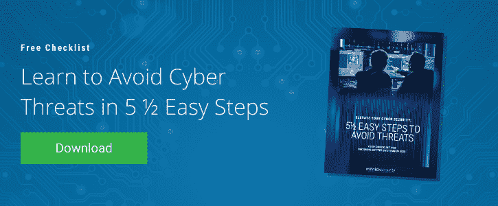

# 2021 年 JBS 肉类供应商勒索软件攻击概述

> 原文：<https://www.mitnicksecurity.com/blog/an-overview-of-the-2021-jbs-meat-supplier-ransomware-attack>

在 2021 年 5 月的最后一个周末，世界上最大的肉类供应商成为恶意网络攻击的受害者。

但这不是普通的攻击。 **JBS 食品集团遭到了** [**勒索软件**](/blog/what-is-a-ransomware-attack) 的攻击——这是一种恶意软件，它冻结了其在美国各地的操作系统，并威胁到美国的肉类供应。

我们来看看发生了什么，它如何影响 JBS 和全球肉类消费者，以及像您这样的组织如何防止这样的勒索病毒威胁:

## 发生了什么事？

5 月 30 日周日，世界最大的肉类供应商——JBS 食品集团——因网络攻击被迫停止在北美和澳洲的运营。

肉类供应商 [在电子邮件](https://www.nbcnews.com/tech/security/cyberattack-hits-world-s-largest-meat-supplier-n1269191) 中宣布，罪魁祸首是*勒索软件*，这是一种恶意软件，它将用户锁定在他们的数据库之外，或者禁止访问相关信息，直到受害者支付赎金。

据哥伦比亚广播公司报道，由于这次系统冻结攻击， **JBS 被迫于 6 月 1 日星期二**[停止其在美国的 13 家肉类加工厂的运营。](https://www.cbsnews.com/news/jbs-meat-supplier-cyberattack/)

虽然网络罪犯的身份尚未确定，但有人怀疑这次袭击是一个以俄罗斯为基地的犯罪组织所为。

## 勒索软件攻击的影响

好消息是，JBS 声称有一个灾难恢复计划，并正在取得遏制攻击的“重大进展”，据美联社 报道 [。](https://apnews.com/article/jbs-sa-lifestyle-health-coronavirus-pandemic-technology-bf82114d3f54e5be2241bd5f9a0b2639)

*“我们已经制定了网络安全计划来解决这类问题，”* [JBS 美国公司首席执行官 Andre Nogueira 表示，*“我们正在成功执行这些计划。”*](https://www.cbsnews.com/news/jbs-meat-supplier-cyberattack/)

坏消息是，尚不清楚这种停产将如何影响美国的肉类供应链——JBS 设施链内的牛肉和鸡肉加工厂都面临全面关闭。根据勒索软件系统冻结的时间长短，美国肉类消费者可能会面临供应短缺，并因此导致肉类价格飙升。

*“鉴于我们的 IT 专业人员和工厂团队在过去 24 小时内取得的进展，* [诺盖拉说](https://www.cbsnews.com/news/jbs-meat-supplier-cyberattack/) 截至周二，*“我们绝大多数的牛肉、猪肉、家禽和预制食品工厂将在(周三)投入运营。”*

即便如此，这也意味着 JBS 食品将在多个地点暂停肉类加工业务 3-4 整天。虽然这看起来并不激烈，但没有办法量化这可能对美国未来的肉类供应产生的影响。 [据 NBC](https://www.nbcnews.com/tech/security/cyberattack-hits-world-s-largest-meat-supplier-n1269191) 报道，由于冠状病毒疫情，肉类价格已经比去年上涨了 5%。这次网络攻击会不会导致牛肉和家禽的价格更高——以及杂货店里疫情式的肉类包装争夺战？

截至周三，尚不清楚赎金要求有多少，也不清楚 JBS 是否计划支付赎金。

## 勒索软件日益增长的威胁

这一勒索软件攻击发生在另一个 [俄罗斯攻击殖民地管道](https://www.cbsnews.com/news/colonial-pipeline-cyberattack-prompts-cybersecurity-mandate/) 的一个月后，导致多个州的天然气短缺，并花费受害者近 500 万美元的赎金解锁。

这还不是全部。去年充斥着勒索软件攻击——从 2020 年的 Garmin 漏洞 到 [联合医疗服务系统关闭。](/blog/an-overview-of-the-2020-uhs-ransomware-attack)

有一点是肯定的:**勒索软件攻击正在全力进行，您的公司有责任为这一日益增长的威胁做好准备。**

虽然并不总是如此，但勒索软件通常是一个聪明的 [社会工程计划](/blog/social-engineering-attacks) 的副产品，在这个计划中，一个坏演员使用开源情报来欺骗员工披露敏感数据——这些数据为他们提供了破解密码所需的信息，编织了令人信服的借口，甚至偷偷绕过了最好的技术防御。

好奇这些社会工程攻击通常是如何工作的？这里有一些坏演员利用新冠肺炎疫情的方式以及一些重要的 [提示，用于教育远程员工有关网络威胁](/blog/educate-your-remote-users-about-cybersecurity-with-these-tips) 诸如此类。

## 您对勒索软件攻击做好准备了吗？

虽然许多公司认为他们正在尽全力防范勒索软件等网络威胁，但你怎么能确定呢？随着越来越多的 [员工在家工作](/blog/5-ways-to-secure-your-workforce-when-working-from-hom) ，不良分子开始远程锁定企业安全。

**下载我们的** [5 个 1/2 简单步骤来避免网络威胁](/lp-easy-steps-to-avoid-cyber-threats)指南获取 Mitnick Security 团队提供的一些可行建议，以加强您的最佳防御。

