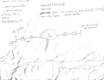

第一章 垃圾桶潜水

黑客以各种不同的方式窃取机密数据，但你知道他们甚至可以在不接触网络的情况下直接从公司网络中吸取敏感数据吗？你可能会认为我在说无线技术，它根本不需要任何“接触”，但我没有。做个好人，不要看到这一页顶部大大的粗体字写着的两个“D”字，当我告诉你黑客可以在不依赖任何技术的情况下完成这一点时，请表现出惊讶。或者，不要配合，假装不惊讶。事实上，也许你最好认为你的个人或公司机密不会暴露在某个垃圾箱里，等待着一个无技术的黑客把它们抓走。如果是这样的话，你最好跳过这一章节。

# 垃圾桶潜水介绍

垃圾桶潜水涉及… *潜水* 进 *垃圾桶* 寻找有价值的信息。我知道，在定义短语中使用该短语是不礼貌的，但这就是垃圾桶潜水，或者说曾经是的。如下一张照片所示，我发现有趣的东西就在那里，等待着被拿走。

我经常在明处发现有价值的垃圾，就像下一张照片中显示的保险账单，通过透明的垃圾袋可以看到。

下一张照片显示了一个堆放的属于网络管理员的废弃文件。我运用自己强大的直觉力确定这些文件属于一个管理员。

根据下一张照片，"Fred"显然对他的工作不满意——他正在[careerbuilder.com](http://careerbuilder.com)上努力搜索新的职位。这张打印出来的资料揭示了很多关于 Fred 的信息。基于这个单一文件，你还能告诉我关于他的什么其他信息吗？

首先，很有可能 Fred 有某种四年制学位，否则他就不会打印出一个需要那么多学历的工作描述。根据职位的薪水，可以很肯定地认为他的年薪远低于$80,000，他正在寻找一个全职工作机会，很可能是在国防航空工业工作。这种事情让我想写一本《外国情报机构招募入门指南》。别再费力地寻找目标的姓名、电子邮箱、雇主、教育背景、国防部门关联以及职业愿景了。只需要一个愚蠢的垃圾桶搜索就能找到有价值的招募目标。

个人信息是一回事，但我经常也发现敏感的公司信息。下一张照片显示了一张采购订单，详细列出了公司的几千美元的采购。

尽管这个表格的形式相当陈旧，但它列出了大量信息，包括客户的姓名、地址和电话号码，服务的描述（其性质是技术性的，并透露了有关客户内部运作的信息），以及授权管理签名（如果经理仍在服务公司工作，这可能对伪造者有用）。

采购订单并不是什么大不了的事，但我认为下一个文件可能是。上面标着“不得传播”。

*传播*是一个很大的词，我觉得人们可能不明白它的意思。当到了丢弃（或者我应该说是*扔掉*）文件的时候，这会造成明显的问题。尽管混淆的短语比比皆是，比如*专有信息*。我发现它写在下一个文件上，这个文件躺在垃圾箱外面的地面上。

使用一个更清晰的短语可能会更好，“仅限内部使用”。但即使是这个短语显然也有些令人困惑，因为我发现它写在这个现在著名的垃圾箱里晃来晃去的文件上。

我想我错过了像这样的警告词的重点。在《公主新娘》中，因尼戈·蒙托亚说得对：“你一直在使用那个[短语]。我不认为它意味着你认为的那样。”我赞成禁止混淆的短语，比如“专有信息”和“不得传播”。我建议在每份文件上都加上更清晰的标语，比如“放在停车场供所有人阅读”。至少那时人们对该做什么不会感到困惑，当该丢弃这东西的时候。

而且，如果你认为走过垃圾箱并抓住挂在外面的东西需要大量的努力，我有好消息。有时，如果你非常幸运，你只需站在一个风大的日子里等待敏感信息就会吹到你的脸上。这正是我的朋友迈克在一天工作中所发生的。他抓住了那张令人不快的文件，在发现它不属于他的雇主后，他与我分享了它。现在我与你分享。

这一堆涂鸦对于未经训练的人来说可能看起来不起眼，但任何技术人员都会告诉你，这张地图勾勒出控制计算机网络所需的一切。模糊的 IP 地址是一个真实的地址，而用户名（admin）和密码（模糊，以字母“G”和“a”开头）提供了登录机器作为管理员所需的一切。页面顶部另一个密码（模糊，以“R0ck3t”开头）提供了访问另一个私有 IP 地址（模糊，以“0.57”结尾），也许还可以访问私有网络上的其他机器。路由和子网图以及诸如数据包过滤器和严格路由之类的术语表明，这位涂鸦者在技术上很熟练，而诸如 AES128、MD5 和 ipsec 之类的术语则表明他或她至少在某种程度上关注安全，但简单的事实仍然是，这份文件被抛弃了（连同迈克没有费力拿出来的其他文件一起），好像它不重要一样。

一名高科技攻击者可能会花费数小时、数天或数周来试图绕过 AES-128 加密和 IPSEC，以访问其后面的私有网络。即便如此，他或她也将努力绕过内部机器的安全性，以访问“火箭”盒子。另一方面，一个无技术的黑客可以在片刻之间绕过整个网络的安全性，只需将文件从脸上撕下来并保存下来即可。

幸运的是，这种停车场垃圾很少见。诚然，我只见过少数几例如此明目张胆的情况。大多数情况下，我必须真正推动极限，将头伸进垃圾箱里，往里面看。我在一个垃圾箱里发现了下一份文件，它正好在一堆类似文件的打开盒子上。这份文件列出了客户姓名、账户信息和销售代表的方便列表，以及他们的佣金和社会安全号码。竞争对手公司可能对这些文件感兴趣，但身份盗窃者会对它们感到兴奋。

当我发现下图所示的垃圾箱时，我感到失望，因为显然它刚刚被倒空。留下的一堆白色信封似乎无害，直到我看到红色粗体字“医疗信息”。下一张照片中所示信封的粗糙、撕裂的边缘似乎暗示着某个笨蛋收到了账单邮件，打开了它，把它放回信封里扔给了像我这样的恶心（有才华的）无技术黑客。如果这是我的发票，我会把它撕碎，然后用碎片铺在猫的猫砂盆里——这似乎连最专注的垃圾分类者都能阻止。

但是白色信封并不是这个垃圾箱里唯一的。我发现了几封信封，每封信封上都有同样的朱红色字体，意识到其他每封信封（就像下一张照片中显示的那样）都是*未打开*的，而且每封信封上都有不同的邮寄地址。

好奇心驱使，我走到建筑物前面查看租户名单。果然，在大楼指示牌上列出了我在被丢弃的信封上看到的医疗服务提供者的名字。那一刻，我知道这不是一个粗心的病人，而是一个粗心的医疗服务提供者。

我模糊地记得有关一项法规的事情，该法规威胁对泄露患者信息的医疗服务提供者实施严厉处罚。后来通过谷歌搜索（是的，谷歌，而不是雅虎，谢谢），我发现了 1986 年《内部税收法典》的修正案，以缩写 HIPAA（《健康保险便携性和责任法》）而闻名，涉及患者隐私。具体来说，它涉及通过制定和执行标准来保护健康数据的机密性和安全性，并威胁对其建议标准的明显滥用处以高达 25 万美元的罚款。尽管我知道这不是一项 25 万美元的罪行，但我知道某个地方肯定有人会因知道这家公司的所作所为而感到恼火。

你告诉他们了吗？

我有一种感觉，我几乎每章都会在这里加上这个侧边栏，但是这需要重复。我经常看到这种近乎犯罪的疏忽，但我几乎从不报告。从道义上讲，我知道我应该这样做，但是我报告发现的事情的运气很差。我被斥责过，被威胁要采取法律行动，还被骚扰过太多次，因为我试图做正确的事情。所以目前，我不再参与报告的游戏。相反，我在我的书籍和演讲中使用这些照片的编辑版本，以提高人们对这个问题严重性的认识。至少通过这种方式，这些照片可以起到某种积极的作用。

那么问题的解决方案是什么呢？首先，提高对垃圾重要性的认识。像下一张照片中的这样的标志是一个很好的提醒。

锁住垃圾箱门以确保安全也是一个很好的方法。

即使这个大门上锁了，一个积极的垃圾箱潜水员也会跳过围栏。大门锁加上垃圾箱锁倒也不是一个坏主意，但是当涉及到压制危险的垃圾桶文件时，黄金法则是将一切都碎纸。但是碎纸是一个主观的词。有很多种类的碎纸机，每一种都提供不同级别的安全性。一台通用的条切碎纸机会将文件切成垂直条，这些条可以很容易地重新组装。十字切割碎纸机会将垂直条水平切割。结果碎片越小，重新组装文件就越困难。例如，一个基本的条切碎纸机将文件切成 1/8 英寸 × 1 1/8 英寸的碎片，就像这张照片中显示的那样。

一台顶级的、极具侵略性的扫描仪将文件粉碎成 1 毫米 × 5 毫米的粉末颗粒（在下一张照片中显示），即使是世界上最好的间谍机构也会感到沮丧。

表格 1.1 列出了从最不安全到最安全的碎纸机规格。

表格 1.1 碎纸机规格

一台来自办公用品商店的体面的“微切碎纸机”大约需要 200 美元，可以将纸张、CD 甚至信用卡切割成 3/32 × 5/16 的碎片，提供比平均水平更好的安全性。一般来说，你会得到你所付出的代价。无论你选择什么，都比将文件整张放入垃圾桶或放在停车场里要好。

在坏人发现之前知道垃圾桶里有什么也是明智的。如果你负责公司的安全工作，考虑至少每周去一次垃圾箱。了解一下被丢弃的东西以及它们在落入大绿箱子时的状况。如果你是一个希望保护隐私的消费者，请购买一个个人碎纸机，并与家人讨论在丢弃之前应该被碎纸的内容。如果你的家人拒绝合作，你可能需要考虑搬家。如果他们不是特别吵闹，你可能会发现另一个带锁的垃圾箱有另一个很好的用途。

（开玩笑！）
