第二章 跟随行为

黑客和忍者像……聪明人和隐秘刺客一样。好吧，事实上，他们根本不太搭配，除非你有一个非常聪明的忍者或一个非常致命的黑客，在这种情况下，我们更多地谈论的是黑客忍者，这是一种完全不同的品种。甚至不要让我开始谈论海盗忍者黑客。但我岔开了话题。黑客和忍者都喜欢穿黑色，并且他们都有能力悄悄进入建筑物并与阴影融为一体。他们还都能做到那个烟雾伎俩——让他们毫发无损地穿过墙壁，被一个看起来很酷（但发臭）的烟雾团包围。不可能吗？几乎不可能。继续阅读，我将揭示另一种纯粹的、无技术的黑客（忍者）魔法。

P.S. - 我向我的武神館兄弟姐妹谦卑地道歉，因为我对忍者的刻板（但与文化相关）描述。

# 跟随行为简介

跟随授权人员进入建筑物简单地意味着——基本上是靠他们的余波行事。当我建议跟随一位授权人员进入一个实际上是堡垒的建筑物时，文斯选择了湿毛巾伎俩。考虑到情况，他的想法更好，但跟随行为仍然是获得进入安全建筑的最佳无技术方法之一。跟随行为已成为一个家喻户晓的术语，这意味着这是一个普遍存在的问题。

多年前，我被派去对一个州政府设施进行身体评估。该设施分为两个明显的区域：一个开放区域供一般公众使用，一个限制区域供州政府雇员使用。我们的任务是进入限制区域，并获得内部封闭计算机网络的访问权限。我们的初步侦察显示，开放区域和限制区域相连，但一名武装警卫守在连接走廊上。进入安全区域的前门同样受到保护。每个侧门都有装有刷卡读卡器的门（其中没有一个看起来容易受到湿毛巾伎俩的影响）。更糟糕的是，装备有武装警卫的标记车辆在停车场巡逻。

尽管起初受到严格的安全措施的打击，我们仍然保持了监视，并最终找到了收获。我们在安全区域的一个侧门周围聚集，发现一群员工正在闲聊抽烟。我立刻意识到我们已经找到了进入的方法。我们去了最近的加油站，我买了一包香烟和一个打火机。

我准备好以一名电话技术员的身份社会工程学地进入建筑物。我穿着破烂的牛仔裤、工作靴和一件带有电话公司标志的白色 T 恤。我夹在领口上的是电话公司的员工徽章。我的明黄色工具箱上有电话公司的标志，透明的顶部露出了一小堆品牌化的电话信息条。工具箱里装满了电话测试设备。一顶破旧的安全帽完成了这个造型。

这身正式的装扮当然是完全虚构的。我从互联网上下载了电话公司的标志。我自己用烫画纸印了这件 T 恤。我在家里的打印机上打印了徽章，并用 2 美元的工具包把它打膜了。电话测试设备是合法的，是从各种来源收集起来的，就是为了这种场合。我在路边找到了这顶破旧的安全帽。它破旧的状态使它更加真实可信。

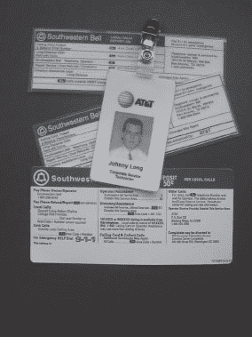

不管我演技有多好，靠近吸烟者的群体都是个坏主意。如果他们从停车场看着我走过来，他们会认为我是局外人。如果他们从大楼出来发现我已经在那里，正在抽烟，他们可能会认为我已经*从*大楼出来休息了一会。

集体吸烟的人回到室内后，我赶紧走向侧门，点燃了一支香烟。两名员工最终出来了，开始在他们之间交谈。我随意地点点头，加入了他们的闲聊。他们谈论着公司政治，我在恰当的时候点头表示同意，并不时吐出烟雾，以确保他们相信我对香烟很熟悉。我抱怨电话系统最近一直出问题。他们笑了笑并表示同意（幸运的是），我尽量不要被香烟呛到，心里想着自己是否会因为感觉到的头晕而变得像我感觉的那样难受。当他们熄灭烟时，他们刷卡回到室内。我把烟掐在路边——这是企业吸烟者的失礼行为——并为他们拉开了门。他们感谢我这个友好的举动，我跟在他们后面进去了。再说一遍。他们*感谢我*为他们拉开门，尽管我刚因为他们的缘故闯入了他们的大楼。一旦进入室内，我就可以按照我的意愿行事了。

我穿过大楼，从未受到挑战。有一次，我甚至走进了安保办公室。接待员看到我时很惊讶，直到我指着一个空桌子告诉她电话坏了。她不确定电话是否坏了，但还是让我进去了。毕竟，我是电话维修员。我把工具箱扔在桌子上，拿起电话听到了拨号音。我摇摇头，把电话放回底座上，然后把工具箱和一叠看起来很重要的文件一起搬离了桌子。我离开办公室，嘀咕着关于愚蠢的工作订单，以及他们总是给我错误的插孔号，以及这总是让我看起来像个白痴。接待员咯咯笑着告诉我随时欢迎再来。我想她可能喜欢我。可能是因为头盔吧。

总的来说，那是一个不错的一天。我们通过一系列简单的、无技术含量的攻击再次攻破了一座要塞。我们带走了大量文件，证明我们已经进入内部，而我的袖珍电脑装满了数百兆敏感的国家数据。员工们从未质疑我，因为他们认出了我衬衫和徽章上的标志。由于标志和装备看起来合法，我很可能就是我所表现出的样子。但我故意扮演了一个来自*错误*电话公司的技术员。我选择的公司是一家知名的数据和语音服务提供商，但他们不提供本地硬件支持。简单来说，即使我是那家电话公司的员工，我也没有理由进入该设施，即使我进入了，我也不会测试电话手柄。

一切归结为扮演一个令人信服的角色。我使用了古老的尾随技术来获得进入建筑物的初始权限，然后加入了大量社会工程学来与建筑物内遇到的每个人搭讪。每个员工都以我为准，尽管他们中的任何一个都可能立即结束闯入行为。

电话技术员恶作剧并不是我唯一可以使用的手段。根据情况，我可以扮演快递员、电工、水管工、电梯维修工或任何其他类型的服务人员。选择多种多样。我所需要做的就是在正确的时间出现在正确的地方，展现令人信服的态度，并穿着得体。找到正确的时间和地点需要耐心。巧舌如簧需要练习。

穿着得体需要更多的工作，但即使这样也相对简单。让我们看看如何才能获得正确的外观。

## 穿着得体

获取一张照片很有帮助。起初，我遇到了困难。我担心人们会被我跟踪的方式吓到，我记得我竭尽全力避免被他们发现。我在开车时拍下了这张电话技术员的照片。

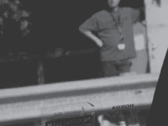

看看我车窗上完美聚焦的贴纸（是的，狂热的无技术黑客，当时我开着一辆本田）。更糟糕的是，那家伙看到我拍照，转身看着我开过去。他可能记下了我的车牌号码并报告给当地电话技术员跟踪热线。隐秘计划泡汤了。有一次，我甚至从人行道踏入一排灌木丛，以抓拍一个正在接近的快递员的高质量隐秘照片。照片拍得不好，但至少我交了一个新朋友。快递员很好心地帮我脱离了刺人的冬青灌木。

最终，我学会了听从自己的建议，现在我选择了更简单的方法——我只是*问*我的目标是否允许我拍几张照片。我礼貌地询问（避免那种跟踪者的氛围），大多数人都很乐意帮忙。在某些情况下，我会编造一个关于我孩子喜欢大卡车的故事，然后问我的目标是否介意为快速拍照摆姿势。毕竟，谁会拒绝一个小孩的快乐呢？下一张（被大幅模糊处理的）照片中的快递员非常乐意。我拍到了他的卡车、他的服装，甚至他的员工徽章——足够详细以组合出一个令人信服的快递员角色。

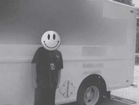

不要打击信使！

所以快递员让我给他拍照。如果我利用他的照片伪装成他进入某个地方，他应该被解雇，甚至受到责备吗？几乎不可能。如果我穿着快递员的服装在目标建筑内游荡，帮自己拿一些超级机密文件，那么目标的安全计划就有问题了。归根结底，大多数人都以表面价值看待世界。如果员工在徽章或 Polo 衫上看到熟悉的标志，他或她自然会假设我就是表面上看到的那个人。与陌生人对抗在社交上很尴尬，但正如我已经说过的——只需要一个警惕的人就能让我的团队停下来。

很抱歉我把下一张照片中的所有可识别的东西都模糊处理了，但请相信我的话；那是另一家知名快递公司的快递员。

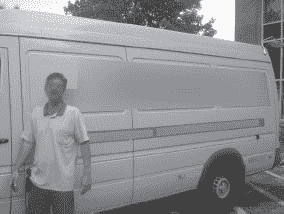

下一张照片中的电话技术员在我拍照时正在认真工作。由于他允许我拍照时非常有礼貌，我选择不偷窥他的会话。

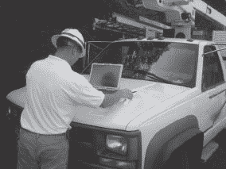

如果我告诉你下一张照片中的电话技术员中有一个是假的，你能告诉我是哪一个吗？

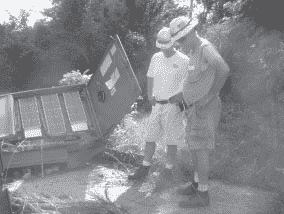

下一张照片中的家伙是煤气和电力技术员还是黑客？他戴着一个带有正确煤气和电力标志的官方帽子，手里拿着一个电子小玩意。考虑到许多煤气和电力员工在外出工作时穿着的方式，你可能永远分辨不出区别。

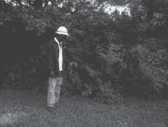

最后一个例子，考虑一下下一张照片中的技术人员。在当今的高科技环境中，这样的场景相对常见。他显然在思考一个普通凡人永远无法完全理解的深刻技术问题。看他辛勤工作，打扰他似乎有点无礼，所以我只是拍了一些照片。

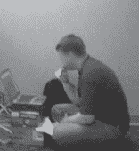

然而，正如下一张照片所示，他并不是普通的技术人员。是的，他把笔记本电脑插入了一个 ATM 机。

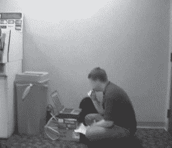

这会让他比刚才更可疑吗？可能不会。他可能是一个黑客吗？也许。但机会表明他正是他看起来的那个人——一个带着 ID 牌的 ATM 维修工。但是难道每个像样的 ATM 黑客都会携带一些看起来合法的徽章吗？

当你作为一个注重安全的公民第一次要揭露一个潜在的黑客时，你很可能会对这种情况产生严重的疑虑。在黑客进行算法的过程中去接近任何技术宅都是一个普遍愚蠢的想法。技术宅对这种事情都会变得暴躁。此外，如果你打扰了他，而他恰好正在认真工作，那他会非常不高兴。另一方面，如果这个家伙有胆量在繁忙的走廊中央劫持 ATM，那么他可能毫不犹豫地说出一个大胆的谎言让你离开。如果他真的有本事，他会跟你说服你交出*你的*员工工牌，这样他就不用再受到干扰，以保护*你的*银行账户免受邪恶的 ATM 黑客的侵害。

正确评估情况可能会让人头晕目眩，但幸运的是你不需要扮演义警。如果你觉得有什么不对劲，告诉那些受雇来关心的人。安保人员、警察、空中警察、戴着镜面太阳眼镜的特勤队员和学校过街警卫都非常关心保护他们负责的人。即使他们只关心保护自己，大多数人也喜欢他们工作所带来的薪水。所以如果你告诉他们有潜在的安全威胁，他们要么会采取行动，要么在那个坏蛋抢走一切之后被解雇。无论如何，让他们有机会做好工作总比成为全职的监考员要好。我相信你一定有比烦扰无辜旁观者更重要的事情要做。

对于那些负责安保人员、警察、空中警察、戴着镜面太阳眼镜的特勤队员和学校过街警卫的人：确保你的人员得到足够的信息，知道如何处理“访客”，而且他们倾向于选择正确的方式而不是走捷径。并留意那些似乎引诱尾随的情况。例如，下一张照片显示了一名女子在美国政府设施的安全门刷卡进入的情况。

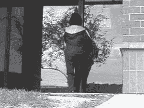

下一张照片显示了同一扇门大约十秒钟后的情况。

大约十五秒后，门终于关上了，这足以让闯入者溜进去。那个刷卡的女士不见了踪影。注意这些情况。坏人们肯定会留意的。

## 真实世界的尾随练习

尾随描述了跟随一个人进入安全区域的行为，但进入只是开始。跟随我，看看一个典型的尾随会是什么样子。我通过一个侧门跟随一名员工进入了目标建筑物。尽管我在员工后面尾随，但后来我意识到门甚至没有锁。然而，门上却挂着一个*仅限紧急出口*的标志。一旦进入建筑物，我就准备好了相机。一旦准备好，我发现另一名员工在走廊里徘徊。我将相机放在腰间，拍下了下面一系列照片。

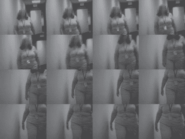

这位女士面容和善，非常有礼貌。我为抓拍到她的挂绳和工作证的细节的一系列快速照片感到内疚，但她并不是唯一一个安全意识不强的员工。在建筑物内部，我还抓拍了几张其他工作证的照片。

当我在走廊里漫步时，我发现这个垃圾袋放在一扇锁着的办公室门外。

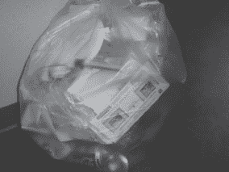

透明袋子里装着一些典型的办公室垃圾：香蕉皮、苏打罐、纸盘和美国运通账单。

大多数办公室都被锁上，受到近距离读卡器的保护。选择不使用高科技的方法，我忽略了这些锁着的空间，继续漫步。我在一个办公室套房外拍下了下一张照片。

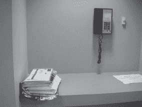

这部电话并没有像它本来那样有趣。它列出了电话的呼叫功能，而不是一个方便的人员目录：呼叫等待、电话会议、呼叫转移和呼叫停车。另一方面，邮件堆似乎很有趣。采取不动手的方法，我没有翻阅，但最上面的信封是另一张美国运通账单。

当我继续在走廊里漫步时，我看到一扇敞开的门，看起来像是一个清洁工的储藏室。我调整角度往里看，然后停住了脚步。

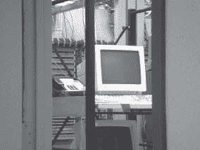

这不是一个清洁工储藏室，而是一个网络储藏室。这个尾随者的圣杯就在我面前，敞开着，完全无人看管。不仅如此，每个控制台都已登录，让我可以为公司的电话和计算机网络系统做任何我想做的事情。我可以安装后门，放置蠕虫（“…一个多头蠕虫，用来破解加密并在加密网络中搜索数字足迹，”正如约翰·特拉沃尔塔在电影*《剑鱼》*中所说）或者任何我想要的。或者我可以选择一个不那么好莱坞的方法，安装我的自己的 WAP 或硬件键盘记录器。无论哪种方式，公司的电话、电子邮件和机密信息都在我掌握之中，而无需使用任何高科技攻击。

尽管大多数设施的安全意识要比这个高得多，但我在职业生涯中发起的每一次真实攻击都涉及某种无技术的黑客手段。在日常生活中保持警惕，像一个黑客一样思考，你也会开始注意到这些事情。

^(1) 当然，我模仿的电话公司与此无关。我与他们没有关系，这种攻击方式也并不反映该特定电话公司的安全问题。我的公司和我都不赞成这种行为，除非是在经过授权的安全测试中。请不要在走廊里对每一个可怜的电话技术员进行全身扑击。
