第三章 肩窥

伙计。在你的肩膀上冲浪？哇。不，这不是冲浪和体操的混合，但这是一项运动—一种黑客运动。忘记你认为的黑客在你在键盘上敲出密码时盯着的情景。我们谈论的是 X-Games 版本，黑客仅凭借他们的头脑就能从笔记本电脑中吸取超级机密数据。这里没有心灵朋友网络，只有纯粹的充满咖啡因的黑客创造力。如果你喜欢在笔记本电脑上有一个屏幕，这样你就可以看到自己在做什么，那么不要读这一章。因为当你通过一个无技术黑客的眼睛体验肩窥时，你可能会想要把笔记本电脑的屏幕扯掉。

## 什么是肩窥？

*肩窥*是一种经典的无技术攻击，就像肩膀本身一样存在已久。这是一种简单的攻击方式。坏人所做的就是从受害者肩膀上窥视，看看他或她在做什么。在旧时代（大约在 1990 年之前），这种技术被用来窃取通话卡号码，当受害者在公共电话亭中输入时。小偷可以重复使用这些数字来进行免费的长途电话，或者以低于市场价值的价格出售给他人。尽管如今有更简单的方法来获取通话卡号码，但键盘监视的技能仍然有许多非常实用的用途。例如，考虑下面在办公用品店收银台上呈现的安全屏幕。

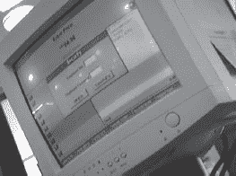

就像商店内的所有终端一样（包括许多顾客可访问的终端），这个终端提示输入员工编号和密码。这个亭子根据输入的凭据允许访问权限。显然，经理的访问级别会比员工或顾客（通常没有凭据的）高。对于某些交易，例如高价值物品的退货，需要经理登录。如下一张照片所示，一个熟练的键盘观察者（或手机视频摄像头用户）可以捕捉输入的按键。

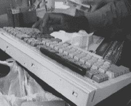

一个无技术的黑客可以在顾客终端上重复使用这些凭据来做各种有趣（读：恶毒）的事情。

保持这些数字私密

如果你在众目睽睽之下输入敏感数据，那么要在按键和漫游的眼睛之间创建某种屏障。这可能需要你重新调整身体位置，或者用空闲的手创建一个屏障。如果你不愿意这样做，那为什么要设置密码呢？

键盘数据捕获仍然相当老派。当世界变得数字化时，肩窥者将目光从键盘转向键盘，不再寻找电话卡号，而是密码。这并不是一件容易的事。每次我尝试这样做，我都会想起经典电影*Sneakers*中的经典情节。整个黑客“梦之队”都被一个数学家输入密码的视频镜头搞糊涂了。倒带视频，他们最终意识到密码是看不清的——受害者只是挡住了视线。幸运的是，本章不是关于捕捉那些瞬息的密码。它是关于保持警觉，并意识到肩窥者已经进化到超越观察键盘的阶段。

## 盒子外

在我们讨论实际的肩窥技术之前，让我们先谈谈通过观察机器本身来轻松对目标进行画像有多容易。考虑下一张照片中的旅行者。

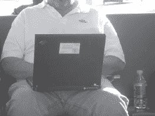

一个真正的技术人员可能已经仅凭机器的设计和背面的端口就能确定 IBM ThinkPad 的年龄和型号。一个黑客可能会绕到机器后面偷看屏幕，试图了解更多关于这个目标的信息。但一个合格的非技术黑客（或敏锐的观察者）会查看贴在笔记本盖上的名片，上面显示了目标的姓名、公司、职位、地址、办公电话和手机号码。贴名片的现象正变得越来越流行。这些天我到处都看到它们。这里是我在野外捕捉到的另一个。

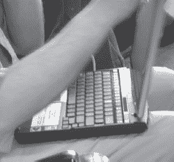

贴名片的另一种形式是公司提供的库存标签。许多时候这些只是简单的小条形码标签，但有些（如下一张照片中显示的）更大，揭示了相当多的信息。

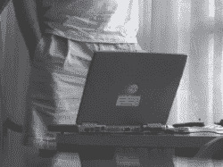

检查下一张照片中我捕捉到的公司贴纸之王。

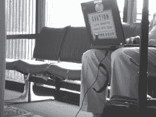

这台可怜的笔记本不仅贴有公司库存标签，还装饰有公司标志和一个超亮的橙色标志，用英文和我猜是中文大喊“超敏感”。即使是一个不识字的笔记本小偷也可能意识到这台笔记本值得偷。这提出了一个重要观点。虽然笔记本贴纸可以用来对受害者进行画像，但它们也可以用来标记一台笔记本的价值，使所有者成为盗窃或暴力行为的目标。我想起了我在现场看到的美国政府的“机密”、“秘密”和“绝密”标签。虽然我理解这些标签在混合分类政府环境中的实际价值，但我在野外看到了太多这样的标签。即使是无害的“非机密”标签也表明设备在或周围使用于政府空间，使设备成为盗贼、间谍和飞碟阴谋论者的目标。

对贴纸说“不”

那些贴纸必须得走。如果你被迫将它们贴在你的装备上，考虑在旅行时在上面贴上一张便利贴。这样至少可以将贴纸（以及可以从中推断出的信息）隐藏起来，不让太好奇的眼睛看见。

谈论贴纸时，不可能不提及最著名的贴纸之一：便利贴。我在旅行中见过多少便利贴我都说不清楚。它们经常出现在显示器和桌子上，几乎总是包含着一些有趣的信息，这些信息是不需要任何技术的黑客可以利用的。我在一个高档酒店的货运码头发现了下面的这些机器。

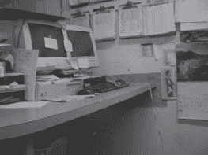

不要去理会填满了每一个角落、几乎每一寸墙壁的文件。试着把注意力集中在解锁的文件柜之外，看看计算机系统和那些漂亮的便利贴。对我的眼睛来说，大部分都是无用的，但其中一个包含了看起来像是登录凭据的信息，根据网络电缆的判断，这些凭据可以认证到酒店网络——同样的网络也为客人注册数据库提供服务。一个不需要技术的黑客可以在不触摸任何设备或犯下任何罪行的情况下收集到大量信息。如果有人发现他在房间里？嗯，他只是一个迷失了方向的寻找洗手间的客人。祝你好运去证明反面。

# **肩部冲浪**的绝佳地点

有许多绝佳的肩部冲浪地点，但有些比其他地方更好。首先，让我们来谈谈机场。

在机场，第一个肩部冲浪的机会出现在办理登机手续时，尤其是在自助服务亭上，我们在第九章中会更详细地谈论这个问题。办理登机手续时，自助服务亭清晰地显示了旅行者的姓名、目的地、座位分配和常旅客号码等信息。安检口也提供了独特（而且令人不安）的肩部冲浪机会，可以看到 TSA 特工在工作时的情景。

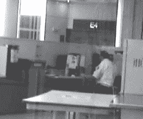

既然在安检口周围闲逛拍摄 TSA 特工的照片不是一个明智的做法，一个不需要技术的黑客最终会去行政休息室，在那里他要么合法进入，要么通过社交工程的方式进入。这些休息室经常挤满了正在进行重要活动的知名人士，其中大多数对肩部冲浪者毫不知情。

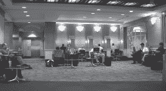

门口也是一个很有趣的地方，因为座位是背靠背排列的，而且不断出现的疲惫旅行者形成了喧闹和分散注意力的氛围。下面的照片就是在这样的环境中拍摄的。

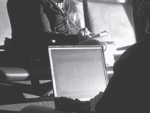

尽管角度尴尬，照明条件糟糕，但屏幕仍然清晰可读（我已经模糊了屏幕，以保护用户清晰的 Outlook 电子邮件会话）。半私密的信息亭提供了更好的照明，使得远处的冲浪者更容易看到。下一张照片中显示的收购副总裁完全没有意识到我的存在，他正在输入一封机密的部门内邮件。

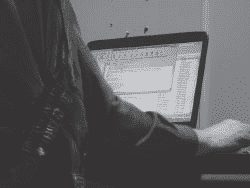

机场及周围的休息室也提供了绝佳的冲浪机会，正如下一张照片所示。

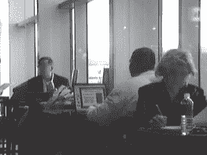

虽然机场系统很少成为大多数无技术黑客的目标，但不可能不注意到无人看管的机场工作站。下一张照片中显示的航空公司“Sabre”系统几乎是在请求被人摆弄。

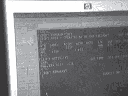

咖啡店是肩部窥视者的另一个最爱，就像下几张照片所示。

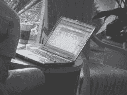

环境越舒适，其顾客越不警惕。我个人见过在咖啡店编辑的建筑设计（下一张照片所示）到机密邮件和政府提案文件等各种内容，而其他无技术黑客也告诉我更有趣的事情。

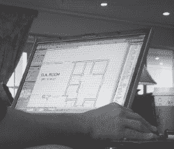

商务休息室不仅为信息亭黑客（在 第九章 中讨论）提供了绝佳机会，也为肩部窥视者提供了机会，就像下一张照片所示。

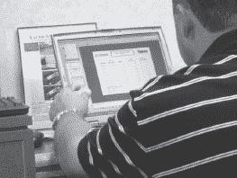

如果在酒店商务休息室工作是很重要的事情，那么这件事可能非常重要。肩部窥视者知道这一点。保持警惕。

保密，保护好

对于明显带有极客风的《指环王》引用，我表示抱歉，但甘道夫说得对。把私人事务与公众隔离开来。不要在公共场所处理个人事务，也不要让自己成为目标。注意你所呈现的形象，并在必要时减弱它。如果你必须在公共场所处理私人事务，考虑使用笔记本电脑隐私过滤器（尝试谷歌搜索“笔记本电脑隐私过滤器”）。当然，要记住，经验丰富的肩部窥视者会看到隐私过滤器，并正确地假设你正在处理一些敏感信息。因此，过滤器的存在可能会使你或你的设备成为目标。我提到了把私人事务留在公共场所外吗？这是你最好的选择。

# 电子扣除

信息确实比硬件更有价值，专业的小偷明白这一点。尽管业余小偷可能对像笔记本电脑这样的物品的相对价值有相当了解，根据它的年龄和硬件规格，但专业人士通常会使用无技术手段来确定机器上存储的数据的相对价值，通过对机器用户的画像进行分析。我们已经看过一些有趣的外部线索，但分析机主的最佳方式是看屏幕。

StankDawg ([`www.stankdawg.com`](http://www.stankdawg.com)) 发表了一篇名为*The Art of Electronic Deduction* ([`www.docdroppers.org/wiki/index.php?title=The_Art_of_Electronic_Deduction`](http://www.docdroppers.org/wiki/index.php?title=The_Art_of_Electronic_Deduction))的论文，探讨了攻击者可以从有趣的电子来源中获取信息的方法。从他的论文中得到启示，看看下面这张我在咖啡店里发现的一台暂时无人看管的笔记本电脑的照片。

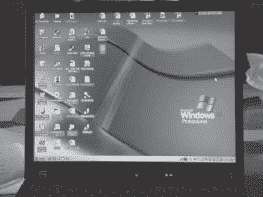

我已经修改了图像以保持所有者公司名称的机密性，但通过屏幕上的信息，一个有经验的非技术黑客可以获取大量信息。首先，桌面背景表明笔记本电脑正在运行 Windows XP 专业版。其他美学线索，如开始按钮配置，也支持这一点。机器的操作系统是技术攻击者可以用来确定发动攻击类型的必要信息。通常，攻击者需要分析一系列网络数据包响应来确定这些信息，但在这种情况下这是不必要的 - 不太可能笔记本电脑的所有者已经安装了另一个操作系统的桌面背景。关注桌面上的图标，我们可以立即推断用户所在公司，因为一个图标（在上面的图像中模糊）清楚地表明了这一点。下面的图标帮助我们推断更多。

单词*sales*表明这是某种销售软件，但通过谷歌搜索发现 SalesLogix 是中市场 CRM（客户关系管理）软件的领导者。搜索结果显示 SalesLogix 是“网络上最强大的销售工具”。我们可以自信地推断所有者从事销售工作。下面的图标指的是*SAP*，一个常见的商业软件解决方案提供商。

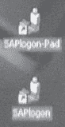

SAP 登录客户端的存在表明服务的登录凭据也可能安装在笔记本电脑上。如果一个小偷拿走了这台机器，他或她可能有机会使用存储的凭据登录公司的 SAP 系统。下面的图标标题为*SecuRemote*。

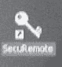

通过谷歌搜索发现*SecuRemote*是一个虚拟专用网络（VPN）客户端。与 SAP 登录软件一样，VPN 凭据的全部或部分可能驻留在笔记本电脑上，允许对手访问公司网络。至少，特定品牌的 VPN 的存在对技术攻击者是有价值的信息。

下面的图标显示了 Palm 个人数字助理（PDA）软件已安装在这台机器上。所有者可能拥有 Palm 设备，并且该设备的内容很可能已备份或同步到笔记本电脑上。

下面的图标显示了 AT&T 全球网络客户端的存在。

再次，这个网络客户端可能具有缓存的凭据，这可能允许拥有笔记本电脑的对手以机主的身份登录。一个不幸命名的图标如下所示。

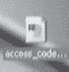

我只希望这份文件不包含任何实际访问代码。那将使坏人的工作变得*太*容易。

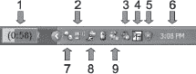

桌面图标提供了大量信息，但技术娴熟的攻击者可以通过查看屏幕上的其他细节了解更多信息。例如，通过查看下面的任务栏，您可以确定哪些信息？

这个任务栏本身透露了大量信息。布局显示我们正在看一个现代版本的 Windows，很可能是 Windows XP。但每个图标也有意义。您能识别出多少？以下是每个图标代表的内容。

1.  这是电池指示器，显示这台机器是一台笔记本电脑，还有五十八分钟的电池剩余时间。我们可以看出这台机器没有插入电源，因为电池旁边没有电源插头图标。

1.  这个图标显示这台机器已连接到（并与）无线接入点通信。第三个图标。

1.  这个图标表示系统扬声器已静音。

1.  这是 IBM *硬盘活动保护* 程序图标。它显示这台机器是一台 IBM 笔记本电脑，并且没有检测到系统震动（机器最近没有掉落）。

1.  这个图标代表微软安全中心，目前已禁用—这意味着机器的安全级别不够理想，可能容易受到攻击。这也证实了机器正在运行现代版本的 XP。

1.  这是系统时钟，设置为下午 3:08。这些信息可以与当前当地时间相关联，帮助确定机主所在的时区。如果不是设置在他们所在地，那就是设置在他们来自的地方。

1.  这个图标属于 Trillian 即时通讯程序。Trillian 网站 ([www.ceruleanstudios.com](http://www.ceruleanstudios.com)) 将该程序描述为“一个功能齐全、独立、可换肤的聊天客户端，支持 AIM、ICQ、MSN、Yahoo Messenger 和 IRC。” 它继续说道：“它提供了原始网络客户端无法实现的功能，同时支持标准功能…” 简单来说，Trillian 是一个即时通讯客户端替代品。图标的风格表明 Trillian 已连接并登录。

1.  这是备受欢迎的 AIM（AOL 即时通讯）图标，其风格表明程序已连接到服务器，用户已登录。

1.  这个图标属于微软即时通讯（MSN），其风格显示程序正在运行，但用户未登录。

1.  如果这个人同时运行 Trillian、AIM 和 MSN 看起来很奇怪，那么你已经注意到了一个有趣的点。Trillian 软件使 AIM 和 MSN 客户端变得多余。所以除了这个人可能正在错误的地方寻找爱情之外，他或她可能并不那么懂技术——似乎没有理由同时连接 AIM 和 Trillian。这些客户端正在使用的事实给观察者提供了更多研究的理由，因为 MSN 和 AIM 都要求用户在线注册账户，并创建个人资料，其中可能包含个人信息。雅虎的即时通讯客户端目前是插件最多、在线资料最多的。雅虎用户必须非常小心，不要透露太多个人信息。

即时通讯个人资料的陷阱

我们可以写一整本关于使用即时通讯程序的隐私影响的书。当注册账户时，新用户会创建各种数据轨迹，黑客或身份盗贼可能会揭露这些轨迹。虽然我们没有足够的页面空间来讨论这里所有潜在的陷阱，但只要明白，如果你关心自己的隐私，配置不当的即时通讯客户端是个坏消息。

对这个即时通讯用户的在线调查至少需要一个用户名。如果聊天窗口保持打开状态，就像下面由 StankDawg 提供的那个窗口一样，用户的名字就会清晰可见地显示在窗口顶部。

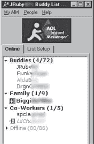

拥有登录用户名后，观察者可以开始在线信息收集活动，以了解机器的所有者。这个活动还包括搜索目标好友的信息。拥有一个好友列表（就像下面所示的列表，也是由 StankDawg 提供的）的观察者可以深入了解目标的个人生活，从最不注重隐私的好友资料开始。

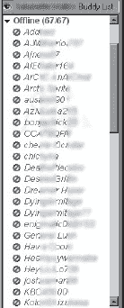

有时候好友列表上的名字并不像好友列表本身的外观那么重要。StankDawg 提供了下面显示的雅虎即时通讯好友列表。

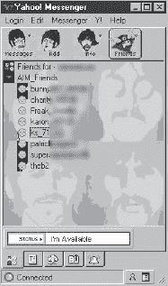

很明显，这个用户是披头士的粉丝。社会工程师可以利用这个信息作为谈话的开端。正如 StankDawg 所说，观察者可以创建一个“证据的堆积”，利用看似无用的巧合证据来建立目标的个人资料。当这些证据来自多个来源——屏幕截图、肢体语言、着装、举止等——观察者可以构建一个对潜在目标非常准确的个人资料。

但是通过这种方式建立的任何个人资料都可能存在缺陷。最好的非技术黑客意识到这一点，并不会忽视任何一条证据。考虑下面展示的扩展任务栏。这是我们之前讨论过的即时通讯迷的任务栏的扩展版本。

有很多以前看不见的有趣图标，但箭头标记的那个尤其具有启发性。洋葱图标代表 Vidalia，这是一个集成了 Tor（洋葱路由器）和 Privoxy 的软件包，这两个工具用于匿名化用户的互联网活动。使用 Privoxy Tor 上网的用户可以完全匿名地上网。远程网站无法知道用户来自哪里，而任何嗅探本地网络流量的人也无法看到用户要去哪里。这个只有四十像素大小的小图标，却能告诉我们很多关于这台机器用户的信息。用户不是一个不懂得 AIM 和 MSN 区别的半吊子网民。至少，他或她是一个隐私倡导者，最坏的情况下，他或她可能在做一些邪恶的事情。这种推测可能是错误的，但最好的非技术黑客可以准确地将所有这些有趣的细节提炼成事实，然后基于这些事实做出决定——所有这些都在极短的时间内完成。

哎呀！这太多了！救救我！

最好的防御方法是在旅行时保持警惕。不要让自己置身于引诱肩窥者的情况中。在使用设备时将背靠墙壁，永远不要让设备无人看管。不要穿着公司标志。从移动计算设备中删除多余的标记和信息，特别是如果你的公司名称可能会吸引对手的话。你的组织中的���术支持人员可能会给你提供一长串旅行时要避免的技术事项。听从他们的建议。

电子推断绝对是一门艺术。我们可以在这个话题上一页页地填满内容，但要明白我们在这里要表达的意思——你屏幕上的每一寸都包含着对非技术黑客感兴趣的内容。如果你的设备上有一些可能引诱小偷或非技术黑客的东西，就不要让它暴露在公众视线之中。让自己成为目标毫无意义。

# 令人兴奋的真实冲浪体验

## 军事情报

解释非技术黑客思维的最佳方式是向您展示。在这一部分，我们将看一些真实的肩窥会话。第一个例子集中在下一张照片中的家伙身上。

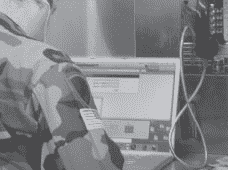

很明显他是美国军方的一员。他制服上的标志和徽章透露了很多信息，尤其是对于那些有军事知识的人来说。虽然某些对手可能会因为他的军事背景而对他感兴趣，但任何一个非技术黑客都可以通过观察这个家伙周围的装备学到很多东西。

首先很明显他是 Mac 用户。他正在使用 Mac PowerBook，他的白色耳机是 iPod 的标志性物品。屏幕外的 Mac Addict 杂志证实了这一点——他是一个真正的 Apple 粉丝。更仔细的观察揭示了他也是一个游戏玩家。他的 dock 中的图标（如下所示）意味着他安装了魔兽世界（WoW）和 Ventrillo 语音通信软件。

一个社会工程师可能会利用这些知识来谋取利益，选择要么与他进行一场关于魔兽世界或 Windows 的对话。但许多非技术黑客会避免社会工程，除非绝对必要。通过靠近这个人来冲浪，对手可以学到很多，正如我们将看到的。

但我必须说，我对发现这个特定目标背对着世界，戴着耳机感到惊讶，尤其是考虑到我最近发现的“路上战士”指南。

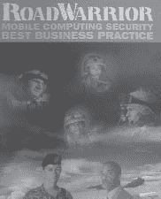

这份指南包括一个方便的撕下来的钱包卡片，提醒“路上战士”“确保不要在公共场合展示内容：肩窥”。该指南还主张“成为一个警惕和警觉的旅行者”。

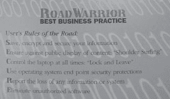

然而，正如你可以从下一张照片中看出的那样，靠近这家伙很简单，这要归功于他大声放着耳机，而且他面向角落的位置。

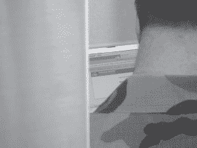

事实证明，他并不是随意浏览网页——他正在登录 BEA WebLogic 服务器的管理控制台。考虑到 Weblogic 是重量级的工业级软件，可以安全地假设他正在忙于工作——也许甚至是官方的美国政府业务。当他输入凭据时，我迅速调整了相机，拍了另一张照片。闪光灯闪烁，目标急转身，终于注意到了我。我低头看着相机，揉了揉眼睛，假装被自己的闪光灯弄瞎了。他耸耸肩，回到工作中，我想他相信我是某种刚刚摸清门道的数码相机新手。这位路上的战士并不*想*假设我在拍他的照片。当然，那可能会给他带来各种不愉快。所以他做了大多数便携式电脑用户会做的事情——他假设了最好的情况，然后回到了工作中。这让非技术黑客的工作变得更容易。

扔下来！

我并不是建议你对每个可能在窥视你的怪人进行身体冲撞。我建议的是，如果你认为自己是目标，并对其他事情感兴趣，比如喝咖啡，那就关闭你的电脑。大多数非技术黑客会知道他们已经被发现，然后离开。如果他们离开了，当他们离开时，随意地留意他们，并试图在他们逃跑之前好好看看他们和他们的车辆/自行车/滑板/赛格威。当他们离开后，看看你正在做的事情，考虑所有都已泄露，并相应地采取行动。如果你的窥视者在你关闭盖子后没有离开，无论如何都要继续留意他或她。如果他或她继续表现可疑，就采取行动。通知经理、保安或监考员。做*点什么*。如果那个行动涉及到身体暴力，千万不要告诉法官这是我的主意。

## 飞机间谍活动

下一个例子发生在商业客机的 30,000 英尺高空。飞机上是很难偷窥的，因为一个窥视者通常只能查看周围的人或者在厕所附近的通道上，那里的乘客倾向于待在那里。在其他地方窥视陌生人会让卧底空中警察感到紧张。

由于我在旅行时几乎没有睡觉（有那么多的非技术性黑客需要做，谁能睡觉呢？），我清醒着捕捉到了下一排发生的深夜笔记本电脑派对。起初，我对此并不是很感兴趣，因为我坐在对面的窗口位置上，旁边的走廊位置坐着一个清醒而过度摄取咖啡因的陌生人。但是，当我的邻居站起来去洗手间时，我忍不住拍了一张大开眼界的照片。我关闭了闪光灯，拍下了下一张照片。

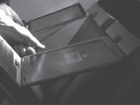

照片很无聊，角度太尖锐了，但当我观察这个人的时候，我意识到他的整个举止都在表明他是*政府*的。他的翼尖鞋很好，但并不是太好。他的文件夹明显是政府发放的，而我偷窥到的他的手提包里似乎有某种政府徽标。我不感兴趣地再观察了几分钟，直到我的遮挡相机的邻居回来。当他坐下来时，他拿起了飞行杂志并开始翻阅。我觉得解脱了。尽管这场偷窥可能很好，但是偷窥仍然是一项艰苦的工作。但是命运似乎并不完全如此，游戏才刚刚开始。这个政府雇员拿出一本装满了看起来有趣的文件的笔记本。从飞机的另一边拍摄那些文件似乎有点棘手，但我举起我的外套做了一个临时的窗帘，调整了一下变焦，迅速拍下了一张照片。似乎没人注意到。

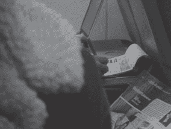

更多的文件浮出水面，我被它吸引了。尽管我通常不是那种跟踪政府雇员的人，但我知道这家伙正在做一些重要的事情，而且他似乎不在乎谁在看他做这些事情。我接受了他的邀请，最终瞥见了一个引人入胜的标题页。我没来得及把相机拿出来拍下下一张照片。

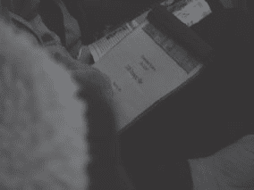

页面（用怪兽标题字体编写）上写着*政府系统 EW/SIGINT 2006 战略计划*。任何业余的 GoogleDork 都能告诉你，“EW/SIGINT” 在军事术语中意味着电子战信号情报。当我意识到自己在 3 万英尺高空浏览政府的 2006 年电子战信号情报战略计划时，我感到心跳加快。我立即停止拍摄我那个粗心的联邦朋友，并从那时起就被黑色直升机跟踪。不过我并不太担心，因为现在我知道如何用一块廉价的数字手表和一小片胶带来禁用他们的电子系统。尽管有时晚上我妻子会抱怨噪音。

### 抢劫银行

通过他们的电子和物理安全系统，银行成为了高安全性目标前五名之一。但在这个行业中我学到的一件事是，即使是最好的安全系统也存在一个共同的缺陷：懒惰的人类。当我经过这家银行时，我真的没有打算在接下来抢劫它。

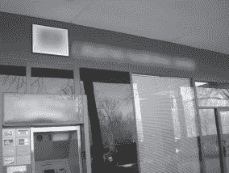

但当我走过前门时，我瞥见银行经理坐在他的角落办公室里，正在处理他的计算机系统。我停下脚步，转身透过窗户看着他。虽然他在我视线范围内，但似乎没有注意到我。我掏出我的（随身携带的）相机，后退一步，拍下了下一张照片。

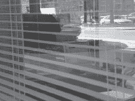

他毫不知情地转过身，在他的办公桌上开始处理一些文件工作。我仍站在原地，将相机对准他的屏幕拍了一张照片。我查看了图片，意识到相机对焦在他的百叶窗上，使屏幕上的文字完全无法辨认。经理继续在他的办公桌上工作，所以我调整了焦距（这花了我一些时间，因为我很少需要这样做），拍了几张照片。最终，我得到了一些像下面这样的照片，完美清晰地捕捉到了屏幕上的文字。（方框内的区域未经修改—我已经模糊了其余部分以保护无辜者。）

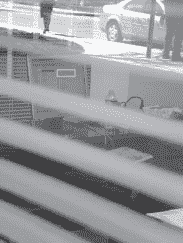

当我站在那里，通过相机的 LCD 屏幕阅读银行经理的屏幕时，我意识到——从银行偷钱*是如此无聊*。银行拥有的信息远比他们保险箱里的实际流动资产更有价值。无论是专业罪犯还是业余身份盗窃者都可以轻松地变现银行的信息库，获得数百万美元的现金，而风险比冲进大堂并劫持人质要小得多。我想知道个人信息的一屏可以卖多少钱。当我考虑如果我是坏人我会多富有时，银行家从他的办公桌上站起来离开了办公室。我再次调整了变焦并拍摄了他办公桌上的一些文件。最终，变焦设置合作了，我拍摄了他的文件的清晰图像。

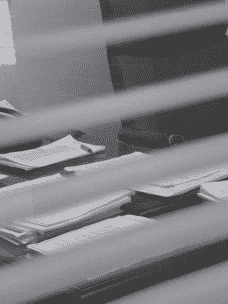

我从未想过一个没有技术的黑客如何简单地从银行获取信息。我查看了他办公室的其他部分，并拍摄了一些像下面这样的照片。

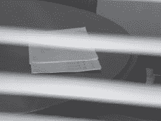

我检查了这些图片，发现它们都清晰无比。经过几分钟，经理从办公室门走了回来。当我站在那里，相机对着他的客人桌，我想知道我是否已经得到足够的信息可以在黑市上出售，以支付我的保释金。我从未想到他实际上可能已经去警告安全人员关于他的新窥视黑客朋友。他在桌子周围走动，调整了他的腰带和裤子，然后一头扎进了他那充满弹簧的椅子里，甚至没有看我一眼。

我等待了一些紧张的时刻，完全预料到会被一个爱扳扳板机的银行保安电击。但事情并没有发生。我转身继续经过办公室，几乎撞上了一名正在吸烟休息的办公室员工。那名员工没有注意到我——他正忙着在他的手机上聊天，就在银行家的办公室外。我突然意识到，银行家“屏蔽掉了”在他办公室外逗留的每个人。他已经习惯了路过的人，现在他窗外的每个人（包括没有科技的黑客类型带着相机的人）都是一个无害的无关紧要的存在。安保人员经常遇到同样的问题，他们在监视录像监视器上连续观看几个小时后，对于什么也不发生已经习以为常了，当最终发生了某事时，他们却错过了。

我能拿到这些照片的复印件吗？

呃，不。让我再说一遍。我不是坏人。如果我是，我要么富有，要么在第 13 号牢房里嫁给巴巴。因此，我有着相当高的道德标准，只是在提高我职业生涯中利用的威胁的意识。我也不是在处理我目睹的每一个潜在威胁，比如这个银行的问题。大多数人不太喜欢我这样的人去拨弄他们的东西。

当我在银行进行后来的（合法的）访问时站在出纳员柜台前，我的目光漫游到柜台后面的技术设备上。我掏出手机相机拍下了下面的照片。

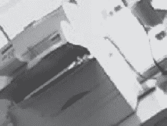

这张小小的、模糊的、经过大幅修改的（保护我的后端）打印机照片看起来并不起眼。抱歉。但我包含它有两个原因。首先，如今几乎可以在任何地方拍照——甚至是武装警卫挂出的机场海关桌子，所有的标志都写着“禁止拍照”。

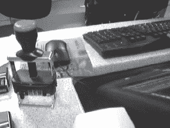

我包含打印机照片的第二个原因并不是因为打印机本身，而是因为顶部的贴纸（模糊等等），清楚列出了银行用于计算机支持的 I.T.公司的名称和电话号码。如果你认为装扮成电脑维修人员只在电影中起作用，那就再想想吧。我成功地做过几次。而且当我这样做时，我并没有奢侈地知道实际的 I.T.支持公司是谁。

### 在非洲乌干达抢银行

最近在非洲乌干达进行的一次宣教之旅中（参见[`johnny.ihackstuff.com/uganda`](http://johnny.ihackstuff.com/uganda)），我并没有完全进入无技术的黑客思维模式。毕竟，这是一个与我在美国家中完全不同的地方。但当我站在金贾市最大银行的一个 ATM 机前时，我不禁注意到银行每扇锁着的门上方有一种奇怪的开放式铁栅栏。我忍不住拍下了下面的照片。

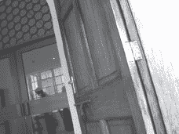

当我看着取景器中的照片时，我的脑海中充满了这种围栏可能带来的所有潜在安全问题。我的导师文斯可能会对这种设置感兴趣。晾衣架的把戏可能被用来打开门或阻挡安全摄像头，或者……我的思绪被一个推搡打断，我转身。一个表情不悦、手持威胁性步枪的男士站在我身后。“不准拍照。把相机收起来，”他说，几乎（但并不完全）礼貌地。

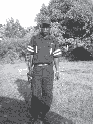

步枪令人印象深刻，制服更令人印象深刻。他的帽子和翻领上印有一个标志，上面写着“严密安全”。讽刺的是，我在一个许多人可能认为是第三世界的地方，却面对着也许是我在任何地方见过的最好的安全系统。我瞥了一眼那个人的肩膀，突然注意到另外三名同样武装和着装的保安沿着银行的外围。

“太棒了，”我微笑着说。

保安的表情松弛了，微笑消失了。“把相机收起来，”他说。我低头看了看，意识到我仍然拿着相机。我清了清嗓子，把相机收了起来。真是太棒了。
