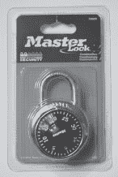
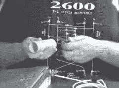
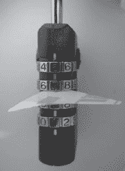
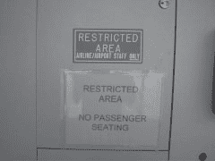

第四章：物理安全

锁是一项严肃的业务，而锁匠则是真正的工程师，大多数都有多年的实践经验。但是当你将受人尊敬的老行业锁匠行业与黑客的创新结合在一起时会发生什么呢？那时，魔法就会再次出现。你和我曾依赖的锁被无技术工具如钢笔、电子牙线器和卫生纸卷击败；保护我们物品的组合锁的几万种组合在不使用任何工具的情况下不到三分钟就被破解；政府强制我们在行李上使用的锁也被由苏打罐衬垫和废弃的塑料碎片制成的工具攻破；而最令人不安的是，保护我们孩子免受伤害的枪支锁在聪明地使用饮管后就会被打开。一旦我们的锁被这些琐碎的攻击击败，我们就依赖于我们的摄像头、运动传感器和报警系统，只见它们也被轻易地绕过。听起来很严重吗？确实如此。我们将邀请一些世界上最杰出的专家加入我们，并且我们在路上会玩得很开心，但我相信当你逐渐穿越最长最深入的章节时，你会感受到安全景观上空的阴云。欢迎来到物理安全世界，无技术黑客风格。

# 介绍

我记得我的第一个物理评估。我想象自己撬锁和禁用电子监视系统。我想象自己是电影《异形》中的那个海军陆战队员，哈德森（由比尔·帕克斯顿饰演），在电子锁中疯狂地摆弄着电线，试图让他的团队安全进入内部。尽管我最终在现实生活中闯入了各种令人惊叹的地方，并最终绕过了许多电子监视系统，但我从未不得不诉诸于撬锁。更简单的技术总是占优势。在本节中，我将分享一些初学者犯罪者和经验丰富的专业人士都依赖的无技术技巧。

# 撞锁

撬锁是一项技术练习。它需要对锁的机械结构和内部有所了解，而且完善技术需要相当多的练习。*撞锁*则属于无技术黑客范畴。这种技术涉及使用*撞钥匙*，这些钥匙是通过切割一个钥匙空白而制成的，使得每个切割都达到最大深度，而尖端和肩部被磨平了约半毫米。对于训练有素的眼睛来说，撞钥匙具有非常明显的外观特点。切割得太均匀，就像下面照片中所示的那样。

（经 Toool 批准——开放撬锁组织）

这种技术是通过将撞钥匙插入锁中，轻轻转动并轻击钥匙来实现的。锁内底部的内部销被推动，将动量传递给位于其上方的销。当顶部销向上飞起时，底部销保持在下方。当销分开时，插芯可以转动，如果操作正确，锁将打开。用撞钥匙绕过锁比用传统的锁挑选集或电子挑选设备挑选锁需要更少的技巧。这意味着只要有合适的撞钥匙，几乎任何人都可以破解一个易受攻击的锁。有关预防和识别易受攻击的锁的更多信息，请参阅侧边栏中提到的参考资料，或联系专业的锁匠或安全提供商。

撞击信息宝库

撞击锁已经存在很多年了，但由于最近的几部作品而变得流行起来。Marc Tobias 的书籍*Locks, Safes, and Security^(1)*是专业人士的绝佳参考书，其中包括了关于撞击（有时被称为“敲击”）的精彩内容。他的网站([`security.org`](http://security.org))和警报页面([`security.org/dial-90/alerts.htm`](http://security.org/dial-90/alerts.htm))也是绝佳的资源。如果你正在寻找更易获取的材料，我强烈推荐由 Toool 的 Barry Wels 和 Rop Gonggrijp 撰写的精彩白皮书“Bumping Locks”([`www.toool.nl/bumping.pdf`](http://www.toool.nl/bumping.pdf))，以及他们在[`connectmedia.waag.org/toool/whatthebump.wmv`](http://connectmedia.waag.org/toool/whatthebump.wmv)上的精彩视频工作坊*What the Bump?*。Toool 网站([www.toool.nl](http://www.toool.nl))有大量资源和视频，我强烈推荐。

## Shimming 挂锁 *(与 Deviant Ollam)*

*Shimming*是使用薄工具绕过或禁用锁内的闩机制。通过在锁内的正确位置工作一张或一片材料（通常是钢或铝），可以迫使负责保持锁舌或螺栓的组件被推到一边，从而释放机制。这通常只有在锁的关键元素完全依赖于弹簧压力才能点击到位时才可能。实质上，shimming 使锁操作起来就像用户正在*锁定*一样。如果将挂锁关上需要一个小杆滑开，shimming 就是专注于让那根杆滑开。这类似于经典的“信用卡”攻击，其中使用信用卡将锁定的门的闩推开。

下面的照片显示了一个传统的 Master^®品牌组合锁在被撬开后的样子。撬片被滑入锁体，进入保持杆和锁舌凹槽之间的腔室。这个动作会打开锁。

照片由 Deviant 提供

有几种方法可以确定一个锁是否可以撬动。其中最简单的方法之一是打开锁，并用小工具如挑子或扳手工具戳测保持条（位于锁体内的挂钩室内）。如果条可以轻易被推开，那么它是带弹簧加载的，很可能可以被撬动。如果你感觉自己被拉入了一个未知的锁技术的荒野，并被抛弃，让我试着简单解释一下：你可以用细棍戳一戳锁的敏感部位，看看它是否可以用同样的细棍打开。这并不是一个太过于泛化的说法。

有些锁在挂钩的两侧都有凹槽，就像下一张照片中显示的那样。这种锁很容易被探测和撬动，因为尽管有两个凹槽，但锁具有一个单一的简易保持条机构，意在无论锁体何种方式固定，都能容纳锁体。

照片由 Deviant 提供

如果一个多凹槽锁包含两个单独的保持条，那么撬动可能会变得更加困难。由于挂锁的构造方式，给这两个条中更隐蔽的一个进行“戳测”是不可行的。但测试一个条就足够了；如果锁的保持机构的一侧带有弹簧加载，另一侧可能也是如此。撬动多凹槽锁的问题在于你必须使用两个撬片，一个用于每个凹槽。如果挂钩沿着横梁的缝隙很紧，这可能会引起问题。商店购买的由弹簧钢制成的撬片往往过厚，这意味着攻击者必须使用更薄的东西，比如来自苏打水或啤酒罐的铝条。认为这仍然是太多的技术废话？记住，我们现在谈论的是用*两*根细长的棍子打开锁。通常。

我可以给你拿点什么吗？啤酒，苏打水？

黑客们和啤酒罐是什么关系？是的，你可以用铝罐制作一个非常不错的撬片。它明显是低技术的，而且效果非常好，但为了避免这本书成为罪犯的指南，我只会给你提供一个 URL，让你了解 Deviant 的一篇很棒的概述：[www.i-hacked.com/index.php?option=content&task=view&id=189](http://www.i-hacked.com/index.php?option=content&task=view&id=189)。

一定要测试你的锁抗撬的能力。对于一个业余者来说，确定一个锁是否能被撬动可能会很困难。例如，下一张照片中的锁是一种 Master 锁，它在大多数零售店都很容易买到。这通常意味着你所得到的东西与你所付出的相符，但它采用了双球机制，不可撬动。

照片由 Deviant 提供

这里有一些选择（无意冒犯）抗撬锁的技巧：

1.  一个不需要任何钥匙或密码就能*关闭*的锁几乎总是内部带有弹簧加载装置，因此容易受到撬开的影响。

1.  在使用过程中操作钥匙被永久固定的锁（称为*保钥挂锁*）通常不容易被撬开。

1.  在包装上宣传“双球”机制的锁很可能不容易被撬开。

1.  挂锁的锁扣或护套（主要目的是阻止螺栓切割器的使用）往往很难或不可能被撬开。除了难以被撬开外，这种锁通常由更高质量的构造组成，并具有提供更好安全性的锁定机制。

1.  锁匠通常会推荐某些品牌的挂锁。相信他们的建议。Deviant 推荐来自 Sargent & Greenleaf 的 8088 和 8077 系列锁，这些锁被用于国防部文件柜。这是双重认可。

## Master Lock 组合锁蛮力攻击

在我小时候，我记得看到 Master Lock 的酷炫广告，那把锁即使被步枪子弹穿透也能保持安全。对我来说，Master^®成为了安全的代名词。直到今天，许多人仅凭品牌名称购买 Master Lock。然而，不要仅仅根据品牌名称购买，因为几乎所有品牌都提供各种安全级别的锁。始终调查所有产品，确保您获得符合您需求的产品。例如，这款 Master Lock 1500D 组合锁在各处都有销售。

但是公司没有将这款锁宣传为高安全性锁。他们建议这种锁用于最基本的安全应用。尽管如此，我每天几乎都能看到这款锁用于高安全应用，尽管事实上有一种危险的蛮力攻击几乎使大多数版本的这款锁变得毫无用处。

*蛮力*攻击是一种技术，通过检查问题的每个可能解决方案来确定是否为解决方案。例如，在有三个滑块的滑片锁上，所有可能的组合都在 000 和 999 之间。如果有人从 001 开始，002、003，逐渐尝试每一种可能的组合，蛮力攻击保证他们将在一千次尝试中打开锁。如果对手有足够的耐心来完成攻击，大多数机械组合锁都可以被蛮力攻破——这就是锁的安全级别所在。

幸运的是，大多数坏人没有耐心去蛮力破解组合锁。以 Master Lock 为例，如果我们假设拨号盘上的每个数字都是活动的（事实并非如此），我们将剩下 40³或 64,000 种可能的组合。如果攻击者每 5 秒尝试一种组合——考虑到清除过程和左右转——可能需要长达 88 小时，或近 4 天的时间才能尝试完所有组合。按照这个速度，攻击者会失败，而不是锁。

我即将描述的一个快捷方式将组合数量减少到 100 个。每次尝试 5 秒钟，攻击者只需 8 分钟就能暴力破解 100 个组合。由于这本书是关于保护你自己的资产，我不会详细介绍使用这种技术打开锁所需的所有细节，但我会告诉你如何找出你组合的最后一个数字。如果你能发现组合的第三位数字，你应该选择更强的锁。更好的做法是请一位专业的锁匠评估你的情况。

首先，对锁的扣进行施加张力。一个简单的方法是用一只手拿住锁，用一根手指向上施加压力在杆上，如下一张照片所示。这个时尚的拇指环对这个练习是可选的。

接下来，开始转动拨号。如果施加了足够的张力，拨号应该会停在两个数字之间。我将这称为*粘点*。每个受影响的锁上有 12 个粘点。第一步是找到并记录每个粘点的位置。例如，这把锁的第一个粘点的下边界是，如下一张照片所示。

这个相同粘点的高边界是 2，如下一张照片所示。

这些数字之间的中点是 1.5，显然不是整数。要找到下一个粘点，释放扣上的张力，将拨号转过当前粘点的高边界，然后重新施加张力。拨号应该再次停在某处，显示出下一个粘点的位置。一些粘点会停在整数上。例如，下一张照片显示了下一个粘点的低边界是 7.5。

我知道你，亲爱的读者，明白我在谈论什么，即使没有这些图片，但让我们再看一张，这样我们就涵盖了偶数、奇数、高位和低位的粘点。这个相同粘点的高边界是 8.5，如下一张照片所示。

这意味着粘点停在。通过记录每个粘点，最终你会得到类似我在这个表格中得到的东西。

我的锁上的粘点

注意到超过一半的粘点不落在整数上。这些是诱饵，应从潜在组合数字列表中移除。在这个例子中，剩下五个数字：8、15、18、28 和 38。注意到大多数这些数字的末位数字都是相同的——数字八。这些匹配数字也应该从列表中移除，只留下一个数字（15），这是我锁的组合的最后一个数字。

如果这种技术适用于您的锁，那么锁很可能容易受到暴力破解攻击。如果这种技术不起作用，您可能有一把新型的 1500D 主锁。据推测（在[www.wikihow.com/Crack-a-Master-Combination-Lock](http://www.wikihow.com/Crack-a-Master-Combination-Lock)上），以数字 800 开头的 1500D 主锁的序列号不容易受到这种攻击，尽管有未经证实的消息报告称也成功地对这些新锁进行了攻击。无论如何，不要轻易抛石于主锁。做好你的研究，不要购买基本的安全产品来执行高安全任务。考虑购买更高安全性的主锁，或者咨询专业的锁匠或安全专家。

真实的情况！

有几个网站详细讨论了这个漏洞。然而，确定组合的第一和第二位数字涉及相当数量的数学和记忆。蒂姆“托尔”穆伦在 Syngress 出版的《入侵网络：如何拥有影子》中提供了一种他想出的快捷方式。这个故事由蒂姆、瑞安“蓝野猪”拉塞尔和我共同创作，讲述了黑客在现实世界中的能力的“扣人心弦”的故事。据说这个故事是虚构的，但是像主锁暴力破解这样的技术并不是。看看整个“入侵”系列，看看当黑客摘掉手套时你可能会遇到什么！

## 比较卫生纸和圆筒锁

圆筒锁被用于各种应用中，但它们经常出现在笔记本电脑安全设备中，就像下一张照片中所示的那样。

1992 年，BBC 报道称某些圆筒锁容易被不熟练的小偷绕过。十二年后的 2004 年 8 月，马克·托比亚斯，*锁，保险柜和安全*的作者，发现肯辛顿和 Targus 在他们的笔记本电脑锁产品中使用了类似的圆柱轴设计。他的报告表明，这些锁可以很容易地被钢笔或卫生纸筒绕过。2004 年 9 月，克里斯·布伦南在他的论坛（[www.bikeforums.net](http://www.bikeforums.net)）上描述了一个昂贵的克里普顿自行车锁（使用相同的圆柱轴设计）如何被一支 Bic 笔绕过。克里斯在[www.bikeforums.net/video](http://www.bikeforums.net/video)上发布了视频，引发了媒体的狂热报道。

巴里·韦尔斯（Barry Wels）来自 Toool。在一个黑客会议上演讲时，巴里制作了一个视频（[`www.toool.nl/kensington623.wmv`](http://www.toool.nl/kensington623.wmv)），展示了如何将绕过技术应用于特定的肯辛顿笔记本电脑锁系统。黑客社区发现这个视频很有趣，但一般公众却对他用卫生纸卷的纸板在短短几秒钟内完成绕过技术感到震惊。

尽管总是有人猜测谁是第一个想到某个想法的人，但将近一百万人从巴里的网站上下载了视频，无数其他人则从 YouTube.com 等网站下载了它。我喜欢巴里的视频，因为它非常易于理解，并清楚地展示了我在这本书中试图展示的内容，即即使是最复杂的安全系统也会受到简单攻击的威胁。如果你的笔记本电脑上有敏感数据，并且你依赖于单一的锁定设备来保护这些数据，那么无论这个锁是否容易受到这种攻击，你都很可能会遭受损失。每当你依赖于单一层次的安全性时，你都很可能会受到威胁。笔记本电脑锁不是一个坏主意，但如果你担心在设备上丢失敏感数据，还是考虑一些加密解决方案吧。最重要的是，试着像一个黑客一样思考。在那种思维模式下，一个纤细的电缆是最好的解决方案吗？

## 电动牙线：一个经典的低技术产品

开锁需要真正的技巧。要做到这一点，你必须对锁的操作原理有所了解，并且需要练习。随着新设备的出现，如开锁枪和其他电动工具，开锁似乎比以往任何时候都更容易。但是，这些工具并不是百分之百可靠的。它们需要相当的技巧才能成功操作。此外，它们价格昂贵。大多数业余爱好者不会考虑在不百分之百可靠的专业设备上投资一小笔财富。

尽管如此，对于新型的电动牙线设备，如这种设备，垂涎欲滴的东西仍然有一定的吸引力。

我不确定是谁想到了黑客这个天真无邪的东西，但有人确实想到了。结果是一个微小而廉价的电动开锁枪。根据 Inventgeek.com 的杰瑞德·布克的说法，这个小装置，即使与临时张力扳手结合使用，也能在几秒钟内打开大多数挂锁。

这种黑客行为涉及修改牙线以接受更强的电源。然后，将牙线插入锁中时，它可以产生足够强的震动来摆动卡柄从锁定位置解开。一定要查看 [www.inventgeek.com](http://www.inventgeek.com) 获取更多信息，并确保全力以赴地攻击任何你看到悄悄靠近的人携带电动牙线的情况。他们肯定在做些什么。

## 笔记本电脑锁被啤酒击败 *(与马特·菲德勒和马克·韦伯·托比亚斯合作)*

许多组合锁容易受到一种称为“探测门”的攻击的影响。在这种技术中，使用小夹板来探测锁的组合转轮（如下图所示），试图找到“门”或开口，以显示组合并最终打开锁。2004 年 8 月，Security.org 报告称，Targus Defcon CL “计算机电缆锁”（型号 PA410U）容易受到这种攻击方法的影响。

照片由马克·韦伯·托比亚斯提供

因此，Targus 重新设计了他们的锁以解决这个问题。锁的新版本（Defcon“装甲”CL，型号 ASP10US）配备了新的装甲电缆。分析验证了 Targus 通过将门移到锁芯的内部来解决初始问题。然而，发现了一种新的方法，使锁暴露于通过锁体末端的组合更改螺钉探测的风险。这种技术将允许攻击者探测门（逐个滑块），但是为了执行此攻击，坏人需要移除塑料外壳，或者在外壳上滑入非常薄的垫片。

照片由马克·韦伯·托比亚斯提供

这就是啤酒罐的作用。此攻击需要厚度为 0.015 英寸或更少的垫片。物理安全专家马特·菲德勒（Matt Fiddler）和马克·韦伯·托比亚斯发现，从啤酒罐切下的带只有 0.005 英寸厚的带子完美地起作用。

照片由马克·韦伯·托比亚斯提供

但是对这种锁的滥用仍在继续，迈克和马克揭示了电缆本身也可以被攻击。为此，坏人首先需要将电缆上的薄塑料涂层去除。如下一张照片所示，一个香烟打火机可以迅速去除薄 PVC 涂层。

照片由马克·韦伯·托比亚斯提供

在去除 PVC 外壳后，锁可以被普通的斜口钳夹住并切断，如下一张照片所示。

正如这些测试所显示的那样，在选择任何安全设备时都要保持警惕，但是笔记本电脑锁尤为重要。笔记本电脑上的数据往往比硬件本身更有价值。明智地投资并进行适当的测试。在使用任何安全设备之前进行研究总是划算的。

## TSA 锁（与马克·韦伯·托比亚斯合作）

由于 911 事件后加强了航空安全措施，交通安全管理局（TSA）禁止在行李上使用标准锁。但是，他们允许使用“TSA 锁”，乘客可以锁上并由 TSA 代理打开并重新锁定，而不影响乘客设定的组合。这些锁如下图所示，在全球各地的航空行李终端已经变得司空见惯。

本节中所有照片由马克·韦伯·托比亚斯（Marc Weber Tobias）提供。

马克·韦伯·托比亚斯对这些锁进行了审计，并在一篇名为“TSA 批准的行李锁”的论文中发布了结果（[`download.security.org/tsa_luggage_locks_report.pdf`](http://download.security.org/tsa_luggage_locks_report.pdf)）。他的总结是一个非技术性黑客的梦想成真，概述了锁本身的弱点，但也指出大多数上锁的行李都很容易被打开，而不需要摆弄锁：

*本报告中检查的每种机制都可以在几秒钟内轻松绕过，而无需任何特殊工具或专业知识。乘客不应依赖这些锁提供任何安全性。尽管行李处理专家指出行李可以通过切割外部材料或绕过拉链轻松打开，但在作者看来，真正的问题是第三方引入违禁品，或者对盗窃内容的延迟检测。本报告检查了每种类型的锁及其对秘密进入的脆弱性。*

Marc 发现许多锁可以用像下面展示的简单金属或塑料条打开。

他的论文继续描述了如何使用门探测技术（就像用于打开 DEFCON CL 系列锁的技术）可以用于每个 TSA 锁。拿着像下面展示的这样一块塑料，对手可以逐个轮和值确定锁的组合。

在某些情况下，对手可能需要进行一点简单的加减法来确定锁的真实组合，但我们在这里讨论的是二年级的算术，而不是代数。

与 SploitCast 有关的 IT 专业人员 Ross Kinard 并不喜欢 TSA 锁：*因为[TSA 锁]大多是*“芝麻”*锁，大多数继承了其他*“芝麻”*锁的问题。那些不是*“芝麻”*锁的可以被拆开以了解主钥匙的钥匙深度。根据我的经验，002 可以使用几乎任何可以放入钥匙孔并摇动的金属片打开，而随[...]一起提供的钥匙可以磨平以适用于[其他 001 锁]。004 只需要一个小而坚固的金属片来转动[内部凸轮]，而随 007 一起提供的钥匙适用于所有其他 007。* Marc 的最终判断确实是毁灭性的：

*很明显，没有一个经过 TSA 批准的锁提供任何对隐蔽进入的安全措施。用户的问题必须是“需要什么安全措施来保护我的行李免受偷窃？”答案显然不仅仅涉及锁，也许行李永远无法真正安全[...]。*

*这份报告的结论非常简单：不要依赖这些锁提供任何安全级别。它们只是一种昂贵的封条，可以重新设置。一个有知识的人可以通过解码组合来打开任何这些锁，几乎不需要什么培训或专业知识。而且，任何人都可以在任何地方购买这些锁，所以在盗窃之前练习并不是问题。当然，使用钥匙会使任务变得非常简单，并且几乎任何接触行李的人都可以打开它。*

我们的建议与专家的观点一致：将托运行李中的内容视为任何有足够动机的人的公共财产，无论是机场员工还是其他人。携带你不舍得丢失的东西，并对你的行李离开你视线一段时间后保持怀疑。

## 枪扳机锁与吸管 *(与马克·托比亚斯和马特·菲德勒)*

当我开始考虑我将在本书中包括的物理无技术黑客攻击列表时，我从未考虑过针对枪扳机锁的攻击。简单的事实是，在我的工作中我很少遇到它们。但由于马克·托比亚斯和马特·菲德勒的良好声誉，我翻阅了他们的“枪锁报告”，可从[`download.security.org/gunlock_2007.pdf`](http://download.security.org/gunlock_2007.pdf)获得。我很惊讶地发现一个非常致命的无技术黑客攻击，我在这里粗略概述。虽然我认为在这里完全描述绕过技术不负责任，但我觉得有必要帮助马克和马特宣传他们报告中涵盖的劣质锁的危险。如果你有本节描述的任何锁，请立即用更安全的型号替换它们。

最荒谬的攻击集中在 DAC 扳机锁（如下所示），这种锁可以在包括沃尔玛和 K-Mart 在内的主要零售连锁店找到。

这把锁由一个典型的贝壳设计组成，它遮蔽了枪的扳机和护卫。这些半部分由一个螺纹螺栓固定在一起，该螺栓与提供的钥匙相配。在锁定位置时，螺栓的头部凹进锁体内。马克和马特发现，麦当劳的吸管可以相对容易地用于打开锁，如接下来的两张照片所示。

照片由马特·菲德勒提供

罗斯·基纳德补充说，随锁附带的钥匙可以被磨成一种方式，以便打开所有其他 DAC 品牌的枪锁。报告继续说，许多其他品牌的枪锁也容易受到威胁，包括某些万事达锁，雷明顿和 Winner International 锁，其中一些可以被一个孩子用冰锥或尖锐的螺丝刀打开。事实上，马克报告说，下面显示的每个扳机锁都存在严重的漏洞。其中包括但不限于美国司法部“儿童安全项目”枪电缆锁；万事达扳机锁型号 90、94 和 106；DAC MTL 100 扳机锁；弗兰岑组合锁；GSM 枪扳机锁和 Winchester 枪箱。

美国消费品安全委员会在其网站 [`www.cpsc.gov`](http://www.cpsc.gov) 上维护着一份召回产品的列表。许多负责任的供应商，如万事达锁，已经对他们的产品发布了召回通告；例如，下面所示的 Model 90 的某些版本。您应该搜索 cpsc.gov 网站以确保您的锁没有被召回。我在此克制自己不做任何关于枪支锁的俏皮评论。这个话题太严肃了。

枪支安全

如果您拥有枪支，它们应该使用高质量的扳机锁进行锁定，并存放在锁定的柜子内。注意负责任的钥匙控制，并对枪支的安全性保持警惕。最重要的是，请让专业锁匠评估您的安全安排。

## 入侵技术：Loiding *(又名老式信用卡窍门)*

看起来好像每个人都知道信用卡的窍门。实际上，这是一个普通人在合适的情况下可以毫不费力地完成的入侵技巧，甚至不需要训练。然而，我似乎总是碰巧遇到合适的情况，因为我用这个技巧的频率有点太高了。这种技术的技术术语是*loiding*。它的工作原理很简单。要通过锁定的窗户，攻击者可能会尝试在窗户框之间滑入一张信用卡（或一根薄而坚固的铁丝），以使插销转到解锁位置。要通过一扇门，攻击者将把卡片插入门击垫和门闩之间，试图将闩从门击垫上分离，这将打开门（假设门上只有一个已锁定的锁）。

门板和门框之间必须有一定的间隙才能使这种技术奏效。下图显示了夸张的间隙。

好吧，那更像是一道门的*裂缝*，如果不是那个聪明的安全装置（钢板）遮住了它的话，很容易把手指伸进去。这个钢板解决了信用卡问题，但是从下一张照片中可以看到（从门缝内向下拍摄的闩机构），门缝非常巨大，另一种类型的工具可以用来绕过门。

一个没有高科技的黑客不会因为这个错位的安全措施而感到畏缩。看一眼周围的环境，就会发现下一张照片中显示的垃圾桶。

在确保垃圾桶里没有有趣的文件之后，一个没有高科技的黑客很可能会拿起一小段网络电缆。如下图所示，它恰好可以完美地放入门缝中。

简单一拉，门就打开了，如下图所示。

我经常惊讶于这种技术经常奏效。我已经使用了无数次，而且客户很少高兴地听到他们的安全系统被一些垃圾打败了。在你关心的安全系统中，注意这种漏洞。现在，我知道这一章比其他许多章节都长，但物理安全不仅仅是锁。在下一节中，我们将看看其他经常被无技术黑客滥用的物理安全设备。所以拿些咖啡，尽量不要在去咖啡机的路上看到每个门或锁时感到恐惧。我们还有更多内容要讲。

## 进入技术：运动传感器激活

尽力忽略本节标题中的 *运动传感器* 这几个字。从你的脑海中清除了吗？现在，清晰地看一下下面照片中的锁定入口。无技术攻击的选择有哪些？

照片由拉塞尔·汉多夫提供。

嗯，首先墙上安装了一个读卡器。技术攻击者可能会考虑克隆卡片或拿出工具来拆卸那个东西。我要对任何足够精英的人给予赞赏，他们可以用鳄鱼夹和螺丝刀绕过这个东西。但这不是我们感兴趣的攻击。

下一个要检查的可能是门和框架之间的容差。容差很小，尽管门闩清晰可见，但锁不易被开启。一个更温和的选项可能是以某种方式社会工程化地对员工进行操纵。尾随也是一个选择，但这两种更温和的选项可能会使员工意识到事情不太对劲，即使攻击最初成功。最好的选择是等待和观察。不可避免地，一个员工会出来，一个无技术黑客会看到出口程序的使用情况。

正如我在介绍中提到的，文斯教给了我一个经常比进入建筑更容易的建议。每次我闯入客户的安全建筑时，我都利用了这个简单的事实。在这种情况下，等待了几分钟后，这个建议得到了回报。一个员工通过门出去，发出了令人震惊的 *shi-clack*声。由于员工并没有刷卡或抓住门把手出去，问题就变成了：这个过程是如何进行的呢？通过窗户一瞥到门内部，几乎什么也没看到。看不到任何推杆，也没有任何锁或按钮的证据。门内侧的把手与外侧的完全相同。答案不在于所 *看到* 的，而在于所 *听到* 的，特别是 *何时* 听到的。

那声音是独特的哐当声，是一个磁锁解锁的声音。有很多方法可以禁用磁锁，但这不是这次特定攻击的目标。目标是解锁磁锁的运动传感器。这两者都显示在下一张照片中，从被锁定区域内部拍摄。

Russell Handorf 提供的照片

对于一个非技术黑客来说，运动传感器的存在是显而易见的，有两个原因：员工到达门前时门就打开了，并且通过窗户看到，员工没有采取特定的动作来解锁门。运动传感器完成了所有工作。允许员工在没有特殊钥匙或程序的情况下离开区域不仅仅是为了方便。在火灾中，这种设置可以挽救生命。

一个熟练的非技术黑客可以简单地绕过这个系统，而且方式多种多样。向文斯致敬，我们选择使用下一张照片中展示的垃圾。

Russell Handorf 提供的照片

将毛巾固定在直挺挺的衣架上，用一点牙线，一个非技术攻击者可以制作一个旗帜，可以滑入门底并挥舞。最终它会触发运动传感器，解锁这扇门。测试你的退出程序。你的出路可能是对手最好的入口。

用玩具击败运动传感器？

当然可以。如果你能够将一张简单的白纸滑入门上方并让其在传感器旁边飘动，那么这些传感器可能会被绊倒。折叠成纸飞机会更有趣。将它折叠平，从门缝中塞入，然后让它飞起来。甚至气球——用来做气球动物的那种长长的、扭曲的气球——也是很好的非技术工具。只需将其塞入门底，然后充气并开始挥舞。只要确保事先告诉每个人你正在测试安全系统。被门撞到头可不好玩。

## 绕过被动红外（PIR）运动传感器

被 passivr infrared（PIR）运动传感器用在许多复杂的警报系统中，但基本系统相对容易绕过。你看不到 passivr infrared 领域，因为它们不发射红外线（见侧栏）。相反，它们检测红外能量，比如从人体辐射出的能量，或者至少是比 93° 华氏度更暖的人体。

观察红外光

如果你需要检测红外光，试试使用数码相机的取景器。这张照片显示了通过数码相机取景器看到的通常看不见的红外光，它来自于电视遥控器发出的红外光。

这种类型的传感器对其监视的红外领域的突然变化很敏感，这意味着它们可以通过缓慢地进入并穿过其监视领域来绕过。Ross Kinard 给我发来了这张照片，显示了一个入口，上面有一个 PIR 传感器安装在左门口上方。

Ross Kinard 提供的照片

Ross 在下面的图表中描述了他成功绕过传感器系统的过程。

照片由罗斯·基纳德提供

由于传感器被设置在图表左上角的两扇门上，对他通过对角门的入口视而不见。他走到对面的墙边，沿着墙边前进，大部分时间都不在传感器的范围内。到达范围边缘时，他聪明地直接转向红外光束。通过这样做，他能够保持每四到十二秒迈出一步的轻快步伐。据罗斯说：“那部分相当容易。困难的部分是穿过去到门那边。然后我走得非常缓慢，每次移动大约两到四英寸，每次移动之间间隔约六秒。这是我一直搞砸的地方。我没有意识到我需要走得多慢，但最终我成功了。”

在我最喜欢的电影之一《鬼影特工》（1992 年）中，马丁·毕晓普（罗伯特·雷德福德饰）穿着氯丁橡胶服，以应对运动传感器。他的同伴（里弗·菲尼克斯饰）事先通过提高房间温度来匹配毕晓普的体温。毕晓普痛苦地迈出缓慢的步伐，达到了目标而没有触发警报。根据令人敬畏的节目《神话破解者》的工作人员，这个场景的许多元素是真实的。在《犯罪与神话》的第二部分（[`shopping.discovery.com/index.html`](http://shopping.discovery.com/index.html)），神话破解者——卡里、格兰特和托里——对抗了几种安全设备，包括 PIR 和超声波运动传感器。他们发现“缓慢低调”的技术对超声波传感器也很有效，后者使用高频声音而不是红外光。他们还发现氯丁橡胶服会暂时隐藏入侵者的热签名，使其对 PIR 传感器不可见。但最终，服装会吸收入侵者的体热，使其再次对传感器可见。他们还尝试将房间温度提高到 98°F 以欺骗 PIR 传感器，但这个测试失败了——传感器立即触发。他们通过在传感器前放置一块玻璃片来绕过 PIR 传感器，但这只有在玻璃的温度接近房间温度时才有效。在最令人惊讶的测试中，卡里在穿越超声波场时在自己前面铺了一张床单，警报没有触发。

红外传感器在重大抢劫中被黑客入侵

在一次重大抢劫中，详细记录在[www.crimelibrary.com/gangsters_outlaws/outlaws/major_heists/2.html](http://www.crimelibrary.com/gangsters_outlaws/outlaws/major_heists/2.html)，一个聪明的小偷在营业时间内向红外传感器喷洒硅喷雾。这有效地使传感器失明，无法检测到硅涂层以外的热变化。

## 相机闪光

监控摄像头是我遇到的最常见的物理安全设备之一。但许多摄像头安装配置得如此糟糕，以至于一个业余人士可以轻松绕过它们。*闪烁*就是简单地使相机失明或过载，以至于无法记录任何有意义的东西。业余小偷多年来一直知道这种技术，但我很惊讶地发现它仍然对许多现代系统有效。来自费城地区的 CISSP Russell Handorf 提供了下一张典型相机安装照片。

照片由 Russell Handorf 提供

无技术黑客可能注意到的第一件事是相机的数据和电源电缆是裸露的。然而，在这个特定的安装中，电缆是装甲的，使其难以切断。此外，相机背面的电缆连接器是锁定的，使其难以拆卸。相机本身非常高端：Topica（索尼芯片组）型号 TP-936WIR-30C，配备 20 个 LED 红外夜视灯。

这个系统捕获的典型静止图像如下所示。

照片由 Russell Handorf 提供

那么什么是无技术黑客？我们称之为相机*闪烁*，其实就是用极其明亮的光线使相机失明。在下一张照片中，Russ 用 SureFire x300 LED 灯光闪烁。正如你所看到的（或者看不到的），相机被这束极其明亮的光线直接击中而完全失明。

照片由 Russell Handorf 提供

这种技术为攻击者提供了出错的余地。来自 SureFire 的间接击中或者来自较弱光线的直接击中都会产生不错的效果，就像下一张照片所示。

照片由 Russell Handorf 提供

其他光源也可以起到作用，即使距离很远。看看下一个图像捕获。这是我的“逮捕我”的脸。

用廉价激光笔快速划过会使我的脸难以辨认，就像下一个捕获所示。

下一个捕获显示了对镜头的直接击中的效果。正如你所看到的，图像中什么也看不清——相机完全失明。

你的监控系统容易受到这些攻击，你可能考虑使用更好的设备，安装额外的摄像头以覆盖多个角度，或考虑安装滤镜或反射罩以保护相机镜头。但请记住，放在镜头前的任何物体都会影响图像质量。在使用红外滤镜时要格外小心。它们可能会阻挡夜间照明所需的光线，从而有效破坏相机的夜视能力。

## 现实世界：机场受限区域 Simplex 锁绕过

简单锁（如下所示的锁）有着恶名昭彰的声誉。

著名的安全研究员米哈尔·扎列夫斯基对这样的锁进行了高科技攻击，他的结果简直令人瞠目结舌。在他的论文“使用热成像破解保险柜”([`lcamtuf.coredump.cx/tsafe`](http://lcamtuf.coredump.cx/tsafe))中，米哈尔表明，用户指纹残留的热量可以在几分钟后通过热成像设备检测到，如下图所示。

像《细胞分裂》这样的流行视频游戏也加入了这一行动。游戏中的照片显示了一个组合锁，就像山姆·费舍的热成像眼镜在一个卫兵输入组合后的片刻间隔之后看到的那样。

在我看来，米哈尔的真相比视频游戏的虚构更酷，但不管怎样，热成像都是一种相当棒的高科技攻击。但这本书是关于无技术的，所以让我们来看看无技术的选项。由于最常用的按钮上可能有一层薄薄的指纹油渍残留物，你可以用婴儿爽身粉洒在面板上，吹掉多余的部分，以找到组合按钮。或者你可以欺骗一个知道组合的用户触摸一些紫外线反应物质，这样当他或她触摸按钮时，你稍后可以用紫外线灯来看到哪些按钮被触摸了，有点像《国家宝藏》中的那个场景。你甚至可以用你强大的手眼协调能力和不易患上腕管综合症的特点来强行打开这些东西。

但到目前为止，我讨论的技术并不真正是无技术的。这些攻击需要实际的工具和一些装备，至少需要一些婴儿爽身粉。让我们完全放下技术，来进行一次真正的现实攻击吧。跟着我去机场，这里是一些最偏执和先进的安全系统的家园，我只带着我的眼睛和一个可选的数字相机，寻找一个理想的偷窥机会。

走过安检检查点后，我发现了几把 Simplex 锁，但它们看起来都像是管家的储物间。不过最终，我找到了一把 Simplex 锁，保护着一个看起来是办公室门的东西。门旁边是一个检查闸机的区域，当我走近时，一名飞行员走到门前，输入了数字并推开了门，露出了一个俯瞰跑道和一个计算机系统的有窗办公室。看到这把锁真的保护着一个真正的办公室，但很遗憾我错过了组合，我找了一个好地方坐下等待另一个飞行员再次输入密码。完美的座位应该相对靠近门，并且能够清楚地看到输入的按钮。我找到了完美的座位，就在我要坐下的时候，我看到了这个标志：

我忠实地无视了标志，坐在“受限区域”，拿出了我的笔记本电脑。我把相机放在键盘上，确保它不会被路过的人看到，并等待。我等待的时间不长。几秒钟之内，一个飞行员经过并按下了组合键。下面的静止图像可以说明问题。

尽管我已经以随机顺序呈现了这些静止图像（甚至可能删除了一两张），但信息仍然很清晰：肩窥监视很重要，特别是当你把热成像仪留在了其他裤子里时。飞行员推开门，让门敞开着。我举起相机继续拍摄。下一张照片显示了肩窥监视，第二轮。

我有意模糊了图像以保护无辜者，但即使如此，你能看到我看到的吗？我希望你能，因为这意味着这本书正在教会你一些东西。我知道你在照片中看不到任何东西，但你应该能够至少找出五个非技术型黑客会关注的项目以获取更多信息。你看到了吗？继续阅读之前试试看吧。

你觉得怎么样？显示器是个小事。我们在肩窥监视器上有一个完整的章节。那么显示器上的便签呢——一个小的，一个超大的？一个可能是条形码，另一个可能是任何东西。让我们深入一点。显示器的品牌呢？结合条形码，它可能会给你一个线索，关于谁负责机场的技术支持。社会工程学，有人感兴趣吗？那激光打印机呢？再次看到另一个可能列出打印机指令、IP 地址、打印队列名称等的便签。打印机的品牌可能会给我们提供另一个社会工程学的小花招。我们可以假装是打印机维修工。这里还有其他东西。你有没有注意到那台非常古老且变色的点阵打印机？它也有便签——不止一个。看看电话上方的标志。它可能有重要的分机号码吗？你有没有注意到海报？它可能包含对社会工程学攻击重要的行业术语吗？尽管我们也可以在办公室外做这个，但在这里也可以对航站楼的飞行员进行视觉解剖。他结婚了还是单身？前军人还是平民？整洁还是凌乱？这个列表可以继续下去。

下一张照片概括了这个现实场景的成功，因为我捕捉到了肩窥监视会话和一个充满潜在信息的房间，还有一个飞行员的挂绳和一串徽章。一张照片中有这么多选项。

这里的重点不是批评机场的安全措施，也不是批评飞行员的缺乏意识，或者批评 TSA 对整个事件的无动于衷。相反，重点是，即使在安全是头等大事的环境中，非技术型黑客也可以大显身手。如果在机场能够在短时间内收集到所有这些信息，那么在任何地方都是可能的。

^(1) M.W. Tobias。*锁、保险柜与安全：国际警察参考手册两卷*，Charles C Thomas Pub Ltd，2000。

^(2) 同前。
