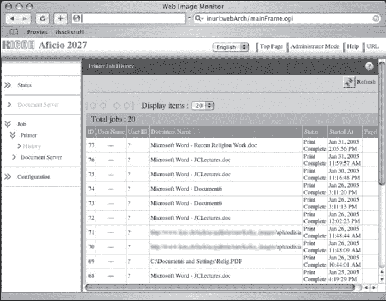
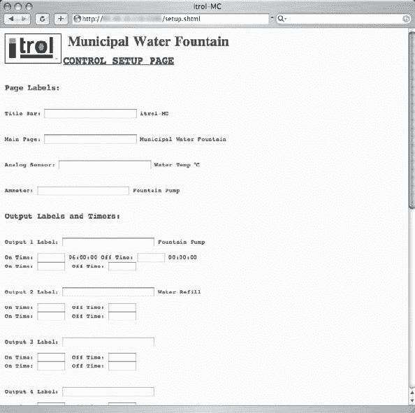
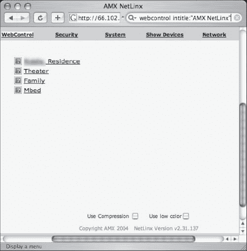

第六章 Google Hacking 展示

一个称职的无技术黑客可以通过观察周围的世界积累大量重要数据。但通常这些数据本身是完全无用的。当将数据转化为信息时，好莱坞告诉我们，黑客会在他的黑色墙壁、红灯光的房间里拥有三十二块等分的等离子屏幕，这会让北美航空防御司令部的计算机中心感到羞愧。在现实生活中，黑客甚至不需要自己的电脑来进行必要的研究。如果他能到达公共图书馆、金可的或者互联网咖啡馆，他就可以利用 Google 将所有数据加工成有用的东西。有时，黑客会利用 Google 搜索目标和敏感信息。

这一章节节选自我的书 *Google Hacking for Penetration Testers, Volume Two*，展示了当黑客仅凭借搜索引擎和一点创造力时的能力。但要注意——这并不是无技术含量的黑客行为，而是我所谓的低技术黑客行为。尽管如此，Google Hacking 是每个无技术黑客工具库中不可或缺的工具，一旦你看到本章的示例，我相信你会明白为什么。

# 引言

这一章节节选自我的书 *Google Hacking for Penetration Testers, Volume 2.* 在知道行内黑客中，Google 黑客技术可谓是最为知名的一种无技术黑客技术，已成为每个攻击者工具库中的标配。我通常不喜欢重新印刷，但有时候向你提供内容比指向内容更重要——并要求你为此付出更多的辛苦赚来的钱。所以，考虑到这一点，我呈现了这一章，从现在已经相当著名的 *Google Hacking* 书籍中精选而来。由于这是一次重新印刷，所以本章的格式和风格与你现在手中的书的其余部分不符。我希望你能理解。享受吧。-约翰尼

# 引言

一个自尊的 Google 黑客会花数小时在互联网上搜寻有趣的东西。他们不断地进行搜索，从中找到简洁、有效的查询，并因分享这些查询和交换他们的发现截图而感到兴奋。我知道，因为我亲眼见过。作为 Google Hacking 数据库（GHDB）和 [`johnny.ihackstuff.com`](http://johnny.ihackstuff.com) 上的搜索引擎黑客论坛的创始人，我对 Google 黑客社区所创造的东西感到非常惊讶。事实证明，传闻是真的——创造性的 Google 搜索可以揭示医疗、金融、专有甚至机密信息。尽管有政府法令、法规和保护法案，如《医疗保险移植和责任法案》（HIPAA）、《萨班斯—奥克斯利法案》（Sarbanes-Oxley）和《格雷厄姆-利奇-布莱利法案》（Graham-Leach-Bliley），以及安全监管机构的不断呼吁，但这个问题仍然存在。东西仍然出现在网络上，而 Google 黑客迅速地将其抓取。

在我努力将威胁置于聚光灯下的过程中，我开始在诸如黑帽大会和 Defcon 等安全会议上谈论谷歌黑客的话题。此外，我被邀请撰写我的第一本书。经过几个月的写作，我以为我们的事业终于会引起广大社区的关注，并且变革即将到来。我只是知道人们会谈论谷歌黑客，并且对这个问题的认识会增加。

谷歌黑客，第一版，产生了一些影响。但没有什么能像“谷歌黑客展示”那样引起轰动，这是我臭名昭著的谷歌黑客会议演讲中的有趣部分。对我来说，展示并不是什么大不了的事情——它不过是我见过的一些疯狂的谷歌黑客截图而已。我从我创建的有趣的谷歌查询池中借用，以及社区中得到的大量查询；我捕捉了截图，一次呈现一个，一边做出俏皮的评论。每次我呈现展示，我都成功地把观众搞得笑声不断，因为只靠一个浏览器和一个搜索引擎武装的黑客的荒谬有效性。这很有趣，也很有效。每次演讲后，人们都会讨论那些截图几个月。毕竟，那些照片代表了谷歌黑客工作的火热中心。

将展示包含在*Google Hacking*的本版中是有道理的。为了保持展示的原始格式，本章将以照片为主，言辞为辅，因为照片可以说明一切。本章中的一些截图已经过时，有些在网络上已经不存在了，但这是个好消息。这意味着世界上某个地方，有人（也许是无意中）已经从*googledork*的级别毕业，并向更好的安全姿态迈进了一步。

无论如何，我保留了许多过时的照片，作为提醒那些负责保护在线资源的人的鲜明例证。这些照片证明了这种威胁是普遍存在的——它可能发生在任何人身上，历史已经证明它几乎发生在每个人身上。

所以，让我们毫不犹豫地享受这个由我自己和谷歌黑客社区的贡献带来的谷歌黑客展示的印刷版本。

# 极客东西

这一节是关于计算机东西的。它涉及技术东西，是极客的东西。我们将看看一些谷歌黑客发现的更有趣的技术发现。我们将首先看一下一些真正不应该在线上的实用工具，除非你的目标当然是帮助黑客。然后我们将看看开放的网络设备和开放的应用程序，都不需要进行任何真正的黑客攻击就可以访问。

## 实用工具

任何自重的黑客都有一套工具箱供其使用，但这一节中工具有趣的地方在于它们在线上——它们在一个 Web 服务器上运行，允许攻击者有效地将其侦察努力反弹到托管 Web 服务器上。更糟糕的是，这些应用托管服务器是通过巧妙的 Google 查询找到的。我们将从一个方便的 PHP 脚本开始，如 图 6.1 所示，它允许网页访客 *ping* 互联网上的任何目标。*Ping* 不一定是一件坏事，但为什么要向匿名访客提供这项服务呢？

图 6.1 Php-ping.cgi 提供免费的 Ping 弹跳

不像 *ping* 工具，*finger* 工具已经停用了很长一段时间。这个让人讨厌的服务允许攻击者查询 UNIX 机器上的用户，允许枚举各种信息，如用户连接时间、主目录、全名等等。进入 *finger* CGI 脚本，一个笨拙的尝试“网页化”这个令人讨厌的服务。如 图 6.2 所示，一个恰到好处的 Google 查询可以找到该脚本的安装，为网页访客提供一个允许他们在远程机器上查询服务的 *finger* 客户端。

图 6.2 Finger CGI 脚本允许远程 *fingering*

*Pings* 和 *finger* 查询相对无害；大多数系统管理员甚至不会注意到它们在网络中传输。另一方面，*端口扫描* 很少被认为是无害的，一个偏执的管理员（或防御软件）会注意到端口扫描的源头。尽管大多数现代端口扫描器提供了允许隐秘操作的选项，但一点点 Google 黑客技巧可以走很长一段路。图 6.3 揭示了吉米·纽特提交的一个 Google 搜索，它定位了允许网页访客对目标进行端口扫描的网站。

图 6.3 PHPPort Scanner- 一个巧妙的基于 Web 的端口扫描器

记住，以这种方式执行的扫描将源自 Web 服务器，而不是攻击者。即使是最偏执的系统管理员也会很难追踪以这种方式发起的扫描。当然，大多数攻击者不会止步于端口扫描。他们很可能选择继续使用各种网络实用工具来探测目标，这可能会揭示他们的真实位置。然而，如果攻击者找到一个类似于 图 6.4（由吉米·纽特提交）显示的网页，他可以通过托管在远程服务器上的 *WebUtil* Perl 脚本引导各种网络探测。再次强调，这些探测看起来是来自 Web 服务器，而不是攻击者。

图 6.4 WebUtil 让攻击者几乎可以做任何事情

在图 6.5 中列出的网页（由 Golfo 提交）列出了学校“学生注册”系统的名称、地址和设备信息。通过点击界面，可以了解网络架构的更多信息以及连接到它的设备。这个页面集中在一个易于阅读的界面中，通过 Google 搜索就可以找到，这使得攻击者的侦察工作变得轻而易举。

图 6.5 WhatsUp 状态屏幕为访客提供了丰富的信息。

# 开放的网络设备

为什么要入侵网络服务器或设备，当你可以简单地指点和点击进入一个*开放*的网络设备？管理设备，就像 Jimmy Neutron 在图 6.6 中提交的那样，经常列出各种设备的各种信息。

图 6.6 开放的 APC 管理设备

当 m00d 提交了图 6.7 中显示的查询时，我并没有对此多想。SpeedStream 路由器是由家庭用户安装的明显轻量级设备，但我惊讶地发现它们在互联网上敞开着。我个人喜欢点对点摘要列表中的按钮。你想断开谁的连接呢？

图 6.7 开放的 SpeedStream DSL 路由器允许远程断开连接。

Belkin 在家庭网络设备中是一个家喻户晓的名字。凭借他们易于使用的基于 Web 的管理界面，很明显，像图 6.8 中的页面最终会被 Google 爬取。即使没有登录凭据，该页面也透露了大量信息，可能对潜在的攻击者很有趣。我真的对页面上的*功能*部分笑了出来。防火墙已启用，但无线接口是敞开的且未加密。作为一个带有社会良心的黑客，我第一反应是在这个接入点上启用加密——试图保护这个可怜的家庭用户免受自身的伤害。

图 6.8 Belkin 路由器需要黑客的帮助。

Milkman 带来了图 6.9 中显示的查询，这个查询挖掘出了 Smoothwall 个人防火墙的配置界面。用 Google 黑掉别人的防火墙总觉得有点不对劲。

图 6.9 Smoothwall 防火墙需要更新。

正如 Jimmy Neutron 在接下来的两个图中揭示的那样，即使像 Cisco 这样的大型设备偶尔也会出现在 Google 的缓存中。虽然看起来不起眼，但在图 6.10 中显示的交换机界面几乎没有想象空间——所有的配置和诊断工具都列在主页面上。

图 6.10 开放的 Cisco 交换机

这个第二张 Cisco 的截图应该对 Cisco 爱好者来说很熟悉。我不知道为什么，但 Cisco 的命名法让我想起了一部烂片。我几乎能听到一个过度合成的计算机的刺耳声音招手，“欢迎来到第 15 级。”

图 6.11 欢迎来到 Cisco 15 级

图 6.12 中所示的搜索（由 Murfie 提交）定位到 Axis 网络打印服务器的接口。大多数打印机接口都很无聊，但这一个特别引起了我的兴趣。首先，有一个名为*配置向导*的按钮，我很确定它会启动一个配置向导。然后还有一个方便的链接标签为*打印任务*，列出了打印任务。如果你还没有猜到，谷歌黑客有时候留下的余地很小。

图 6.12 Axis 打印服务器带有晦涩的按钮

打印机并不是完全无聊的东西。考虑一下 图 6.13 中显示的*Web 图像监视器*。我特别喜欢*最近的宗教工作*这个文件。这是相当可敬的追求，除非与*春药*的文件结合在一起。我真希望这两个文件没有关联。话虽如此，这些天没有什么能让我惊讶了。

图 6.13 理光打印服务器结合了宗教与春药

CP 有一种找到让我笑的谷歌黑客的方法，图 6.14 也不例外。是的，这是一个市政喷泉的基于 web 的界面。

图 6.14 为了娱乐和利润而黑客市政喷泉

在看着水温在几秒钟内波动了几次令人厌倦的时候，点击*控制*链接看看是否可能实际控制市政喷泉是很合乎逻辑的。正如 图 6.15 所显示的，远程控制市政喷泉是可能的。

图 6.15 更多市政喷泉乐趣

不过有一个建议——如果你碰巧碰到其中之一，要友好点。不要把电源重新路由到水库系统中。我认为那肯定算是恐怖主义行为。

继续前进到一个更传统的网络装置，考虑在 图 6.16 中捕获的截屏。 

图 6.16 酸性 IDS 管理器

现在，我在安全领域工作了很多年，我并不是在行业的任何一个特定领域特别出色。但我对很多不同事物都有一点了解，有一件事我可以确定的是，安全产品是设计用来保护东西的。这是事情的规律。但当我看到图 6.16 中显示的日志时，我感到很困惑。看，这是一个用于 Snort 入侵检测系统的基于 web 的界面。上次我检查时，这些数据应该被远离攻击者的眼睛，但我想我可能错过了一封电子邮件或者什么的。但我想这里可能有一些逻辑。也许如果攻击者在公共网页上看到他的错误，他会感到太羞愧而再也不会黑客了，然后过上正常有成效的生活。另一方面，也许他和他的黑客伙伴只会对他的好运气大笑。很难说。

# 开放应用程序

许多主流网络应用程序相对来说是傻瓜式的，专为对安全知之甚少的点一下鼠标的大众设计。即便如此，Google 黑客社区已经发现了数百个在线应用程序是敞开的，只等着一个点一下鼠标的脚本小子来控制它们。本节中的第一个由 Shadowsliv 提交，并在图 6.17 中显示。

图 6.17 棘手的 Pivot 黑客需要填写五个正确字段

坏消息是，如果黑客能够弄清楚在那些令人困惑的字段中输入什么，他将拥有自己的 Pivot 网志。好消息是，大多数技术娴熟的攻击者会放过这个网站，认为任何没有受到保护的软件 *必须* 是一个蜜罐。真的很悲哀，黑客（不是 *真正的* 黑客）可以被简化为点一下鼠标，但正如 Arrested 的搜索在图 6.18 中显示的那样，拥有整个网站可能是一个相对简单的事情。

图 6.18 通过填写四个正确字段实现 PHP-Nuke 控制

比起开放的 Pivot 安装，这个配置页面少了一个字段，将创建一个 PHP-Nuke 管理员账户，并允许任何访问者开始上传内容到页面，就好像这是他们自己的页面一样。当然，这需要访问者有一些恶意意图。毫无疑问，他或她正在创建一个不属于自己的网站上的管理员账户。然而，图 6.19 中页面的文本有点含糊不清。

图 6.19 攻击这个 PHP-Nuke 安装“出于安全考虑”

页面中间的粗体文本真的让我笑翻了。我可以想象到某个可怜的奶奶碰到这个页面，大声朗读着。“出于安全考虑，现在通过点击此处创建超级用户是最好的主意。” 我的意思是，谁会不为了*安全原因*而避免做某事呢？对于奶奶来说，她也许正在通过黑进某个可怜家伙的 PHP-Nuke 安装来拯救世界免受邪恶黑客的侵害。

而且，拥有一个网站还不够酷，图 6.20（由 Quadster 提交）显示了一个以 root 身份登录的 phpMyAdmin 安装，提供对 MySQL 数据库的无限访问。

图 6.20 打开 phpMyAdmin - MySQL 入侵指南

安装了网站和 SQL 数据库后，对于 Google 黑客来说，想要对系统拥有终极控制权是自然而然的进展。VNC 安装提供了对系统键盘和鼠标的远程控制。图 6.21，由莱斯特提交，显示了一个定位 RealVNC 的基于 Java 的客户端的查询。

图 6.21 黑客入侵 VNC，获取远程键盘

然而，找到客户端只是方程式的一部分。攻击者仍然需要知道 VNC 服务器的地址、端口和（可选）密码。正如图 6.22 所显示的，Java 客户端本身通常在一个方便的弹出窗口中提供了这个方程式的三分之二。

图 6.22 VNC 选项，搭配薯条一起上

如果黑客真的幸运地发现了一个没有密码保护的服务器，他将面临一个艰巨的任务，即弄清楚上面连接窗口中的四个按钮中的哪一个要点击。这里给那些想要在黑客世界中立足的脚本小子一个提示：不是*取消*按钮。

当然，没有密码运行只是愚蠢。但是密码很难记住，软件供应商显然意识到了这一点，正如图 6.23 中显示的密码提示所证明的那样。

图 6.23 方便的密码提醒，以防黑客忘记

在登录弹出窗口上发布默认的用户名/密码组合实在是太疯狂了。不幸的是，这并不是个案。看看由吉米·尼特龙提交的图 6.24，你能猜出默认密码吗？

图 6.24 如果你猜不出这个默认密码，你就失败了

晋升到黑客精英的下一个级别需要一些工作。查看丹·卡明斯基提交的图 6.25 中显示的用户界面。

图 6.25 欢迎使用访客访问

仔细观察，你会注意到 URL 包含一个名为*ADMIN*的特殊字段，其值为*False*。像黑客一样思考一下，想象一下你如何获得对页面的管理访问权限。剧透在图 6.26 中列出。

图 6.26 通过 URL 调整获取管理员访问权限

检查一下闪亮的新的*退出管理员访问*按钮。通过将*ADMIN*字段更改为*True*，应用程序将我们置于管理员访问模式下。我向你保证，黑客真的很难。

**摄像头**

我必须诚实地承认，和打印机查询一样，我真的厌倦了网络摄像头查询。有一段时间，GHDB 中每隔一次都会增加一个网络摄像头查询。尽管如此，一些网络摄像头发现还是相当有趣的，值得在展示中提到。我将从 Vipsta 提交的一个手机摄像头转储开始，如图 6.27 所示。

图 6.27 谷歌爬行的车祸

这不仅是一张关于一些看起来相当严重的车祸的有趣照片，而且谷歌搜查相机手机图片网站的想法也很有趣。谁知道世界各地的相机手机中隐藏着什么样的勒索材料。不过，没有人会因为这种信息而进行耸人听闻或经济利益的行为。咳咳。

继续往下看，看看 Klouw 提交的办公室安装的公开网络摄像头，如图 6.28 所示。

图 6.28 远程窥视入门

这真是一个有趣的网络摄像头。它不仅显示办公室的所有活动，而且似乎专门设计用于远程窥视。黑客过去必须出门才能参加这项经典运动。如今，他们只需要进行几次谷歌搜索。

图 6.29，由 Jimmy Neutron 提交，展示了战术美国核潜艇的 IT 基础设施。

图 6.29 不是真正的战术美国核潜艇

好吧，其实不是。这可能只是一个核反应堆，或者是一个电网控制中心，甚至是哥伦比亚（马里兰州）的一个毒贩仓库。或者也许我读了太多的《Stealing The Network》系列书籍。无论哪种方式，这都是一个很酷的发现。

然而，图 6.30（由 JBrashars 提交）是不会弄错的。它绝对是一个停车场摄像头。我不确定为什么一个摄像头会对着一个残疾人停车位，但我猜想可能已经有人报告残疾人停车位的滥用。想象一下成为能够目睹首席信息官停在这个地方，然后从他的敞篷车里跳出来跑进建筑物的保安的快乐。这些是保安传奇的故事。

图 6.30 残疾人停车位的格斯塔波摄像头

WarriorClown 向我发送了在图 6.31 中显示的捕获所使用的搜索。它显示了一个看起来是一个装载码头和一片白色爆炸容器的场景。

图 6.31 远程爆炸容器乐趣

虽然一开始看起来很无聊，但这个网络摄像头真的很有趣。查看捕获画面右上角的有趣按钮。我很确定点击该按钮会向爆炸性的白色容器发射激光束，造成最大的破坏，但只能做一次 - 除非你设置它们重新生成，这将自动将它们带回来。哦，等等。这只在《光环 3》的铸造模式中有效。好吧，所有这些网络摄像头都开始让我迷失方向。为了试图控制我的想象力，我呈现了图 6.32 中显示的相当直接的安全摄像头视图。

图 6.32 开放的 Web“安全”摄像头

我不可能是唯一一个认为在互联网上公开安全摄像头视频流很疯狂的人。当然，这种情况在好莱坞电影中经常发生。看起来雇佣黑客的第一个任务似乎就是窃取视频监控视频。但是电影使其看起来很复杂和技术性。我从未见过好莱坞黑客使用 Google 来入侵安全系统。不过，这看起来远不如使用光纤摄像头、剪线钳和鳄鱼夹鳄鱼夹酷。

接下来，由 JBrashars 提交的搜索显示了图 6.33 中显示的结果，返回了相当多的开放 Everfocus EDSR applets。

图 6.33 EDSR 听起来很温和

Everfocus EDSR 是一个多通道数字录像系统，具有基于 Web 的界面。这是一个不错的监控产品，因此默认情况下受密码保护，如图 6.34 所示。

图 6.34 密码保护：安全的黄金标准

不幸的是，正如一位匿名贡献者透露的那样，工厂默认的管理员用户名和密码可以访问许多这些系统，如图 6.35 所示。

图 6.35 欢迎来到监视中心

一旦进入，EDSR applet 提供对多个实时视频源和以前记录的任何活动的历史记录的访问。再次，就像好莱坞的魔法一样，没有所有的黑客智慧。

EDSR 并不是唯一一个被 Google 黑客攻击的多通道视频系统。正如 Murfie 所透露的，搜索 I-catcher CCTV 会返回许多像图 6.36 中所示的系统。

图 6.36 需要管家。在内应用

尽管界面看起来很简单，但它提供了对多个实时摄像头视图的访问，包括一个称为“Woodie”的视图，我个人害怕点击。

这些摄像头都很有趣，但我将我的最爱留到最后。查看图 6.37。

图 6.37 肩上冲浪遇到网络摄像头遇到密码贴纸

该摄像头为网站访客提供了开放访问。摄像头位于计算机实验室，其远程控制功能允许匿名访客四处张望，随心所欲地进行平移和缩放。这不仅允许进行一些很好的窥视，而且上述截图中的贴纸几乎让我从椅子上摔下来。贴纸上列出了实验室在线 FTP 服务器的用户名和密码。列出用户名和密码的贴纸已经够糟糕了，但我想知道是谁想到了把开放的网络摄像头对准它们？

# 电信设备

我从未是个电话黑客（phreaker），但多亏了 Google 搜索功能的深度，我不需要太多经验就能从事这种不光彩的工作。正如 JBrashar 的搜索在图 6.38 中所示，Voice over IP（VOIP）服务的激增导致了大量新的基于 Web 的电话界面。

图 6.38 使用 Google 黑客住宅电话系统

有趣的是，仅仅使用 Google，攻击者就可以获取电话历史信息，比如最后拨出的号码和最后的来电号码。通常，Sipura SPA 软件在保护这些信息方面做得更好，但是这个特定的安装配置错误。通过单击 Web 界面上的链接，还可以发现其他更技术性的信息，如图 6.39 所示。

图 6.39 重新上演

VOIP 设备太多了，不可能涵盖它们全部，但是 VOIP 服务器领域的新秀绝对是 Asterisk。查看了 Asterisk 管理门户的文档后，Jimmy Neutron 发现了图 6.40 中展示的有趣搜索。

图 6.40 Asterisk，VOIP 之王

从这个开放的入口，攻击者可以对 Asterisk 服务器进行更改，包括转发来电，如图 6.41 所示。

图 6.41 使用 Google 黑客 Asterisk 管理门户

不幸的是，黑客的乐趣并不一定就此结束。简单地重新路由分机、监视或重新路由语音信箱、启用或禁用数字接待员，甚至上传令人不安的等待音乐都是很简单的。但是 Jimmy 的 Asterisk VOIP 搜索并没有止步于此；他后来提交了图 6.42 中展示的搜索。

图 6.42 重新上演。HackenBush。呵

这个基于 Flash 的操作面板提供了类似的功能，而且再次发现界面对任何互联网访客都是开放的。

继续前进，Yeseins 提供了有趣的搜索结果，如图 6.43 所示，该搜索结果找到了视频会议管理系统。

图 6.43 黑客视频会议系统？

这个管理系统允许网站访客连接、断开和监视会议电话，拍摄会议参与者的快照，甚至更改线路设置，如图 6.44 所示。

图 6.44 重定向视频会议线路

一个恶意黑客甚至可以更改系统名称和密码，将合法管理员锁在自己的系统外，如图 6.45 所示。

图 6.45 视频会议系统拥有权

尽管我们看过所有新潮的网络界面，但谷歌黑客也能弥补到老系统，如图 6.46 所示。

图 6.46 谷歌老派骇客风格

这个前端设计旨在为旧 PBX 产品提供新面孔，但客户安全似乎是事后考虑的。请注意，界面要求用户“注销”界面，表明用户已经登录。另外，请注意那个标有*开始管理设备*的神秘按钮。在进行谷歌搜索后，一个恶意黑客所要做的就是弄清楚要按哪个按钮。这是一个难以置信的艰巨任务。

# 电源

当我谈论使用谷歌黑客电源系统时，我经常看到人们疑惑的眼神。大多数人认为我在谈论像 Yeseins 在图 6.47 中提交的 UPS 系统。

图 6.47 有什么事？

这是一个聪明的谷歌查询，但它只是一个不间断电源系统（UPS）监控页面。这可能很有趣，但正如 Jimmy Neutron 在图 6.48 中展示的那样，还有更有趣的电源黑客机会。

图 6.48 新手卧室黑客

AMX NetLinx 系统旨在允许控制电源系统。上面的图表似乎表明，一个网站访客可以控制住宅的剧院、家庭房间和主卧室的电源。问题在于谷歌搜索结果稀少，大部分受密码保护。作为替代方案，Jimmy 提供了图 6.49 中显示的搜索。

图 6.49 密码很棒，尤其是默认密码

尽管这个查询结果显示了很多受密码保护的网站，但许多网站仍使用默认密码，从而可以访问图 6.50 中显示的控制面板。

图 6.50 谷歌黑客灯插座？哦哟

这个控制面板列出了电源插座以及有趣的按钮*电源*和*重新启动*，即使是最愚蠢的黑客也肯定能够弄清楚。这个界面的问题在于它并不太有趣。黑客肯定会厌倦翻转未命名的电源开关 - 除非他同时找到一个开放的网络摄像头，这样他就可以观看有趣的事情。图 6.51 中显示的搜索似乎解决了这个问题，为每个设备命名以便参考。

图 6.51 远离圣诞灯

当然，即使是最狠毒的黑客也可能认为钉住别人的圣诞灯是不礼貌的，但是理智的黑客绝不会抵制图 6.52 中显示的开放的 HomeSeer 控制面板。

图 6.52 烟斗黑客。烟斗黑客

HomeSeer 控制面板使电源黑客变得有趣，为每个控件列出描述，以及适用元素的 *开启、关闭* 和滑动开关。该列表中的一些元素非常有趣，包括 *Lower Motion* 和 *Bathroom*。但最好的肯定是 *Electric Bong*。如果你是想抓捕这个系统的主人的特勤局成员，我建议在闯入家中之前先进行预先的谷歌搜索。先调暗灯光，然后锁定运动传感器。最后但同样重要的是，打开电动烟斗，以防其他指控不成立。

# 敏感信息

敏感信息是一个非常通用的术语，但这正是本节所包括的：在 Google 上冲浪时发现的各种敏感信息的大杂烩。我们将从 Jorokin 提交的 VCalendar 搜索开始，如图 6.53 所示。

图 6.53 让我查看他们的日历

这些日历文件至少有一定可能是故意公开的，但 Digital_Revolution 在图 6.54 中提交的 Netscape 历史文件不应该是公开的。

图 6.54 IBM 的火辣女孩？不是

首先，该文件包含用户的 POP 电子邮件用户名和编码密码。然后是他的 URL 历史记录，其中不仅包含非常受尊敬的 *[IBM.com](http://IBM.com)*，还有不那么受尊敬的 *[hotchicks.com](http://hotchicks.com)*，我相当确定这是 *NSFW*。

接下来是 Harry-AAC 提交的 MSN 联系人列表，显示在图 6.55 中。

图 6.55 想偷我的朋友？

这个文件列出了某人联系人列表中的联系人姓名和电子邮件地址。最好，这个文件是垃圾邮件的食物。网络上确实没有缺少电子邮件地址列表、电话号码列表等，但令人惊讶的是有多少包含这种信息的文档是有意创建的，目的是共享这些信息。考虑到 CP 提交的屏幕，显示在图 6.56 中。

图 6.56 给所有员工打电话和发电子邮件祝他们生日快乐

这个文档是一个员工目录，仅供内部使用。唯一的问题是它被发现在一个公共网站上。虽然这似乎并不构成严重的私人信息，但 Maerim 提交的搜索图 6.57 显示了稍微更敏感的信息：密码。

图 6.57 我认为这个 RCON 密码是用希腊语写的

这份文件列出了 Ghost Squad 的*私人*反恐精英远程管理控制台的明文密码。问问任何 GS 游戏玩家这可能有多尴尬。但是黑客攻击游戏服务器相对来说比较温和。但是，请考虑一下，由 Barabas 提交的图 6.58。

图 6.58 编码的 VPN 密码

这份文件列出了 Cisco 虚拟局域网（VLAN）的信息和编码后的密码。唯一比泄露 VLAN 编码密码更糟糕的是泄露 VLAN 的*明文*密码。有求必应。再次查看图 6.59，这次是来自 Barabas。

图 6.59 明文的 VPN 密码

是的，这是一个嵌入在大学配置文件中的明文密码。但是，有趣的密码可以在各种地方找到，比如在 Windows 无人值守安装文件中，就像 MBaldwin 提交的图 6.60 中所示。

图 6.60 在安装之前拥有 Windows 安装。1337

这份文件还显示了已安装软件的产品密钥，这可能被重新使用以非法安装软件。最后但并非最不重要的，请查看图 6.61，由 CP 提交。

图 6.61 嘿，我能得到你所有的网络密码吗？

这份文件列出了各种网站的用户名和密码。该文件存储在一个网站上，据推测是为了让所有者能够轻松远程访问它。然而，该文件的位置在某个时候被公开，谷歌也会主动爬取它。请记住，公共网站通常就是公共的。不要在没有充分考虑的情况下混合使用公共和私人数据。

## 警方报告

据我了解，大多数警方记录都是公开记录。因此，当我看到像图 6.62 中所示的警方报告时，我并不感到惊讶。

图 6.62 警方报告是公开记录。好的

但是，当我发现像图 6.63 中所示的警方报告时，我开始质疑发布未经过滤的警方记录的理智性。

图 6.63 这意味着你的维多利亚的秘密账户信息也泄露了

这份警方报告记录了一起女性钱包被盗案的细节。问题在于，女性钱包的内容被详细列出，包括她维多利亚的秘密卡的账号！这不是在网络上发现的唯一一份如此详细的警方报告。图 6.64 展示了另一份更具启发性的报告。

图 6.64 被盗两次，多亏了公开的警方报告

这份报告详细介绍了另一起小偷行为，这次列出了被盗的 Visa 和 MasterCard 信用卡的账户号码。很可能在被报失后立即取消了这些卡，但图 6.65 中列出的个人号码却不那么容易替换。

图 6.65 警方报告三起抢劫案或“妈妈，我有坏消息”

在这种情况下，受害者的驾驶执照号码不仅被发布了，而且他们的社会安全号码也与他们母亲的驾驶执照号码一起列出了——所有这些都发布在一个公共网站上，正等待身份盗窃者的选择。^(1)

# 社会安全号码

社会安全号码（SSN）是美国公民拥有的最敏感的信息。即使是一个没有经验的罪犯也可以使用窃取的社会安全号码来建立银行账户，开立信用额度，甚至更多——全部都是以受害者的名义进行的。在本节中，我们将看一下个人的社会安全号码可能会以何种方式出现在网上的一些方式。请注意，就像本书中的其他敏感搜索一样，我们已经尽一切努力掩盖所选文档，并遮蔽了用于定位它们的谷歌搜索。

在大多数教育机构中，为了保护学生的成绩和个人信息，通常会给学生分配一个身份证号码。然而，正如图 6.66 所示，最常用的身份证号码通常是学生的社会安全号码。

图 6.66 社会安全号码作为学生身份证号

单独看社会安全号码并不一定是件大事，而且当与学生的成绩一起发布时（如图 6.67 所示），这个系统可以很好地保护学生的进度隐私。

图 6.67 “匿名”学生编号和成绩发布

然而，在许多情况下，学生的姓名就会与他们的社会安全号码一起发布，就像图 6.68 所示的那样。当然，这会破坏使用身份证号码而不是姓名获得的匿名性。

图 6.68 再次将姓名和社会安全号码放在一起

在某些情况下，这些文件并不是供公众查看的，但却不知何故出现在面向互联网的网站上。这当然是一种不安全的处理方式，这些文件最终会进入谷歌的缓存中。图 6.69 中显示的文档是通过一个匿名的谷歌黑客在一个开放目录中发现的。请注意，它列出了学生的姓名、社会安全号码等信息。更糟糕的是，这份文件是在美国政府的培训机构网站上发现的。此后，该文件已被删除。

图 6.69 社会安全号码和姓名，身份盗窃者的生日礼物

社会安全号码以其他方式出现在网络上，最明显的是用户的无知。图 6.70 显示的简历请求在消息组帖子中列出了一个人的社会安全号码。

图 6.70 雇用这个家伙。这是他的社会安全号码

图 6.71 中展示的文档被称为简历，或简称 CV。我不太确定什么是 CV，但经过一番研究后，我发现它是一种给非常聪明的人准备的一种简历。

图 6.71 我很聪明。想看我的简历吗？

至于我，我想我会继续使用我的普通简历，特别是如果维护 CV 意味着我必须公开我的生日和社会安全号码的话。最后，看一下图 6.72 所示的电子表格，其中列出了公司员工的姓名、出生日期、性别、入职日期和社会安全号码。

图 6.72 员工走出柜子的日子

## 信用卡信息

信用卡号显然非常有价值，应该妥善保护。然而，正如我们将在本节中看到的，这些数字可以很容易地在网络上找到。图 6.73 显示了一个相对较小的文档，其中列出了 Visa 信用卡号及其相关的到期日期。

图 6.73 谷歌黑客信用卡信息

图 6.74 显示了一个更大的文档，不仅列出了信用卡号及其相关的到期日期，还列出了卡验证值（CVV）号码，这通常用于验证卡是否在合法持有人手中。

图 6.74 谷歌黑客获取更多信用卡信息

图 6.75 显示了一个非常大的文档，其中包含数百个关于受害者的个人信息，包括姓名、地址、电话号码、信用卡信息、CVV 代码和到期日期。

图 6.75 谷歌黑客大量信用卡信息

然而，在网络上，信用卡号和到期日期并不是唯一的财务敏感信息，就像图 6.76 所示的那样。

这些东西是如何出现在网络上的呢？

大多数情况下，这样的信息是由*网络钓鱼者*收集的——这些罪犯使用电子通信来索取个人信息，并将其保存在在线列表或数据库中。在许多情况下，调查人员会找到这些列表或数据库，并在在线讨论组中发布链接。当谷歌的爬虫程序跟踪链接时，捕获的数据就会暴露给谷歌黑客。在其他情况下，卡盗（信用卡号交易者）会在网络上的公开讨论中发布这些数据，然后谷歌会对其进行爬取和缓存。有关网络钓鱼的更多信息，请参阅 Syngress Publishing 的*网络钓鱼曝光*。

图 6.76 神圣的东西还有吗？

这些样本是从各种网站收集而来的，包括银行路由号码、PayPal 用户名和密码、eBay 用户名和密码、银行账号和路由号码等，很可能是由网络钓鱼者收集的。

# 超越 Google

在某些情况下，Google 是更长的黑客链中的第一步。优秀的黑客经常会超越 Google。在本节中，我们将快速查看一些需要额外几步才能完成的有趣的 Google 黑客攻击。尽管执行简单，但这些例子展示了黑客愿意付出的创造性努力。

这张首张截图，显示在图 6.77 中（由 CP 提交），报告了由于隐私原因而从网站上移除了员工目录。

图 6.77 员工联系列表已移除？

这并不是一个坏主意，但问题在于旧文件也必须从网站上删除，否则像 archive.org 这样的网站将无限期保留文件的链接。图 6.78 显示了从原始网站中提取的员工联系文件，感谢 archive.org 提供的链接。

图 6.78 恢复的员工联系列表

在下一个例子中，一个 Google 黑客注意到一个 PDF 文档中存在密码参考，如图 6.79 所示。

图 6.79 PDF 文件密码参考

下载后，PDF 文件确实包含密码参考。在这种情况下，它以链接到受密码保护的 PDF 文档的形式呈现，如图 6.80 所示。

图 6.80 链接到受保护文档，并附带密码

正如图 6.81 中所示，引用的 PDF 文件确实受密码保护。

图 6.81 受密码保护的 PDF 文件

输入密码即可打开文档，如图 6.82 所示。

图 6.82 使用盗窃密码打开的敏感文件

将文档设为受密码保护然后提供密码毫无意义，但在这种情况下问题发生在原始文件包含密码参考的文件不应该是公开的。在这种情况下，失误导致了敏感政府文件的泄露。

# 摘要

本章主要介绍了当忽视 Google 黑客威胁时可能出现的严重问题。每当你在传达威胁的严重性时遇到困难时，请使用本章。帮助传播这一信息，并成为解决问题的一部分，而不是问题的一部分。在你发送停止和解文件给 Google 之前，请记住——如果你的敏感数据泄露到网络上，这并不是 Google 的错。

^(1) 很明显，我们在这里面临着棘手的问题，因为这些搜索确实很危险。 这些和后续搜索中的所有识别信息都已经模糊处理，任何可能导致重新创建谷歌查询的信息也已被删除。此外，本章中发现的大部分敏感文件已经从网络上删除。
