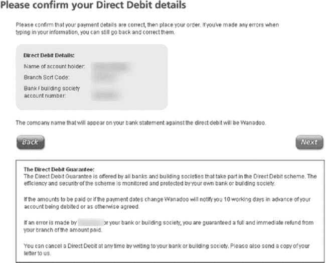

第七章 P2P 黑客

在我们继续暂停严格的无技术黑客活动的同时，我们将介绍另一种低技术技能：点对点（P2P）黑客。 符合无技术精神，让我们假设一个人没有预算，没有商业黑客软件，没有有组织犯罪的支持，也没有花哨的装备。 实际上，让我们甚至连谷歌都拿走。 在所有这些限制下，这个人对你仍然构成威胁吗？看看这一章，自行判断。

# 理解 P2P 黑客

点对点（P2P）网络由一些想要共享文件或数据的客户（称为对等方）组成。 大多数情况下，点对点网络承载由加入网络的用户共享的音频、视频或程序文件。 P2P 网络的运作超出了本书的范围，但就我们的目的而言，让我们简单地说 P2P 是目前存在的最常见的文件共享服务之一。 要加入 P2P 网络，您只需下载一个 P2P 客户端（例如 Mac 上的 Acquisition，如下所示），运行它并开始搜索要下载的文件。

对*贝多芬*的搜索，就像上面的那个“神奇”地返回了其他 P2P 用户共享的包含*贝多芬*一词的文件列表。 结果通常按热门程度排序。 在上面的示例中，前三个结果包括一部被错误列为贝多芬作品的巴赫钢琴协奏曲，以及贝多芬的第七和第九交响曲。 这带来了一个有趣的观点——在 P2P 网络上共享的文件并不总是看起来的样子。 一个被列为由贝多芬演奏的巴赫协奏曲是一个相当温和的例子，但由于任何用户都可以共享任何类型的文件，这部协奏曲也可能是任何东西：关于蛋黄酱的电影，一个泡菜的图片，或者包含计算机病毒的文件。 一个恶意用户可以轻松共享任何类型的恶意文件。 但恶意文件并不像我所关注的那样多，我更关注意外共享的文件。

正如无技术黑客已经知道的那样，有成千上万的互联网用户下载并安装了 P2P 软件，并意外共享了敏感文件。

获得这些文件的访问权限就像安装一个 P2P 客户端并提交创意搜索一样简单。 在这一章中，我们将看看我在各种点对点网络中发现的一些文件。

我们将从一些基础知识开始，逐步深入一些真正有趣的内容。 下一张照片显示了一个相对简单的 Word 文档，列出了一家公司的企业客户。

下一张照片的质量很糟糕，但我会按照我找到的样子呈现它。 我认为这是一个被扫描成图像的屏幕截图。 希望它不是看起来的样子——一张在报纸上印刷的照片。

无论这张照片是如何产生的，它都透露了大量信息。底部的任务栏是肩窥者的梦想，但 Access 数据库屏幕是信息的宝库。屏幕显示了一个大公司的成本节约报告，列出了关于一个项目的非常具体的细节，包括费用和年度成本节约。这些信息非常陈旧，但基于公司的可识别名称；某人肯定会对类似信息感兴趣。

寻找一个，搜索更多

一旦你找到一个有趣的文件，就很容易从同一台计算机找到更多。大多数 P2P 客户端允许你浏览 P2P 用户计算机上的所有共享文件。如果攻击者找到一个稍微敏感的文件，他几乎肯定会浏览共享该文件的计算机，以寻找更多文件。尽管他的搜索仅限于用户正在分享的文件，但如果用户分享了一个敏感文件，他几乎肯定也分享了其他文件。

下一张照片展示了一份客户发票。

这张发票也是陈旧的，但它透露了客户信息和定价数据。对我来说最有趣的是，发票列出了物品描述，似乎布置了一个非常高端的安全系统。它列出了视频服务器（支持多达四十台摄像机）、视频编码器、电源供应等。看起来很讽刺的是，这个高科技安全系统的发票竟然被放在 P2P 网络上供全世界看到。

这里是另一份有趣的文件：一个手机账单。

我个人不认为我想与世界分享这些信息。这份 24 页的文件列出了客户的姓名、地址和电话号码，然后列出了一个月的手机通话记录。它列出了每次拨打和接听的电话。它继续列出了一个月通话的时间、持续时间和费用。如果一个高科技黑客试图通过电子方式获取这些数据，那将是一项困难的任务。但对于一个非技术黑客来说，只需要一个快速的 P2P 黑客会话或一轮垃圾箱搜寻。

如果一个黑客盯上我会怎么样？

想象一个黑客盯上你的个人信息是可怕的，但要明白 P2P 黑客并不是针对特定个人的。P2P 黑客是根据特定关键词寻找有趣信息的。如果一个黑客盯上你，他或她可能不会登录 P2P 客户端搜索你的信息，因为这意味着你正在运行 P2P 客户端*并且*在那里分享了个人数据。这两者都是相当荒谬的假设。因此，如果你运行 P2P 软件，请确保你知道自己在分享什么，然后专注于确保你的个人防火墙和反病毒/间谍软件/广告软件是最新的并且配置正确的。

P2P 网络上充斥着 Word 文档，其中许多是个人信息的重要来源。下面的文件列出了比大多数文件更多的信息。

姓名、出生日期和社会安全号码是有趣的信息，但这份文件还透露了保险政策信息。所有这些都相形见绌于财务信息。看看下面的文件。

这份税务文件很可能是计算机税务准备程序的一部分。它提供了这个个人财务信息的摘要。像下面这样的文件中可能包含更多的财务信息，这份文件真的引起了我的注意，因为标题中有*直接借记*这样的词。

这份文档的所有者首先在浏览器中查看了它，然后可能将其保存为本地硬盘上的文件。不幸的是，它被保存在一个点对点软件用作共享文件夹的目录中，保存的文档被分享到了世界上。对于这位用户来说，他的姓名、银行账号和分行代码现在已成为公开记录。

其他银行信息也很容易获得，如下一张照片所示。

这份多页文件列出了包括账号信息、余额、费用和取款在内的信息。报告中包含了文件的一页又一页，如下所示。

这对于一个非技术黑客来说是很棒的东西，但它只描述了一个账户。像下面这样的文件列出了关于多个账户的信息。现在我们开始进入一些真正疯狂的东西。

这是一个完整的信用报告。它列出了账户名称、银行信息、余额、贷款等等——几乎是一个人可以积累的所有财务信息。身份盗贼需要的信息远远少于这些，就可以完全接管一个人的身份。不幸的是，正如下一个截图所示，这种信息并不缺乏。

我可以列举出成百上千这样的事情，但让我们再看一个。查看下一个报告。

其他更简单的文件，像下面这份，只列出了敏感的部分。就像是信用报告浓缩液（无果肉）。

我可以继续下去，但实际上没有必要。P2P 网络上敏感信息并不缺乏，而且根本不需要太多技巧就能找到它。让我们看看一个真实世界的 P2P 黑客会话。

# 真实世界的点对点黑客：淘气的脊椎按摩师案例

当我发现下面的文件时，我清楚地记得想到“多可爱啊”。这并不是一个有趣的文件——它只是欢迎新的脊椎按摩病人，并稍微谈到了肌肉、脊椎等等的重要性。

但是仔细考虑了一下，我开始怀疑我是否偶然发现了一位医生的家用电脑。我在我的 P2P 客户端中右键单击文件，选择*浏览*以查看该计算机上的其他文件。结果显示在下一张照片中。

我点击*文本*链接查看基于文本的文件，比如 Microsoft Word 文档，当结果在屏幕上滚动时，我几乎不敢相信自己的眼睛。我看到一遍又一遍的记录、私人病人数据和药物请求文件。我正在查看私人病人数据。我正在浏览一份包含一些极其敏感的病人医疗数据的文件列表，而 P2P 网络中的其他人很可能已经下载了这些文件。这些数据已经传播到世界的任何地方。这些信息让我意识到这很可能不是一台个人电脑，很可能是医生用于业务的机器。我决定再多浏览一下这台机器。我点击 P2P 屏幕顶部的*电影*链接，浏览结果，显示在下一个屏幕中。

这些视频的名称如此恶劣，以至于我本能地回头看看是否有人看到我看到的东西。大多数色情视频集中在性感护士、少女和穿着丝袜的女性身上。一些视频标题如此恶心，以至于我不得不模糊大部分标题，甚至才能展示照片。最令人不安的视频描述了与动物发生性行为，并提到了“白人奴隶”之类的术语。这些视频已经够恶心了，但我突然想起这很可能是一位医生的电脑。如果这是医生的电脑，我想知道他的病人是否知道他不仅对他们的记录完全不负责任，而且还是一个彻头彻尾的淫秽之徒。我知道我不希望一个收集这种东西的医生接触我在乎的任何人。

我翻回*文本*列表，读到一个看起来不太敏感的文件名。我下载了这个文件，显示在下一张照片中。

这份文件本来不是为了好笑，但它还是让我笑了。这是一份医生的员工应该签署并注明日期的保密协议，同意他们不会在没有签署同意书的情况下泄露病人信息。文件继续声明员工有某些道德和职业义务来保护病人的机密性，并且对未经授权泄露病人信息有处罚。我简直无法相信这份文件竟然和私人病人数据以及性感护士色情内容放在同一个文件夹中。但是无技术的黑客看到各种有趣的东西。
