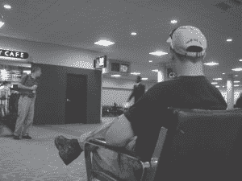
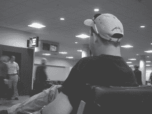
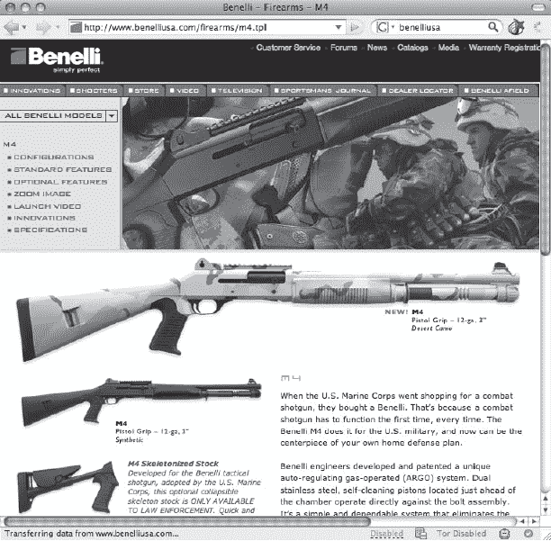
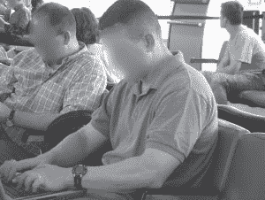
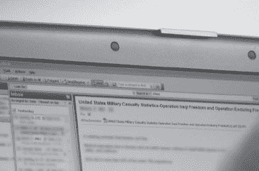
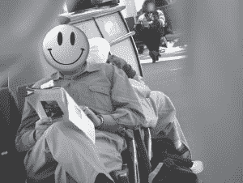
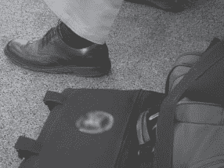
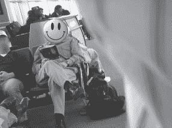
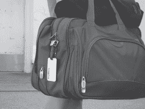

第八章 人群观察

我的朋友，也是这本书的技术编辑 Scott Pinzon，一直很喜欢（并且有共鸣）那首歌，“伊帕内玛的女孩”。但是在那首歌中看着她的那个家伙显然是个业余的人群观察者。如果他读过这一章节，他可能已经弄清楚了她住在哪家酒店（酒店房卡），她可能的收入（那些拖鞋是从沃尔玛还是杜嘉班纳买的？），甚至可能还有她的房间号（通过窥视侍者的肩膀，看到她账单上的房间号）。技艺娴熟的人群观察者只需几个眼神就能学到更多信息。在这一章中，我们将看一些吸引技术娴熟的人群观察者眼球的简单例子。

# 如何“观察人群”

观察人群是一项真正的技能。它有太多的内容，我不可能在一个简短的章节中涵盖所有方面。但这是一个重要的话题，因为一个合格的无技术黑客只需留心观察就可以对一个人有所了解。在这一章中，我们将看一些有效观察人群的简单例子。

让我们从下一张照片中的绅士开始——前景中戴着棒球帽的那个人。你能告诉我关于他的一些情况吗？

让我们从靴子开始。虽然我不够精通，无法分辨出阿迪达斯 GSG9 和 High Tech Magnum Stealth，但毫无疑问那些是战术靴。牛仔裤看起来相当普通，除了他的钱包露在外面（不，我不会动心拿走它以便更好地了解这个人），他的黑色 T 恤告诉我他是个硬汉类型（或者是一个严重的自以为是）。他的目光锁定在一名女性空乘身上，这一举动进一步印证了硬汉形象，并让我们了解到他的性取向。他的发型很短，虽然现在还不能确定他是否会描述它为“高而紧”——一个军事术语，用来形容被修剪得又高又紧的头发。他的眼镜是奥克利的，我听说人们把它们称为 *射手眼镜*，因为它们经常出现在射击场上，被射击的人戴着。你懂的，枪。最后是棒球帽。后面有一个很难读的标志，但这里有一个近距离的图片。

标志上写着 *[BenelliUSA.com](http://BenelliUSA.com)*。这是一张 Benelli USA 网页的截图。

说本尼利制造枪支就像说 NASA 制造瓶火箭一样。本尼利制造严肃的伪装穿甲霰弹枪，带有内置导弹发射器和火焰喷射器。好吧，他们并不制造导弹发射器和火焰喷射器，但他们为猎人、海军陆战队员和警察制造严肃的武器。猜猜这个家伙属于哪一类。你觉得你已经明白了吗？我会说这个家伙要么是执法人员，要么是军人——很可能是某种特种部队。现在，假设他提前登机了，在一个坐着轮椅的老太太面前？这会改变你对这个家伙的看法吗？这会改变我的看法。

让我们看看另一个例子。看看下一张照片。

这个很容易。让我们快速清点一下。头发：高而紧凑。手臂：肌肉发达，晒黑（在肘部以下）。配饰：一个结婚戒指和一只钢铁侠手表。第一印象很简单——已婚，军人。

一个快速的肩膀冲浪证实了这一点。他当前的电子邮件主题是“美国军队伤亡统计”，他的收件箱显示了来自中校（LTC）和少校（MAJ）的电子邮件。我并不真的关心这家伙在干什么，因为我不是坏人之一。但是，如果我是坏人，我将在很短的时间内就能获取关于这个家伙的大量信息。

再来一个。看看下一张照片。

使用相机上的旋转镜头，我背对着这个家伙，向后拍了照片。在这个过程中，我的衬衫的一部分进入了镜头，模糊了照片的边缘。但是看看我们的目标，我们看到了熨过的西裤，黑袜子和翼尖皮鞋。他的衬衫明显是商务休闲风格，尽管是一种奇怪的粉红色橙色。他戴着一只漂亮的手表，戴着一个大的班戒。杂志是某种金融/新闻杂志。

到目前为止，他似乎符合管理类型的模式，但故事还有更多内容。我走近他，拍了一张他的包的照片，如下所示。

这个家伙似乎没有注意到我就站在他旁边拍了他的东西。这个包上有一个非常特定的美国政府机构的标志，最近在国际新闻中备受关注。由于该机构非常特殊的任务和近期公众关注，我知道世界上某个地方的某个人会对知道这个家伙要去哪里以及他来自哪里非常感兴趣。我回到了最初的位置，距离他有一段距离，并对着他的后背拍了下一个照片。

那时我不知道，但他正直视我的镜头，当我拍照时，他给了我这个表情。我真希望我能向你展示他的表情，但我不会危及他的隐私。当我说他给了我这个死板严肃的*为什么你在拍我照片，你这个跟踪恐怖分子的混蛋*样的表情时，请相信我。如果我知道他正看着我的相机，当我拍照时，我肯定不会在附近逗留足够长的时间，以拍摄下一张捕捉到他的姓名和常客号码的照片。

这个例子让我最惊讶的是，我知道这家伙看到了我拍照。他很有可能看到我拍了不少照片，甚至可能看着我在他周围移动，拍摄（我认为）相对离散的照片，拍摄他和他的装备。知道他在一家*有趣*的政府机构工作，我不确定他为什么不采取措施对付我。我没有恶意，但他无法知道这一点。在他看来，我可能是在机场拍他的一种奇怪跟踪者，或者更糟。我可能是被外国政府赞助的，他们让我负责追踪他们机构的活动。真的无法确定我是谁，但这家伙选择了大多数人都会做的事情——绝对什么都不做。问题就在这里。在某个时候，奇怪的跟踪者应该向*某人*报告。我只能希望，对这个家伙最糟糕的事情就是他的模糊、不可识别的照片被刊登在这本不起眼的书中。

聪明地玩

你可能为自己所在公司感到自豪，但有时候展示团队色彩是一个糟糕的主意。这些例子着重于政府和军事中的个人。我不是在试图发表任何观点，只是我碰巧没有包括任何公司的例子，尽管我从整个公司领域拥有各种例子：银行、金融、制造业、投资、医疗保健、零售等等。根据当前事件、政治气候或其他因素，任何人都可能成为公众审查或不受欢迎的关注的目标。多年来，政府机构一直要求员工低调出行，但这些机构仍然生产带有机构标志的标志性物品。我能给你的最好建议就是聪明地玩。花点时间考虑一下你的形象，然后偶尔表现得有点偏执。一个无技术的黑客可能是你最不用担心的问题。

# 读累了记得休息一会哦~

**公众号：古德猫宁李**

+   电子书搜索下载

+   书单分享

+   书友学习交流

**网站：**[沉金书屋 https://www.chenjin5.com](https://www.chenjin5.com)

+   电子书搜索下载

+   电子书打包资源分享

+   学习资源分享
