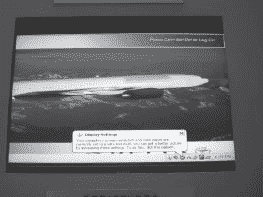
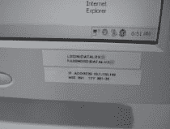
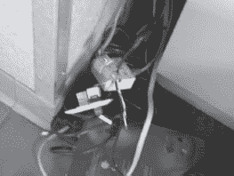

# 第九章：自助服务终端

这些自助服务电子终端随处可见。它们坐在那里，一副得意洋洋的样子，嘲弄着不懂技术的黑客，简直就是求人搞砸它们。你猜不懂技术的黑客会做什么？嗯，大多数情况下，他们只是看着它们。但正如你已经知道的，黑客看待事物的方式与普通人不同。当一个黑客看着一个自助服务终端时，那东西就会打开，暴露出比你想象的更多的东西。但当自助服务终端不仅仅是一个自助服务终端时会发生什么？当自助服务终端包含航空公司乘客信息时会发生什么？如果自助服务终端包含机密患者信息怎么办？如果自助服务终端装有现金怎么办？不懂技术的黑客会以不同的方式接触这些设备吗？可能不会。毕竟，不接触的方法走得更远。但是，如果一个不懂技术的黑客真的决定触碰这些东西，生活会变得非常有趣。然后，他们可能会做一些非常恶劣的事情，比如按下 SHIFT 键，闯入这个东西。

# 理解自助服务终端黑客技术

“交互式自助服务终端是通过电子方式提供信息访问的计算机终端。交互式自助服务终端有时类似于电话亭，但也可以在长椅或椅子上使用。” *http://en.wikipedia.org/wiki/Internet_kiosk.*

这些天到处都是自助服务终端。没有人比黑客更了解这一点。尽管大多数人不将交互式自助服务终端视为安全威胁，但请记住，这些都是连接到后端数据库的网络数据终端，存储着许多有趣的数据：姓名、地址、电话号码、社保号码、信用卡数据、银行信息甚至医疗数据。尽管大多数黑客只是因为这些设备很有趣而去探索，但恶意的不懂技术的黑客可能追求的不仅仅是几声笑。让我们通过一个不懂技术的黑客的眼睛来看看一些自助服务终端。

下一张照片展示了一个典型的机场自助办理登机手续的终端。

当我看到这样的机器时，我会问自己几个问题。我想知道这台机器运行的操作系统是什么。意识到这个东西是网络化的，我会想到它使用的协议类型，如果它运行 TCP/IP，我会想知道它使用的地址和端口。经过十多年把机器视为网络上的地址，这已经成为了本能反应。通过传统方法找到这些问题的答案需要相当多的工作。

首先，我需要找到一个接入亭网络的地方。然后（假设我已经弄清楚了机器使用的网络协议），我需要连接一台机器到网络上，并开始嗅探流量，看看我能发现什么。如果网络很安静，我就得开始扫描网络，试图让机器做出响应。一旦接入亭与我交流，我就会分析结果来猜测操作系统。一旦我确定了所有这些信息，我就可以制定攻击计划。这将是一个无聊的（我的意思是典型的）方法。如果我想要更有趣，我会攻击接入亭的输入。忽略屏幕键盘（肯定不会让我输入任何有趣的特殊字符），我会专注于信用卡刷卡。我可能会刷一些恶毒的一、二或三磁道“信用卡”，并将它们全部刷过读卡器，试图让接入亭出故障。如果我感觉很牛，我会制作自己的带有恶意数据的假护照，并将它们刷过读卡器，试图破坏这个东西。为了覆盖所有可能性，我想我可以带一大袋伪造的卡片和护照，通过它们全部（同时抵挡 TSA 特工的袭击）知道最终会有什么东西出问题。然后我会在联邦拘留所里得意地笑，知道我离拥有一个机场接入亭只差一步之遥。

或者，我可以不用技术，保持警惕，继续我的日常生活，完全合法。然后，也许，我会看到像这样的东西。

我会悠闲地走过去，拍几张像这样的照片：

然后，我会知道接入亭运行的是 Windows 的某个衍生版本，因为只有 DOS 使用那种丑陋的字体，而 DOS 不太擅长网络，所以这要么是一个命令行壳或者是单用户模式。我会知道它连接到一个 TCP/IP 网络，接入亭使用的 IP 地址是 10.160.7.26。我会知道这是一个私有网络，因为保留了“10.”地址。我还会知道接入亭连接到一个位于 10.52.20.4 的服务器，并且它尝试在 402 端口上连接，IANA 说这个端口被*Genie 协议*使用，这个协议被一个名为 Altiris 的产品使用。我的朋友克里斯·伊格尔提出了下一个研究步骤，他建议进行一个“幸运之神”谷歌搜索*“Creating TCP socket for” “on 402”*，这将确认接入亭正在运行 Windows，正在运行 Altiris 软件，并且错误消息来自*DOS BootWorks*。我会知道所有这些信息，而不用触碰机器或网络，也不用冒任何法律风险。这就是无技术黑客的操作方式。

一个无技术的黑客已经了解了像下面这张照片中的公共互联网电话的内幕。

一个无技术黑客只需注意到——这台高科技电话运行了*chkdisk*，暗示着它的 DOS 根源，它受损于一个坏硬盘，以及这个可怜设备上哪些文件记录段是坏的。他或她会知道所有这些，因为下一张照片证明了这个愚蠢的东西吐出了一个毛球。

机场信息屏幕同样易读，特别是当它们出错时。下一张照片展示了一个 Windows 任务栏。

正如我们在第三章中所讨论的，每个图标都有其含义。我们可以判断（除其他外）终端运行的是 Windows，而机场依赖于 Symantec AntiVirus（从左边数第五个图标）。

出发信息板同样被无技术黑客所瞥见，就像下一张照片显示的那样。

这个屏幕显示了有关出发信息数据库、正在使用的地址和协议的信息，甚至显示了应用程序完全定制的信息，因为对各种诊断消息进行谷歌搜索几乎没有结果。

先别管机场候机楼了，让我们看一下典型的医院。即使在医院里，无技术黑客仍然保持好奇心。看看下一张照片。

一眼就能看出备受欢迎的 Windows 操作系统，还有一些有趣的应用程序：McKesson PCView（谷歌搜索结果高达六个）和*4dClient*（闻起来很像 Novell）。下一张照片将帮助完整呈现这个画面。

大大的“N*”*提示着 Novell Netware 客户端，还有麦克菲杀毒软件图标，以及 Numara 的*Track-It*帮助台和资产管理软件图标。IP 地址也可见。我意识到这些信息似乎很少，但请记住，这些都是在没有触碰键盘并且没有利用任何高科技攻击的情况下捕获的。每一点微小的信息都是传统攻击者要努力获取的免费信息。

医院的移动护士站甚至是更酷的目标。在下一张照片中看看。它是移动的、无线的，而且令人难以抗拒。

即使远远地看，也能看出这台机器正在运行 Windows，并且启用了 Active Desktop。更近距离的视图更加有趣。

所以，从图标上看，我可以判断这台机器连接了无线网络，并且声音没有静音。有趣。我可以看到这台机器使用 USB 或 PC 卡，现在的时间是下午 6 点 51 分。我还可以看到 IP 地址是 10.1.150.166，天啊！！！那是密码吗？！？是的，在那张贴纸上有一个用户名和医院网络的密码。让我斜体打出来以增加效果。*一个用户名和医院网络的密码*。

“但是那个东西上不可能有患者信息，”你可能会说。看看下一张照片。

是的，我几乎把整张照片都模糊了，但是那是*charting*这个词，是的，那是患者的图表，上面充满了各种敏感的医疗信息。你会拼写 HIPAA 吗？我不确定这家特定的医院能否做到。

站在一台交互式信息亭旁边看会变得极端无聊。最终，一个不懂技术的黑客会想要与信息亭进行互动。总共有五种键盘组合可以弹出大多数信息亭，但我们只提一种——很少被提及的组合。我的一个好朋友，CP，有这样一种疯狂能力，可以让机器做出疯狂的事情，正如下面的照片所示。CP 在信息亭的自然环境中拍摄了这张就业信息亭的照片。

这台特殊机器的设计者相当聪明——他们去掉了大多数邪恶黑客（脚本小子）用来搞砸事情的键。尽管如此，*SHIFT*键还在那里，CP 利用它得心应手。他连续敲击了五次，信息亭发出了讨厌的鸣叫声，多亏了 Windows 的*粘滞键*功能。下一张照片中的弹出窗口标志着乐趣的开始。

*粘滞键*弹出窗口将信息亭从信息亭模式切换到 Windows 模式。这使 CP 可以访问*开始*菜单和任务栏，下图可见。

尽管 Windows 会话仍然非常有限，任务栏透露了很多信息。我们可以看到信息亭程序被称为*Unicru*（[www.kronos.com](http://www.kronos.com)），谷歌搜索显示它是由 Lowe’s、Hollywood Video、Circuit City、Toys R Us、Best Buy、Whole Foods 和 Blockbuster Video 等企业运行的人力资源应用软件。这很有趣，因为它表明这种粘滞键“攻击”也将针对他们的应用信息亭起作用。下一张照片显示了任务栏的右侧。

这张照片显示，信息亭在美国国防部网络信息中心拥有的地址上运行 VNC 服务器。我不确定这究竟意味着什么。但是 CP 可能刚刚发现，一些主要的零售连锁店实际上受到美国国防部的控制。这解释了一些收银员态度强硬的现象。

CP 也研究了其他信息亭。下一张照片显示了一家全国性书店连锁店使用的定制信息亭。与医院的信息亭不同，这是故意放在商店供顾客互动的。在低峰期，一个低技术的黑客可以在没有引起怀疑的情况下玩弄很多分钟。

几下**SHIFT**键就会出现粘滞键配置，以及其他辅助选项，如下图所示。

粘键“黑客”并不能针对每个亭机起作用，但它对很多亭机都有效，它是又一个简单的无技术黑客的光辉例子，可以绕过现代安全限制。

# 现实世界：ATM 黑客

电子票务终端、就业亭、医疗记录亭等都很有趣，但无可争议的亭王是自动取款机（ATM）。我是说——这个东西里面装着*现金*。它是各种攻击者的自然目标，无论是高科技还是无技术的攻击者。当我看到接下来的照片场景时，我不得不拍一张照片。

两位技术人员如此专注于工作，几乎没有注意到我。我又拍了几张照片，最终穿蓝衬衫的技术员接到了手机的电话，走开了。虽然他仍然在他的岗位附近，但我知道他正在同时进行多项任务，对周围的世界毫不在意。我趁机靠近。我站在机器旁边，刚好躲避了另一侧的笔记本电脑用户的视线。我低头看着，并拍下了下一张照片。

纠缠在一起的电线很有趣。我认出它们是标准的网络电缆。我认出了照片底部的灰色设备，并拍了一张更好的照片。

这台思科 1700 系列路由器看起来明显过时，但至少它还能被认出来。我对 ATM 机并没有进行过多的研究，但我一直认为它们是依赖于奇怪的硬件和专有协议的非常奇特的机器。网络电缆表明使用了一种常见的协议（如 TCP/IP），而思科路由器则加强了这一点。当我看到 ATM 的背后时，我看到网络电线从机器的背面拖出来，想知道它是否总是从机器上突出来。这也让我想知道我是否可以稍后回来，连接上我的集线器或路由器，然后摆弄这台机器。当蓝衬衫结束了他的电话并回到岗位时，我从机器后退了一步。我知道我永远不会回来尝试我的有关网络电缆的理论。我知道那条路会导向何方，我不打算因为好奇心而被关起来。我穿过大厅，注视着技术人员。蓝衬衫打开了柜子的前面，他的手机再次响了。他走开了，我拍了一张 ATM 内部的好照片。

机器内部藏着一个看起来像是标准的个人电脑台式机，横放着。我知道通过谷歌搜索 ATM 机的名称并挖掘手册可能会得到更多信息（是的，这样也行），但这样更有趣。我是建筑物里的访客（我提到我安排了一个关于无技术黑客的讲座吗？），尽管不断有人来往和我明显缺少访客徽章，但我就在这里潜伏着拍下了 ATM 技术人员的照片。通过谷歌搜索不会有同样的感觉。我拍了一张蓝色衬衫男子笔记本电脑的照片，它孤零零地放在机器顶部。

我不能谈论我在屏幕上看到的太多内容，或者他电脑侧面那个看起来像是天线的东西是干什么用的，ATM 技术人员是如何使用它的，因为那样做是不负责任的。我也不能确认或否认我可能了解的有关技术人员如何（或是否）与机器内的保险柜进行交互以及他是否（或是否）容易受到肩部冲浪的影响，当他对保险柜进行操作时（或未操作）。此外，我的目标是另一个人——他看起来像真正的技术专家。我转向右边，站在他身后，拍了一张照片。

我也可以拍视频，了解他使用的工具、协议和流程（或者可能没有使用）与 ATM 机进行交互的方式，如果我是个坏人，我可能已经在通过一次成功的无技术黑客攻击实施了我的第一次 ATM 抢劫。是的，我再也没有回到那台 ATM 机。也没有打算回去。
