第十章 车辆监视

没有汽车追逐场景的间谍电影是不完整的。但这需要大量的拍摄，熟练的剪辑和庞大的预算，所有这些都是为了创造一些令人兴奋但是虚假的东西。大多数人不知道的是，有些最令人兴奋的车辆间谍活动发生在车辆根本不动的时候。

# 车辆监视有多容易？

无论我是要进入我打算闯入的客户大楼，还是只是四处走动，我都会注意到车辆。我不像汽车迷那样喜欢有趣的，老式的或异国情调的汽车，但我从观察他们的汽车来建立驾驶员的个人资料，我会感到一种（奇怪的）兴奋。非技术的黑客在这方面非常擅长，在这一章中，我会给你一个他们寻找的想法。看看下一张照片。你能告诉我关于驾驶员的什么？

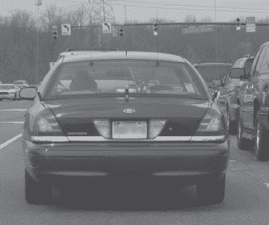

好吧，我承认——我们开始得很简单。除了从每个面板和窗口伸出的天线外，还有一个金属板（如下所示），准确地说明了这是什么类型的车辆，以及驾驶员从事的工作。

如果你猜到这辆车是“卧底”或“未标记”的警车，那么你是对的，你可能真的对车辆监视有一种特别的感觉。接下来的逻辑推理是，可以安全地假设驾驶员要么是警察，要么是他刚刚偷了一辆警车。

让我们看看另一个。你能告诉我关于下一张照片中车辆的驾驶员有什么信息吗？

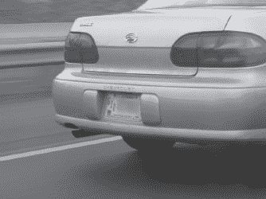

标签上写着“美国政府”和“仅限官方使用”。如果你猜到了*政府雇员*，恭喜你，你答对了。继续保持。让我们看另一个例子。看看下一张照片。对于这辆车的司机*从事*什么工作，这更明显了，但是一个非技术的黑客会考虑利用这些信息做什么呢？

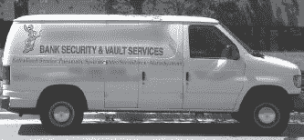

当我第一次看到这辆货车时，我想到了*社会工程学*。穿着合适的衬衫，带着正确的标志，我可以成为“阿克米”银行安全与金库服务的人，准备为这家公司的保险柜，金库，气动系统或报警系统工作（尽管黑客根本不会对这些事情感兴趣）。我们来做另一个练习。看看下一张照片。

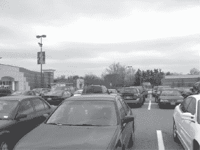

大多数普通人只会看到一个拥挤的停车场。一个足球妈妈会立刻知道这是科尔斯百货商店的停车场，他们会立即左转，被“本季度最大的促销活动”所吸引，这每隔一周就会发生一次。像我这样的书迷会认出停车场对面的巴诺书店。一个非技术的黑客会立刻想到“联邦”——联邦特工的俚语，用来识别联邦政府雇员。他怎么会意识到这一点呢？你能从上面的照片看出来吗？如果你不能完全确定，看看下一张照片，它突出了“联邦特工”的车辆。

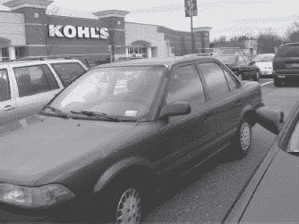

靠近一点，无技术黑客会意识到这辆黑色车确实是政府雇员所有的，他或她也会大致知道这名雇员上班的地方。所有这些信息以及更多信息都可以从贴在车窗上的车辆许可证中获取，就像下面显示的那样。

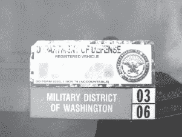

这些贴纸随处可见，特别是在保持大量军事或政府存在的地区，如军事基地和政府拥有的商业走廊。许多设施还使用颜色编码的许可证，就像下一张照片中显示的那样。

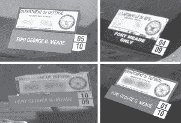

这些许可证的颜色（或灰度，由于黑白打印的光谱挑战性质）是重要的，因为它们揭示了员工的身份和/或级别。在某些情况下，级别更为突出显示，就像下一张照片所示。

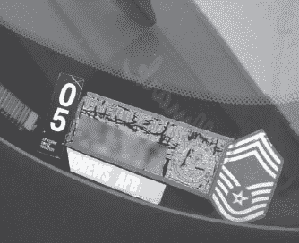

在这种特殊情况下，通过快速的谷歌搜索，可以发现这辆车的所有者是美国空军的首席军士长。

有些贴纸让我感到好笑，比如下面这个。

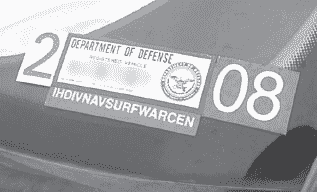

有趣的不是贴纸本身，而是那个缩写—IHDIVNAVSURFWAR CEN。这一定是我在现实生活中见过的最长的缩写之一了。我曾经想跟随这辆车，看看“冲浪战争”到底是什么样子。这肯定会赋予“冲浪”一个新的含义。政府雇员并不是唯一受到无技术黑客关注的人。快速看一眼下一张照片中的沃尔沃，就可以知道车主工作或居住的地方。你能告诉我是怎么看出来的吗？

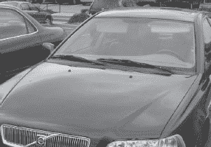

答案不在车辆的车牌或 VIN 号码上，而是在下面显示的车窗贴纸上。

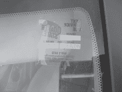

照片由加兰·格莱斯纳提供

像这样的换油贴纸似乎相当无害，但无技术黑客可以通过简单的推理意识到地址可能靠近车主工作或居住的地方。如果车辆停在工作停车场，而地址不是当地的，那么它可能靠近他们的家。大多数人不会在正常通勤路线之外的地方换油。

在某些情况下，通过查看他们的车辆，很容易了解司机的历史。根据下一张照片，你能告诉我司机住在哪个城市，城市的哪个部分，以及大约住了多久吗？

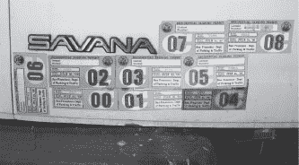

照片由加兰·格莱斯纳提供

城市很容易辨认—它写在停车许可证上。猜测他或她在旧金山住了多久是相当直接的，考虑到第一个停车许可证在 2000 年 7 月到期。要弄清楚司机在旧金山的住址需要一些创造力。然而，谷歌是无技术黑客的朋友。快速搜索*旧金山居民停车许可地图*，我们就会找到一个方便的 PDF 地图，其中的一部分如下所示。

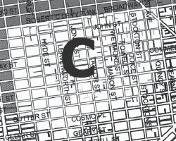

地图清楚地标明了许可证的有效范围，指引我们到驾驶员居住地的大致区域。下一张照片非常相似，可以用来推断相同的信息，但在这种情况下，一个无技术的黑客也可以确定驾驶员以前居住的地方以及他们搬家的时间。你能吗？

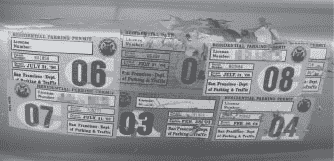

照片由 Garland Glessner 提供

根据停车许可证上的日期，驾驶员在 2004 年 2 月至 6 月间从旧金山住宅许可区“A”搬到了住宅许可区“C”。通过我们在上面搜索的地图，我们可以很好地了解旧金山的这两个住宅许可区的确切位置。

到目前为止，我们只看了车辆的外观。尽管我们可以利用外部线索推断出许多其他信息，但一些最好的东西通常就在车辆内部，任何经过的人都可以看到——就像下一张照片中的收据一样。虽然我不得不调整我那糟糕相机的变焦来拍摄文件，而不是拍摄窗户上的雨滴，但我觉得照片拍得相当不错。

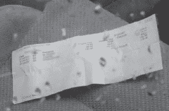

这张收据列出了医生的姓名、地址和电话号码，患者的（据推测是驾驶员的）姓名和保险公司，以及在那个特定日期进行的服务清单，以及这些服务的收费是多少。大多数人非常谨慎地保护他们的医疗信息，但我经常惊讶地发现像这样的信息公开出现。

对大多数人（和大多数身份盗窃者）来说，比医疗数据更重要的是金融数据。我在一个员工停车场拍摄了这张照片。该文件属于一位高级主管。

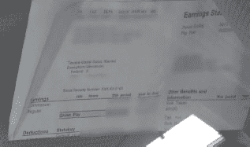

正如你所见，它透露了员工的姓名、福利信息、净收入和总收入、税务信息等等。在我看来，最有价值的信息是员工社会保障号码的最后四位数字，这在大多数自动身份验证系统中用作安全问题。凭借这些信息，我可以轻易地以此人的名义建立信用或完全窃取他们的身份。

当然，当我在公开场合获取这样的信息时，我往往会感到十分激动，但是下一张照片提醒我，有些人根本不在乎保护他们的隐私。这正是为什么身份盗窃将继续成为一个繁荣的犯罪业务的原因。

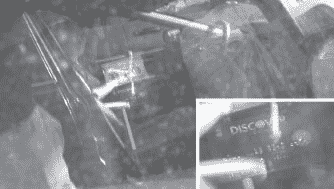

我忍不住要说一句冷笑话，“发现（Discover）真的很值得。” 这张信用卡的数字可以轻松用于从不遵守严格信用卡筛选程序的任何供应商那里购买商品，而且很多供应商确实不遵守这些程序。 如果你把你的医疗记录、银行对账单或信用卡放在前座上，很有可能在你来得及移开之前，一个非技术型的黑客就已经看到了。 正如我在其他章节中所说的，保护自己的关键是保持警惕，试着从一个非技术型黑客的角度看待生活。 请查看附录以获取更多好建议。
