第十一章 徽章监控

# 你们的徽章在哪里？

我喜欢扮成电话人进入建筑物。这是我最喜欢的装束，因为我有工具、术语和服装。但是没有正式的徽章，我就只是一个带着一袋小玩意和一个傻傻的衬衫的笨蛋。徽章让造型完美，而造型让我成为电话人。但是徽章难道不仅仅是一张覆膜的纸吗？不，它真的远不止这些。在安全术语中，它是一种*身份验证令牌*。当我把它递给别人时，他们会看着它并得出一个关于我的结论。视觉识别导致弱身份验证，但这就是大多数我攻击目标建筑物内部的工作方式，所以我利用了这个致命的安全漏洞。知道一个非技术的黑客可以在偷偷看了一眼后轻松复制一个徽章，我对我每周在公开场合发现的数百个徽章感到相当惊讶。

即使我经常在公开场合看到这些愚蠢的东西，当我看到一个新的时候，我还是会感到兴奋，因为我确信我可以以某种方式利用它来获得对那家公司的访问权限。即使他们采用某种电子系统来验证卡片——我们稍后在本章中会详细讨论这些系统——我也可能使用徽章来尾随或社交工程的方式进入。对于现场徽章感到兴奋是奇怪的，我知道，但我已经接受了我不正常的事实。所以这些日子我走得很远。我随身携带相机，随时随地拍摄我在野外看到的徽章，就像下一张照片中我在当地购物中心看到的那个。

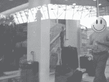

很多时候，徽章是一起出现的，就像下一张照片显示的那样。

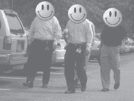

当我在一个大型公司大厦的大厅里等待（当然是在合法的业务中）时，我被从墙上的平板电视屏幕喷出的公司助威幻灯片的嗡嗡声吸引了。就在我陷入无聊的昏睡之前，我看到了下一张照片上显示的屏幕。我几乎在躺椅上摔倒，试图及时拿出相机。

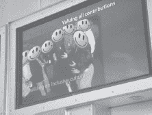

这张幻灯片是几张幻灯片中的一张，显示了各个阶段的员工——在进行企业融合时——都戴着他们的徽章。我对破解这个建筑物没有真正的兴趣，但在大厅待了两分钟后，我已经得到了足够的信息来伪造一张覆膜的纸制通行证，并尝试操纵这个建筑物。

多年来，政府机构一直知道员工离开工作场所时应该摘下徽章。在执行这项政策方面，更为神秘的机构非常积极。发现在更为神秘的政府建筑周围很少有露天徽章并不让我感到惊讶。这里的关键词是*很少*。在华盛顿特区一段时间后，我发现了一家由办公楼租赁公司举办的露天烧烤活动。这个活动旨在感谢各种公司租户，其中一些与政府有关。当我在大型餐饮帐篷周围闲逛时，我对发现的徽章数量感到惊讶。我忙着拍摄人们的照片，以至于几乎忘记享用免费的食物。

虽然我看到了属于几家不同公司的徽章，但有些徽章比其他的更令人惊讶，比如这里的机场徽章。

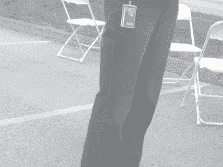

我很确定我不能穿着一张看起来脆弱的仿冒徽章随意进入机场，但是考虑到这张照片是在机场范围之外拍摄的，它还是很有趣的。此时，我将拒绝提及最近有关 TSA 丢失数百件制服的新闻报道。我也不能证实也不能否认，穿着（或不穿着）TSA 制服是否有可能未经授权地进入任何机场物业。

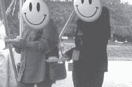

当我继续在餐饮帐篷周围闲逛时，排队等候的两名女士引起了我的注意（并非出于那种方式）。两人中较高的那位看起来非常重要。她穿着一套漂亮的黑色西装，在她的黑莓手机上进行着听起来很重要的对话。吸引我眼球的不是那个极客范儿的手机，而是她项链上悬挂的一大堆徽章和配饰。在科技圈子里旅行，我见过不少项链上的杂乱徽章，但这位女士是女性中携带最多颈饰的冠军。

当我走近一些时，我意识到她的徽章明显带有政府的风格。我拍了几张照片——她们似乎都没有注意到——检查照片后，我意识到我对更有趣的徽章拍摄的角度很糟糕。当她继续和手机里的人聊天时，我转到她的另一侧，尽可能靠近她，而不触发她（承认受损的）的跟踪侦测系统。离她不到一英尺的地方，我拍下了下一张照片。

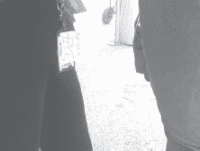

这张特定的徽章是发给驻扎在五角大楼的政府雇员的。便利贴提醒她“带上昨天全体员工的副本到 DSS 总部”。毫无疑问，五角大楼的安全措施是首屈一指的。我从个人经验中知道，驻扎在五角大楼的警卫是认真的。他们不容忽视。我也知道，在五角大楼，徽章的视觉识别绝对毫无意义。所有徽章都经过电子验证，该电子过程的安全性是世界一流的。我也相当肯定那些看起来凶狠的自动步枪是真的。

尽管如此，我认为五角大楼的安全小组会感到震惊，如果他们知道员工对徽章是多么随意。我并不是在指责五角大楼，但我认为重要的是要提到，即使是最顽固的政府机构有时也会雇佣粗心大意的人类。五角大楼制定的*政策*确保粗心行为不会对设施的安全形势产生负面影响，企业安全官员应该牢记这一教训。员工徽章的视觉识别并不是一种安全的身份验证机制。不要给社会工程师留下任何机会。建立一个安全的访问机制，并以明确可执行的政策支持，员工理解并遵守。员工应该明白安全不是别人的问题。

## 电子徽章认证

我认为我已成功建立了视觉徽章识别是一种不安全的安全程序。电子验证是一种更安全的身份验证方法，但这些系统也存在安全问题，对它们的无技术攻击也很有趣。在下一张照片中，常见的近距离卡就在眼前。

高科技徽章攻击

*刷卡*和*近距离*或*非接触*卡之间存在许多技术差异，但它们可以以类似的方式受到攻击。两者都可以被复制，但由于 Jonathan Westhues 开发的设备（详细信息请参见 http://cq.cx/prox.pl），即使将非接触卡放在口袋或钱包中，也可以从远处复制。为了防止这种类型的攻击，考虑将访问卡与 PIN 识别方案相结合，或部署依赖加密、挑战-响应系统或读卡器访问列表的系统，如 HiD 的*iClass*系列。

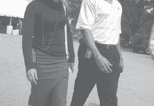

这对夫妇执行了很好的常识，取下了他们的工地徽章。然而，他们的访问卡仍然摆在眼前。尽管存在克隆卡的可能性，但在无技术黑客精神的基础上，还有另一种攻击方式。对手可以简单地查看卡片以了解很多信息。考虑下一张照片中显示的典型*Datawatch*卡。  

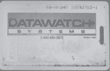

卡片上的免费电话号码直接通向 Datawatch Systems。对手所需做的就是拨打这个号码，与代表交谈（或稍微进行社交工程），读出顶部一行数字，就能了解到卡片可用于哪个地址和建筑物编号，有时还包括套房或房间号。

大多数人永远不会考虑在自己的额头上贴着一个纸条，显示自己的工作地址，但令人惊讶的是，有多少人在明显的地方佩戴这些电子卡片，基本上透露了相同的信息。离开工作区时，应该将这些访问卡取下来。

## 真实世界的徽章监视

CP 给我发来了一个关于他的电话维修工牌照被精心利用的有趣故事。CP 的风格让这个故事更加有趣，所以我以他的原话包含在内。

“一个[电话公司]的员工来到我的工作地点修理我们的 DSL2 线路，当他工作时，我在某些[电话公司]政策上使他困惑，并暗示他可能实际上并不是来自[电话公司]（有人尝试黑客攻击我），并且我需要他的徽章照片作为‘安全参考’。然后他问我为什么需要这个，我告诉他这只是个人政策，他实际上并不需要遵守，但他还是递给了我他的徽章挂绳，并继续工作，而我则用手机相机拍摄了他的[三家公司]徽章。当我用手机相机拍照时，他似乎有点紧张，但之后我给了他一罐雪碧和一杯*Patrón*（我们办公室里有这些），他拒绝了酒但接受了苏打。这似乎让他放松了一些。” -CP

接下来的三张（经过大幅编辑的照片）证明了 CP 的成功。

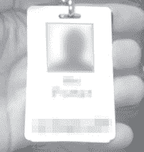

照片由 CP 提供

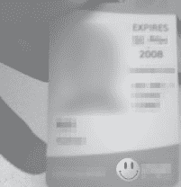

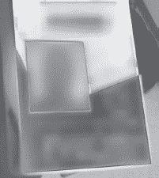

这次攻击故意保持简单，但非常巧妙。他将自己的好奇心称为“个人政策”，并为技术人员提供了一个简单的借口，让自己显得不那么具有威胁性（毕竟 CP 是好人）。通过给这个家伙一杯饮料，他让技术人员放松了心情，很可能他从未报告过这一事件。如果 CP 是坏人，你的办公室现在很容易会有一个非技术的电话公司“修理工”。

这个下一个真实世界的黑客攻击将几种技术结合在一起，形成了一次成功的攻击。一天，当我开车四处转悠时，我看到一个非常明显的政府蓝徽章出来散步。由于我当时正驶过一个看起来很普通的办公园区，政府徽章的出现让我感到惊讶。当我掉头回去拍照时，我追丢了那个政府人员。我驶入其中一个停车场，绕着转圈，试图弄清楚哪栋建筑物属于政府。所有建筑物看起来都一样，许多都没有标记，这让我的工作变得更加困难。我想看看一些垃圾箱里面，但由于这不是一份付费工作，我想得更周到一些——没有*免于入狱*的卡片，工作可能很快就会变糟。相反，我继续在停车场里寻找更多的徽章。然后我看到了一个熟悉的停车许可证。我走到车辆旁边，拍下了下一张照片。

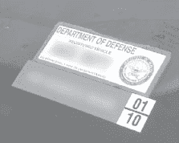

当我环顾四周停车场时，我意识到围绕着一个特定建筑物的每辆车都有一个国防部停车许可证。我毫无疑问地知道我找到了政府建筑。我跳回车里，开始围绕建筑物慢慢行驶，观察员工。几圈后，我看到下一张照片中的家伙走出建筑物。你看到了我看到��吗？

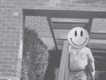

在未经修改的图像中，蓝色徽章非常清晰，我立即认出它属于一个非常有趣的政府机构。照片中的家伙看着我，当我开车经过窗外拍摄他时，但他似乎没有注意到。他正忙着在手机上聊天。我决定停车，步行绕建筑物走一圈。当我绕着建筑物走时，我经过了几名员工，发现在行走时很难悄悄拍摄徽章照片，所以我放弃了悄悄行事，开始像正常人一样拍摄。将相机举到眼睛水平，我将下一个静止画面拍摄为视频剪辑。

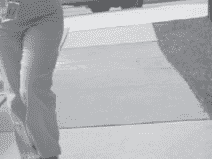

如果照片中的女士注意到了我，她没有对我说任何话。我也没有回应她——我忙着拍照。接着，我决定露营在一个侧门外。我把相机放在路边，镜头对着门，让它拍摄。我站在相机旁边，时不时弯下腰，弄弄鞋带（那天我没有穿我的特别的魔术贴运动鞋）。当然，这让我看起来不那么像一个可疑的露营者。我拍摄了很多很棒的静态照片，就像下面展示的这张一样。

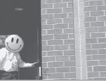

尽管站在路边看起来可能有些奇怪，但没有人问任何问题，所以我留了一会儿。这次露营之旅导致了我在尾随部分使用的镜头，该镜头以下一张照片中的员工进入建筑物开始。

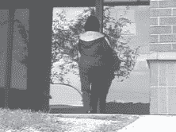

她穿过门后十秒，门只关上了一半。

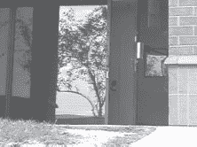

门花了整整十五秒才关上，这是我亲眼目睹过的关上最慢的门之一。当然，这会给坏人提供充足的时间悄悄通过。尽管我以这个政府设施为例，但我见过数百个公司大楼的安全性甚至比这个还要差。这里的要点是，尽管先进安全系统的出现，大多数安全系统仍然依赖于*人类*，他们通常是懒惰的、无知的，或者两者都有。无技术黑客意识到了这一点，并将以创造性和常常有效的方式利用这种安全漏洞。在本书中，你看到了很多例子，人们不仅注意到我在监视他们，还录制了他们和他们的环境。为什么他们不阻止我或通知别人呢？也许其中一些人不在乎。但在大多数情况下，人们不作反应是因为他们不知道该怎么做。如果你想让你组织中的人挑战闯入者或者报告异常事件，你需要做好两件事：

1）提供举报可疑活动的奖励。这不一定意味着金钱。在公司聚会上表彰和赞扬会传递出“警觉=好”的信号，积极主动的人会得到奖励。2）让你期望的响应既众所周知又容易实现。

诚实地说... 如果你看到我在你办公室外拍摄你的电脑并拍照，你知道你应该通知谁吗？你的同事们知道吗？如果没有人知道这是什么，只有一个“入侵响应政策”是不够的。定期和反复宣传它，并排练它，谁知道——也许在接下来的几个月里，你会抓到几个无技术黑客！
