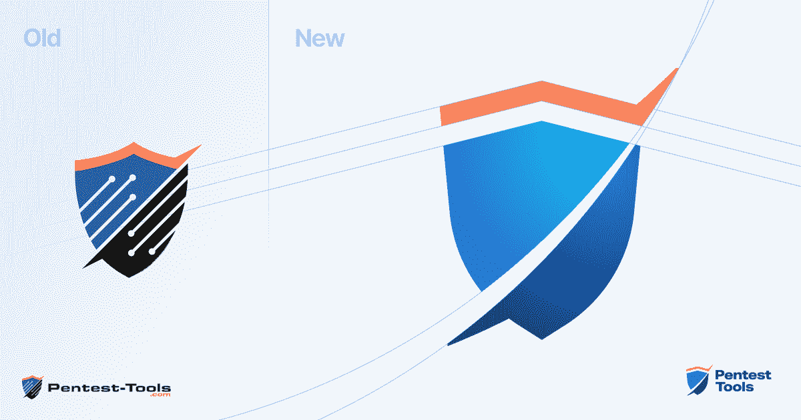
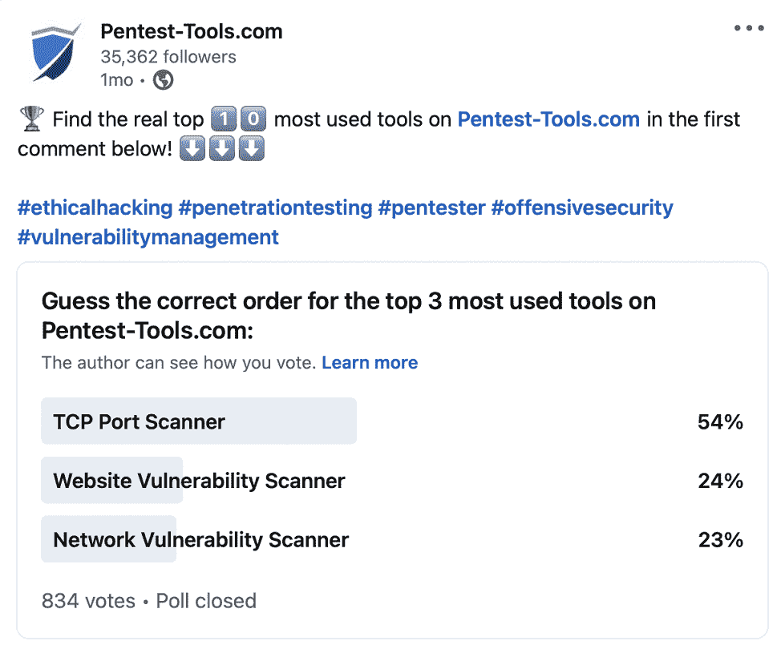
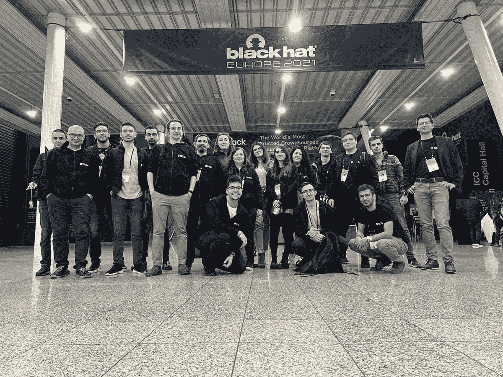
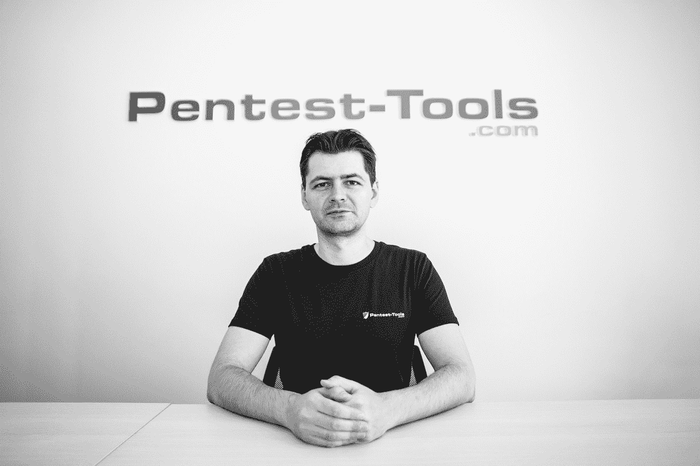

# 回顾 2021 年的 Pentest-Tools.com | Pentest-Tools.com

> 原文：<https://pentest-tools.com/blog/2021-year-review>

我们带着一点讽刺(因为幽默让我们保持理智)但也非常严肃地说，因为从各方面考虑，2021 年 Pentest-Tools.com 团队的好处大于坏处。

与您分享里程碑已经成为我们的一种传统，我们感谢不断增长的社区([仅 LinkedIn 上就有 35000 多人！这让我们脚踏实地，专注于真正推动测试的因素。](https://www.linkedin.com/company/pentesttools/)

无论是帮助我们的客户穿越高风险 CVE 的雷区，构建新的工具和功能来补充您的 pentesting 武库，还是创建检测和利用指南供您使用，我们每天都努力做到最好。我们感谢所有在信息安全这一广阔领域，以及远远超出这一领域的同行。

在我们今年通过[月度更新](https://pentest-tools.com/blog/categories/platform-updates)推出的几十项改进中，有三项非常突出:

> 道德漏洞利用是攻击性安全专家工作的重要组成部分，也是最具挑战性的方面之一。
> 
> *通过利用我们安全研究团队的专业知识和技能，我们可以复制攻击者如何利用高风险漏洞，并通过 Sniper 在自动化的受控攻击中使用该序列。*
> 
> Sniper 本质上让安全专家能够像网络罪犯一样快速行动，并在攻击者有机会利用它们危害组织和发动毁灭性攻击之前弥补安全漏洞。

艾德里安·富图纳，[Pentest-Tools.com](https://pentest-tools.com/)创始人兼首席执行官

*   我们从零开始构建的 [**网站漏洞扫描器**](https://pentest-tools.com/website-vulnerability-scanning/website-scanner) ，它运行更深入的测试，提高了准确性(并且在速度上没有任何妥协)，并对敏感信息进行深度爬行，以及其他重大升级；

*   [**共享项目&工作区**](https://pentest-tools.com/features/shared-workspaces) 功能，通过基于团队角色的简单、灵活的访问权限提高团队协作和工作流效率。

不仅仅是面向客户的平台在 2021 年获得了多项强大的更新。我们还推出了一个新网站 [**和一个品牌更新**](https://pentest-tools.com/blog/new-website-brand-update) ，在性能、可访问性、一致性和灵活性方面进行了全面的改进。

在平台上的 [20 多种渗透测试工具](https://pentest-tools.com/alltools)中，来自世界各地的客户一直依赖这 10 种工具来完成他们的工作并做得很好:

1.  [网络漏洞扫描器](https://pentest-tools.com/network-vulnerability-scanning/network-security-scanner-online-openvas)

2.  [TCP 端口扫描仪](https://pentest-tools.com/network-vulnerability-scanning/tcp-port-scanner-online-nmap)

3.  [网站漏洞扫描器](https://pentest-tools.com/website-vulnerability-scanning/website-scanner)

4.  [UDP 端口扫描器](https://pentest-tools.com/network-vulnerability-scanning/udp-port-scanner-online-nmap)

5.  [查找虚拟主机](https://pentest-tools.com/information-gathering/find-virtual-hosts)

6.  [查找子域](https://pentest-tools.com/information-gathering/find-subdomains-of-domain)

7.  [网站侦察](https://pentest-tools.com/information-gathering/website-reconnaissance-discover-web-application-technologies)

8.  [SSL/TLS 漏洞扫描器](https://pentest-tools.com/network-vulnerability-scanning/ssl-tls-scanner)

9.  [密码审计员](https://pentest-tools.com/network-vulnerability-scanning/password-auditor)

10.  [网址模糊器](https://pentest-tools.com/website-vulnerability-scanning/discover-hidden-directories-and-files)

有趣的是，当我们让 LinkedIn 上的攻击性安全专家社区对他们的个人喜好进行排名时，前 3 名看起来有点不同。超过 800 人投票，以下是他们的选择:

工具很棒，但是你知道什么更好吗？强大的测试功能使它们为您工作*和 10 倍于您的影响。*

*这就是为什么我们不断开发并向平台添加新功能，以链接工具并创建深思熟虑的自动化(我们称之为[pentesters](https://pentest-tools.com/blog/pentest-robots-automation-feature)的火箭燃料)，为您的工作流程中的特定目的服务。*

*在 Pentest-Tools.com 的 [10+功能集合中，客户最喜欢使用这些功能:](https://pentest-tools.com/features)*

## ***2021 年博客上的五旬节指南***

*我们没有停止在 Pentest-Tools.com 上发布和改进工具和功能，每个月都有更新。我们还为渗透测试人员编写了检测和利用指南，他们使用我们的博客作为改进工作的灵感来源。*

*evergreen 和 new guides 都进入了今年的前 10 名，因此值得将这篇文章加入书签，以便您将来深入研究特定的漏洞及其影响:*

1.  *[XSS 攻击的 5 个实际场景](https://pentest-tools.com/blog/xss-attacks-practical-scenarios)*

2.  *[常见的 SQL 注入攻击](https://pentest-tools.com/blog/sql-injection-attacks)*

3.  *[如何利用 Metasploit 利用 BlueKeep 漏洞](https://pentest-tools.com/blog/bluekeep-exploit-metasploit)*

4.  *[利用 Apache Struts 中的 OGNL 注入](https://pentest-tools.com/blog/exploiting-ognl-injection-in-apache-struts)*

5.  *[世界上最著名的端口扫描器 Nmap 内部](https://pentest-tools.com/blog/nmap-port-scanner)*

6.  *[保护网络服务器安全的基本 HTTP 报头](https://pentest-tools.com/blog/essential-http-security-headers)*

7.  *[使用 Pentest-Tools.com 检测 ProxyShell(对 Microsoft Exchange RCE 进行预授权)](https://pentest-tools.com/blog/detect-proxyshell)*

8.  *[如何利用 PHAR 反序列化漏洞](https://pentest-tools.com/blog/exploit-phar-deserialization-vulnerability)*

9.  *[如何利用 DotNetNuke Cookie 反序列化](https://pentest-tools.com/blog/exploit-dotnetnuke-cookie-deserialization)*

10.  *[如何使用 CVE-2020-5902 (TMUI RCE)攻击 F5 BIG-IP](https://pentest-tools.com/blog/big-ip-tmui-rce)*

*为了更好地深入了解 2021 年可能每个 pentester 都必须处理的 CVEs，我们添加了两个通用指南，帮助您简化常见类型的雇佣工作流程:*

## ***2021 年活动和社区支持***

*事实证明，在这多事之秋，infosec 社区的优秀人员在保持技术生态系统稳定方面发挥了重要作用。事实上，当你读到这里的时候，他们中的许多人仍然在和 [Log4Shell](https://pentest-tools.com/blog/how-we-detect-log4shell) 打交道，并且在过去的几周里日复一日都是如此。*

*他们对终身学习、不断实践和知识共享的承诺鼓舞了我们，也证明了我们选择了正确的“部落”。*

*以下是我们在 2021 年所做的事情，旨在为让世界变得更安全的共同努力做出贡献，并帮助[教育其他人](https://pentest-tools.com/blog/build-infosec-career)也这样做。*

### ***我们对新 OWASP 前 10 名的贡献***

*今年，我们成为 OWASP 的正式企业成员，OWASP 是最大和最有帮助的技术社区之一。*

*我们的使命与 OWASP 在全球加强和改善软件安全性的目标相一致。我们尽最大努力贡献我们的数据和专业知识来帮助新的和更新的 [**OWASP Top 10**](https://owasp.org/Top10/) 的创建者，这是一个几乎每个信息安全专家都依赖的行业标准。*

### ***在伦敦参加黑帽欧洲 2021***

*任何打破常规，超越屏幕与你联系的机会都会让我们心情愉快。这就是为什么我们很高兴能参加今年的黑帽欧洲大会，无论是现场还是在线。*

*黑帽欧洲 2021 是我们自 2019 年以来第一次亲自参加的活动，与老朋友重新联系并结识新朋友的感觉真棒！另外，[我们的创始人兼首席执行官阿德里安·富图纳](https://www.privateinternetaccess.com/blog/interview-with-adrian-furtuna-pentest-tools-com/)首次现场演示了[狙击自动剥削者](https://pentest-tools.com/exploit-helpers/sniper)！*

*在 DefCamp 跳过了 2020 年的一个版本后(我们都知道为什么)，我们几乎在 DefCamp 上见过面，但机会之窗在事件发生前几周关闭了。由于适应是我们在信息安全中的一部分，DefCamp 团队齐心协力，完成了他们的第一个在线版本！*

*作为长期与会者，我们很高兴这个活动的发生，以及它如何把我们大家聚集在一起。*

*一系列的演示都非常关注渗透测试，并且我们会在演示录音上线后立即与您分享一些重要的知识。更重要的是，Adrian 在一个小组中讲述了他作为网络安全企业家的经历，这个小组有几十个可教的时刻。*

*所有的演讲者都非常投入，并在两天内带来了他们最好的研究和见解，提醒我们所有人为什么 [DefCamp](https://def.camp/) 是真正的社区活动。我们希望明年我们能和 IRL 见面！*

**

****

> **尽管每个人都在某种程度上面临着挑战，但我们的业务在过去一年中仍保持了增长和繁荣，对此我们深感欣慰。**
> 
> **我们的团队不断扩大，以跟上客户数量的增长，他们依赖我们作为他们基于云的安全测试的首选解决方案。**
> 
> **当关键的、广泛的漏洞出现时，我们也设法站在第一线。我们团队的快速响应能力以及帮助客户检测和指导补救的能力在迅速减少攻击面方面发挥了重要作用。**
> 
> **我为团队中的每一个人感到骄傲，感谢他们的努力和贡献，感谢他们继续支持彼此和更广泛的 infosec 社区。**

*[阿德里安·富图纳](https://pentest-tools.com/blog/authors/pentest-adrian)，创始人兼首席执行官*

## ***一个崇尚信任和奉献的更强大的团队***

*[Pentest-Tools.com 团队](https://pentest-tools.com/team)在过去的一年里整体上翻了一番，还特别增加了新成员，他们加入了我们的漏洞研究团队。*

****

> **2021 年是一场持续的战斗，以平衡以下几个方面:新兴的关键简历、从头开始开发 Sniper(并不断改进它)，以及发展一个能够开发对我们的客户具有巨大价值的模块的自主团队。**
> 
> **从年初的两人团队，我们成长为六个人，他们正在加强 Pentest-Tools.com 作为一个检测、利用和对高风险漏洞进行后期利用的平台。**
> 
> **为我们的客户提供一种可靠、有效的 Metasploit 替代方案是一项挑战，我们对此充满热情并全力以赴。”**

*[丹尼尔·贝切尼亚](https://pentest-tools.com/blog/authors/pentest-daniel)，安全研究主管*

## ***为您打造，与您同行***

*如果不花时间与客户交流，了解他们的需求，就无法构建工具来放大您的最佳作品。我们的客户成功团队正是这样做的，我们计划在 2022 年及以后加倍努力。如果你想和我们谈谈，我们会一直在这里倾听和帮助你。*

****

> **我们的客户大多好奇于探索新的、增强的安全测试工具，如[狙击自动开发工具](https://pentest-tools.com/exploit-helpers/sniper)或新的[网站漏洞扫描器](https://pentest-tools.com/website-vulnerability-scanning/website-scanner)。**
> 
> **我们收到了许多关于检测 [Log4Shell 漏洞](https://pentest-tools.com/blog/how-we-detect-log4shell)的问题和请求，这让我们很高兴(也很自豪)地知道，客户依赖我们在考验他们极限的时候为他们提供所需的工具。**
> 
> **2021 年，客户成功团队致力于通过更深入的一对一对话来拉近与客户的距离，我们积极寻求反馈，以更好地了解他们的具体需求。我们总是将这些知识融入到我们的产品开发周期中，以使平台每天都变得更好、更强大。**

*[Adina Mihaita](https://www.linkedin.com/in/adinamihaita/) 客户成功负责人*

## ***有目的有重点地成长***

****

> *作为一种产品，Pentest-Tools.com 在 2021 年增长了很多。*
> 
> **我们在市场上推出了一款独特的工具——Sniper Auto-Exploiter，它可以自动检测和利用高风险漏洞。**
> 
> *我们随后推出了一个支持客户更有效地与其团队合作的功能:共享项目&工作区。针对特定工作区的专用通知也有助于攻击性安全专家更好地观察他们的资产。*
> 
> **新的网站扫描器也为 Pentest-Tools.com 带来了新的功能，能够减少误报。**
> 
> **在引擎盖下发生了很多事情，其中大部分你可以在每月的平台更新中看到，但也有大量的改进虽然不直接可见，但在使 Pentest-Tools.com 成为你可以永远依赖的可靠武器库中发挥了重要作用。**

*产品经理 Robert Tanase*

## ***我们都依赖的隐形层***

****

> **网络安全在我们的日常生活中发挥着重要作用。它使技术变得更好，帮助它为人类的进步做出贡献。**
> 
> *对于许多人来说，这可能是一个惊喜，所以这里有一些值得思考的想法。*
> 
> **人们看不到网络安全。就像其他一些东西一样，比如法律制度，你越不注意它，它就越有用！**
> 
> *没有网络安全，公司就无法将 IT 系统连接到互联网。科技公司将不复存在，普通人将无法拥有在线账户。网络安全行业还允许政府以安全的方式存储和操作敏感数据。*
> 
> **为了捍卫和保护所有这些数据，我们需要“友好”攻击者的技能和专业知识——进行专业测试的道德黑客。**
> 
> *2021 年，Pentest-Tools.com 将继续为他们提供工作所需的工具。他们每天都在使用我们的工具，确保公司或政府依赖的基础设施对世界其他地方的使用是安全的。*
> 
> *这是我们为使互联网成为一个更安全的地方所做的贡献——让人们能够互动、发现、分享和学习，而不会注意到网络安全已经成为他们日常生活的一部分。*

*董事长安德烈·皮蒂斯*

## ***让一切变得更好的合适人选***

*在我们结束艰难但有收获的一年时，我们想对您的信任、您的时间、您的反馈以及您对我们共同使命的个人奉献表示感谢！*

*我们感谢我们的团队，感谢我们的客户，感谢每一个无论面临什么样的挑战都保持善良、慷慨和支持的人。*

*这一年充满了好人和难忘的时刻，我们可以分享和学习！*