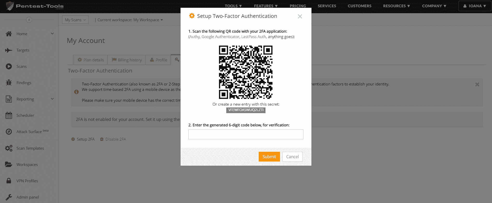
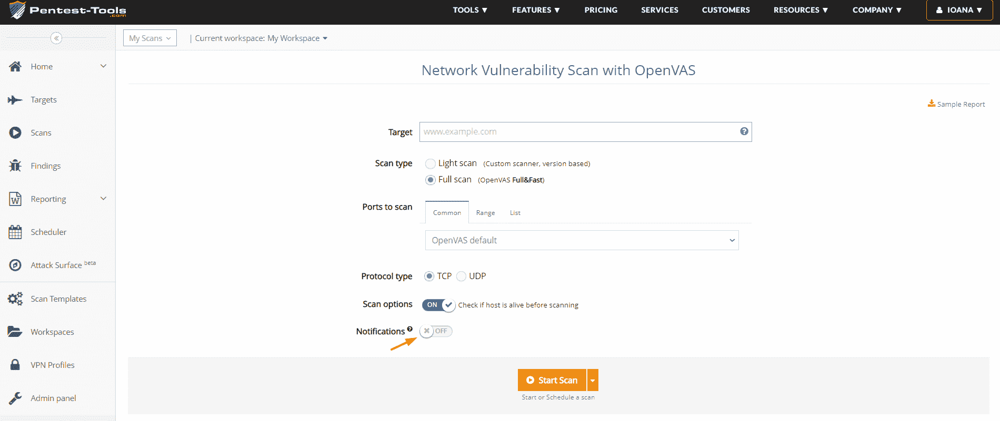
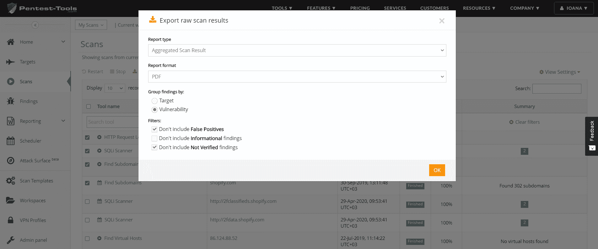
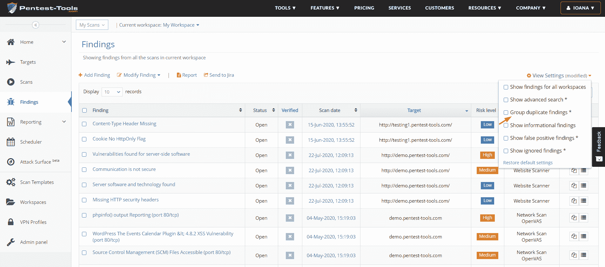

# 2FA，电子邮件扫描通知和更多更新| Pentest-Tools.com

> 原文：<https://pentest-tools.com/blog/2fa-email-scan-notifications-more-updates>

这里是我们在当前更新中内置的 5 个平台改进，使 Pentest-Tools.com 成为您的 pentesting 工具堆栈的有用资产。

1.  **双因素认证(2FA)** 增强安全性

2.  **扫描收件箱中的通知**以节省时间

3.  **聚合扫描结果**以加快报告速度

4.  **独特的漏洞 id**用于快速比较

5.  **分组重复发现**以实现高效的 vuln 管理

## **1。使用 2FA** 保护您的帐户

作为登录时的额外安全层，我们在 Pentest-Tools.com 上添加了 2FA。

注:此功能仅适用于企业计划。

要在您的帐户上启用此选项，请转到我的帐户，选择 2FA，然后按照设置说明进行操作。

## **2。获取扫描结果的自定义电子邮件通知**

现在，您可以通过在 Pentest-Tools.com 仪表板中添加特定的通知过滤器来轻松配置电子邮件通知。

要使用此功能，请选择特定的**工具**，启用**通知**，并为您的扫描添加特定的**条件**。

当扫描结果与您选择的所有条件匹配时(例如，已完成，发现高风险。等等。)，您将会收到一封包含详细信息的电子邮件。

如果您同时运行多个扫描，这些详细、集中的通知可以帮助您为其他重要任务节省宝贵的时间。

## **3。在一份报告中汇总多个扫描结果**

我们一直希望使报告更简单，因此我们添加了一个选项来汇总来自不同目标的多个扫描结果，并将其导出到一个报告中。

为此，请转到**扫描**，选择您想要包含在报告中的扫描结果，然后点击**导出**按钮。

您可以在生成的报告中添加漏洞和发现扫描，您可以下载 PDF 或 HTML 格式的报告。

通过最少的手动工作获得即时概览，并且**在统一、集中的报告中可视化组合扫描结果**。

## **4。通过漏洞的唯一 ID 信息快速识别漏洞**

我们改进了报告，为平台上 25 个以上的扫描器发现的每个发现或漏洞显示一个唯一的标识符。

这使您能够以编程方式轻松比较扫描结果(当导出为 JSON 或通过[我们的 API](https://pentest-tools.com/api-reference) 时)。

这些标识符(vuln_id)可能类似于 *WEBSCAN-00-0000012* 或 *NETSCAN-01-0002349* 。

## **5。使用这款新过滤器**轻松组织和管理您的调查结果

在**调查结果**下，您会发现一个新的过滤器，它会自动将针对同一目标的多次扫描所生成的类似调查结果进行分组。

要使用此过滤器，请转到**查看设置**并选择**分组重复结果**以获得更清晰、更简单的扫描结果视图**。**

****

**顶部提示:如果你喜欢，你也可以通过关注我们的 [**公共变更日志**](https://pentest-tools.com/change-log) 来跟踪**基本平台更新**。**

****如何解锁这些功能(及其他功能)****

**如果您当前的 Pentest-Tools.com 计划不支持上述功能或改进，并且您需要更多功能，您可以直接从我们的平台 升级**[**。**](https://pentest-tools.com/pricing)****