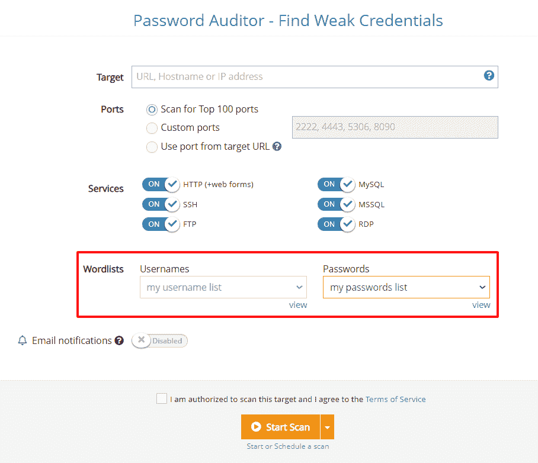
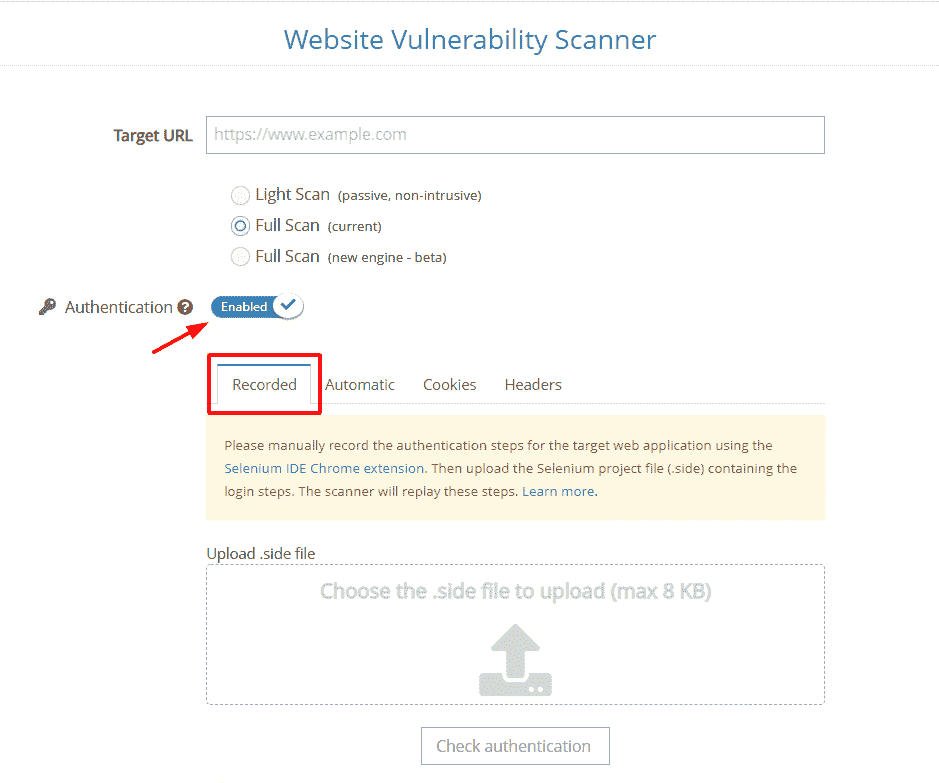
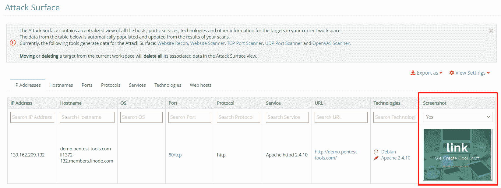
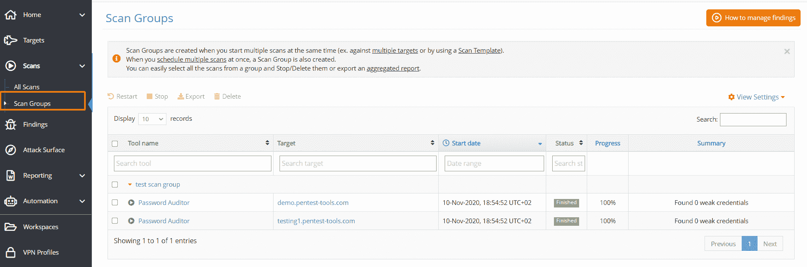

# 像专业人士一样工作:4 自动化更新节省时间并简化您的工作流程| Pentest-Tools.com

> 原文：<https://pentest-tools.com/blog/4-automation-updates-save-time>

我们这个月努力推出新的更新，我们很高兴与您分享它们！

这 4 个平台功能都是为了让您的工作流程更顺畅，因此您可以专注于基本任务:

1.**使用自定义词表**与[密码审计](https://pentest-tools.com/network-vulnerability-scanning/password-auditor)
2。**新增:[网站扫描器](https://pentest-tools.com/website-vulnerability-scanning/website-scanner)
3 的记录登录认证**。**截图来自网站 Recon** 中的[攻击面](https://pentest-tools.com/features/attack-surface)
4。创建**扫描组以简化扫描管理**

让我们打开它们吧！

## **1。设置您自己的用户名和密码列表，并使用密码审计器**

正如承诺的那样，我们为更多的工具添加了自定义单词表！

除了默认的单词列表， [Password Auditor](https://pentest-tools.com/network-vulnerability-scanning/password-auditor) 现在还包括设置自己的用户名和密码列表的选项，并且*可以更快地找到脆弱的凭证*。

要创建它，进入**单词表**，选择**添加**，开始添加运行特定测试任务所需的单词表。

创建自定义单词列表后，进入**密码审计器**，插入目标，选择用户名和密码的单词列表，然后用它运行扫描。

**丰富并更新您的弱凭证** **列表**，以便更好地检测易受攻击的目标并向组织报告。

比使用相同策略获取敏感数据并访问其内部系统的攻击者领先一步。

## **2。使用记录的登录方法**更快地运行认证扫描

我们为[网站漏洞扫描器](https://pentest-tools.com/website-vulnerability-scanning/website-scanner)添加了一种新的认证方法，以帮助您更快地扫描非标准认证的网站。

**记录登录认证**允许您**记录并回放登录步骤**，然后将记录上传到网站扫描工具。

要了解如何轻松配置这种身份验证方法，请确保遵循我们的专用支持文章中描述的步骤。

尝试这种认证方法**执行深度扫描**和**更好地发现关键漏洞**，攻击者可以在登录网站(或 web 应用)后利用这些漏洞。

## **3。从网站侦察生成的截图现在可以在攻击面看到**

我们用更多的聚合数据增强了[攻击面](https://pentest-tools.com/features/attack-surface)，因此您可以更好、更清晰地查看**您的网络边界。
当您使用 Website Recon 扫描目标时，扫描结果(包括截图)会自动添加到攻击面。**

 ** *我会看到其他工具的截图吗？是的，我们将在未来的更新中增加对更多工具的支持！***

使用[攻击面](https://pentest-tools.com/features/attack-surface)获得按资产类别分组的所有扫描结果的即时概览，并更好地可视化您的网络暴露。

## **4。为工作流管理和无障碍报告创建扫描组**

自动化您的安全测试工作流程并节省报告时间对我们来说至关重要。这就是为什么你现在可以从你的 Pentest-Tools.com 账户创建、定义和分组你的扫描。*快速简单！*
一个扫描组是**在您:**

*   选择多个目标并使用一种特定工具运行扫描

*   使用扫描模板同时选择多个目标

*   计划同时对多个目标进行扫描

要轻松查看和管理您的所有扫描组，请转至**扫描**，并点击**扫描组**。
从这里，您可以将它们快速导出到汇总报告中，以统一、集中的方式显示组合的扫描结果。

为了更好地理解如何创建和定义扫描组，请查看我们支持中心的[分步指南](https://support.pentest-tools.com/en/automation/scan-groups)。