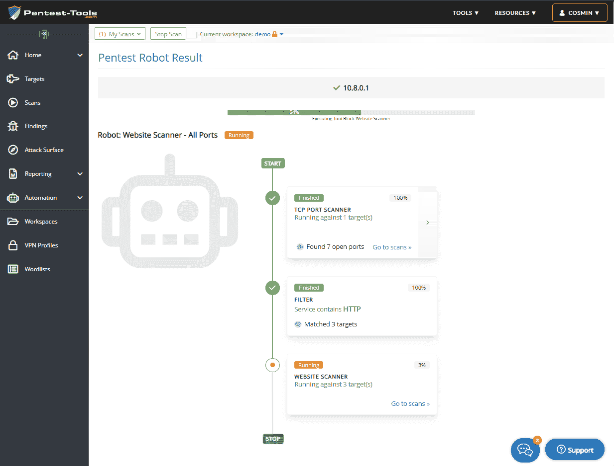
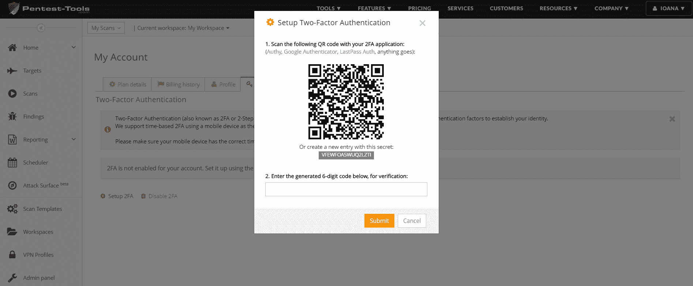
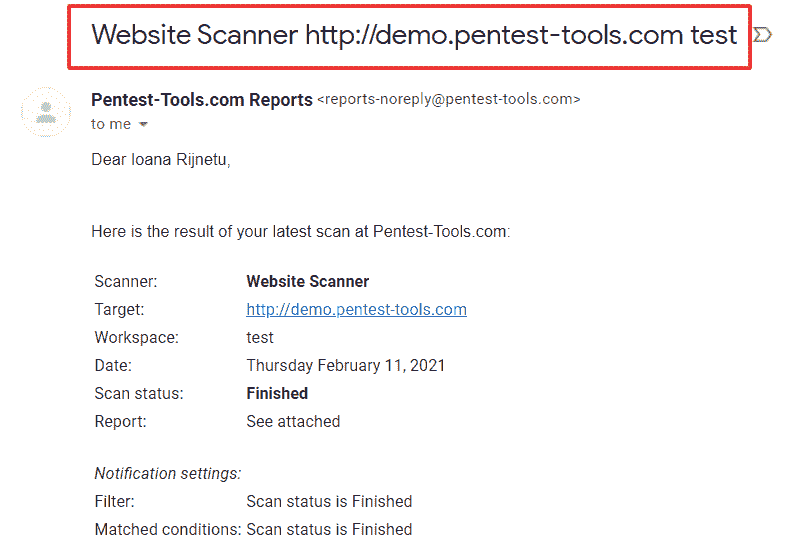

# 你需要了解的 4 个平台更新| Pentest-Tools.com

> 原文：<https://pentest-tools.com/blog/4-platform-updates-security-testing-effective>

这是一个紧张的新年开端，我们很高兴分享我们的工作成果！

这 4 项平台改进都是为了简化您的工作流程，因此您可以专注于重要的任务。

1.  使用 pentest 机器人自动扫描内部网络

2.  2FA–现可用于 Pro Advanced 计划

3.  扫描通知–重要更新！

4.  为白标报告定制您的电子邮件主题行

让我们打开它们吧！

## **1。使用 pentest 机器人自动进行内部网络扫描**

您现在可以使用我们预定义的机器人或构建自己的机器人来自动进行内部网络扫描。

为此，请确保您已经将 VPN 配置文件添加到您的工作区。

要配置 VPN 代理或使用定制的 OpenVPN 服务器，请遵循本教程和我们的[博客文章](/blog/internal-network-scanning)中的步骤。

转到**目标**，添加您的 **IP 地址**，然后**使用预定义的机器人或自定义机器人更容易地运行扫描**。

您还可以在[攻击面视图](https://pentest-tools.com/features/attack-surface)中自动可视化您的网络暴露情况！

## **2。使用 2FA** 保护您的帐户

额外的保护层提高了您的工作和客户数据的安全性。

这就是为什么**双因素认证(2FA)功能现在适用于所有 Pro Advanced 计划**。

要在您的帐户上启用此选项，请转到**我的帐户**，选择 **2FA** ，然后按照设置说明进行操作。

使用您的移动设备安装验证器应用程序，扫描二维码，将其链接到您的 Pentest-Tools.com 帐户。输入验证码，一切就绪！

## **3。扫描通知更改**

从 2021 年 2 月 3 日开始，我们将从以下电子邮件地址发送所有扫描结果:reports-noreply@pentest-tools.com。

**注意:**确保**将该地址列入白名单**，这样你就不会错过收件箱中的重要扫描通知。

我们还更新了扫描生成的电子邮件主题，使其更加相关和具体。现在，它包含了基本信息，如工具名称、目标和工作空间。

## **4。使用占位符定制您的电子邮件主题**

我们添加到**白色标签**功能中的另一项改进是，当您从 Pentest-Tools.com 用电子邮件向客户发送报告时，可以定制他们看到的主题行。

添加特定的占位符来个性化您的主题行，并通过测试报告节省宝贵的时间！

试试这些自动化更新，看看它们如何改进您的安全测试工作流程！