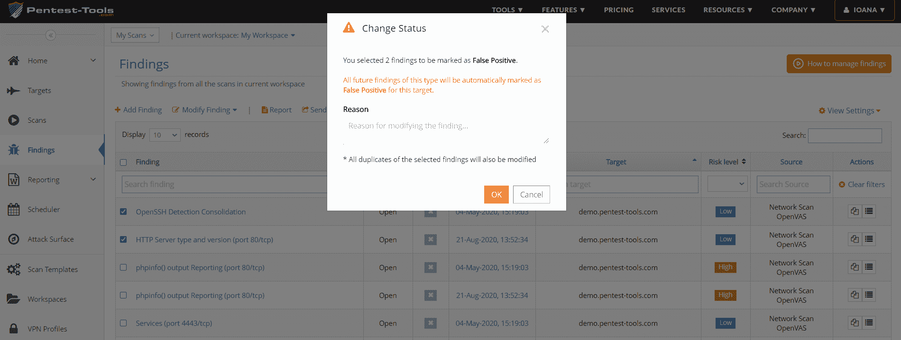
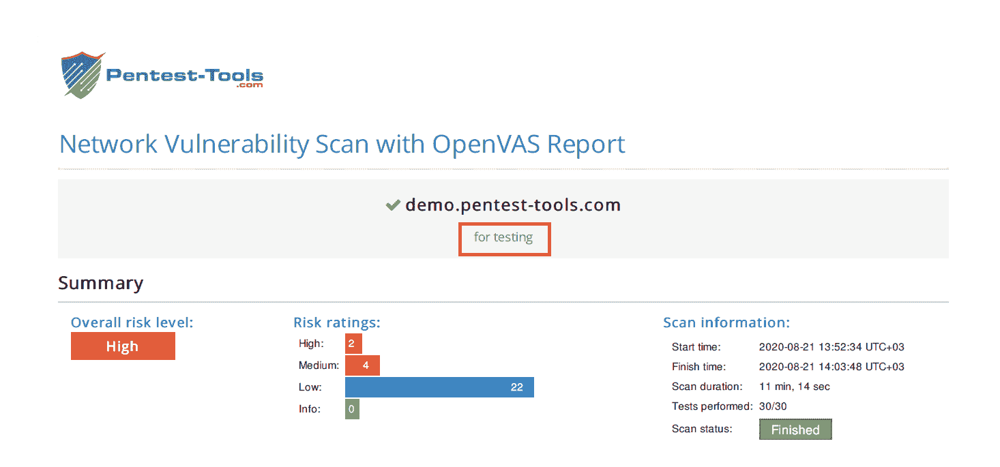
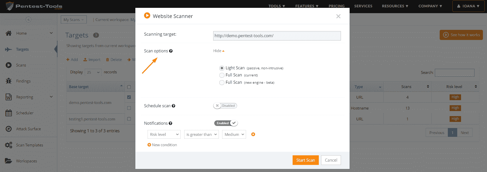

# 安全测试下一级自动化的 4 个更新| Pentest-Tools.com

> 原文：<https://pentest-tools.com/blog/4-updates-automation-security-testing>

以下是我们为使 Pentest-Tools.com 成为您安全测试工具的必备工具而部署的 4 项平台改进:

1.标记误报以便将来扫描
2。目标描述-自动添加到报告
3。启用&配置邮件扫描通知
4。登录会话超时增加

[登录使用更新](https://pentest-tools.com/login)

## 1.为将来的扫描结果自动将发现标记为假阳性

当您将某个目标的某个发现标记为误报时，该目标的所有未来扫描结果都会自动将其标记为误报。

设置一次-永远减少您的手动工作！(或者至少只要你使用平台。😊)

要启用它，请转至“调查结果”，选择您要标记为误报的调查结果，然后单击“修改调查结果”按钮以更改其状态。

## 2.在您的 PDF/HTML 报告中自动包含自定义目标描述

让报告变得轻松，并根据您的需求进行高度定制，是我们关注的重点。

下面是我们如何实现的:每次您从目标页面为目标添加特定的相关描述时，它会自动添加到您的 PDF/HTML 报告中。

现在，您从 Pentest-Tools.com 生成的每个 PDF/HTML 报告都包括您的目标的特定描述，与您的扫描结果打包在一起。

如果您准备好快速、轻松地进行报告，[请观看这个 3 分钟的视频演示](https://www.youtube.com/watch?v=uwcg6mGK1lw&feature=youtu.be)！

[向报告添加目标描述](https://pentest-tools.com)

## 3.配置电子邮件扫描通知，并打开您的日程安排，以获得更好的东西

现在，您可以直接从目标页面轻松配置扫描通知！

为此，选择一个目标，点击扫描工具，选择你要扫描的工具，并选择扫描选项。

这些特定的、有针对性的通知意味着，每当平台发现重要发现时，您都会收到即时电子邮件。在此期间，你可以专注于更有趣的任务，如[探索你的攻击面](https://pentest-tools.com/features/attack-surface)。

## 4.增加了登录页面的会话超时

你问过了。我们听了。根据您的多次请求，我们已经将 Pentest-Tools.com 上的超时会话持续时间从 24 分钟增加到 2 小时。

如果您在这两个小时内没有在平台上活动，登录会话将不会过期，您可以像以前一样继续工作。(终于！)

使用这些平台改进，看看它们如何改进您的 pentesting 工作流程和扫描结果！

[尝试更新](https://pentest-tools.com)

*在接下来的几个月里，你有什么特别想看到的功能吗？*

请在下面的评论中告诉我们。