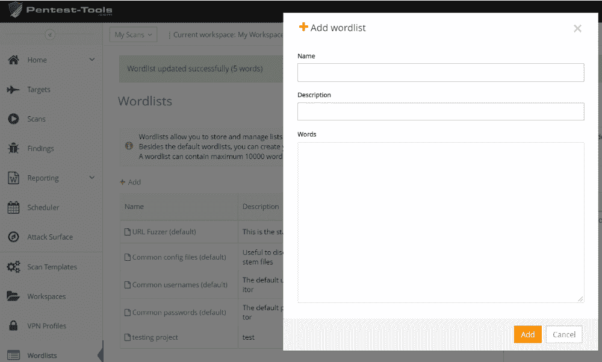
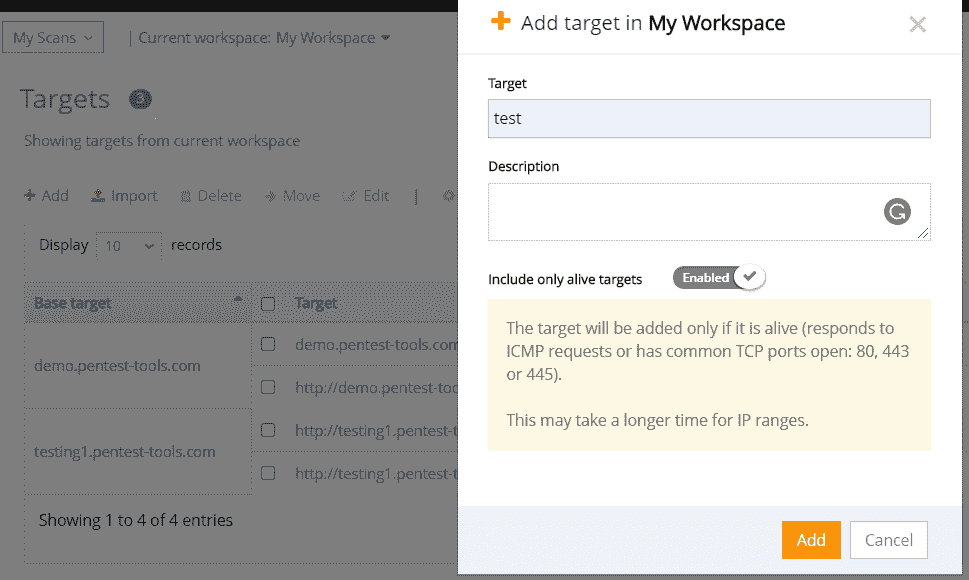
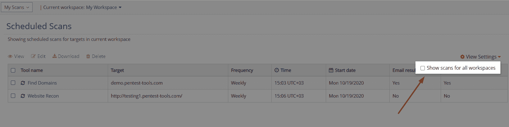
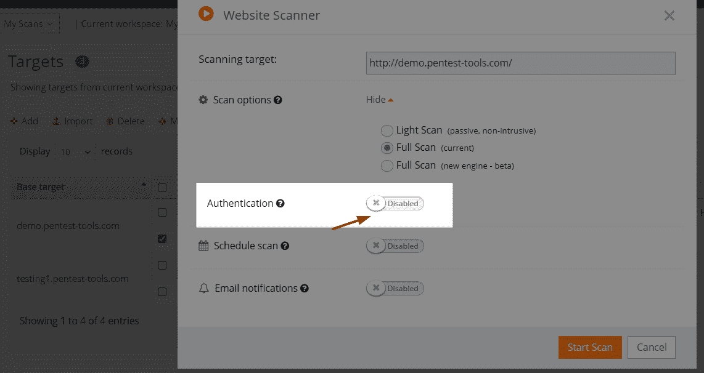

# 更聪明地工作，而不是更努力:提高自动化的 5 个更新| Pentest-Tools.com

> 原文：<https://pentest-tools.com/blog/5-updates-enhance-automation>

这是紧张的一个月，我们很高兴分享这个消息！

这些 **5 平台改进**都是为了节省您的时间和精力，因此您可以专注于最重要的任务:

1.  **创建自定义词表**(并与 URL Fuzzer 一起使用)

2.  **忽略死目标**并自动排除

3.  **通过调度程序中的特定工作区管理调度扫描**

4.  配置& **直接从目标运行认证扫描**

5.  [带](https://pentest-tools.com/network-vulnerability-scanning/network-security-scanner-online-openvas) **的网络漏洞扫描器 OpenVAS 现在包括 SMBGhost 和 GhostCat 扫描器**

让我们打开它们吧！

## **1。建立你自己的单词列表，并用 URL Fuzzer** 来使用它们

除了可用的默认单词列表，您现在可以从您的 Pentest-Tools.com 帐户中**创建、定义和分组您自己的单词列表**。

要启用它，请转到**单词表**，选择**添加**，并开始创建运行特定安全测试评估所需的单词表。

对于每个列表，请确保最多包含 10.000 个单词，其中一个单词少于 200 个字符。

创建自定义单词表后，进入 [**URL Fuzzer**](https://pentest-tools.com/website-vulnerability-scanning/discover-hidden-directories-and-files) ，插入您的 URL **target** ，使用您的自定义单词表运行扫描。
***你会…？***
是的，我们会在接下来的更新中加入对其他工具的支持！

使用这些自定义单词列表为单个目标创建特定的列表，以支持新的语言，或者简单地使用 ***使您的测试工作更快更容易。***

[**创建你的第一个自定义词表**](https://pentest-tools.com)

## **2。从内部网络扫描中自动排除死亡目标**

当您想要添加或导入新目标时，有一种更简单的方法可以忽略失效的主机目标并运行更准确的扫描。

为此，请转到目标，选择添加，并启用仅包括活动目标选项。这只添加响应 ICMP 请求并打开公共 TCP 端口(80、443 或 445)的目标。

如果您运行内部网络扫描，并且您需要添加特定的 IP 范围来只扫描相关的目标，**这使得*更加容易*！。**

保持您的结果新鲜和有趣！

## **3。从一个视图中管理特定工作区的计划扫描**

我们增强了**调度器**，因此您可以更好地管理单个视图的计划扫描！

按特定工作区或所有工作区查看所有计划的扫描。排序，编辑，下载最新的结果，并保持测试流程！

进入**调度器**，点击**查看设置**，启用“**显示所有工作空间的扫描**”，一切就绪！

## **4。从目标页面配置扫描验证权限**

你会花很多时间在目标上吗？

这里有一些好消息:您现在可以从目标页面启用并配置网站扫描工具的身份验证选项。

进入**目标**，选择具体的一个，点击**扫描工具**，选择 [**网站扫描仪**](https://pentest-tools.com/website-vulnerability-scanning/website-scanner) 。启用**认证**给你所有你需要的选项！

不用再来来回回了！(保持反馈——我们洗耳恭听！)

## **5。SMBGhost 和 GhostCat 扫描器–现在包含在 OpenVAS 的网络漏洞扫描器中**

SMBGhost 和 GhostCat 不会很快出现在任何地方，但我们已经决定将它们的功能集成到我们的[网络漏洞扫描器和 OpenVAS](https://pentest-tools.com/network-vulnerability-scanning/network-security-scanner-online-openvas) 中。

需要检查您的系统是否受到这些特定漏洞的影响？从带有 OpenVAS 的网络漏洞扫描器中选择**全面扫描选项**，并在您的**调查结果中查看它们。**

尝试这些平台改进，看看它们如何改进您的安全测试工作流程！