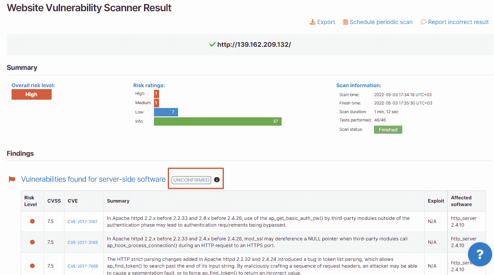

# 4 月更新:获得 6 份关键简历的 RCE 证据| Pentest-Tools.com

> 原文：<https://pentest-tools.com/blog/april-updates-rce-evidence-6-critical-cves>

Updated at

October 06, 2022

网络罪犯不会放弃。我们也不知道。

我们很自豪地为您带来目前唯一检测影响 Magento 和 Adobe Commerce 的 CVE-2022-24086 的工具。

在为这个关键的 CVE (CVSSv3 9.8)的自动开发工作了几个星期之后，我们终于有了它！

作为 Pentest-Tools.com 的客户，您可以运行 Sniper Auto-Exploiter 来获得确凿的证据，以验证易受这一高风险漏洞攻击的目标，坏演员已经对此表现出兴趣。

这种独有的功能也嵌入到我们的网络扫描器中，该扫描器提供预填充、随时可发送的报告，并自动填充攻击面视图。

[**找到易受攻击的目标**](https://pentest-tools.com/exploit-helpers/sniper)

等等，还有别的吗？

在过去的几周里，我们的团队还致力于更多的平台更新，以支持您的工作。

*   5 个新的高风险简历，你现在可以利用狙击手

*   添加了对查找属性域工具的 API 支持

*   网站扫描结果包括一个“未确认”标签

## **1。用狙击手证明这 5 个广泛存在的 cv 的利用风险**

除了高风险的 Magento 漏洞，我们的团队还增强了[狙击自动开发工具](/exploit-helpers/sniper)的自动(安全)开发能力，用于:

1.  影响多个 **Redis** 版本的严重 RCE 漏洞——[CVE-2022-0543](https://nvd.nist.gov/vuln/detail/CVE-2022-0543)(cvss v3 10)
    另一个影响 **VMware Workspace ONE Access** 和**Identity Manager**——[CVE-2022-22954](https://nvd.nist.gov/vuln/detail/CVE-2022-22954)(cvss v3 9.8)

2.  在特定 **Apache Struts 2** 版本中发现的严重 RCE 漏洞—[CVE-2021-31805](https://nvd.nist.gov/vuln/detail/CVE-2021-31805)(cvss v3 9.8)

3.  在不同 **Drupal** 版本中发现的严重 RCE 漏洞—[CVE-2018-7600](https://nvd.nist.gov/vuln/detail/cve-2018-7600)(cvss v3 9.8)

4.  在 **Adobe ColdFusion** 版本中发现的无限制文件上传漏洞—[CVE-2018-15961](https://nvd.nist.gov/vuln/detail/CVE-2018-15961)(cvss v3 9.8)

[**获得剥削证明**](https://pentest-tools.com/exploit-helpers/sniper)

好奇解开高危漏洞背后的技术细节吗，比如 Zabbix 中不安全的会话存储或臭名昭著的 Spring4Shell RCE？

我们的安全研究团队提供稳定的手动利用指南，可以扩展您的专业知识或帮助培训您的团队。

## **2。API 支持现在可用于域名查找器**

这一改进允许您通过我们的 [API](/features/api) 对您的目标程序运行聚焦扫描。

使用特定参数，您可以自动执行扫描工作流，以快速发现公司拥有的域名并绘制其攻击面。

点击此处了解所有详情[，使用我们预先配置的扫描仪节省宝贵的时间。](https://pentest-tools.com/api-reference/domain-finder)

## **3。轻松找到并过滤您的网站扫描结果**

当您使用我们定制的[网站扫描仪](/website-vulnerability-scanning/website-scanner)扫描您的目标时，未自动验证的结果会获得一个特定的“**未确认**标签。

为了方便您，我们的扫描仪会自动验证结果并将其标记为**已确认**，以便您选择并将其添加到 pentest 报告中。

使用**未确认的**标签，您可以轻松发现需要您注意的发现。在报告高质量合约之前，请进行人工检查。查看[支持文章](https://support.pentest-tools.com/vulnerability-management-and-reporting/manually-validate-findings)了解如何验证发现的更多详细信息。

每次扫描后，您可以在“发现”部分的以下位置找到未确认的标记:

希望这些更新可以帮助你简化你的道德黑客活动，这样你就可以做更多你喜欢的事情。