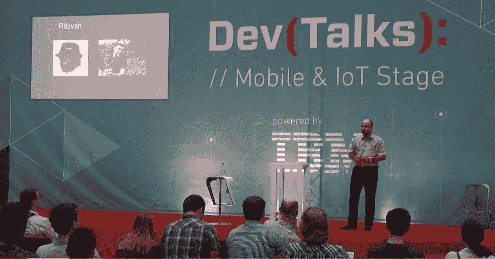

# 工具背后:勒兹万·约内斯库谈增长思维、贪得无厌的好奇心和适应道德黑客的变化| Pentest-Tools.com

> 原文：<https://pentest-tools.com/blog/behind-the-tools-series-razvan-ionescu>

在 Pentest-Tools.com，我们使用托管测试服务向客户学习并倾听他们的意见。

我们每个人都努力理解用户需要什么以及为什么需要，在我们作为个人和团队继续学习和成长的同时，将这些知识输入平台。

这就是为什么我们[吃自己的狗粮](https://en.wikipedia.org/wiki/Eating_your_own_dog_food)并且我们总是身体力行。

在我们“展示，不要说”方法的推动下，我们正在开始一个新的系列:**工具背后**。通过将那些开发数百万人使用的工具的人带到聚光灯下，我们旨在从他们的个人故事和职业历程中学习，并与您分享，以便他们可以加速您自己的发展。

在我们的第一次采访中，我们选择了我们的资深道德黑客之一，勒兹万·约内斯库，他 10 多年的信息安全职业生涯中充满了智慧。

作为专业 pentests 服务的负责人，Razvan 掌握了平衡技术敏锐度和沟通能力的艺术，无论是与客户谈论 pentests 还是为 infosec 社区做演示。他是一个行动专注、意志坚定的人，通过自己的工作和方法为团队树立了榜样。

## **找到“什么”，教会“如何做”**

和你一样，Razvan 深深地陷入了道德黑客行为，并理解它如何适应网络安全生态系统。

> 道德黑客为客户增加了价值，因为除了在网络/web 应用程序中发现的潜在漏洞之外，它还教会了客户如何解决安全问题。
> 
> 当你用通俗易懂的语言解释测试报告时，客户很快就能理解安全风险和业务影响。几年前，在 Pentest-Tools.com，我们推出了一项新的业务，即由我领导的“T1 托管测试服务”。
> 
> 我们使用该平台进行测试，但我们会通过从客户那里获得的反馈不断开发该平台，从而使我们与他们的业务需求保持一致。

在渗透测试中，人类专家的工作是无价的，因为他们使用他们的主观判断来交付杰出的工作。这是无法自动化的。

> 渗透测试人员真正需要的是更多的时间专注于创造性的工作，并自动化重复的手工工作。
> 
> *T3*
> 
> *通过我们的 [Pentest 机器人](https://pentest-tools.com/features/pentest-robots)，我们帮助有道德的黑客自动完成枯燥但必要的任务，这些任务是他们工作的一部分。因此，他们获得了宝贵的时间来处理更复杂的问题和简化他们的工作流程。*
> 
> *我们始终专注于保护客户的安全，并确保他们了解如何有效提高安全性。*

除了努力工作和实践，故事和例子总能激励或挑战我们对待工作和个人发展的方式。我们问 Razvan 哪些例子帮助他培养了黑客技能。

以下是他强调的内容:

> *我听了一集 Darknet Diaries 播客( [Ep 87-暴躁老黑客公会](https://darknetdiaries.com/episode/87/))，我发现了三个荷兰道德黑客在 2016 年黑了唐纳德·特朗普的推特账户的故事。我建议听完整集，了解他们如何使用从 2012 年 LinkedIn 数据泄露事件中窃取的电子邮件和密码。*
> 
> *T15*
> 
> *你还会发现唐纳德·特朗普是如何为他的推特账户使用密码“yourfired”(学徒节目中最受欢迎的流行语)的。这三个脾气暴躁的老黑客通知了国土安全部和美国计算机应急小组，但是没有人回答。他们还联系了荷兰的国家网络安全中心(NCSC ),后者回复并解决了问题。*
> 
> **
> 
> 另外两个例子我很喜欢:
> 
> 1.  *道德黑客通过 bug bounty 程序报告安全漏洞的那个，*
>     
>     
> 2.  *道德黑客参与流行的 CTF(例如 [Pwn2Own](https://www.secwest.net/) )，他们在那里编写漏洞利用、报告零日漏洞并获得数千美元。(听黑暗网络日记中的[ep82)](https://darknetdiaries.com/episode/82/)*

我们再怎么强调你能从这些现实生活中的故事中学到多少，以及它们能如何塑造你的心态都不为过。

一位经验丰富的道德黑客在 2010 年进入该领域，当时人们仍在使用 BackTrack4 操作系统(现在称为 Kali Linux)，其中包括大量用于渗透测试的开源工具。

如果你想深入这个领域，Razvan 建议你需要具备的最基本的工具:

> 基本上，你只需要一台笔记本电脑、一个浏览器和一个互联网连接。您可以在云端配置您的 pentesting lab，通过手动脚本和文件传输来降低硬件成本并节省关注漏洞链的时间。
> 
> *T3*
> 
> *虽然这会教会你五旬节的来龙去脉，但这将花费你很大一部分时间和资源。这就是为什么我很高兴看到越来越多的 pentesters 选择使用我们的平台作为他们的实验室，这样他们就可以专注于更快更有效地应用他们所学的知识。*
> 
> *还有硬件黑客。要从事这一领域的工作，除了电子学的基础知识，你还需要各种工具来连接“目标”硬件并分析其固件，修改它，或者测试它以发现漏洞。*

## **探索做一名道德黑客的感觉**

您可能渴望听到更多关于闯入一家公司并获得有价值的资产以展示安全风险(和您的技能)的信息。所以，让我们看看谁会成为你的好客户。

Razvan 在为几个大型组织工作时亲身经历了这一点，在他们的网络安全团队中，他们负责内部测试项目。

> *就市场动态而言，越来越多的公司希望建立其内部网络安全部门，并每天运行这些安全测试。*
> 
> *T15*
> 
> 对于资源有限的公司来说，与独立专家合作更方便。这适用于那些在招募网络安全专家方面面临挑战的组织，目前，他们中的大多数都是网络安全专家。

道德黑客职业对你来说听起来刺激吗？您是否希望专攻渗透测试的特定领域？

从 Razvan 了解每个领域需要哪些特定技能:

> 网络安全是一个广阔而复杂的领域，每个分支都有其特殊性。
> 
> 这里有四个大的方面需要考虑
> 
> *1。**网络渗透测试**——你需要特定的技能，比如网络、协议、服务、如何构建它们以及它们如何工作等等。*
> 
> *2。 **Web 渗透测试**是最大的分支之一。在这里你可以找到新旧网络技术、数据库(MySQL、PostgreSQL、NoSQL 等。)、内容管理系统(WordPress、Joomla、Drupal、Magento 等。)、各种编程语言(PHP、Javascript 等。)，以及 API(如 Swagger，GraphQL)*
> 
> *3。**移动渗透测试**——查看应用程序本身，搜索硬编码的秘密(密钥、密码、读取钥匙链)，分析通过互联网发送的数据，等等。要做到这一点，你需要了解 Java、ObjectiveC 等技术，包括 proxy 之类的工具或者不同的框架(MobSF、Drozer 等。)*
> 
> *4。**物联网/硬件黑客**——你需要联网技能和更具体的技能，这取决于你想测试的东西:路由器、物联网设备、汽车(它们通过特殊的协议和通道进行通信，如 CAN 总线)。*
> 
> *为了推进你的职业道德，选择专注于上述领域之一。除了技术知识(编程语言、技术)，**一个有道德的黑客还拥有测试框架**((例如 OWASP、PTES)**、成长心态和永不满足的好奇心**。*

## **终身学习是道德黑客的基础**

拉兹万强调了终身学习是如何为任何一个老年人打下坚实基础的。以下是他的实用建议:

***你通过进行尽可能多的不同渗透测试来获得经验*** 。随着时间的推移，您会成为技术和攻击媒介方面的专家，您会学习创造性的方法来通过您遇到的安全措施。

我在布加勒斯特理工大学攻读复杂网络安全硕士学位时听说过渗透测试。我在那里遇到了阿德里安·富图纳(Pentest-Tools.com[的创始人兼首席执行官)，他成了我的导师。](https://pentest-tools.com/)

就可以在职业道路上支持你的教育资源而言，他建议:

> *如果你想学习渗透测试，网上资源充足(课程、视频、文章等。)来入门。*
> 
> *T29*
> 
> 在 Pentest-Tools.com，我们试图每两周组织一次黑客日，让每个团队成员学习渗透测试的基础知识。在我们的黑客会话中，我们使用以下资源:
> 
> *   PortSwigger 的[*Web Security Academy*](https://portswigger.net/web-security)(代理打嗝的创造者，被 infosec pros 广泛使用)
>     
>     
> *   TryHackMe ，一个平台，在这里你可以找到许多为所有技能水平和兴趣领域设计的挑战。
>     
>     
> *   [*黑盒子*](https://www.hackthebox.eu/) ，类似于 TryHackMe
>     
>     
> *   [*Pentester Academy*](https://www.pentesteracademy.com/)，其中包括不同的挑战，还提供红色的红队认证(活动目录-攻击和防御)
>     
>     
> *   [*PentesterLab*](https://pentesterlab.com/) 是与上一个例子类似的资源。
>     
>     
> 
> *当你觉得准备好了，你就可以拿到实地认证了，我会推荐来自[进攻安全](https://www.offensive-security.com/courses-and-certifications/) (OSCP、OSWP、OSWP、OSEP、OSWE 等)的。)，以及来自 [SANS 研究所](https://www.sans.org/) (GPEN，GWAPT，GXPN 等。).*

如果你还没有涉足这个游戏，并且你对如何作为一个有道德的黑客赚钱感到好奇，这里有一个实用的答案:

> *你可以在不同的领域工作:*
> 
> *T9*
> 
> ***渗透测试/咨询***——你可以在公司找份工作，或者自己开公司，为客户和他们的产品销售这样的服务。一些公司以项目为基础雇佣 pentesters(如 Cobalt.io)。
> 
> *T15*
> 
> ***Bug 赏金猎人***——有很多平台可以注册发送漏洞。根据发现的漏洞严重性，您可以赚取几美元到几千美元。这样的平台有 HackerOne、BugCrowd、Synack 等。

## 专业人士学会适应不断的变化

除了做在你控制之下的事情，还有道德黑客技术进步的影响要考虑，以及它们对我们工作的深刻影响。

关于这个问题，拉兹万认为:

> 作为网络安全专家，技术进步在我们的生活和职业生涯中扮演着重要的角色。我同意数字产品是基于过去几十年发展起来的基础设施，但新技术，如区块链，比以往任何时候都出现得更快。
> 
> *T25*
> 
> *在我看来，对于有道德的黑客来说，这是一个全新的、不同的“游乐场”，因为它挑战他们学习新的措辞，如“智能合约”、新的编程语言(如 Solidity)或新的协议(如 VOBP——区块链语音协议)。*
> 
> *T29*
> 
> ***成为一名渗透测试员意味着适应变化和快节奏的学习。*** 你一边做，一边在测试过程中学习新技术，改善你的工作流程，两者都有时间。

我们喜欢这种将变化内在化的观点，因为它防止变化耗尽我们的精神、身体和情感资源。这也有助于我们专注于我们能控制的事情。

这就是为什么道德黑客可以帮助公司防止违规或 IT 系统受损。

根据拉兹万的说法:

> *时间表明，如果攻击者拥有合适的工具和资源，任何事情都可能被破坏*
> 
> 黑暗网络日记播客中有一集。82 )，讲述了 2015 年圣贝纳迪诺恐怖袭击事件。
> 
> *T41*
> 
> 联邦调查局要求苹果解锁一部属于其中一名恐怖分子的 iPhone。苹果公司拒绝协助，称他们创造了这个产品，所以没有人(甚至员工)可以这样做。
> 
> *T3*
> 
> *根据这个故事，美国联邦调查局购买了一个零日漏洞——产品创造者不知道它的存在，这个漏洞在黑暗网络上出售——来解锁手机。*
> 
> *因此，有了合适的资源，你可以“打破”任何东西。*

拉兹万·约内斯库在布加勒斯特发展会议上

即使使用了正确的工具和技术，任何有经验的 pentester 都知道您不容易找到零日漏洞，Razvan 也知道这一点:

> 你需要扎实的技能、时间、耐心、激情和决心。再加上一点运气(所以之前没人发现过)。
> 
> *有几种技术，其中最著名和最多产的是 fuzzing。*
> 
> *模糊化是指生成输入(如文本文件、音频文件、文本等。)不一定遵循某种模式或格式(如 RFC–征求意见稿中所定义的)。然后，模糊输入被发送到客户端(软件)。*
> 
> 当软件开始运行或处理输入时，如果没有正确编写，它可以运行攻击者(在这种情况下是道德黑客)控制的代码。这样，零日漏洞就会被发现并报告给制造商。
> 
> 然后，制造公司为他们发布了一个 CVE ( [常见漏洞和暴露数据库](https://cve.mitre.org/)),因此 infosec 社区可以轻松地识别和解决它们。

## **增强安全意识的三种方法**

看到他充满激情地谈论自己的工作，我们不禁感到鼓舞和好奇，想从他身上学到更多。这就是为什么我们问 Razvan 关于绕过 OSs 和安全系统。

> *一般来说，你得了解操作系统架构，并努力发现漏洞。你必须问自己许多问题(例如，它们是如何工作的，数据存储在哪里，你如何传输文件，你如何保护文件的安全，等等。)并通过查看目标操作系统的源代码来寻找答案。*

就我们今天使用的设备/产品中易受攻击的组件(硬件、软件、流程)而言，Razvan 确认这仍然是**人类心理**。

“对手比恶意软件更需要凭证”，正如微软资深人士[约翰·兰伯特所说](https://twitter.com/JohnLaTwC/status/1429470866299973638)。

在此基础上，Razvan 强调了渗透测试工作的复杂性:

> *一个系统的安全性取决于它最薄弱的部分。如果有漏洞的服务在同一台服务器上运行，即使您的 web 应用程序的管理员帐户有强密码也没有关系，允许我读取文件并查看密码。或者在社交网络上分享。*
> 
> *我们周围的几乎一切都与互联网相连(即物联网设备)。从使用用户“admin”登录并传递“admin”的路由器，到连接到互联网但没有任何安全或加密协议的咖啡机和烤面包机。*
> 
> *T9*
> 
> *很多时候，网络罪犯不仅利用技术手段，还利用人类行为——通过[社会工程](https://en.wikipedia.org/wiki/Social_engineering_(security))。因为人类容易出错，所以我们每天创造和使用的系统也容易出错。因此，可靠的安全策略并不意味着消除风险——这是不可能实现的——而是显著降低风险。*

举例来说，以下是 **3 条可行的建议** Razvan 建议帮助提高安全意识:

*   确保我们的设备是最新的，并且仅在我们需要它们工作时才工作(例如，我睡觉时需要打开互联网吗？如果没有，我可以关掉路由器)，而且要小心。尤其是现在，在进入疫情一年半后，在家工作，社会距离使我们更加渴望联系。

*   警惕并避免成为[网络钓鱼](/blog/how-to-simulate-phishing-attacks-with-http-request-logger)和视觉攻击的受害者(语音网络钓鱼——电话诈骗或试图获取您的个人识别码等机密数据。).如果你收到一封电子邮件，说你从一位非洲王子那里赢得了一件独家产品或一百万美元，要知道这不是真的。如果它好得令人难以置信，如果你没有订购或注册，它很可能是一个骗局或网络攻击。

## **啊哈！触发观点和习惯改变的时刻**

这个话题把我们带到了劳动力的现状。我们都承认，疫情的情况迫使我们进行了大规模的远程工作实验，这使得公司更容易受到网络攻击。

这就是为什么我们想看看 Razvan 关于道德黑客如何在这种情况下帮助公司的观点:

> 公司可以请职业黑客来评估他们的远程工作环境。渗透测试改变了他们的视角，因为它向他们展示了恶意黑客眼中的组织——在他们发动网络攻击之前。
> 
> *道德黑客通过遵循基本的安全准则，帮助企业主确保他们的员工安全地使用公司的资产:*
> 
> *   *使用 VPN 连接到雇主的网络*
>     
>     
> *   *不要将公司的笔记本电脑连接到咖啡店或餐馆的不安全 Wi-Fi 网络*
>     
>     
> *   *在您的设备上安装防病毒或防恶意软件等软件程序，这些程序是最新的，不允许没有管理员权限的用户停用它们*
>     
>     
> *   *寻找安全的备份解决方案，将数据副本保存在不同的位置(而不是您的设备上)*
>     
>     
> *   *当你不参加视频会议或在线会议时，把你的笔记本电脑摄像头盖起来。*
>     
>     
> 
> *开展模拟网络钓鱼活动(由道德黑客实施并应公司要求)也是一种内部培训，有助于提高员工对他们收到的电子邮件的认识，如何识别垃圾邮件，或区分合法发送的电子邮件和假冒邮件等。我们发布了一份指南，介绍 pentesters 如何利用我们的平台开展网络钓鱼活动。*

如果你想开始实践你刚刚从 Razvan 那里学到的东西，我们建议加入 LinkedIn 上的 Pentest-Tools.com[社区，向你的同行学习，在那里超过 32，000 名安全专家讨论职业挑战并分享宝贵的测试见解。您也可以](https://www.linkedin.com/company/pentesttools/)[订阅我们的 YouTube 频道](https://www.youtube.com/c/PentestToolscom)并获得实用且有用的测试教程和演示。

你喜欢这次有见地的采访吗？如果你特别想让我们在这个系列中采访谁，请告诉我们。