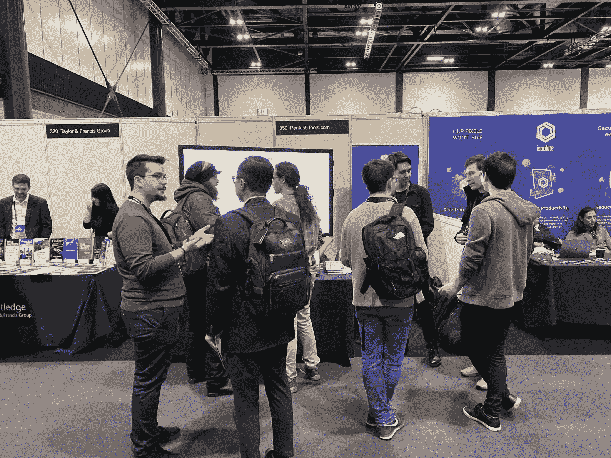
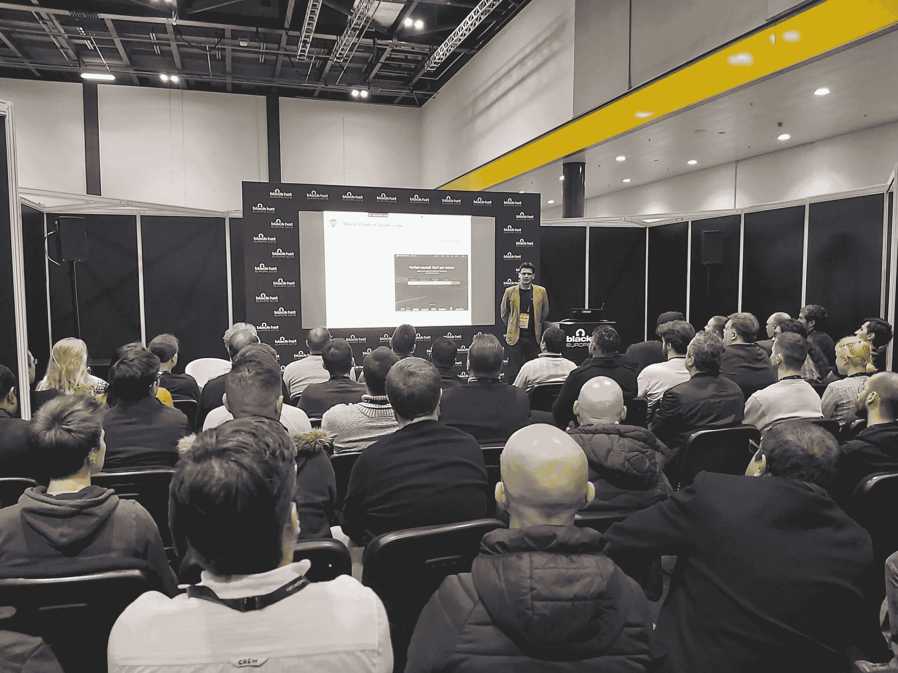

# 黑帽欧洲 2019 亮点| Pentest-Tools.com

> 原文：<https://pentest-tools.com/blog/black-hat-europe-2019-highlights>

每当我们探索一个新的环境时，我们非常感激和高兴地发现有多少用户已经知道了我们的在线平台。了解世界各地的人们每天都在使用 Pentest-Tools.com 来发现网站或网络中的漏洞，这将推动我们取得更大的进步。

在这篇文章中，我们分享了我们最近在 [**黑帽欧洲 2019**](https://pentest-tools.com/blog/black-hat-europe-2019) 大会上的经历，以及从中我们学到了什么。

亲自会见我们的客户并与其他 infosec 专业人士联系是我们非常重视的事情，这也是我们今年决定前往黑帽欧洲的原因。这次活动让我们有机会向客户展示我们人性的一面，并帮助他们发现开发平台和构建他们所依赖的安全工具 **的人。**

网络安全领域的快速发展推动公司和维护者保持领先地位，因此获取最有价值的 infosec 资源和趋势、实践经验以及专业知识共享对我们来说至关重要。

像 [**黑帽欧洲**](https://www.blackhat.com/eu-19/) 这样的活动是促进信息安全社区商业关系和建立品牌知名度的真正催化剂。这是我们选择参加此次活动并向信息安全社区贡献我们的经验的另一个原因

我们希望向更多的国际观众展示我们的在线平台，并解释我们的安全工具如何简化 IT 专业人员和安全专业人员的工作。

我们还希望与信息安全社区合作，加强客户和同行对我们工作和使命的理解。

Black Hat Europe 今年迎来了来自世界各地的 3000 多名与会者，我们真诚地认为，作为一家网络安全公司和热衷于不断学习和改进的信息安全专家，我们可以充分利用这次经历。

在紧张的两天里，我们联系了许多参观我们展台的人，他们都很想了解我们平台的更多功能。

通过与他们交谈，我们发现我们的[pentest report](https://pentest-tools.com/usage/pentest-reporting-tool)功能非常受欢迎，因为它提供了关于发现的潜在问题以及如何补救的清晰而有价值的信息。

我们还收到了我们的平台是否可以执行[内部网络扫描](https://pentest-tools.com/blog/internal-network-scanning)的问题。这给了我们一个机会向他们展示我们新实现的功能，该功能允许他们**通过 VPN 隧道**执行扫描。

为了始终了解如何顺利融入客户的工作流程，我们收到了与 JIRA 和其他票务系统集成的具体请求，以帮助他们更轻松地导入已发现的漏洞。你可能也很高兴知道 w **e 已经将这个特性添加到路线图**中，并将在明年实现！

在会议的第一天，[Pentest-Tools.com 的首席执行官兼创始人 Adrian Furtuna](https://www.linkedin.com/in/adrianfurtuna/) 在商务大厅区域举办了一场内容丰富、见解深刻的现场演示会[。该演练向参与者展示了如何更好、更高效地执行渗透测试，以帮助他们发现并解决其环境中的基本问题。](https://www.blackhat.com/eu-19/sponsored-sessions/schedule/#pentesting-on-steroids---how-to-perform-faster-and-better-pentest-engagements-live-demo-18416)

> Adrian 说:*我们参加了 2019 年黑帽欧洲大会，这使我们能够在全球顶级安全专家面前展示我们的产品，并使我们的公司跻身全球领先的网络安全公司之列。*

[我们安全团队的同事拉兹万·约内斯库](https://www.linkedin.com/in/ionescr/)解释了参加黑帽欧洲赛对他职业生涯的意义:

> 从认识我在社交媒体/YouTube 上认识的著名道德黑客，到我使用其产品的公司，以及业内所有不同的人，这意味着我向前迈进了一大步！
> 
> 在我看来，大会很平衡，涵盖了商业导向和技术层面。与我参加过的其他会议相比，我确实怀念 CTF 风格的比赛。另一方面，阿森纳区域对我来说是新的和不同的。我很高兴看到有趣的开源项目的现场演示，这可能有助于任何 pentester 进一步研究。

[我们专注于软件开发的同事 Vlad Turcanu](https://www.linkedin.com/in/vlad-turcanu-955b79140/) ，看到了黑帽欧洲的另一面:

> *黑帽旨在结识热情、志同道合的人，分享宝贵的知识。我真的很喜欢与其他技术人员进行激动人心的对话，看到他们对我们在线平台的热情，并收到宝贵的反馈。*

我们非常重视客户对我们安全工具的兴趣以及他们的问题和反馈，这给了我们许多关于如何在未来改进 Pentest-Tools.com 平台的想法。

例如，许多用户问我们是否提供本地服务，或者我们是否会考虑在未来提供这些服务，因为我们的平台目前是基于云的。

我们知道，这一选项让客户更加放心，因为他们知道自己的数据位于内部，而不是托管在基于云的服务器上。因此，我们将尽最大努力在不久的将来找到解决这个问题的方法。

作为我们第一次参加会议，我们真的相信这对整个团队来说是一次丰富的经历。

它帮助我们看到更广阔的前景，了解我们需要填补的空白，以使 Pentest-Tools.com 平台变得更好。

此外，我们的目标是(现在仍然是)教育和教导观众我们平台的功能，他们系统中的潜在漏洞，以及他们如何依靠它来更轻松地进行渗透测试。

然而，我们参加黑帽欧洲 2019 是为了说“谢谢！”亲自向每位使用我们安全工具的客户致谢，并分享他们的真实反馈。

如果你没有机会在今年的大会上露面并与我们交谈，我们将在 2020 年再次出席！

感谢来到我们展台与我们聊天的每一个人，感谢为 Pentest-Tools.com 团队将此次活动变成一次难忘经历做出贡献的每一个人！

我们在伦敦度过了一段美好的时光，我们期待着下一期！