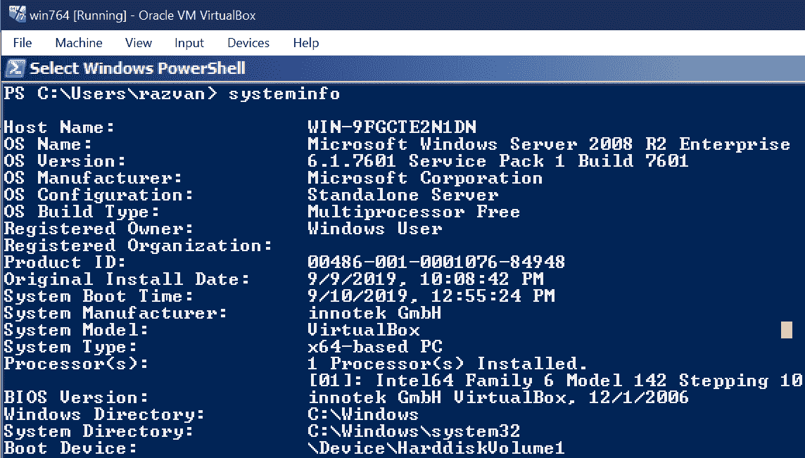
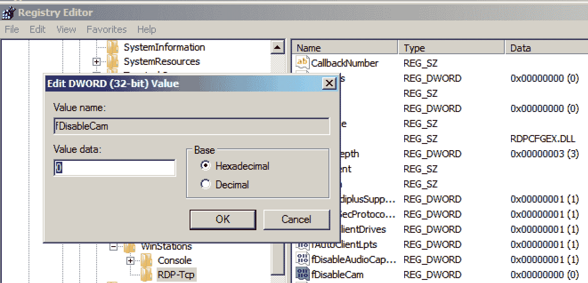
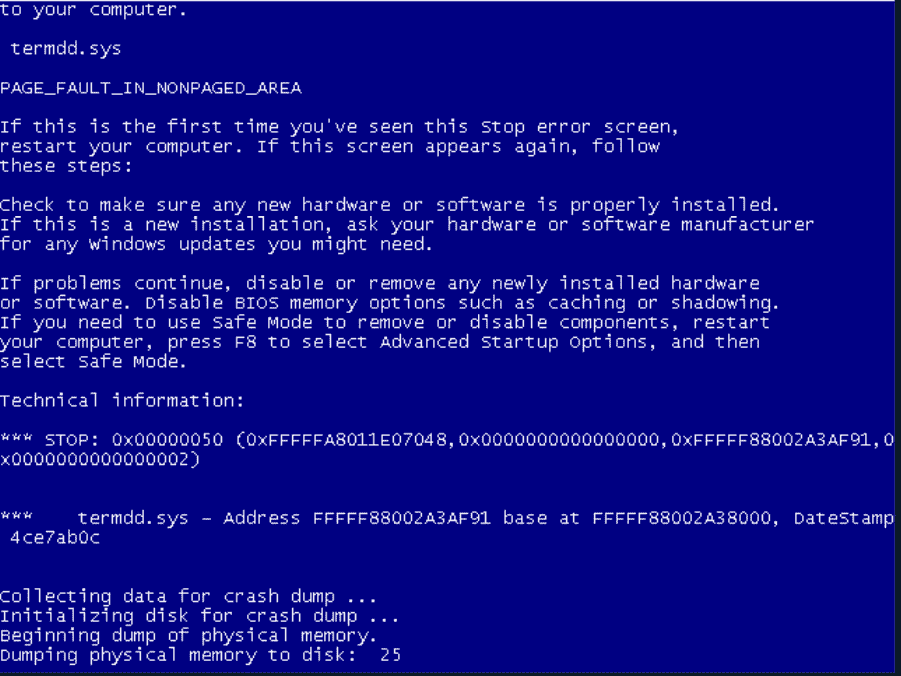
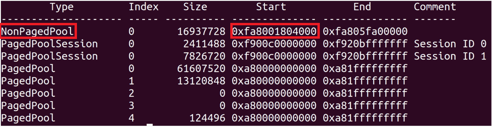
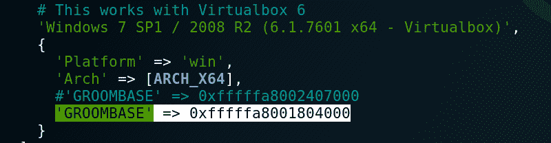
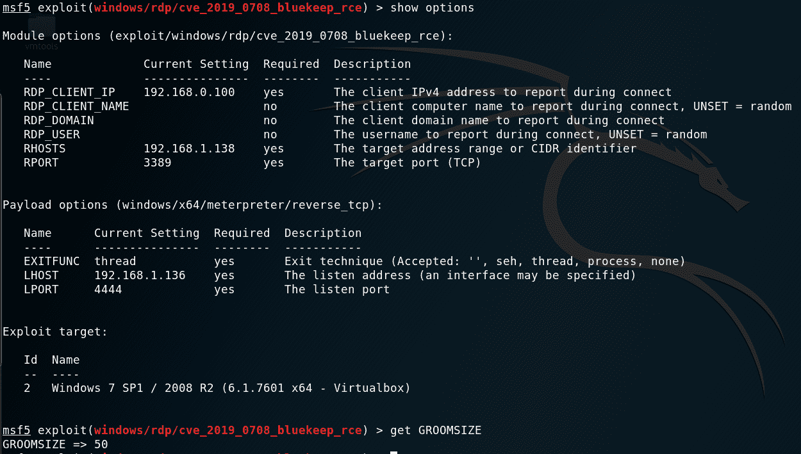
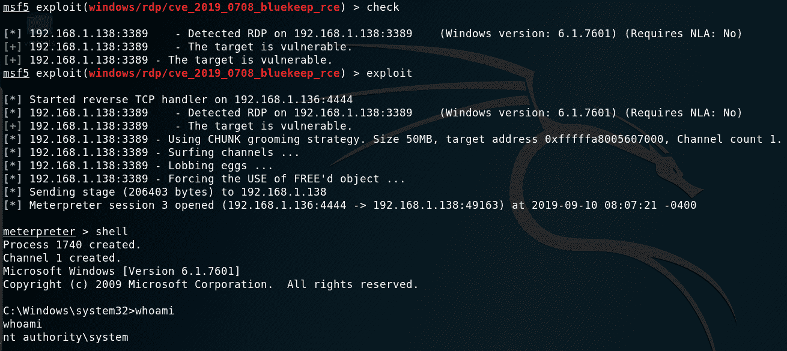

# 如何利用 Metasploit | Pentest-Tools.com 的 BlueKeep 漏洞

> 原文：<https://pentest-tools.com/blog/bluekeep-exploit-metasploit>

在本文中，我们展示了我们利用最近提出的 [Metasploit 模块](https://github.com/rapid7/metasploit-framework/pull/12283)来利用 [RDP 蓝牙漏洞](https://pentest-tools.com/blog/microsoft-rdp-vulnerability)的方法。

我们展示了如何通过调整 Metasploit 模块代码(GROOMBASE 和 GROOMSIZE 值)在易受攻击的 Windows 2008 R2 计算机上获取 Meterpreter 外壳，因为**该漏洞目前不能开箱即用**。

接下来，我们将解释让模块在我们的目标机器上正常工作的步骤:

1.  [**背景**](#1-background)

2.  [**先决条件**](#2-prerequisites)

3.  [**在 Metasploit** 中安装 Bluekeep 漏洞利用模块](#3-installing-the-bluekeep-exploit-module-in-metasploit)

4.  [**准备目标机**](#4-setting-up-the-target-machine)

5.  [**调整蓝调漏洞利用**](#5-adjusting-the-bluekeep-exploit-groombase)

6.  [**运行漏洞利用模块**](#6-running-the-bluekeep-exploit-module)

7.  [**结论**](#7-conclusions)

## **1。背景**

BlueKeep 是微软 RDP 服务中的一个严重的远程代码执行漏洞。由于该漏洞可以被蠕虫攻击，它已经引起了安全社区的极大关注，与[永恒之蓝 MS17-010](https://docs.microsoft.com/en-us/security-updates/securitybulletins/2017/ms17-010) 和 [Conficker MS08-067](https://www.sans.org/security-resources/malwarefaq/conficker-worm) 属于同一类别。我们发布了[对 BlueKeep 漏洞](https://pentest-tools.com/blog/microsoft-rdp-vulnerability)的深入分析，以帮助你了解全貌。

几天前，一位 Metasploit 贡献者——[zero sum 0x 0](https://twitter.com/zerosum0x0)——向包含 BlueKeep(CVE-2019-0708)漏洞利用模块的框架提交了一个 [pull 请求](https://github.com/rapid7/metasploit-framework/pull/12283)。Rapid7 团队也在他们的博客上发表了一篇关于这个漏洞的文章。

截至目前，该模块尚未集成到主 Metasploit 分支中(它仍然是一个拉请求)，它只针对 64 位版本的 Windows 2008 R2 和 Windows 7 SP1。此外，该模块现在被列为**手动**，因为用户需要提供关于目标的额外信息，否则，它有与 BSOD 崩溃的风险。

## **2。先决条件**

为了让这个场景工作，我们使用了以下内容:

*   **VirtualBox 6** 用于托管目标 Windows 虚拟机

*   过时的 Windows 2008 R2 64 位。iso 图像；我们的目标虚拟机上安装的最新修补程序是:KB2888049 和 KB976902

*   一台 **Linux 机器**在哪里安装 Metasploit(可以是虚拟机或物理机)

在 Linux 机器上，首先，我们需要克隆 Metasploit 项目:

```
$ git clone https://github.com/rapid7/metasploit-framework.git
$ cd metasploit-framework
```

然后我们需要获得上面提到的带有拉请求的分支:

```
$ git fetch origin pull/12283/head:bluekeep
$ git checkout bluekeep
```

之后，我们安装 Metasploit 所需的依赖项:

```
$ gem install bundler && bundle
```

在此步骤中，您可能会遇到类似这样的错误:`An error occurred while installing pg (0.21.0), and Bundler cannot continue. Make sure that gem install pg -v '0.21.0' --source 'https://rubygems.org/' succeeds before Bundling.`

要修复它，您需要安装 PostgreSQL 的开发库:

```
apt-get install libpq-dev
```

我们遇到的另一个错误是:`An error occurred while installing pcaprub (0.13.0), and Bundler cannot continue. Make sure that gem install pcaprub -v '0.13.0' --source 'https://rubygems.org/' succeeds before bundling.`

我们用以下方法解决了这个问题:

```
apt-get install libpcap-dev
```

此时，Metasploit 依赖项已正确安装，我们能够使用 BlueKeep 漏洞利用模块:

```
$ ./msfconsole
msf5 > use exploit/windows/rdp/cve_2019_0708_bluekeep_rce
```

## **4。设置目标机器**

我们的目标是安装在 Virtual Box 6 上的过时的 Windows 2008 R2 64 位机器。

下面是它的`systeminfo`输出:



目标虚拟机具有以下属性:

*   2GB 内存

*   1 核处理器

*   30 GB 硬盘存储容量

正如漏洞注释中所述，对于 Windows Server 2008，我们必须将以下注册表项`HKLM\\SYSTEM\\CurrentControlSet\\ Control\\TerminalServer\\ WinStations\\RDP-Tcp\\fDisableCam`设置为`0`。这不是该目标操作系统的默认设置，但它是 [RDPSND 通道](https://docs.microsoft.com/en-us/openspecs/windows_protocols/ms-rdpbcgr/fbb88576-40fc-4b20-a39b-042e75cb6f85)工作所必需的:



这个漏洞不是开箱即用的。我们获得了几个 BSODs，但没有一个壳。



## **5。调整 BlueKeep 漏洞利用(GROOMBASE)**

蓝屏文字表示我们有一个页面错误问题，这意味着一些内存地址没有正确设置。

我们真正需要的是正确的 GROOMBASE 值，它是[非分页池区域](https://docs.microsoft.com/en-us/windows/win32/memory/memory-pools) (NPP)的起始地址。

我们需要从目标机器的内存转储中提取 NPP 地址。

### **获取目标机器的内存转储**

这个操作用 VirtualBox 就可以轻松完成。目标机器需要在 VirtualBox 中启动，并且您需要运行以下命令(在您的 Windows 主机上)来获得内存转储:

```
cmd> C:\Program Files\Oracle\VirtualBox\VBoxManage.exe debugvm "vm_name" dumpvmcore --filename=vm.memdump
```

如果您在 Linux 主机上使用 VirtualBox，也可以使用以下命令:

```
$ VBoxManage debugvm <uuid|vmname> dumpvmcore [--filename=name]
```

*注意:*免费的 VMWare Workstation Player 15 版本不允许内存转储，因此我们建议使用 VirtualBox。

我们在 Docker 容器中使用[recall](https://github.com/google/rekall)来完成这个操作。下面是我们如何在主机上下载带有 rekall 的 Docker 映像:

```
$ docker pull remnux/rekall
```

现在，我们将内存转储复制到我们的主目录中，我们需要使它可以从 docker 容器中访问。为此，您需要使用以下命令运行 docker 容器:

```
$ cp dump_location/vm.memdump ~/bluekeep
$ docker run --rm -it -v ~/bluekeep:/home/nonroot/files remnux/rekall bash
```

现在，通过键入以下命令运行 rekall:

```
$ rekall -f files/dump_blue.memdump pools
```

输出应该是这样的:



这显示了 NPP 在您的虚拟机上的起始地址，该地址将被放置在漏洞的 GROOMBASE 变量中。

### **编辑漏洞利用模块**

利用漏洞的代码位于`modules/exploits/windows/rdp/ cve20190708bluekeeprce.rb`中，您需要在“Virtualbox 6”部分下设置 GROOMBASE 变量，用提取的 NPP 开始地址替换它。在我们的例子中，它是:`0xfa8001804000`。



现在您需要使用命令*重新加载*Metasploit 模块:

## **6。运行 BlueKeep 漏洞利用模块**

现在我们可以从 Metasploit 接口开始配置模块。

第一件事是将参数 GROOMSIZE 更改为 50。这与虚拟机拥有的内存量有关，这是适合我们情况的值。

其余参数是标准的(`RHOSTS`、`PAYLOAD`、`LHOST`)，您可以在下图中看到它们的配置:



*注意:*以 RDP_*开头的参数不需要配置。它们不会影响漏洞利用的功能。

我们还做了`set target 2`在 VirtualBox 上选择目标，然后运行`check`命令，然后再运行`exploit`:



如您所见，该漏洞使攻击者能够以用户 **NT AUTHORITY/SYSTEM** 的身份远程执行代码，该用户是在 Windows 机器上拥有最高级别权限的本地系统帐户。

## **7。结论**

尽管为 BlueKeep 提出的 Metasploit 模块没有为您提供具有默认配置的远程 shell，但它对 Metasploit 的添加促使系统管理员和家庭用户修补他们的 Windows 机器。

我们相信，安全社区将很快发现一种自动检测 NPP 起始地址的方法，这将使这种利用在多个目标上完全可靠。

#### **参考文献**